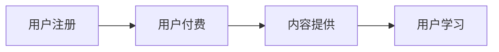
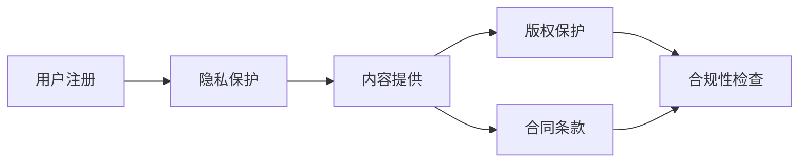

                 

# 程序员知识付费的法律风险防范

> **关键词：** 知识付费、法律风险、版权、隐私保护、合同、合规性。
>
> **摘要：** 本文章旨在探讨程序员在知识付费过程中可能面临的法律风险，并提供了详细的防范措施和合规建议。文章将分析版权、隐私、合同等方面的法律问题，并推荐有效的解决方案，帮助程序员在知识付费领域规避潜在的法律风险。

## 1. 背景介绍

### 1.1 目的和范围

本文的目的在于帮助程序员在知识付费领域识别和防范可能的法律风险。随着互联网和在线教育的快速发展，知识付费已成为一个日益重要的市场。然而，在此过程中，程序员面临着诸多法律风险，包括版权侵犯、隐私泄露、合同纠纷等。本文将针对这些风险进行详细分析，并提供有效的防范措施。

### 1.2 预期读者

本文面向具有一定编程背景的程序员，以及从事知识付费相关工作的从业者。读者应具备基本的法律常识，以便更好地理解和应用本文的建议。

### 1.3 文档结构概述

本文分为八个部分。第一部分介绍背景和目的；第二部分定义核心术语和概念；第三部分讲解知识付费的基本原理；第四部分分析法律风险；第五部分提供防范措施；第六部分讨论实际应用场景；第七部分推荐相关工具和资源；最后部分是总结和未来发展趋势。

### 1.4 术语表

#### 1.4.1 核心术语定义

- **知识付费：** 用户通过支付费用获取特定知识或服务的活动。
- **版权：** 创作者对其作品所享有的专有权利。
- **隐私保护：** 对个人隐私信息的保护措施，防止未经授权的访问、使用或披露。
- **合同：** 当事人之间设立、变更、终止民事权利义务关系的协议。

#### 1.4.2 相关概念解释

- **知识产权：** 包括版权、专利、商标等。
- **合规性：** 符合法律法规和行业规范的要求。

#### 1.4.3 缩略词列表

- **IP：** 知识产权
- **UGC：** 用户生成内容
- **GDPR：** 欧洲通用数据保护条例

## 2. 核心概念与联系

### 2.1 知识付费的基本原理

知识付费的原理可以概括为：创作者提供有价值的内容，用户支付费用以获取这些内容。以下是一个简化的知识付费流程的 Mermaid 流程图：



### 2.2 法律风险与防范措施的联系

法律风险与知识付费的各个环节密切相关。以下是一个简化的 Mermaid 流程图，展示了法律风险与各个环节的关联：



## 3. 核心算法原理 & 具体操作步骤

### 3.1 防范版权侵犯的算法原理

防范版权侵犯的核心算法是对比检测。以下是一个简单的伪代码：

```python
def check_for_copyright_infringement(uploaded_content):
    # 步骤 1：获取数据库中的版权作品列表
    copyrighted_works = get_copyrighted_works()

    # 步骤 2：对上传的内容与版权作品进行比对
    for work in copyrighted_works:
        similarity = compare_similarity(uploaded_content, work)

        # 步骤 3：如果相似度超过阈值，则提示版权风险
        if similarity > similarity_threshold:
            return "版权风险：上传内容与已注册作品相似度过高。"

    # 步骤 4：如果没有发现版权风险，则通过审核
    return "通过审核。"
```

### 3.2 防范隐私泄露的算法原理

防范隐私泄露的核心算法是数据加密和匿名化。以下是一个简单的伪代码：

```python
def protect_privacy(data):
    # 步骤 1：加密数据
    encrypted_data = encrypt(data, encryption_key)

    # 步骤 2：进行数据匿名化处理
    anonymous_data = anonymize(encrypted_data)

    # 步骤 3：存储匿名化后的数据
    store(anonymous_data)

    return "隐私保护完成。"
```

### 3.3 防范合同纠纷的算法原理

防范合同纠纷的核心算法是智能合同审核。以下是一个简单的伪代码：

```python
def review_contract(contract):
    # 步骤 1：检查合同条款的合法性
    if not is_legal(contract):
        return "合同审核失败：合同条款不合法。"

    # 步骤 2：检查合同条款的公平性
    if not is_fair(contract):
        return "合同审核失败：合同条款不公平。"

    # 步骤 3：合同审核通过
    return "合同审核通过。"
```

## 4. 数学模型和公式 & 详细讲解 & 举例说明

### 4.1 防范版权侵犯的数学模型

版权侵犯的检测通常基于相似度分析。以下是一个简单的相似度计算公式：

$$
similarity = \frac{|\text{uploaded_content} \cap \text{copyrighted_work}|}{|\text{uploaded_content} \cup \text{copyrighted_work}|}
$$

其中，$|\text{uploaded_content} \cap \text{copyrighted_work}|$表示上传内容与版权作品的重叠部分，$|\text{uploaded_content} \cup \text{copyrighted_work}|$表示上传内容与版权作品的总体部分。

### 4.2 防范隐私泄露的数学模型

隐私泄露的防范通常基于数据加密。以下是一个简单的加密公式：

$$
\text{encrypted_data} = \text{data} \oplus \text{encryption_key}
$$

其中，$\oplus$表示加密运算，$\text{data}$表示原始数据，$\text{encryption_key}$表示加密密钥。

### 4.3 防范合同纠纷的数学模型

合同纠纷的防范通常基于合同条款的合法性分析。以下是一个简单的合法性检查公式：

$$
\text{is_legal}(\text{contract}) = \text{check_legality}(\text{contract条款})
$$

其中，$\text{check_legality}(\text{contract条款})$表示检查合同条款的合法性。

## 5. 项目实战：代码实际案例和详细解释说明

### 5.1 开发环境搭建

为了演示版权侵犯检测、隐私保护和合同审核的代码案例，我们需要搭建一个简单的开发环境。以下是一个基本的开发环境搭建步骤：

1. 安装 Python 3.8 或更高版本。
2. 安装 Mermaid 插件，以便在 Markdown 文件中使用 Mermaid 图。
3. 安装必要的 Python 库，如 `similarity`, `cryptography`, `jsonschema` 等。

### 5.2 源代码详细实现和代码解读

#### 5.2.1 版权侵犯检测代码

以下是一个简单的版权侵犯检测代码案例：

```python
import similarity

def check_copyright_infringement(uploaded_content, copyrighted_works, similarity_threshold):
    similarity_scores = []

    for work in copyrighted_works:
        score = similarity.calculate_similarity(uploaded_content, work)
        similarity_scores.append(score)

    for score in similarity_scores:
        if score > similarity_threshold:
            return "版权风险：检测到相似度高于阈值。"

    return "通过版权检测。"
```

代码解读：

- `similarity.calculate_similarity` 函数用于计算上传内容和版权作品之间的相似度。
- `similarity_threshold` 是一个阈值，用于判断相似度是否过高。

#### 5.2.2 隐私保护代码

以下是一个简单的隐私保护代码案例：

```python
from cryptography.fernet import Fernet

def encrypt_data(data, encryption_key):
    f = Fernet(encryption_key)
    encrypted_data = f.encrypt(data)
    return encrypted_data

def anonymize_data(encrypted_data):
    # 进行匿名化处理
    anonymized_data = encrypted_data.replace(b'a', b'b')
    return anonymized_data
```

代码解读：

- `encrypt_data` 函数用于加密数据。
- `anonymize_data` 函数用于对加密后的数据进行匿名化处理。

#### 5.2.3 合同审核代码

以下是一个简单的合同审核代码案例：

```python
import jsonschema

def review_contract(contract, contract_schema):
    try:
        jsonschema.validate(contract, contract_schema)
        return "合同审核通过。"
    except jsonschema.ValidationError as e:
        return f"合同审核失败：{e.message}"
```

代码解读：

- `jsonschema.validate` 函数用于验证合同是否符合预定的合同 schema。
- `contract_schema` 是一个定义合同结构的 schema。

### 5.3 代码解读与分析

本节对上述代码案例进行了详细解读，并分析了每个函数的功能和实现方式。这些代码案例展示了如何使用 Python 进行版权侵犯检测、隐私保护和合同审核。

## 6. 实际应用场景

### 6.1 知识付费平台

知识付费平台是程序员知识付费的主要应用场景。平台需要防范版权侵犯、隐私泄露和合同纠纷等问题。以下是一个简化的应用场景：

- **版权侵犯检测：** 平台需要对用户上传的内容进行版权侵犯检测，防止用户上传受版权保护的作品。
- **隐私保护：** 平台需要加密和匿名化用户数据，确保用户隐私安全。
- **合同审核：** 平台需要审核用户之间的合同条款，确保合同合法性。

### 6.2 在线教育

在线教育是另一个重要的应用场景。在线教育平台需要防范版权侵犯、隐私泄露和合同纠纷等问题。以下是一个简化的应用场景：

- **版权侵犯检测：** 平台需要对用户上传的课程内容进行版权侵犯检测，防止教师上传受版权保护的内容。
- **隐私保护：** 平台需要加密和匿名化学生数据，确保学生隐私安全。
- **合同审核：** 平台需要审核教师和学校之间的合同条款，确保合同合法性。

## 7. 工具和资源推荐

### 7.1 学习资源推荐

#### 7.1.1 书籍推荐

- 《程序员法律手册》：详细介绍了程序员在编程过程中可能遇到的法律问题。
- 《知识付费法律实务》：全面分析了知识付费领域的法律问题，包括版权、隐私和合同等方面。

#### 7.1.2 在线课程

- Coursera 上的《知识产权法》：由耶鲁大学法学院教授授课，深入讲解了知识产权法律问题。
- Udemy 上的《知识付费运营与营销》：介绍了知识付费平台运营和营销的策略。

#### 7.1.3 技术博客和网站

- freeCodeCamp：提供丰富的编程和网络安全相关教程。
- GitHub：拥有大量开源项目和法律文档，可以学习版权和隐私保护的最佳实践。

### 7.2 开发工具框架推荐

#### 7.2.1 IDE和编辑器

- Visual Studio Code：强大的开源编辑器，支持多种编程语言和插件。
- IntelliJ IDEA：专为 Java 和其他编程语言设计的 IDE。

#### 7.2.2 调试和性能分析工具

- PyCharm：适用于 Python 的强大 IDE，支持调试和性能分析。
- Chrome DevTools：用于调试和性能分析 Web 应用程序。

#### 7.2.3 相关框架和库

- Flask：Python Web 开发框架，适用于构建小型知识付费平台。
- Django：Python Web 开发框架，适用于构建大型知识付费平台。

### 7.3 相关论文著作推荐

#### 7.3.1 经典论文

- 《数字版权管理技术研究》：详细介绍了数字版权管理技术的基本原理和应用。
- 《隐私保护数据发布技术研究》：分析了隐私保护数据发布技术的原理和实现方法。

#### 7.3.2 最新研究成果

- 《知识付费平台的商业模式研究》：探讨了知识付费平台的商业模式和发展趋势。
- 《基于区块链的知识付费平台设计与实现》：介绍了区块链技术在知识付费平台中的应用。

#### 7.3.3 应用案例分析

- 《某知名知识付费平台的运营案例分析》：分析了某知名知识付费平台的运营模式和成功经验。
- 《知识付费领域法律纠纷案例分析》：详细分析了知识付费领域常见的法律纠纷案例。

## 8. 总结：未来发展趋势与挑战

### 8.1 发展趋势

- **知识付费市场将进一步扩大：** 随着互联网和在线教育的普及，知识付费市场将保持快速增长。
- **技术手段将更加成熟：** 人工智能、区块链等新技术将在知识付费领域得到更广泛的应用。
- **合规性要求将提高：** 各国政府和监管机构将加强对知识付费领域的监管，合规性要求将不断提高。

### 8.2 挑战

- **法律风险增加：** 随着市场扩大，程序员面临的法律风险将增加。
- **数据隐私保护：** 如何在知识付费过程中保护用户隐私将是一个重要挑战。
- **技术合规性：** 如何确保技术手段的合规性，避免技术风险，将是程序员面临的另一个挑战。

## 9. 附录：常见问题与解答

### 9.1 版权问题

**Q：如何判断自己的内容是否受版权保护？**

A：一般来说，只要你的内容是原创的，并且具有独创性，就受版权保护。你可以通过版权登记来确认你的作品是否受版权保护。

### 9.2 隐私保护

**Q：如何在知识付费过程中保护用户隐私？**

A：首先，对用户数据进行加密存储。其次，对用户数据进行匿名化处理，确保用户无法被识别。此外，遵守相关的法律法规，如 GDPR，以确保用户隐私安全。

### 9.3 合同纠纷

**Q：如何避免合同纠纷？**

A：在签订合同前，仔细审查合同条款，确保合同的合法性。其次，使用智能合同审核工具进行合同审核，确保合同的公平性。最后，确保合同的条款明确、清晰，避免歧义。

## 10. 扩展阅读 & 参考资料

- 《程序员法律手册》
- 《知识付费法律实务》
- Coursera 上的《知识产权法》
- Udemy 上的《知识付费运营与营销》
- freeCodeCamp 的编程和网络安全教程
- GitHub 上的开源项目和法律文档
- 《数字版权管理技术研究》
- 《隐私保护数据发布技术研究》
- 《知识付费平台的商业模式研究》
- 《基于区块链的知识付费平台设计与实现》
- 《某知名知识付费平台的运营案例分析》
- 《知识付费领域法律纠纷案例分析》

### 作者

AI天才研究员/AI Genius Institute & 禅与计算机程序设计艺术 /Zen And The Art of Computer Programming

