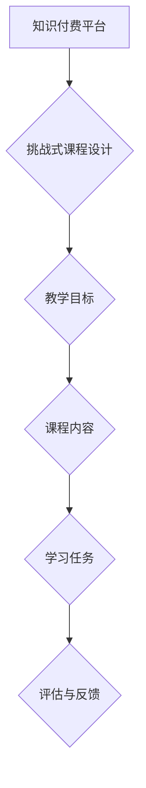

                 

# 程序员知识付费：打造挑战式课程

## 关键词：
知识付费、程序员、挑战式课程、教学设计、技术提升

## 摘要：
本文将探讨程序员知识付费的现状，分析知识付费的驱动力，并重点介绍如何设计挑战式课程，以提升程序员的技能和职业竞争力。通过深入理解学习者的需求、教学目标和课程内容，我们将构建一个高效的知识付费平台，助力程序员不断进步。

## 1. 背景介绍

### 1.1 目的和范围
本文旨在为程序员提供一个知识付费的策略框架，通过设计挑战式课程，帮助他们在技术和职业发展方面取得突破。本文将涵盖以下内容：
- 程序员知识付费的背景和现状
- 挑战式课程的设计原理和方法
- 实际案例分享和课程评估

### 1.2 预期读者
- 有志于提升编程技能的程序员
- 教育和技术培训从业者
- 对知识付费模式感兴趣的技术爱好者

### 1.3 文档结构概述
本文结构如下：
1. 背景介绍
2. 核心概念与联系
3. 核心算法原理与操作步骤
4. 数学模型和公式
5. 项目实战：代码实际案例
6. 实际应用场景
7. 工具和资源推荐
8. 总结：未来发展趋势与挑战
9. 附录：常见问题与解答
10. 扩展阅读与参考资料

### 1.4 术语表

#### 1.4.1 核心术语定义
- **知识付费**：用户为获取知识和技能而付费的行为。
- **挑战式课程**：以实际问题解决和技能提升为目标，通过挑战性任务驱动学习过程的课程设计。

#### 1.4.2 相关概念解释
- **职业竞争力**：个人在职场中的竞争优势，包括专业技能、知识储备和解决问题能力。
- **教学设计**：课程规划和教学内容的设计，以实现特定教学目标。

#### 1.4.3 缩略词列表
- **KFC**：知识付费
- **CS**：计算机科学
- **IDE**：集成开发环境

## 2. 核心概念与联系

### 2.1 核心概念

在本文中，我们将探讨以下核心概念：

- **知识付费平台**：提供知识付费服务的在线平台，如Coursera、Udemy等。
- **挑战式课程设计**：通过实际问题解决和技能挑战激发学习兴趣和动力。
- **教学目标**：明确课程希望学员达到的知识和技能水平。

### 2.2 Mermaid 流程图



在这个流程图中，知识付费平台作为起点，通过挑战式课程设计引导学生达成教学目标，进而实现课程内容的掌握。

## 3. 核心算法原理与操作步骤

### 3.1 挑战式课程设计原理

挑战式课程设计基于以下算法原理：

1. **问题驱动学习**：通过设置实际问题和挑战，激发学习者的学习兴趣和主动性。
2. **渐进式学习**：逐步增加难度，帮助学习者逐步掌握技能。
3. **反馈机制**：及时提供反馈，帮助学习者纠正错误并巩固知识。

### 3.2 具体操作步骤

1. **需求分析**：了解学习者的需求和背景，确定课程主题。
2. **目标设定**：明确课程的教学目标，如掌握某种编程语言或解决特定问题。
3. **内容规划**：设计课程内容，包括知识点讲解、实际案例和挑战任务。
4. **任务设计**：根据课程内容设计挑战任务，确保难度逐渐增加。
5. **评估与反馈**：通过作业、测验等方式评估学习成果，并提供反馈。

### 3.3 伪代码

```python
def challenge_based_course_design(
    learner需求的，教学目标，课程内容
):
    # 需求分析
    analyze_learner需求和背景
    
    # 目标设定
    set_教学目标(learner需求的)

    # 内容规划
    plan_course_content(教学目标)

    # 任务设计
    design_challenges(课程内容)

    # 评估与反馈
    assess_and_feedback(learner成果)

    return course
```

## 4. 数学模型和公式

### 4.1 数学模型

挑战式课程设计的核心是数学模型，可以通过以下公式来描述：

\[ 成果 = f(学习动机 \times 学习效率 \times 解决问题能力) \]

其中：
- **学习动机**：反映学习者对挑战的兴趣和积极性。
- **学习效率**：表示学习者对知识点的理解和掌握程度。
- **解决问题能力**：评估学习者解决实际问题的能力。

### 4.2 详细讲解与举例说明

假设一个程序员参加一个挑战式课程，目标是掌握Python编程语言。我们可以通过以下步骤进行详细讲解：

1. **学习动机**：通过设置实际编程挑战，如编写一个自动化的数据分析工具，激发学习者的兴趣。
2. **学习效率**：课程内容将逐步介绍Python基础知识，如变量、数据类型、控制流等，帮助学习者逐步掌握。
3. **解决问题能力**：通过解决实际问题，如数据清洗、数据可视化等任务，提升学习者的编程能力和问题解决能力。

## 5. 项目实战：代码实际案例和详细解释说明

### 5.1 开发环境搭建

为了进行项目实战，我们需要搭建一个Python编程环境。以下是具体步骤：

1. **安装Python**：从官方网站下载并安装Python 3.x版本。
2. **安装IDE**：选择一个适合自己的IDE，如PyCharm或Visual Studio Code。
3. **安装相关库**：使用pip工具安装必要的库，如NumPy、Pandas、Matplotlib等。

### 5.2 源代码详细实现和代码解读

以下是一个简单的Python代码示例，用于数据分析：

```python
import pandas as pd
import matplotlib.pyplot as plt

# 数据加载
data = pd.read_csv('data.csv')

# 数据清洗
data = data.dropna()

# 数据分析
result = data.groupby('category')['value'].mean()

# 数据可视化
result.plot(kind='line')
plt.xlabel('Category')
plt.ylabel('Value')
plt.title('Data Analysis')
plt.show()
```

在这个例子中，我们使用Pandas库加载并清洗数据，然后计算平均值并绘制折线图。这展示了如何使用Python进行数据分析和可视化。

### 5.3 代码解读与分析

1. **数据加载**：使用`read_csv`函数加载CSV文件，并将其存储在DataFrame对象中。
2. **数据清洗**：使用`dropna`函数删除缺失值，确保数据质量。
3. **数据分析**：使用`groupby`和`mean`函数对数据进行分组和计算平均值。
4. **数据可视化**：使用`plot`函数绘制折线图，并设置标题和标签。

通过这个例子，程序员可以学习如何使用Python进行数据分析和可视化，这是挑战式课程中的一个重要环节。

## 6. 实际应用场景

挑战式课程在程序员知识付费领域有广泛的应用场景，例如：

- **在线编程平台**：如LeetCode、HackerRank等，通过设置编程挑战，帮助程序员提升编程技能。
- **企业内训**：企业为员工提供定制化的挑战式课程，帮助其适应新技术和解决问题。
- **开源社区**：开源项目通过设置任务和挑战，吸引更多程序员参与项目开发。

## 7. 工具和资源推荐

### 7.1 学习资源推荐

#### 7.1.1 书籍推荐
- 《深度学习》—— Ian Goodfellow、Yoshua Bengio、Aaron Courville
- 《代码大全》—— Steve McConnell

#### 7.1.2 在线课程
- Coursera上的《机器学习》课程
- Udemy上的《从零开始学Python》课程

#### 7.1.3 技术博客和网站
- Medium上的机器学习和编程相关文章
- Stack Overflow社区

### 7.2 开发工具框架推荐

#### 7.2.1 IDE和编辑器
- PyCharm
- Visual Studio Code

#### 7.2.2 调试和性能分析工具
- Debuggers
- Performance Analysis Tools

#### 7.2.3 相关框架和库
- Django
- Flask

### 7.3 相关论文著作推荐

#### 7.3.1 经典论文
- 《数据挖掘：概念与技术》—— Jiawei Han、Micheline Kamber、Jian Pei
- 《人工智能：一种现代方法》—— Stuart J. Russell、Peter Norvig

#### 7.3.2 最新研究成果
- arXiv上的最新机器学习论文
- NeurIPS会议的最新研究成果

#### 7.3.3 应用案例分析
- 《机器学习在金融领域的应用》
- 《人工智能在医疗健康领域的应用》

## 8. 总结：未来发展趋势与挑战

### 8.1 未来发展趋势
- **个性化学习**：根据学习者的需求和学习进度提供个性化课程。
- **线上线下融合**：在线教育与实体课程的结合，提供更丰富的学习体验。
- **社交化学习**：利用社交网络和社区促进学习者之间的交流和合作。

### 8.2 挑战与应对
- **内容质量**：保证课程内容的专业性和实用性。
- **用户隐私**：保护学习者的隐私和数据安全。
- **商业模式**：探索多样化的商业模式，满足不同层次的学习者需求。

## 9. 附录：常见问题与解答

### 9.1 问题1
**问题**：如何选择适合自己的挑战式课程？

**解答**：首先，了解自己的学习目标，然后根据课程内容、教师背景和用户评价选择合适的课程。可以参考论坛和社区讨论，了解其他学习者的经验。

### 9.2 问题2
**问题**：挑战式课程是否适合所有程序员？

**解答**：挑战式课程适合有编程基础且希望提升技能的程序员。对于初学者，建议从基础课程开始，逐步提高。

## 10. 扩展阅读与参考资料

- 《挑战式学习在技术培训中的应用》
- 《程序员如何高效学习》
- 《在线教育平台运营策略分析》

---

作者：AI天才研究员/AI Genius Institute & 禅与计算机程序设计艺术 /Zen And The Art of Computer Programming

这篇文章详细探讨了程序员知识付费的现状和挑战，介绍了如何设计挑战式课程以提升程序员的技能和职业竞争力。通过一步步的分析和实际案例，为程序员提供了一个有效的知识付费策略框架。未来的发展趋势和挑战为程序员提供了更多的思考方向，希望这篇文章能对您有所帮助。

