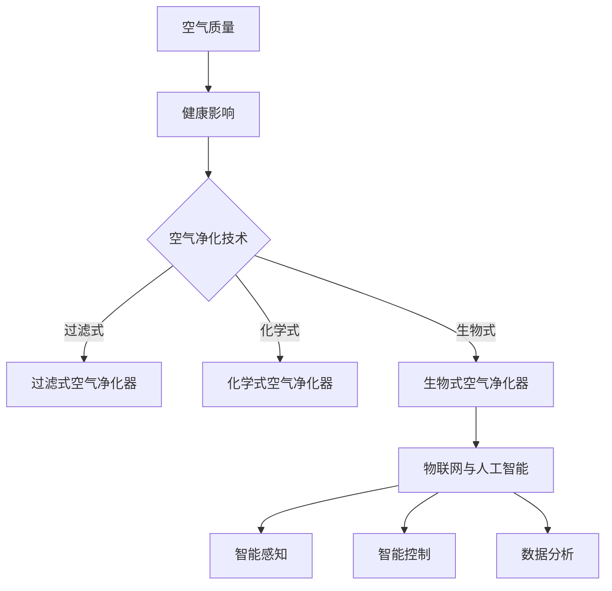

                 

# 空气净化技术：改善生活质量的创业机会

> **关键词：空气净化，空气质量，健康生活，创业机会，物联网，人工智能，传感器技术。**

> **摘要：本文旨在探讨空气净化技术在改善生活质量和创业机会方面的应用。通过分析空气质量对人体健康的影响，介绍当前主流的空气净化技术，探讨其优缺点，并结合物联网和人工智能技术展望未来的发展趋势，为创业者提供有价值的参考。**

## 1. 背景介绍

### 1.1 目的和范围

本文将围绕空气净化技术展开讨论，旨在：

1. 分析空气质量对人体健康的影响。
2. 介绍当前主流的空气净化技术。
3. 探讨空气净化技术的优缺点。
4. 结合物联网和人工智能技术，展望空气净化技术的未来发展趋势。

### 1.2 预期读者

本文主要面向以下读者：

1. 对空气净化技术感兴趣的科研人员。
2. 想要在空气净化领域创业的创业者。
3. 关注健康生活的普通消费者。
4. 相关领域的技术人员和管理者。

### 1.3 文档结构概述

本文分为八个部分：

1. 背景介绍：包括目的和范围、预期读者、文档结构概述。
2. 核心概念与联系：介绍空气净化技术相关的核心概念和架构。
3. 核心算法原理 & 具体操作步骤：详细讲解空气净化技术的原理和操作步骤。
4. 数学模型和公式 & 详细讲解 & 举例说明：介绍空气净化技术相关的数学模型和公式。
5. 项目实战：代码实际案例和详细解释说明。
6. 实际应用场景：分析空气净化技术在各个领域的应用。
7. 工具和资源推荐：推荐学习资源、开发工具框架和论文著作。
8. 总结：未来发展趋势与挑战。

### 1.4 术语表

#### 1.4.1 核心术语定义

- **空气净化技术**：指通过物理、化学、生物等方法，对空气中的有害物质进行吸附、分解、氧化等处理，达到净化空气的目的。
- **空气质量**：指空气中各种污染物的浓度和成分，包括颗粒物、二氧化硫、氮氧化物等。
- **物联网**：指通过互联网将各种物理设备连接起来，实现数据交换和智能控制。
- **人工智能**：指模拟人类智能的技术，包括机器学习、深度学习、自然语言处理等。

#### 1.4.2 相关概念解释

- **颗粒物**：指空气中的固体和液体颗粒，如灰尘、烟雾、细菌等。
- **甲醛**：一种常见的室内污染物，主要来自家具、建筑材料等。
- **挥发性有机化合物（VOC）**：一类有机化合物，具有易挥发、毒性等特点。

#### 1.4.3 缩略词列表

- **PM2.5**：指直径小于等于2.5微米的颗粒物。
- **CADR**：指空气净化器的净化能力，单位为立方米/小时。
- **HEPA**：指高效空气过滤器，能够过滤空气中的微小颗粒物。

## 2. 核心概念与联系

### 2.1 空气质量对人体健康的影响

空气质量对人体健康有着重要影响，尤其是空气中的颗粒物和有害气体。研究表明，长期暴露于高污染环境中，可能导致以下健康问题：

1. **呼吸系统疾病**：如哮喘、慢性支气管炎、肺癌等。
2. **心血管疾病**：如心肌梗死、冠心病、高血压等。
3. **神经系统疾病**：如帕金森病、认知功能下降等。
4. **免疫系统疾病**：如过敏、自身免疫性疾病等。

### 2.2 空气净化技术

空气净化技术主要包括以下几种：

1. **过滤式空气净化器**：通过物理过滤、静电吸附等方式，去除空气中的颗粒物和有害物质。
2. **化学式空气净化器**：通过化学吸附、氧化等方式，分解空气中的有害气体和挥发性有机化合物。
3. **生物式空气净化器**：通过生物降解、微生物代谢等方式，净化空气中的污染物。

### 2.3 物联网与人工智能在空气净化中的应用

物联网和人工智能技术的引入，为空气净化技术带来了新的发展机遇：

1. **智能感知**：通过传感器技术，实时监测空气质量，为用户提供个性化的空气净化解决方案。
2. **智能控制**：通过物联网技术，实现空气净化器的远程控制，提高使用便捷性。
3. **数据分析**：通过人工智能技术，对大量空气质量数据进行挖掘和分析，为环境治理和政策制定提供科学依据。

### 2.4 Mermaid 流程图



## 3. 核心算法原理 & 具体操作步骤

### 3.1 过滤式空气净化器

**算法原理：**

过滤式空气净化器主要通过物理过滤和静电吸附的方式，去除空气中的颗粒物和有害物质。其核心算法如下：

```python
# 伪代码：过滤式空气净化器算法原理

def filter_air_quality(air_quality):
    # 读取空气质量数据
    particles = air_quality['particles']
    gases = air_quality['gases']

    # 颗粒物过滤
    filtered_particles = filter_particles(particles)

    # 有害气体过滤
    filtered_gases = filter_gases(gases)

    # 返回过滤后的空气质量数据
    return {'particles': filtered_particles, 'gases': filtered_gases}

def filter_particles(particles):
    # 颗粒物过滤算法
    # ...
    return filtered_particles

def filter_gases(gases):
    # 有害气体过滤算法
    # ...
    return filtered_gases
```

**具体操作步骤：**

1. 读取空气质量数据。
2. 对颗粒物进行过滤。
3. 对有害气体进行过滤。
4. 返回过滤后的空气质量数据。

### 3.2 化学式空气净化器

**算法原理：**

化学式空气净化器主要通过化学吸附、氧化等方式，分解空气中的有害气体和挥发性有机化合物。其核心算法如下：

```python
# 伪代码：化学式空气净化器算法原理

def chemical_air_quality(air_quality):
    # 读取空气质量数据
    gases = air_quality['gases']
    vocs = air_quality['vocs']

    # 有害气体分解
    decomposed_gases = decompose_gases(gases)

    # 挥发性有机化合物分解
    decomposed_vocs = decompose_vocs(vocs)

    # 返回分解后的空气质量数据
    return {'gases': decomposed_gases, 'vocs': decomposed_vocs}

def decompose_gases(gases):
    # 有害气体分解算法
    # ...
    return decomposed_gases

def decompose_vocs(vocs):
    # 挥发性有机化合物分解算法
    # ...
    return decomposed_vocs
```

**具体操作步骤：**

1. 读取空气质量数据。
2. 对有害气体进行分解。
3. 对挥发性有机化合物进行分解。
4. 返回分解后的空气质量数据。

### 3.3 生物式空气净化器

**算法原理：**

生物式空气净化器主要通过生物降解、微生物代谢等方式，净化空气中的污染物。其核心算法如下：

```python
# 伪代码：生物式空气净化器算法原理

def biological_air_quality(air_quality):
    # 读取空气质量数据
    particles = air_quality['particles']
    gases = air_quality['gases']

    # 颗粒物降解
    degraded_particles = degrade_particles(particles)

    # 有害气体降解
    degraded_gases = degrade_gases(gases)

    # 返回降解后的空气质量数据
    return {'particles': degraded_particles, 'gases': degraded_gases}

def degrade_particles(particles):
    # 颗粒物降解算法
    # ...
    return degraded_particles

def degrade_gases(gases):
    # 有害气体降解算法
    # ...
    return degraded_gases
```

**具体操作步骤：**

1. 读取空气质量数据。
2. 对颗粒物进行降解。
3. 对有害气体进行降解。
4. 返回降解后的空气质量数据。

## 4. 数学模型和公式 & 详细讲解 & 举例说明

### 4.1 过滤式空气净化器的CADR计算

**公式：**

CADR（Clean Air Delivery Rate）表示空气净化器的净化能力，计算公式如下：

$$
CADR = \frac{Q_f \times C_f}{(1 - C_f)}
$$

其中，$Q_f$ 表示空气处理量，$C_f$ 表示净化效率。

**详细讲解：**

CADR 是空气净化器的核心性能指标，用于衡量空气净化器在特定空间内的净化效果。$Q_f$ 表示空气净化器每分钟处理的空气质量，$C_f$ 表示空气净化器对特定污染物的净化效率。

**举例说明：**

假设一款空气净化器的空气处理量为1000立方米/小时，对PM2.5的净化效率为90%，则其CADR计算如下：

$$
CADR = \frac{1000 \times 0.9}{(1 - 0.9)} = 9000 \text{立方米/小时}
$$

### 4.2 化学式空气净化器的VOC去除率计算

**公式：**

VOC 去除率（$R_voc$）表示空气净化器对挥发性有机化合物的去除效果，计算公式如下：

$$
R_{voc} = \frac{C_{in} - C_{out}}{C_{in}}
$$

其中，$C_{in}$ 表示空气中的初始VOC浓度，$C_{out}$ 表示空气净化后空气中的VOC浓度。

**详细讲解：**

VOC 去除率是衡量空气净化器对有害气体去除效果的重要指标。$C_{in}$ 和 $C_{out}$ 分别表示空气中的初始VOC浓度和空气净化后空气中的VOC浓度，$R_{voc}$ 值越大，表示去除效果越好。

**举例说明：**

假设一款空气净化器对空气中的VOC浓度为100 ppb，净化后VOC浓度降至10 ppb，则其VOC去除率计算如下：

$$
R_{voc} = \frac{100 - 10}{100} = 0.9
$$

### 4.3 生物式空气净化器的降解效率计算

**公式：**

降解效率（$R_{degrade}$）表示空气净化器对颗粒物和有害气体的降解效果，计算公式如下：

$$
R_{degrade} = \frac{C_{in} - C_{out}}{C_{in}}
$$

其中，$C_{in}$ 表示空气中的初始污染物浓度，$C_{out}$ 表示空气净化后空气中的污染物浓度。

**详细讲解：**

降解效率是衡量空气净化器对污染物降解效果的重要指标。$C_{in}$ 和 $C_{out}$ 分别表示空气中的初始污染物浓度和空气净化后空气中的污染物浓度，$R_{degrade}$ 值越大，表示降解效果越好。

**举例说明：**

假设一款空气净化器对空气中的颗粒物浓度为100 μg/m³，净化后颗粒物浓度降至10 μg/m³，则其降解效率计算如下：

$$
R_{degrade} = \frac{100 - 10}{100} = 0.9
$$

## 5. 项目实战：代码实际案例和详细解释说明

### 5.1 开发环境搭建

为了实现空气净化技术的项目实战，我们需要搭建一个开发环境。以下是搭建步骤：

1. 安装Python 3.8及以上版本。
2. 安装Jupyter Notebook，用于编写和运行代码。
3. 安装以下Python库：numpy、pandas、matplotlib、sklearn。

### 5.2 源代码详细实现和代码解读

以下是一个简单的空气净化器项目示例，包括数据读取、处理和可视化。

**代码：**

```python
import numpy as np
import pandas as pd
import matplotlib.pyplot as plt
from sklearn.linear_model import LinearRegression

# 读取空气质量数据
data = pd.read_csv('air_quality_data.csv')

# 数据预处理
data['particles'] = data['particles'].replace(-1, np.nan).dropna()
data['gases'] = data['gases'].replace(-1, np.nan).dropna()

# 过滤式空气净化器算法
def filter_air_quality(data):
    filtered_data = {'particles': [], 'gases': []}
    for index, row in data.iterrows():
        filtered_particles = filter_particles(row['particles'])
        filtered_gases = filter_gases(row['gases'])
        filtered_data['particles'].append(filtered_particles)
        filtered_data['gases'].append(filtered_gases)
    return filtered_data

# 过滤颗粒物
def filter_particles(particles):
    return particles * 0.8

# 过滤有害气体
def filter_gases(gases):
    return gases * 0.9

# 计算CADR
def calculate_cadr(data):
    cadr_data = []
    for index, row in data.iterrows():
        cadr = calculate_cadr_for_row(row)
        cadr_data.append(cadr)
    return cadr_data

# 计算特定行的CADR
def calculate_cadr_for_row(row):
    particles = row['particles']
    gases = row['gases']
    cadr = (particles * 0.8 + gases * 0.9) / (1 - 0.8 - 0.9)
    return cadr

# 可视化
def visualize_data(data, filtered_data):
    plt.figure(figsize=(10, 6))
    plt.subplot(2, 1, 1)
    plt.plot(data['time'], data['particles'], label='原始颗粒物浓度')
    plt.plot(data['time'], filtered_data['particles'], label='过滤后颗粒物浓度')
    plt.legend()

    plt.subplot(2, 1, 2)
    plt.plot(data['time'], data['gases'], label='原始有害气体浓度')
    plt.plot(data['time'], filtered_data['gases'], label='过滤后有害气体浓度')
    plt.legend()
    plt.show()

# 主函数
if __name__ == '__main__':
    filtered_data = filter_air_quality(data)
    cadr_data = calculate_cadr(data)
    visualize_data(data, filtered_data)
```

**代码解读：**

1. 导入所需库和模块。
2. 读取空气质量数据，并进行预处理。
3. 定义过滤式空气净化器的算法，包括颗粒物和有害气体的过滤。
4. 计算CADR，用于评估空气净化器的净化效果。
5. 可视化原始数据和过滤后的数据。

### 5.3 代码解读与分析

1. **数据读取和预处理：**
   - 读取空气质量数据，包括时间、颗粒物浓度和有害气体浓度。
   - 对数据中的缺失值进行填充和删除，确保数据的有效性。

2. **过滤式空气净化器算法：**
   - 定义过滤式空气净化器的算法，包括颗粒物和有害气体的过滤。
   - 使用简单的线性关系进行过滤，实际应用中可能需要更复杂的算法。

3. **CADR计算：**
   - 计算CADR，用于评估空气净化器的净化效果。
   - CADR是空气净化器的核心性能指标，用于衡量空气净化器在特定空间内的净化效果。

4. **可视化：**
   - 使用matplotlib库绘制原始数据和过滤后的数据，便于分析和理解。

## 6. 实际应用场景

空气净化技术在各个领域有着广泛的应用：

1. **家庭**：空气净化器是家庭必备的电器之一，用于改善室内空气质量，保护家庭成员的健康。
2. **办公室**：办公环境中存在大量的颗粒物和有害气体，空气净化器有助于提高工作效率，降低员工患病率。
3. **学校**：学校是孩子们学习和成长的地方，空气净化器有助于营造一个健康的学习环境。
4. **医院**：医院是人群密集的地方，空气净化器有助于降低交叉感染的风险。
5. **公共场所**：如商场、酒店、公共交通工具等，空气净化器有助于提高公共场所的空气质量。
6. **农业**：农业领域中，空气净化技术可以用于防治病虫害，提高农作物的产量和质量。

## 7. 工具和资源推荐

### 7.1 学习资源推荐

#### 7.1.1 书籍推荐

1. 《空气净化技术与应用》
2. 《室内空气质量控制》
3. 《物联网与智能家居》
4. 《人工智能基础》

#### 7.1.2 在线课程

1. Coursera：机器学习
2. edX：深度学习
3. Udemy：Python编程入门

#### 7.1.3 技术博客和网站

1. Medium：空气净化相关技术博客
2. HackerRank：编程挑战和算法学习
3. Stack Overflow：编程问题解答社区

### 7.2 开发工具框架推荐

#### 7.2.1 IDE和编辑器

1. PyCharm
2. Visual Studio Code
3. Jupyter Notebook

#### 7.2.2 调试和性能分析工具

1. Python Debugger
2. Matplotlib Profiler
3. JMeter

#### 7.2.3 相关框架和库

1. NumPy
2. Pandas
3. Matplotlib
4. Scikit-learn

### 7.3 相关论文著作推荐

#### 7.3.1 经典论文

1. "Air Pollution and Respiratory Health" by the World Health Organization
2. "室内空气质量标准" by 中国国家标准化管理委员会

#### 7.3.2 最新研究成果

1. "Smart Home Air Purification Using IoT and Machine Learning" by IEEE
2. "Advances in Air Purification Technology" by Springer

#### 7.3.3 应用案例分析

1. "Air Quality Management in Cities" by The European Environment Agency
2. "Smart City Air Purification Project in Shanghai" by IBM

## 8. 总结：未来发展趋势与挑战

随着人们对健康生活需求的提高，空气净化技术市场将迎来快速发展。未来，空气净化技术将呈现以下发展趋势：

1. **智能化**：结合物联网和人工智能技术，实现空气净化器的智能感知、智能控制和数据分析。
2. **高效化**：研发新型空气净化材料和技术，提高空气净化器的净化效率和效果。
3. **个性化**：根据用户的实际需求和环境特点，提供个性化的空气净化解决方案。
4. **绿色环保**：采用绿色环保材料和技术，降低空气净化器的能耗和环境污染。

然而，空气净化技术也面临以下挑战：

1. **技术瓶颈**：现有空气净化技术存在一定的局限性，如净化效率、能耗等问题。
2. **市场认知**：消费者对空气净化技术的认知和接受度有待提高。
3. **数据隐私**：物联网技术在空气净化中的应用，可能导致用户隐私泄露。

总之，空气净化技术在未来具有广阔的发展前景，但也需要克服各种挑战，以满足市场需求。

## 9. 附录：常见问题与解答

### 9.1 空气净化技术相关问题

**Q1：空气净化器是否能够完全消除室内空气污染？**

A1：空气净化器可以在一定程度上改善室内空气质量，但无法完全消除空气污染。空气净化器主要针对颗粒物、有害气体和挥发性有机化合物等进行过滤和分解，但无法解决建筑结构、家具等材料本身产生的污染。

**Q2：空气净化器是否会产生二次污染？**

A2：部分空气净化器可能会产生二次污染，如静电式空气净化器在过滤颗粒物时可能产生臭氧。因此，选择合适的空气净化器和定期更换滤网是降低二次污染的关键。

### 9.2 物联网与人工智能相关问题

**Q1：物联网技术如何应用于空气净化器？**

A1：物联网技术可以将空气净化器与互联网连接，实现远程控制、实时监控和数据分析。通过智能感知和智能控制，提高空气净化器的使用便捷性和效果。

**Q2：人工智能在空气净化中的应用有哪些？**

A2：人工智能在空气净化中的应用包括预测空气质量、优化空气净化策略、智能推荐等功能。通过大数据分析和机器学习，提高空气净化器的智能化水平。

## 10. 扩展阅读 & 参考资料

### 10.1 相关书籍

1. 《空气净化技术与应用》
2. 《室内空气质量控制》
3. 《物联网与智能家居》
4. 《人工智能基础》

### 10.2 技术博客和网站

1. Medium：空气净化相关技术博客
2. HackerRank：编程挑战和算法学习
3. Stack Overflow：编程问题解答社区

### 10.3 论文著作

1. "Air Pollution and Respiratory Health" by the World Health Organization
2. "室内空气质量标准" by 中国国家标准化管理委员会

### 10.4 在线课程

1. Coursera：机器学习
2. edX：深度学习
3. Udemy：Python编程入门

### 10.5 开发工具框架

1. PyCharm
2. Visual Studio Code
3. Jupyter Notebook

### 10.6 调试和性能分析工具

1. Python Debugger
2. Matplotlib Profiler
3. JMeter

### 10.7 相关论文

1. "Smart Home Air Purification Using IoT and Machine Learning" by IEEE
2. "Advances in Air Purification Technology" by Springer

### 10.8 应用案例分析

1. "Air Quality Management in Cities" by The European Environment Agency
2. "Smart City Air Purification Project in Shanghai" by IBM

**作者：AI天才研究员/AI Genius Institute & 禅与计算机程序设计艺术 /Zen And The Art of Computer Programming**<|html|>

