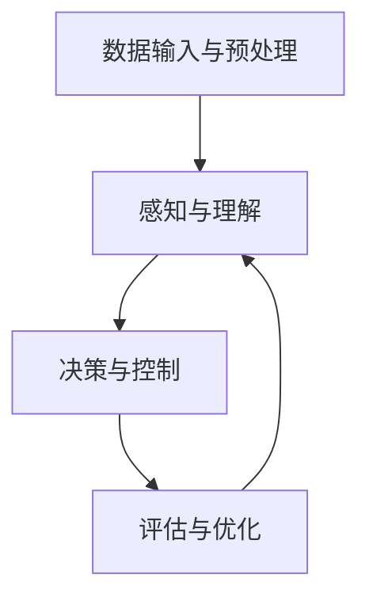

                 


# 端到端自动驾驶性能提升后评估难题

> **关键词：** 端到端自动驾驶、性能评估、深度学习、模型优化、数据集构建。

> **摘要：** 随着深度学习技术在自动驾驶领域的广泛应用，端到端自动驾驶系统在性能上取得了显著提升。然而，如何准确评估这些提升，特别是在复杂动态环境下的表现，成为了一个亟待解决的问题。本文将深入探讨端到端自动驾驶性能提升后的评估难题，分析现有评估方法及其局限性，并提出一些潜在的解决方案和未来研究方向。

## 1. 背景介绍

### 1.1 目的和范围

本文旨在分析端到端自动驾驶系统性能提升后的评估难题，为自动驾驶技术的进一步发展提供理论依据和实践指导。具体来说，我们将从以下几个方面展开讨论：

- 端到端自动驾驶技术的发展历程和现状。
- 当前主流的性能评估方法及其局限性。
- 如何构建更加科学和全面的数据集进行评估。
- 潜在的解决方案和未来研究方向。

### 1.2 预期读者

本文主要面向自动驾驶领域的科研人员、工程师和感兴趣的读者。希望通过本文，读者能够：

- 了解端到端自动驾驶技术的核心概念和发展趋势。
- 理解现有性能评估方法的优缺点。
- 掌握构建科学评估数据集的方法和技巧。
- 对自动驾驶技术未来的发展前景有更清晰的认识。

### 1.3 文档结构概述

本文分为以下几个部分：

- **第1章：背景介绍**：介绍本文的目的、范围、预期读者以及文档结构。
- **第2章：核心概念与联系**：阐述端到端自动驾驶的核心概念，并使用Mermaid流程图展示其原理和架构。
- **第3章：核心算法原理 & 具体操作步骤**：详细讲解端到端自动驾驶系统的算法原理和操作步骤。
- **第4章：数学模型和公式 & 详细讲解 & 举例说明**：介绍端到端自动驾驶系统的数学模型和公式，并进行举例说明。
- **第5章：项目实战：代码实际案例和详细解释说明**：通过实际案例展示端到端自动驾驶系统的代码实现和详细解释。
- **第6章：实际应用场景**：分析端到端自动驾驶技术在现实中的应用场景。
- **第7章：工具和资源推荐**：推荐相关学习资源、开发工具和框架。
- **第8章：总结：未来发展趋势与挑战**：总结端到端自动驾驶技术的发展趋势和面临的挑战。
- **第9章：附录：常见问题与解答**：回答读者可能遇到的常见问题。
- **第10章：扩展阅读 & 参考资料**：提供更多的扩展阅读和参考资料。

### 1.4 术语表

#### 1.4.1 核心术语定义

- **端到端自动驾驶（End-to-End Autonomous Driving）**：一种自动驾驶技术，通过将传感器数据直接输入到神经网络中，直接输出驾驶决策，如速度控制、转向、制动等。
- **深度学习（Deep Learning）**：一种人工智能技术，通过多层神经网络对数据进行自动特征提取和学习，具有强大的表达能力和泛化能力。
- **性能评估（Performance Evaluation）**：对自动驾驶系统在各种场景下的表现进行评估，以衡量其安全性和可靠性。
- **数据集构建（Dataset Construction）**：收集、整理和标注大量的道路驾驶数据，用于训练和评估自动驾驶模型。

#### 1.4.2 相关概念解释

- **传感器融合（Sensor Fusion）**：将来自不同传感器的数据（如摄像头、激光雷达、雷达等）进行综合处理，以获得更准确的感知信息。
- **实时性（Real-time）**：自动驾驶系统必须在有限的时间内完成感知、决策和执行，以保证行驶安全。
- **鲁棒性（Robustness）**：自动驾驶系统在面对各种不确定因素（如天气变化、道路损坏等）时，仍能保持稳定和可靠的表现。

#### 1.4.3 缩略词列表

- **AI**：人工智能（Artificial Intelligence）
- **CNN**：卷积神经网络（Convolutional Neural Networks）
- **DNN**：深度神经网络（Deep Neural Networks）
- **RNN**：循环神经网络（Recurrent Neural Networks）
- **GAN**：生成对抗网络（Generative Adversarial Networks）
- **SLAM**：同时定位与地图构建（Simultaneous Localization and Mapping）

## 2. 核心概念与联系

端到端自动驾驶系统是一种利用深度学习技术直接从传感器输入到驾驶决策的自动驾驶方案。其核心在于将复杂的多模态传感器数据转化为驾驶决策，如速度控制、转向、制动等。以下是端到端自动驾驶系统中的核心概念和联系：

### 2.1 数据输入与预处理

端到端自动驾驶系统通常使用多种传感器（如摄像头、激光雷达、雷达等）来获取道路环境和车辆状态的数据。这些数据需要进行预处理，包括去噪、归一化、特征提取等，以便于后续的深度学习模型处理。

### 2.2 感知与理解

通过深度学习模型，对预处理后的传感器数据进行感知和理解。感知模块负责检测和识别道路上的车辆、行人、道路标志等，理解模块则负责分析道路环境和交通状况，为后续的决策提供依据。

### 2.3 决策与控制

基于感知和理解模块的结果，自动驾驶系统进行驾驶决策和控制。决策模块负责制定行驶策略，如加速、减速、转向等，控制模块则负责执行这些决策，控制车辆的运动。

### 2.4 评估与优化

为了确保自动驾驶系统的安全性和可靠性，需要对系统的性能进行评估和优化。评估模块通过模拟测试和实际测试，对系统的感知、决策和控制能力进行评估，优化模块则根据评估结果对系统进行参数调整和算法改进。

### 2.5 Mermaid流程图

下面是端到端自动驾驶系统的Mermaid流程图：



## 3. 核心算法原理 & 具体操作步骤

端到端自动驾驶系统的核心在于深度学习算法，尤其是卷积神经网络（CNN）和循环神经网络（RNN）的结合。以下将详细讲解这些算法的原理和具体操作步骤。

### 3.1 卷积神经网络（CNN）

卷积神经网络是一种用于图像处理的深度学习模型，其核心在于通过卷积层提取图像的特征。以下是CNN的基本原理和操作步骤：

#### 3.1.1 原理

- **卷积层**：卷积层通过卷积操作提取图像的特征，卷积核在图像上滑动，计算局部区域的特征。
- **激活函数**：通常使用ReLU（Rectified Linear Unit）作为激活函数，以加速网络收敛。
- **池化层**：池化层用于降低特征图的维度，提高模型的泛化能力。

#### 3.1.2 操作步骤

1. **初始化网络权重**：随机初始化卷积层和池化层的权重。
2. **前向传播**：输入图像通过卷积层和池化层，得到特征图。
3. **激活与池化**：对特征图进行ReLU激活和池化操作。
4. **反向传播**：计算损失函数，更新网络权重。

### 3.2 循环神经网络（RNN）

循环神经网络是一种用于序列数据处理的深度学习模型，其核心在于通过循环结构保持长期依赖关系。以下是RNN的基本原理和操作步骤：

#### 3.2.1 原理

- **隐藏状态**：RNN通过隐藏状态保存前一个时刻的信息，用于当前时刻的输入。
- **循环连接**：RNN通过循环连接实现信息的传递，保持长期依赖关系。
- **门控机制**：通过门控机制控制信息的传递，防止梯度消失和爆炸。

#### 3.2.2 操作步骤

1. **初始化网络权重**：随机初始化RNN的权重。
2. **前向传播**：输入序列通过RNN，更新隐藏状态。
3. **门控操作**：通过门控机制控制信息的传递。
4. **反向传播**：计算损失函数，更新网络权重。

### 3.3 结合CNN和RNN

端到端自动驾驶系统通常将CNN和RNN结合使用，以处理多模态传感器数据和序列数据。以下是结合CNN和RNN的操作步骤：

1. **数据输入**：输入多模态传感器数据（如摄像头、激光雷达等）。
2. **CNN处理**：通过CNN提取图像特征。
3. **RNN处理**：将CNN输出的特征序列通过RNN处理。
4. **决策与控制**：基于RNN输出的隐藏状态，进行驾驶决策和控制。

### 3.4 伪代码

以下是端到端自动驾驶系统的伪代码：

```python
# 初始化网络
CNN_model = initialize_CNN()
RNN_model = initialize_RNN()

# 数据输入
input_data = get_input_data()

# CNN处理
feature_map = CNN_model.forward_pass(input_data)

# RNN处理
hidden_state = RNN_model.forward_pass(feature_map)

# 决策与控制
control_command = get_control_command(hidden_state)

# 执行控制命令
execute_control_command(control_command)
```

## 4. 数学模型和公式 & 详细讲解 & 举例说明

端到端自动驾驶系统的数学模型主要包括卷积神经网络（CNN）和循环神经网络（RNN）的数学表达式。以下将详细讲解这些模型的数学公式，并进行举例说明。

### 4.1 卷积神经网络（CNN）

#### 4.1.1 卷积层

卷积层的主要公式如下：

\[ f(x) = \text{ReLU}(\sum_{i=1}^{k} w_i * x + b) \]

其中，\( f(x) \) 表示卷积操作的结果，\( w_i \) 和 \( b \) 分别表示卷积核和偏置，\( * \) 表示卷积操作，\( \text{ReLU} \) 表示ReLU激活函数。

#### 4.1.2 池化层

池化层的主要公式如下：

\[ h(x) = \text{max}(\text{pool}(x)) \]

其中，\( h(x) \) 表示池化操作的结果，\( \text{pool}(x) \) 表示池化窗口在输入上的滑动，\( \text{max} \) 表示取最大值。

### 4.2 循环神经网络（RNN）

#### 4.2.1 隐藏状态

隐藏状态的主要公式如下：

\[ h_t = \text{sigmoid}(W_h h_{t-1} + W_x x_t + b) \]

其中，\( h_t \) 表示第 \( t \) 个时刻的隐藏状态，\( W_h \) 和 \( W_x \) 分别表示权重矩阵，\( b \) 表示偏置，\( \text{sigmoid} \) 表示sigmoid激活函数。

#### 4.2.2 门控机制

门控机制的主要公式如下：

\[ \text{input\_gate} = \text{sigmoid}(W_i h_{t-1} + W_{xi} x_t + b_i) \]
\[ \text{forget\_gate} = \text{sigmoid}(W_f h_{t-1} + W_{xf} x_t + b_f) \]
\[ \text{output\_gate} = \text{sigmoid}(W_o h_{t-1} + W_{xo} x_t + b_o) \]

\[ \text{new\_h} = \text{sigmoid}(W_c \text{tanh}((\text{input\_gate} \odot x_t) + (\text{forget\_gate} \odot h_{t-1}) + b_c)) \]

其中，\( \text{input\_gate} \)、\( \text{forget\_gate} \) 和 \( \text{output\_gate} \) 分别表示输入门、遗忘门和输出门，\( \text{new\_h} \) 表示新的隐藏状态，\( W_i \)、\( W_f \)、\( W_o \) 和 \( W_c \) 分别表示权重矩阵，\( b_i \)、\( b_f \)、\( b_o \) 和 \( b_c \) 分别表示偏置，\( \odot \) 表示点乘操作，\( \text{tan

