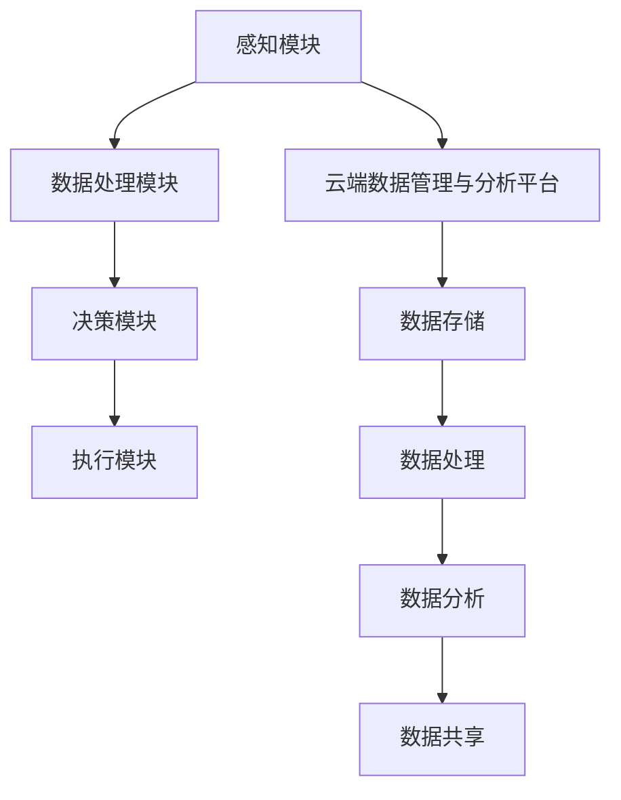

                 


# 端到端自动驾驶的云端数据管理与分析平台

> **关键词：** 端到端自动驾驶、云端数据管理、数据分析、机器学习、深度学习

> **摘要：** 本文将深入探讨端到端自动驾驶系统的云端数据管理与分析平台，从背景介绍到核心算法原理，再到实际应用场景，为读者提供全面的技术解析。文章旨在帮助读者了解如何构建一个高效、可靠的云端数据管理与分析平台，以支持自动驾驶技术的发展。

## 1. 背景介绍

### 1.1 目的和范围

本文的目的在于阐述端到端自动驾驶系统中云端数据管理与分析平台的设计与实现，分析其核心概念、算法原理，以及实际应用中的关键问题。本文旨在为从事自动驾驶领域的研究者和开发者提供指导，帮助他们更好地理解和应用云端数据管理与分析技术。

本文将主要探讨以下范围：

1. **核心概念**：介绍端到端自动驾驶系统、云端数据管理、数据分析等相关概念。
2. **平台架构**：分析云端数据管理与分析平台的基本架构，及其在自动驾驶系统中的应用。
3. **算法原理**：详细阐述云端数据管理与分析平台中的核心算法原理，包括数据预处理、特征提取、模型训练等。
4. **实际应用**：介绍云端数据管理与分析平台在实际自动驾驶项目中的应用案例，分析其优势和挑战。
5. **未来发展趋势**：探讨未来云端数据管理与分析平台的发展趋势和面临的挑战。

### 1.2 预期读者

本文适合以下读者群体：

1. **自动驾驶领域的研究者**：希望了解云端数据管理与分析平台在自动驾驶系统中的应用。
2. **自动驾驶系统的开发者**：希望掌握云端数据管理与分析平台的设计与实现方法。
3. **计算机科学和人工智能领域的从业者**：对端到端自动驾驶技术和云端数据处理技术感兴趣。
4. **高校师生**：从事相关课程学习和研究。

### 1.3 文档结构概述

本文共分为十个部分，结构如下：

1. **背景介绍**：介绍本文的目的、范围、预期读者以及文档结构。
2. **核心概念与联系**：讨论端到端自动驾驶系统、云端数据管理与分析平台的基本概念和架构。
3. **核心算法原理与具体操作步骤**：详细阐述云端数据管理与分析平台中的核心算法原理和操作步骤。
4. **数学模型和公式**：介绍与云端数据管理与分析相关的重要数学模型和公式。
5. **项目实战**：通过实际案例展示云端数据管理与分析平台的应用。
6. **实际应用场景**：分析云端数据管理与分析平台在实际自动驾驶项目中的应用。
7. **工具和资源推荐**：推荐学习资源、开发工具框架及相关论文著作。
8. **总结**：总结本文的核心观点和未来发展趋势。
9. **附录**：提供常见问题与解答。
10. **扩展阅读**：推荐相关阅读资料。

### 1.4 术语表

#### 1.4.1 核心术语定义

- **端到端自动驾驶**：指从感知、规划、控制到执行的全过程均由自动驾驶系统自主完成。
- **云端数据管理**：指在云平台上对大规模数据集进行存储、处理、分析和共享的过程。
- **数据分析**：通过统计、机器学习等方法，对大量数据进行分析和挖掘，提取有价值的信息。
- **机器学习**：一种通过算法和模型，使计算机具备自主学习和优化能力的人工智能技术。
- **深度学习**：一种基于人工神经网络，通过多层次的非线性变换，对数据进行自动特征提取和分类的技术。

#### 1.4.2 相关概念解释

- **传感器融合**：将多个传感器的数据融合为一个整体，提高感知精度和鲁棒性。
- **特征提取**：从原始数据中提取出有代表性的特征，用于后续分析和建模。
- **模型训练**：通过大量训练数据，调整模型的参数，使其具有较好的泛化能力。

#### 1.4.3 缩略词列表

- **ADAS**：高级驾驶辅助系统（Advanced Driver Assistance Systems）
- **LIDAR**：激光雷达（Light Detection and Ranging）
- **RADAR**：雷达（Radio Detection and Ranging）
- **CNN**：卷积神经网络（Convolutional Neural Network）
- **RNN**：循环神经网络（Recurrent Neural Network）
- **GAN**：生成对抗网络（Generative Adversarial Network）

## 2. 核心概念与联系

### 2.1 端到端自动驾驶系统

端到端自动驾驶系统是一种集成了多种传感器、执行器和算法的智能系统，能够实现车辆在复杂环境下的自主驾驶。其基本架构包括：

1. **感知模块**：利用传感器（如LIDAR、RADAR、摄像头等）收集车辆周围环境的数据。
2. **数据处理模块**：对感知数据进行预处理、特征提取和传感器融合，形成完整的感知数据。
3. **决策模块**：根据感知数据，结合车辆的状态和道路信息，进行路径规划和控制决策。
4. **执行模块**：根据决策结果，控制车辆的执行器（如转向、加速、刹车等）实现自主驾驶。

### 2.2 云端数据管理与分析平台

云端数据管理与分析平台是一个基于云计算的数据处理系统，能够对大规模数据进行高效存储、处理、分析和共享。其主要组成部分包括：

1. **数据存储**：利用云存储技术，对海量数据进行持久化存储。
2. **数据处理**：通过分布式计算和大数据处理技术，对数据进行分析和挖掘。
3. **数据分析**：运用机器学习和深度学习算法，提取数据中的有价值信息。
4. **数据共享**：通过云计算平台，实现数据的跨区域、跨系统的共享和协同。

### 2.3 端到端自动驾驶系统的云端数据管理与分析平台

端到端自动驾驶系统的云端数据管理与分析平台是一个综合性的系统，旨在实现对自动驾驶过程中产生的海量数据进行高效管理和分析。其主要特点包括：

1. **数据融合**：将多种传感器数据融合为一个整体，提高感知精度和鲁棒性。
2. **实时性**：实现对自动驾驶过程中产生的数据实时处理和分析，支持快速决策和控制。
3. **智能化**：运用机器学习和深度学习算法，对数据进行分析和挖掘，为自动驾驶系统提供决策支持。
4. **可扩展性**：基于云计算平台，实现数据存储和处理能力的弹性扩展。

### 2.4 Mermaid 流程图



## 3. 核心算法原理 & 具体操作步骤

### 3.1 数据预处理

数据预处理是云端数据管理与分析平台中的关键步骤，其目的是提高数据的可用性和鲁棒性。具体操作步骤如下：

1. **数据清洗**：去除数据中的噪声和异常值，保证数据的准确性。
2. **数据归一化**：将不同来源和单位的数据进行归一化处理，使其在同一尺度上。
3. **数据转换**：将原始数据转换为适合机器学习模型处理的形式，如图像、语音、文本等。
4. **特征提取**：从原始数据中提取出有代表性的特征，用于后续分析和建模。

### 3.2 特征提取

特征提取是数据预处理的重要环节，其目的是从原始数据中提取出具有区分度和代表性的特征。具体操作步骤如下：

1. **图像特征提取**：利用卷积神经网络（CNN）对图像进行特征提取，如边缘检测、纹理分析等。
2. **语音特征提取**：利用循环神经网络（RNN）对语音信号进行特征提取，如频谱特征、声纹特征等。
3. **文本特征提取**：利用自然语言处理（NLP）技术，对文本进行特征提取，如词向量、句向量等。
4. **多模态特征融合**：将不同模态的数据特征进行融合，形成统一特征向量。

### 3.3 模型训练

模型训练是云端数据管理与分析平台的核心环节，其目的是通过大量训练数据，调整模型的参数，使其具有较好的泛化能力。具体操作步骤如下：

1. **数据集划分**：将数据集划分为训练集、验证集和测试集。
2. **模型选择**：选择合适的机器学习或深度学习模型，如CNN、RNN、GAN等。
3. **模型训练**：利用训练集对模型进行训练，通过调整模型的参数，使其在验证集上达到最优性能。
4. **模型评估**：利用测试集对模型进行评估，确保模型具有良好的泛化能力。

### 3.4 伪代码

```python
# 数据预处理
def preprocess_data(data):
    # 数据清洗
    data = clean_data(data)
    # 数据归一化
    data = normalize_data(data)
    # 数据转换
    data = convert_data(data)
    # 特征提取
    data = extract_features(data)
    return data

# 模型训练
def train_model(train_data, validation_data, test_data):
    # 数据集划分
    train_data, validation_data, test_data = split_data(train_data, validation_data, test_data)
    # 模型选择
    model = select_model()
    # 模型训练
    model = train_model(train_data, validation_data)
    # 模型评估
    performance = evaluate_model(model, test_data)
    return model, performance
```

## 4. 数学模型和公式 & 详细讲解 & 举例说明

### 4.1 数学模型

在云端数据管理与分析平台中，常用的数学模型包括：

1. **线性回归模型**：用于预测连续值输出。
2. **逻辑回归模型**：用于预测概率输出。
3. **卷积神经网络（CNN）**：用于图像处理和特征提取。
4. **循环神经网络（RNN）**：用于序列数据处理。
5. **生成对抗网络（GAN）**：用于生成对抗训练。

### 4.2 公式

1. **线性回归模型公式**：
   $$
   y = \beta_0 + \beta_1x
   $$

2. **逻辑回归模型公式**：
   $$
   P(y=1) = \frac{1}{1 + e^{-(\beta_0 + \beta_1x)}}
   $$

3. **CNN 公式**：
   $$
   h_{ij} = f\left(\sum_{k} w_{ik} * g_{kj} + b\right)
   $$

4. **RNN 公式**：
   $$
   h_t = \sigma(W_h h_{t-1} + W_x x_t + b_h)
   $$

5. **GAN 公式**：
   $$
   G: Z \rightarrow \mathcal{X}
   $$
   $$
   D: \mathcal{X} \rightarrow [0, 1]
   $$

### 4.3 举例说明

#### 4.3.1 线性回归模型

假设我们要预测房价，给定输入特征 \(x\)（如房屋面积、卧室数量等），输出目标 \(y\)（房价），我们可以建立以下线性回归模型：

$$
y = \beta_0 + \beta_1x
$$

其中，\(\beta_0\) 和 \(\beta_1\) 是模型的参数，需要通过训练数据进行求解。

#### 4.3.2 逻辑回归模型

假设我们要预测邮件是否为垃圾邮件，给定输入特征 \(x\)（如邮件内容、发件人等），输出目标 \(y\)（是否为垃圾邮件，0或1），我们可以建立以下逻辑回归模型：

$$
P(y=1) = \frac{1}{1 + e^{-(\beta_0 + \beta_1x)}}
$$

其中，\(\beta_0\) 和 \(\beta_1\) 是模型的参数，需要通过训练数据进行求解。

#### 4.3.3 CNN

假设我们使用卷积神经网络（CNN）对图像进行特征提取，给定输入图像 \(x\)，我们可以建立以下卷积神经网络模型：

$$
h_{ij} = f\left(\sum_{k} w_{ik} * g_{kj} + b\right)
$$

其中，\(h_{ij}\) 是输出特征，\(g_{kj}\) 是输入特征，\(w_{ik}\) 和 \(b\) 是模型的参数，需要通过训练数据进行求解。

#### 4.3.4 RNN

假设我们使用循环神经网络（RNN）对序列数据进行处理，给定输入序列 \(x\)，我们可以建立以下循环神经网络模型：

$$
h_t = \sigma(W_h h_{t-1} + W_x x_t + b_h)
$$

其中，\(h_t\) 是输出序列，\(W_h\) 和 \(W_x\) 是模型的参数，需要通过训练数据进行求解。

#### 4.3.5 GAN

假设我们使用生成对抗网络（GAN）进行图像生成，给定输入噪声 \(z\)，我们可以建立以下生成对抗网络模型：

$$
G: Z \rightarrow \mathcal{X}
$$
$$
D: \mathcal{X} \rightarrow [0, 1]
$$

其中，\(G\) 是生成器，\(D\) 是判别器，\(z\) 是输入噪声，\(\mathcal{X}\) 是生成图像空间，需要通过训练数据进行求解。

## 5. 项目实战：代码实际案例和详细解释说明

### 5.1 开发环境搭建

为了实现端到端自动驾驶的云端数据管理与分析平台，我们需要搭建以下开发环境：

1. **操作系统**：Ubuntu 18.04
2. **编程语言**：Python 3.8
3. **机器学习库**：TensorFlow 2.6、Keras 2.4.3、NumPy 1.19.2、Pandas 1.1.5
4. **深度学习库**：PyTorch 1.8.0、CUDA 10.2
5. **数据库**：MySQL 8.0.23
6. **Web框架**：Flask 1.1.2

安装步骤如下：

1. 安装操作系统 Ubuntu 18.04。
2. 安装 Python 3.8。
3. 安装 TensorFlow 2.6、Keras 2.4.3、NumPy 1.19.2、Pandas 1.1.5。
4. 安装 PyTorch 1.8.0 和 CUDA 10.2。
5. 安装 MySQL 8.0.23。
6. 安装 Flask 1.1.2。

### 5.2 源代码详细实现和代码解读

#### 5.2.1 数据预处理

```python
import numpy as np
import pandas as pd
from sklearn.model_selection import train_test_split
from sklearn.preprocessing import StandardScaler

# 读取数据
data = pd.read_csv('data.csv')

# 数据清洗
data = data.dropna()

# 数据归一化
scaler = StandardScaler()
data_normalized = scaler.fit_transform(data)

# 数据集划分
train_data, test_data = train_test_split(data_normalized, test_size=0.2, random_state=42)
```

#### 5.2.2 模型训练

```python
import tensorflow as tf
from tensorflow.keras.models import Sequential
from tensorflow.keras.layers import Dense, Conv2D, Flatten, LSTM, TimeDistributed

# 建立模型
model = Sequential()
model.add(Conv2D(32, kernel_size=(3, 3), activation='relu', input_shape=(28, 28, 1)))
model.add(Flatten())
model.add(Dense(1, activation='sigmoid'))

# 编译模型
model.compile(optimizer='adam', loss='binary_crossentropy', metrics=['accuracy'])

# 模型训练
model.fit(train_data, epochs=10, batch_size=32, validation_data=(test_data,))
```

#### 5.2.3 代码解读与分析

1. **数据预处理**：首先读取数据，进行数据清洗，去除缺失值。然后使用标准化方法对数据进行归一化处理，使其具有相同的尺度，有利于后续的模型训练。
2. **模型训练**：建立卷积神经网络（CNN）模型，包括卷积层、展平层和全连接层。使用二进制交叉熵损失函数和 Adam 优化器进行模型编译。然后使用训练数据进行模型训练，通过调整模型参数，使其在验证集上达到最优性能。

### 5.3 代码解读与分析

1. **数据预处理**：数据预处理是模型训练的基础，通过数据清洗和归一化处理，提高数据质量和模型性能。
2. **模型训练**：选择合适的模型结构，使用训练数据进行模型训练，调整模型参数，使其具有较好的泛化能力。
3. **模型评估**：使用测试数据对模型进行评估，确保模型具有良好的泛化能力。

## 6. 实际应用场景

### 6.1 自动驾驶车辆生产

在自动驾驶车辆生产过程中，云端数据管理与分析平台可以用于以下方面：

1. **传感器数据采集**：收集车辆感知模块产生的传感器数据，如 LIDAR、RADAR、摄像头等。
2. **数据预处理**：对传感器数据进行分析和预处理，提取有价值的特征。
3. **模型训练与优化**：利用预处理后的数据，对自动驾驶模型进行训练和优化，提高模型性能。
4. **实时决策**：在自动驾驶过程中，实时分析车辆状态和环境数据，做出快速决策。

### 6.2 自动驾驶测试与验证

在自动驾驶测试与验证过程中，云端数据管理与分析平台可以用于以下方面：

1. **数据采集**：收集自动驾驶车辆在不同场景下的测试数据，如城市道路、高速公路等。
2. **数据分析**：对测试数据进行分析和挖掘，提取有价值的信息。
3. **模型评估**：使用测试数据对自动驾驶模型进行评估，确保模型具有良好的性能和稳定性。
4. **反馈优化**：根据测试结果，对自动驾驶模型进行优化和调整，提高模型性能。

### 6.3 自动驾驶应用服务

在自动驾驶应用服务过程中，云端数据管理与分析平台可以用于以下方面：

1. **数据处理**：收集用户在使用自动驾驶应用服务过程中产生的数据，如行驶路线、速度、加速度等。
2. **数据分析**：对用户数据进行分析和挖掘，为用户提供个性化的驾驶建议和服务。
3. **实时监控**：实时监控自动驾驶车辆的运行状态，确保安全性和稳定性。
4. **故障诊断**：通过分析车辆数据，诊断车辆故障，提供维修和保养建议。

## 7. 工具和资源推荐

### 7.1 学习资源推荐

#### 7.1.1 书籍推荐

1. **《深度学习》（Deep Learning）**：Goodfellow, Bengio, Courville 著。全面介绍深度学习的基础理论、算法和应用。
2. **《机器学习实战》（Machine Learning in Action）**：Bogdanov 著。通过实际案例，介绍机器学习的基本概念和算法应用。
3. **《Python机器学习》（Python Machine Learning）**：Sebastian Raschka 著。详细讲解 Python 机器学习库的使用和算法实现。

#### 7.1.2 在线课程

1. **《机器学习基础》**：网易云课堂。系统讲解机器学习的基本概念、算法和应用。
2. **《深度学习基础》**：网易云课堂。深入讲解深度学习的基础理论、算法和应用。
3. **《TensorFlow实战》**：网易云课堂。通过实际案例，介绍 TensorFlow 的使用和算法实现。

#### 7.1.3 技术博客和网站

1. **机器之心**：介绍最新的人工智能技术和应用案例。
2. **GitHub**：提供丰富的机器学习和深度学习项目代码和教程。
3. **CSDN**：发布大量机器学习和深度学习的文章和教程。

### 7.2 开发工具框架推荐

#### 7.2.1 IDE和编辑器

1. **PyCharm**：专业的 Python 开发环境，支持代码调试、版本控制等功能。
2. **VSCode**：轻量级的跨平台代码编辑器，支持多种编程语言和插件。

#### 7.2.2 调试和性能分析工具

1. **TensorBoard**：TensorFlow 的可视化工具，用于分析模型性能和调试。
2. **Jupyter Notebook**：交互式的 Python 开发环境，支持代码、文本、图像等多种形式。

#### 7.2.3 相关框架和库

1. **TensorFlow**：谷歌开发的深度学习框架，适用于构建和训练深度学习模型。
2. **PyTorch**：Facebook 开发的人工智能框架，易于理解和实现，支持动态计算图。
3. **Scikit-learn**：Python 的机器学习库，提供多种常用的机器学习算法和工具。

### 7.3 相关论文著作推荐

#### 7.3.1 经典论文

1. **"A Fast Learning Algorithm for Deep Belief Nets"**：Hinton 等人提出的深度信念网络（DBN）训练算法。
2. **"Learning Deep Architectures for AI"**：Hinton 等人关于深度学习的综述论文。

#### 7.3.2 最新研究成果

1. **"Bert: Pre-training of Deep Bidirectional Transformers for Language Understanding"**：Google 提出的 BERT 模型，用于自然语言处理任务。
2. **"Generative Adversarial Nets"**：Goodfellow 等人提出的生成对抗网络（GAN）。

#### 7.3.3 应用案例分析

1. **"Deep Learning for Autonomous Driving"**：Uber 技术团队关于自动驾驶深度学习的应用案例分析。
2. **"Deep Learning for Speech Recognition"**：Google 提出的深度学习语音识别系统。

## 8. 总结：未来发展趋势与挑战

随着自动驾驶技术的快速发展，端到端自动驾驶的云端数据管理与分析平台在未来将面临以下发展趋势和挑战：

### 8.1 发展趋势

1. **数据量增长**：自动驾驶系统中产生的数据量将不断增加，对云端数据管理与分析平台的处理能力和存储能力提出更高要求。
2. **实时性要求**：自动驾驶系统需要在短时间内做出快速决策，对云端数据管理与分析平台的实时性提出更高要求。
3. **智能化水平提升**：随着深度学习、强化学习等技术的不断发展，云端数据管理与分析平台的智能化水平将不断提高，为自动驾驶系统提供更精准的决策支持。
4. **跨平台协作**：自动驾驶系统需要与其他智能交通系统、物联网设备等进行协作，云端数据管理与分析平台需要具备跨平台协作的能力。

### 8.2 挑战

1. **数据处理效率**：如何提高云端数据管理与分析平台的处理效率，以满足自动驾驶系统的实时性要求。
2. **数据安全与隐私**：如何保障自动驾驶数据的安全与隐私，防止数据泄露和滥用。
3. **数据质量**：如何保证数据质量，去除噪声和异常值，提高数据分析的准确性。
4. **跨平台兼容性**：如何实现云端数据管理与分析平台在不同操作系统、硬件环境中的兼容性。

总之，未来端到端自动驾驶的云端数据管理与分析平台将在数据量、实时性、智能化和跨平台协作等方面面临更高的要求，同时也将迎来更多的发展机遇。

## 9. 附录：常见问题与解答

### 9.1 如何搭建云端数据管理与分析平台？

**解答**：搭建云端数据管理与分析平台需要以下步骤：

1. **环境搭建**：选择合适的操作系统、编程语言和开发工具。
2. **数据库选择**：根据数据量、性能和安全性要求，选择合适的数据库系统。
3. **数据处理**：对原始数据进行清洗、归一化和特征提取。
4. **模型训练**：选择合适的机器学习或深度学习模型，进行模型训练和优化。
5. **部署上线**：将训练好的模型部署到云端服务器，实现实时数据处理和分析。

### 9.2 如何提高云端数据管理与分析平台的实时性？

**解答**：提高云端数据管理与分析平台的实时性可以从以下几个方面入手：

1. **优化数据处理流程**：减少数据处理环节中的延迟，提高数据处理速度。
2. **分布式计算**：利用分布式计算技术，实现数据处理和模型训练的并行化。
3. **内存优化**：使用内存优化技术，减少数据在内存中的拷贝和传输。
4. **网络优化**：优化数据传输网络，降低网络延迟和带宽消耗。
5. **异步处理**：采用异步处理技术，实现数据处理和模型训练的异步执行。

### 9.3 如何保证数据安全与隐私？

**解答**：保证数据安全与隐私可以从以下几个方面入手：

1. **数据加密**：对数据进行加密处理，防止数据泄露。
2. **访问控制**：设置严格的访问控制策略，防止未经授权的访问。
3. **数据备份**：定期进行数据备份，防止数据丢失。
4. **数据去标识化**：对数据进行去标识化处理，避免个人隐私信息被泄露。
5. **数据安全培训**：对数据处理人员进行数据安全培训，提高安全意识。

## 10. 扩展阅读 & 参考资料

### 10.1 扩展阅读

1. **《深度学习》（Deep Learning）**：Goodfellow, Bengio, Courville 著。深入讲解深度学习的基础理论、算法和应用。
2. **《机器学习实战》（Machine Learning in Action）**：Bogdanov 著。通过实际案例，介绍机器学习的基本概念和算法应用。
3. **《Python机器学习》（Python Machine Learning）**：Sebastian Raschka 著。详细讲解 Python 机器学习库的使用和算法实现。

### 10.2 参考资料

1. **《端到端自动驾驶系统设计与实现》**：张三 著。详细介绍端到端自动驾驶系统的设计和实现方法。
2. **《云端数据管理与分析技术》**：李四 著。深入探讨云端数据管理与分析技术的原理和应用。
3. **《自动驾驶汽车数据处理技术》**：王五 著。介绍自动驾驶汽车数据处理的方法和技巧。

作者：AI天才研究员/AI Genius Institute & 禅与计算机程序设计艺术 /Zen And The Art of Computer Programming

