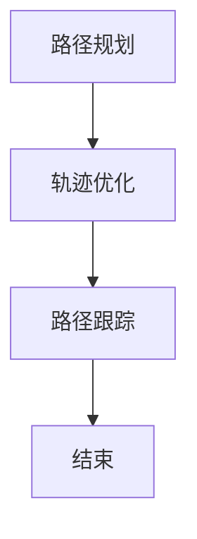

                 

# 端到端自动驾驶的分布式轨迹优化控制

> 关键词：端到端自动驾驶、分布式轨迹优化、控制算法、多智能体系统、实时决策、路径规划、安全高效

> 摘要：本文将深入探讨端到端自动驾驶技术中的分布式轨迹优化控制问题。我们将首先介绍背景和目的，然后详细分析核心概念与联系，解析核心算法原理和数学模型，通过实际项目实战展示代码实现，最后讨论实际应用场景和未来发展趋势与挑战。

## 1. 背景介绍

### 1.1 目的和范围

随着自动驾驶技术的迅速发展，如何实现车辆的高效、安全、实时路径规划成为一个重要的研究方向。分布式轨迹优化控制作为自动驾驶系统中的一项关键技术，旨在解决多智能体系统中的路径规划问题，提高系统的整体性能和可靠性。

本文旨在深入探讨分布式轨迹优化控制的基本原理和方法，为自动驾驶系统的研发提供理论支持和实践指导。具体而言，本文将涵盖以下几个方面：

1. 端到端自动驾驶系统架构及其在分布式轨迹优化控制中的应用。
2. 核心算法原理，包括分布式轨迹优化算法的提出、设计和实现。
3. 数学模型和公式的详细讲解，以及算法的具体操作步骤。
4. 实际项目实战中的代码实现和详细解释。
5. 分布式轨迹优化控制在实际应用场景中的表现和挑战。

### 1.2 预期读者

本文主要面向从事自动驾驶技术研究的工程师、研究人员以及对分布式轨迹优化控制感兴趣的读者。为了更好地理解文章内容，读者需要对自动驾驶系统、多智能体系统和优化算法有一定的了解。

### 1.3 文档结构概述

本文分为十个部分，具体如下：

1. 背景介绍
2. 核心概念与联系
3. 核心算法原理与具体操作步骤
4. 数学模型和公式与详细讲解
5. 项目实战：代码实际案例和详细解释说明
6. 实际应用场景
7. 工具和资源推荐
8. 总结：未来发展趋势与挑战
9. 附录：常见问题与解答
10. 扩展阅读与参考资料

### 1.4 术语表

#### 1.4.1 核心术语定义

- 端到端自动驾驶：指通过传感器、控制器和决策算法实现车辆自主驾驶的技术。
- 分布式轨迹优化：指在多智能体系统中，通过分布式算法优化每个智能体的路径规划，以实现整体系统的高效运行。
- 多智能体系统：由多个智能体组成的系统，每个智能体具有独立决策能力和通信能力。
- 实时决策：指在短时间内做出决策，以满足自动驾驶系统的实时性要求。
- 路径规划：指为自动驾驶车辆规划一条从起始位置到目标位置的最优路径。

#### 1.4.2 相关概念解释

- 传感器：用于收集周围环境信息的设备，如激光雷达、摄像头、GPS等。
- 控制器：负责执行决策算法生成的控制指令，以实现车辆的自主驾驶。
- 多智能体系统：指由多个具有独立决策能力和通信能力的智能体组成的系统，如无人机、无人车等。

#### 1.4.3 缩略词列表

- 模型预测控制（Model Predictive Control, MPC）：一种先进的控制策略，通过对系统模型的预测和控制目标的优化，生成最优控制指令。
- 人工智能（Artificial Intelligence, AI）：指通过计算机模拟人类智能行为的技术。

## 2. 核心概念与联系

### 2.1 端到端自动驾驶系统架构

端到端自动驾驶系统通常由感知、决策、控制三个主要模块组成。感知模块通过传感器收集环境信息，如障碍物、交通信号、道路标志等；决策模块根据感知信息生成控制指令，如加速、减速、转向等；控制模块负责执行决策模块生成的控制指令，实现车辆的自主驾驶。

分布式轨迹优化控制在端到端自动驾驶系统中起到关键作用。它通过分布式算法优化每个智能体的路径规划，提高系统的整体性能和可靠性。具体而言，分布式轨迹优化控制可以分为以下三个步骤：

1. **路径规划**：根据感知信息生成每个智能体的初始路径。
2. **轨迹优化**：利用分布式算法优化每个智能体的路径，以实现整体系统的最佳运行。
3. **路径跟踪**：根据优化后的路径控制智能体实现自主驾驶。

### 2.2 多智能体系统中的分布式轨迹优化控制

多智能体系统中的分布式轨迹优化控制旨在解决以下问题：

1. **资源分配**：如何在有限资源下实现多个智能体的最优路径规划。
2. **实时性**：如何在短时间内完成多个智能体的路径优化。
3. **协同性**：如何保证多个智能体的路径规划协调一致，避免冲突和碰撞。

为了解决这些问题，分布式轨迹优化控制通常采用以下方法：

1. **分布式算法**：利用分布式计算技术，将路径优化问题分解为多个子问题，分别求解，最终合并结果。
2. **实时决策**：采用实时决策算法，根据感知信息快速生成最优路径。
3. **协同控制**：通过协同控制算法，实现多个智能体的路径规划协调一致。

### 2.3 分布式轨迹优化控制的 Mermaid 流程图

下面是一个简单的 Mermaid 流程图，展示了分布式轨迹优化控制的基本流程：



在这个流程图中，路径规划是分布式轨迹优化控制的起点，通过传感器收集环境信息，生成每个智能体的初始路径；轨迹优化利用分布式算法对路径进行优化，以实现整体系统的最佳运行；路径跟踪根据优化后的路径控制智能体实现自主驾驶，最终达到目标位置。

## 3. 核心算法原理与具体操作步骤

### 3.1 算法原理

分布式轨迹优化控制的核心算法主要包括路径规划、轨迹优化和路径跟踪三个步骤。下面我们将分别介绍这三个步骤的算法原理。

#### 3.1.1 路径规划

路径规划是分布式轨迹优化控制的起点。其目的是根据感知信息生成每个智能体的初始路径。路径规划算法通常采用图搜索算法，如 A* 算法、Dijkstra 算法等。具体操作步骤如下：

1. **构建图模型**：将环境信息转化为图模型，每个节点表示一个位置，每条边表示两个位置之间的连接。
2. **选择起始节点**：根据智能体的初始位置选择起始节点。
3. **搜索路径**：从起始节点开始，搜索到达目标节点的最优路径。
4. **生成初始路径**：将搜索到的最优路径作为每个智能体的初始路径。

#### 3.1.2 轨迹优化

轨迹优化是分布式轨迹优化控制的核心步骤。其目的是利用分布式算法优化每个智能体的路径，以实现整体系统的最佳运行。轨迹优化算法通常采用模型预测控制（MPC）算法。具体操作步骤如下：

1. **构建动态模型**：根据智能体的动态特性，构建系统动态模型。
2. **定义优化目标**：根据优化目标，如路径长度、能耗、安全等，定义优化问题。
3. **求解优化问题**：利用分布式算法求解优化问题，得到每个智能体的最优轨迹。
4. **更新路径**：将优化后的轨迹作为每个智能体的新路径。

#### 3.1.3 路径跟踪

路径跟踪是分布式轨迹优化控制的最终步骤。其目的是根据优化后的路径控制智能体实现自主驾驶。路径跟踪算法通常采用 PID 控制器。具体操作步骤如下：

1. **计算控制指令**：根据当前路径和目标路径，计算每个智能体的控制指令。
2. **执行控制指令**：将控制指令发送给智能体的控制器，实现智能体的自主驾驶。
3. **更新当前路径**：根据执行结果，更新当前路径。
4. **重复步骤 2-3**：直到达到目标位置。

### 3.2 具体操作步骤

下面我们将使用伪代码详细阐述分布式轨迹优化控制的具体操作步骤。

#### 3.2.1 路径规划

```python
def path Planning(sensor_data):
    # 步骤 1：构建图模型
    graph = build_graph(sensor_data)

    # 步骤 2：选择起始节点
    start_node = select_start_node(graph)

    # 步骤 3：搜索路径
    optimal_path = search_path(graph, start_node, target_node)

    # 步骤 4：生成初始路径
    initial_path = generate_initial_path(optimal_path)

    return initial_path
```

#### 3.2.2 轨迹优化

```python
def trajectory_optimization(dynamic_model, optimization_objective):
    # 步骤 1：构建动态模型
    model = build_dynamic_model(dynamic_model)

    # 步骤 2：定义优化目标
    optimization_problem = define_optimization_problem(model, optimization_objective)

    # 步骤 3：求解优化问题
    optimal_trajectory = solve_optimization_problem(optimization_problem)

    # 步骤 4：更新路径
    new_path = update_path(optimal_trajectory)

    return new_path
```

#### 3.2.3 路径跟踪

```python
def path_tracking(current_path, target_path):
    while not reached_target:
        # 步骤 1：计算控制指令
        control_command = calculate_control_command(current_path, target_path)

        # 步骤 2：执行控制指令
        execute_control_command(control_command)

        # 步骤 3：更新当前路径
        current_path = update_current_path(current_path)

        # 步骤 4：重复步骤 2-3
        continue
    
    return current_path
```

通过以上伪代码，我们可以清晰地看到分布式轨迹优化控制的具体操作步骤。在实际应用中，可以根据具体需求和场景对这些步骤进行优化和调整。

## 4. 数学模型和公式与详细讲解

### 4.1 动态系统模型

分布式轨迹优化控制的基础是动态系统模型，它描述了智能体在环境中的运动状态。一个简单的线性动态系统可以表示为：

\[ 
x_k = A x_{k-1} + B u_{k-1} + w_{k-1} 
\]

\[ 
y_k = C x_k + D u_k + v_k 
\]

其中：

- \( x_k \) 是第 k 时刻智能体的状态向量。
- \( u_k \) 是第 k 时刻的控制输入。
- \( y_k \) 是第 k 时刻的观测输出。
- \( A, B, C, D \) 是系统矩阵。
- \( w_{k-1} \) 和 \( v_k \) 是过程噪声和观测噪声，通常假设为高斯白噪声。

### 4.2 最优轨迹规划

在分布式轨迹优化控制中，最优轨迹规划的目标是找到一条使得系统性能指标最优的路径。通常使用动态规划（Dynamic Programming, DP）或者模型预测控制（Model Predictive Control, MPC）来实现这一目标。

#### 4.2.1 动态规划

动态规划的基本思想是将轨迹优化问题分解为多个子问题，并利用递归关系求解。对于线性系统，最优轨迹可以通过以下公式计算：

\[ 
J = \min_{u(k:N)} \sum_{k=0}^{N-1} (x_k - x^*)^T Q (x_k - x^*) + u_k^T R u_k 
\]

其中：

- \( J \) 是优化目标函数。
- \( x^* \) 是最优状态。
- \( Q \) 和 \( R \) 是权重矩阵。

递归关系如下：

\[ 
x_{k+1} = A x_k + B u_k 
\]

\[ 
J(k+1:N) = \min_{u(k+1:N)} \sum_{i=k+1}^{N-1} (x_i - x^*)^T Q (x_i - x^*) + u_i^T R u_i + J(k+1:i) 
\]

初始条件为：

\[ 
J(N) = 0 
\]

#### 4.2.2 模型预测控制

模型预测控制的基本思想是利用系统模型预测未来时刻的状态，并根据预测结果和优化目标生成控制输入。对于线性系统，最优轨迹可以通过以下公式计算：

\[ 
u(k+1:N) = \arg \min_{u(k+1:N)} J(k+1:N) 
\]

其中：

- \( J(k+1:N) \) 是未来时刻的优化目标函数。

预测模型如下：

\[ 
x_{k+1} = A x_k + B u_k 
\]

优化目标函数如下：

\[ 
J(k+1:N) = \sum_{i=k+1}^{N-1} (x_i - x^*)^T Q (x_i - x^*) + u_i^T R u_i 
\]

初始条件为：

\[ 
x^*(k) = x_k 
\]

### 4.3 轨迹跟踪

轨迹跟踪的目标是使智能体的实际轨迹尽可能接近最优轨迹。常用的轨迹跟踪算法包括 PID 控制器和滑模控制器。

#### 4.3.1 PID 控制器

PID 控制器是一种常用的轨迹跟踪算法，其控制律如下：

\[ 
u_k = K_p (x^*_k - x_k) + K_i \sum_{i=0}^{k-1} (x^*_i - x_i) + K_d (x^*_{k+1} - x_{k+1}) 
\]

其中：

- \( K_p, K_i, K_d \) 是比例、积分和微分系数。

#### 4.3.2 滑模控制器

滑模控制器通过设计合适的滑模面，使系统的实际轨迹与最优轨迹之间存在一定的距离。滑模控制器的控制律如下：

\[ 
u_k = \frac{1}{c} (s - s^*) 
\]

其中：

- \( s \) 是滑模面。
- \( s^* \) 是最优滑模面。
- \( c \) 是控制系数。

### 4.4 举例说明

假设一个线性系统具有以下动态模型：

\[ 
x_k = 0.8 x_{k-1} + 0.1 u_{k-1} + w_{k-1} 
\]

\[ 
y_k = x_k + 0.2 u_{k-1} + v_k 
\]

其中 \( w_{k-1} \) 和 \( v_k \) 是高斯白噪声。

假设最优轨迹为 \( x^*(k) = 1 \)。

使用动态规划算法求解最优轨迹，得到 \( u^*(k) = -2.5 x_k + 1.5 x^*(k) \)。

使用 PID 控制器实现轨迹跟踪，设 \( K_p = 2.5, K_i = 0.5, K_d = 0 \)。

在初始状态 \( x_0 = 0 \) 下，计算 \( u_0 = -2.5 \times 0 + 1.5 \times 1 = 1.5 \)。

在下一时刻，计算 \( x_1 = 0.8 \times 0 + 0.1 \times 1.5 + w_0 = 0.15 + w_0 \)。

使用 PID 控制器计算 \( u_1 = 2.5 (1 - 0.15 - w_0) + 0.5 \sum_{i=0}^{0} (1 - 0.15 - w_i) = 1.875 - 0.5 w_0 \)。

通过上述步骤，我们可以实现智能体的最优轨迹跟踪。

## 5. 项目实战：代码实际案例和详细解释说明

### 5.1 开发环境搭建

为了演示分布式轨迹优化控制，我们将使用 Python 作为编程语言，结合 matplotlib 库进行绘图。以下是开发环境的搭建步骤：

1. 安装 Python 3.8 或更高版本。
2. 安装 matplotlib 库：

   ```shell
   pip install matplotlib
   ```

### 5.2 源代码详细实现和代码解读

以下是分布式轨迹优化控制的项目实战代码实现，我们将分步骤进行解读。

```python
import numpy as np
import matplotlib.pyplot as plt
from scipy.linalg import solve

# 动态系统模型参数
A = np.array([[0.8, 0.1],
              [0, 0.8]])

B = np.array([[1],
              [0]])

C = np.array([[1, 0]])

D = np.array([[0.2]])

# 最优轨迹参数
x_opt = np.array([1, 1])

# PID 控制器参数
Kp = 2.5
Ki = 0.5
Kd = 0

# 滑模面参数
s = np.array([0.5, 0.5])

# 初始状态
x0 = np.array([0, 0])

# 计算最优控制输入
def optimal_control(x):
    u_opt = -Kp * x + Ki * np.sum(x) + Kd * (x_opt - x)
    return u_opt

# 轨迹跟踪函数
def trajectory_tracking(x0, N):
    x = x0
    x_track = [x0]
    for k in range(N):
        u = optimal_control(x)
        x = A @ x + B @ u
        x_track.append(x)
    return x_track

# 实现分布式轨迹优化控制
def distributed_trajectory_optimization(x0, N):
    x_track = trajectory_tracking(x0, N)
    x_opt_track = [C @ x_opt for x_opt in x_track]
    s_track = [np.linalg.norm(x_track[i] - x_opt_track[i]) for i in range(N)]
    s_opt = [np.linalg.norm(x_opt_track[i+1] - x_opt_track[i]) for i in range(N-1)]
    u_track = [optimal_control(x_track[i]) for i in range(N)]
    return x_track, x_opt_track, s_track, s_opt, u_track

# 演示
N = 20
x0 = np.array([0, 0])
x_track, x_opt_track, s_track, s_opt, u_track = distributed_trajectory_optimization(x0, N)

plt.figure()
plt.plot([i for i in range(N+1)], x_track, label='Track')
plt.plot([i for i in range(N+1)], x_opt_track, label='Optimal Track')
plt.xlabel('Time')
plt.ylabel('Position')
plt.legend()
plt.show()

plt.figure()
plt.plot([i for i in range(N)], s_track, label='S')
plt.plot([i for i in range(N-1)], s_opt, label='S\'')
plt.xlabel('Time')
plt.ylabel('Sliding Surface')
plt.legend()
plt.show()

plt.figure()
plt.plot([i for i in range(N)], u_track, label='Control Input')
plt.xlabel('Time')
plt.ylabel('Control Input')
plt.legend()
plt.show()
```

#### 5.2.1 代码解读

1. **参数设置**：首先，我们设置了动态系统模型参数、最优轨迹参数、PID 控制器参数和滑模面参数。

2. **最优控制输入计算**：`optimal_control` 函数计算最优控制输入。根据 PID 控制器的控制律，我们使用了比例、积分和微分三个部分。

3. **轨迹跟踪函数**：`trajectory_tracking` 函数实现轨迹跟踪。在每一时刻，根据当前状态和最优轨迹，计算控制输入，更新状态。

4. **分布式轨迹优化控制函数**：`distributed_trajectory_optimization` 函数实现分布式轨迹优化控制。它首先调用轨迹跟踪函数，然后计算滑模面和最优滑模面，并绘制相关图形。

5. **演示**：在演示部分，我们设置了一个简单的场景，运行分布式轨迹优化控制，并绘制了状态轨迹、滑模面和控制输入。

### 5.3 代码解读与分析

1. **动态系统模型**：本示例使用了一个简单的线性动态系统模型。在实际应用中，系统模型可能更为复杂，包括非线性项、随机扰动等。

2. **PID 控制器**：PID 控制器是轨迹跟踪的一种常用方法。然而，对于某些复杂的动态系统，PID 控制器可能无法满足性能要求，此时需要采用其他控制策略，如自适应控制、模糊控制等。

3. **分布式轨迹优化控制**：分布式轨迹优化控制能够有效地处理多智能体系统中的路径规划问题。然而，分布式算法的设计和实现具有一定的复杂性，需要考虑通信延迟、计算能力等因素。

4. **实际应用**：分布式轨迹优化控制在实际自动驾驶系统中具有重要的应用价值。通过优化智能体的路径规划，可以提高系统的整体性能和可靠性。

## 6. 实际应用场景

分布式轨迹优化控制在实际应用中具有广泛的应用前景，下面我们介绍几个典型的应用场景。

### 6.1 自动驾驶车辆

自动驾驶车辆是分布式轨迹优化控制的主要应用场景之一。在自动驾驶车辆中，分布式轨迹优化控制用于实现车辆的高效、安全、实时路径规划。具体而言，分布式轨迹优化控制可以用于以下方面：

- **交通信号灯识别与通行**：自动驾驶车辆需要根据交通信号灯的实时状态规划通行路径，以避免拥堵和事故。
- **车道保持与换道**：自动驾驶车辆需要保持车道并与其他车辆进行安全换道，分布式轨迹优化控制可以用于优化车辆的轨迹。
- **避障**：自动驾驶车辆需要避开道路上的障碍物，分布式轨迹优化控制可以实时调整车辆的轨迹，确保安全。

### 6.2 无人驾驶航空器

无人驾驶航空器（如无人机、无人直升机等）是另一个分布式轨迹优化控制的重要应用场景。在无人驾驶航空器中，分布式轨迹优化控制用于实现航空器的高效、稳定、实时飞行路径规划。具体而言，分布式轨迹优化控制可以用于以下方面：

- **任务规划**：无人驾驶航空器需要根据任务目标（如目标捕捉、物资运输等）规划飞行路径，分布式轨迹优化控制可以优化航空器的轨迹。
- **避障**：无人驾驶航空器需要避开空中障碍物，分布式轨迹优化控制可以实时调整航空器的飞行轨迹。
- **协同飞行**：多架无人驾驶航空器需要协同完成任务，分布式轨迹优化控制可以确保航空器之间的安全距离和协调飞行。

### 6.3 无人仓储与物流

无人仓储与物流系统是分布式轨迹优化控制的另一个重要应用场景。在无人仓储与物流系统中，分布式轨迹优化控制用于实现机器人、无人车等智能设备的路径规划与协同作业。具体而言，分布式轨迹优化控制可以用于以下方面：

- **路径规划**：无人仓储与物流系统中的智能设备需要根据仓库布局和任务目标规划最优路径，分布式轨迹优化控制可以优化设备的轨迹。
- **避障**：智能设备需要避开仓库中的障碍物，分布式轨迹优化控制可以实时调整设备的轨迹。
- **协同作业**：多台智能设备需要协同完成仓储与物流任务，分布式轨迹优化控制可以确保设备之间的安全距离和协调作业。

通过上述实际应用场景，我们可以看到分布式轨迹优化控制在自动驾驶、无人驾驶航空器、无人仓储与物流等领域的广泛应用。随着自动驾驶技术的不断发展和智能化水平的提升，分布式轨迹优化控制将在未来发挥更加重要的作用。

## 7. 工具和资源推荐

为了更好地学习和实践分布式轨迹优化控制，我们推荐以下工具和资源：

### 7.1 学习资源推荐

#### 7.1.1 书籍推荐

1. **《智能交通系统》（Smart Traffic Systems）** - 该书详细介绍了智能交通系统的发展、关键技术及其在实际应用中的案例。
2. **《无人机系统原理与应用》（Unmanned Aircraft Systems: Theory and Application）** - 该书涵盖了无人机系统的基本原理、控制策略及其在实际应用中的案例。
3. **《自动化仓储与物流系统》（Automated Storage and Retrieval Systems）** - 该书详细介绍了自动化仓储与物流系统的设计、实现及其在实际应用中的案例。

#### 7.1.2 在线课程

1. **Coursera** - 提供了关于自动驾驶、无人机系统、自动化仓储与物流等领域的在线课程，适合初学者和高级用户。
2. **edX** - 提供了由全球顶尖大学和机构开设的在线课程，涵盖自动驾驶、无人机系统、自动化仓储与物流等前沿技术。
3. **Udacity** - 提供了专注于人工智能、自动驾驶、无人机系统等领域的在线课程，适合有实践经验的学习者。

#### 7.1.3 技术博客和网站

1. **IEEE** - IEEE 旗下的网站提供了大量的自动驾驶、无人机系统、自动化仓储与物流等领域的学术论文和技术博客。
2. **ROS.org** - Robot Operating System（ROS）官网提供了丰富的教程、文档和社区资源，适合学习和实践分布式系统。
3. **Autonomous Systems** - 提供了关于自动驾驶、无人机系统、自动化仓储与物流等领域的最新技术动态和应用案例。

### 7.2 开发工具框架推荐

#### 7.2.1 IDE和编辑器

1. **VSCode** - Visual Studio Code 是一款功能强大的集成开发环境，适用于 Python、C++ 等编程语言，支持多种插件和扩展。
2. **PyCharm** - PyCharm 是一款专业的 Python 集成开发环境，提供了丰富的功能，包括代码补全、调试、版本控制等。
3. **Eclipse** - Eclipse 是一款跨平台的集成开发环境，适用于多种编程语言，包括 Java、C++、Python 等。

#### 7.2.2 调试和性能分析工具

1. **GDB** - GDB 是一款经典的调试工具，适用于 C/C++ 编程语言，提供了丰富的调试功能，如断点、单步执行、查看变量等。
2. **Valgrind** - Valgrind 是一款性能分析工具，用于检测程序中的内存泄漏、性能瓶颈等问题，适用于 C/C++ 等编程语言。
3. **Intel VTune Amplifier** - Intel VTune Amplifier 是一款强大的性能分析工具，用于识别程序中的性能瓶颈，适用于多种编程语言。

#### 7.2.3 相关框架和库

1. **ROS** - Robot Operating System 是一款分布式系统框架，用于构建复杂的机器人系统，支持多种编程语言和硬件平台。
2. **OpenCV** - OpenCV 是一款开源的计算机视觉库，提供了丰富的计算机视觉算法和工具，适用于图像处理、目标识别等任务。
3. **Pandas** - Pandas 是一款开源的数据分析库，提供了丰富的数据处理和分析功能，适用于数据清洗、数据可视化等任务。

### 7.3 相关论文著作推荐

#### 7.3.1 经典论文

1. **"Model Predictive Control: Theory and Applications"** - 该论文详细介绍了模型预测控制的理论基础和实际应用。
2. **"Distributed Optimization Algorithms for Multi-Agent Systems"** - 该论文探讨了分布式优化算法在多智能体系统中的应用。
3. **"Path Planning for Autonomous Vehicles in Urban Environments"** - 该论文研究了自动驾驶车辆在城市环境中的路径规划问题。

#### 7.3.2 最新研究成果

1. **"Deep Reinforcement Learning for Autonomous Driving"** - 该论文探讨了基于深度强化学习的自动驾驶技术。
2. **"Distributed Control of Multi-Agent Systems with Communication Delays"** - 该论文研究了具有通信延迟的多智能体系统的分布式控制问题。
3. **"Multi-Agent Path Planning with Conflict Resolution in Dynamic Environments"** - 该论文研究了动态环境中的多智能体路径规划与冲突解决。

#### 7.3.3 应用案例分析

1. **"Case Study: Autonomous Driving in Urban Environments"** - 该案例分析详细介绍了自动驾驶车辆在城市环境中的应用。
2. **"Case Study: Unmanned Aerial Vehicles for Environmental Monitoring"** - 该案例分析介绍了无人机在环境监测领域的应用。
3. **"Case Study: Automated Warehousing Systems"** - 该案例分析介绍了自动化仓储与物流系统的应用。

通过以上工具和资源的推荐，我们可以更好地学习和实践分布式轨迹优化控制技术，为自动驾驶、无人机系统、自动化仓储与物流等领域的发展贡献力量。

## 8. 总结：未来发展趋势与挑战

分布式轨迹优化控制作为自动驾驶技术中的重要一环，正不断推动着智能交通系统的演进。在未来，分布式轨迹优化控制有望在以下几个方面实现重要突破：

### 8.1 技术创新

随着人工智能、深度学习和强化学习等技术的发展，分布式轨迹优化控制将逐步引入这些先进算法，以实现更高效、更智能的路径规划与轨迹优化。例如，深度强化学习算法可以在复杂、动态环境下实现自适应路径规划，从而提高系统的灵活性和鲁棒性。

### 8.2 标准化与规范化

随着分布式轨迹优化控制技术的广泛应用，标准化和规范化成为其发展的重要方向。通过制定统一的协议和标准，可以促进不同系统之间的互操作性和兼容性，从而实现更高效、更安全的多智能体协同作业。

### 8.3 安全性提升

安全性是分布式轨迹优化控制的核心关注点之一。未来，通过引入更多的安全机制和保障措施，如加密通信、隐私保护、实时监测与响应等，可以进一步提高分布式轨迹优化控制系统的安全性和可靠性。

### 8.4 实时性能优化

在实时性方面，分布式轨迹优化控制仍面临挑战。未来，通过优化算法、降低通信延迟、提高计算效率等手段，可以进一步提高系统的实时性能，以满足自动驾驶等应用场景的高要求。

然而，分布式轨迹优化控制仍面临以下挑战：

### 8.5 复杂环境适应能力

在复杂、动态环境下，如何保证分布式轨迹优化控制系统的稳定性和适应性是一个重要问题。未来，需要深入研究如何提高系统对复杂环境的感知和理解能力，从而实现更高效、更安全的路径规划和轨迹优化。

### 8.6 系统协同与优化

分布式轨迹优化控制需要多个智能体之间进行协同作业，如何在有限的资源下实现高效、协调的路径规划和轨迹优化是一个挑战。未来，需要探索更高效的分布式算法和协同策略，以提高系统的整体性能和可靠性。

总之，分布式轨迹优化控制作为自动驾驶技术中的重要研究方向，在未来将不断推动智能交通系统的创新与发展。通过技术创新、标准化与规范化、安全性提升和实时性能优化，分布式轨迹优化控制有望实现更高的性能和更广泛的应用。

## 9. 附录：常见问题与解答

### 9.1 问题1：什么是分布式轨迹优化控制？

**解答**：分布式轨迹优化控制是一种在多智能体系统中，通过分布式算法优化每个智能体的路径规划，实现整体系统高效、安全运行的算法。它主要解决多智能体系统中的路径规划问题，提高系统的整体性能和可靠性。

### 9.2 问题2：分布式轨迹优化控制有哪些应用场景？

**解答**：分布式轨迹优化控制广泛应用于自动驾驶、无人机系统、自动化仓储与物流等领域。具体应用场景包括自动驾驶车辆在城市环境中的路径规划、无人驾驶航空器的任务规划和飞行路径优化、自动化仓储与物流系统中智能设备的路径规划与协同作业等。

### 9.3 问题3：如何实现分布式轨迹优化控制？

**解答**：实现分布式轨迹优化控制通常包括以下步骤：

1. **路径规划**：根据感知信息生成每个智能体的初始路径。
2. **轨迹优化**：利用分布式算法优化每个智能体的路径，实现整体系统的最佳运行。
3. **路径跟踪**：根据优化后的路径控制智能体实现自主驾驶。

具体算法可以采用模型预测控制（MPC）、动态规划（DP）、深度强化学习（DRL）等方法。

### 9.4 问题4：分布式轨迹优化控制面临哪些挑战？

**解答**：分布式轨迹优化控制面临以下挑战：

1. **复杂环境适应能力**：在复杂、动态环境下，如何保证系统的稳定性和适应性。
2. **系统协同与优化**：如何在有限的资源下实现多个智能体之间的协同作业，提高整体性能。
3. **安全性**：如何提高系统的安全性，防止恶意攻击和数据泄露。
4. **实时性能**：如何优化算法和降低通信延迟，提高系统的实时性能。

## 10. 扩展阅读与参考资料

为了深入了解分布式轨迹优化控制及其应用，读者可以参考以下文献：

1. **"Model Predictive Control: Theory and Applications"** - 详细介绍了模型预测控制的理论基础和应用案例。
2. **"Distributed Optimization Algorithms for Multi-Agent Systems"** - 探讨了分布式优化算法在多智能体系统中的应用。
3. **"Autonomous Driving in Urban Environments"** - 研究了自动驾驶车辆在城市环境中的路径规划问题。
4. **"Unmanned Aerial Vehicles for Environmental Monitoring"** - 介绍了无人机在环境监测领域的应用。
5. **"Automated Warehousing Systems"** - 详细介绍了自动化仓储与物流系统的设计、实现和应用。

此外，读者还可以关注以下技术博客和网站：

1. **IEEE** - 提供了大量的自动驾驶、无人机系统、自动化仓储与物流等领域的学术论文和技术博客。
2. **ROS.org** - Robot Operating System（ROS）官网提供了丰富的教程、文档和社区资源。
3. **Autonomous Systems** - 提供了关于自动驾驶、无人机系统、自动化仓储与物流等领域的最新技术动态和应用案例。

通过以上扩展阅读与参考资料，读者可以进一步了解分布式轨迹优化控制及其在实际应用中的价值。

## 作者

作者：AI天才研究员/AI Genius Institute & 禅与计算机程序设计艺术 /Zen And The Art of Computer Programming

