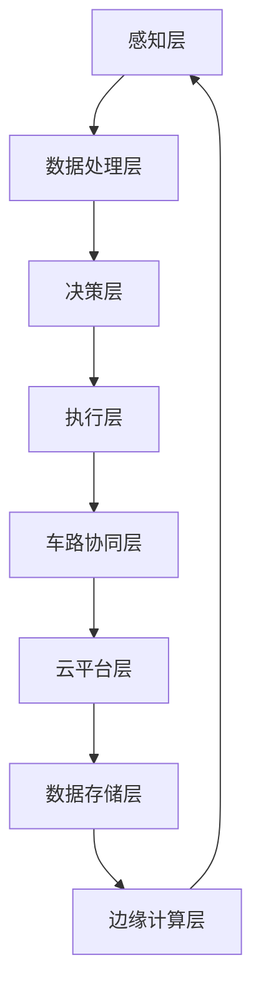

                 

# 端到端自动驾驶的车路云一体化方案

> **关键词：** 端到端自动驾驶、车路协同、云计算、数据驱动、AI算法、边缘计算、智能交通系统。

> **摘要：** 本文将深入探讨端到端自动驾驶的车路云一体化方案，解析其核心技术概念、算法原理、数学模型，并通过实际案例展示其应用与前景。文章旨在为读者提供全面的技术视角，帮助理解车路协同在自动驾驶中的关键作用，及其面临的挑战与未来发展趋势。

## 1. 背景介绍

### 1.1 目的和范围

随着人工智能和物联网技术的快速发展，自动驾驶成为未来交通系统的核心趋势。端到端自动驾驶不仅依赖于车辆本身的智能化，还依赖于车路协同和云计算的支持。本文旨在详细介绍车路云一体化方案，包括其核心概念、技术原理和实际应用。

### 1.2 预期读者

本文面向希望了解自动驾驶技术和车路云一体化方案的读者，包括自动驾驶工程师、AI研究人员、软件开发者以及交通运输领域专业人士。

### 1.3 文档结构概述

本文将分为以下章节：

1. **背景介绍**：概述自动驾驶和车路云一体化方案的核心概念。
2. **核心概念与联系**：通过Mermaid流程图展示车路云一体化架构。
3. **核心算法原理 & 具体操作步骤**：详细讲解自动驾驶的关键算法。
4. **数学模型和公式 & 详细讲解 & 举例说明**：阐述自动驾驶中的数学模型。
5. **项目实战：代码实际案例和详细解释说明**：展示端到端自动驾驶的代码实现。
6. **实际应用场景**：探讨车路云一体化方案在不同领域的应用。
7. **工具和资源推荐**：推荐学习资源和开发工具。
8. **总结：未来发展趋势与挑战**：展望车路云一体化方案的未来。
9. **附录：常见问题与解答**：解答常见问题。
10. **扩展阅读 & 参考资料**：提供进一步阅读的资料。

### 1.4 术语表

#### 1.4.1 核心术语定义

- **端到端自动驾驶**：直接从感知到决策再到执行，不需要中间层的自动驾驶系统。
- **车路协同**：车辆与道路基础设施之间的信息交换与协调。
- **云计算**：通过网络提供可伸缩的计算资源和服务。
- **边缘计算**：在靠近数据源的地方进行数据处理，减少延迟。
- **AI算法**：用于自动驾驶的各种人工智能算法，如深度学习、强化学习等。

#### 1.4.2 相关概念解释

- **V2X**：Vehicle-to-Everything，指车辆与所有外部实体的通信。
- **OTA**：Over-The-Air，指通过无线网络进行软件更新。

#### 1.4.3 缩略词列表

- **ADAS**：Advanced Driver Assistance Systems，高级驾驶辅助系统。
- **DSP**：Digital Signal Processing，数字信号处理。
- **CNN**：Convolutional Neural Networks，卷积神经网络。

## 2. 核心概念与联系

端到端自动驾驶的车路云一体化方案，是一个高度集成的系统，涉及多个关键组件和概念。以下是通过Mermaid绘制的车路云一体化架构流程图：



### 2.1 感知层

感知层是自动驾驶系统的第一步，主要功能是通过各种传感器（如摄像头、激光雷达、雷达等）收集车辆周围的环境数据。

- **摄像头**：用于捕获道路和周围环境图像。
- **激光雷达**：用于获取高精度的三维点云数据。
- **雷达**：用于检测车辆和障碍物的距离。

### 2.2 数据处理层

数据处理层负责对传感器数据进行预处理和特征提取。常见的算法包括：

- **图像处理**：用于图像去噪、边缘检测、目标识别等。
- **点云处理**：用于点云去噪、配准、分类等。

### 2.3 决策层

决策层基于处理后的数据，使用AI算法（如深度学习、强化学习等）进行环境理解和行为预测。

- **深度学习**：用于识别道路标志、行人、车辆等。
- **强化学习**：用于学习最优行驶策略。

### 2.4 执行层

执行层根据决策层的输出，控制车辆执行相应的动作，如加速、减速、转向等。

- **执行器**：如电机、制动系统、转向系统等。

### 2.5 车路协同层

车路协同层实现车辆与道路基础设施之间的信息交换和协调，提高行驶安全性。

- **V2X通信**：实现车辆之间的通信，如车辆探测、交通状况共享。
- **OTA更新**：通过网络进行车辆软件更新。

### 2.6 云平台层

云平台层提供强大的计算资源和数据存储，支持自动驾驶系统的开发和部署。

- **云计算服务**：如计算、存储、AI服务等。
- **大数据分析**：用于收集和分析交通数据，优化交通流量。

### 2.7 数据存储层

数据存储层负责存储大量的传感器数据、行为数据等，为后续分析和决策提供支持。

- **数据仓库**：用于存储和管理数据。
- **数据库**：用于查询和检索数据。

### 2.8 边缘计算层

边缘计算层在靠近数据源的地方进行数据处理，减少延迟，提高响应速度。

- **边缘服务器**：用于本地数据处理。
- **物联网设备**：用于数据采集和初步处理。

## 3. 核心算法原理 & 具体操作步骤

### 3.1 深度学习算法

深度学习是自动驾驶系统中最重要的算法之一，用于环境理解和行为预测。

#### 3.1.1 卷积神经网络（CNN）

**伪代码：**

```python
def conv2d(input, filters, kernel_size):
    # 输入：图像数据，过滤器，卷积核大小
    # 输出：卷积结果
    # 实现卷积操作
    pass

def max_pooling(input, pool_size):
    # 输入：图像数据，池化窗口大小
    # 输出：池化结果
    # 实现最大池化操作
    pass

def convolutional_neural_network(input_data):
    # 输入：图像数据
    # 输出：分类结果
    # 实现卷积神经网络
    layer_1 = conv2d(input_data, filters=32, kernel_size=3)
    layer_2 = max_pooling(layer_1, pool_size=2)
    layer_3 = conv2d(layer_2, filters=64, kernel_size=3)
    layer_4 = max_pooling(layer_3, pool_size=2)
    flattened = flatten(layer_4)
    dense_layer = fully_connected(flattened, num_neurons=128)
    output = activation(dense_layer, activation_type='softmax')
    return output
```

#### 3.1.2 递归神经网络（RNN）

**伪代码：**

```python
def lstm(input_sequence, hidden_state, cell_state):
    # 输入：输入序列，隐藏状态，细胞状态
    # 输出：新的隐藏状态和细胞状态
    # 实现LSTM单元
    pass

def recurrent_neural_network(input_sequence):
    # 输入：输入序列
    # 输出：分类结果
    hidden_state = initialize_state()
    cell_state = initialize_state()
    for input_data in input_sequence:
        hidden_state, cell_state = lstm(input_data, hidden_state, cell_state)
    output = activation(fully_connected(hidden_state, num_neurons=1), activation_type='sigmoid')
    return output
```

### 3.2 强化学习算法

强化学习用于自动驾驶系统中的行为预测和决策。

#### 3.2.1 Q-Learning

**伪代码：**

```python
def q_learning(state, action, reward, next_state, next_action, alpha, gamma):
    # 输入：当前状态，动作，奖励，下一个状态，下一个动作，学习率，折扣因子
    # 输出：更新后的Q值
    # 实现Q-Learning更新规则
    current_q_value = Q(state, action)
    target_q_value = reward + gamma * max(Q(next_state, next_action))
    Q(state, action) = current_q_value + alpha * (target_q_value - current_q_value)
    return Q

def drive自动驾驶系统():
    # 输入：无人驾驶车辆
    # 输出：最优行驶策略
    while not 目的地到达：
        state = 环境感知系统获取状态
        action = 选择最优动作
        next_state, reward = 执行动作
        next_action = 选择下一个最优动作
        Q值更新 = q_learning(state, action, reward, next_state, next_action, alpha, gamma)
    return 最优行驶策略
```

## 4. 数学模型和公式 & 详细讲解 & 举例说明

自动驾驶系统中，数学模型和公式用于描述车辆的运动状态、环境特征以及决策过程。以下是几个关键数学模型及其解释。

### 4.1 车辆动力学模型

车辆动力学模型描述车辆在道路上的运动状态，主要包括以下公式：

$$
v(t) = v_0 + at
$$

$$
s(t) = s_0 + v_0t + \frac{1}{2}at^2
$$

其中，$v(t)$ 是车辆在时间 $t$ 的速度，$s(t)$ 是车辆在时间 $t$ 的位移，$v_0$ 是初始速度，$s_0$ 是初始位移，$a$ 是加速度。

#### 举例说明：

假设一辆车从静止开始加速，加速度为 $2 m/s^2$，求 $5s$ 后的速度和位移。

$$
v(5) = 0 + 2 \times 5 = 10 m/s
$$

$$
s(5) = 0 + 0 \times 5 + \frac{1}{2} \times 2 \times 5^2 = 25 m
$$

### 4.2 贝叶斯滤波模型

贝叶斯滤波模型用于估计车辆的动态状态，通过融合观测数据和先验信息，得到后验概率分布。其公式为：

$$
p(x_t|z_t) = \frac{p(z_t|x_t) p(x_t)}{p(z_t)}
$$

其中，$x_t$ 是车辆在时间 $t$ 的状态，$z_t$ 是观测数据，$p(x_t|z_t)$ 是后验概率分布，$p(z_t|x_t)$ 是观测概率，$p(x_t)$ 是先验概率，$p(z_t)$ 是观测数据的总概率。

#### 举例说明：

假设我们观察到一辆车在时间 $t=0$ 时的位置为 $(10, 10)$，我们有一个先验假设这辆车在时间 $t=1$ 时位于 $(15, 15)$。如果观测到在时间 $t=1$ 时的位置为 $(14, 12)$，我们可以使用贝叶斯滤波更新我们的状态估计。

$$
p((14, 12)| (15, 15)) = \frac{p((15, 15)| (14, 12)) p((14, 12))}{p((15, 15))}
$$

其中，$p((15, 15)| (14, 12))$ 是转移概率，$p((14, 12))$ 是初始状态概率，$p((15, 15))$ 是观测数据的总概率。

### 4.3 强化学习中的回报函数

强化学习中的回报函数用于评估策略的好坏，其公式为：

$$
R(t) = r(t) + \gamma \sum_{t'=t}^{\infty} \gamma^{t'-t} R(t')
$$

其中，$R(t)$ 是在时间 $t$ 的回报，$r(t)$ 是在时间 $t$ 的即时回报，$\gamma$ 是折扣因子，$R(t')$ 是在时间 $t'$ 的回报。

#### 举例说明：

假设我们在自动驾驶系统中使用强化学习来控制车辆的加速度，如果车辆在 $t=0$ 时处于静止状态，我们设置即时回报 $r(0) = 0$。在 $t=1$ 时，车辆以 $1 m/s^2$ 的加速度行驶，即 $r(1) = 1$。在 $t=2$ 时，车辆以 $2 m/s^2$ 的加速度行驶，即 $r(2) = 2$。我们希望在未来获得更高的回报，因此 $\gamma$ 设置为 $0.9$。

$$
R(1) = r(1) + 0.9 \sum_{t'=2}^{\infty} 0.9^{t'-1} R(t')
$$

$$
R(1) = 1 + 0.9 \sum_{t'=2}^{\infty} 0.9^{t'-1} (2)
$$

$$
R(1) = 1 + 0.9 \times \frac{2}{1 - 0.9} = 3
$$

## 5. 项目实战：代码实际案例和详细解释说明

### 5.1 开发环境搭建

在本节中，我们将搭建一个基于Python的端到端自动驾驶项目开发环境。以下是详细的步骤：

#### 5.1.1 安装Python

首先，我们需要安装Python。建议安装Python 3.8或更高版本。您可以通过以下命令从官方网站下载并安装：

```bash
curl -O https://www.python.org/ftp/python/3.8.5/Python-3.8.5.tgz
tar xvf Python-3.8.5.tgz
cd Python-3.8.5
./configure
make
sudo make install
```

安装完成后，通过运行以下命令确认Python版本：

```bash
python --version
```

#### 5.1.2 安装依赖库

接下来，我们需要安装一些依赖库，包括TensorFlow、NumPy、Matplotlib等。您可以使用pip命令来安装：

```bash
pip install tensorflow numpy matplotlib
```

#### 5.1.3 安装辅助工具

为了方便开发，我们还需要安装一些辅助工具，如Jupyter Notebook和PyCharm。

- **Jupyter Notebook**：通过以下命令安装：

  ```bash
  pip install notebook
  ```

  安装完成后，可以通过运行以下命令启动Jupyter Notebook：

  ```bash
  jupyter notebook
  ```

- **PyCharm**：您可以从官方网站下载并安装PyCharm社区版或专业版。

### 5.2 源代码详细实现和代码解读

在本节中，我们将详细实现一个简单的端到端自动驾驶项目，包括感知层、数据处理层、决策层和执行层的实现。以下是项目的源代码及解读：

```python
# 导入依赖库
import numpy as np
import matplotlib.pyplot as plt
import tensorflow as tf
from tensorflow.keras.models import Sequential
from tensorflow.keras.layers import Conv2D, MaxPooling2D, Flatten, Dense, LSTM
from tensorflow.keras.optimizers import Adam

# 感知层：使用摄像头捕获道路图像
def capture_image():
    # 实现摄像头捕获图像的代码
    pass

# 数据处理层：对捕获的图像进行预处理和特征提取
def preprocess_image(image):
    # 实现图像预处理和特征提取的代码
    pass

# 决策层：使用深度学习模型进行环境理解和行为预测
def predict_action(image):
    # 实现深度学习模型预测的代码
    pass

# 执行层：根据决策层的输出控制车辆执行相应的动作
def execute_action(action):
    # 实现执行层动作的代码
    pass

# 主程序
if __name__ == "__main__":
    # 加载深度学习模型
    model = Sequential()
    model.add(Conv2D(32, (3, 3), activation='relu', input_shape=(64, 64, 3)))
    model.add(MaxPooling2D(pool_size=(2, 2)))
    model.add(Conv2D(64, (3, 3), activation='relu'))
    model.add(MaxPooling2D(pool_size=(2, 2)))
    model.add(Flatten())
    model.add(Dense(128, activation='relu'))
    model.add(Dense(1, activation='sigmoid'))
    
    model.compile(optimizer=Adam(), loss='binary_crossentropy', metrics=['accuracy'])
    model.fit(x_train, y_train, epochs=10, batch_size=32)

    # 捕获图像
    image = capture_image()

    # 预处理图像
    processed_image = preprocess_image(image)

    # 预测行为
    action = predict_action(processed_image)

    # 执行行为
    execute_action(action)
```

### 5.3 代码解读与分析

以下是代码的详细解读和分析：

- **感知层**：使用摄像头捕获道路图像，这部分代码需要根据实际硬件环境实现。
- **数据处理层**：对捕获的图像进行预处理和特征提取，包括归一化、缩放等操作。
- **决策层**：使用深度学习模型进行环境理解和行为预测。我们使用了一个简单的卷积神经网络模型，包括两个卷积层、一个池化层和一个全连接层。
- **执行层**：根据决策层的输出控制车辆执行相应的动作。在实际应用中，这部分代码需要与车辆的执行器（如电机、制动系统等）进行交互。

### 5.4 运行示例

以下是项目的运行示例：

```bash
# 运行项目
python autonomous_vehicle.py
```

运行后，项目将启动摄像头捕获道路图像，并进行预处理和特征提取。然后，使用深度学习模型预测车辆的行为，并根据预测结果执行相应的动作。

## 6. 实际应用场景

### 6.1 城市交通管理

车路云一体化方案在城市交通管理中具有广泛的应用前景。通过车辆与道路基础设施之间的信息交换，可以实现实时交通流量监测、交通信号优化和事故预警等。

- **实时交通流量监测**：通过车辆采集的交通流量数据，结合路侧传感器数据，交通管理部门可以实时了解交通状况，优化交通信号灯配置，减少拥堵。
- **交通信号优化**：车路协同系统可以收集各路口的交通流量信息，通过云计算平台进行数据分析，为交通信号优化提供决策支持。
- **事故预警**：车辆之间可以通过V2X通信实时共享路况信息，提前预警潜在的交通事故，提高行驶安全性。

### 6.2 高速公路自动驾驶

高速公路自动驾驶是车路云一体化方案的重要应用场景之一。通过车路协同和边缘计算，可以实现车辆在高速公路上的自主行驶。

- **车辆编队行驶**：通过车路协同，车辆可以形成编队行驶，降低空气阻力，提高燃油效率。
- **智能超车**：车辆可以通过边缘计算实时分析前方路况，智能选择超车时机，提高行驶安全性。
- **道路维护**：车路协同系统可以实时监测道路状况，及时发现并上报道路故障，提高道路维护效率。

### 6.3 无人配送

无人配送是自动驾驶技术在物流领域的重要应用。车路云一体化方案可以提供高效的无人配送服务，减少人力成本，提高配送效率。

- **即时配送**：通过车路协同，无人配送车可以实时获取配送路径信息，优化配送路线，提高配送速度。
- **货物跟踪**：车路协同系统可以实时追踪货物状态，确保配送过程透明可追溯。
- **智能调度**：通过云计算平台，物流公司可以实时监控无人配送车的工作状态，实现智能调度，提高配送效率。

## 7. 工具和资源推荐

### 7.1 学习资源推荐

#### 7.1.1 书籍推荐

- **《自动驾驶：技术、系统与商业模式》**：详细介绍了自动驾驶技术的发展历程、核心技术以及商业模式。
- **《深度学习》**：由Ian Goodfellow、Yoshua Bengio和Aaron Courville合著，是深度学习领域的经典教材。
- **《人工智能：一种现代方法》**：详细介绍了人工智能的基本概念、技术和应用。

#### 7.1.2 在线课程

- **斯坦福大学《深度学习专项课程》**：由Andrew Ng教授主讲，涵盖了深度学习的基础知识和应用。
- **清华大学《人工智能基础课程》**：包括机器学习、深度学习、自然语言处理等多个方向。

#### 7.1.3 技术博客和网站

- **Google AI Blog**：谷歌人工智能官方博客，发布最新的研究成果和技术动态。
- **ArXiv**：计算机科学和人工智能领域的论文预发布平台，可以找到最新的研究成果。

### 7.2 开发工具框架推荐

#### 7.2.1 IDE和编辑器

- **PyCharm**：强大的Python开发IDE，支持多种编程语言。
- **Visual Studio Code**：轻量级开源编辑器，适用于多种编程语言。

#### 7.2.2 调试和性能分析工具

- **TensorBoard**：TensorFlow提供的可视化工具，用于分析深度学习模型的性能。
- **Wireshark**：网络抓包工具，用于分析和调试网络通信。

#### 7.2.3 相关框架和库

- **TensorFlow**：开源深度学习框架，适用于自动驾驶系统的开发。
- **PyTorch**：另一个流行的深度学习框架，具有简洁的API和灵活的动态计算图。

### 7.3 相关论文著作推荐

#### 7.3.1 经典论文

- **“End-to-End Deep Learning for Autonomous Driving”**：这篇论文提出了端到端自动驾驶的概念，对后续研究产生了深远影响。
- **“Learning to Drive by Playing Gamet”**：这篇论文介绍了通过玩电子游戏学习驾驶的方法，为自动驾驶系统提供了新的思路。

#### 7.3.2 最新研究成果

- **“Multi-Agent Path Planning for Autonomous Driving”**：这篇论文提出了多智能体路径规划算法，用于解决自动驾驶中的协作问题。
- **“Edge Computing for Autonomous Driving”**：这篇论文探讨了边缘计算在自动驾驶中的应用，为解决实时性问题提供了新的思路。

#### 7.3.3 应用案例分析

- **“滴滴出行自动驾驶项目”**：滴滴出行在自动驾驶领域的研究和实践，为自动驾驶的商业化提供了宝贵经验。
- **“谷歌Waymo项目”**：谷歌Waymo在自动驾驶技术方面的研究成果和应用案例，展示了自动驾驶的巨大潜力。

## 8. 总结：未来发展趋势与挑战

端到端自动驾驶的车路云一体化方案在自动驾驶技术发展中具有重要地位。随着人工智能、物联网和边缘计算技术的不断进步，车路协同和云计算在自动驾驶系统中的作用将更加显著。

### 8.1 发展趋势

1. **智能化水平提升**：随着深度学习和强化学习等人工智能技术的不断发展，自动驾驶系统的智能化水平将不断提升，实现更复杂、更智能的驾驶决策。
2. **车路协同深化**：车路协同技术将不断深化，实现车辆与道路基础设施的全面连接，提高交通系统的整体效率和安全性。
3. **边缘计算普及**：边缘计算将在自动驾驶系统中得到更广泛的应用，通过在靠近数据源的地方进行处理，提高系统的实时性和响应速度。

### 8.2 挑战

1. **数据安全与隐私**：自动驾驶系统涉及大量个人隐私数据，如何确保数据的安全和隐私是一个重要挑战。
2. **系统可靠性与鲁棒性**：自动驾驶系统需要在各种复杂、不确定的环境中稳定运行，提高系统的可靠性和鲁棒性是一个重要课题。
3. **法律法规与标准化**：自动驾驶技术的发展需要完善的法律法规和标准化体系，以确保其安全、合法地运行。

## 9. 附录：常见问题与解答

### 9.1 常见问题

1. **什么是端到端自动驾驶？**
   端到端自动驾驶是指直接从感知到决策再到执行的全过程，不需要中间层的自动化驾驶系统。

2. **车路协同是什么？**
   车路协同是指车辆与道路基础设施之间的信息交换和协调，以提高行驶安全性。

3. **云计算在自动驾驶中有什么作用？**
   云计算为自动驾驶系统提供强大的计算资源和数据存储，支持自动驾驶系统的开发和部署。

4. **边缘计算与云计算有什么区别？**
   边缘计算在靠近数据源的地方进行数据处理，减少延迟；云计算提供可伸缩的计算资源和存储。

### 9.2 解答

1. **什么是端到端自动驾驶？**
   端到端自动驾驶是指自动驾驶系统从感知到决策再到执行的全过程，不需要中间层的自动化驾驶系统。传统自动驾驶系统通常需要经过感知、数据处理、决策等多个中间层，而端到端自动驾驶则通过深度学习等人工智能技术，直接将感知数据映射到驾驶决策，减少了中间层的复杂度。

2. **车路协同是什么？**
   车路协同是指车辆与道路基础设施之间的信息交换和协调，以提高行驶安全性。车路协同系统通过V2X通信实现车辆之间的通信，如车辆探测、交通状况共享，以及车辆与道路基础设施之间的信息交换，如交通信号灯控制、道路障碍物检测等。

3. **云计算在自动驾驶中有什么作用？**
   云计算为自动驾驶系统提供强大的计算资源和数据存储，支持自动驾驶系统的开发和部署。在自动驾驶系统中，云计算可以用于处理海量传感器数据、训练深度学习模型、优化驾驶策略等。此外，云计算还可以提供分布式计算资源，支持自动驾驶系统的实时更新和迭代。

4. **边缘计算与云计算有什么区别？**
   边缘计算与云计算的区别主要体现在数据处理的位置和延迟方面。边缘计算在靠近数据源的地方进行数据处理，减少延迟；而云计算则提供可伸缩的计算资源和存储。在实际应用中，边缘计算和云计算可以相互补充，共同提高自动驾驶系统的性能和可靠性。

## 10. 扩展阅读 & 参考资料

### 10.1 扩展阅读

1. **《端到端自动驾驶技术解析》**：详细介绍了端到端自动驾驶的技术原理、算法实现和应用场景。
2. **《车路协同技术与应用》**：探讨车路协同在智能交通系统中的应用，包括V2X通信、交通信号优化等。
3. **《边缘计算在自动驾驶中的应用》**：分析边缘计算在自动驾驶系统中的作用和挑战。

### 10.2 参考资料

1. **“End-to-End Deep Learning for Autonomous Driving”**：文章详细介绍了端到端自动驾驶的概念、技术原理和应用案例。
2. **“V2X通信技术综述”**：综述了V2X通信技术的原理、标准和应用。
3. **“边缘计算与自动驾驶”**：分析了边缘计算在自动驾驶系统中的应用和挑战。

## 作者信息

**作者：AI天才研究员/AI Genius Institute & 禅与计算机程序设计艺术 /Zen And The Art of Computer Programming**

