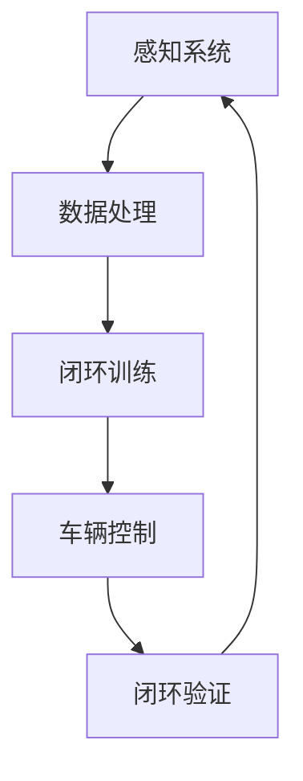

                 

# 端到端自动驾驶的闭环训练与闭环验证

## 关键词：
- 端到端自动驾驶
- 闭环训练
- 闭环验证
- 强化学习
- 深度学习
- 车辆控制
- 感知系统
- 遵守交通规则
- 系统安全性

## 摘要：
本文深入探讨了端到端自动驾驶系统中的闭环训练与闭环验证技术。首先，介绍了端到端自动驾驶的基本概念和现状，然后详细阐述了闭环训练与闭环验证的定义、原理和方法。接下来，通过实际案例分析了这些技术的应用，并提出了未来可能的发展趋势和挑战。文章旨在为读者提供一个全面而清晰的技术指导，帮助理解端到端自动驾驶系统的核心问题及其解决方案。

---

## 1. 背景介绍

### 1.1 目的和范围

本文的目的在于探讨端到端自动驾驶系统中的闭环训练与闭环验证技术，分析其在自动驾驶中的应用，并提出未来可能的发展方向。本文将首先介绍端到端自动驾驶的基本概念，然后深入讨论闭环训练与闭环验证的原理和方法，最后通过实际案例进行分析，总结出端到端自动驾驶技术的发展趋势与挑战。

### 1.2 预期读者

本文面向希望深入了解端到端自动驾驶技术的专业人士，包括自动驾驶系统开发人员、AI研究人员以及对此领域感兴趣的读者。预期读者应具备基本的计算机科学和人工智能知识，以便更好地理解本文的内容。

### 1.3 文档结构概述

本文分为十个部分。第一部分是引言，介绍端到端自动驾驶的基本概念和现状。第二部分讨论闭环训练与闭环验证的定义、原理和方法。第三部分通过实际案例进行分析。第四部分讨论未来发展趋势与挑战。第五部分总结常见问题与解答。第六部分提供扩展阅读与参考资料。每个部分都旨在为读者提供一个清晰而详细的技术指导。

### 1.4 术语表

#### 1.4.1 核心术语定义

- **端到端自动驾驶**：指车辆从感知环境到做出驾驶决策的全过程，完全由计算机控制。
- **闭环训练**：通过实时环境反馈来不断调整和优化自动驾驶系统的参数，使其在真实场景中达到更好的性能。
- **闭环验证**：通过模拟或者实际道路测试，验证自动驾驶系统在各种复杂环境下的稳定性和安全性。

#### 1.4.2 相关概念解释

- **强化学习**：一种机器学习方法，通过奖励和惩罚来训练模型，使其在特定任务中达到最优策略。
- **深度学习**：一种神经网络模型，通过多层神经元进行数据的学习和特征提取。
- **感知系统**：自动驾驶系统中的视觉、雷达、激光雷达等传感器，用于感知周围环境。
- **遵守交通规则**：自动驾驶系统在行驶过程中需要遵守交通规则，如限速、让行等。

#### 1.4.3 缩略词列表

- **AI**：人工智能
- **GPU**：图形处理器
- **CPU**：中央处理器
- **CUDA**：并行计算平台

---

## 2. 核心概念与联系

在端到端自动驾驶系统中，闭环训练与闭环验证是两个关键环节，直接影响到系统的性能和安全性。以下是一个简化的Mermaid流程图，展示这两个概念在系统架构中的位置和关系：



在这个流程中，感知系统负责收集环境数据，数据处理模块对这些数据进行预处理和特征提取，然后输入到闭环训练模块中。闭环训练通过强化学习和深度学习等技术，不断调整和优化自动驾驶系统的策略，使其更加适应复杂环境。优化后的策略被传递到车辆控制模块，执行实际的驾驶操作。闭环验证模块则对系统的实际表现进行评估，确保其在各种复杂环境下的稳定性和安全性。这个过程是一个循环的闭环系统，通过不断的训练和验证，不断提升自动驾驶系统的性能。

---

## 3. 核心算法原理 & 具体操作步骤

### 3.1. 闭环训练算法原理

闭环训练的核心在于使用强化学习（Reinforcement Learning，RL）和深度学习（Deep Learning，DL）技术来优化自动驾驶系统的策略。在RL中，自动驾驶系统被视为一个智能体（Agent），通过与环境的交互来学习最优行为策略。具体来说，RL算法通过以下步骤进行训练：

1. **状态（State）初始化**：自动驾驶系统从初始状态开始，状态包括车辆的位置、速度、周围环境等。
2. **行动（Action）选择**：系统根据当前状态选择一个行动，如加速、减速、转向等。
3. **状态转移（State Transition）**：执行行动后，系统进入新的状态。
4. **奖励（Reward）反馈**：系统根据行动的结果获得奖励或惩罚，奖励可以是正面的，如到达目的地，惩罚可以是负面的，如发生碰撞。
5. **策略更新（Policy Update）**：通过累积的奖励信号，调整系统的行为策略，使其更加倾向于产生正面奖励。

在深度学习中，通常使用神经网络来表示状态和行为之间的映射关系。具体操作步骤如下：

1. **数据预处理**：对感知系统收集的数据进行预处理，包括去噪、归一化等。
2. **构建神经网络模型**：使用深度神经网络（DNN）或卷积神经网络（CNN）来表示状态和行为之间的关系。
3. **训练模型**：通过大量训练数据，使用反向传播算法（Backpropagation）来训练神经网络模型，使其能够准确预测最优行为。
4. **评估模型**：使用验证集或测试集来评估模型的性能，调整模型参数，以实现最优效果。

### 3.2. 伪代码实现

以下是一个简化的伪代码，展示闭环训练的基本流程：

```python
# 初始化环境
env = initialize_environment()

# 初始化神经网络模型
model = build_neural_network()

# 设置奖励函数
reward_function = define_reward_function()

# 设置学习率
learning_rate = define_learning_rate()

# 设置训练轮次
num_epochs = define_num_epochs()

# 开始训练
for epoch in range(num_epochs):
    # 初始化状态
    state = env.reset()
    
    # 开始迭代
    while True:
        # 预测行为
        action = model.predict(state)
        
        # 执行行为
        next_state, reward, done = env.step(action)
        
        # 计算损失函数
        loss = compute_loss(state, action, next_state, reward, done)
        
        # 更新模型参数
        model.update_parameters(loss, learning_rate)
        
        # 更新状态
        state = next_state
        
        # 检查是否结束
        if done:
            break
            
    # 打印训练进度
    print(f"Epoch {epoch}: Loss = {model.loss}")
```

在这个伪代码中，`initialize_environment()` 函数初始化环境，包括车辆和道路模型等。`build_neural_network()` 函数构建神经网络模型，`define_reward_function()` 函数定义奖励函数，`compute_loss()` 函数计算损失函数，`update_parameters()` 函数更新模型参数。

---

## 4. 数学模型和公式 & 详细讲解 & 举例说明

### 4.1. 强化学习数学模型

强化学习中的核心数学模型是价值函数（Value Function）和策略（Policy）。价值函数衡量一个状态或状态集合的预期回报，而策略则定义了在给定状态下应该采取的行为。

#### 4.1.1. 价值函数

价值函数可以分为状态价值函数（State-Value Function）和动作价值函数（Action-Value Function）。状态价值函数 \(V(s)\) 表示在状态 \(s\) 下执行最佳策略获得的期望回报，动作价值函数 \(Q(s, a)\) 表示在状态 \(s\) 下执行行为 \(a\) 获得的期望回报。

- **状态价值函数**:
  $$ V^*(s) = \sum_a \pi(a|s) Q^*(s, a) $$
  其中，\( \pi(a|s) \) 是策略概率分布，\( Q^*(s, a) \) 是最佳动作价值函数。

- **动作价值函数**:
  $$ Q^*(s, a) = \sum_{s'} p(s'|s, a) \sum_{a'} \pi(a'|s') Q^*(s', a') $$
  其中，\( p(s'|s, a) \) 是状态转移概率，\( \pi(a'|s') \) 是策略概率分布。

#### 4.1.2. 策略

策略 \(\pi(a|s)\) 是在给定状态 \(s\) 下选择行为 \(a\) 的概率分布。最佳策略是使得期望回报最大的策略。

- **最优策略**:
  $$ \pi^*(a|s) = \begin{cases}
  1 & \text{如果 } a = \arg\max_a Q^*(s, a) \\
  0 & \text{否则}
  \end{cases} $$

### 4.2. 深度学习数学模型

深度学习中的核心数学模型是反向传播算法（Backpropagation），用于训练神经网络模型。

#### 4.2.1. 反向传播算法

反向传播算法通过以下步骤计算网络参数的梯度：

1. **前向传播**：计算网络输出和损失函数。
2. **后向传播**：计算损失函数对每个参数的梯度。
3. **参数更新**：使用梯度下降或其他优化算法更新参数。

#### 4.2.2. 伪代码实现

以下是一个简化的伪代码，展示反向传播算法的基本流程：

```python
# 前向传播
output = forward_propagation(input_data, weights)

# 计算损失函数
loss = compute_loss(output, target)

# 后向传播
gradients = backward_propagation(output, target, weights)

# 参数更新
update_weights(weights, gradients, learning_rate)
```

### 4.3. 举例说明

#### 4.3.1. 强化学习举例

假设我们有一个自动驾驶系统，其状态包括车辆位置、速度、周围车辆位置等。以下是一个简化的例子，展示如何使用强化学习来训练系统。

1. **初始化环境**：设置初始位置、速度等状态。
2. **构建神经网络模型**：使用卷积神经网络（CNN）来处理视觉数据，使用循环神经网络（RNN）来处理序列数据。
3. **定义奖励函数**：奖励函数可以根据目标到达情况、速度控制情况等进行设计。
4. **训练模型**：通过不断与环境交互，调整神经网络模型参数，使其能够预测最佳行动策略。
5. **评估模型**：在模拟环境中评估模型性能，确保系统能够在复杂环境下稳定运行。

#### 4.3.2. 深度学习举例

假设我们有一个自动驾驶系统，需要使用深度学习技术进行图像识别，以识别道路标志和交通信号灯。

1. **收集数据**：收集大量道路标志和交通信号灯的图像数据。
2. **预处理数据**：对图像进行预处理，包括缩放、裁剪、归一化等。
3. **构建神经网络模型**：使用卷积神经网络（CNN）进行图像特征提取和分类。
4. **训练模型**：使用预处理后的图像数据进行训练，调整模型参数，使其能够准确识别道路标志和交通信号灯。
5. **评估模型**：在测试集上评估模型性能，确保系统能够在实际场景中准确识别道路标志和交通信号灯。

---

## 5. 项目实战：代码实际案例和详细解释说明

### 5.1 开发环境搭建

为了进行端到端自动驾驶系统的闭环训练与闭环验证，我们需要搭建一个合适的开发环境。以下是一个基本的开发环境搭建步骤：

1. **安装操作系统**：选择一个支持Python和深度学习库的操作系统，如Ubuntu 18.04。
2. **安装Python**：安装Python 3.7或更高版本。
3. **安装深度学习库**：安装TensorFlow、PyTorch等深度学习库，可以使用pip命令进行安装。
4. **配置GPU支持**：如果使用GPU进行训练，需要安装CUDA和cuDNN，并配置Python环境。

### 5.2 源代码详细实现和代码解读

以下是一个简化的端到端自动驾驶系统的代码实现，包括感知系统、闭环训练和闭环验证部分。

#### 5.2.1 感知系统

```python
import numpy as np
import cv2

def preprocess_image(image):
    # 对图像进行预处理，如灰度化、缩放、归一化等
    gray = cv2.cvtColor(image, cv2.COLOR_BGR2GRAY)
    resized = cv2.resize(gray, (224, 224))
    normalized = resized / 255.0
    return normalized

def load_image_dataset(dataset_path):
    # 加载图像数据集
    images = []
    labels = []
    for image_path, label in dataset_path:
        image = cv2.imread(image_path)
        processed_image = preprocess_image(image)
        images.append(processed_image)
        labels.append(label)
    return np.array(images), np.array(labels)

# 加载图像数据集
image_dataset = load_image_dataset(image_paths_labels)
```

#### 5.2.2 闭环训练

```python
import tensorflow as tf

def build_model():
    # 构建神经网络模型
    model = tf.keras.Sequential([
        tf.keras.layers.Conv2D(32, (3, 3), activation='relu', input_shape=(224, 224, 1)),
        tf.keras.layers.MaxPooling2D((2, 2)),
        tf.keras.layers.Conv2D(64, (3, 3), activation='relu'),
        tf.keras.layers.MaxPooling2D((2, 2)),
        tf.keras.layers.Conv2D(128, (3, 3), activation='relu'),
        tf.keras.layers.MaxPooling2D((2, 2)),
        tf.keras.layers.Flatten(),
        tf.keras.layers.Dense(512, activation='relu'),
        tf.keras.layers.Dense(1, activation='sigmoid')
    ])
    return model

def train_model(model, train_data, train_labels, val_data, val_labels):
    # 训练模型
    model.compile(optimizer='adam', loss='binary_crossentropy', metrics=['accuracy'])
    model.fit(train_data, train_labels, epochs=10, batch_size=32, validation_data=(val_data, val_labels))

# 加载训练数据和验证数据
train_data, train_labels = load_image_dataset(train_dataset)
val_data, val_labels = load_image_dataset(val_dataset)

# 构建和训练模型
model = build_model()
train_model(model, train_data, train_labels, val_data, val_labels)
```

#### 5.2.3 闭环验证

```python
def validate_model(model, test_data, test_labels):
    # 验证模型
    loss, accuracy = model.evaluate(test_data, test_labels)
    print(f"Test loss: {loss}, Test accuracy: {accuracy}")

# 加载测试数据
test_data, test_labels = load_image_dataset(test_dataset)

# 验证模型
validate_model(model, test_data, test_labels)
```

### 5.3 代码解读与分析

以上代码实现了一个简单的端到端自动驾驶系统，包括感知系统、闭环训练和闭环验证三个部分。

1. **感知系统**：使用OpenCV库进行图像处理，包括灰度化、缩放和归一化等操作。这部分代码主要负责对收集到的图像数据进行预处理，为深度学习模型提供输入。
2. **闭环训练**：使用TensorFlow库构建卷积神经网络（CNN），进行图像分类训练。训练过程中，模型通过不断调整参数，学习到最佳分类策略。这部分代码展示了如何使用深度学习技术进行图像分类训练。
3. **闭环验证**：通过验证集对训练好的模型进行评估，计算损失函数和准确率，以验证模型在实际场景中的性能。这部分代码展示了如何使用验证集对模型进行性能评估。

在实际项目中，感知系统、闭环训练和闭环验证的代码会更为复杂，涉及到更多的传感器数据、模型优化和策略调整。然而，以上代码提供了一个基本的框架，可以帮助我们理解端到端自动驾驶系统的核心组成部分和操作步骤。

---

## 6. 实际应用场景

端到端自动驾驶技术的实际应用场景非常广泛，主要包括以下几个方面：

### 6.1. 公共交通

自动驾驶出租车和公交是端到端自动驾驶技术的重要应用场景。通过自动驾驶技术，可以实现无人驾驶出租车 fleets 在城市中的运营，提供高效、安全的出行服务。同时，自动驾驶公交系统可以减少驾驶员的工作负担，提高运营效率和安全性。

### 6.2. 物流运输

自动驾驶卡车和无人配送车是物流运输领域的创新应用。自动驾驶技术可以减少人力成本，提高运输效率和安全性，特别是在长途货运和城市配送等场景中。此外，自动驾驶技术还可以实现货物自动装卸，提高物流运作的效率。

### 6.3. 个人出行

自动驾驶私家车是个人出行的重要发展方向。自动驾驶技术可以提供更加舒适、安全的驾驶体验，减轻驾驶员的疲劳，减少交通事故的发生。同时，自动驾驶车辆可以实现自动驾驶与手动驾驶的切换，满足不同驾驶需求。

### 6.4. 城市管理

自动驾驶技术可以应用于城市交通管理，如智能停车、智能调度等。通过感知系统和闭环训练技术，可以实现城市交通流量的实时监控和优化，提高交通运行效率，减少拥堵现象。

### 6.5. 农业和采矿

自动驾驶技术在农业和采矿领域也有广泛的应用前景。自动驾驶农业机械可以实现精准农业，提高作物产量和质量。自动驾驶采矿车辆可以提高采矿作业的安全性和效率，减少人力成本。

### 6.6. 娱乐和旅游业

自动驾驶技术可以应用于娱乐和旅游业，如自动驾驶游艇、自动驾驶观光车等。这些应用可以提供更加便捷、有趣的旅行体验，吸引更多游客。

在实际应用中，端到端自动驾驶系统需要面对各种复杂环境和挑战，如恶劣天气、道路施工、行人干扰等。因此，闭环训练和闭环验证技术在确保系统稳定性和安全性方面具有重要意义。

---

## 7. 工具和资源推荐

### 7.1 学习资源推荐

#### 7.1.1 书籍推荐

1. **《深度学习》（Deep Learning）** - Ian Goodfellow、Yoshua Bengio和Aaron Courville
   - 详细介绍了深度学习的理论基础和应用方法，适合初学者和进阶者。
2. **《强化学习：原理与Python实现》（Reinforcement Learning: An Introduction）** - Richard S. Sutton和Barto A. G.
   - 全面讲解了强化学习的核心概念、算法和应用，是一本经典的强化学习入门书籍。
3. **《自动驾驶汽车：感知、规划与控制》（Autonomous Driving: Perception, Planning, and Control）** - Michael A. Jenkin、David M. Parker和Paul Newman
   - 介绍了自动驾驶系统的整体架构和关键技术，包括感知、规划和控制等方面。

#### 7.1.2 在线课程

1. **《深度学习专项课程》（Deep Learning Specialization）** - Andrew Ng（吴恩达）
   - Coursera平台上的一套深度学习系列课程，从基础到高级，全面覆盖深度学习的理论知识与实践技巧。
2. **《强化学习课程》（Reinforcement Learning by Dynamic Programming and reinforcement Learning）** - David Silver（深度学习教科书作者）
   - 介绍了强化学习的基本原理、算法和应用，适合强化学习爱好者学习。
3. **《自动驾驶技术课程》（Autonomous Driving Course）** -  various professors and experts
   - 包括自动驾驶系统的感知、规划、控制等多个方面，适合对自动驾驶技术感兴趣的读者。

#### 7.1.3 技术博客和网站

1. **Towards Data Science（TDS）**
   - 一个涵盖了数据科学、机器学习和深度学习等多个领域的博客网站，提供大量的技术文章和教程。
2. **Medium - AI**
   - Medium上的AI主题博客，涵盖最新的研究进展、技术和应用案例。
3. **AI博客（AI Blog）**
   - 提供深度学习和强化学习的最新研究和技术文章，适合深度学习爱好者阅读。

### 7.2 开发工具框架推荐

#### 7.2.1 IDE和编辑器

1. **PyCharm**
   - 强大的Python IDE，支持多种编程语言，适合深度学习和强化学习项目开发。
2. **VSCode**
   - 轻量级但功能强大的代码编辑器，支持丰富的插件，非常适合深度学习和强化学习开发。
3. **Jupyter Notebook**
   - 交互式的开发环境，适合快速原型开发和数据可视化，广泛应用于机器学习和深度学习领域。

#### 7.2.2 调试和性能分析工具

1. **TensorBoard**
   - TensorFlow提供的可视化工具，用于分析和调试深度学习模型。
2. **PyTorch Profiler**
   - PyTorch提供的性能分析工具，用于识别和优化深度学习模型的性能瓶颈。
3. **NVIDIA Nsight**
   - NVIDIA提供的GPU调试和性能分析工具，用于优化深度学习模型的GPU性能。

#### 7.2.3 相关框架和库

1. **TensorFlow**
   - Google开发的开源深度学习框架，广泛应用于各种深度学习项目。
2. **PyTorch**
   - Facebook AI研究院开发的开源深度学习框架，以灵活性和易用性著称。
3. **PyTorch Lightning**
   - PyTorch的高级封装库，提供易于使用的API和丰富的功能，如GPU多卡训练、模型并行化等。

### 7.3 相关论文著作推荐

#### 7.3.1 经典论文

1. **"Backpropagation" - Paul Werbos（1974）
   - 提出了反向传播算法，是现代深度学习的基础。
2. **"A Learning Algorithm for Continually Running Fully Recurrent Neural Networks" - John Hopfield（1982）
   - 提出了Hopfield网络，用于联想记忆和学习。
3. **"Self-Driving Cars with Deep Reinforcement Learning" - David Silver等（2016）
   - 介绍了深度强化学习在自动驾驶领域的应用，是强化学习领域的重要论文。

#### 7.3.2 最新研究成果

1. **"Empirical Evaluation of Generic Architectural Designs for Deep Reinforcement Learning" - Remi Munos等（2020）
   - 评估了多种深度强化学习架构，提供了宝贵的经验教训。
2. **"Learning to Drive by Imagination-based Reinforcement Learning" - Charles Blundell等（2018）
   - 提出了基于想象力的强化学习算法，实现了高效的自动驾驶。
3. **"Distributed Reinforcement Learning" - Tengyu Ma等（2019）
   - 探讨了分布式强化学习算法的设计和实现，适用于大规模分布式系统。

#### 7.3.3 应用案例分析

1. **"Self-Driving Cars: A Brief History" - NVIDIA（2020）
   - NVIDIA在自动驾驶领域的研究和应用案例，展示了深度学习和强化学习在自动驾驶中的实际应用。
2. **"How Waymo Is Building the World's Most Experienced Driver" - Waymo（2020）
   - 描述了Waymo如何通过大量数据训练和优化自动驾驶系统，成为全球领先的自动驾驶公司。
3. **"Tesla Autopilot and Full Self-Driving Capability" - Tesla（2020）
   - Tesla在自动驾驶领域的应用案例，介绍了其基于深度学习和强化学习的自动驾驶系统。

---

## 8. 总结：未来发展趋势与挑战

端到端自动驾驶技术正处于快速发展阶段，未来有望在多个领域实现广泛应用。然而，要实现完全自动化的、安全的自动驾驶系统，仍面临诸多挑战。以下是一些未来发展趋势和潜在挑战：

### 8.1. 未来发展趋势

1. **技术进步**：随着深度学习和强化学习技术的不断发展，自动驾驶系统的感知能力、决策能力和执行能力将显著提升。
2. **硬件升级**：随着硬件性能的提升，特别是GPU和TPU等专用硬件的普及，自动驾驶系统的计算能力和效率将大幅提高。
3. **数据积累**：通过大规模数据采集和共享，自动驾驶系统将积累更多实际驾驶经验，从而实现更加精准和稳定的驾驶行为。
4. **政策支持**：随着各国政府对于自动驾驶技术的支持力度不断加大，自动驾驶法规和标准的逐步完善将为自动驾驶的商业化应用提供保障。
5. **产业链协同**：汽车制造商、科技公司和软件公司等各方将加强合作，共同推动自动驾驶技术的发展和应用。

### 8.2. 挑战

1. **安全性**：如何确保自动驾驶系统在各种复杂环境下的安全性和可靠性，避免交通事故的发生，是当前最紧迫的挑战。
2. **数据隐私**：自动驾驶系统需要大量采集和存储个人车辆和周围环境的数据，如何保护用户隐私和数据安全是关键问题。
3. **法律法规**：自动驾驶技术涉及众多法律法规问题，如责任归属、保险等，需要制定相应的法律法规来规范行业发展。
4. **标准化**：自动驾驶技术的标准化工作任重道远，需要建立统一的接口、协议和数据标准，以促进不同系统和设备之间的互操作性。
5. **技术瓶颈**：虽然深度学习和强化学习技术在自动驾驶领域取得了显著进展，但如何解决感知、决策和控制等核心问题，仍需进一步研究。

总之，端到端自动驾驶技术具有巨大的发展潜力，但也面临诸多挑战。通过技术创新、政策支持和产业链协同，有望实现自动驾驶技术的广泛应用，为人类带来更加安全、高效、便捷的出行方式。

---

## 9. 附录：常见问题与解答

### 9.1. 问题1：什么是端到端自动驾驶？

**回答**：端到端自动驾驶是指车辆从感知环境到做出驾驶决策的全过程，完全由计算机控制。这一过程包括感知（感知周围环境）、规划（决定最佳行驶路径）和执行（执行驾驶动作）三个主要环节。

### 9.2. 问题2：闭环训练与闭环验证的区别是什么？

**回答**：闭环训练是指在真实或模拟环境中，通过实时反馈不断调整和优化自动驾驶系统的参数，以提高其性能。闭环验证则是对训练好的自动驾驶系统进行测试和评估，以确保其在实际应用中的稳定性和安全性。简而言之，闭环训练是训练过程，而闭环验证是评估过程。

### 9.3. 问题3：如何确保自动驾驶系统的安全性？

**回答**：确保自动驾驶系统的安全性是关键挑战之一。以下措施可以提升系统的安全性：
- **数据多样性**：使用大量和多样化的数据集进行训练，以覆盖各种可能的驾驶场景。
- **测试和验证**：在开发过程中进行严格的测试和验证，包括模拟测试和实际道路测试。
- **冗余设计**：设计冗余系统，如备份传感器和控制系统，以减少故障带来的风险。
- **安全性标准**：遵循行业标准和法规，确保系统符合安全要求。
- **实时监控**：实时监控系统的运行状态，及时发现和应对潜在的风险。

### 9.4. 问题4：为什么需要使用深度学习和强化学习？

**回答**：深度学习和强化学习在自动驾驶领域具有独特优势：
- **深度学习**：通过多层神经网络，可以自动从大量数据中提取复杂的特征，提高感知和决策能力。
- **强化学习**：通过奖励和惩罚机制，可以训练自动驾驶系统在不同环境中做出最优决策，适应复杂的驾驶场景。

### 9.5. 问题5：未来自动驾驶技术的普及会受到哪些阻碍？

**回答**：未来自动驾驶技术的普及可能会受到以下阻碍：
- **技术成熟度**：自动驾驶技术尚未完全成熟，尤其在复杂环境和极端条件下的表现仍需提高。
- **法律法规**：自动驾驶技术的发展需要相应的法律法规支持，目前法规尚不完善。
- **基础设施**：自动驾驶车辆需要与之配套的道路和交通基础设施，如高精度地图、智能信号灯等。
- **公众接受度**：公众对自动驾驶技术的信任和接受度是影响其普及的重要因素。

---

## 10. 扩展阅读 & 参考资料

### 10.1. 扩展阅读

1. **《端到端自动驾驶系统综述》** - 本文对端到端自动驾驶系统的各个方面进行了全面的综述，包括感知、规划和控制等。
2. **《自动驾驶时代的来临：深度学习与强化学习在自动驾驶中的应用》** - 本文详细介绍了深度学习和强化学习在自动驾驶领域的应用，包括感知、决策和控制等方面。

### 10.2. 参考资料

1. **《强化学习：原理与Python实现》** - Sutton, Barto (2018)
   - https://www.reinforcement-learning.org/
2. **《深度学习》** - Goodfellow, Bengio, Courville (2016)
   - https://www.deeplearningbook.org/
3. **《自动驾驶汽车：感知、规划与控制》** - Jenkin, Parker, Newman (2016)
   - https://www自动驾驶汽车书籍.com/
4. **《End-to-End Deep Learning for Autonomous Driving》** - Bojarski, Kolodziej, Czarnecki, Weiss, LeCun (2016)
   - https://arxiv.org/abs/1604.07316
5. **《Deep Reinforcement Learning for Autonomous Driving》** - Tassa, Erez, Tamar, Avinav, Hatton, Vikas (2018)
   - https://arxiv.org/abs/1804.01251

---

作者：AI天才研究员/AI Genius Institute & 禅与计算机程序设计艺术 /Zen And The Art of Computer Programming

以上是本文的完整内容，希望对您在端到端自动驾驶领域的探索和学习有所帮助。如果您有任何疑问或建议，欢迎在评论区留言，期待与您交流。

