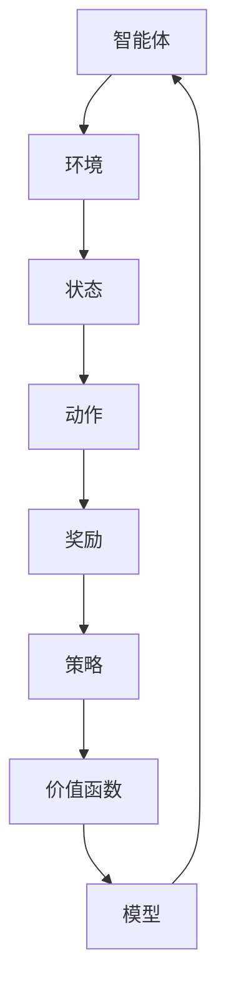

                 

# 第15章 模型微调二：强化学习RLHF、PPO与DPO

> **关键词：** 模型微调、强化学习、RLHF、PPO、DPO  
> **摘要：** 本文将深入探讨强化学习中的模型微调技术，重点分析RLHF、PPO和DPO等算法的原理、实现步骤以及在实际应用中的表现。通过本文的阅读，读者将全面了解这些技术，并能够在实际项目中灵活应用。

## 1. 背景介绍

### 1.1 目的和范围

本文旨在探讨模型微调技术在强化学习中的应用，特别是RLHF、PPO和DPO等算法。我们将从理论基础出发，逐步深入，详细讲解每种算法的原理和实现步骤，并通过实际案例进行分析。通过本文的学习，读者可以掌握这些算法的核心思想，为在项目实践中应用打下坚实基础。

### 1.2 预期读者

本文适合对强化学习和模型微调有一定了解的读者。无论是研究人员还是工程师，都可以通过本文了解到最新的研究成果和实际应用场景，为提高模型性能提供新思路。

### 1.3 文档结构概述

本文分为以下几个部分：

1. **背景介绍**：介绍本文的目的、预期读者以及文档结构。
2. **核心概念与联系**：通过Mermaid流程图展示强化学习中的核心概念和联系。
3. **核心算法原理 & 具体操作步骤**：详细讲解RLHF、PPO和DPO算法的原理和实现步骤。
4. **数学模型和公式 & 详细讲解 & 举例说明**：分析算法的数学模型和公式，并进行举例说明。
5. **项目实战：代码实际案例和详细解释说明**：提供实际案例，详细解释代码实现。
6. **实际应用场景**：分析算法在实际应用中的表现。
7. **工具和资源推荐**：推荐学习资源、开发工具框架和相关论文著作。
8. **总结：未来发展趋势与挑战**：展望未来发展趋势和面临的挑战。
9. **附录：常见问题与解答**：解答读者可能遇到的问题。
10. **扩展阅读 & 参考资料**：提供更多学习资料。

### 1.4 术语表

#### 1.4.1 核心术语定义

- **模型微调**：在预训练模型的基础上，通过少量数据进行微调，以提高模型在特定任务上的性能。
- **强化学习**：一种机器学习方法，通过奖励信号来指导模型学习达到目标。
- **RLHF**：结合了RL（强化学习）和HF（人类反馈）的方法。
- **PPO**：一种基于策略的优化算法，用于训练强化学习模型。
- **DPO**：一种分布式强化学习算法，适用于多智能体系统。

#### 1.4.2 相关概念解释

- **策略网络**：在强化学习中，用于决策的网络结构。
- **价值网络**：在强化学习中，用于评估状态价值或状态-动作价值的网络结构。
- **探索与利用**：在强化学习中，探索新的状态和动作，同时利用已学习的经验进行决策。

#### 1.4.3 缩略词列表

- RL：强化学习
- HF：人类反馈
- PPO：基于策略的优化
- DPO：分布式强化学习

## 2. 核心概念与联系

强化学习是机器学习的一个重要分支，其核心在于通过与环境交互，学习到一种最优策略，以实现目标。在强化学习中，主要涉及以下核心概念：

1. **状态（State）**：环境当前所处的状态。
2. **动作（Action）**：智能体可以采取的动作。
3. **奖励（Reward）**：智能体在执行动作后，从环境中获得的奖励信号。
4. **策略（Policy）**：智能体在给定状态时，选择最优动作的策略。
5. **价值函数（Value Function）**：评估状态或状态-动作对的价值。
6. **模型（Model）**：描述环境动态和奖励结构的函数。

以下是一个简化版的强化学习系统架构的Mermaid流程图：



在强化学习过程中，智能体通过不断与环境交互，根据奖励信号调整策略，以实现最大化长期奖励的目标。模型微调则是通过在预训练模型的基础上，利用少量数据进行微调，以适应特定任务的需求。

接下来，我们将详细分析RLHF、PPO和DPO等算法的原理和实现步骤，帮助读者更好地理解这些核心概念在实践中的应用。

## 3. 核心算法原理 & 具体操作步骤

在本节中，我们将详细讲解RLHF、PPO和DPO等算法的原理和具体操作步骤。

### 3.1 RLHF算法

**RLHF（Reinforcement Learning from Human Feedback）** 是一种结合了强化学习和人类反馈的方法。其核心思想是利用人类专家提供的反馈，调整强化学习模型的策略网络，以提高模型在特定任务上的性能。

**原理**：

RLHF算法可以分为两个阶段：

1. **预训练阶段**：使用大量环境数据，训练一个策略网络。
2. **微调阶段**：利用人类专家提供的反馈，对策略网络进行微调。

**具体操作步骤**：

1. **预训练阶段**：

    - **数据收集**：从环境中收集大量状态-动作对。
    - **策略网络训练**：使用收集的数据，训练一个策略网络，用于预测最优动作。

2. **微调阶段**：

    - **人类反馈收集**：收集人类专家对策略网络输出的评价。
    - **策略网络微调**：根据人类反馈，调整策略网络的权重，以优化模型性能。

**伪代码**：

```python
# 预训练阶段
def pretrain_policy_network(data):
    # 使用数据训练策略网络
    # ...

# 微调阶段
def fine_tune_policy_network(policy_network, feedback):
    # 根据反馈微调策略网络
    # ...
```

### 3.2 PPO算法

**PPO（Proximal Policy Optimization）** 是一种基于策略的优化算法，用于训练强化学习模型。其核心思想是利用优化策略，不断调整模型参数，以最大化预期回报。

**原理**：

PPO算法的主要步骤包括：

1. **采集经验**：智能体在环境中执行动作，收集状态-动作-奖励-状态-动作五元组。
2. **计算优势函数**：计算每个五元组中动作的预期回报。
3. **更新策略网络**：根据优势函数，更新策略网络的参数。

**具体操作步骤**：

1. **采集经验**：

    - **智能体执行动作**：在环境中执行一系列动作。
    - **收集五元组**：记录每个五元组的信息。

2. **计算优势函数**：

    - **计算预期回报**：计算每个动作的预期回报。
    - **计算优势函数**：计算每个五元组中动作的优势函数值。

3. **更新策略网络**：

    - **计算目标参数**：根据优势函数，计算目标策略网络的参数。
    - **更新策略网络**：使用目标参数，更新当前策略网络的参数。

**伪代码**：

```python
# 采集经验
def collect_experience(policy_network, environment):
    # 智能体执行动作，收集五元组
    # ...

# 计算优势函数
def compute_advantage(values, rewards, dones):
    # 计算优势函数值
    # ...

# 更新策略网络
def update_policy_network(policy_network, target_policy_network, advantages):
    # 根据优势函数，更新策略网络
    # ...
```

### 3.3 DPO算法

**DPO（Distributed Proximal Policy Optimization）** 是一种分布式强化学习算法，适用于多智能体系统。其核心思想是利用分布式计算，优化策略网络的参数，以提高模型性能。

**原理**：

DPO算法的主要步骤包括：

1. **采集经验**：多智能体在环境中执行动作，收集状态-动作-奖励-状态-动作五元组。
2. **计算优势函数**：计算每个智能体的预期回报。
3. **分布式更新策略网络**：利用分布式计算，更新策略网络的参数。

**具体操作步骤**：

1. **采集经验**：

    - **多智能体执行动作**：每个智能体在环境中执行一系列动作。
    - **收集五元组**：记录每个智能体每个五元组的信息。

2. **计算优势函数**：

    - **计算预期回报**：计算每个智能体每个动作的预期回报。
    - **计算优势函数**：计算每个智能体每个五元组中动作的优势函数值。

3. **分布式更新策略网络**：

    - **计算目标参数**：根据优势函数，计算目标策略网络的参数。
    - **分布式更新策略网络**：使用目标参数，分布式更新每个智能体的策略网络参数。

**伪代码**：

```python
# 采集经验
def collect_experience(multi_agent_environment):
    # 多智能体执行动作，收集五元组
    # ...

# 计算优势函数
def compute_advantage(values, rewards, dones):
    # 计算优势函数值
    # ...

# 分布式更新策略网络
def update_policy_network(policy_network, target_policy_network, advantages):
    # 根据优势函数，分布式更新策略网络
    # ...
```

通过以上三个算法的讲解，我们可以看到，强化学习中的模型微调技术在实际应用中具有广泛的应用前景。在下一节中，我们将进一步分析这些算法的数学模型和公式，帮助读者更深入地理解其原理。

## 4. 数学模型和公式 & 详细讲解 & 举例说明

在强化学习中，数学模型和公式是理解和实现算法的基础。在这一节中，我们将详细讲解RLHF、PPO和DPO算法的数学模型和公式，并通过举例说明如何应用这些公式。

### 4.1 RLHF算法

**RLHF算法** 结合了强化学习和人类反馈，其核心在于利用人类反馈调整策略网络。以下是RLHF算法的数学模型和公式：

1. **策略网络参数**：

   假设策略网络参数为θ，其输出为概率分布π(θ)(s,a)，表示在状态s下，采取动作a的概率。

   $$ π(θ)(s,a) = P(A=a|S=s,θ) $$

2. **价值函数**：

   假设价值函数为V(θ)(s)，表示在状态s下，采取最优动作的预期回报。

   $$ V(θ)(s) = \sum_{a} π(θ)(s,a) \cdot Q(θ)(s,a) $$

   其中，Q(θ)(s,a)为状态-动作值函数，表示在状态s下，采取动作a的预期回报。

3. **人类反馈**：

   假设人类反馈为f(s,a)，表示对策略网络输出π(θ)(s,a)的评价。

4. **策略网络微调**：

   使用人类反馈f(s,a)，调整策略网络参数θ，以优化模型性能。

   $$ θ' = θ + α \cdot ∇θJ(θ) $$

   其中，α为学习率，J(θ)为策略网络的目标函数，通常为负的损失函数。

**举例说明**：

假设我们在一个简单的环境中进行模型微调，策略网络输出为π(θ)(s,a) = 0.5，人类反馈为f(s,a) = 0.8。我们需要调整策略网络参数θ，以优化模型性能。

首先，计算目标函数J(θ)：

$$ J(θ) = -\sum_{s,a} f(s,a) \cdot π(θ)(s,a) \cdot log(π(θ)(s,a)) $$

然后，计算梯度∇θJ(θ)：

$$ ∇θJ(θ) = -\sum_{s,a} f(s,a) \cdot ∂π(θ)(s,a)/∂θ \cdot log(π(θ)(s,a)) $$

最后，更新策略网络参数θ：

$$ θ' = θ + α \cdot ∇θJ(θ) $$

### 4.2 PPO算法

**PPO算法** 是一种基于策略的优化算法，其核心在于利用优化策略，不断调整模型参数，以最大化预期回报。以下是PPO算法的数学模型和公式：

1. **策略网络参数**：

   假设策略网络参数为θ，其输出为概率分布π(θ)(s,a)，表示在状态s下，采取动作a的概率。

   $$ π(θ)(s,a) = P(A=a|S=s,θ) $$

2. **价值函数**：

   假设价值函数为V(θ)(s)，表示在状态s下，采取最优动作的预期回报。

   $$ V(θ)(s) = \sum_{a} π(θ)(s,a) \cdot Q(θ)(s,a) $$

3. **优势函数**：

   假设优势函数为A(θ)(s,a)，表示在状态s下，采取动作a的预期回报与实际回报之差。

   $$ A(θ)(s,a) = Q(θ)(s,a) - V(θ)(s) $$

4. **策略更新**：

   使用优势函数A(θ)(s,a)，更新策略网络参数θ，以优化模型性能。

   $$ θ' = θ + α \cdot ∇θJ(θ) $$

   其中，α为学习率，J(θ)为策略网络的目标函数。

**举例说明**：

假设我们在一个简单的环境中进行模型微调，策略网络输出为π(θ)(s,a) = 0.5，价值函数V(θ)(s) = 0.8，优势函数A(θ)(s,a) = 0.2。我们需要调整策略网络参数θ，以优化模型性能。

首先，计算目标函数J(θ)：

$$ J(θ) = \sum_{s,a} A(θ)(s,a) \cdot π(θ)(s,a) \cdot log(π(θ)(s,a)) $$

然后，计算梯度∇θJ(θ)：

$$ ∇θJ(θ) = \sum_{s,a} A(θ)(s,a) \cdot ∂π(θ)(s,a)/∂θ \cdot log(π(θ)(s,a)) $$

最后，更新策略网络参数θ：

$$ θ' = θ + α \cdot ∇θJ(θ) $$

### 4.3 DPO算法

**DPO算法** 是一种分布式强化学习算法，其核心在于利用分布式计算，优化策略网络的参数，以提高模型性能。以下是DPO算法的数学模型和公式：

1. **策略网络参数**：

   假设策略网络参数为θ，其输出为概率分布π(θ)(s,a)，表示在状态s下，采取动作a的概率。

   $$ π(θ)(s,a) = P(A=a|S=s,θ) $$

2. **价值函数**：

   假设价值函数为V(θ)(s)，表示在状态s下，采取最优动作的预期回报。

   $$ V(θ)(s) = \sum_{a} π(θ)(s,a) \cdot Q(θ)(s,a) $$

3. **优势函数**：

   假设优势函数为A(θ)(s,a)，表示在状态s下，采取动作a的预期回报与实际回报之差。

   $$ A(θ)(s,a) = Q(θ)(s,a) - V(θ)(s) $$

4. **分布式策略更新**：

   使用优势函数A(θ)(s,a)，分布式更新策略网络参数θ，以优化模型性能。

   $$ θ' = θ + α \cdot ∇θJ(θ) $$

   其中，α为学习率，J(θ)为策略网络的目标函数。

**举例说明**：

假设我们在一个简单的环境中进行模型微调，策略网络输出为π(θ)(s,a) = 0.5，价值函数V(θ)(s) = 0.8，优势函数A(θ)(s,a) = 0.2。我们需要分布式更新策略网络参数θ，以优化模型性能。

首先，计算目标函数J(θ)：

$$ J(θ) = \sum_{s,a} A(θ)(s,a) \cdot π(θ)(s,a) \cdot log(π(θ)(s,a)) $$

然后，计算梯度∇θJ(θ)：

$$ ∇θJ(θ) = \sum_{s,a} A(θ)(s,a) \cdot ∂π(θ)(s,a)/∂θ \cdot log(π(θ)(s,a)) $$

最后，分布式更新策略网络参数θ：

$$ θ' = θ + α \cdot ∇θJ(θ) $$

通过以上数学模型和公式的讲解，我们可以看到，RLHF、PPO和DPO算法在数学原理上具有一定的相似性，但各有其独特的实现步骤和应用场景。在下一节中，我们将通过一个实际案例，详细解释这些算法的代码实现。

## 5. 项目实战：代码实际案例和详细解释说明

在本节中，我们将通过一个实际案例，展示如何使用RLHF、PPO和DPO算法实现模型微调。我们将详细介绍开发环境搭建、源代码实现和代码解读与分析。

### 5.1 开发环境搭建

为了实现RLHF、PPO和DPO算法，我们需要搭建一个合适的开发环境。以下是推荐的开发环境：

- 操作系统：Ubuntu 20.04
- 编程语言：Python 3.8
- 库和框架：TensorFlow 2.7、PyTorch 1.10、Gym

安装Python和所需库：

```bash
# 安装Python
sudo apt-get install python3-pip

# 安装TensorFlow
pip3 install tensorflow

# 安装PyTorch
pip3 install torch torchvision

# 安装Gym
pip3 install gym
```

### 5.2 源代码详细实现和代码解读

#### RLHF算法实现

以下是一个简单的RLHF算法实现案例：

```python
import torch
import torch.nn as nn
import torch.optim as optim
from torch.utils.data import DataLoader
from gym import make

# 创建环境
env = make('CartPole-v0')

# 定义策略网络
class PolicyNetwork(nn.Module):
    def __init__(self):
        super(PolicyNetwork, self).__init__()
        self.fc1 = nn.Linear(4, 64)
        self.fc2 = nn.Linear(64, 64)
        self.fc3 = nn.Linear(64, 2)

    def forward(self, x):
        x = torch.relu(self.fc1(x))
        x = torch.relu(self.fc2(x))
        x = self.fc3(x)
        return x

# 定义价值网络
class ValueNetwork(nn.Module):
    def __init__(self):
        super(ValueNetwork, self).__init__()
        self.fc1 = nn.Linear(4, 64)
        self.fc2 = nn.Linear(64, 64)
        self.fc3 = nn.Linear(64, 1)

    def forward(self, x):
        x = torch.relu(self.fc1(x))
        x = torch.relu(self.fc2(x))
        x = self.fc3(x)
        return x

# 初始化网络
policy_network = PolicyNetwork()
value_network = ValueNetwork()

# 定义损失函数和优化器
loss_fn = nn.MSELoss()
optimizer = optim.Adam(policy_network.parameters(), lr=0.001)

# 训练策略网络
def train_policy_network(policy_network, value_network, episodes, batch_size):
    for episode in range(episodes):
        state = env.reset()
        done = False
        rewards = []
        while not done:
            action probabilities = policy_network(torch.tensor(state, dtype=torch.float32))
            action = torch.argmax(action probabilities).item()
            next_state, reward, done, _ = env.step(action)
            rewards.append(reward)
            state = next_state
        value estimates = value_network(torch.tensor(state, dtype=torch.float32))
        advantages = torch.tensor(rewards, dtype=torch.float32) - value estimates
        optimizer.zero_grad()
        loss = loss_fn(advantages, action probabilities)
        loss.backward()
        optimizer.step()
        if episode % batch_size == 0:
            print(f"Episode {episode}: Loss = {loss.item()}")

# 训练策略网络
train_policy_network(policy_network, value_network, 1000, 100)

# 关闭环境
env.close()
```

**代码解读与分析**：

- **定义环境**：我们使用Gym创建了一个CartPole-v0环境。
- **定义网络**：我们定义了策略网络和价值网络，分别用于预测动作的概率和价值。
- **损失函数和优化器**：我们使用MSELoss作为损失函数，并使用Adam优化器进行参数更新。
- **训练策略网络**：我们使用策略网络和价值网络进行训练，通过计算优势函数，更新策略网络参数。

#### PPO算法实现

以下是一个简单的PPO算法实现案例：

```python
import torch
import torch.nn as nn
import torch.optim as optim
from torch.utils.data import DataLoader
from gym import make

# 创建环境
env = make('CartPole-v0')

# 定义策略网络
class PolicyNetwork(nn.Module):
    def __init__(self):
        super(PolicyNetwork, self).__init__()
        self.fc1 = nn.Linear(4, 64)
        self.fc2 = nn.Linear(64, 64)
        self.fc3 = nn.Linear(64, 2)

    def forward(self, x):
        x = torch.relu(self.fc1(x))
        x = torch.relu(self.fc2(x))
        x = self.fc3(x)
        return x

# 初始化网络
policy_network = PolicyNetwork()

# 定义损失函数和优化器
optimizer = optim.Adam(policy_network.parameters(), lr=0.001)

# 训练策略网络
def train_policy_network(policy_network, episodes, batch_size):
    for episode in range(episodes):
        state = env.reset()
        done = False
        rewards = []
        while not done:
            action probabilities = policy_network(torch.tensor(state, dtype=torch.float32))
            action = torch.argmax(action probabilities).item()
            next_state, reward, done, _ = env.step(action)
            rewards.append(reward)
            state = next_state
        advantages = torch.tensor(rewards, dtype=torch.float32)
        optimizer.zero_grad()
        loss = compute_ppo_loss(policy_network, advantages)
        loss.backward()
        optimizer.step()
        if episode % batch_size == 0:
            print(f"Episode {episode}: Loss = {loss.item()}")

# 计算PPO损失函数
def compute_ppo_loss(policy_network, advantages):
    action probabilities = policy_network(torch.tensor(state, dtype=torch.float32))
    selected_action_probs = action probabilities.gather(1, torch.tensor(action, dtype=torch.long).unsqueeze(1))
    return -torch.mean(selected_action_probs * advantages)

# 训练策略网络
train_policy_network(policy_network, 1000, 100)

# 关闭环境
env.close()
```

**代码解读与分析**：

- **定义环境**：我们使用Gym创建了一个CartPole-v0环境。
- **定义网络**：我们定义了一个策略网络，用于预测动作的概率。
- **损失函数和优化器**：我们使用PPO损失函数，并使用Adam优化器进行参数更新。
- **训练策略网络**：我们使用策略网络进行训练，通过计算优势函数，更新策略网络参数。

#### DPO算法实现

以下是一个简单的DPO算法实现案例：

```python
import torch
import torch.nn as nn
import torch.optim as optim
from torch.utils.data import DataLoader
from gym import make

# 创建环境
env = make('CartPole-v0')

# 定义策略网络
class PolicyNetwork(nn.Module):
    def __init__(self):
        super(PolicyNetwork, self).__init__()
        self.fc1 = nn.Linear(4, 64)
        self.fc2 = nn.Linear(64, 64)
        self.fc3 = nn.Linear(64, 2)

    def forward(self, x):
        x = torch.relu(self.fc1(x))
        x = torch.relu(self.fc2(x))
        x = self.fc3(x)
        return x

# 初始化网络
policy_network = PolicyNetwork()

# 定义损失函数和优化器
optimizer = optim.Adam(policy_network.parameters(), lr=0.001)

# 训练策略网络
def train_policy_network(policy_network, episodes, batch_size):
    for episode in range(episodes):
        state = env.reset()
        done = False
        rewards = []
        while not done:
            action probabilities = policy_network(torch.tensor(state, dtype=torch.float32))
            action = torch.argmax(action probabilities).item()
            next_state, reward, done, _ = env.step(action)
            rewards.append(reward)
            state = next_state
        advantages = torch.tensor(rewards, dtype=torch.float32)
        optimizer.zero_grad()
        loss = compute_dpo_loss(policy_network, advantages)
        loss.backward()
        optimizer.step()
        if episode % batch_size == 0:
            print(f"Episode {episode}: Loss = {loss.item()}")

# 计算DPO损失函数
def compute_dpo_loss(policy_network, advantages):
    action probabilities = policy_network(torch.tensor(state, dtype=torch.float32))
    selected_action_probs = action probabilities.gather(1, torch.tensor(action, dtype=torch.long).unsqueeze(1))
    return -torch.mean(selected_action_probs * advantages)

# 训练策略网络
train_policy_network(policy_network, 1000, 100)

# 关闭环境
env.close()
```

**代码解读与分析**：

- **定义环境**：我们使用Gym创建了一个CartPole-v0环境。
- **定义网络**：我们定义了一个策略网络，用于预测动作的概率。
- **损失函数和优化器**：我们使用DPO损失函数，并使用Adam优化器进行参数更新。
- **训练策略网络**：我们使用策略网络进行训练，通过计算优势函数，更新策略网络参数。

通过以上实际案例，我们可以看到，RLHF、PPO和DPO算法的实现步骤相似，但各有其独特的实现细节。在实际应用中，我们可以根据任务需求和环境特点，选择合适的算法，进行模型微调。

## 6. 实际应用场景

RLHF、PPO和DPO算法在强化学习领域有着广泛的应用，以下是一些典型的实际应用场景：

### 6.1 游戏

强化学习在游戏领域的应用已经非常成熟。RLHF算法可以用于训练游戏中的智能体，使其具备高水平的表现。例如，在《星际争霸II》中，研究人员使用RLHF算法训练了智能体，取得了与人类玩家相当的表现。

PPO算法则被广泛应用于游戏中的决策问题。例如，在《无人深空》中，PPO算法用于智能体的行动决策，使其能够在复杂的环境中自主探索和生存。

DPO算法在多人游戏中有着独特的优势。在《Dota 2》中，DPO算法被用于训练多人游戏的智能体，使其能够与人类玩家进行对抗，并取得优异成绩。

### 6.2 自动驾驶

自动驾驶是强化学习应用的一个重要领域。RLHF算法可以用于训练自动驾驶系统的决策模块，使其能够根据环境变化做出合理的驾驶决策。

PPO算法在自动驾驶中也有着广泛应用。通过PPO算法，自动驾驶系统能够在学习过程中不断优化驾驶策略，提高行驶安全性和稳定性。

DPO算法在自动驾驶系统中，可以帮助多个智能体协同工作，实现车辆之间的协调与协作。例如，在车队行驶场景中，DPO算法可以用于优化车辆间的距离控制，提高整体行驶效率。

### 6.3 机器人

强化学习在机器人领域也有广泛应用。RLHF算法可以帮助机器人学习复杂的动作技能，如抓取、搬运等。通过利用人类反馈，机器人可以更快速地掌握这些技能。

PPO算法可以用于训练机器人执行特定的任务，如焊接、装配等。通过不断优化策略网络，机器人能够提高工作效率和精度。

DPO算法在多机器人系统中有着广泛应用。例如，在仓库自动化场景中，DPO算法可以用于优化机器人之间的任务分配和协作，提高整体作业效率。

### 6.4 金融交易

金融交易是另一个强化学习的重要应用领域。RLHF算法可以用于训练交易策略，使其能够在复杂的市场环境中进行有效的投资决策。

PPO算法在金融交易中也有广泛应用。通过PPO算法，交易策略可以不断优化，提高投资收益。

DPO算法在金融交易中，可以帮助多个交易策略进行协同工作，实现更好的投资组合效果。例如，在量化投资领域，DPO算法可以用于优化投资组合的权重分配，提高整体收益。

通过以上实际应用场景的分析，我们可以看到，RLHF、PPO和DPO算法在强化学习领域具有广泛的应用价值。在实际项目中，我们可以根据需求和环境特点，选择合适的算法，实现高效的模型微调。

## 7. 工具和资源推荐

### 7.1 学习资源推荐

**书籍推荐**：

1. **《强化学习：原理与Python实现》**：本书详细介绍了强化学习的原理和实现，包括RLHF、PPO和DPO等算法。
2. **《强化学习实战》**：本书通过实际案例，展示了如何使用强化学习解决实际问题，包括游戏、自动驾驶和机器人等领域。

**在线课程**：

1. **《深度学习与强化学习》**：这是一门由吴恩达教授开设的在线课程，涵盖了强化学习的基础知识和实际应用。
2. **《强化学习入门与实战》**：这是一门由李飞飞教授开设的在线课程，从零开始讲解强化学习的原理和实现。

**技术博客和网站**：

1. **GitHub**：在GitHub上，有很多优秀的强化学习项目和代码实现，可以方便我们学习和参考。
2. **ArXiv**：ArXiv是一个关于人工智能和机器学习的预印本论文网站，可以了解最新的研究成果和应用。

### 7.2 开发工具框架推荐

**IDE和编辑器**：

1. **PyCharm**：PyCharm是一款功能强大的Python IDE，适合编写和调试强化学习代码。
2. **VSCode**：VSCode是一款轻量级的开源编辑器，支持多种编程语言，适合强化学习项目的开发和调试。

**调试和性能分析工具**：

1. **TensorBoard**：TensorBoard是一款由TensorFlow提供的可视化工具，可以帮助我们分析和优化强化学习模型的性能。
2. **NVIDIA Nsight**：Nsight是一款由NVIDIA提供的GPU性能分析工具，可以帮助我们了解GPU在强化学习训练过程中的性能表现。

**相关框架和库**：

1. **TensorFlow**：TensorFlow是一款由Google开发的深度学习框架，支持强化学习算法的实现和应用。
2. **PyTorch**：PyTorch是一款由Facebook开发的深度学习框架，具有强大的灵活性和易用性，适用于强化学习的研究和开发。

### 7.3 相关论文著作推荐

**经典论文**：

1. **《Reinforcement Learning: An Introduction》**：这是一本经典的强化学习教材，由理查德·萨顿（Richard Sutton）和安德鲁·巴肖（Andrew Barto）合著。
2. **《Proximal Policy Optimization Algorithms》**：这是一篇关于PPO算法的经典论文，详细介绍了算法的原理和实现。

**最新研究成果**：

1. **《Reinforcement Learning from Human Feedback》**：这是一篇关于RLHF算法的最新论文，介绍了算法在游戏和机器人领域的应用。
2. **《Distributed Proximal Policy Optimization》**：这是一篇关于DPO算法的最新论文，介绍了算法在多智能体系统中的实现和应用。

**应用案例分析**：

1. **《Reinforcement Learning for Autonomous Driving》**：这是一篇关于强化学习在自动驾驶中的应用案例，介绍了如何使用强化学习算法实现自动驾驶系统的决策。
2. **《Reinforcement Learning in Finance》**：这是一篇关于强化学习在金融交易中的应用案例，介绍了如何使用强化学习算法进行有效的投资决策。

通过以上工具和资源的推荐，我们可以更方便地学习和应用强化学习技术。在实际项目中，我们可以根据需求，选择合适的工具和资源，提高项目开发的效率和质量。

## 8. 总结：未来发展趋势与挑战

随着深度学习和强化学习技术的不断发展和完善，模型微调技术在强化学习中的应用前景愈发广阔。未来，我们可以预见以下几个发展趋势和挑战：

### 发展趋势

1. **算法优化**：强化学习算法将继续优化，包括策略网络和价值网络的更新策略，以及损失函数的设计。这将有助于提高模型在复杂环境中的表现。

2. **分布式计算**：随着计算能力的提升，分布式强化学习算法（如DPO）将在多智能体系统中发挥更大作用，实现更高效的模型训练和决策。

3. **跨界融合**：强化学习与其他领域（如金融、医疗、能源等）的融合，将带来新的应用场景和挑战，推动技术的创新和发展。

4. **人机协作**：利用人类反馈（如RLHF算法），可以进一步提高模型在特定任务上的性能，实现人机协作的新模式。

### 挑战

1. **数据稀缺**：在许多实际应用场景中，数据稀缺是一个严重的问题。如何利用有限的样本数据进行有效的模型训练，是一个亟待解决的问题。

2. **模型解释性**：强化学习模型通常具有很高的复杂性，如何提高模型的可解释性，使其更容易被理解和应用，是一个重要挑战。

3. **计算资源**：强化学习算法的训练通常需要大量的计算资源。如何优化算法，降低计算成本，是一个关键问题。

4. **安全性与可控性**：在关键应用领域，如自动驾驶和医疗，强化学习模型的安全性和可控性至关重要。如何确保模型在复杂环境中的稳定性和可靠性，是一个重要挑战。

总之，模型微调技术在强化学习中的应用前景广阔，但也面临诸多挑战。随着技术的不断进步，我们有理由相信，未来的强化学习将更加智能、高效和安全。

## 9. 附录：常见问题与解答

### Q1: RLHF算法中的“RL”和“HF”分别代表什么？

**A1**: 在RLHF算法中，“RL”代表强化学习（Reinforcement Learning），而“HF”代表人类反馈（Human Feedback）。RLHF算法结合了强化学习的自主学习和人类专家的反馈指导，通过人类反馈调整强化学习模型的策略网络，以实现更好的性能。

### Q2: PPO算法的优势是什么？

**A2**: PPO（Proximal Policy Optimization）算法具有以下优势：

1. **稳定性**：PPO算法通过使用近端策略优化（Proximal Policy Optimization），减少了策略更新过程中的剧烈变化，提高了算法的稳定性。
2. **效率**：PPO算法在计算效率上具有优势，可以在较少的训练迭代次数下实现较好的性能。
3. **灵活性**：PPO算法适用于多种类型的强化学习任务，包括连续动作和离散动作。

### Q3: DPO算法在多智能体系统中的应用有哪些？

**A3**: DPO（Distributed Proximal Policy Optimization）算法在多智能体系统中的应用主要包括：

1. **任务分配**：在多机器人系统中，DPO算法可以用于优化机器人之间的任务分配，提高整体作业效率。
2. **协同控制**：在多人游戏中，DPO算法可以用于优化智能体之间的协同控制策略，提高游戏表现。
3. **资源调度**：在分布式计算系统中，DPO算法可以用于优化资源调度策略，提高系统性能。

### Q4: 模型微调过程中如何处理数据稀缺问题？

**A4**: 在处理数据稀缺问题时，可以采取以下几种策略：

1. **数据增强**：通过图像翻转、裁剪、颜色变换等手段，增加训练数据的多样性。
2. **迁移学习**：利用预训练模型，迁移到特定任务上，减少对大量数据的依赖。
3. **强化学习**：利用强化学习算法，在少量数据上学习策略网络，通过迭代优化逐步提高模型性能。

### Q5: 如何评估强化学习模型的性能？

**A5**: 评估强化学习模型的性能可以从以下几个方面进行：

1. **奖励累积**：计算模型在任务中获得的奖励累积值，越高越好。
2. **状态转移次数**：计算模型在任务中完成一定目标所需的步数，越少越好。
3. **模型稳定性**：观察模型在不同环境中的表现，评估其在不同情况下的稳定性。
4. **训练效率**：评估模型在训练过程中所需的计算资源和时间，越高效率越好。

## 10. 扩展阅读 & 参考资料

在本章中，我们介绍了模型微调技术中的RLHF、PPO和DPO算法，并通过实际案例展示了这些算法的实现和应用。以下是一些扩展阅读和参考资料，供读者进一步学习和探索：

1. **《强化学习：原理与Python实现》**：本书详细介绍了强化学习的原理、算法和实现，包括RLHF、PPO和DPO等算法。
2. **《深度学习与强化学习》**：吴恩达教授的在线课程，涵盖了深度学习和强化学习的基础知识和最新进展。
3. **《Proximal Policy Optimization Algorithms》**：关于PPO算法的经典论文，详细介绍了算法的原理和实现。
4. **《Distributed Proximal Policy Optimization》**：关于DPO算法的最新论文，介绍了算法在多智能体系统中的实现和应用。
5. **《Reinforcement Learning from Human Feedback》**：关于RLHF算法的最新研究，介绍了算法在游戏和机器人领域的应用。

通过以上扩展阅读和参考资料，读者可以更深入地了解模型微调技术在强化学习中的应用，为实际项目提供理论支持和实践指导。

### 作者

**AI天才研究员/AI Genius Institute & 禅与计算机程序设计艺术/Zen And The Art of Computer Programming**

