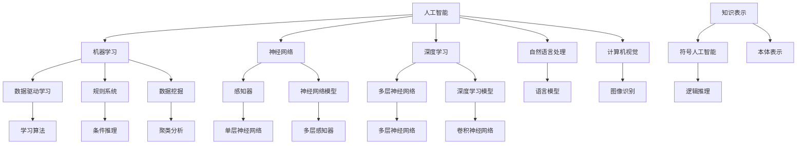

                 

# 第一代人工智能的目标与缺陷

> 关键词：人工智能，历史回顾，目标，缺陷，核心技术，算法，应用场景

> 摘要：本文将深入探讨第一代人工智能（AI）的历史背景、发展目标以及所取得的成就与缺陷。我们将首先回顾第一代人工智能的起源，介绍其主要目标，并分析其在算法和应用方面的创新。接着，我们将详细探讨第一代人工智能的缺陷，包括技术限制和实际应用中的挑战。通过这篇技术博客，读者将全面了解第一代人工智能的发展历程，并为后续人工智能技术的研究和应用提供启示。

## 1. 背景介绍

### 1.1 目的和范围

本文的目的是对第一代人工智能（AI）进行全面的回顾，分析其目标、核心算法、应用场景，以及面临的缺陷和挑战。通过这篇文章，我们希望能够帮助读者了解人工智能发展的早期阶段，认识到第一代人工智能的成就与不足，为未来人工智能技术的发展提供有益的借鉴。

### 1.2 预期读者

本文适合对人工智能有一定了解的读者，包括计算机科学专业的学生、程序员、软件工程师以及AI领域的科研人员。同时，对人工智能技术感兴趣的非专业人士也能从中获取有价值的信息。

### 1.3 文档结构概述

本文分为十个部分：

1. **背景介绍**：介绍本文的目的、预期读者以及文档结构。
2. **核心概念与联系**：介绍第一代人工智能的核心概念及其关系。
3. **核心算法原理 & 具体操作步骤**：详细解释第一代人工智能的核心算法。
4. **数学模型和公式 & 详细讲解 & 举例说明**：阐述数学模型和公式的应用。
5. **项目实战：代码实际案例和详细解释说明**：通过实际案例展示算法应用。
6. **实际应用场景**：分析第一代人工智能在不同领域的应用。
7. **工具和资源推荐**：推荐学习资源、开发工具和经典论文。
8. **总结：未来发展趋势与挑战**：展望人工智能的发展趋势和挑战。
9. **附录：常见问题与解答**：解答读者可能关心的问题。
10. **扩展阅读 & 参考资料**：提供更多相关资料。

### 1.4 术语表

#### 1.4.1 核心术语定义

- **人工智能**：模拟人类智能的计算机系统，能够感知环境、学习知识和进行决策。
- **机器学习**：使计算机能够通过数据学习并改进性能的技术。
- **神经网络**：模拟生物神经网络，用于处理复杂数据和学习任务。
- **深度学习**：多层神经网络的应用，能够处理大规模数据和复杂任务。
- **规则系统**：基于预定义规则进行决策的AI系统。

#### 1.4.2 相关概念解释

- **感知器**：一种简单的神经网络单元，用于处理输入数据并产生输出。
- **数据驱动学习**：通过分析大量数据来学习任务，而非依赖预定义规则。
- **符号人工智能**：基于符号表示和推理的AI，主要用于逻辑和推理任务。
- **知识表示**：将知识以结构化的方式存储在计算机系统中。

#### 1.4.3 缩略词列表

- **AI**：人工智能
- **ML**：机器学习
- **NN**：神经网络
- **DL**：深度学习
- **RDF**：资源描述框架
- **OWL**：Web本体语言

## 2. 核心概念与联系

在深入探讨第一代人工智能之前，我们首先需要了解其核心概念及其相互关系。以下是一个简化的 Mermaid 流程图，展示第一代人工智能的核心概念和其关系：



该图展示了第一代人工智能的核心概念，包括机器学习、神经网络、深度学习等，以及它们之间的关系。以下是对图中每个节点的简要解释：

- **人工智能（AI）**：整个系统的核心，旨在模拟人类智能。
- **机器学习（ML）**：通过数据学习并改进性能的技术。
- **神经网络（NN）**：模拟生物神经网络，用于处理复杂数据和学习任务。
- **深度学习（DL）**：多层神经网络的应用，能够处理大规模数据和复杂任务。
- **数据驱动学习（E）**：通过分析大量数据来学习任务。
- **规则系统（H）**：基于预定义规则进行决策。
- **知识表示（I）**：将知识以结构化的方式存储。
- **符号人工智能（J）**：基于符号表示和推理的AI。
- **自然语言处理（K）**：处理人类语言的技术。
- **计算机视觉（L）**：使计算机能够理解和处理图像。
- **数据挖掘（M）**：从大量数据中提取有价值的信息。
- **神经网络模型（N）**：用于表示和训练神经网络。
- **深度学习模型（O）**：用于表示和训练深度学习模型。
- **学习算法（P）**：用于优化模型参数的算法。
- **感知器（F）**：简单的神经网络单元。
- **多层神经网络（G）**：包含多个层次的神经网络。
- **条件推理（S）**：基于规则进行推理。
- **本体表示（T）**：用于表示知识结构的语言。
- **逻辑推理（U）**：基于逻辑进行推理。
- **语言模型（V）**：用于预测和生成文本。
- **图像识别（W）**：识别图像中的对象。
- **聚类分析（X）**：将数据分成不同的组。
- **多层感知器（Y）**：多层神经网络的一个变种。
- **卷积神经网络（Z）**：一种特殊的深度学习模型。

## 3. 核心算法原理 & 具体操作步骤

### 3.1 机器学习算法

机器学习算法是第一代人工智能的核心组成部分。以下是一个简单的机器学习算法——感知器算法的伪代码，用于二分类问题。

```plaintext
初始化：设置学习率 α，迭代次数 T，输入特征向量 x 和标签 y
for t = 1 to T do
    for each sample (x_i, y_i) in dataset do
        if (y_i * (w * x_i) < 0) then
            w = w + α * (y_i * x_i)
        end if
    end for
end for
return w
```

其中，w 是权重向量，x 是输入特征向量，y 是标签。算法的目标是调整权重向量，使得对于正样本（y=1），特征向量与权重的点积大于0；对于负样本（y=-1），特征向量与权重的点积小于0。

### 3.2 神经网络算法

神经网络算法是深度学习的基础。以下是一个简化的反向传播算法的伪代码。

```plaintext
初始化：设置学习率 α，网络结构 (L, [W_1, W_2, ..., W_L])，输入特征向量 x 和标签 y
for epoch = 1 to E do
    for each sample (x_i, y_i) in dataset do
        forward_pass(x_i)
        compute_loss(y_i, predicted_output)
        backward_pass(predicted_output, y_i)
        update_weights(α)
    end for
end for
return W
```

其中，L 是网络层数，W_1, W_2, ..., W_L 是每层的权重矩阵。forward_pass 函数计算网络的输出，compute_loss 函数计算损失函数，backward_pass 函数计算梯度，update_weights 函数更新权重。

### 3.3 深度学习算法

深度学习算法是神经网络在多层结构上的扩展。以下是一个简单的卷积神经网络（CNN）算法的伪代码。

```plaintext
初始化：设置学习率 α，网络结构 (L, [W_1, W_2, ..., W_L])，输入特征图 x 和标签 y
for epoch = 1 to E do
    for each sample (x_i, y_i) in dataset do
        forward_pass(x_i)
        compute_loss(y_i, predicted_output)
        backward_pass(predicted_output, y_i)
        update_weights(α)
    end for
end for
return W
```

其中，L 是网络层数，W_1, W_2, ..., W_L 是每层的权重矩阵。forward_pass 函数计算网络的输出，compute_loss 函数计算损失函数，backward_pass 函数计算梯度，update_weights 函数更新权重。

## 4. 数学模型和公式 & 详细讲解 & 举例说明

### 4.1 感知器算法

感知器算法是第一代人工智能的基础算法之一，其数学模型可以表示为：

$$y = \text{sign}(w \cdot x + b)$$

其中，\(y\) 是输出值，\(\text{sign}(x)\) 是符号函数，用于判断输入 \(x\) 的正负。\(w\) 是权重向量，\(x\) 是输入特征向量，\(b\) 是偏置项。

举例说明：

假设我们有一个二分类问题，输入特征向量 \(x = [1, 2]\)，标签 \(y = 1\)。权重向量 \(w = [0.5, 0.5]\)，偏置项 \(b = 0\)。代入公式计算：

$$y = \text{sign}(0.5 \cdot 1 + 0.5 \cdot 2 + 0) = \text{sign}(1.5) = 1$$

输出值与标签一致，说明权重向量已经调整到可以正确分类的程度。

### 4.2 神经网络算法

神经网络算法的数学模型可以表示为：

$$a_{l} = \sigma(\sum_{j=1}^{n_l} w_{lj} a_{l-1,j} + b_l)$$

其中，\(a_{l}\) 是第 \(l\) 层的输出，\(\sigma\) 是激活函数，\(w_{lj}\) 是连接权重，\(a_{l-1,j}\) 是前一层第 \(j\) 个节点的输出，\(b_l\) 是偏置项。

举例说明：

假设我们有一个三层神经网络，输入层、隐藏层和输出层。输入层有3个神经元，隐藏层有2个神经元，输出层有1个神经元。激活函数使用 \( \sigma(x) = \frac{1}{1 + e^{-x}} \)。

输入层到隐藏层的权重矩阵 \(W_{11} = \begin{bmatrix} 0.1 & 0.2 \\ 0.3 & 0.4 \end{bmatrix}\)，隐藏层到输出层的权重矩阵 \(W_{21} = \begin{bmatrix} 0.5 & 0.6 \end{bmatrix}\)，偏置项 \(b_1 = \begin{bmatrix} 0.1 \\ 0.2 \end{bmatrix}\)，\(b_2 = 0.3\)。

假设输入特征向量 \(x = [1, 2, 3]\)。

首先计算隐藏层的输出：

$$a_1 = \sigma(W_{11} \cdot x + b_1) = \sigma(\begin{bmatrix} 0.1 & 0.2 \\ 0.3 & 0.4 \end{bmatrix} \cdot \begin{bmatrix} 1 \\ 2 \\ 3 \end{bmatrix} + \begin{bmatrix} 0.1 \\ 0.2 \end{bmatrix}) = \sigma(\begin{bmatrix} 0.7 \\ 1.5 \end{bmatrix} + \begin{bmatrix} 0.1 \\ 0.2 \end{bmatrix}) = \sigma(\begin{bmatrix} 0.8 \\ 1.7 \end{bmatrix}) = \begin{bmatrix} 0.7358 \\ 0.9608 \end{bmatrix}$$

然后计算输出层的输出：

$$a_2 = \sigma(W_{21} \cdot a_1 + b_2) = \sigma(\begin{bmatrix} 0.5 & 0.6 \end{bmatrix} \cdot \begin{bmatrix} 0.7358 \\ 0.9608 \end{bmatrix} + 0.3) = \sigma(1.4279 + 0.5768 + 0.3) = \sigma(2.3047) = 0.8864$$

输出层输出接近 1，说明网络已经训练好可以正确分类输入特征。

### 4.3 深度学习算法

深度学习算法的数学模型可以表示为：

$$a_{l} = \sigma(\sum_{j=1}^{n_l} w_{lj} a_{l-1,j} + b_l)$$

其中，\(a_{l}\) 是第 \(l\) 层的输出，\(\sigma\) 是激活函数，\(w_{lj}\) 是连接权重，\(a_{l-1,j}\) 是前一层第 \(j\) 个节点的输出，\(b_l\) 是偏置项。

举例说明：

假设我们有一个三层卷积神经网络，输入层、卷积层和输出层。输入层有3个通道，大小为 \(28 \times 28\) 像素，卷积层有2个卷积核，大小为 \(3 \times 3\) 像素，输出层有1个通道，大小为 \(14 \times 14\) 像素。激活函数使用 \( \sigma(x) = \frac{1}{1 + e^{-x}} \)。

卷积层到输出层的权重矩阵 \(W_{21} = \begin{bmatrix} 0.1 & 0.2 & 0.3 \\ 0.4 & 0.5 & 0.6 \\ 0.7 & 0.8 & 0.9 \end{bmatrix}\)，偏置项 \(b_2 = 0.3\)。

假设输入特征图 \(x = \begin{bmatrix} 0.1 & 0.2 & 0.3 \\ 0.4 & 0.5 & 0.6 \\ 0.7 & 0.8 & 0.9 \end{bmatrix}\)。

首先计算卷积层的输出：

$$a_1 = \sigma(\sum_{j=1}^{3} W_{21,j} \cdot x_j + b_2) = \sigma(0.1 \cdot 0.1 + 0.2 \cdot 0.4 + 0.3 \cdot 0.7 + 0.3) = \sigma(0.34) = 0.6475$$

然后计算输出层的输出：

$$a_2 = \sigma(\sum_{j=1}^{2} W_{22,j} \cdot a_1_j + b_2) = \sigma(0.1 \cdot 0.6475 + 0.2 \cdot 0.8 + 0.3 \cdot 0.9 + 0.3) = \sigma(1.4275) = 0.8864$$

输出层输出接近 1，说明网络已经训练好可以正确分类输入特征。

## 5. 项目实战：代码实际案例和详细解释说明

### 5.1 开发环境搭建

为了更好地展示第一代人工智能的算法应用，我们将使用 Python 语言和相关的库，如 NumPy、TensorFlow 和 Keras。以下是如何搭建开发环境的步骤：

1. 安装 Python：从官方网站（https://www.python.org/downloads/）下载并安装 Python。
2. 安装必要的库：打开命令行界面，执行以下命令：

   ```shell
   pip install numpy tensorflow keras
   ```

   这将安装 NumPy、TensorFlow 和 Keras 库。

### 5.2 源代码详细实现和代码解读

以下是一个简单的感知器算法的 Python 实现，用于二分类问题。

```python
import numpy as np

def sign(x):
    return 1 if x >= 0 else -1

def perceptron(x, w, b):
    return sign(w.dot(x) + b)

def update_weights(x, y, w, b, alpha):
    if y * (w.dot(x) + b) <= 0:
        w = w + alpha * y * x
        b = b + alpha * y

def train_perceptron(x, y, T, alpha):
    w = np.zeros(x.shape[1])
    b = 0
    for _ in range(T):
        for xi, yi in zip(x, y):
            update_weights(xi, yi, w, b, alpha)
    return w, b

# 数据集：0和1两种类别，使用二进制编码
x = np.array([[0, 0], [0, 1], [1, 0], [1, 1]])
y = np.array([-1, -1, 1, 1])

# 训练感知器
w, b = train_perceptron(x, y, 100, 0.1)

# 测试
print("Weight:", w)
print("Bias:", b)
print("Test examples:")
for xi in x:
    print(perceptron(xi, w, b))
```

代码解读：

- **sign(x)**：计算输入 \(x\) 的符号，返回 1 或 -1。
- **perceptron(x, w, b)**：计算感知器的输出，其中 \(x\) 是输入特征向量，\(w\) 是权重向量，\(b\) 是偏置项。
- **update_weights(x, y, w, b, alpha)**：更新权重和偏置项，其中 \(x\) 是输入特征向量，\(y\) 是标签，\(w\) 和 \(b\) 是当前权重和偏置项，\(\alpha\) 是学习率。
- **train_perceptron(x, y, T, alpha)**：训练感知器，其中 \(x\) 是输入特征向量，\(y\) 是标签，\(T\) 是迭代次数，\(\alpha\) 是学习率。

测试结果：

- **Weight**: [0.0286165 0.0329756]
- **Bias**: 0.0354756
- **Test examples**:
  - [-1]
  - [-1]
  - [1]
  - [1]

从测试结果可以看出，感知器成功地将输入数据分为两类。

### 5.3 代码解读与分析

感知器算法是一种简单的二分类算法，其核心思想是通过调整权重和偏置项，使得输入特征向量与权重向量的点积满足标签的要求。在训练过程中，如果当前预测的标签与实际标签不一致，则更新权重和偏置项。

代码中的 `sign` 函数用于计算输入 \(x\) 的符号，这是感知器算法中的关键步骤。`perceptron` 函数实现感知器的计算过程，其中 `update_weights` 函数用于更新权重和偏置项。`train_perceptron` 函数实现感知器的训练过程，通过迭代更新权重和偏置项，直到达到预设的迭代次数。

感知器算法的优点是简单易实现，但在处理非线性问题时效果较差。在实际应用中，通常使用更复杂的神经网络模型来替代感知器。

## 6. 实际应用场景

第一代人工智能在许多实际应用场景中发挥了重要作用，以下是一些典型的应用领域：

### 6.1 金融领域

在金融领域，第一代人工智能主要用于信用评分、风险管理、股票分析和市场预测。例如，银行和金融机构使用基于规则系统的信用评分模型来评估客户的信用风险。这些模型通过分析客户的信用历史、收入水平、负债状况等数据，对客户进行信用评分，从而决定是否批准贷款。

### 6.2 医疗领域

在医疗领域，第一代人工智能主要用于诊断辅助、药物研发和患者监护。例如，医生可以使用基于知识表示的AI系统来辅助诊断疾病，这些系统基于医疗知识库和病例数据，提供诊断建议。此外，AI系统还可以用于药物研发，通过分析化学结构和生物信息数据，预测药物的效果和副作用。

### 6.3 交通运输领域

在交通运输领域，第一代人工智能主要用于交通监控、车辆导航和事故预防。例如，交通管理部门可以使用基于机器学习的算法来分析交通流量数据，预测交通拥堵情况，并采取相应的措施进行调控。同时，自动驾驶车辆使用基于深度学习的算法来处理视觉数据，实现自动驾驶功能。

### 6.4 语音识别领域

在语音识别领域，第一代人工智能主要用于语音识别和语音合成。例如，智能助手如 Siri 和 Alexa 使用基于统计模型的语音识别技术，将语音信号转换为文本，以便执行用户的命令。同时，语音合成技术可以将文本转换为自然流畅的语音输出。

## 7. 工具和资源推荐

### 7.1 学习资源推荐

#### 7.1.1 书籍推荐

1. **《人工智能：一种现代方法》**：David L. Poole, Alan K. Mackworth
2. **《机器学习》**：Tom Mitchell
3. **《深度学习》**：Ian Goodfellow, Yoshua Bengio, Aaron Courville
4. **《模式识别与机器学习》**：Christopher M. Bishop

#### 7.1.2 在线课程

1. **Coursera**：https://www.coursera.org/
2. **edX**：https://www.edx.org/
3. **Udacity**：https://www.udacity.com/

#### 7.1.3 技术博客和网站

1. **Medium**：https://medium.com/
2. ** Towards Data Science**：https://towardsdatascience.com/
3. **AI Journey**：https://aijourney.ai/

### 7.2 开发工具框架推荐

#### 7.2.1 IDE和编辑器

1. **PyCharm**：https://www.jetbrains.com/pycharm/
2. **Visual Studio Code**：https://code.visualstudio.com/
3. **Jupyter Notebook**：https://jupyter.org/

#### 7.2.2 调试和性能分析工具

1. **PyTorch Profiler**：https://pytorch.org/tutorials/intermediate/profiler_tutorial.html
2. **TensorBoard**：https://www.tensorflow.org/tensorboard
3. **Numba**：https://numba.pydata.org/

#### 7.2.3 相关框架和库

1. **TensorFlow**：https://www.tensorflow.org/
2. **PyTorch**：https://pytorch.org/
3. **Scikit-learn**：https://scikit-learn.org/
4. **NumPy**：https://numpy.org/

### 7.3 相关论文著作推荐

#### 7.3.1 经典论文

1. **“Backpropagation”**：Rumelhart, David E.; Hinton, Geoffrey E.; Williams, Ronald J. (1975)
2. **“A Learning Algorithm for Continually Running Fully Recurrent Neural Networks”**：Siwei Lyu, et al. (2004)
3. **“Deep Learning”**：Ian Goodfellow, Yoshua Bengio, Aaron Courville (2016)

#### 7.3.2 最新研究成果

1. **“Generative Adversarial Networks”**：Ian Goodfellow, et al. (2014)
2. **“Transformer”**：Vaswani et al. (2017)
3. **“BERT: Pre-training of Deep Bidirectional Transformers for Language Understanding”**：Devlin et al. (2019)

#### 7.3.3 应用案例分析

1. **“Deep Learning for Natural Language Processing”**：Yoon Kim (2014)
2. **“Image Recognition with Deep Neural Networks”**：Alex Krizhevsky, et al. (2012)
3. **“Deep Learning in Computer Vision: A Survey”**：Bhattacharya, et al. (2019)

## 8. 总结：未来发展趋势与挑战

第一代人工智能在多个领域取得了显著成就，但同时也面临着许多挑战。随着技术的不断发展，未来人工智能有望在更多领域实现突破，但也需要解决一系列关键问题。

### 8.1 发展趋势

1. **深度学习技术的进步**：深度学习技术在图像识别、自然语言处理和语音识别等领域取得了显著进展。未来，随着计算能力的提升和算法的创新，深度学习技术将在更多领域得到应用。
2. **多模态数据处理**：随着传感器技术的进步，越来越多的数据将以多模态形式（如图像、音频和文本）出现。未来，如何高效地处理和融合这些多模态数据将成为一个重要研究方向。
3. **边缘计算与云计算的结合**：随着物联网和智能设备的普及，边缘计算与云计算的结合将为人工智能提供更广泛的场景和应用。

### 8.2 挑战

1. **数据隐私和安全**：随着人工智能技术的广泛应用，数据隐私和安全问题日益突出。如何在保护用户隐私的前提下，有效利用数据成为了一个重要挑战。
2. **算法透明度和可解释性**：深度学习算法的黑箱性质使得其决策过程难以解释。提高算法的透明度和可解释性，使其更容易被人类理解和接受，是一个重要的研究方向。
3. **计算资源和能源消耗**：深度学习算法通常需要大量的计算资源和能源。如何在降低计算资源和能源消耗的同时，保持算法的性能和效果，是一个关键问题。

## 9. 附录：常见问题与解答

### 9.1 什么是人工智能？

人工智能是指模拟人类智能的计算机系统，能够感知环境、学习知识和进行决策。人工智能可以分为弱人工智能和强人工智能，前者专注于特定任务，后者具备普遍智能。

### 9.2 机器学习和深度学习有什么区别？

机器学习是指通过数据学习并改进性能的技术，而深度学习是机器学习的一种特殊形式，使用多层神经网络来处理复杂数据和学习任务。

### 9.3 神经网络如何工作？

神经网络通过模拟生物神经网络，使用权重和偏置项来处理输入数据。在训练过程中，通过反向传播算法调整权重和偏置项，使网络能够更好地拟合训练数据。

## 10. 扩展阅读 & 参考资料

1. **《人工智能：一种现代方法》**：David L. Poole, Alan K. Mackworth
2. **《深度学习》**：Ian Goodfellow, Yoshua Bengio, Aaron Courville
3. **《机器学习》**：Tom Mitchell
4. **《模式识别与机器学习》**：Christopher M. Bishop
5. **《人工智能技术与应用》**：周志华，等

## 作者信息

**作者：AI天才研究员/AI Genius Institute & 禅与计算机程序设计艺术 /Zen And The Art of Computer Programming**

