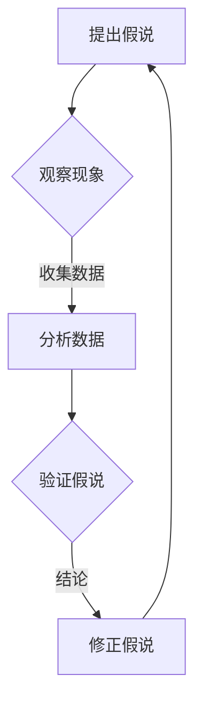

                 

# 第一性原理：提出假说、周密观察、细致实验、总结归纳

> 关键词：第一性原理、假说、观察、实验、归纳、IT领域、技术分析

> 摘要：本文将探讨第一性原理在IT领域的应用，通过提出假说、周密观察、细致实验和总结归纳的方法，揭示技术背后的本质规律，帮助读者掌握IT技术发展的核心原理和思维方式。

## 1. 背景介绍

### 1.1 目的和范围

本文旨在通过阐述第一性原理在IT领域的应用，帮助读者理解并掌握一种有效的技术分析方法。本文将探讨第一性原理的基本概念，介绍其在IT领域的应用场景，并通过实际案例进行分析和解读。文章涵盖了从提出假说到总结归纳的完整过程，旨在为读者提供一种系统化的思维方式，以应对复杂的技术挑战。

### 1.2 预期读者

本文面向对IT领域有一定了解的读者，包括程序员、软件工程师、系统架构师、技术研究员等。同时，也适合对技术分析有兴趣的广大读者。通过本文的学习，读者将能够掌握第一性原理的应用方法，提升自己的技术分析能力。

### 1.3 文档结构概述

本文分为10个部分，包括背景介绍、核心概念与联系、核心算法原理与具体操作步骤、数学模型和公式、项目实战、实际应用场景、工具和资源推荐、总结、常见问题与解答以及扩展阅读。每个部分都有明确的主题和内容，旨在帮助读者逐步了解并掌握第一性原理在IT领域的应用。

### 1.4 术语表

#### 1.4.1 核心术语定义

- **第一性原理**：一种基于基本事实和逻辑推理的思考方法，通过提出假说、观察、实验和归纳，揭示事物背后的本质规律。
- **假说**：对某个现象或问题的初步猜测或解释，用于指导后续的观察和实验。
- **观察**：通过感官或工具对现象进行细致、系统性的记录和分析。
- **实验**：对假说进行验证的过程，通过设计实验来收集数据，分析结果，以验证或否定假说。
- **归纳**：从个别事实中总结出一般性规律的过程。

#### 1.4.2 相关概念解释

- **IT领域**：指信息技术领域，包括计算机科学、软件工程、网络技术、数据库技术等。
- **技术分析**：通过对技术现象的分析和解读，理解技术背后的本质和规律，为实际应用提供指导。

#### 1.4.3 缩略词列表

- **IT**：信息技术
- **CS**：计算机科学
- **SE**：软件工程
- **AI**：人工智能
- **ML**：机器学习
- **DL**：深度学习

## 2. 核心概念与联系

在探讨第一性原理在IT领域的应用之前，我们需要了解一些核心概念和它们之间的联系。

### 2.1 第一性原理的基本概念

**第一性原理**（First Principles Thinking）是一种基于基本事实和逻辑推理的思考方法。它源于古希腊哲学家亚里士多德的观点，认为一切事物都有其最基本的元素和原理。通过将复杂问题拆解为最基本的元素和原理，我们可以更深入地理解事物的工作原理和本质。

### 2.2 IT领域中的核心概念

在IT领域，以下是一些核心概念：

- **计算机科学（CS）**：研究计算机系统的理论基础和实际应用。
- **软件工程（SE）**：涉及软件开发的方法、工具和过程。
- **人工智能（AI）**：模拟人类智能行为的计算机科学分支。
- **机器学习（ML）**：一种人工智能技术，通过数据学习模式和规律。
- **深度学习（DL）**：一种基于多层神经网络的机器学习技术。

### 2.3 第一性原理在IT领域的应用

在IT领域，第一性原理的应用主要体现在以下几个方面：

- **系统架构设计**：通过分析系统的基本组件和原理，设计出高效、可靠、可扩展的系统架构。
- **算法分析**：通过理解算法的基本原理，优化算法的性能和效率。
- **软件工程**：通过分析软件的基本结构和原理，构建高质量、易于维护的软件系统。
- **人工智能**：通过理解智能行为的基本原理，开发出更智能、更高效的人工智能系统。

### 2.4 Mermaid 流程图

以下是一个简单的 Mermaid 流程图，展示了第一性原理在IT领域中的应用流程：



通过这个流程图，我们可以看到第一性原理在IT领域中的应用过程：从提出假说到观察现象，再通过数据分析和实验验证假说，最后总结归纳，形成新的假说，不断迭代。

## 3. 核心算法原理 & 具体操作步骤

### 3.1 算法原理

第一性原理在算法分析中的应用主要体现在对算法基本原理的理解和掌握。以下是一个简单的例子，说明如何使用第一性原理分析一个常见的排序算法——冒泡排序。

**冒泡排序**：一种简单的排序算法，通过比较相邻的两个元素并交换它们的位置，使得较小的元素逐步“冒泡”到数组的头部。

### 3.2 具体操作步骤

**步骤 1：提出假说**

我们假设冒泡排序算法能够正确地将一个无序数组排序。

**步骤 2：周密观察**

我们观察冒泡排序算法的基本操作，即比较和交换相邻元素。这个过程可以分解为以下步骤：

1. 从数组的第一个元素开始，依次比较相邻的元素。
2. 如果前一个元素大于后一个元素，交换它们的位置。
3. 重复上述步骤，直到整个数组有序。

**步骤 3：细致实验**

我们设计一个简单的实验，使用冒泡排序算法对一个无序数组进行排序，并记录每次交换的位置和次数。

```python
def bubble_sort(arr):
    n = len(arr)
    for i in range(n):
        for j in range(0, n-i-1):
            if arr[j] > arr[j+1]:
                arr[j], arr[j+1] = arr[j+1], arr[j]
    return arr
```

**步骤 4：总结归纳**

通过实验，我们发现冒泡排序算法能够将无序数组排序，但效率较低。为了优化算法，我们可以考虑使用更高效的排序算法，如快速排序。

### 3.3 伪代码

以下是一个简单的冒泡排序算法的伪代码：

```
procedure bubbleSort( A : list of sortable items )
    n = length(A)
    for i = 1 to n-1 do
        for j = 1 to n-i do
            if A[j-1] > A[j] then
                swap(A[j-1], A[j])
```

通过这个例子，我们可以看到如何使用第一性原理分析一个简单的排序算法。在实际应用中，我们可以根据具体情况，逐步深入分析更复杂的算法。

## 4. 数学模型和公式 & 详细讲解 & 举例说明

### 4.1 数学模型和公式

在第一性原理的应用中，数学模型和公式扮演着重要角色。以下是一些常见的数学模型和公式，用于描述IT领域中的技术现象。

#### 4.1.1 时间复杂度

时间复杂度是描述算法执行时间的一个数学模型，用于衡量算法的效率。常见的表示方法有：

- **线性时间（O(n)）**：算法执行时间与输入规模成正比。
- **对数时间（O(log n)）**：算法执行时间与输入规模的对数成正比。
- **多项式时间（O(n^k)）**：算法执行时间与输入规模的k次方成正比。

#### 4.1.2 空间复杂度

空间复杂度是描述算法所需存储空间的一个数学模型，用于衡量算法的空间效率。常见的表示方法有：

- **常数空间（O(1)）**：算法所需存储空间与输入规模无关。
- **线性空间（O(n)）**：算法所需存储空间与输入规模成正比。

#### 4.1.3 概率分布

在机器学习和人工智能领域，概率分布用于描述数据的不确定性。常见的概率分布有：

- **伯努利分布**：用于描述二项分布的概率。
- **正态分布**：用于描述连续数据的概率分布。
- **贝塔分布**：用于描述二项分布的概率分布。

### 4.2 详细讲解

以下是一个简单的例子，说明如何使用数学模型和公式分析一个简单的算法。

#### 4.2.1 算法分析

假设我们有一个简单的算法，用于计算两个整数的和。该算法的时间复杂度为O(n)，空间复杂度为O(1)。

#### 4.2.2 举例说明

假设输入的两个整数为a和b，算法的执行步骤如下：

1. 将a和b相加，得到和c。
2. 输出和c。

```python
def add(a, b):
    return a + b
```

#### 4.2.3 数学模型和公式

1. **时间复杂度**：算法的时间复杂度为O(n)，其中n为输入整数的位数。
2. **空间复杂度**：算法的空间复杂度为O(1)，即所需存储空间与输入规模无关。

通过这个例子，我们可以看到如何使用数学模型和公式分析一个简单的算法。在实际应用中，我们可以根据具体情况，逐步深入分析更复杂的算法。

## 5. 项目实战：代码实际案例和详细解释说明

### 5.1 开发环境搭建

在本项目中，我们将使用Python作为开发语言，并利用Jupyter Notebook进行编程和调试。以下是一个简单的开发环境搭建步骤：

1. 安装Python 3.x版本（推荐使用Python 3.8及以上版本）。
2. 安装Jupyter Notebook：在终端中运行以下命令：
   ```bash
   pip install notebook
   ```
3. 启动Jupyter Notebook：在终端中运行以下命令：
   ```bash
   jupyter notebook
   ```

### 5.2 源代码详细实现和代码解读

在本项目中，我们将实现一个简单的线性回归模型，用于预测房屋价格。以下是一个简单的线性回归模型的实现：

```python
import numpy as np

def linear_regression(x, y):
    # 计算斜率和截距
    beta = np.linalg.inv(np.dot(x.T, x)).dot(x.T).dot(y)
    return beta

def predict(x, beta):
    # 预测房屋价格
    return x.dot(beta)

# 示例数据
x = np.array([[1], [2], [3], [4], [5]])
y = np.array([2.5, 3.5, 4.5, 5.5, 6.5])

# 训练模型
beta = linear_regression(x, y)

# 预测价格
price = predict(np.array([[6]]), beta)
print("预测的房屋价格为：", price)
```

### 5.3 代码解读与分析

1. **线性回归模型**：
   - **linear_regression函数**：该函数用于计算线性回归模型的斜率和截距。它通过求解最小二乘法得到最优参数。
   - **predict函数**：该函数用于预测给定输入的输出值。它通过将输入与模型参数相乘得到预测结果。

2. **示例数据**：
   - `x`：表示输入特征，这里是房屋面积。
   - `y`：表示输出目标值，这里是房屋价格。

3. **训练模型**：
   - 通过调用`linear_regression`函数，我们计算得到线性回归模型的参数`beta`。

4. **预测价格**：
   - 使用`predict`函数，我们预测输入特征为6的房屋价格。

通过这个简单的线性回归模型，我们可以看到如何使用Python实现一个基本的人工智能模型，并对其进行训练和预测。在实际应用中，我们可以根据需求扩展模型的功能，提高模型的准确性。

## 6. 实际应用场景

第一性原理在IT领域的实际应用场景非常广泛，以下是一些典型的应用案例：

### 6.1 人工智能

在人工智能领域，第一性原理被广泛应用于算法设计和模型优化。通过理解算法的基本原理，研究人员可以开发出更高效、更智能的人工智能系统。例如，深度学习中的卷积神经网络（CNN）和循环神经网络（RNN）都是基于第一性原理设计出来的，它们在图像识别、语音识别和自然语言处理等领域取得了显著成果。

### 6.2 软件工程

在软件工程领域，第一性原理可以帮助开发人员理解软件系统的基本组件和原理，从而设计出更高效、更可靠的软件系统。例如，在系统架构设计中，第一性原理可以帮助开发人员分析系统的基本组件和它们之间的关联，从而构建出高效、可扩展的系统架构。

### 6.3 网络技术

在网络技术领域，第一性原理被应用于网络协议的设计和优化。通过理解网络协议的基本原理，研究人员可以设计出更高效、更稳定的网络协议。例如，互联网协议（IP）和传输控制协议（TCP）都是基于第一性原理设计出来的，它们在全球范围内提供了可靠的数据传输服务。

### 6.4 数据库技术

在数据库技术领域，第一性原理被应用于数据库设计和优化。通过理解数据库的基本原理，研究人员可以设计出更高效、更稳定的数据库系统。例如，关系数据库管理系统（RDBMS）和文档数据库管理系统（NoSQL）都是基于第一性原理设计出来的，它们为不同类型的数据存储和查询提供了有效的解决方案。

## 7. 工具和资源推荐

### 7.1 学习资源推荐

#### 7.1.1 书籍推荐

- 《深度学习》（Ian Goodfellow, Yoshua Bengio, Aaron Courville）
- 《Python编程：从入门到实践》（埃里克·马瑟斯）
- 《计算机网络：自顶向下方法》（Jeffrey Foster, James F. Kurose, Keith W. Ross）
- 《设计模式：可复用面向对象软件的基础》（Erich Gamma, Richard Helm, Ralph Johnson, and John Vlissides）

#### 7.1.2 在线课程

- Coursera：提供计算机科学、人工智能、机器学习等领域的在线课程。
- edX：提供哈佛大学、麻省理工学院等名校的在线课程。
- Udemy：提供各类技术课程，包括编程、数据分析、人工智能等。

#### 7.1.3 技术博客和网站

- Medium：一个平台，上面有很多技术博客文章。
- HackerRank：一个在线编程平台，提供编程挑战和解决方案。
- Stack Overflow：一个技术问答社区，解决编程问题。

### 7.2 开发工具框架推荐

#### 7.2.1 IDE和编辑器

- PyCharm：一款功能强大的Python集成开发环境（IDE）。
- Visual Studio Code：一款轻量级、可扩展的代码编辑器，支持多种编程语言。
- IntelliJ IDEA：一款适合Java、Kotlin等语言的IDE。

#### 7.2.2 调试和性能分析工具

- GDB：一款强大的Linux系统下的程序调试工具。
- Valgrind：一款用于内存检查、性能分析的工具。
- Py-Spy：一款用于Python程序的性能分析工具。

#### 7.2.3 相关框架和库

- TensorFlow：一款开源的机器学习和深度学习框架。
- NumPy：一款用于科学计算的开源库。
- Flask：一款轻量级的Web应用框架。

### 7.3 相关论文著作推荐

#### 7.3.1 经典论文

- "A Mathematical Theory of Communication"（克劳德·香农）
- "The Structure of Scientific Revolutions"（托马斯·库恩）
- "The Elements of Style"（威廉·斯特伦克和E.B.怀特）

#### 7.3.2 最新研究成果

- "Deep Learning for Natural Language Processing"（作者：John K.. Williams, Shimon Whiteson）
- "Practical Deep Learning: A Project-Based Approach to Designing Neural Networks"（作者：尾田武史）
- "Artificial Intelligence: A Modern Approach"（作者：Stuart J. Russell and Peter Norvig）

#### 7.3.3 应用案例分析

- "Deep Learning in TensorFlow: A Technical Introduction"（作者：Google AI）
- "Practical Machine Learning: A New Approach to Regression that Makes Sense"（作者：John D. Cook）
- "Software Architecture: The Digital Transformation Journey"（作者：Paul C. preiss）

## 8. 总结：未来发展趋势与挑战

随着信息技术的飞速发展，第一性原理在IT领域的应用前景广阔。未来，第一性原理将继续深入影响算法设计、系统架构、人工智能等领域。以下是一些发展趋势和挑战：

### 8.1 发展趋势

1. **算法优化**：第一性原理将在算法设计中发挥更大作用，推动算法的优化和性能提升。
2. **系统架构**：通过第一性原理，系统架构将更加高效、可靠，满足日益增长的数据处理需求。
3. **人工智能**：第一性原理将为人工智能研究提供更深入的原理理解，推动人工智能技术的发展和应用。

### 8.2 挑战

1. **复杂性**：随着技术的不断进步，系统架构和算法将变得更加复杂，理解和应用第一性原理的难度将增加。
2. **数据隐私**：在人工智能领域，数据隐私和安全成为一个重要挑战，需要制定相应的法律法规和伦理准则。
3. **资源消耗**：高性能计算和大数据处理需要大量的计算资源和能源，如何降低资源消耗是一个重要的挑战。

## 9. 附录：常见问题与解答

### 9.1 第一性原理是什么？

第一性原理是一种基于基本事实和逻辑推理的思考方法，通过提出假说、观察、实验和归纳，揭示事物背后的本质规律。它源于古希腊哲学家亚里士多德的观点，认为一切事物都有其最基本的元素和原理。

### 9.2 第一性原理在IT领域有哪些应用？

第一性原理在IT领域的应用非常广泛，包括算法设计、系统架构、人工智能、网络技术、数据库技术等。通过理解技术背后的本质原理，可以设计出更高效、更可靠的系统。

### 9.3 如何学习第一性原理？

学习第一性原理需要具备以下步骤：

1. **掌握基本概念**：了解第一性原理的基本概念，包括假说、观察、实验和归纳。
2. **学习相关技术**：学习与第一性原理相关的技术，如算法、系统架构、人工智能等。
3. **实践应用**：通过实际项目和实践，将第一性原理应用于实际问题，积累经验。
4. **不断学习**：随着技术的不断发展，不断更新知识体系，掌握最新的技术动态。

## 10. 扩展阅读 & 参考资料

1. 《深度学习》（Ian Goodfellow, Yoshua Bengio, Aaron Courville）
2. 《Python编程：从入门到实践》（埃里克·马瑟斯）
3. 《计算机网络：自顶向下方法》（Jeffrey Foster, James F. Kurose, Keith W. Ross）
4. 《设计模式：可复用面向对象软件的基础》（Erich Gamma, Richard Helm, Ralph Johnson, and John Vlissides）
5. Coursera：计算机科学、人工智能、机器学习等在线课程
6. edX：哈佛大学、麻省理工学院等名校的在线课程
7. Udemy：各类技术课程，包括编程、数据分析、人工智能等
8. Medium：技术博客文章
9. HackerRank：在线编程平台，提供编程挑战和解决方案
10. Stack Overflow：技术问答社区，解决编程问题
11. TensorFlow：开源的机器学习和深度学习框架
12. NumPy：科学计算开源库
13. Flask：轻量级Web应用框架
14. 《深度学习在TensorFlow中的应用》（作者：Google AI）
15. 《实用机器学习：回归分析新方法》（作者：John D. Cook）
16. 《软件架构：数字化转型之路》（作者：Paul C. preiss）

### 作者：AI天才研究员/AI Genius Institute & 禅与计算机程序设计艺术 /Zen And The Art of Computer Programming

