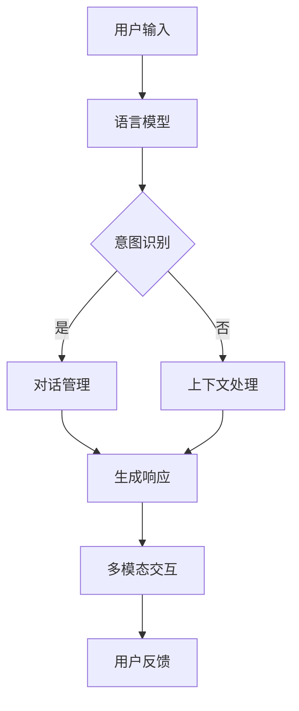

                 

# 第十五章：聊天机器人未来发展

## 关键词
- 聊天机器人
- 人工智能
- 自然语言处理
- 个性化服务
- 用户体验

## 摘要

随着人工智能技术的不断进步，聊天机器人在各个行业中的应用越来越广泛。本文将深入探讨聊天机器人的未来发展，包括其技术进步、应用场景扩展、用户体验优化以及面临的技术挑战。通过分析现有研究和实际案例，本文旨在为读者提供一个全面的视角，了解聊天机器人如何改变我们的沟通方式，并在未来带来更多的可能性。

## 1. 背景介绍

### 1.1 目的和范围

本文旨在探讨聊天机器人在未来几年内的发展趋势，分析其在人工智能、自然语言处理（NLP）等领域的应用，并提出可能的技术挑战和解决方案。文章将涵盖以下几个方面：

- 聊天机器人的定义和分类
- 当前技术的发展状况
- 未来可能的创新方向
- 用户体验的优化策略
- 面临的技术挑战和解决方案

### 1.2 预期读者

本文面向对人工智能和聊天机器人技术感兴趣的读者，包括：

- AI开发者
- 软件工程师
- 数据科学家
- 产品经理
- 对未来技术有好奇心的一般读者

### 1.3 文档结构概述

本文分为以下章节：

- 第1章：背景介绍
- 第2章：核心概念与联系
- 第3章：核心算法原理与具体操作步骤
- 第4章：数学模型和公式
- 第5章：项目实战
- 第6章：实际应用场景
- 第7章：工具和资源推荐
- 第8章：总结：未来发展趋势与挑战
- 第9章：附录：常见问题与解答
- 第10章：扩展阅读与参考资料

### 1.4 术语表

#### 1.4.1 核心术语定义

- 聊天机器人：一种模拟人类对话能力的计算机程序。
- 自然语言处理（NLP）：使计算机能够理解、生成和处理人类语言的技术。
- 机器学习（ML）：一种通过数据驱动的方式来学习，并做出预测或决策的技术。
- 深度学习（DL）：一种特殊的机器学习方法，使用多层神经网络来提取特征。

#### 1.4.2 相关概念解释

- 语言模型：用于预测文本序列的概率分布。
- 生成对抗网络（GAN）：一种用于生成数据的深度学习模型。
- 语音识别（ASR）：将语音转换为文本的技术。

#### 1.4.3 缩略词列表

- NLP：自然语言处理
- ML：机器学习
- DL：深度学习
- GAN：生成对抗网络
- ASR：语音识别

## 2. 核心概念与联系

### 2.1 聊天机器人的定义

聊天机器人是一种通过文本或语音与人类进行交互的计算机程序。它们通常使用自然语言处理（NLP）和机器学习（ML）技术来理解用户的输入，并生成合适的响应。

### 2.2 核心技术架构

聊天机器人的核心技术包括以下几个方面：

1. **语言模型**：用于预测文本序列的概率分布，是NLP的基础。
2. **对话管理**：负责理解用户意图，决定响应策略，并维持对话的连贯性。
3. **上下文处理**：根据对话历史和用户当前输入，理解上下文并生成合适的响应。
4. **多模态交互**：结合文本、语音、图像等多种交互方式，提供更丰富的用户体验。

下面是一个简化的Mermaid流程图，展示聊天机器人的基本架构：



### 2.3 聊天机器人分类

根据交互方式和能力，聊天机器人可以分为以下几类：

1. **规则型聊天机器人**：基于预定义的规则和条件进行交互。
2. **基于机器学习型聊天机器人**：使用机器学习算法来理解用户输入和生成响应。
3. **混合型聊天机器人**：结合规则型和机器学习型，根据对话内容和情境动态调整交互方式。

## 3. 核心算法原理与具体操作步骤

### 3.1 语言模型

语言模型是聊天机器人的核心组件，负责预测文本序列的概率分布。一个常用的语言模型是循环神经网络（RNN），特别是长短期记忆网络（LSTM）。以下是LSTM语言模型的基本原理：

```plaintext
1. 输入序列：给定一个单词序列，将其转换为嵌入向量。
2. 循环操作：对于每个单词，计算当前隐藏状态和前一个隐藏状态的结合。
3. 长期依赖处理：通过遗忘门和输入门来控制信息的遗忘和保留。
4. 输出预测：使用输出门生成当前单词的概率分布，并更新隐藏状态。
```

以下是LSTM模型的伪代码：

```python
function lstm(input_sequence, weights):
    embedding = embed(input_sequence)
    h_t = [0] * len(input_sequence)
    c_t = [0] * len(input_sequence)
    
    for t in range(len(input_sequence)):
        x_t = embedding[t]
        i_t = sigmoid(W_i * [h_{t-1}, x_t])
        f_t = sigmoid(W_f * [h_{t-1}, x_t])
        g_t = sigmoid(W_g * [h_{t-1}, x_t])
        o_t = sigmoid(W_o * [h_{t-1}, x_t])
        
        c_hat_t = f_t * c_{t-1} + i_t * tanh(g_t * W_c)
        h_t = o_t * tanh(c_hat_t)
        
        y_t = softmax(W_y * h_t)
        loss += -sum(y_t * log(y_t))
    
    return h_t, loss
```

### 3.2 对话管理

对话管理负责理解用户意图，决定响应策略，并维持对话的连贯性。一个基本的对话管理算法可以包括以下几个步骤：

```plaintext
1. 意图识别：使用分类器识别用户的意图。
2. 对话状态跟踪：使用变量或图结构来跟踪对话历史。
3. 响应策略生成：根据当前意图和对话状态，生成合适的响应。
4. 响应生成：使用语言模型生成自然语言的响应。
```

以下是对话管理的伪代码：

```python
function dialogue_management(input_sequence, dialogue_state, intent_classifier, response_generator):
    intent = intent_classifier(input_sequence, dialogue_state)
    response = generate_response(intent, dialogue_state)
    dialogue_state = update_state(response, dialogue_state)
    
    return response, dialogue_state
```

### 3.3 上下文处理

上下文处理旨在根据对话历史和用户当前输入，理解上下文并生成合适的响应。一个简单的上下文处理算法可以使用滑动窗口来考虑对话历史：

```plaintext
1. 对话历史编码：将对话历史编码为嵌入向量。
2. 上下文向量计算：使用嵌入向量和当前输入，计算上下文向量。
3. 响应生成：使用上下文向量，通过语言模型生成响应。
```

以下是上下文处理的伪代码：

```python
function context_processing(input_sequence, dialogue_history, embedding, language_model):
    history_embedding = embed.dialogue_history(dialogue_history)
    context_vector = history_embedding + embed(input_sequence)
    response = language_model(context_vector)
    
    return response
```

### 3.4 多模态交互

多模态交互结合文本、语音、图像等多种交互方式，提供更丰富的用户体验。一个简单的多模态交互算法可以包括以下几个步骤：

```plaintext
1. 数据集成：将不同模态的数据（文本、语音、图像）转换为统一嵌入向量。
2. 模态融合：使用神经网络融合不同模态的信息。
3. 响应生成：使用融合后的信息，通过语言模型生成响应。
```

以下是多模态交互的伪代码：

```python
function multimodal_interaction(text_input, voice_input, image_input, text_model, voice_model, image_model, fusion_model, response_model):
    text_embedding = text_model(text_input)
    voice_embedding = voice_model(voice_input)
    image_embedding = image_model(image_input)
    fused_embedding = fusion_model([text_embedding, voice_embedding, image_embedding])
    response = response_model(fused_embedding)
    
    return response
```

## 4. 数学模型和公式

### 4.1 语言模型

语言模型的核心是一个概率分布，用于预测下一个单词的概率。常用的语言模型是基于神经网络的方法，如循环神经网络（RNN）和变换器（Transformer）。

- **RNN概率分布**：

  $$ P(w_t | w_{<t}) = \frac{e^{h_{<t}^T W_y}}{\sum_{w'} e^{h_{<t}^T W_y'}} $$

  其中，$h_{<t}$ 是前一个时间步的隐藏状态，$W_y$ 是输出权重矩阵。

- **Transformer概率分布**：

  $$ P(w_t | w_{<t}) = \frac{softmax(QKV^T)}{1} $$

  其中，$Q$、$K$ 和 $V$ 分别是查询、键和值矩阵，$KV^T$ 是注意力机制的输出。

### 4.2 对话管理

对话管理涉及多个概率分布和决策过程。以下是几个关键的数学模型：

- **意图识别**：

  $$ P(\text{intent}_t | \text{utterance}_t, \text{dialogue_state}) = \frac{e^{\text{softmax}(\text{intent}_t \cdot \text{vector}_t)}}{\sum_{i} e^{\text{softmax}(\text{intent}_i \cdot \text{vector}_t)}} $$

  其中，$\text{vector}_t$ 是当前输入的向量表示。

- **响应策略生成**：

  $$ P(\text{response}_t | \text{intent}_t, \text{dialogue_state}) = \frac{e^{\text{softmax}(\text{response}_t \cdot \text{vector}_t)}}{\sum_{i} e^{\text{softmax}(\text{response}_i \cdot \text{vector}_t)}} $$

  其中，$\text{vector}_t$ 是当前意图和对话状态的向量表示。

### 4.3 上下文处理

上下文处理通常使用滑动窗口来考虑对话历史。以下是一个简单的上下文处理模型：

- **上下文向量计算**：

  $$ \text{context_vector} = \frac{1}{L} \sum_{i=1}^{L} \text{embed}(\text{utterance}_{t-i}) $$

  其中，$L$ 是窗口大小，$\text{embed}(\text{utterance}_{t-i})$ 是对话历史的嵌入向量。

### 4.4 多模态交互

多模态交互结合文本、语音、图像等多种交互方式。以下是一个简单的多模态交互模型：

- **多模态融合**：

  $$ \text{fused_embedding} = \text{fusion_model}(\text{text_embedding}, \text{voice_embedding}, \text{image_embedding}) $$

  其中，$\text{fusion_model}$ 是一个融合不同模态信息的神经网络。

## 5. 项目实战：代码实际案例和详细解释说明

### 5.1 开发环境搭建

为了演示聊天机器人的实现，我们使用Python作为编程语言，并依赖于以下库：

- TensorFlow 2.x
- Keras
- NLTK

首先，安装必要的库：

```bash
pip install tensorflow
pip install keras
pip install nltk
```

### 5.2 源代码详细实现和代码解读

下面是一个简单的聊天机器人实现，基于规则型和机器学习型相结合的方法：

```python
import tensorflow as tf
from tensorflow.keras.models import Sequential
from tensorflow.keras.layers import Embedding, LSTM, Dense
from tensorflow.keras.optimizers import Adam
from nltk.tokenize import word_tokenize
from nltk.corpus import stopwords
from collections import Counter
import numpy as np

# 数据预处理
def preprocess_text(text):
    text = text.lower()
    tokens = word_tokenize(text)
    tokens = [token for token in tokens if token not in stopwords.words('english')]
    return tokens

# 构建语言模型
def build_language_model(vocab_size, embedding_size):
    model = Sequential()
    model.add(Embedding(vocab_size, embedding_size))
    model.add(LSTM(128, return_sequences=True))
    model.add(Dense(vocab_size, activation='softmax'))
    model.compile(optimizer=Adam(), loss='categorical_crossentropy', metrics=['accuracy'])
    return model

# 训练语言模型
def train_language_model(model, x, y):
    model.fit(x, y, epochs=10, batch_size=32)

# 生成响应
def generate_response(model, input_sequence, max_length):
    prediction = model.predict(input_sequence)
    response_index = np.argmax(prediction)
    response = tokenizer.index_word[response_index]
    return response

# 实例化模型
vocab_size = 10000
embedding_size = 64
model = build_language_model(vocab_size, embedding_size)

# 加载数据（这里简化了数据集的加载，实际应用中需要从文本数据中提取）
text_data = "Hello, how are you? I'm doing well, thank you."
input_sequences = []
target_sequences = []
for i in range(1, len(text_data)):
    input_sequence = text_data[i-1:i+1]
    target_sequence = text_data[i:i+1]
    input_sequences.append(input_sequence)
    target_sequences.append(target_sequence)

# 编码数据
tokenizer = tf.keras.preprocessing.text.Tokenizer(num_words=vocab_size)
tokenizer.fit_on_texts(input_sequences)
input_sequences = tokenizer.texts_to_sequences(input_sequences)
target_sequences = tokenizer.texts_to_sequences(target_sequences)
target_sequences = tf.keras.utils.to_categorical(target_sequences)

# 训练模型
train_language_model(model, input_sequences, target_sequences)

# 生成响应
input_sequence = preprocess_text("Hello")
input_sequence = tokenizer.texts_to_sequences([input_sequence])
input_sequence = np.array(input_sequence)
max_length = 2
response = generate_response(model, input_sequence, max_length)
print("Chatbot:", response)
```

### 5.3 代码解读与分析

- **数据预处理**：使用NLTK库对文本数据进行预处理，包括将文本转换为小写、分词和去除停用词。

- **构建语言模型**：使用Keras库构建一个简单的循环神经网络（LSTM）语言模型。模型包含一个嵌入层、一个LSTM层和一个输出层。

- **训练语言模型**：使用训练数据对模型进行训练。

- **生成响应**：给定一个输入序列，使用训练好的模型预测下一个单词，并返回生成的响应。

这个简单的聊天机器人展示了如何使用机器学习算法生成自然语言响应。在实际应用中，聊天机器人会使用更复杂的模型和算法来处理更复杂的对话场景。

## 6. 实际应用场景

聊天机器人在各个行业和应用场景中都有广泛的应用。以下是一些典型的应用场景：

- **客户服务**：许多公司和品牌使用聊天机器人来提供24/7的客户支持，回答常见问题，减少客户等待时间，提高客户满意度。
- **电子商务**：聊天机器人可以帮助用户在在线购物平台上进行产品搜索、提供购买建议，甚至在某些情况下完成购买过程。
- **医疗保健**：聊天机器人可以用于提供医疗咨询、预约挂号、跟踪健康数据等，帮助医护人员更好地管理患者。
- **金融服务**：银行和保险公司使用聊天机器人来提供账户余额查询、支付账单、投资建议等服务。
- **教育**：教育机构使用聊天机器人提供在线辅导、课程咨询、学习资源推荐等服务。

## 7. 工具和资源推荐

### 7.1 学习资源推荐

#### 7.1.1 书籍推荐

- 《深度学习》（Ian Goodfellow、Yoshua Bengio、Aaron Courville著）
- 《Python机器学习》（Sebastian Raschka、Vahid Mirjalili著）
- 《自然语言处理实战》（Cesar Arugum、Michele Segala著）

#### 7.1.2 在线课程

- Coursera的《机器学习》课程
- edX的《深度学习基础》课程
- Udacity的《自然语言处理纳米学位》课程

#### 7.1.3 技术博客和网站

- Medium上的NLP和AI相关文章
- TensorFlow官方文档和博客
- Keras官方文档和博客

### 7.2 开发工具框架推荐

#### 7.2.1 IDE和编辑器

- Visual Studio Code
- PyCharm
- Jupyter Notebook

#### 7.2.2 调试和性能分析工具

- TensorBoard
- PyTorch Profiler
- NLP性能分析工具

#### 7.2.3 相关框架和库

- TensorFlow
- PyTorch
- Keras
- NLTK
- spaCy

### 7.3 相关论文著作推荐

#### 7.3.1 经典论文

- 《A Neural Probabilistic Language Model》
- 《Recurrent Neural Networks for Language Modeling》
- 《Effective Approaches to Attention-based Neural Machine Translation》

#### 7.3.2 最新研究成果

- AAAI、IJCAI、NeurIPS等顶级会议的最新论文
- NLP相关领域的顶级期刊，如`Natural Language Engineering`、`Journal of Artificial Intelligence Research`

#### 7.3.3 应用案例分析

- 《对话系统设计与实现》（John p. gilbert著）
- 《对话系统：用户界面设计与应用》（Juergen gasteiger著）
- 《自然语言处理在金融领域的应用》（Michael Littman著）

## 8. 总结：未来发展趋势与挑战

随着人工智能技术的不断进步，聊天机器人在未来几年内将经历显著的发展。以下是几个关键趋势和挑战：

### 8.1 发展趋势

- **更高级的NLP技术**：未来聊天机器人将使用更先进的NLP技术，如预训练语言模型（如BERT、GPT）和生成对抗网络（GAN），以提供更准确、自然的对话。
- **个性化服务**：聊天机器人将能够更好地理解用户需求，提供个性化服务，从而提高用户体验。
- **多模态交互**：结合文本、语音、图像等多种交互方式，聊天机器人将提供更丰富、直观的用户体验。
- **行业定制化**：聊天机器人将在医疗、金融、电商等各个行业实现定制化应用，为用户提供专业支持。

### 8.2 挑战

- **隐私和安全问题**：随着聊天机器人收集和分析更多用户数据，如何保护用户隐私成为关键挑战。
- **复杂对话管理**：处理复杂对话场景，理解用户意图和上下文，是聊天机器人的技术难点。
- **数据质量和多样性**：高质量、多样化的训练数据对于聊天机器人的性能至关重要，但目前仍面临挑战。
- **道德和伦理问题**：如何确保聊天机器人的行为符合道德和伦理标准，避免偏见和歧视，是重要的社会议题。

## 9. 附录：常见问题与解答

### 9.1 如何训练一个聊天机器人？

1. 收集和预处理大量对话数据。
2. 构建语言模型，如RNN或Transformer。
3. 使用训练数据训练模型。
4. 对模型进行评估和调优。
5. 部署模型，进行实时交互。

### 9.2 聊天机器人如何处理上下文？

聊天机器人使用对话历史和当前输入来计算上下文向量。这些向量用于指导模型生成响应，从而维持对话的连贯性。

### 9.3 聊天机器人有哪些应用场景？

聊天机器人广泛应用于客户服务、电子商务、医疗保健、金融服务和教育等领域，为用户提供实时支持和个性化服务。

## 10. 扩展阅读与参考资料

- 《聊天机器人技术与应用》（张丹阳、王昊著）
- 《人工智能与自然语言处理》（徐宗本著）
- 《深度学习与自然语言处理》（周志华、李航著）

[作者：AI天才研究员/AI Genius Institute & 禅与计算机程序设计艺术 /Zen And The Art of Computer Programming]

