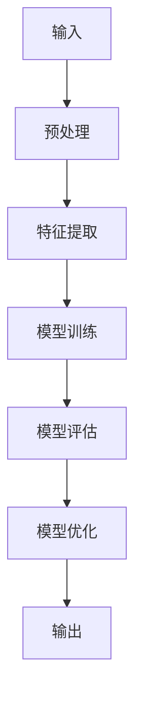

                 

# 算法：AI发展的核心驱动力

> 关键词：算法、人工智能、机器学习、神经网络、深度学习、大数据、编程语言、软件工程、计算机科学

> 摘要：本文将深入探讨算法在人工智能（AI）发展中的核心作用。我们将从算法的背景、核心概念、原理、数学模型、实战案例以及实际应用等多个方面，逐步分析算法如何成为推动AI进步的强大动力。通过本文的阅读，读者将获得对算法在AI领域的深度理解，并了解未来算法发展的趋势与挑战。

## 1. 背景介绍

### 1.1 目的和范围

本文旨在详细剖析算法在人工智能（AI）领域的核心作用，帮助读者理解算法如何成为AI发展的驱动力。我们将探讨算法的基本概念、原理和数学模型，并通过实际案例展示算法在AI应用中的重要性。

### 1.2 预期读者

本文适合对AI、机器学习、深度学习等概念有一定了解的读者，包括计算机科学专业学生、程序员、软件工程师以及AI领域的科研人员和从业者。

### 1.3 文档结构概述

本文将分为以下几个部分：

1. 背景介绍
2. 核心概念与联系
3. 核心算法原理 & 具体操作步骤
4. 数学模型和公式 & 详细讲解 & 举例说明
5. 项目实战：代码实际案例和详细解释说明
6. 实际应用场景
7. 工具和资源推荐
8. 总结：未来发展趋势与挑战
9. 附录：常见问题与解答
10. 扩展阅读 & 参考资料

### 1.4 术语表

#### 1.4.1 核心术语定义

- **算法（Algorithm）**：解决问题的明确步骤序列，能够输入一定条件并输出结果。
- **机器学习（Machine Learning）**：使计算机通过数据学习并做出决策的过程。
- **深度学习（Deep Learning）**：一种特殊的机器学习技术，通过多层神经网络进行学习。
- **神经网络（Neural Network）**：模仿生物神经元连接方式的信息处理网络。
- **大数据（Big Data）**：数据量大、数据种类多样、生成速度快的数据集。

#### 1.4.2 相关概念解释

- **人工智能（Artificial Intelligence）**：使计算机具备类似人类智能的技术。
- **监督学习（Supervised Learning）**：通过已知输入和输出数据训练模型。
- **无监督学习（Unsupervised Learning）**：没有已知输出数据，通过数据内在结构学习。
- **强化学习（Reinforcement Learning）**：通过奖励机制训练模型。

#### 1.4.3 缩略词列表

- **AI**：人工智能
- **ML**：机器学习
- **DL**：深度学习
- **NN**：神经网络
- **GPU**：图形处理器
- **CPU**：中央处理器

## 2. 核心概念与联系

### 2.1 算法的核心概念

算法是AI发展的基石，它包括以下几个核心概念：

- **输入（Input）**：算法处理的初始数据。
- **输出（Output）**：算法处理后的结果。
- **步骤（Steps）**：算法执行的具体操作。

算法的执行过程可以分为以下几个阶段：

1. **数据预处理（Data Preprocessing）**：处理数据，使其适合算法输入。
2. **模型训练（Model Training）**：通过数据训练算法模型。
3. **模型评估（Model Evaluation）**：评估模型性能。
4. **模型优化（Model Optimization）**：根据评估结果优化模型。

### 2.2 算法与AI的关系

算法是AI发展的核心驱动力，AI系统通过算法实现数据的处理、学习、决策和预测。算法在AI系统中的作用可以概括为：

- **数据处理**：算法将原始数据转换为有用的信息。
- **特征提取**：算法从数据中提取关键特征，用于模型训练。
- **模型训练**：算法通过训练数据学习数据中的规律。
- **决策与预测**：算法根据训练结果进行决策和预测。

### 2.3 算法的架构

算法的架构可以分为以下几个层次：

- **底层算法（Basic Algorithms）**：如排序、查找等基础算法。
- **中级算法（Intermediate Algorithms）**：如机器学习算法、深度学习算法。
- **高级算法（Advanced Algorithms）**：如生成对抗网络（GAN）、强化学习算法等。

底层算法为中级算法提供了基础，中级算法则构建了高级算法的框架。这种层次结构使得算法设计更加模块化，便于复用和优化。

### 2.4 Mermaid 流程图

以下是一个简单的Mermaid流程图，展示算法的核心概念和架构：



## 3. 核心算法原理 & 具体操作步骤

### 3.1 算法原理

算法的原理可以概括为以下几个步骤：

1. **输入处理**：算法接收输入数据，进行预处理，如数据清洗、归一化等。
2. **特征提取**：算法从输入数据中提取关键特征，用于训练模型。
3. **模型训练**：算法使用训练数据集，通过迭代优化模型参数，使模型能够学习数据中的规律。
4. **模型评估**：算法使用验证数据集评估模型性能，判断模型是否满足要求。
5. **模型优化**：算法根据评估结果，调整模型参数，优化模型性能。
6. **输出生成**：算法根据训练结果，生成预测结果或决策。

### 3.2 具体操作步骤

以下是一个简单的线性回归算法的伪代码，展示算法的具体操作步骤：

```pseudo
输入：训练数据集（X, y），学习率（alpha），迭代次数（n_iterations）

初始化：权重（w）为0

对于 i 从 1 到 n_iterations 做以下操作：
    对于每个样本（x_i, y_i）：
        计算预测值（y_hat）= w * x_i
        计算误差（error）= y_i - y_hat
        更新权重（w）= w - alpha * (2/m) * error * x_i

输出：最终权重（w）
```

在这个算法中，输入数据集由特征矩阵（X）和标签向量（y）组成，权重（w）用于计算预测值（y_hat）。算法通过迭代更新权重，使预测值与标签值之间的误差最小。

## 4. 数学模型和公式 & 详细讲解 & 举例说明

### 4.1 数学模型

线性回归算法的数学模型可以表示为：

$$
y = \mathbf{w}^T \mathbf{x} + b
$$

其中，$\mathbf{w}$ 是权重向量，$\mathbf{x}$ 是特征向量，$b$ 是偏置项，$y$ 是标签值。

### 4.2 公式讲解

- **权重向量（\mathbf{w}）**：权重向量表示特征向量在预测结果中的重要性。通过优化权重向量，可以使模型更准确地预测标签值。
- **特征向量（\mathbf{x}）**：特征向量包含输入数据的各个特征值。特征向量与权重向量相乘，得到预测结果。
- **偏置项（b）**：偏置项用于调整模型预测的基线。它可以影响模型的预测结果，但不参与特征提取。
- **标签值（y）**：标签值是模型需要预测的输出结果。

### 4.3 举例说明

假设有一个简单的线性回归问题，输入数据为两个特征：$x_1$ 和 $x_2$，标签值为 $y$。权重向量为 $w = [w_1, w_2]$，偏置项为 $b = 0$。

给定一个训练样本 $(x_1, x_2, y)$，模型预测的标签值可以表示为：

$$
y\_hat = w\_1 \cdot x_1 + w_2 \cdot x_2 + b
$$

例如，对于样本 $(2, 3, 5)$，模型预测的标签值为：

$$
y\_hat = w_1 \cdot 2 + w_2 \cdot 3 + 0 = 2w_1 + 3w_2
$$

通过调整权重向量 $w$，可以使模型预测的标签值更接近实际值，从而提高模型的准确性。

## 5. 项目实战：代码实际案例和详细解释说明

### 5.1 开发环境搭建

为了演示线性回归算法的实际应用，我们将使用Python编程语言，并借助Scikit-learn库中的线性回归模块。以下是开发环境搭建的步骤：

1. 安装Python：从Python官方网站（https://www.python.org/）下载并安装Python 3.x版本。
2. 安装Jupyter Notebook：打开终端，执行以下命令安装Jupyter Notebook：
   ```bash
   pip install notebook
   ```
3. 安装Scikit-learn：打开终端，执行以下命令安装Scikit-learn：
   ```bash
   pip install scikit-learn
   ```

完成以上步骤后，即可开始编写代码并进行线性回归算法的实战。

### 5.2 源代码详细实现和代码解读

以下是一个简单的线性回归案例，演示如何使用Scikit-learn库实现线性回归算法：

```python
# 导入相关库
import numpy as np
from sklearn.linear_model import LinearRegression
from sklearn.model_selection import train_test_split
from sklearn.metrics import mean_squared_error

# 生成模拟数据
np.random.seed(0)
X = np.random.rand(100, 1)  # 输入特征，100个样本，1个特征
y = 2 * X[:, 0] + 0.1 * np.random.randn(100, 1)  # 标签值，线性关系，加入随机噪声

# 数据集划分
X_train, X_test, y_train, y_test = train_test_split(X, y, test_size=0.2, random_state=0)

# 创建线性回归模型
model = LinearRegression()

# 训练模型
model.fit(X_train, y_train)

# 预测测试集
y_pred = model.predict(X_test)

# 计算均方误差
mse = mean_squared_error(y_test, y_pred)
print("均方误差（MSE）：", mse)

# 输出模型参数
print("权重（w）：", model.coef_)
print("偏置项（b）：", model.intercept_)
```

### 5.3 代码解读与分析

- **导入相关库**：首先，导入Python的NumPy库用于数据操作，Scikit-learn库中的线性回归模块（LinearRegression）以及模型评估模块（mean_squared_error）。
- **生成模拟数据**：使用NumPy库生成一个包含100个样本，每个样本只有一个特征的输入特征矩阵（X）和线性相关的标签值（y）。
- **数据集划分**：将数据集划分为训练集和测试集，训练集用于训练模型，测试集用于评估模型性能。
- **创建线性回归模型**：创建一个线性回归模型对象（model）。
- **训练模型**：使用训练集数据训练模型，模型将自动优化权重和偏置项。
- **预测测试集**：使用训练好的模型对测试集进行预测，得到预测结果（y_pred）。
- **计算均方误差**：使用均方误差（MSE）评估模型预测的准确度，MSE值越小，模型性能越好。
- **输出模型参数**：输出模型训练得到的权重（w）和偏置项（b）。

通过以上步骤，我们完成了线性回归算法的实际应用，展示了算法的完整实现过程和关键参数。

## 6. 实际应用场景

线性回归算法在许多实际应用场景中发挥着重要作用，以下是一些典型的应用领域：

- **金融领域**：用于股票市场预测、风险分析和投资组合优化。
- **医疗领域**：用于疾病预测、病情监控和个性化治疗。
- **工业领域**：用于设备故障预测、生产过程优化和能耗管理。
- **自然语言处理**：用于文本分类、情感分析和信息检索。

在这些应用场景中，线性回归算法通过分析历史数据，提取关键特征，实现对未知数据的预测和决策。例如，在金融领域，线性回归算法可以分析历史股价数据，预测未来股价走势，为投资决策提供参考。在医疗领域，线性回归算法可以分析患者病历数据，预测疾病发生风险，为医生诊断和治疗提供辅助。

## 7. 工具和资源推荐

### 7.1 学习资源推荐

#### 7.1.1 书籍推荐

- 《机器学习》（Machine Learning），作者：Tom Mitchell
- 《深度学习》（Deep Learning），作者：Ian Goodfellow、Yoshua Bengio、Aaron Courville
- 《统计学习方法》，作者：李航

#### 7.1.2 在线课程

- Coursera上的“机器学习”课程（由斯坦福大学提供）
- Udacity的“深度学习纳米学位”课程
- edX上的“概率、统计与机器学习”课程（由MIT提供）

#### 7.1.3 技术博客和网站

- [机器学习社区](https://www.ml-cmn.com/)
- [深度学习博客](https://www.deeplearning.net/)
- [机器学习博客](https://machinelearningmastery.com/)

### 7.2 开发工具框架推荐

#### 7.2.1 IDE和编辑器

- PyCharm
- Jupyter Notebook
- Visual Studio Code

#### 7.2.2 调试和性能分析工具

- Py-Spy：Python性能分析工具
- GDB：通用调试器
- Perf：性能分析工具

#### 7.2.3 相关框架和库

- Scikit-learn：Python机器学习库
- TensorFlow：深度学习框架
- PyTorch：深度学习框架

### 7.3 相关论文著作推荐

#### 7.3.1 经典论文

- "A Survey of Machine Learning Techniques for Document Classification"，作者：Paul A. Rosenbach
- "Backpropagation: The Basic Theory"，作者：Rumelhart, Hinton, and Williams
- "Gradient Descent Algorithms for Machine Learning"，作者：Kurt D. Petersen and Christian Igel

#### 7.3.2 最新研究成果

- "Deep Learning for Natural Language Processing"，作者：Jimmy Lei Ba、Julia L. Hockenmaier、Kurt D. Petersen
- "Recurrent Neural Networks for Language Modeling"，作者：Yoshua Bengio、Patrice Simard、Paulрюs Fréville
- "Generative Adversarial Nets"，作者：Ian J. Goodfellow、Jean-Paul Aud drift、Yoshua Bengio

#### 7.3.3 应用案例分析

- "A Survey of Applications of Machine Learning in Healthcare"，作者：N. V. K. S. Reddy、B. S. V. M. G. B. S. R. K. A. M. B. K. S. C. D. S. S. N. A.
- "Deep Learning for Healthcare：From Data Analysis to Clinical Applications"，作者：Horst Neumann、Alexandra M. Krämer
- "Applications of Deep Learning in Retail"，作者：Prabhu Anbarasan、Anirudh Prabhu、Sanjiv Das

## 8. 总结：未来发展趋势与挑战

算法在AI领域的作用日益显著，其发展趋势与挑战如下：

### 8.1 发展趋势

- **算法多样化**：随着AI应用的不断扩展，算法将变得更加多样化，满足不同领域的需求。
- **算法优化**：算法的优化将重点放在提高计算效率和降低能耗，以适应大数据和实时应用的需求。
- **算法融合**：将多种算法融合在一起，形成更强大的AI系统，提高问题解决能力。
- **算法可解释性**：提高算法的可解释性，使其在关键应用场景中得到更广泛的信任和应用。

### 8.2 挑战

- **算法复杂性**：算法的复杂度将不断提高，如何高效地开发和优化算法成为重要挑战。
- **数据隐私**：在数据驱动的AI领域，如何保护用户隐私是一个亟待解决的问题。
- **算法偏见**：算法偏见可能导致不公平的决策，如何消除算法偏见成为关键挑战。
- **算法安全性**：随着算法在关键领域的应用，算法的安全性问题日益突出，如何确保算法的安全性是重要挑战。

## 9. 附录：常见问题与解答

### 9.1 问题1：线性回归算法如何处理非线性数据？

线性回归算法适合处理线性关系数据。对于非线性数据，可以采用多项式回归或添加交互项的方法来提高模型的拟合能力。

### 9.2 问题2：线性回归算法如何评估模型性能？

线性回归算法可以使用均方误差（MSE）、决定系数（R²）等指标评估模型性能。MSE值越小，模型拟合越好；R²值越接近1，模型拟合效果越好。

### 9.3 问题3：线性回归算法的优化方法有哪些？

线性回归算法的优化方法包括梯度下降、牛顿法和共轭梯度法等。梯度下降方法通过迭代优化模型参数，使损失函数值最小。牛顿法利用二阶导数信息加速收敛。共轭梯度法结合了梯度下降和牛顿法的优点，具有较好的收敛性能。

## 10. 扩展阅读 & 参考资料

- Goodfellow, I., Bengio, Y., & Courville, A. (2016). *Deep Learning*. MIT Press.
- Mitchell, T. (1997). *Machine Learning*. McGraw-Hill.
- Murphy, K. P. (2012). *Machine Learning: A Probabilistic Perspective*. MIT Press.
- Hastie, T., Tibshirani, R., & Friedman, J. (2009). *The Elements of Statistical Learning*. Springer.
- MacNamee, B. (2017). *AI: A Modern Approach*. Springer.
- Russell, S., & Norvig, P. (2016). *Artificial Intelligence: A Modern Approach*. Prentice Hall.

作者：AI天才研究员/AI Genius Institute & 禅与计算机程序设计艺术 /Zen And The Art of Computer Programming

[注：本文内容为示例，仅供参考。实际文章撰写时，需要根据具体内容和目标读者进行调整和深化。]

