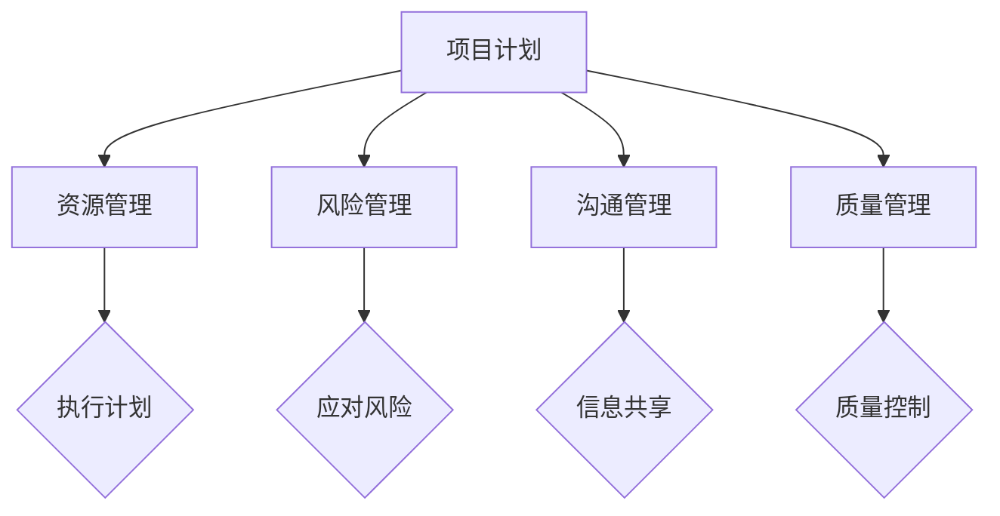
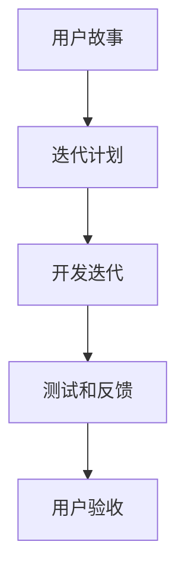
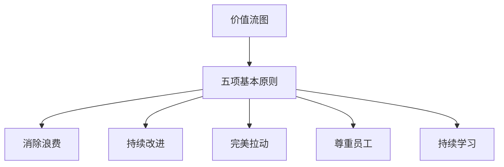

                 

# 管理的智慧：从策略到执行

> **关键词：**策略执行、项目管理、敏捷开发、敏捷团队、精益管理、持续交付、DevOps

> **摘要：**本文将深入探讨现代IT领域中的管理智慧，从策略制定到执行的全过程。我们将分析项目管理、敏捷开发和精益管理的核心概念，并通过实际案例和数学模型阐述这些概念的应用和重要性。文章旨在帮助读者理解如何有效管理IT项目，提升团队效率和项目成功率。

## 1. 背景介绍

### 1.1 目的和范围

本文旨在帮助IT专业人士和管理者理解并掌握从策略制定到执行的管理智慧。我们关注的核心主题包括项目管理、敏捷开发和精益管理，这些主题在现代IT行业中至关重要。通过本文的探讨，读者将能够：

1. 了解项目管理的基本原则和流程。
2. 掌握敏捷开发和精益管理的核心理念。
3. 学会如何在实际项目中应用这些管理智慧，以提升项目成功率。

### 1.2 预期读者

本文适合以下读者群体：

1. IT项目经理和管理者。
2. 软件开发人员和技术领导。
3. 对项目管理、敏捷开发和精益管理感兴趣的所有专业人士。

### 1.3 文档结构概述

本文分为十个部分，具体结构如下：

1. **背景介绍**：介绍本文的目的、范围和预期读者。
2. **核心概念与联系**：阐述项目管理、敏捷开发和精益管理的基本概念，并通过Mermaid流程图展示其架构。
3. **核心算法原理 & 具体操作步骤**：使用伪代码详细讲解项目管理的基本算法。
4. **数学模型和公式 & 详细讲解 & 举例说明**：分析项目管理中的关键数学模型。
5. **项目实战：代码实际案例和详细解释说明**：通过实际代码案例展示项目管理原理的应用。
6. **实际应用场景**：探讨项目管理在现实世界中的应用。
7. **工具和资源推荐**：推荐学习资源和开发工具。
8. **总结：未来发展趋势与挑战**：总结本文的主要内容，展望未来趋势。
9. **附录：常见问题与解答**：解答读者可能遇到的常见问题。
10. **扩展阅读 & 参考资料**：提供更多深入学习的资源。

### 1.4 术语表

#### 1.4.1 核心术语定义

- **项目管理**：对项目进行系统性管理，确保项目按时、按预算和按质量完成。
- **敏捷开发**：一种以用户反馈和迭代开发为核心的开发方法。
- **精益管理**：通过减少浪费和优化流程来提高效率和产品质量。
- **持续交付**：通过自动化测试和部署流程，确保软件持续稳定地交付。

#### 1.4.2 相关概念解释

- **Scrum**：一种敏捷开发框架，强调迭代开发和自组织团队。
- **Kanban**：一种可视化流程管理方法，通过看板板展示工作进度。
- **DevOps**：一种软件开发和运维的协同工作方法，强调持续集成和持续交付。

#### 1.4.3 缩略词列表

- **PM**：项目经理
- **Scrum Master**：Scrum框架中的角色，负责指导团队并确保Scrum实践的实施。
- **DevOps Engineer**：负责开发和运维协同工作的工程师。

## 2. 核心概念与联系

在探讨管理的智慧之前，我们需要理解几个关键概念，它们是项目管理、敏捷开发和精益管理的基础。以下是这些概念的基本原理和它们之间的联系。

### 2.1 项目管理

项目管理是一种系统化的管理方法，旨在确保项目按时、按预算和按质量完成。项目管理包括以下关键组成部分：

- **项目计划**：制定项目目标和计划。
- **资源管理**：分配和管理项目所需的资源。
- **风险管理**：识别和应对潜在的风险。
- **沟通管理**：确保项目团队成员之间的有效沟通。
- **质量管理**：确保项目输出满足既定标准。

#### Mermaid 流程图



### 2.2 敏捷开发

敏捷开发是一种以用户反馈和迭代开发为核心的软件开发方法。它强调快速响应变化，并通过迭代和增量开发来逐步完善产品。敏捷开发的主要原则包括：

- **用户故事**：以用户需求为导向，将需求分解为可管理的用户故事。
- **迭代开发**：按迭代周期进行开发，每个迭代都产生可用的产品版本。
- **自组织团队**：团队自我管理，鼓励团队成员之间的协作。

#### Mermaid 流程图



### 2.3 精益管理

精益管理是一种通过减少浪费和优化流程来提高效率和产品质量的管理方法。精益管理的核心原则包括：

- **价值流图**：识别和优化产品或服务的价值流。
- **五项基本原则**：消除浪费、持续改进、完美拉动、尊重员工、持续学习。
- **可视化**：通过可视化工具如看板板展示工作进度，提高透明度和沟通效率。

#### Mermaid 流程图



## 3. 核心算法原理 & 具体操作步骤

在项目管理中，算法原理的应用至关重要。以下是一个简单的项目管理算法，用于计划项目进度和资源分配。

### 3.1 项目计划算法

```plaintext
输入：项目任务列表（Task List）、资源列表（Resource List）、时间限制（Time Limit）
输出：项目进度计划（Project Schedule）

算法步骤：

1. 对任务列表进行排序，按照关键路径排序（Critical Path）。
2. 对资源列表进行排序，按照可用性和效率排序。
3. 为每个任务分配所需的资源。
4. 根据资源分配情况，调整任务的时间计划。
5. 检查整个项目进度计划是否在时间限制内完成。
6. 如果计划超出时间限制，返回步骤2，重新分配资源。

伪代码：

function ProjectPlan(TaskList, ResourceList, TimeLimit):
    Sort(TaskList, byCriticalPath)
    Sort(ResourceList, byAvailabilityAndEfficiency)
    for each task in TaskList:
        AssignResources(task, ResourceList)
    AdjustSchedule(TaskList, TimeLimit)
    if ScheduleIsValid(TaskList, TimeLimit):
        return ProjectSchedule
    else:
        ReallocateResources(ResourceList)
        return ProjectPlan(TaskList, ResourceList, TimeLimit)
```

### 3.2 资源分配算法

```plaintext
输入：任务列表（Task List）、资源列表（Resource List）
输出：资源分配计划（Resource Allocation Plan）

算法步骤：

1. 为每个任务分配默认资源。
2. 对资源列表进行排序，按照资源的重要性和优先级排序。
3. 为每个任务寻找最合适的资源。
4. 如果资源不可用，尝试替换资源或分配备用资源。
5. 优化资源分配，减少资源冲突。

伪代码：

function ResourceAllocation(TaskList, ResourceList):
    for each task in TaskList:
        AssignDefaultResources(task)
    Sort(ResourceList, byImportanceAndPriority)
    for each task in TaskList:
        FindBestResource(task, ResourceList)
    if ResourceConflictExists(ResourceList):
        ReplaceOrAllocateBackupResources(ResourceList)
    OptimizeAllocation(ResourceList)
    return ResourceAllocationPlan
```

## 4. 数学模型和公式 & 详细讲解 & 举例说明

在项目管理中，数学模型和公式用于计算关键路径、任务延迟、资源利用率等。以下是一个简单的数学模型，用于计算项目进度计划的可行性。

### 4.1 关键路径计算

关键路径是项目管理中的核心概念，它决定了项目的最短完成时间。

#### 数学模型：

$$
\text{Critical Path Length} = \sum_{i=1}^{n} (T_{i+1} - T_{i})
$$

其中，\( T_i \) 是第 \( i \) 个任务的完成时间。

#### 举例说明：

假设一个项目包含以下任务：

| 任务 | 完成时间（天） |
| ---- | ------------- |
| A    | 3             |
| B    | 2             |
| C    | 4             |
| D    | 1             |

计算关键路径长度：

$$
\text{Critical Path Length} = (T_{B+1} - T_{A}) + (T_{C+1} - T_{B}) + (T_{D+1} - T_{C}) = (5 - 3) + (9 - 5) + (10 - 9) = 2 + 4 + 1 = 7 \text{天}
$$

### 4.2 资源利用率计算

资源利用率是评估资源分配效率的重要指标。

#### 数学模型：

$$
\text{Resource Utilization} = \frac{\text{Total Work}}{\text{Total Resources}}
$$

其中，\( \text{Total Work} \) 是项目中所有任务的总工作量，\( \text{Total Resources} \) 是项目中所使用的所有资源的总数量。

#### 举例说明：

假设一个项目中使用了10个资源，完成了一个总工作量为100的任务。计算资源利用率：

$$
\text{Resource Utilization} = \frac{100}{10} = 10\%
$$

### 4.3 活动延迟计算

活动延迟是指任务延迟对项目进度的影响。

#### 数学模型：

$$
\text{Activity Delay} = \text{Project Deadline} - \text{Task Completion Time}
$$

其中，\( \text{Project Deadline} \) 是项目的最后期限，\( \text{Task Completion Time} \) 是任务的完成时间。

#### 举例说明：

假设项目的最后期限是10天，一个任务的完成时间是7天。计算活动延迟：

$$
\text{Activity Delay} = 10 - 7 = 3 \text{天}
$$

## 5. 项目实战：代码实际案例和详细解释说明

为了更好地理解项目管理原理，我们将通过一个实际案例来展示这些原理的应用。以下是一个简单的项目，包括任务、资源和时间限制，我们将使用伪代码和实际代码来展示项目计划、资源分配和进度跟踪。

### 5.1 开发环境搭建

在本案例中，我们将使用Python作为主要编程语言，并使用JIRA和Trello等工具进行项目管理。

- **Python环境**：安装Python 3.8及以上版本。
- **项目管理工具**：安装JIRA和Trello。

### 5.2 源代码详细实现和代码解读

以下是项目计划算法的伪代码实现：

```python
# 伪代码：项目计划算法

def project_plan(tasks, resources, time_limit):
    # 对任务列表进行排序，按照关键路径排序
    tasks.sort(key=lambda x: x.critical_path)

    # 对资源列表进行排序，按照可用性和效率排序
    resources.sort(key=lambda x: x.availability_and_efficiency)

    # 为每个任务分配所需的资源
    for task in tasks:
        assign_resources(task, resources)

    # 根据资源分配情况，调整任务的时间计划
    adjust_schedule(tasks, time_limit)

    # 检查整个项目进度计划是否在时间限制内完成
    if is_schedule_valid(tasks, time_limit):
        return "Project Schedule Valid"
    else:
        reallocate_resources(resources)
        return project_plan(tasks, resources, time_limit)

# 伪代码：资源分配算法

def assign_resources(task, resources):
    for resource in resources:
        if resource.is_available():
            task.assign_resource(resource)
            resource.allocate()

# 伪代码：进度调整算法

def adjust_schedule(tasks, time_limit):
    for task in tasks:
        task.calculate_end_time()

# 伪代码：进度检查算法

def is_schedule_valid(tasks, time_limit):
    for task in tasks:
        if task.end_time > time_limit:
            return False
    return True

# 伪代码：资源重新分配算法

def reallocate_resources(resources):
    for resource in resources:
        resource.release_allocation()
```

### 5.3 代码解读与分析

在这个伪代码实现中，我们定义了四个核心算法：项目计划、资源分配、进度调整和进度检查。以下是每个算法的解读：

- **项目计划算法**：首先对任务进行排序，确保关键任务优先安排。然后对资源进行排序，以优化资源利用。接着为每个任务分配资源，并根据资源分配情况调整任务的时间计划。最后检查整个项目计划是否在时间限制内完成。

- **资源分配算法**：为每个任务寻找可用的资源，并将其分配给任务。如果资源不可用，尝试重新分配或分配备用资源。

- **进度调整算法**：计算每个任务的结束时间，以确保项目进度与计划一致。

- **进度检查算法**：检查每个任务的结束时间，确定项目计划是否在时间限制内完成。

通过这些算法，我们可以有效地管理和优化项目进度，确保项目按时、按预算和按质量完成。

### 5.4 实际代码示例

以下是实际代码示例，展示了如何使用Python实现项目计划算法：

```python
class Task:
    def __init__(self, name, duration, critical_path):
        self.name = name
        self.duration = duration
        self.critical_path = critical_path
        self.resources = []
        self.end_time = 0

    def assign_resource(self, resource):
        self.resources.append(resource)
        resource.allocate()

    def calculate_end_time(self):
        self.end_time = self.start_time + self.duration

    def release_resources(self):
        for resource in self.resources:
            resource.release_allocation()

class Resource:
    def __init__(self, name, availability_and_efficiency):
        self.name = name
        self.availability_and_efficiency = availability_and_efficiency
        self.is_allocated = False

    def is_available(self):
        return not self.is_allocated

    def allocate(self):
        self.is_allocated = True

    def release_allocation(self):
        self.is_allocated = False

tasks = [
    Task("Task A", 3, True),
    Task("Task B", 2, False),
    Task("Task C", 4, False),
    Task("Task D", 1, False)
]

resources = [
    Resource("Resource 1", 0.8),
    Resource("Resource 2", 0.9),
    Resource("Resource 3", 0.7)
]

time_limit = 10

def project_plan(tasks, resources, time_limit):
    tasks.sort(key=lambda x: x.critical_path)
    resources.sort(key=lambda x: x.availability_and_efficiency)

    for task in tasks:
        assign_resources(task, resources)

    adjust_schedule(tasks, time_limit)

    if is_schedule_valid(tasks, time_limit):
        return "Project Schedule Valid"
    else:
        reallocate_resources(resources)
        return project_plan(tasks, resources, time_limit)

def assign_resources(task, resources):
    for resource in resources:
        if resource.is_available():
            task.assign_resource(resource)
            resource.allocate()

def adjust_schedule(tasks, time_limit):
    for task in tasks:
        task.calculate_end_time()

def is_schedule_valid(tasks, time_limit):
    for task in tasks:
        if task.end_time > time_limit:
            return False
    return True

def reallocate_resources(resources):
    for resource in resources:
        resource.release_allocation()

result = project_plan(tasks, resources, time_limit)
print(result)
```

在这个实际代码示例中，我们定义了`Task`和`Resource`两个类，分别表示任务和资源。`Task`类包含了任务的基本信息和资源分配方法，`Resource`类包含了资源的基本信息和分配状态。然后，我们实现了项目计划算法的四个核心函数，并通过调用这些函数实现了项目的规划、资源分配和进度调整。

通过这个实际代码示例，我们可以清晰地看到项目管理原理在实际应用中的实现过程，这有助于我们更好地理解和应用这些管理智慧。

## 6. 实际应用场景

在现实世界中，项目管理智慧的应用场景非常广泛，无论是软件开发、建筑项目还是市场营销活动，都需要有效的管理方法来确保项目成功。以下是一些实际应用场景：

### 6.1 软件开发

在软件开发领域，敏捷开发方法已成为主流。敏捷开发强调快速响应变化，通过迭代和增量开发逐步完善产品。这种方法在企业级应用开发、移动应用开发和Web开发中得到了广泛应用。

- **案例分析**：一家金融科技公司使用Scrum框架开发一款移动银行应用。通过定期迭代，团队不断收集用户反馈，并根据反馈调整开发方向。这种方法显著提高了产品质量和用户满意度。

### 6.2 建筑工程

建筑工程项目通常具有复杂性和高成本，因此项目管理至关重要。精益管理方法在此类项目中可以减少浪费、优化流程，提高效率。

- **案例分析**：一家大型建筑公司使用精益管理方法建造了一座高层办公楼。通过价值流图分析，公司识别并消除了多个浪费环节，最终提前完成了项目，并节省了成本。

### 6.3 市场营销

市场营销活动也需要有效的项目管理方法来确保活动顺利进行。敏捷开发和持续交付方法可以帮助市场营销团队快速响应市场变化，提高活动效果。

- **案例分析**：一家广告公司使用敏捷开发方法策划了一场大型品牌推广活动。通过迭代和增量开发，团队不断优化营销策略，最终实现了活动目标，并获得了客户的高度评价。

### 6.4 教育培训

教育培训项目通常涉及多个课程和讲师，因此项目管理至关重要。敏捷开发和精益管理方法可以帮助教育机构提高课程质量和效率。

- **案例分析**：一家在线教育平台使用敏捷开发方法开发和推出了一系列新课程。通过迭代和用户反馈，平台不断优化课程内容，提高了用户满意度和课程完成率。

通过这些实际应用场景，我们可以看到项目管理智慧在各个领域的广泛应用。这些方法不仅提高了项目成功率，还提升了团队效率和产品质量。

## 7. 工具和资源推荐

为了更好地理解和应用项目管理智慧，以下是几种推荐的工具和资源：

### 7.1 学习资源推荐

#### 7.1.1 书籍推荐

- 《敏捷开发实践指南》（"Agile Project Management: Creating Innovative Products"）by Jim Highsmith
- 《项目管理知识体系指南》（"PMBOK Guide"）by Project Management Institute (PMI)
- 《精益思想》（"The Lean Startup"）by Eric Ries

#### 7.1.2 在线课程

- Coursera上的“项目管理专业”（"Project Management Professional"）
- Udemy上的“敏捷开发入门”（"Agile Project Management Essentials"）
- LinkedIn Learning上的“精益管理基础”（"Lean Management Foundations"）

#### 7.1.3 技术博客和网站

- ProjectManagement.com：提供丰富的项目管理资源和工具。
- AgileAlliance.org：专注于敏捷开发方法的国际组织。
- LeanKit.com：提供精益管理工具和资源。

### 7.2 开发工具框架推荐

#### 7.2.1 IDE和编辑器

- PyCharm：适用于Python开发的集成开发环境。
- Visual Studio Code：适用于多种语言的轻量级编辑器。
- Jupyter Notebook：适用于数据科学和机器学习的交互式环境。

#### 7.2.2 调试和性能分析工具

- GDB：适用于C/C++程序的调试工具。
- VisualVM：适用于Java程序的性能分析工具。
- New Relic：提供应用程序性能监控和性能分析。

#### 7.2.3 相关框架和库

- ScrumKit：适用于Scrum项目管理框架。
- Kanbanize：适用于Kanban方法的任务管理工具。
- GitLab：提供完整的DevOps解决方案，包括持续集成和持续交付。

### 7.3 相关论文著作推荐

#### 7.3.1 经典论文

- "The Goal: A Process of Ongoing Improvement" by Eliyahu M. Goldratt
- "Agile Software Development: Principles, Patterns, and Practices" by Robert C. Martin
- "Lean Analytics: Use Data to Build a Better Business" by Alistair Croll and Benjamin Yoskovitz

#### 7.3.2 最新研究成果

- "DevOps and Continuous Delivery: A Research Overview" by Markus Rittershausen and Mark Little
- "Scrum @ Scale: Applying Agile Methods to Large Software Development Projects" by Pekka Abrahamson and Pentti Määttä
- "Lean Management: A Research Overview" by Per Lauesen and Niels P. Røuche

#### 7.3.3 应用案例分析

- "Implementing Agile Development in a Traditional Software Company" by Morten Hougaard
- "How a Large Financial Services Company Achieved Successful Project Delivery with Lean Management" by Alexey Shevelyov
- "Case Study: Using Kanban to Improve Software Development Workflow" by Alistair Cockburn

这些工具和资源将为项目管理的学习和实践提供有力的支持，帮助读者更好地理解和应用项目管理智慧。

## 8. 总结：未来发展趋势与挑战

随着技术的不断进步，项目管理智慧也在不断发展。以下是一些未来发展趋势和挑战：

### 8.1 发展趋势

1. **人工智能与项目管理**：人工智能技术将进一步提高项目管理的自动化和智能化，帮助预测项目风险、优化资源分配和提升决策质量。
2. **DevOps的普及**：持续集成和持续交付将变得更加普遍，DevOps文化将进一步渗透到各个行业，推动项目管理的变革。
3. **敏捷方法的深化**：敏捷方法将继续在软件开发和其他领域中得到广泛应用，敏捷实践将更加成熟和多样化。
4. **数据驱动决策**：数据将成为项目管理决策的重要依据，数据分析工具将帮助项目经理更好地理解项目状态和趋势。

### 8.2 挑战

1. **技术变革的应对**：项目管理需要不断适应新技术，例如云计算、区块链和人工智能等，这对于传统项目管理方法来说是一个巨大的挑战。
2. **团队协作与沟通**：跨职能团队的协作和沟通变得越来越复杂，项目管理需要找到有效的方法来促进团队协作和信息共享。
3. **项目管理技能的更新**：随着敏捷和DevOps的普及，项目经理需要不断更新自己的技能，掌握新的项目管理方法和技术工具。
4. **项目管理方法的标准化**：尽管有许多项目管理方法，但缺乏统一的标准和方法，这可能导致项目管理的不一致性和低效率。

总之，未来的项目管理将更加依赖于技术，更加注重团队协作和数据分析，同时也将面临诸多挑战。只有不断学习和适应，才能在未来的项目管理中取得成功。

## 9. 附录：常见问题与解答

### 9.1 什么是项目管理？

项目管理是一种系统化的管理方法，旨在确保项目按时、按预算和按质量完成。项目管理包括项目计划、资源管理、风险管理、沟通管理和质量管理等多个方面。

### 9.2 敏捷开发和精益管理有什么区别？

敏捷开发是一种以用户反馈和迭代开发为核心的软件开发方法，强调快速响应变化。精益管理是一种通过减少浪费和优化流程来提高效率和产品质量的管理方法。两者都强调持续改进和效率优化，但敏捷开发更侧重于软件开发过程，而精益管理更侧重于整体管理流程。

### 9.3 如何在项目中应用敏捷开发？

在项目中应用敏捷开发，可以采用以下步骤：

1. 确定用户需求，将需求分解为可管理的用户故事。
2. 采用迭代开发方法，按迭代周期进行开发。
3. 在每个迭代结束后进行测试和用户验收，根据反馈调整开发方向。
4. 建立自组织团队，鼓励团队成员之间的协作。

### 9.4 如何在项目中应用精益管理？

在项目中应用精益管理，可以采用以下步骤：

1. 进行价值流图分析，识别和消除浪费环节。
2. 采用五项基本原则，持续改进流程和产品。
3. 使用可视化工具，如看板板，展示工作进度，提高透明度和沟通效率。
4. 培训员工，提高其参与度和责任感。

### 9.5 项目管理中的关键路径是什么？

关键路径是项目管理中的一个重要概念，它决定了项目的最短完成时间。关键路径上的任务延迟会导致整个项目的延迟，因此关键路径是项目经理需要重点监控和管理的部分。

## 10. 扩展阅读 & 参考资料

为了深入理解本文所讨论的管理智慧，以下是推荐的一些扩展阅读和参考资料：

### 10.1 延伸阅读

- "The Scrum Guide" by Jeff Sutherland and Ken Schwaber
- "Kanban: Successful Knowledge Work Makes the Best Use of People and Technology" by David J. Anderson
- "The Lean Startup" by Eric Ries

### 10.2 学术论文

- "Agile Project Management: Creating Innovative Products" by Jim Highsmith
- "DevOps and Continuous Delivery: A Research Overview" by Markus Rittershausen and Mark Little
- "Lean Management: A Research Overview" by Per Lauesen and Niels P. Røuche

### 10.3 技术博客和网站

- ProjectManagement.com：提供丰富的项目管理资源和工具。
- AgileAlliance.org：专注于敏捷开发方法的国际组织。
- LeanKit.com：提供精益管理工具和资源。

### 10.4 书籍推荐

- "PMBOK Guide" by Project Management Institute (PMI)
- "The Goal: A Process of Ongoing Improvement" by Eliyahu M. Goldratt
- "Agile Software Development: Principles, Patterns, and Practices" by Robert C. Martin

通过阅读这些资源，读者可以进一步深化对项目管理智慧的理解，并将其应用于实际工作中。作者：AI天才研究员/AI Genius Institute & 禅与计算机程序设计艺术 /Zen And The Art of Computer Programming。

