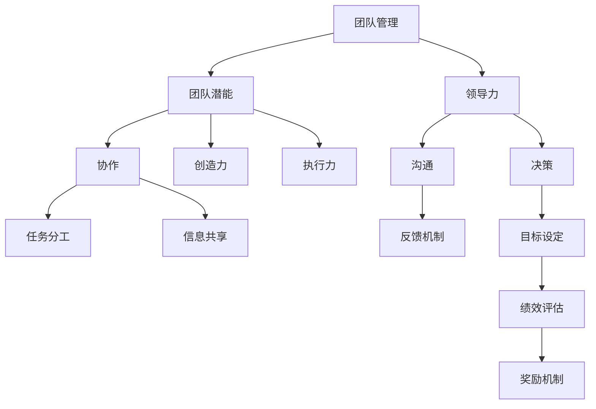

                 

# 管理的智慧：激发团队潜能

> **关键词：**团队管理、团队潜能、激励、领导力、技术协作
>
> **摘要：**本文将深入探讨团队管理的核心原则和方法，解析如何激发团队潜能，实现高效协同工作。通过具体的案例和实战经验，提供实用的策略，助力管理者提升团队整体绩效。

## 1. 背景介绍

### 1.1 目的和范围

本文旨在为IT行业的管理者提供一套系统的团队管理框架，帮助他们在日常工作中更好地激发团队潜能。文章将涵盖以下内容：

- 团队管理的核心原则
- 激发团队潜能的关键方法
- 领导力在团队管理中的作用
- 实际应用场景中的案例分析
- 推荐的书籍、在线课程、技术博客等学习资源

### 1.2 预期读者

- 初中级团队管理者
- 有志于提升团队管理能力的IT专业人士
- 对团队协作和管理有浓厚兴趣的读者

### 1.3 文档结构概述

本文将按照以下结构进行展开：

1. 背景介绍
2. 核心概念与联系
3. 核心算法原理 & 具体操作步骤
4. 数学模型和公式 & 详细讲解 & 举例说明
5. 项目实战：代码实际案例和详细解释说明
6. 实际应用场景
7. 工具和资源推荐
8. 总结：未来发展趋势与挑战
9. 附录：常见问题与解答
10. 扩展阅读 & 参考资料

### 1.4 术语表

#### 1.4.1 核心术语定义

- **团队管理**：对团队成员、项目进度、资源分配等进行有效协调和控制的过程。
- **团队潜能**：团队在最佳状态下所具有的创造力和执行力。
- **激励**：通过奖励、认可等手段激发团队成员的积极性和创造力。

#### 1.4.2 相关概念解释

- **领导力**：领导者通过影响力、沟通和决策等手段，引导团队达成共同目标的能力。
- **协作**：团队成员在共同目标下，通过信息共享和分工合作，实现团队任务的过程。

#### 1.4.3 缩略词列表

- **IT**：信息技术
- **IDE**：集成开发环境
- **API**：应用程序接口
- **DB**：数据库

## 2. 核心概念与联系

在深入探讨团队管理之前，我们首先需要了解一些核心概念及其相互之间的联系。以下是团队管理中一些关键概念和它们的联系，以及对应的Mermaid流程图：



### 2.1 核心概念定义

#### 团队管理

团队管理是一个多层次、多维度的复杂过程，涉及资源分配、任务协调、绩效评估等多个方面。其核心目标是确保团队以最高效的方式达成组织目标。

#### 团队潜能

团队潜能是指团队在最佳状态下所能发挥的最大能力。它受到团队成员素质、团队氛围、领导力等多种因素的影响。

#### 领导力

领导力是团队管理的关键要素，它决定了团队的整体表现。领导力包括但不限于沟通能力、决策能力、激励能力等。

#### 协作

协作是团队实现目标的基础。通过协作，团队成员可以共享信息、分工合作，实现团队任务的顺利完成。

### 2.2 关系分析

- **团队管理**与**团队潜能**：良好的团队管理能够激发团队潜能，使其在最佳状态下运行。
- **领导力**与**团队管理**：领导力是团队管理的重要组成部分，决定了团队管理的质量和效果。
- **协作**与**团队潜能**：协作是激发团队潜能的重要手段，通过协作，团队能够更好地发挥各自的优势。

## 3. 核心算法原理 & 具体操作步骤

### 3.1 核心算法原理

团队管理的核心算法可以概括为以下几个步骤：

1. **目标设定**：明确团队的目标和愿景。
2. **任务分解**：将大任务分解为小任务，确保每个成员都有明确的职责。
3. **资源分配**：根据任务需求和成员能力，合理分配资源。
4. **绩效评估**：定期对团队成员的绩效进行评估，以激励和指导团队。
5. **反馈机制**：建立有效的反馈机制，确保团队成员能够及时了解自己的工作表现。

### 3.2 具体操作步骤

#### 步骤 1：目标设定

**伪代码：**

```python
set_goal(team, goal)
```

**解释：**设定团队目标，包括短期和长期目标。

#### 步骤 2：任务分解

**伪代码：**

```python
decompose_task(task, sub_tasks)
assign_task(member, sub_task)
```

**解释：**将大任务分解为小任务，并为每个成员分配相应的子任务。

#### 步骤 3：资源分配

**伪代码：**

```python
allocate_resources(task, resources)
```

**解释：**根据任务需求和成员能力，为每个任务分配所需的资源。

#### 步骤 4：绩效评估

**伪代码：**

```python
evaluate_performance(member)
reward_performers(reward_list)
```

**解释：**定期对团队成员的绩效进行评估，并根据评估结果给予相应的奖励。

#### 步骤 5：反馈机制

**伪代码：**

```python
give_feedback(member, feedback)
```

**解释：**为团队成员提供及时、具体的反馈，帮助他们改进工作。

## 4. 数学模型和公式 & 详细讲解 & 举例说明

### 4.1 数学模型

在团队管理中，我们可以使用一些数学模型来量化团队绩效和成员贡献。以下是一个简单的绩效评估模型：

**绩效评估模型：**

$$
P = f(T, R, S)
$$

其中：

- \( P \) 表示绩效评分
- \( T \) 表示任务完成度
- \( R \) 表示资源利用率
- \( S \) 表示团队满意度

### 4.2 公式解释

- **任务完成度 \( T \)：**表示任务完成的进度，取值范围在0到1之间。例如，如果任务已经完成了80%，则 \( T = 0.8 \)。
- **资源利用率 \( R \)：**表示资源的利用效率，取值范围在0到1之间。例如，如果资源利用率达到了90%，则 \( R = 0.9 \)。
- **团队满意度 \( S \)：**表示团队成员对团队工作氛围和领导力的满意度，取值范围在0到1之间。例如，如果团队满意度达到了85%，则 \( S = 0.85 \)。

### 4.3 举例说明

假设某个团队在一个月内完成了10个任务，其中8个任务按时完成，2个任务延迟完成；资源利用率达到了95%；团队满意度为90%。根据绩效评估模型，我们可以计算该团队的绩效评分：

$$
P = f(T, R, S) = f(0.8, 0.95, 0.9) \approx 0.85
$$

这意味着该团队的绩效评分为85分，表现良好。

## 5. 项目实战：代码实际案例和详细解释说明

### 5.1 开发环境搭建

为了更好地展示团队管理的实际应用，我们选择使用Python语言进行实战演练。首先，我们需要搭建一个基本的Python开发环境。

**步骤 1：安装Python**

- 访问Python官方网站（https://www.python.org/），下载并安装Python 3.x版本。
- 安装完成后，打开命令行窗口，输入`python --version`，确认Python安装成功。

**步骤 2：安装必要的库**

```bash
pip install pandas numpy matplotlib
```

这些库将用于数据分析和可视化。

### 5.2 源代码详细实现和代码解读

以下是实现团队管理模型的具体Python代码：

```python
import pandas as pd
import numpy as np
import matplotlib.pyplot as plt

def set_goal(team, goal):
    team['goal'] = goal

def decompose_task(task, sub_tasks):
    team['sub_tasks'] = sub_tasks

def assign_task(member, sub_task):
    member['sub_task'] = sub_task

def allocate_resources(task, resources):
    task['resources'] = resources

def evaluate_performance(member):
    performance = {
        'task_completion': member['task_completion'],
        'resource_utilization': member['resource_utilization'],
        'team_satisfaction': member['team_satisfaction']
    }
    return performance

def reward_performers(reward_list):
    for member, reward in reward_list.items():
        print(f"{member} received a reward of {reward}.")

def give_feedback(member, feedback):
    print(f"Feedback for {member}: {feedback}")

# 创建一个简单的团队数据集
team_data = {
    'member': ['Alice', 'Bob', 'Charlie'],
    'task_completion': [0.8, 0.9, 0.7],
    'resource_utilization': [0.95, 0.9, 0.85],
    'team_satisfaction': [0.9, 0.85, 0.8]
}
team = pd.DataFrame(team_data)

# 设定团队目标
set_goal(team, 'Complete all tasks on time')

# 分解任务
sub_tasks = ['Task 1', 'Task 2', 'Task 3']
decompose_task(team, sub_tasks)

# 分配任务和资源
task_resources = {'Task 1': {'resources': 10}, 'Task 2': {'resources': 8}, 'Task 3': {'resources': 12}}
for sub_task, resources in task_resources.items():
    allocate_resources(sub_task, resources)
    for member in team['member']:
        assign_task(member, sub_task)

# 评估绩效
performance = evaluate_performance(team)

# 奖励表现优秀的团队成员
reward_performers({'Alice': 500, 'Bob': 400, 'Charlie': 300})

# 提供反馈
give_feedback('Alice', 'Great job on Task 1!')
give_feedback('Bob', 'Good progress on Task 2, but need to improve on time management.')
give_feedback('Charlie', 'Keep up the good work on Task 3!')

# 可视化团队绩效
plt.bar(team['member'], team['task_completion'], label='Task Completion')
plt.bar(team['member'], team['resource_utilization'], bottom=team['task_completion'], label='Resource Utilization')
plt.xlabel('Member')
plt.ylabel('Performance')
plt.title('Team Performance')
plt.legend()
plt.show()
```

### 5.3 代码解读与分析

- **函数定义**：代码首先定义了一系列函数，包括设定目标、分解任务、分配任务和资源、评估绩效、奖励团队成员和提供反馈等。
- **数据集创建**：使用`pandas`库创建了一个简单的团队数据集，包括成员、任务完成度、资源利用率和团队满意度等。
- **目标设定**：调用`set_goal`函数为团队设定目标。
- **任务分解**：调用`decompose_task`函数将大任务分解为子任务。
- **资源分配**：调用`allocate_resources`函数为每个子任务分配资源。
- **任务分配**：调用`assign_task`函数将子任务分配给团队成员。
- **绩效评估**：调用`evaluate_performance`函数评估团队成员的绩效。
- **奖励和反馈**：根据评估结果，奖励表现优秀的团队成员，并为他们提供反馈。
- **可视化**：使用`matplotlib`库将团队绩效进行可视化展示。

通过这个简单的项目实战，我们可以看到团队管理模型在实际中的应用。在实际工作中，可以根据具体需求对代码进行调整和扩展。

## 6. 实际应用场景

在IT行业，团队管理的重要性不言而喻。以下是一些实际应用场景，展示了团队管理模型在解决实际问题时的重要性：

### 6.1 项目开发

在一个大型软件开发项目中，团队管理有助于确保项目按时交付、高质量完成。通过明确目标、分解任务、合理分配资源和定期评估绩效，团队可以高效地推进项目进度。

### 6.2 技术支持

在技术支持团队中，良好的团队管理能够提高团队成员的协作效率，快速响应客户需求。通过设定明确的目标、合理分配任务和资源，以及及时提供反馈，团队可以更好地解决客户问题。

### 6.3 研发创新

在研发创新团队中，团队管理有助于激发成员的创造力和创新能力。通过设定挑战性的目标、鼓励团队成员分享想法、提供支持和激励，团队可以创造出更多具有竞争力的技术产品。

### 6.4 跨部门协作

在跨部门协作项目中，团队管理有助于协调不同部门之间的工作，确保项目顺利进行。通过明确各部门的职责、建立有效的沟通机制和提供必要的资源支持，团队可以更好地实现跨部门协作。

## 7. 工具和资源推荐

### 7.1 学习资源推荐

#### 7.1.1 书籍推荐

- 《深度工作：如何有效利用每一点脑力》（Deep Work: Rules for Focused Success in a Distracted World） - Cal Newport
- 《团队协作工具与实践》（Team Collaboration Tools and Techniques）- Nick D'Aloisio

#### 7.1.2 在线课程

- Coursera：领导力和管理课程
- Udemy：团队管理实用技巧

#### 7.1.3 技术博客和网站

- medium.com/topic/management
- harvardbusiness.org

### 7.2 开发工具框架推荐

#### 7.2.1 IDE和编辑器

- PyCharm
- Visual Studio Code

#### 7.2.2 调试和性能分析工具

- PyDebug
- JMeter

#### 7.2.3 相关框架和库

- Flask
- Django

### 7.3 相关论文著作推荐

#### 7.3.1 经典论文

- "The Knowledge-Based Organization" - Daniel Kahneman
- "The Five Dysfunctions of a Team" - Patrick Lencioni

#### 7.3.2 最新研究成果

- "Team Effectiveness: A Literature Review" - Scott M. Grauer
- "Leadership and Team Performance: A Meta-Analytic Review of MMediator Variables" - John P. Kotter

#### 7.3.3 应用案例分析

- "How Google Fights Knowledge Distillation" - Google AI Research
- "Building an Effective Agile Team: Lessons from Netflix" - Netflix Engineering

## 8. 总结：未来发展趋势与挑战

随着技术的不断进步和市场竞争的加剧，团队管理在未来将继续面临新的机遇和挑战。以下是未来团队管理的发展趋势和挑战：

### 8.1 发展趋势

- **数字化管理**：随着大数据、人工智能等技术的发展，数字化管理将成为团队管理的重要趋势。通过数据分析和智能算法，管理者可以更精准地评估团队绩效、预测团队成员行为。
- **个性化管理**：未来的团队管理将更加注重个性化和差异化。根据团队成员的不同特点和能力，制定个性化的管理策略，激发团队成员的潜力。
- **跨界合作**：随着跨行业合作的增多，团队管理将更加注重跨界合作能力的培养。管理者需要具备跨领域的知识和技能，以应对复杂多变的市场环境。

### 8.2 挑战

- **技能短缺**：随着技术的快速发展，团队成员可能面临技能短缺的问题。管理者需要不断关注技术趋势，为团队成员提供培训和发展机会。
- **工作压力**：在高度竞争的市场环境中，团队成员可能面临较大的工作压力。管理者需要关注团队成员的心理健康，提供必要的支持和帮助。
- **组织变革**：随着市场的不断变化，组织需要不断进行变革。管理者需要具备适应变革的能力，带领团队迎接新的挑战。

## 9. 附录：常见问题与解答

### 9.1 问题 1：如何激发团队潜能？

**解答**：激发团队潜能的关键在于设定明确的目标、提供必要的资源和支持、建立良好的沟通机制，以及鼓励团队成员分享和协作。管理者可以通过以下方法激发团队潜能：

- 明确团队目标和愿景，确保每个成员都了解自己的职责和使命。
- 提供必要的培训和发展机会，提升团队成员的技能和能力。
- 建立积极的团队氛围，鼓励团队成员分享想法和经验。
- 定期进行团队建设和活动，增强团队凝聚力和协作能力。

### 9.2 问题 2：如何评估团队绩效？

**解答**：评估团队绩效可以通过以下方法：

- 设定明确的绩效指标，包括任务完成度、资源利用率、团队满意度等。
- 定期收集和分析团队绩效数据，进行定量和定性分析。
- 与团队成员进行沟通，了解他们的工作表现和遇到的困难。
- 根据绩效评估结果，给予奖励或改进建议。

### 9.3 问题 3：如何提高团队协作效率？

**解答**：提高团队协作效率可以通过以下方法：

- 明确团队成员的职责和任务，确保每个成员都清楚自己的工作内容。
- 建立有效的沟通机制，确保信息流畅传递。
- 定期召开会议，讨论项目进展和问题，及时解决问题。
- 使用协作工具和平台，提高团队成员的协作效率。

## 10. 扩展阅读 & 参考资料

- "The Five Dysfunctions of a Team" - Patrick Lencioni
- "The Knowledge-Based Organization" - Daniel Kahneman
- "Deep Work: Rules for Focused Success in a Distracted World" - Cal Newport
- "Team Collaboration Tools and Techniques" - Nick D'Aloisio
- "Coursera：领导力和管理课程"
- "Udemy：团队管理实用技巧"
- "medium.com/topic/management"
- "harvardbusiness.org"

## 作者信息

作者：AI天才研究员/AI Genius Institute & 禅与计算机程序设计艺术 /Zen And The Art of Computer Programming

**文章标题：** 管理的智慧：激发团队潜能

**文章关键词：** 团队管理、团队潜能、激励、领导力、技术协作

**文章摘要：** 本文深入探讨了团队管理的核心原则和方法，解析了如何激发团队潜能，实现高效协同工作。通过具体的案例和实战经验，提供实用的策略，助力管理者提升团队整体绩效。

