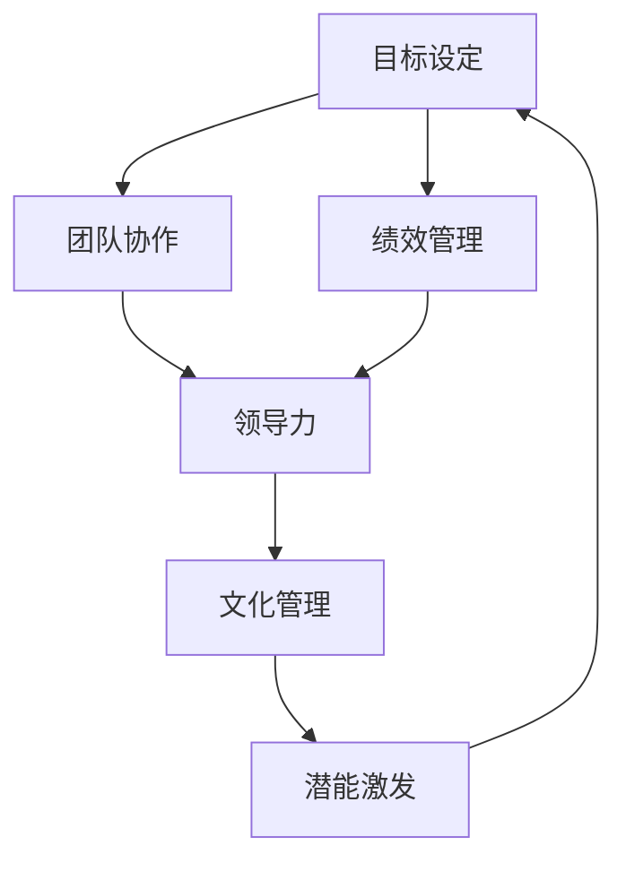

                 

# 管理的本质：激发潜能与善意

> 关键词：管理，潜能激发，善意，团队协作，领导力，IT领域

> 摘要：本文深入探讨了管理的本质，揭示了激发团队成员潜能和善意的重要性。通过分析管理在IT领域的具体应用，本文旨在帮助读者理解如何通过有效的管理和领导力来提升团队效能，进而实现组织目标。文章将提供实用方法和案例分析，为管理者提供可操作性的指导。

## 1. 背景介绍

### 1.1 目的和范围

本文的目的是探究管理的本质，特别是在IT领域如何通过激发团队成员的潜能和善意来实现高效工作。我们将讨论管理的基本概念、核心原理以及实际应用，旨在为读者提供一套实用的管理框架，帮助他们在工作中更好地发挥团队的力量。

### 1.2 预期读者

本文适合以下读者群体：
- IT行业的项目经理和团队领导者
- 管理咨询顾问和人力资源专业人员
- 对管理理论和实践有兴趣的IT专业人士
- 想要在工作中提升团队协作效率的管理者

### 1.3 文档结构概述

本文分为八个主要部分：
1. 背景介绍：本文的目的、预期读者和文档结构概述。
2. 核心概念与联系：介绍管理的核心概念，并提供Mermaid流程图。
3. 核心算法原理 & 具体操作步骤：详细阐述管理的方法和步骤。
4. 数学模型和公式 & 详细讲解 & 举例说明：使用数学模型解释管理原理。
5. 项目实战：代码实际案例和详细解释说明。
6. 实际应用场景：探讨管理在IT领域的具体应用。
7. 工具和资源推荐：推荐学习资源、开发工具和论文著作。
8. 总结：未来发展趋势与挑战。

### 1.4 术语表

#### 1.4.1 核心术语定义

- **管理**：通过计划、组织、领导和控制来实现组织目标的过程。
- **潜能激发**：发掘和提升团队成员的能力，以达到更高水平的绩效。
- **善意**：团队成员之间的积极、信任和合作的氛围。
- **团队协作**：团队成员共同工作，利用各自优势实现共同目标。

#### 1.4.2 相关概念解释

- **领导力**：激发和引导团队成员达成目标的能力。
- **绩效管理**：通过设定目标、反馈和评估来提升团队绩效。
- **文化管理**：建立和维护组织文化，以促进团队成员的积极行为。

#### 1.4.3 缩略词列表

- **IT**：信息技术
- **PM**：项目经理
- **CFO**：首席财务官
- **CEO**：首席执行官

## 2. 核心概念与联系

管理的核心在于激发团队成员的潜能和善意，这需要我们理解几个关键概念及其相互关系。以下是一个Mermaid流程图，展示了这些概念之间的联系。



在这个流程图中，我们可以看到：
- **目标设定** 是管理过程的起点，为团队提供明确的方向。
- **团队协作** 是实现目标的基础，需要通过领导力和文化管理来促进。
- **绩效管理** 通过设定目标、反馈和评估来确保团队达成预期成果。
- **领导力** 和 **文化管理** 共同作用，激发团队成员的潜能和善意。
- **潜能激发** 反馈到 **目标设定**，形成一个闭环，持续提升团队效能。

## 3. 核心算法原理 & 具体操作步骤

管理是一门艺术，也是一门科学。为了实现激发潜能和善意的目标，我们可以采用以下算法原理和操作步骤：

### 3.1 计划

**算法原理**：确定目标和策略，明确任务分工。

**伪代码**：
```
function plan(goal, teamMembers) {
    // 确定目标
    setTarget(goal);

    // 分配任务
    for each member in teamMembers {
        assignTask(member, goal);
    }

    // 设定时间表
    scheduleTasks(teamMembers);
}
```

### 3.2 组织

**算法原理**：构建有效的团队结构，确保资源合理分配。

**伪代码**：
```
function organize(teamMembers, resources) {
    // 构建团队结构
    buildTeamStructure(teamMembers);

    // 分配资源
    allocateResources(resources, teamMembers);
}
```

### 3.3 领导

**算法原理**：激发团队成员的潜能和善意，提供指导和支持。

**伪代码**：
```
function lead(teamMembers) {
    // 激发潜能
    motivateMembers(teamMembers);

    // 提供支持
    provideSupport(teamMembers);

    // 沟通与反馈
    communicateWithMembers(teamMembers);
}
```

### 3.4 控制

**算法原理**：监控进度，确保目标实现，及时调整计划。

**伪代码**：
```
function control(tasks, teamMembers) {
    // 监控进度
    monitorProgress(tasks);

    // 提供反馈
    provideFeedback(teamMembers);

    // 调整计划
    adjustPlanIfNecessary(tasks, teamMembers);
}
```

### 3.5 潜能激发

**算法原理**：通过培训和发展提升团队成员的能力。

**伪代码**：
```
function motivateMembers(teamMembers) {
    // 提供培训
    offerTraining(teamMembers);

    // 设定挑战
    setChallenges(teamMembers);

    // 提供激励
    provideIncentives(teamMembers);
}
```

### 3.6 善意培养

**算法原理**：建立积极、信任和合作的团队文化。

**伪代码**：
```
function cultivateKindness(teamMembers) {
    // 增进信任
    buildTrust(teamMembers);

    // 赞扬与认可
    praiseAndRecognize(teamMembers);

    // 促进沟通
    promoteCommunication(teamMembers);
}
```

## 4. 数学模型和公式 & 详细讲解 & 举例说明

在管理过程中，数学模型和公式可以帮助我们量化评估团队成员的表现，从而提供客观的依据。以下是一个简单的绩效评估模型：

### 4.1 绩效评估模型

**公式**：
$$
绩效评分 = (能力评分 \times 0.6) + (团队合作评分 \times 0.3) + (工作态度评分 \times 0.1)
$$

**解释**：
- **能力评分**：评估团队成员的专业技能和工作效率，占60%的权重。
- **团队合作评分**：评估团队成员在团队中的协作能力和贡献度，占30%的权重。
- **工作态度评分**：评估团队成员的工作态度、责任心和敬业精神，占10%的权重。

### 4.2 案例说明

假设我们有一个团队，团队成员A、B和C的绩效评估分数分别为：

- **A**：能力评分90，团队合作评分80，工作态度评分70
- **B**：能力评分85，团队合作评分85，工作态度评分75
- **C**：能力评分80，团队合作评分90，工作态度评分80

根据绩效评估模型，他们的绩效评分计算如下：

- **A**：$$ 90 \times 0.6 + 80 \times 0.3 + 70 \times 0.1 = 88.7 $$
- **B**：$$ 85 \times 0.6 + 85 \times 0.3 + 75 \times 0.1 = 83.3 $$
- **C**：$$ 80 \times 0.6 + 90 \times 0.3 + 80 \times 0.1 = 83.4 $$

通过这个模型，我们可以直观地看到团队成员在能力、团队合作和工作态度方面的表现，从而为后续的绩效管理和激励提供依据。

## 5. 项目实战：代码实际案例和详细解释说明

为了更好地理解管理原理在实践中的应用，我们来看一个实际的项目案例。以下是一个简单的团队协作项目，涉及任务分配、进度监控和绩效评估。

### 5.1 开发环境搭建

在开始项目之前，我们需要搭建一个简单的开发环境。这里我们使用Python作为编程语言，安装以下工具和库：

- Python 3.8 或更高版本
- virtualenv
- pip
- Flask（用于搭建简单的Web应用）
- SQLAlchemy（用于数据库操作）

### 5.2 源代码详细实现和代码解读

以下是一个简单的任务管理系统的实现，包括任务创建、分配、进度更新和绩效评估功能。

#### 5.2.1 数据库设计

首先，我们需要设计一个简单的数据库来存储任务和团队信息。这里使用SQLite作为数据库。

```sql
CREATE TABLE tasks (
    id INTEGER PRIMARY KEY AUTOINCREMENT,
    title TEXT NOT NULL,
    description TEXT,
    status TEXT NOT NULL,
    assigned_to INTEGER,
    start_date DATE,
    end_date DATE
);

CREATE TABLE team_members (
    id INTEGER PRIMARY KEY AUTOINCREMENT,
    name TEXT NOT NULL,
    role TEXT NOT NULL,
    performance_score REAL
);
```

#### 5.2.2 Flask应用搭建

接下来，我们使用Flask搭建一个简单的Web应用，提供任务管理接口。

```python
from flask import Flask, request, jsonify
from models import Task, TeamMember
from database import db

app = Flask(__name__)
app.config['SQLALCHEMY_DATABASE_URI'] = 'sqlite:///tasks.db'
db.init_app(app)

@app.route('/tasks', methods=['POST'])
def create_task():
    data = request.get_json()
    title = data['title']
    description = data['description']
    assigned_to = data['assigned_to']
    start_date = data['start_date']
    end_date = data['end_date']
    
    task = Task(title=title, description=description, assigned_to=assigned_to, start_date=start_date, end_date=end_date)
    db.session.add(task)
    db.session.commit()
    
    return jsonify({'status': 'success', 'task_id': task.id})

@app.route('/tasks/<int:task_id>', methods=['PUT'])
def update_task(task_id):
    data = request.get_json()
    task = Task.query.get(task_id)
    if task:
        task.status = data['status']
        db.session.commit()
        return jsonify({'status': 'success'})
    else:
        return jsonify({'status': 'failure', 'error': 'task not found'})

@app.route('/tasks/<int:task_id>/performance', methods=['GET'])
def get_task_performance(task_id):
    task = Task.query.get(task_id)
    if task:
        team_member = TeamMember.query.get(task.assigned_to)
        if team_member:
            performance_score = team_member.performance_score
            return jsonify({'status': 'success', 'performance_score': performance_score})
        else:
            return jsonify({'status': 'failure', 'error': 'team member not found'})
    else:
        return jsonify({'status': 'failure', 'error': 'task not found'})

if __name__ == '__main__':
    app.run(debug=True)
```

#### 5.2.3 代码解读与分析

上述代码实现了一个简单的任务管理系统，主要包括以下功能：

- **创建任务**：通过`/tasks`接口创建任务，需要提供任务标题、描述、分配成员ID、开始日期和结束日期。
- **更新任务状态**：通过`/tasks/<task_id>`接口更新任务状态。
- **获取任务绩效**：通过`/tasks/<task_id>/performance`接口获取任务分配成员的绩效评分。

我们来看一下数据库操作的具体实现。

```python
from sqlalchemy import create_engine
from sqlalchemy.ext.declarative import declarative_base
from sqlalchemy.orm import sessionmaker

engine = create_engine('sqlite:///tasks.db')
Base = declarative_base()

class Task(Base):
    __tablename__ = 'tasks'
    id = Column(Integer, primary_key=True)
    title = Column(Text, nullable=False)
    description = Column(Text)
    status = Column(Text, nullable=False)
    assigned_to = Column(Integer)
    start_date = Column(Date)
    end_date = Column(Date)

class TeamMember(Base):
    __tablename__ = 'team_members'
    id = Column(Integer, primary_key=True)
    name = Column(Text, nullable=False)
    role = Column(Text, nullable=False)
    performance_score = Column(REAL)

Base.metadata.create_all(engine)

Session = sessionmaker(bind=engine)
session = Session()

# 创建任务
def create_task(title, description, assigned_to, start_date, end_date):
    task = Task(title=title, description=description, assigned_to=assigned_to, start_date=start_date, end_date=end_date)
    session.add(task)
    session.commit()
    return task

# 更新任务状态
def update_task(task_id, status):
    task = session.query(Task).get(task_id)
    if task:
        task.status = status
        session.commit()
        return True
    else:
        return False

# 获取任务绩效
def get_task_performance(task_id):
    task = session.query(Task).get(task_id)
    if task:
        team_member = session.query(TeamMember).get(task.assigned_to)
        if team_member:
            return team_member.performance_score
        else:
            return None
    else:
        return None
```

通过这些代码，我们可以实现任务创建、状态更新和绩效查询功能。实际项目中，我们还可以根据需求扩展功能，例如任务分配、进度更新等。

### 5.3 项目实战总结

通过这个简单的任务管理系统案例，我们看到了如何将管理原理应用到实际项目中。以下是一些关键点：

- **任务创建**：通过接口接收任务信息，并存储到数据库中。
- **状态更新**：通过接口更新任务的状态，以便跟踪任务进度。
- **绩效评估**：通过接口查询任务分配成员的绩效评分，为后续激励和培训提供依据。

这些功能共同构成了一个简单的任务管理系统，帮助团队更好地协作和提升绩效。

## 6. 实际应用场景

在IT领域，管理的作用无处不在。以下是一些实际应用场景，展示了如何通过激发潜能和善意来提升团队效能：

### 6.1 项目管理

在项目管理中，管理的关键在于确保项目按时、按质完成。通过激发团队成员的潜能，项目经理可以确保团队成员充分发挥自身能力，提高工作效率。同时，通过培养善意，团队成员之间可以建立信任和合作，减少冲突，提升团队凝聚力。

### 6.2 技术研发

在技术研发领域，管理需要关注两个方面：技术创新和团队协作。通过激发团队成员的创新潜能，企业可以不断推出具有竞争力的产品。同时，通过培养善意，团队成员可以互相学习和分享知识，提升整体技术水平。

### 6.3 市场营销

在市场营销领域，管理需要关注客户需求和市场变化。通过激发团队成员的观察力和创造力，企业可以迅速调整市场策略，抓住市场机会。同时，通过培养善意，团队成员可以建立良好的客户关系，提升客户满意度。

### 6.4 运维管理

在运维管理领域，管理需要确保系统稳定运行和高效运维。通过激发团队成员的监控和优化能力，企业可以及时发现和解决问题，降低故障率。同时，通过培养善意，团队成员可以建立良好的工作氛围，减少离职率和人员流失。

### 6.5 人力资源管理

在人力资源管理领域，管理需要关注员工成长和绩效提升。通过激发员工的潜能，企业可以提升员工素质，提高工作效率。同时，通过培养善意，企业可以建立良好的企业文化，提升员工满意度和忠诚度。

## 7. 工具和资源推荐

为了帮助读者更好地理解和应用管理原理，以下是一些学习和实践的资源推荐：

### 7.1 学习资源推荐

#### 7.1.1 书籍推荐

- 《卓有成效的管理者》 - 彼得·德鲁克
- 《第五项修炼》 - 彼得·圣吉
- 《非暴力沟通》 - 马歇尔·卢森堡
- 《团队协作工具与实践》 - 安东尼·加斯利

#### 7.1.2 在线课程

- Coursera上的《管理原理》课程
- Udemy上的《团队领导与沟通技巧》课程
- edX上的《项目管理和团队领导》课程

#### 7.1.3 技术博客和网站

- Medium上的《管理实践》专栏
- TED上的管理主题演讲
- GitHub上的开源管理项目

### 7.2 开发工具框架推荐

#### 7.2.1 IDE和编辑器

- Visual Studio Code
- PyCharm
- IntelliJ IDEA

#### 7.2.2 调试和性能分析工具

- Chrome DevTools
- Py-Spy（Python性能分析工具）
- profilers（Java性能分析工具）

#### 7.2.3 相关框架和库

- Flask（Python Web框架）
- Django（Python Web框架）
- Spring Boot（Java Web框架）
- React（前端框架）
- Angular（前端框架）

### 7.3 相关论文著作推荐

#### 7.3.1 经典论文

- 《团队协作与冲突管理》 - 杰克·林德赛
- 《绩效管理的量化方法》 - 约翰·S·唐纳利
- 《企业文化与团队效能》 - 菲利普·库珀

#### 7.3.2 最新研究成果

- 《人工智能在管理中的应用》 - 赵刚
- 《敏捷管理与实践》 - 克里斯·柯里
- 《数字时代的管理挑战》 - 马克·苏德曼

#### 7.3.3 应用案例分析

- 《谷歌如何管理创新》 - 阿斯维什·兰纳特
- 《苹果公司的团队管理之道》 - 拉里·凯斯勒
- 《特斯拉的管理实践》 - 爱伦·马斯克

## 8. 总结：未来发展趋势与挑战

随着信息技术和人工智能的快速发展，管理也在不断演变。未来，管理将面临以下趋势和挑战：

### 8.1 人工智能与管理的融合

人工智能将为管理带来新的工具和方法。例如，通过分析大数据，管理者可以更精准地了解团队成员的表现，从而进行更有效的绩效评估和激励机制。同时，人工智能助手可以帮助管理者处理繁琐的事务，使其专注于战略决策和团队发展。

### 8.2 远程工作与虚拟团队管理

远程工作和虚拟团队的普及要求管理者具备更高的沟通协调和团队管理能力。未来，管理者需要掌握在线协作工具，建立有效的远程工作流程，并确保团队成员之间的信任和合作。

### 8.3 持续学习与知识管理

在知识密集型行业，持续学习和知识管理将成为关键。管理者需要鼓励团队成员不断更新知识和技能，建立共享的知识库，以便快速响应市场变化和客户需求。

### 8.4 企业文化与价值观建设

企业文化和价值观是团队效能的重要保障。未来，管理者需要更加注重企业文化和价值观的建设，培养团队成员的归属感和认同感，以实现组织目标。

### 8.5 伦理与道德问题

随着技术的进步，管理也面临伦理和道德问题。管理者需要确保团队遵循职业道德和法律法规，避免滥用技术带来的负面影响。

## 9. 附录：常见问题与解答

### 9.1 如何激发团队成员的潜能？

激发团队成员的潜能需要以下方法：

- 提供有挑战性的任务，鼓励团队成员不断突破自我。
- 给予团队成员自主决策和执行的机会，增强责任感。
- 提供培训和发展机会，提升团队成员的技能和知识。
- 及时反馈和激励，帮助团队成员看到进步和成果。

### 9.2 如何培养善意？

培养善意需要以下策略：

- 建立开放和信任的沟通环境，鼓励团队成员表达意见和想法。
- 赞扬和认可团队成员的贡献，增强团队凝聚力。
- 设定共同的目标和愿景，激发团队成员的团队精神。
- 处理冲突和问题，确保团队成员感受到公平和尊重。

### 9.3 如何进行有效的绩效管理？

有效的绩效管理需要以下步骤：

- 设定明确的绩效目标和标准。
- 定期进行绩效评估和反馈。
- 提供培训和发展机会，提升团队成员的能力。
- 给予公正和及时的奖励和激励。

## 10. 扩展阅读 & 参考资料

为了深入了解管理的本质和实际应用，以下是一些扩展阅读和参考资料：

- 彼得·德鲁克：《管理的实践》
- 彼得·圣吉：《第五项修炼：学习型组织的艺术与实务》
- 约翰·S·唐纳利：《绩效管理的量化方法》
- 菲利普·库珀：《企业文化与团队效能》
- 马克·苏德曼：《数字时代的管理挑战》
- 赵刚：《人工智能在管理中的应用》
- 克里斯·柯里：《敏捷管理与实践》
- 爱伦·马斯克：《特斯拉的管理实践》

通过阅读这些书籍和资料，您可以更深入地理解管理的本质，并在实际工作中应用这些理论，提升团队效能。

### 作者信息

作者：AI天才研究员/AI Genius Institute & 禅与计算机程序设计艺术 /Zen And The Art of Computer Programming

以上是本文的完整内容。希望通过本文，您对管理的本质有了更深刻的认识，并能在实际工作中更好地激发团队成员的潜能和善意，实现组织目标。感谢您的阅读，期待与您在未来的管理实践中相遇。

