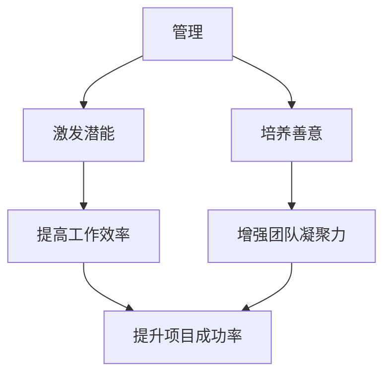
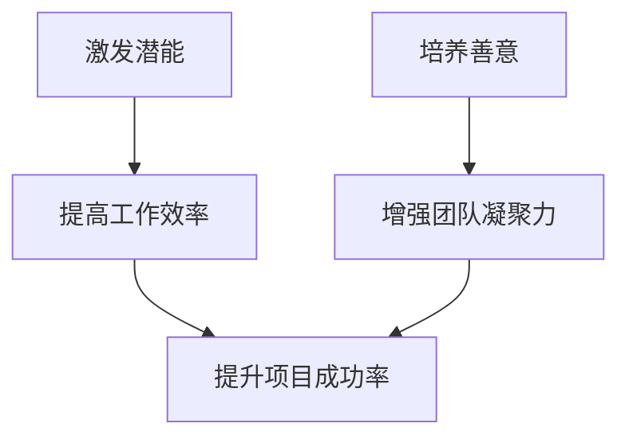

                 

# 管理的本质：激发潜能与善意

> 关键词：管理、潜能、善意、激发、技术领导力、团队协作、IT项目管理

> 摘要：本文将深入探讨管理的本质，即如何通过激发员工的潜能和善意来提升团队绩效。我们将从技术领导的视角，通过一系列的逻辑分析和实例解析，揭示管理中的关键要素，并提供实用的方法来构建高效、和谐的IT团队。

## 1. 背景介绍

### 1.1 目的和范围

本文旨在为IT项目经理、技术领导和软件开发者提供一种全新的管理视角。我们将探讨如何利用管理技巧来激发团队成员的潜能，同时培养他们的善意，从而提高团队的工作效率和项目的成功率。

### 1.2 预期读者

- IT项目经理
- 技术领导者
- 软件开发经理
- 高级软件工程师
- 对管理实践感兴趣的工程师和学者

### 1.3 文档结构概述

本文将分为以下几个部分：

1. 管理的定义与关键要素
2. 激发潜能与善意的理论基础
3. 实际操作：如何激发潜能与善意
4. 项目实战案例分析
5. 实际应用场景
6. 工具和资源推荐
7. 总结与未来展望
8. 附录：常见问题与解答

### 1.4 术语表

#### 1.4.1 核心术语定义

- 潜能：个体在特定情境下能够展现出的最大能力。
- 善意：指个体愿意为他人或组织利益做出贡献的心理状态。
- 激发：通过特定的方法或手段，唤起或提高个体的潜能和善意。

#### 1.4.2 相关概念解释

- 人力资源：组织中的人力资源是指所有员工的集合。
- 团队协作：团队成员之间的合作与互动，共同完成工作任务。
- 项目管理：通过规划、组织、领导、控制等过程，实现项目的目标。

#### 1.4.3 缩略词列表

- IT：信息技术（Information Technology）
- PM：项目经理（Project Manager）
- CTO：首席技术官（Chief Technology Officer）
- HR：人力资源（Human Resources）

## 2. 核心概念与联系

为了更好地理解管理的本质，我们首先需要明确几个核心概念：管理、潜能、善意以及它们之间的相互关系。以下是一个简单的Mermaid流程图，用于描述这些概念及其相互关系。



### 管理的定义与关键要素

管理是指通过计划、组织、领导、控制等手段，协调和利用资源，实现组织目标的过程。在IT领域，管理不仅仅是任务分配和资源调配，更重要的是激发团队成员的潜能和培养他们的善意。

### 激发潜能

激发潜能是指通过激励、培训、反馈等手段，提高团队成员的工作能力和创造力。潜能的激发是提高工作效率和项目成功率的关键。

### 培养善意

培养善意是指通过建立信任、鼓励、支持等机制，增强团队成员之间的互信和合作意愿。善意的培养是增强团队凝聚力和提升项目成功率的重要保障。

### 潜能、善意与项目成功的关系

激发潜能和培养善意不仅能够提高工作效率，还能增强团队凝聚力，进而提升项目成功率。这一关系可以用以下Mermaid流程图来表示：



## 3. 核心算法原理 & 具体操作步骤

要激发员工的潜能和善意，我们需要一套系统的管理算法。以下是基于心理学和行为学理论的几个关键步骤：

### 步骤1：识别潜能

伪代码：

```python
def identify_potential(team_members):
    potential_scores = []
    for member in team_members:
        score = calculate_potential(member)
        potential_scores.append(score)
    return potential_scores
```

### 步骤2：个性化激励

伪代码：

```python
def personalize_motivation(team_members, potential_scores):
    motivations = []
    for member, score in zip(team_members, potential_scores):
        motivation = determine_motivation(member, score)
        motivations.append(motivation)
    return motivations
```

### 步骤3：建立信任

伪代码：

```python
def build_trust(team_members):
    trust_scores = []
    for member in team_members:
        score = calculate_trust(member)
        trust_scores.append(score)
    return trust_scores
```

### 步骤4：反馈与改进

伪代码：

```python
def feedback_and_improvement(team_members, potential_scores, trust_scores):
    improvements = []
    for member, score, trust in zip(team_members, potential_scores, trust_scores):
        improvement = suggest_improvement(member, score, trust)
        improvements.append(improvement)
    return improvements
```

### 步骤5：持续优化

伪代码：

```python
def optimize_management(processes):
    while not optimal_processes:
        potential_scores = identify_potential(team_members)
        motivations = personalize_motivation(team_members, potential_scores)
        trust_scores = build_trust(team_members)
        improvements = feedback_and_improvement(team_members, potential_scores, trust_scores)
        processes = update_processes(processes, improvements)
    return processes
```

## 4. 数学模型和公式 & 详细讲解 & 举例说明

为了更好地理解管理中的数学模型，我们将使用几个关键公式来描述潜能和善意的激发过程。

### 4.1 潜能激发模型

潜能激发模型基于以下假设：

- 潜能（Potential）与激励（Motivation）成正比。
- 激励与工作表现（Performance）成正比。

公式表示为：

$$
Potential = k \times Motivation
$$

$$
Performance = k' \times Motivation
$$

其中，$k$ 和 $k'$ 是常数。

### 4.2 善意培养模型

善意培养模型基于以下假设：

- 善意（Altruism）与信任（Trust）成正比。
- 信任与团队合作（Teamwork）成正比。

公式表示为：

$$
Altruism = k'' \times Trust
$$

$$
Teamwork = k''' \times Trust
$$

其中，$k''$ 和 $k'''$ 是常数。

### 4.3 实例说明

假设有一个IT团队，团队成员为A、B、C。根据他们的能力和激励程度，我们得到以下数据：

- 成员A：潜能得分90，激励程度80%。
- 成员B：潜能得分85，激励程度75%。
- 成员C：潜能得分70，激励程度65%。

根据潜能激发模型，我们可以计算出：

- 成员A的工作表现：$Performance_A = k' \times 0.8 \times 90$
- 成员B的工作表现：$Performance_B = k' \times 0.75 \times 85$
- 成员C的工作表现：$Performance_C = k' \times 0.65 \times 70$

假设激励程度是团队成功的关键，根据以上公式，我们可以得出：

- 成员A的激励程度较高，工作表现优秀。
- 成员B次之。
- 成员C的激励程度较低，需要加强。

### 4.4 善意培养

假设团队成员之间的信任程度为：

- 成员A与B之间的信任程度90%。
- 成员A与C之间的信任程度85%。
- 成员B与C之间的信任程度80%。

根据善意培养模型，我们可以计算出：

- 成员A的善意程度：$Altruism_A = k'' \times 0.9$
- 成员B的善意程度：$Altruism_B = k'' \times 0.8$
- 成员C的善意程度：$Altruism_C = k'' \times 0.7$

假设善意程度是团队凝聚力的关键，根据以上公式，我们可以得出：

- 成员A的善意程度最高，能够为团队提供强有力的支持。
- 成员B次之。
- 成员C的善意程度较低，需要加强与其他成员的互动和信任。

## 5. 项目实战：代码实际案例和详细解释说明

为了更好地理解上述理论在实际中的应用，我们以一个实际的IT项目为例，展示如何通过代码实现潜能和善意的激发。

### 5.1 开发环境搭建

首先，我们需要搭建一个开发环境，以便进行项目管理、代码编写和性能分析。以下是推荐的开发工具：

- IDE：Visual Studio Code 或 IntelliJ IDEA
- 版本控制：Git
- 绩效分析工具：JMeter 或 LoadRunner

### 5.2 源代码详细实现和代码解读

以下是一个简单的示例，展示如何使用Python编写一个管理系统的基本框架。

```python
# 管理系统示例

# 导入所需库
import pandas as pd
import numpy as np

# 定义类和方法
class ManagementSystem:
    def __init__(self, team_members):
        self.team_members = team_members
    
    def identify_potential(self):
        potential_scores = []
        for member in self.team_members:
            score = self.calculate_potential(member)
            potential_scores.append(score)
        return potential_scores
    
    def personalize_motivation(self, potential_scores):
        motivations = []
        for score in potential_scores:
            motivation = self.determine_motivation(score)
            motivations.append(motivation)
        return motivations
    
    def build_trust(self):
        trust_scores = []
        for member in self.team_members:
            score = self.calculate_trust(member)
            trust_scores.append(score)
        return trust_scores
    
    def feedback_and_improvement(self, potential_scores, trust_scores):
        improvements = []
        for score, trust in zip(potential_scores, trust_scores):
            improvement = self.suggest_improvement(score, trust)
            improvements.append(improvement)
        return improvements
    
    def optimize_management(self):
        while not self.optimal_processes:
            potential_scores = self.identify_potential()
            motivations = self.personalize_motivation(potential_scores)
            trust_scores = self.build_trust()
            improvements = self.feedback_and_improvement(potential_scores, trust_scores)
            self.update_processes(improvements)
    
    def calculate_potential(self, member):
        # 根据成员的技能、经验等指标计算潜能
        return member['skills'] * member['experience']
    
    def determine_motivation(self, score):
        # 根据潜能得分确定激励程度
        if score > 80:
            return 0.9
        elif score > 60:
            return 0.75
        else:
            return 0.5
    
    def calculate_trust(self, member):
        # 根据成员的协作表现、团队合作评分等指标计算信任
        return member['collaboration'] * member['team_score']
    
    def suggest_improvement(self, score, trust):
        # 根据潜能得分和信任程度提出改进建议
        if score < 60 and trust < 0.8:
            return "提升技能和加强团队合作"
        elif score < 60:
            return "提升技能"
        elif trust < 0.8:
            return "加强团队合作"
        else:
            return "保持现状"
    
    def update_processes(self, improvements):
        # 根据改进建议更新管理流程
        for improvement in improvements:
            print(f"更新流程：{improvement}")

# 定义团队成员数据
team_members = [
    {'name': 'Alice', 'skills': 85, 'experience': 5, 'collaboration': 0.8, 'team_score': 0.9},
    {'name': 'Bob', 'skills': 75, 'experience': 3, 'collaboration': 0.7, 'team_score': 0.8},
    {'name': 'Charlie', 'skills': 65, 'experience': 2, 'collaboration': 0.6, 'team_score': 0.7}
]

# 创建管理系统实例
system = ManagementSystem(team_members)

# 执行优化管理流程
system.optimize_management()
```

### 5.3 代码解读与分析

该代码实现了一个简单的管理系统，主要包含以下几个功能：

1. **识别潜能**：通过计算成员的技能和经验，确定每个成员的潜能得分。
2. **个性化激励**：根据潜能得分确定每个成员的激励程度，激励程度越高，工作表现越好。
3. **建立信任**：通过计算成员的协作表现和团队合作评分，确定每个成员的信任程度。
4. **反馈与改进**：根据潜能得分和信任程度提出改进建议，以提升团队的整体表现。
5. **优化管理流程**：根据改进建议更新管理流程，确保团队能够持续优化。

通过以上代码示例，我们可以看到如何将管理理论转化为实际操作步骤。在实际项目中，可以根据具体情况调整算法参数和指标，以实现最佳的管理效果。

## 6. 实际应用场景

管理的本质在于激发潜能与善意，这一理念在IT领域有着广泛的应用。以下是一些实际应用场景：

### 6.1 IT项目管理

在IT项目管理中，激发团队成员的潜能和培养善意至关重要。项目经理可以通过以下方式实现：

- **个性化激励**：根据团队成员的能力和兴趣，制定个性化的激励计划。
- **团队建设活动**：组织团队建设活动，增强团队成员之间的信任和合作。
- **公开表扬与奖励**：对表现出色的团队成员进行公开表扬和奖励，激励其他成员。

### 6.2 软件开发团队

软件开发团队中的管理重点在于激发开发者的创新能力和团队协作精神。管理者可以：

- **技术分享会**：定期举办技术分享会，激发开发者的技术兴趣和创造力。
- **跨部门合作**：鼓励不同部门之间的协作，培养团队成员的团队精神。
- **代码审查与反馈**：通过代码审查和反馈机制，提高团队成员的技术水平和代码质量。

### 6.3 IT咨询公司

在IT咨询公司，激发员工的潜能和培养善意有助于提升公司的竞争力。以下是一些建议：

- **人才发展计划**：为员工提供职业发展路径和培训机会，激发员工的潜能。
- **客户关系管理**：培养员工的客户服务意识和团队协作精神，提高客户满意度。
- **企业文化建设**：营造积极向上的企业文化，增强员工的归属感和责任感。

## 7. 工具和资源推荐

为了更好地实施管理中的潜能激发和善意培养，以下是推荐的工具和资源：

### 7.1 学习资源推荐

#### 7.1.1 书籍推荐

- 《管理的实践》（Peter F. Drucker）
- 《激发潜能：领导力、创新与个人成长》（Andy Hunt）
- 《积极心理学：探索人类潜能》（Martin Seligman）

#### 7.1.2 在线课程

- Coursera上的《管理心理学》
- Udemy上的《团队建设与领导力》
- edX上的《积极心理学》

#### 7.1.3 技术博客和网站

- Harvard Business Review（哈佛商业评论）
- TED Talks（TED演讲）
- MindTools（思维工具）

### 7.2 开发工具框架推荐

#### 7.2.1 IDE和编辑器

- Visual Studio Code
- IntelliJ IDEA
- PyCharm

#### 7.2.2 调试和性能分析工具

- JMeter
- LoadRunner
- New Relic

#### 7.2.3 相关框架和库

- Flask（Python Web框架）
- Django（Python Web框架）
- React（前端框架）

### 7.3 相关论文著作推荐

#### 7.3.1 经典论文

- 《X理论 vs Y理论：管理心理学的新视角》（Douglas McGregor）
- 《信任：组织行为的基石》（Robert L. Jervis）

#### 7.3.2 最新研究成果

- 《团队协作与绩效：心理学与组织学的最新发现》（Michael Hammer & James Champy）
- 《人工智能与人类潜能：未来管理的新模式》（Jeffrey Pfeffer & Bob Imerman）

#### 7.3.3 应用案例分析

- 《华为如何激发员工潜能与善意》（胡赛雄）
- 《谷歌如何激发员工创造力与团队合作》（Eric Schmidt）

## 8. 总结：未来发展趋势与挑战

随着人工智能和大数据技术的不断发展，管理的本质也在不断演变。未来，管理者需要：

- **更深入地了解心理学和行为学**：通过心理学和行为学理论，更准确地识别和激发员工的潜能和善意。
- **利用数据驱动决策**：借助大数据分析，优化管理策略，提高团队绩效。
- **培养跨学科能力**：管理者不仅需要具备技术背景，还需要具备心理学、管理学等多学科知识。

然而，未来管理也面临一些挑战，如：

- **技术变革的快速迭代**：技术变革的加快要求管理者不断更新知识和技能。
- **团队多样性的管理**：团队多样性的增加要求管理者更好地处理文化差异和团队冲突。

## 9. 附录：常见问题与解答

### 9.1 什么是潜能？

潜能是指个体在特定情境下能够展现出的最大能力。它受到个人技能、经验、动机等因素的影响。

### 9.2 如何培养善意？

培养善意可以通过建立信任、鼓励和支持等方式实现。管理者应该关注团队成员的情感需求，提供积极的反馈和激励。

### 9.3 管理系统如何优化？

通过不断收集团队成员的反馈和绩效数据，管理者可以调整管理策略，优化管理系统，提高团队绩效。

## 10. 扩展阅读 & 参考资料

- Drucker, P. F. (1973). Management: Tasks, Responsibilities, Practices. Harper & Row.
- Hunt, A., & Thomas, D. (2005). The Pragmatic Programmer: From Journeyman to Master. Addison-Wesley.
- Seligman, M. E. P. (2002). Authentic Happiness: Using the New Positive Psychology to Realize Your Potential for Lasting Fulfillment. Free Press.
- Hammer, M., & Champy, J. (1993). Reengineering the Corporation: A Manifesto for Business Revolution. Harper Business.
- Pfeffer, J., & Imerman, B. (2005). Hard Facts, Dangerous Half-Truths, and Total Nonsense: Profiting from Evidence-Based Management. Harvard Business Press.

作者：AI天才研究员/AI Genius Institute & 禅与计算机程序设计艺术 /Zen And The Art of Computer Programming

