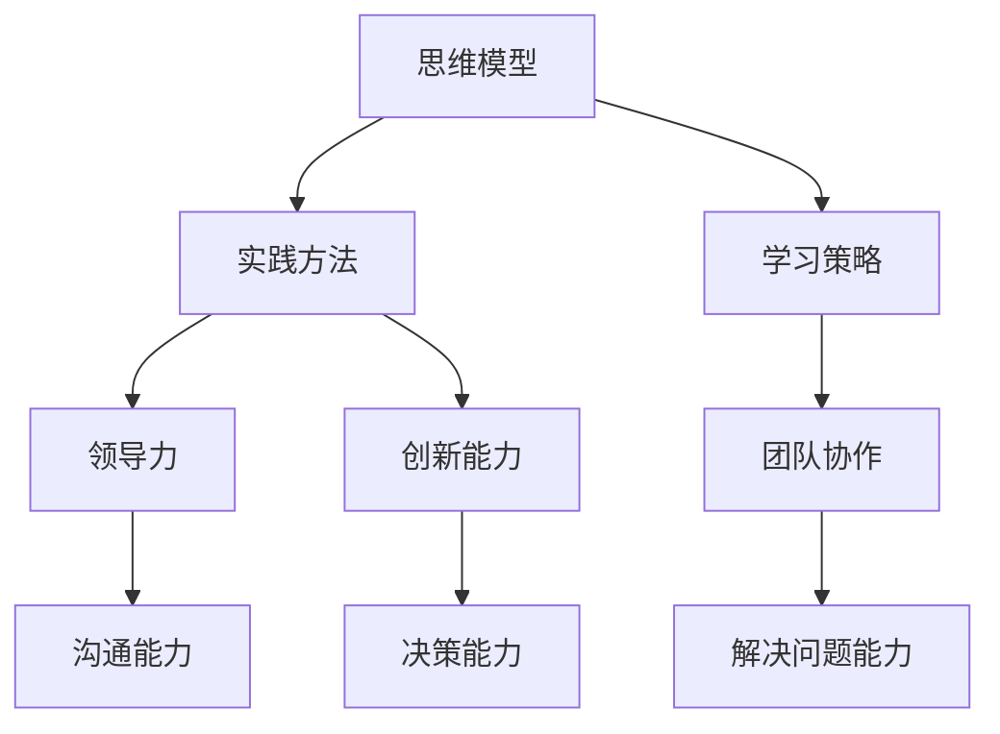

                 

# 管理者修炼手册：思维、行动与学习

> 关键词：管理者能力，思维模型，实践方法，学习策略，领导力，创新思维

> 摘要：本文深入探讨了管理者在当今快速变化的技术环境下所需具备的技能和素质。通过分析核心概念、原理和实践方法，结合数学模型和实际案例，本文旨在为管理者提供一套全面的修炼手册，以提升其思维、行动和学习能力，从而更好地应对未来的挑战。

## 1. 背景介绍

### 1.1 目的和范围

本文旨在为管理者和希望成为管理者的人提供一套全面的修炼手册。我们将探讨管理者的核心能力，包括思维模型、实践方法和学习策略，并结合最新的技术趋势和商业实践，帮助读者提升自己的领导力和创新能力。

### 1.2 预期读者

本文适合以下读者群体：

- 正在担任或有意成为管理岗位的专业人士；
- 对领导力和管理技能有浓厚兴趣的技术专家；
- 对团队管理和组织发展有深入研究的学者和研究者。

### 1.3 文档结构概述

本文结构如下：

- **第1章：背景介绍**：介绍本文的目的、预期读者和文档结构。
- **第2章：核心概念与联系**：定义核心概念，并使用Mermaid流程图展示管理者的思维框架。
- **第3章：核心算法原理 & 具体操作步骤**：详细讲解管理者所需的思维模型和实践方法。
- **第4章：数学模型和公式 & 详细讲解 & 举例说明**：介绍管理者在决策过程中常用的数学模型和公式。
- **第5章：项目实战：代码实际案例和详细解释说明**：通过具体案例展示管理技能的实际应用。
- **第6章：实际应用场景**：探讨管理者在不同场景下的应用和实践。
- **第7章：工具和资源推荐**：推荐学习资源和开发工具。
- **第8章：总结：未来发展趋势与挑战**：总结本文的核心观点，并提出未来发展趋势和挑战。
- **第9章：附录：常见问题与解答**：解答读者可能遇到的常见问题。
- **第10章：扩展阅读 & 参考资料**：提供进一步阅读的资源。

### 1.4 术语表

#### 1.4.1 核心术语定义

- **管理者**：负责团队或组织的领导、规划和执行工作的人。
- **思维模型**：对事物本质和规律的抽象理解。
- **实践方法**：通过实际行动来解决问题的方法。
- **学习策略**：提高学习效率和效果的方法。

#### 1.4.2 相关概念解释

- **领导力**：激发和引导团队实现共同目标的能力。
- **创新能力**：创造新的思想、方法和解决方案的能力。
- **团队协作**：团队成员之间的沟通、合作和共同完成任务的过程。

#### 1.4.3 缩略词列表

- **AI**：人工智能
- **ML**：机器学习
- **DL**：深度学习
- **IoT**：物联网

## 2. 核心概念与联系

管理者的核心能力包括思维模型、实践方法和学习策略。以下是一个Mermaid流程图，展示了这些概念之间的联系：



### 2.1 思维模型

思维模型是管理者对事物本质和规律的抽象理解。以下是一些常见的思维模型：

- **SWOT分析**：分析团队或项目的优势、劣势、机会和威胁。
- **五力模型**：分析市场中的竞争力量。
- **逻辑思维**：通过逻辑推理得出结论。
- **系统思维**：理解系统内部各个组成部分之间的相互作用。

### 2.2 实践方法

实践方法是管理者通过实际行动来解决问题的方法。以下是一些常见的实践方法：

- **目标设定**：明确团队或项目的目标。
- **计划制定**：制定实现目标的计划。
- **团队建设**：建立高效的团队。
- **问题解决**：识别并解决团队或项目中的问题。

### 2.3 学习策略

学习策略是提高学习效率和效果的方法。以下是一些常见的学习策略：

- **主动学习**：积极参与学习过程，主动探索和解决问题。
- **反思学习**：在学习过程中不断反思，总结经验教训。
- **知识共享**：与他人分享知识和经验。
- **持续学习**：保持对新知识和技能的学习。

## 3. 核心算法原理 & 具体操作步骤

管理者的核心算法原理包括决策树、神经网络和回归分析等。以下是一个决策树的伪代码示例：

```python
Algorithm DecisionTree(data, attributes):
    if data is pure:
        return majority label in data
    else:
        a = BestAttribute(data, attributes)
        create node "a"
        for value in attribute a:
            sub_data = subset(data, value)
            create branch "value" leading to DecisionTree(sub_data, attributes - {a})
        return Node "a" with branches
```

### 3.1 决策树的构建

1. **数据预处理**：对数据进行清洗和标准化。
2. **属性选择**：选择最优的属性进行分割。
3. **构建树**：递归构建决策树。
4. **评估与剪枝**：评估树的质量并进行剪枝。

### 3.2 神经网络的构建

1. **初始化权重**：随机初始化权重。
2. **前向传播**：计算输出值。
3. **反向传播**：更新权重。
4. **迭代训练**：重复前向传播和反向传播，直到收敛。

### 3.3 回归分析的构建

1. **模型选择**：选择合适的回归模型。
2. **数据拟合**：计算模型参数。
3. **评估与优化**：评估模型性能并进行优化。

## 4. 数学模型和公式 & 详细讲解 & 举例说明

管理者在决策过程中常用的数学模型和公式包括线性回归、逻辑回归和决策树等。

### 4.1 线性回归

线性回归模型的基本公式为：

$$ y = \beta_0 + \beta_1 \cdot x $$

其中，\( y \) 是因变量，\( x \) 是自变量，\( \beta_0 \) 和 \( \beta_1 \) 是模型参数。

### 4.2 逻辑回归

逻辑回归模型的基本公式为：

$$ P(y=1) = \frac{1}{1 + e^{-(\beta_0 + \beta_1 \cdot x)}} $$

其中，\( P(y=1) \) 是因变量为1的概率，\( \beta_0 \) 和 \( \beta_1 \) 是模型参数。

### 4.3 决策树

决策树模型的基本公式为：

$$ y = \text{ MajorityVote}(\text{PredictedLabels}) $$

其中，\( y \) 是预测的因变量，\( \text{PredictedLabels} \) 是各个节点上的预测标签。

### 4.4 举例说明

假设我们有一个数据集，包含自变量 \( x \) 和因变量 \( y \)。我们可以使用线性回归模型来预测 \( y \)：

$$ y = \beta_0 + \beta_1 \cdot x $$

通过训练数据集，我们可以得到模型参数 \( \beta_0 \) 和 \( \beta_1 \)。然后，我们可以使用这个模型来预测新的 \( y \) 值。

## 5. 项目实战：代码实际案例和详细解释说明

### 5.1 开发环境搭建

为了更好地理解管理者的实践方法，我们将使用Python编写一个简单的团队管理工具。首先，我们需要搭建开发环境。

1. 安装Python：前往 [Python官网](https://www.python.org/) 下载并安装Python。
2. 安装必要的库：使用pip安装所需的库，如NumPy、Pandas和scikit-learn。

```bash
pip install numpy pandas scikit-learn
```

### 5.2 源代码详细实现和代码解读

以下是一个简单的团队管理工具的代码实现：

```python
import numpy as np
import pandas as pd
from sklearn.model_selection import train_test_split
from sklearn.tree import DecisionTreeClassifier
from sklearn.metrics import accuracy_score

# 数据准备
data = pd.DataFrame({
    'member': ['Alice', 'Bob', 'Charlie', 'Dave'],
    'role': ['Manager', 'Developer', 'Tester', 'Designer'],
    'performance': [4.5, 3.8, 4.2, 3.9],
    'satisfaction': [4.0, 3.5, 4.2, 3.8]
})

# 特征工程
X = data[['performance', 'satisfaction']]
y = data['role']

# 数据划分
X_train, X_test, y_train, y_test = train_test_split(X, y, test_size=0.2, random_state=42)

# 模型构建
model = DecisionTreeClassifier()
model.fit(X_train, y_train)

# 预测
y_pred = model.predict(X_test)

# 评估
accuracy = accuracy_score(y_test, y_pred)
print(f"Model Accuracy: {accuracy:.2f}")
```

### 5.3 代码解读与分析

1. **数据准备**：我们使用一个简单的数据集，包含团队成员的绩效和满意度。
2. **特征工程**：我们选择绩效和满意度作为特征。
3. **数据划分**：我们将数据划分为训练集和测试集。
4. **模型构建**：我们使用决策树分类器来构建模型。
5. **预测**：我们使用模型对测试集进行预测。
6. **评估**：我们使用准确率来评估模型性能。

通过这个简单的案例，我们可以看到管理者如何使用数学模型和算法来分析团队数据，从而做出更明智的决策。

## 6. 实际应用场景

管理者在不同场景下需要运用不同的技能和策略。以下是一些常见的实际应用场景：

### 6.1 项目管理

- **目标设定**：明确项目的目标和关键里程碑。
- **风险管理**：识别和应对项目中的风险。
- **沟通协调**：确保团队成员之间的信息畅通。
- **进度监控**：监控项目的进度和资源使用情况。

### 6.2 团队管理

- **团队建设**：建立高效的团队，提高团队协作能力。
- **绩效评估**：公正地评估团队成员的绩效。
- **激励与反馈**：给予团队成员激励和反馈，促进个人成长。

### 6.3 创新管理

- **市场需求分析**：了解市场需求，把握创新方向。
- **创新孵化**：提供资源和支持，鼓励创新尝试。
- **创新评估**：评估创新项目的可行性，确保资源合理分配。

## 7. 工具和资源推荐

### 7.1 学习资源推荐

#### 7.1.1 书籍推荐

- 《领导者的语言》
- 《智能时代的领导力》
- 《创新者的思考方式》

#### 7.1.2 在线课程

- Coursera上的《管理者的艺术》
- edX上的《高级团队管理》
- LinkedIn Learning的《领导力与影响力》

#### 7.1.3 技术博客和网站

- Harvard Business Review
- LinkedIn Pulse
- TechCrunch

### 7.2 开发工具框架推荐

#### 7.2.1 IDE和编辑器

- Visual Studio Code
- IntelliJ IDEA
- PyCharm

#### 7.2.2 调试和性能分析工具

- Chrome DevTools
- PyCharm Debugger
- JMeter

#### 7.2.3 相关框架和库

- Scikit-learn
- TensorFlow
- Pandas

### 7.3 相关论文著作推荐

#### 7.3.1 经典论文

- "The Manager's Toolbox: A Research-Based Approach to Managing Organizations"
- "The Leader's Work: Leading with Confidence and Skill"

#### 7.3.2 最新研究成果

- "AI and Management: A Research Agenda"
- "Digital Transformation in Management: A Review and Research Agenda"

#### 7.3.3 应用案例分析

- "Leadership in the Age of AI"
- "Transforming Organizations with Agile Management"

## 8. 总结：未来发展趋势与挑战

随着人工智能和大数据技术的快速发展，管理者的角色和职责也在不断变化。未来，管理者需要具备更强的数据分析能力、机器学习和自动化管理技能，以及跨领域的综合能力。同时，面对复杂多变的环境，管理者需要具备快速适应和创新能力，以应对不断涌现的挑战。

### 8.1 发展趋势

- **数字化管理**：越来越多的管理者将采用数字化工具和平台来优化管理流程。
- **智能决策**：利用人工智能和大数据分析技术，管理者将能够做出更加精准的决策。
- **团队合作**：管理者将更加重视团队协作，推动组织的创新和成长。

### 8.2 挑战

- **技术技能要求**：管理者需要不断更新自己的技术知识和技能。
- **数据安全与隐私**：在数字化时代，管理者需要确保数据的安全和隐私。
- **人才竞争**：随着人才的稀缺，管理者需要具备更强的吸引和保留人才的能力。

## 9. 附录：常见问题与解答

### 9.1 如何提升自己的领导力？

- **阅读相关书籍**：阅读领导力相关的书籍，学习成功管理者的经验和技巧。
- **参加培训课程**：参加领导力培训课程，获取系统的知识和实践技能。
- **反思与总结**：在工作中不断反思自己的管理行为，总结经验教训。

### 9.2 如何提高团队协作效率？

- **明确目标**：确保团队成员对项目的目标和任务有清晰的认识。
- **有效沟通**：建立开放的沟通渠道，确保信息畅通。
- **激励与奖励**：给予团队成员适当的激励和奖励，提高他们的工作积极性。

## 10. 扩展阅读 & 参考资料

- "The Manager's Path: A Guide for People Who Lead Engineers" by Camille Fournier
- "Leadership and Self-Deception: Getting Out of the Box" by The Arbinger Institute
- "The Innovator's Dilemma: When New Technologies Cause Great Firms to Fail" by Clayton M. Christensen

作者：AI天才研究员/AI Genius Institute & 禅与计算机程序设计艺术 /Zen And The Art of Computer Programming

