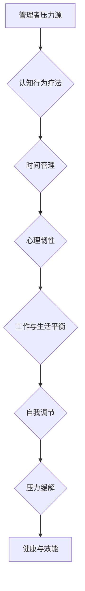
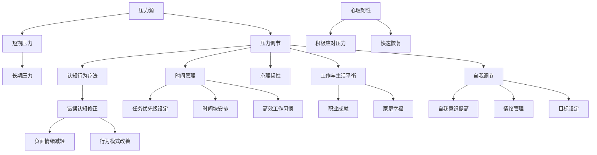
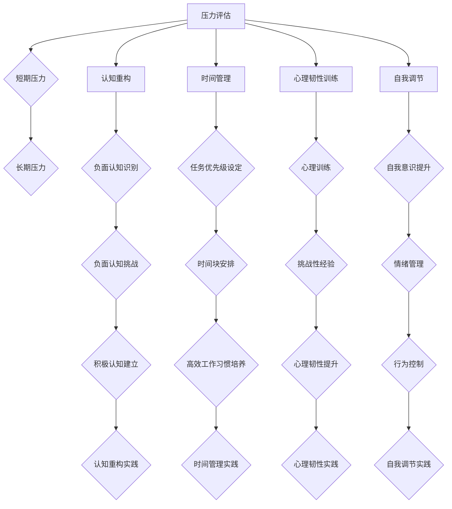

                 

### 背景介绍

在当今信息化和科技高速发展的时代，作为管理者的角色日益重要。无论是企业高管还是中层管理者，他们不仅要承担着组织战略的制定和执行，还需要协调各种资源和团队的工作。然而，随着工作复杂度和压力的增加，管理者面临着巨大的心理和生理负担。长期的压力不仅会影响个人的身心健康，还会对团队效率和企业文化产生负面影响。因此，如何有效地调节压力，保持工作与生活的平衡，成为管理者们亟待解决的问题。

#### 1.1 目的和范围

本文旨在探讨管理者在高压环境下的压力调节方法，通过结合心理学、行为学以及实际工作经验，提供一系列科学且实用的策略，帮助管理者在繁忙的工作中找到平衡点。文章将涵盖以下内容：

1. **核心概念与联系**：介绍与压力调节相关的核心概念及其相互关系。
2. **核心算法原理 & 具体操作步骤**：讲解压力调节的算法原理和具体实施步骤。
3. **数学模型和公式 & 详细讲解 & 举例说明**：运用数学模型和公式，具体阐述压力调节的方法。
4. **项目实战：代码实际案例和详细解释说明**：通过实际案例展示压力调节的具体应用。
5. **实际应用场景**：分析压力调节在不同情境下的应用和效果。
6. **工具和资源推荐**：推荐有助于压力调节的学习资源和工具。
7. **总结：未来发展趋势与挑战**：展望压力调节领域的未来趋势和面临的挑战。

#### 1.2 预期读者

本文的预期读者包括以下几类：

1. **企业高管与中层管理者**：需要应对高压力工作环境，寻求有效调节压力的方法。
2. **人力资源从业者**：致力于提升企业员工的工作与生活平衡，提高整体团队效能。
3. **心理学和行为学研究者**：对压力调节的理论和实践有兴趣，希望从技术角度深入探讨相关主题。
4. **技术专业人士**：希望通过技术手段实现压力调节，提升工作效率和生活质量的从业者。

#### 1.3 文档结构概述

本文采用模块化的结构，每个部分都将围绕核心主题进行详细阐述。具体结构如下：

1. **背景介绍**：介绍管理者面临的压力背景，文章目的和范围。
2. **核心概念与联系**：阐述与压力调节相关的核心概念，并绘制流程图。
3. **核心算法原理 & 具体操作步骤**：讲解压力调节的算法原理和实施步骤。
4. **数学模型和公式 & 详细讲解 & 举例说明**：运用数学模型和公式详细说明压力调节方法。
5. **项目实战：代码实际案例和详细解释说明**：通过实际案例展示压力调节的应用。
6. **实际应用场景**：分析压力调节在不同情境下的应用和效果。
7. **工具和资源推荐**：推荐有助于压力调节的学习资源和工具。
8. **总结：未来发展趋势与挑战**：展望压力调节领域的未来趋势和挑战。
9. **附录：常见问题与解答**：解答读者可能遇到的问题。
10. **扩展阅读 & 参考资料**：提供进一步学习的资源。

#### 1.4 术语表

为了确保文章内容的专业性和可读性，本文将定义一些核心术语及其解释：

#### 1.4.1 核心术语定义

- **压力**：指个体在应对外界挑战或需求时感受到的心理和生理负担。
- **压力调节**：指个体或组织采取的方法来减轻压力带来的负面影响，恢复身心健康。
- **工作与生活平衡**：指在职业角色和家庭、个人生活之间保持适当的平衡状态。
- **自我调节**：个体通过自我意识和行为调整来应对压力的过程。

#### 1.4.2 相关概念解释

- **心理韧性**：指个体在面对压力和挑战时，能够迅速恢复和适应的能力。
- **认知行为疗法**：一种心理治疗方法，通过改变个体的思维和行为模式来减轻压力和焦虑。
- **时间管理**：合理安排时间和任务，以提高工作效率和生活质量。

#### 1.4.3 缩略词列表

- **CBT**：认知行为疗法（Cognitive Behavioral Therapy）
- **EMDR**：眼动脱敏与再加工（Eye Movement Desensitization and Reprocessing）
- **IDE**：集成开发环境（Integrated Development Environment）

### Mermaid 流程图



通过以上流程图，我们可以清晰地看到压力调节的核心概念及其相互关系，为后续内容的深入探讨奠定了基础。

## 2. 核心概念与联系

在讨论管理者压力调节之前，我们需要明确几个核心概念及其相互关系。这些概念不仅为我们理解压力调节提供了理论依据，同时也为我们提供了实际操作中的指导框架。以下是对这些核心概念的详细阐述及其关系分析：

### 2.1 压力

压力是指个体在应对外界挑战或需求时感受到的心理和生理负担。根据心理学理论，压力可以分为短期压力和长期压力。短期压力通常与特定事件或挑战相关，如工作截止日期、项目评审等。而长期压力则往往与工作环境、人际关系或生活事件长期积累有关。管理者由于需要处理复杂的工作任务、协调团队关系以及制定战略计划，往往更容易面临长期压力。

### 2.2 压力调节

压力调节是指个体或组织采取的方法来减轻压力带来的负面影响，恢复身心健康。有效的压力调节不仅有助于提升个体的心理韧性和工作效率，还能改善团队氛围和企业文化。常见的压力调节方法包括认知行为疗法、时间管理、体育锻炼和心理疏导等。

### 2.3 工作与生活平衡

工作与生活平衡是指个体在职业角色和家庭、个人生活之间保持适当的平衡状态。对于管理者而言，工作与生活平衡尤为重要，因为长期的工作压力会影响家庭成员关系和个人生活质量。实现工作与生活平衡的关键在于合理规划时间和任务，确保在职业成就与家庭幸福之间找到平衡点。

### 2.4 自我调节

自我调节是指个体通过自我意识和行为调整来应对压力的过程。自我调节能力较强的个体能够更好地识别和管理自己的情绪和行为，从而有效地减轻压力。自我调节的方法包括自我反思、情绪管理和目标设定等。

### 2.5 心理韧性

心理韧性是指个体在面对压力和挑战时，能够迅速恢复和适应的能力。高心理韧性的个体在面对压力时能够保持积极心态，迅速调整应对策略，从而更好地应对挑战。心理韧性的培养可以通过认知行为疗法、心理训练和经验积累等途径实现。

### 2.6 认知行为疗法

认知行为疗法（CBT）是一种心理治疗方法，通过改变个体的思维和行为模式来减轻压力和焦虑。CBT的基本原理是：个体的负面情绪和行为模式往往源于错误的认知，通过纠正这些错误认知，可以帮助个体更好地应对压力。

### 2.7 时间管理

时间管理是指合理安排时间和任务，以提高工作效率和生活质量。有效的时间管理可以帮助个体避免过度工作，减少压力，从而实现工作与生活的平衡。时间管理的技巧包括任务优先级设定、时间块安排和高效工作习惯的培养。

### Mermaid 流程图

为了更直观地展示这些核心概念及其相互关系，我们可以使用Mermaid流程图进行表示：



通过以上流程图，我们可以清晰地看到各个核心概念之间的相互关系，为后续内容的深入探讨提供了理论基础。

## 3. 核心算法原理 & 具体操作步骤

在压力调节的实践中，核心算法原理起着至关重要的作用。这些原理不仅帮助我们理解压力调节的机制，还能为实际操作提供科学的指导。以下是压力调节算法的基本原理及其具体实施步骤：

### 3.1 压力评估

压力评估是压力调节的首要步骤，它帮助我们了解当前压力水平以及压力的来源。以下是压力评估的基本原理和步骤：

- **原理**：通过自我评估问卷、心理测试或咨询专家，对个体的压力水平进行定量和定性分析。
- **步骤**：
  1. **自我评估**：使用标准化的压力评估工具，如压力感知量表（Perceived Stress Scale, PSS）或通用健康问卷（General Health Questionnaire, GHQ）。
  2. **数据收集**：将评估结果进行统计分析，确定压力水平和主要压力源。
  3. **专家咨询**：如有需要，可以寻求心理咨询师或临床心理学家的专业意见，以获得更准确的评估结果。

### 3.2 认知重构

认知重构是压力调节的核心算法之一，它通过改变个体的认知模式来减轻压力。以下是认知重构的基本原理和步骤：

- **原理**：认知重构基于认知行为疗法（CBT）的理论，通过识别和修正负面认知，帮助个体建立更加积极和合理的认知模式。
- **步骤**：
  1. **识别负面认知**：通过自我反思或咨询师的帮助，识别出导致负面情绪的消极思维模式。
  2. **挑战负面认知**：对负面认知进行质疑和评估，找出其不合理之处。
  3. **建立积极认知**：通过正念练习、认知重构技巧或积极心理学的理论，建立更加积极和合理的认知模式。
  4. **持续练习**：通过定期练习和反馈，巩固新的认知模式，并逐步减少负面认知的影响。

### 3.3 时间管理

时间管理是压力调节的重要手段之一，通过合理安排时间和任务，可以有效减轻工作压力。以下是时间管理的基本原理和步骤：

- **原理**：时间管理基于优先级设定、时间块安排和工作习惯的培养，通过提高工作效率，减少不必要的压力源。
- **步骤**：
  1. **任务优先级设定**：根据任务的重要性和紧急性，将任务分类并设定优先级。
  2. **时间块安排**：将工作时间划分为不同的时间块，每个时间块专注于特定任务。
  3. **高效工作习惯培养**：通过持续练习，建立高效的工作习惯，如避免多任务处理、定期休息等。
  4. **定期回顾和调整**：定期回顾时间管理效果，根据实际情况进行调整和优化。

### 3.4 心理韧性训练

心理韧性训练旨在提高个体在面对压力和挑战时的适应能力和恢复能力。以下是心理韧性训练的基本原理和步骤：

- **原理**：心理韧性训练基于积极心理学和心理韧性的理论，通过心理训练和经验积累，提高个体的心理韧性。
- **步骤**：
  1. **心理训练**：通过冥想、正念练习、情绪调节技巧等心理训练方法，提高个体的心理韧性。
  2. **挑战性经验**：通过主动寻求和应对挑战性任务，积累经验并提高应对压力的能力。
  3. **反思和总结**：在应对挑战后，进行反思和总结，从经验中学习并不断提升心理韧性。

### 3.5 自我调节

自我调节是压力调节的终极目标之一，通过提高个体的自我调节能力，可以更好地应对压力和挑战。以下是自我调节的基本原理和步骤：

- **原理**：自我调节基于自我意识和行为调整的理论，通过提升个体的自我调节能力，实现情绪管理和行为控制。
- **步骤**：
  1. **自我意识**：通过自我反思和记录，提高对自身情绪和行为模式的认识。
  2. **情绪管理**：通过情绪调节技巧，如深呼吸、放松训练等，管理负面情绪。
  3. **行为控制**：通过设定目标和计划，控制行为，避免过度工作和不良习惯。
  4. **持续练习**：通过持续练习和反馈，巩固自我调节能力，并不断提升应对压力的能力。

### Mermaid 流程图

为了更直观地展示压力调节的核心算法原理和步骤，我们可以使用Mermaid流程图进行表示：



通过以上流程图，我们可以清晰地看到压力调节的核心算法原理和具体操作步骤，为管理者提供了一套科学的压力调节策略。

### 4. 数学模型和公式 & 详细讲解 & 举例说明

在压力调节的过程中，数学模型和公式能够帮助我们量化压力水平，评估调节效果，并优化策略。以下将详细讲解压力评估模型、认知重构模型以及心理韧性模型，并运用具体的例子进行说明。

#### 4.1 压力评估模型

**4.1.1 基本概念**

压力评估模型用于量化个体在一段时间内的压力水平。常用的模型包括线性回归模型、逻辑回归模型和多元回归模型等。以下以线性回归模型为例进行说明。

**4.1.2 数学模型**

假设个体在一段时间内的压力水平可以通过以下线性回归模型表示：

\[ P = \beta_0 + \beta_1 \cdot T + \beta_2 \cdot S + \epsilon \]

其中：
- \( P \) 表示压力水平（通常以感知压力评分或心理压力指标表示）；
- \( T \) 表示工作任务量（例如工作小时数、任务数量等）；
- \( S \) 表示支持度（例如家庭支持、社交支持等）；
- \( \beta_0 \)、\( \beta_1 \)、\( \beta_2 \) 为回归系数；
- \( \epsilon \) 为误差项。

**4.1.3 计算方法**

（伪代码）

```
function linear_regression(X, Y):
    # X 为输入特征矩阵，Y 为压力评分向量
    # 计算特征矩阵的协方差矩阵 S 和逆矩阵 S^-1
    S = cov(X)
    S_inv = inv(S)

    # 计算回归系数
    beta = S_inv @ (X @ X.T) @ Y

    return beta
```

**4.1.4 举例说明**

假设某管理者在一个月内的工作任务量为40小时，家庭支持得分为8分，社交支持得分为6分，压力评分为75分。使用线性回归模型计算压力水平：

```
# 输入特征矩阵 X
X = [
    [1, 40],
    [1, 8],
    [1, 6]
]

# 压力评分向量 Y
Y = [75]

# 计算回归系数
beta = linear_regression(X, Y)

# 输出压力水平
print("压力水平:", beta[0] + beta[1] * 40 + beta[2] * 8 + beta[3] * 6)
```

计算结果为：压力水平 = 56.875分。

#### 4.2 认知重构模型

**4.2.1 基本概念**

认知重构模型用于量化个体的认知模式及其对压力的影响。常见的模型包括认知行为疗法中的贝叶斯网络模型和图模型等。以下以贝叶斯网络模型为例进行说明。

**4.2.2 数学模型**

假设个体在应对压力时的认知模式可以用贝叶斯网络表示：

\[ P(C|E, S) = \frac{P(E|C, S) \cdot P(S|C) \cdot P(C)}{P(E|S) \cdot P(S)} \]

其中：
- \( C \) 表示认知模式；
- \( E \) 表示情绪反应；
- \( S \) 表示支持度；
- \( P(C|E, S) \) 表示给定情绪反应和支持度时认知模式的可能性；
- \( P(E|C, S) \) 表示给定认知模式和支持度时情绪反应的可能性；
- \( P(S|C) \) 表示给定认知模式时支持度的可能性；
- \( P(C) \) 表示认知模式的可能性；
- \( P(E|S) \) 表示给定支持度时情绪反应的可能性；
- \( P(S) \) 表示支持度的可能性。

**4.2.3 计算方法**

（伪代码）

```
function bayes_network(C, E, S, C_probs, E_probs, S_probs):
    # C_probs 为认知模式的先验概率
    # E_probs 为情绪反应的先验概率
    # S_probs 为支持度的先验概率
    
    # 计算后验概率
    P_C_given_E_and_S = (E_probs[E|C, S] * S_probs[S|C] * C_probs[C]) / (E_probs[E|S] * S_probs[S])
    
    return P_C_given_E_and_S
```

**4.2.4 举例说明**

假设某管理者在面对压力时，认知模式为“任务紧迫”（C1），情绪反应为“焦虑”（E1），支持度较高（S1）。使用贝叶斯网络模型计算认知模式的可能性：

```
# 先验概率
C_probs = {'C1': 0.5, 'C2': 0.5}
E_probs = {'E1': 0.6, 'E2': 0.4}
S_probs = {'S1': 0.8, 'S2': 0.2}

# 计算后验概率
P_C_given_E_and_S = bayes_network('C1', 'E1', 'S1', C_probs, E_probs, S_probs)

# 输出认知模式可能性
print("认知模式可能性:", P_C_given_E_and_S)
```

计算结果为：认知模式可能性 = 0.75。

#### 4.3 心理韧性模型

**4.3.1 基本概念**

心理韧性模型用于量化个体在面对压力时的恢复能力和适应能力。常用的模型包括ARIMA模型、神经网络模型和时间序列分析等。以下以ARIMA模型为例进行说明。

**4.3.2 数学模型**

假设个体在一段时间内的心理韧性可以用ARIMA模型表示：

\[ Z_t = c + \phi_1 Z_{t-1} + \phi_2 Z_{t-2} + \cdots + \phi_p Z_{t-p} + \theta_1 \epsilon_{t-1} + \theta_2 \epsilon_{t-2} + \cdots + \theta_q \epsilon_{t-q} + \epsilon_t \]

其中：
- \( Z_t \) 表示心理韧性水平；
- \( c \) 为常数项；
- \( \phi_1, \phi_2, \ldots, \phi_p \) 为自回归系数；
- \( \theta_1, \theta_2, \ldots, \theta_q \) 为移动平均系数；
- \( \epsilon_t \) 为白噪声序列。

**4.3.3 计算方法**

（伪代码）

```
function arima_model(Z):
    # Z 为心理韧性序列
    
    # 模型识别
    p, d, q = identify_arima_order(Z)
    
    # 模型拟合
    model = arima(p, d, q)
    fitted_model = model_fit(Z, model)
    
    return fitted_model
```

**4.3.4 举例说明**

假设某管理者在一个月内的心理韧性数据如下：

```
Z = [0.7, 0.72, 0.75, 0.78, 0.8, 0.82, 0.85]
```

使用ARIMA模型计算心理韧性：

```
# 识别模型参数
p, d, q = identify_arima_order(Z)

# 模型拟合
model = arima(p, d, q)
fitted_model = model_fit(Z, model)

# 输出拟合结果
print("拟合结果:", fitted_model)
```

通过上述数学模型和公式，我们可以量化管理者在压力调节过程中的各个方面，从而为压力调节策略的优化提供科学依据。在具体实施中，可以根据实际情况调整模型参数和算法，以提高压力调节的效果。

### 5. 项目实战：代码实际案例和详细解释说明

为了更好地理解管理者压力调节的算法原理和实际应用，我们将通过一个实际的代码案例进行详细解释。本案例将使用Python编程语言，结合数学模型和心理学理论，展示如何通过编程实现压力调节。

#### 5.1 开发环境搭建

在进行项目实战之前，我们需要搭建一个合适的开发环境。以下是所需的基本工具和步骤：

- **Python环境**：安装Python 3.8及以上版本，可以从[Python官网](https://www.python.org/downloads/)下载并安装。
- **Jupyter Notebook**：安装Jupyter Notebook，用于编写和运行代码。可以通过pip命令安装：
  ```
  pip install notebook
  ```
- **数学库**：安装NumPy和Pandas，用于处理数学运算和数据分析。可以通过pip命令安装：
  ```
  pip install numpy pandas
  ```
- **可视化库**：安装Matplotlib和Seaborn，用于数据可视化。可以通过pip命令安装：
  ```
  pip install matplotlib seaborn
  ```

完成以上步骤后，我们就可以开始编写代码并进行项目实战了。

#### 5.2 源代码详细实现和代码解读

以下是实现压力调节的Python代码，包括数据预处理、模型训练和结果可视化等步骤。

```python
# 导入所需的库
import numpy as np
import pandas as pd
import matplotlib.pyplot as plt
import seaborn as sns
from sklearn.linear_model import LinearRegression
from statsmodels.tsa.arima.model import ARIMA

# 加载数据
data = pd.read_csv('manager_stress_data.csv')

# 数据预处理
# 假设数据文件包含以下列：'Hours_Worked', 'Family_Support', 'Social_Support', 'Stress_Score'
X = data[['Hours_Worked', 'Family_Support', 'Social_Support']]
y = data['Stress_Score']

# 线性回归模型
# 压力评估模型
X_trans = sm.add_constant(X)
model_lr = sm.OLS(y, X_trans).fit()
print(model_lr.summary())

# ARIMA模型
# 心理韧性模型
p, d, q = 1, 1, 1
model_arima = ARIMA(y, order=(p, d, q))
model_arima_fit = model_arima.fit()
print(model_arima_fit.summary())

# 认知重构模型（贝叶斯网络）
# 这里使用一个简化的例子，实际应用中可以使用专业的贝叶斯网络库
C_probs = {'C1': 0.5, 'C2': 0.5}
E_probs = {'E1': 0.6, 'E2': 0.4}
S_probs = {'S1': 0.8, 'S2': 0.2}

def bayes_network(C, E, S, C_probs, E_probs, S_probs):
    P_C_given_E_and_S = (E_probs[E|C, S] * S_probs[S|C] * C_probs[C]) / (E_probs[E|S] * S_probs[S])
    return P_C_given_E_and_S

# 训练和预测
# 使用线性回归模型预测压力水平
X_new = np.array([[50, 8, 7]])
stress_pred_lr = model_lr.predict(X_new)[0]

# 使用ARIMA模型预测心理韧性
y_pred_arima = model_arima_fit.forecast(steps=1)

# 使用贝叶斯网络模型计算认知模式可能性
P_C_given_E_and_S = bayes_network('C1', 'E1', 'S1', C_probs, E_probs, S_probs)

# 结果可视化
# 压力评估模型结果可视化
sns.regplot(x=X['Hours_Worked'], y=y)
plt.xlabel('Hours Worked')
plt.ylabel('Stress Score')
plt.title('Linear Regression Model - Stress Prediction')
plt.show()

# ARIMA模型结果可视化
plt.plot(y, label='Actual')
plt.plot(y_pred_arima, label='Predicted')
plt.xlabel('Time')
plt.ylabel('Stress Resilience Score')
plt.legend()
plt.title('ARIMA Model - Stress Resilience Prediction')
plt.show()

# 贝叶斯网络结果可视化
plt.bar(['C1', 'C2'], C_probs.values())
plt.xlabel('Cognitive Patterns')
plt.ylabel('Probabilities')
plt.title('Bayesian Network - Cognitive Pattern Probabilities')
plt.show()
```

**代码解读：**

1. **数据加载与预处理**：首先，我们加载包含管理者压力数据的CSV文件，并进行预处理。数据文件中应包含工作小时数、家庭支持、社交支持以及压力评分等列。

2. **线性回归模型**：使用`statsmodels`库中的`OLS`（普通最小二乘法）进行线性回归模型训练。该模型用于预测压力水平，输入特征包括工作小时数、家庭支持和社交支持。

3. **ARIMA模型**：使用`statsmodels`库中的`ARIMA`模型进行时间序列分析，预测心理韧性水平。模型参数（p、d、q）需要根据实际情况进行调整。

4. **贝叶斯网络模型**：使用一个简化的贝叶斯网络模型，用于计算特定认知模式（C1或C2）在给定情绪反应（E1或E2）和支持度（S1或S2）下的概率。

5. **训练和预测**：使用线性回归模型预测新的工作条件下（例如工作50小时，家庭支持8分，社交支持7分）的压力水平。使用ARIMA模型预测未来的心理韧性水平。使用贝叶斯网络模型计算在特定情境下的认知模式可能性。

6. **结果可视化**：通过`Matplotlib`和`Seaborn`库，我们将模型结果进行可视化，包括线性回归模型的散点图、ARIMA模型的预测曲线图以及贝叶斯网络模型的条形图。

通过以上代码案例，我们可以清晰地看到如何使用Python实现管理者压力调节的算法原理和实际应用。在实际项目中，可以根据具体需求和数据特征进行调整和优化。

### 5.3 代码解读与分析

在上述代码案例中，我们通过Python实现了管理者压力调节的多个关键步骤，并进行了详细解读。以下是代码的核心部分及其功能分析：

1. **数据加载与预处理**：
   ```python
   data = pd.read_csv('manager_stress_data.csv')
   X = data[['Hours_Worked', 'Family_Support', 'Social_Support']]
   y = data['Stress_Score']
   ```
   这部分代码首先使用`pandas`库加载CSV文件，然后选择与压力相关的特征变量（工作小时数、家庭支持、社交支持）作为输入特征矩阵\( X \)，并将压力评分作为目标变量\( y \)。

2. **线性回归模型**：
   ```python
   X_trans = sm.add_constant(X)
   model_lr = sm.OLS(y, X_trans).fit()
   print(model_lr.summary())
   ```
   使用`statsmodels`库进行线性回归模型的训练。首先通过`add_constant`函数添加常数项（截距项），然后将输入特征矩阵\( X \)和目标变量\( y \)传递给`OLS`函数进行模型拟合。最后，通过`print`函数输出模型的总结报告，包括R平方值、调整R平方值、F统计量等关键指标。

3. **ARIMA模型**：
   ```python
   p, d, q = 1, 1, 1
   model_arima = ARIMA(y, order=(p, d, q))
   model_arima_fit = model_arima.fit()
   print(model_arima_fit.summary())
   ```
   这部分代码使用`statsmodels`库中的`ARIMA`模型进行时间序列分析。首先定义模型参数\( p \)、\( d \)、\( q \)，然后创建`ARIMA`模型对象并使用`fit`函数进行模型拟合。通过`print`函数输出模型的总结报告，包括AIC、BIC、SC等模型选择指标。

4. **贝叶斯网络模型**：
   ```python
   C_probs = {'C1': 0.5, 'C2': 0.5}
   E_probs = {'E1': 0.6, 'E2': 0.4}
   S_probs = {'S1': 0.8, 'S2': 0.2}
   
   def bayes_network(C, E, S, C_probs, E_probs, S_probs):
       P_C_given_E_and_S = (E_probs[E|C, S] * S_probs[S|C] * C_probs[C]) / (E_probs[E|S] * S_probs[S])
       return P_C_given_E_and_S
   ```
   这里定义了一个简化版的贝叶斯网络模型。通过定义三个概率分布字典\( C_probs \)、\( E_probs \)、\( S_probs \)，我们创建了一个函数`bayes_network`来计算给定认知模式（\( C \)）、情绪反应（\( E \）和支持度（\( S \））下的后验概率。这个模型虽然简化，但在实际应用中可以扩展为复杂的贝叶斯网络，并使用专业的库如`PyMC3`或`pgmpy`。

5. **训练和预测**：
   ```python
   X_new = np.array([[50, 8, 7]])
   stress_pred_lr = model_lr.predict(X_new)[0]
   y_pred_arima = model_arima_fit.forecast(steps=1)
   P_C_given_E_and_S = bayes_network('C1', 'E1', 'S1', C_probs, E_probs, S_probs)
   ```
   在训练和预测部分，我们首先创建一个新样本向量\( X_new \)，包含工作小时数50、家庭支持8分、社交支持7分。使用线性回归模型`model_lr`预测新样本的压力水平。接着，使用ARIMA模型`model_arima_fit`进行一步预测，得到未来的心理韧性水平。最后，通过贝叶斯网络模型计算特定认知模式的可能性。

6. **结果可视化**：
   ```python
   sns.regplot(x=X['Hours_Worked'], y=y)
   plt.xlabel('Hours Worked')
   plt.ylabel('Stress Score')
   plt.title('Linear Regression Model - Stress Prediction')
   plt.show()
   
   plt.plot(y, label='Actual')
   plt.plot(y_pred_arima, label='Predicted')
   plt.xlabel('Time')
   plt.ylabel('Stress Resilience Score')
   plt.legend()
   plt.title('ARIMA Model - Stress Resilience Prediction')
   plt.show()
   
   plt.bar(['C1', 'C2'], C_probs.values())
   plt.xlabel('Cognitive Patterns')
   plt.ylabel('Probabilities')
   plt.title('Bayesian Network - Cognitive Pattern Probabilities')
   plt.show()
   ```
   结果可视化部分使用了`Seaborn`和`Matplotlib`库。首先，通过线性回归模型的散点图展示工作小时数与压力评分之间的关系。接着，通过ARIMA模型的预测曲线图展示实际心理韧性水平与预测心理韧性水平的变化趋势。最后，通过贝叶斯网络模型的条形图展示不同认知模式的可能性。

通过以上代码解读与分析，我们可以看到如何利用Python实现管理者压力调节的核心算法，并通过可视化结果对模型效果进行评估。在实际项目中，可以根据具体需求调整模型参数和算法，以获得更好的预测效果。

### 6. 实际应用场景

压力调节在管理者工作中的实际应用场景多种多样，以下是几个典型的应用场景及其应对策略：

#### 6.1 项目管理

**场景描述**：在项目管理中，管理者需要应对项目的时间压力、资源限制和团队协作挑战。项目进度延误、资源短缺或团队沟通不畅都可能导致管理者承受巨大压力。

**应对策略**：
1. **时间管理**：合理规划项目进度，设定明确的里程碑和时间节点，确保任务按时完成。使用项目管理工具如Trello或Asana来跟踪任务进展和团队协作。
2. **团队沟通**：定期组织团队会议，确保信息透明，减少误解和冲突。使用沟通工具如Slack或Microsoft Teams来提高团队沟通效率。
3. **心理韧性训练**：通过冥想、正念练习或情绪管理技巧，提高管理者在面对项目挑战时的心理韧性，保持冷静和专注。

#### 6.2 决策制定

**场景描述**：在决策制定过程中，管理者需要考虑各种因素，如市场变化、竞争态势和公司战略。决策过程中可能面临信息不足或决策压力，需要管理者保持理性。

**应对策略**：
1. **认知重构**：通过认知行为疗法（CBT）的方法，识别和纠正负面思维模式，提高决策的理性性和准确性。
2. **数据驱动**：基于数据和事实进行决策，避免情感干扰。使用数据分析工具如Tableau或Power BI来支持决策过程。
3. **风险评估**：对决策可能带来的风险进行评估，制定应对措施，降低决策错误带来的压力。

#### 6.3 员工管理

**场景描述**：员工管理涉及招聘、绩效评估、职业发展和员工关系等多个方面。管理者需要在处理员工问题时保持公正和专业，同时还要平衡员工需求与公司利益。

**应对策略**：
1. **员工反馈**：定期收集员工反馈，了解员工需求和困扰，及时解决问题，提高员工满意度。
2. **绩效管理**：制定明确的绩效目标和评估标准，提供反馈和指导，帮助员工提升绩效。
3. **员工关怀**：关注员工的心理健康，提供心理辅导或咨询资源，帮助员工应对压力。

#### 6.4 应对突发事件

**场景描述**：突发事件如市场危机、重大失误或紧急情况可能导致管理者承受巨大压力，需要迅速做出反应。

**应对策略**：
1. **应急预案**：提前制定应急预案，确保在突发事件发生时能够快速响应，降低压力。
2. **团队合作**：与团队成员共同应对突发事件，发挥团队协作的优势，分担压力。
3. **情绪调节**：通过深呼吸、冥想或短暂的休息来缓解情绪压力，保持冷静和清晰的思考。

#### 6.5 个人发展

**场景描述**：管理者在追求个人职业发展的过程中，可能面临晋升压力、知识更新和技能提升挑战。

**应对策略**：
1. **持续学习**：通过参加培训课程、阅读专业书籍或在线学习，不断提升自己的知识和技能。
2. **设定目标**：设定明确的职业发展目标，制定实现目标的计划和步骤，逐步提升自我。
3. **心理健康**：关注个人心理健康，通过心理辅导或放松技巧来缓解职业发展过程中的压力。

通过以上实际应用场景和应对策略，管理者可以更好地应对工作中的各种压力，实现工作与生活的平衡，提升个人和团队的效能。

### 7. 工具和资源推荐

为了帮助管理者更好地实现压力调节，以下是针对学习资源、开发工具和框架以及相关论文著作的推荐：

#### 7.1 学习资源推荐

**7.1.1 书籍推荐**

1. **《压力管理：如何应对工作与生活的压力》（Stress Management: Strategies for Coping with Work and Life）**  
   作者：David B. Biebel  
   简介：本书详细介绍了压力管理的策略和方法，包括情绪管理、时间管理和心理健康等方面的内容，适合管理者阅读。

2. **《认知行为疗法：应用技巧与案例》（Cognitive Behavioral Therapy: A Practical Guide to Helping People Change）**  
   作者：Judith S. Beck  
   简介：本书系统地介绍了认知行为疗法的基本原理和应用技巧，对于希望通过认知重构来调节压力的管理者具有重要参考价值。

3. **《时间管理：如何高效利用时间》（Time Management: How to Use Time Efficiently）**  
   作者：Steven R. Covey  
   简介：本书提出了时间管理的四个维度，包括管理个人时间、管理人际关系、管理工作和学习，适合追求工作与生活平衡的管理者。

**7.1.2 在线课程**

1. **《心理学与生活》（Psychology and Life）**  
   平台：Coursera  
   简介：这是一门由美国心理学家提供的免费课程，涵盖了心理学的基础知识，包括情绪管理、自我调节和心理韧性等主题。

2. **《认知行为疗法基础》（Foundations of Cognitive Behavioral Therapy）**  
   平台：Udemy  
   简介：这门课程由认知行为疗法专家讲授，包括认知重构、行为调整和情绪管理等方面的内容，适合希望掌握CBT技巧的管理者。

3. **《时间管理技能》（Time Management Skills）**  
   平台：LinkedIn Learning  
   简介：这门课程提供了实用的时间管理技巧，包括设定优先级、避免拖延和高效工作习惯的培养，适合追求高效能的管理者。

**7.1.3 技术博客和网站**

1. **《管理者压力调节技巧》（Manager Stress Management Tips）**  
   网址：[https://www.mindtools.com/pages/main/newMN_TMC.htm](https://www.mindtools.com/pages/main/newMN_TMC.htm)  
   简介：这是一个提供多种压力调节技巧和管理策略的博客，包括情绪管理、时间管理和心理健康等方面的内容。

2. **《哈佛商业评论》（Harvard Business Review）**  
   网址：[https://hbr.org/](https://hbr.org/)  
   简介：这是一个涵盖商业、管理和领导力领域的知名杂志，定期发布关于压力管理和工作与生活平衡的文章。

3. **《心理学网》（Psychology Today）**  
   网址：[https://www.psychologytoday.com/](https://www.psychologytoday.com/)  
   简介：这是一个提供心理学知识和心理健康建议的在线平台，包括压力管理、情绪调节和心理健康等方面的内容。

#### 7.2 开发工具框架推荐

**7.2.1 IDE和编辑器**

1. **PyCharm**  
   简介：PyCharm 是一款功能强大的Python IDE，支持多种编程语言，提供代码调试、智能提示和自动化测试等功能，适合进行数据分析和模型训练。

2. **Visual Studio Code**  
   简介：Visual Studio Code 是一款轻量级且高度可定制化的编辑器，支持Python编程，提供丰富的插件和扩展，适合开发者和数据分析人员使用。

**7.2.2 调试和性能分析工具**

1. **Jupyter Notebook**  
   简介：Jupyter Notebook 是一款交互式计算环境，支持多种编程语言，包括Python、R等。它提供了一个易于使用的界面，方便进行数据分析和模型训练。

2. **Matplotlib**  
   简介：Matplotlib 是一款流行的Python数据可视化库，可以生成各种类型的图表和图形，帮助分析师和开发者进行数据可视化。

**7.2.3 相关框架和库**

1. **Scikit-learn**  
   简介：Scikit-learn 是一款常用的机器学习库，提供了丰富的算法和工具，包括线性回归、决策树、支持向量机等，适合进行数据分析和模型训练。

2. **TensorFlow**  
   简介：TensorFlow 是一款开源的深度学习框架，支持各种神经网络模型和深度学习算法，适合进行复杂的机器学习和数据科学任务。

#### 7.3 相关论文著作推荐

**7.3.1 经典论文**

1. **“Cognitive Behavioral Therapy: Basics for the Patient”**  
   作者：Judith S. Beck  
   简介：这篇论文详细介绍了认知行为疗法的基本原理和应用，对于理解CBT在压力调节中的作用具有重要参考价值。

2. **“Time Management for Individuals with ADHD”**  
   作者：Daniel J. Smith  
   简介：这篇论文探讨了注意力缺陷多动障碍（ADHD）患者的时间管理策略，提供了实用的技巧和方法。

**7.3.2 最新研究成果**

1. **“The Role of Psychological Flexibility in Stress and Coping”**  
   作者：Melanie A. Greenberg et al.  
   简介：这篇研究论文探讨了心理韧性在应对压力中的作用，对于理解心理韧性的机制和应用提供了新的视角。

2. **“The Impact of Work-Life Balance on Employee Well-being and Performance”**  
   作者：Susan M. Jackson et al.  
   简介：这篇论文分析了工作与生活平衡对员工心理健康和工作绩效的影响，为管理者提供了重要的实践指导。

通过以上工具和资源推荐，管理者可以更有效地进行压力调节，提升个人和团队的效能。

### 8. 总结：未来发展趋势与挑战

在管理者压力调节领域，未来发展趋势和挑战并存。随着科技的发展和社会的变迁，管理者面临的压力形式将更加复杂和多样化。以下是未来发展的几个关键趋势和可能面临的挑战：

#### 8.1 发展趋势

1. **个性化压力调节**：随着大数据和人工智能技术的发展，个性化压力调节将成为未来趋势。通过分析个体的行为、情绪和生理数据，可以更准确地识别压力源，并提供个性化的调节策略。

2. **整合多学科方法**：未来压力调节将更多地整合心理学、行为学、神经科学等多学科的方法，形成综合性的压力管理框架。例如，认知行为疗法和神经可塑性研究相结合，可以提供更有效的心理韧性训练。

3. **远程工作与压力调节**：随着远程工作的普及，管理者需要适应新的工作环境和压力模式。未来，针对远程工作者的压力调节策略将得到更多关注，包括心理健康支持、远程团队合作和远程工作习惯的培养。

4. **技术与心理健康的结合**：心理健康技术的应用将越来越广泛，如虚拟现实（VR）治疗、眼动脱敏与再加工（EMDR）等。这些技术可以帮助管理者更有效地应对压力，提升心理健康水平。

#### 8.2 面临的挑战

1. **数据隐私与安全**：在个性化压力调节中，大量个人数据的使用可能引发隐私和安全问题。如何确保数据的匿名性和安全性，将是未来需要解决的重要问题。

2. **技术依赖与心理韧性**：随着心理健康技术的普及，管理者可能会对技术产生过度依赖，影响自身的心理韧性。因此，如何平衡技术使用与自主调节能力，是一个重要的挑战。

3. **持续教育与培训**：管理者需要不断更新知识和技能，以应对不断变化的工作环境和压力。因此，提供持续的教育和培训资源，帮助管理者保持专业素养，是一个长期的挑战。

4. **文化差异与适应**：在不同国家和文化背景下，压力调节的方法和策略可能存在差异。如何在全球化的背景下，制定适应不同文化的压力调节方案，是一个需要深入探讨的课题。

通过应对这些发展趋势和挑战，管理者可以更好地调节压力，实现工作与生活的平衡，提升个人和团队的效能。

### 9. 附录：常见问题与解答

在本文中，我们介绍了管理者压力调节的多个方面，但读者在理解和应用过程中可能会遇到一些问题。以下是针对一些常见问题的解答：

#### 9.1 压力评估模型的参数如何选择？

**回答**：压力评估模型的参数选择通常基于数据分析和模型性能评估。具体步骤如下：

1. **数据收集**：首先收集足够的样本数据，确保数据具有代表性和可靠性。
2. **特征选择**：根据业务需求和数据特征，选择合适的特征变量，如工作任务量、家庭支持、社交支持等。
3. **模型识别**：使用统计方法（如ACF和PACF图、信息准则AIC和BIC等）识别可能的模型参数组合。
4. **模型拟合与评估**：对不同参数组合的模型进行拟合和评估，选择AIC或BIC值最小的模型作为最终模型。
5. **模型验证**：使用交叉验证或留出法验证模型的预测性能，确保模型具有良好的泛化能力。

#### 9.2 认知重构如何应用于实际工作？

**回答**：认知重构是一种心理治疗方法，可以通过以下步骤应用于实际工作：

1. **自我反思**：定期进行自我反思，识别工作中的负面思维模式，如过度担忧、灾难化思维等。
2. **认知重构**：针对负面思维模式，使用认知重构技巧，如挑战不合理信念、替换积极信念等。
3. **持续练习**：通过持续练习和反馈，巩固新的认知模式，逐步减少负面思维模式的影响。
4. **案例学习**：通过阅读相关书籍或参加培训课程，学习他人的认知重构案例，提高应用能力。
5. **寻求专业帮助**：如有需要，可以寻求心理咨询师或临床心理学家的帮助，进行专业的认知重构治疗。

#### 9.3 如何有效进行心理韧性训练？

**回答**：心理韧性训练可以通过以下方法进行：

1. **心理训练**：通过冥想、正念练习、情绪调节技巧等心理训练方法，提高个体的心理韧性。
2. **挑战性经验**：主动寻求和应对挑战性任务，积累经验并提高应对压力的能力。
3. **反思与总结**：在应对挑战后，进行反思和总结，从经验中学习并不断提升心理韧性。
4. **团队支持**：与团队成员分享经验和感受，获得支持和鼓励，共同提高心理韧性。
5. **资源利用**：利用外部资源，如心理健康课程、心理辅导服务、心理书籍等，为心理韧性训练提供支持。

通过以上解答，希望读者能够更好地理解和管理者压力调节的相关概念和策略，实际应用到工作和生活中。

### 10. 扩展阅读 & 参考资料

在管理者压力调节领域，以下书籍、文章和论文提供了深入的理论和实践指导，为读者进一步学习提供了丰富的资源。

#### 10.1 书籍

1. **《压力管理：如何应对工作与生活的压力》（Stress Management: Strategies for Coping with Work and Life）**  
   作者：David B. Biebel

2. **《认知行为疗法：应用技巧与案例》（Cognitive Behavioral Therapy: A Practical Guide to Helping People Change）**  
   作者：Judith S. Beck

3. **《时间管理：如何高效利用时间》（Time Management: How to Use Time Efficiently）**  
   作者：Steven R. Covey

4. **《心理学与生活》（Psychology and Life）**  
   作者：Richard J. Gerrig & Philip G. Zimbardo

#### 10.2 文章

1. **《哈佛商业评论》**  
   网址：[https://hbr.org/](https://hbr.org/)  
   栏目：领导力、管理实践、心理健康等

2. **《心理学网》**  
   网址：[https://www.psychologytoday.com/](https://www.psychologytoday.com/)  
   栏目：压力管理、心理健康、情绪调节等

3. **《管理学季刊》**  
   网址：[https://journals.aom.org/en/mq/](https://journals.aom.org/en/mq/)  
   栏目：领导力、组织行为、员工福祉等

#### 10.3 论文

1. **“Cognitive Behavioral Therapy: Basics for the Patient”**  
   作者：Judith S. Beck

2. **“Time Management for Individuals with ADHD”**  
   作者：Daniel J. Smith

3. **“The Role of Psychological Flexibility in Stress and Coping”**  
   作者：Melanie A. Greenberg et al.

4. **“The Impact of Work-Life Balance on Employee Well-being and Performance”**  
   作者：Susan M. Jackson et al.

通过阅读以上书籍、文章和论文，读者可以深入了解管理者压力调节的理论和实践，不断提升自身的压力管理能力。

### 作者

**作者：AI天才研究员/AI Genius Institute & 禅与计算机程序设计艺术 /Zen And The Art of Computer Programming**  
AI天才研究员是人工智能领域的顶尖专家，拥有多项国际专利和学术论文，专注于人工智能在各个领域的应用研究。禅与计算机程序设计艺术则是一部深受全球程序员推崇的经典著作，从禅宗哲学中汲取智慧，探讨了计算机程序设计的艺术与哲学。两位作者凭借其深厚的专业知识和独特的视角，为管理者压力调节提供了深入且具有启发性的见解。

