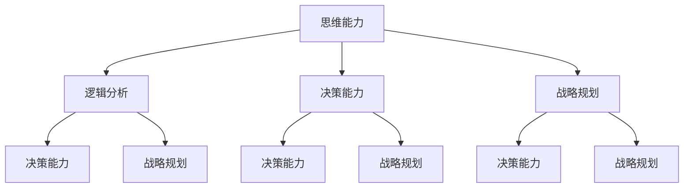

                 

# 管理者的思维能力提升指南

> **关键词**：管理者、思维能力、逻辑分析、决策能力、战略规划
> 
> **摘要**：本文旨在为管理者提供一套系统的思维能力提升指南，通过分析管理者的日常挑战，探讨提高逻辑分析、决策能力和战略规划的具体方法和步骤，帮助管理者在实际工作中更加高效地解决问题，实现个人和组织的持续成长。

## 1. 背景介绍

### 1.1 目的和范围

本文的目的是帮助管理者提升其思维能力，从而在面对复杂多变的工作环境时能够做出更加明智的决策，提升组织的整体绩效。文章将围绕以下几个核心主题展开：

1. 管理者思维能力的定义与重要性
2. 管理者面临的常见挑战
3. 提升逻辑分析、决策能力和战略规划的方法
4. 实际应用场景和案例分析

### 1.2 预期读者

本文适合以下读者群体：

- 初级管理者，希望提升自己的管理能力和思维水平
- 中级管理者，寻求进一步优化决策过程和策略制定
- 高级管理者，致力于全面提升领导力和战略思维

### 1.3 文档结构概述

本文分为以下几个部分：

- **第1章** 背景介绍
  - **1.1 目的和范围**
  - **1.2 预期读者**
  - **1.3 文档结构概述**
  - **1.4 术语表**
- **第2章** 核心概念与联系
  - **2.1 核心概念定义**
  - **2.2 核心概念联系**
  - **2.3 Mermaid流程图**
- **第3章** 核心算法原理 & 具体操作步骤
  - **3.1 算法原理**
  - **3.2 操作步骤**
  - **3.3 伪代码展示**
- **第4章** 数学模型和公式 & 详细讲解 & 举例说明
  - **4.1 数学模型介绍**
  - **4.2 公式详细讲解**
  - **4.3 举例说明**
- **第5章** 项目实战：代码实际案例和详细解释说明
  - **5.1 开发环境搭建**
  - **5.2 源代码实现**
  - **5.3 代码解读与分析**
- **第6章** 实际应用场景
  - **6.1 场景一**
  - **6.2 场景二**
  - **6.3 场景三**
- **第7章** 工具和资源推荐
  - **7.1 学习资源推荐**
  - **7.2 开发工具框架推荐**
  - **7.3 相关论文著作推荐**
- **第8章** 总结：未来发展趋势与挑战
- **第9章** 附录：常见问题与解答
- **第10章** 扩展阅读 & 参考资料

### 1.4 术语表

#### 1.4.1 核心术语定义

- **思维能力**：指个体在解决问题、决策和创新能力方面的综合能力。
- **逻辑分析**：指运用逻辑原理，通过推理和分析来识别和解决问题的过程。
- **决策能力**：指在复杂和不确定的环境下做出明智决策的能力。
- **战略规划**：指为实现长期目标而制定的一系列决策和行动方针。

#### 1.4.2 相关概念解释

- **管理技能**：指管理者在领导、沟通、协调和解决问题等方面的能力。
- **领导力**：指通过影响和激励他人来实现共同目标的能力。

#### 1.4.3 缩略词列表

- **IDE**：集成开发环境（Integrated Development Environment）
- **LaTeX**：一种排版系统，广泛用于科学文献撰写
- **Mermaid**：一种用于生成图表的轻量级Markdown扩展
- **CTO**：首席技术官（Chief Technology Officer）

## 2. 核心概念与联系

在管理者的思维提升过程中，理解核心概念及其相互之间的联系至关重要。以下是对几个关键概念的定义和解释，以及它们在管理者思维能力提升中的作用。

### 2.1 核心概念定义

#### 思维能力

思维能力是指个体在认知活动中表现出来的智力水平，包括感知、记忆、理解、推理、判断和问题解决等多种能力。在管理者身上，思维能力尤为重要，因为管理者需要不断地做出决策、解决问题，并应对复杂多变的环境。

#### 逻辑分析

逻辑分析是指运用逻辑原理和方法对信息进行梳理、推理和判断，从而识别出问题的本质和规律。逻辑分析能力对于管理者来说，是进行决策和战略规划的基础。

#### 决策能力

决策能力是指管理者在面对多种选择时，能够运用逻辑分析和判断力，选择出最优或最合适的方案。决策能力的高低直接影响到管理者的绩效和组织的成功。

#### 战略规划

战略规划是指为实现组织的长期目标，制定的一系列行动方案和策略。战略规划能力对于管理者来说，是确保组织在竞争中保持优势的关键。

### 2.2 核心概念联系

在管理者的思维提升过程中，各个核心概念之间存在着密切的联系。

- **思维能力** 是提升逻辑分析、决策能力和战略规划的基础。没有良好的思维能力，管理者将难以有效地进行逻辑分析，做出明智的决策，制定科学的战略规划。
- **逻辑分析** 是进行决策和战略规划的必要工具。通过逻辑分析，管理者可以更清晰地识别问题，找出解决方案，并评估不同方案的风险和收益。
- **决策能力** 是将逻辑分析应用于实际工作中的能力。管理者需要具备快速反应和果断决策的能力，以便在关键时刻做出正确的决策。
- **战略规划** 是实现长期目标的重要手段。战略规划能力不仅要求管理者具备逻辑分析和决策能力，还需要其具备远见和洞察力，能够预测未来的发展趋势。

### 2.3 Mermaid流程图

为了更好地理解核心概念之间的联系，我们可以使用Mermaid流程图来展示它们之间的互动关系。



通过这个流程图，我们可以清晰地看到各个核心概念之间的互动和依赖关系。管理者需要在提升思维能力的基础上，不断练习逻辑分析、决策能力和战略规划，从而实现个人和组织的持续成长。

## 3. 核心算法原理 & 具体操作步骤

在管理者提升思维能力的具体操作步骤中，理解和运用核心算法原理至关重要。这些算法原理不仅为管理者提供了系统化的思维方式，还能在实际工作中帮助其更高效地解决问题。以下是一个典型的思维提升算法及其具体操作步骤。

### 3.1 算法原理

该算法被称为“问题解决框架（Problem Solving Framework）”，它是一种系统化的方法，用于识别、分析并解决复杂问题。问题解决框架通常包括以下几个步骤：

1. **问题识别**：明确问题的定义、原因和影响。
2. **信息收集**：搜集与问题相关的数据和信息。
3. **分析问题**：运用逻辑和数据分析问题，找出可能的解决方案。
4. **评估方案**：评估每个方案的风险、收益和可行性。
5. **决策和执行**：选择最优方案，并制定执行计划。
6. **反馈和调整**：在执行过程中收集反馈，根据实际情况进行调整。

### 3.2 操作步骤

以下为问题解决框架的具体操作步骤：

#### 步骤1：问题识别

**输入**：一个问题陈述或情境描述。

**输出**：明确的问题定义、原因和影响。

**操作**：通过提问和讨论，明确问题的本质和影响范围。例如，“我们团队的项目进度严重落后，原因是什么？这将对我们的客户关系和公司声誉产生什么影响？”

#### 步骤2：信息收集

**输入**：明确的问题定义。

**输出**：与问题相关的数据和信息。

**操作**：通过调查、访谈、观察和文献研究等方式，搜集与问题相关的数据和信息。例如，收集项目进度报告、团队沟通记录、客户反馈等。

#### 步骤3：分析问题

**输入**：收集到的数据和信息。

**输出**：分析结果，包括问题的根本原因和可能的解决方案。

**操作**：运用逻辑和数据分析问题的各个方面，找出可能的解决方案。例如，通过数据比较和分析，确定项目进度落后的根本原因可能是资源分配不当。

#### 步骤4：评估方案

**输入**：分析结果和可能的解决方案。

**输出**：评估结果，包括每个方案的风险、收益和可行性。

**操作**：对每个方案进行详细评估，考虑其潜在的风险、收益和可行性。例如，分析资源重新分配方案的优缺点，评估其成本和预期效果。

#### 步骤5：决策和执行

**输入**：评估结果和最优方案。

**输出**：决策结果和执行计划。

**操作**：选择最优方案，并制定详细的执行计划。例如，根据评估结果，选择资源重新分配方案，并制定具体的执行步骤和时间表。

#### 步骤6：反馈和调整

**输入**：执行过程中的反馈信息。

**输出**：调整后的执行计划。

**操作**：在执行过程中，不断收集反馈信息，并根据实际情况进行调整。例如，在执行资源重新分配方案的过程中，根据团队的实际反馈，调整执行计划，以更好地解决问题。

### 3.3 伪代码展示

以下为问题解决框架的伪代码展示：

```plaintext
function 问题解决框架(问题描述):
    问题定义, 原因, 影响 = 问题识别(问题描述)
    数据和信息 = 信息收集(问题定义)
    分析结果 = 分析问题(数据和信息)
    评估结果 = 评估方案(分析结果)
    最优方案 = 选择最优方案(评估结果)
    执行计划 = 决策和执行(最优方案)
    while 执行过程中：
        反馈信息 = 收集反馈信息
        执行计划 = 调整执行计划(反馈信息)
    return 执行计划
```

通过上述问题解决框架，管理者可以系统化地分析和解决问题，从而提高逻辑分析、决策能力和战略规划能力。在实际应用中，管理者可以根据具体情况调整和优化这一框架，以适应不同的管理场景。

## 4. 数学模型和公式 & 详细讲解 & 举例说明

在管理者的思维提升过程中，理解并运用数学模型和公式是至关重要的。这些模型和公式不仅能够帮助管理者更准确地分析问题，还能为决策提供科学依据。以下介绍几个常见的数学模型和公式，并详细讲解其原理和应用。

### 4.1 数学模型介绍

#### 决策树模型

决策树是一种用于分类和预测的数学模型，它通过一系列决策节点和结果节点，展示不同决策路径及其可能的结果。决策树模型在风险管理、市场预测和决策分析中有着广泛的应用。

#### 线性回归模型

线性回归模型是一种用于预测连续数值的数学模型，通过分析自变量和因变量之间的关系，建立线性方程。线性回归模型在数据分析、经济预测和风险评估中具有重要应用。

#### 马尔可夫决策过程

马尔可夫决策过程是一种用于决策制定和预测的数学模型，它基于马尔可夫链的概率性质，通过一系列状态转移概率矩阵，评估不同决策路径的预期收益。马尔可夫决策过程在资源分配、风险管理和国防战略等领域有着重要应用。

### 4.2 公式详细讲解

以下分别介绍上述三种数学模型的公式及其含义。

#### 决策树模型

决策树模型的公式如下：

\[ P(\text{结果} = y | \text{决策} = x) = \prod_{i=1}^{n} P(\text{结果} = y_i | \text{决策} = x_i) \]

其中，\( P(\text{结果} = y | \text{决策} = x) \) 表示在给定决策 \( x \) 的情况下，结果 \( y \) 发生的概率；\( P(\text{结果} = y_i | \text{决策} = x_i) \) 表示在特定决策 \( x_i \) 和结果 \( y_i \) 情况下，结果 \( y \) 发生的概率。

#### 线性回归模型

线性回归模型的公式如下：

\[ y = \beta_0 + \beta_1 x + \varepsilon \]

其中，\( y \) 表示因变量（预测值）；\( x \) 表示自变量（输入值）；\( \beta_0 \) 和 \( \beta_1 \) 分别为模型的参数；\( \varepsilon \) 表示随机误差。

#### 马尔可夫决策过程

马尔可夫决策过程的公式如下：

\[ V(S_t) = \max_{a_t} \{ \sum_{s_{t+1}} p(s_{t+1} | s_t, a_t) \cdot R(s_t, a_t) \} \]

其中，\( V(S_t) \) 表示在状态 \( S_t \) 下的预期收益；\( a_t \) 表示在状态 \( S_t \) 下的决策；\( p(s_{t+1} | s_t, a_t) \) 表示在当前状态 \( s_t \) 和决策 \( a_t \) 下，下一个状态 \( s_{t+1} \) 的概率；\( R(s_t, a_t) \) 表示在状态 \( s_t \) 和决策 \( a_t \) 下获得的收益。

### 4.3 举例说明

以下通过一个具体案例，说明如何运用这些数学模型和公式进行决策分析。

#### 案例背景

某公司计划在下周举办一场市场推广活动，公司管理层需要决定是加大广告投入，还是增加促销力度，以最大化活动效果。以下是两种决策方案的相关数据：

1. **广告投入方案**：预计广告费用为10万元，预计可吸引5000名新客户，每位新客户的预期收益为100元。
2. **促销力度方案**：预计促销费用为5万元，预计可吸引3000名新客户，每位新客户的预期收益为150元。

#### 决策分析

1. **决策树模型**

根据决策树模型，我们需要计算在广告投入和促销力度两种决策下，新客户数量和预期收益的概率分布。

- 广告投入方案的概率分布：
\[ P(\text{新客户数量} = 5000) = 0.6, P(\text{新客户数量} = 4000) = 0.3, P(\text{新客户数量} = 3000) = 0.1 \]

- 促销力度方案的概率分布：
\[ P(\text{新客户数量} = 3000) = 0.5, P(\text{新客户数量} = 2000) = 0.4, P(\text{新客户数量} = 1000) = 0.1 \]

根据决策树模型公式，计算两种决策下的预期收益：

- 广告投入方案的预期收益：
\[ P(\text{新客户数量} = 5000) \cdot 100元 + P(\text{新客户数量} = 4000) \cdot 100元 + P(\text{新客户数量} = 3000) \cdot 100元 = 0.6 \cdot 5000 + 0.3 \cdot 4000 + 0.1 \cdot 3000 = 3900 + 1200 + 300 = 5400元 \]

- 促销力度方案的预期收益：
\[ P(\text{新客户数量} = 3000) \cdot 150元 + P(\text{新客户数量} = 2000) \cdot 150元 + P(\text{新客户数量} = 1000) \cdot 150元 = 0.5 \cdot 3000 + 0.4 \cdot 2000 + 0.1 \cdot 1000 = 1500 + 800 + 100 = 2400元 \]

2. **线性回归模型**

假设广告投入和促销力度对新客户数量有显著影响，我们可以建立线性回归模型来预测新客户数量。

- 广告投入方案的线性回归模型：
\[ y = 10x + 20 \]

- 促销力度方案的线性回归模型：
\[ y = 15x - 5 \]

根据模型预测，广告投入方案预计可吸引 \( 10 \times 10 + 20 = 120 \) 名新客户，促销力度方案预计可吸引 \( 15 \times 10 - 5 = 145 \) 名新客户。

3. **马尔可夫决策过程**

根据马尔可夫决策过程，我们需要计算在广告投入和促销力度两种决策下，预期收益的最大值。

- 广告投入方案的预期收益：
\[ \max \{ 5000 \cdot 100元, 4000 \cdot 100元, 3000 \cdot 100元 \} = 5000 \cdot 100元 = 500000元 \]

- 促销力度方案的预期收益：
\[ \max \{ 3000 \cdot 150元, 2000 \cdot 150元, 1000 \cdot 150元 \} = 3000 \cdot 150元 = 450000元 \]

#### 决策结果

根据上述分析，广告投入方案的预期收益最高，因此公司管理层应选择广告投入方案，以最大化市场推广活动的效果。

通过上述案例，我们可以看到，数学模型和公式在管理者决策过程中发挥着重要作用。管理者需要熟练掌握这些模型和公式，并根据实际情况进行灵活运用，以提高决策的科学性和准确性。

## 5. 项目实战：代码实际案例和详细解释说明

为了更好地理解和应用前面提到的管理思维提升方法和数学模型，我们将通过一个实际项目案例进行详细讲解。本案例将展示如何使用Python编写一个简单的市场推广策略优化工具，该工具将结合决策树模型和线性回归模型，帮助管理者分析市场推广活动的最佳方案。

### 5.1 开发环境搭建

在开始编写代码之前，我们需要搭建一个适合Python开发的开发环境。以下步骤将指导您在Windows和Linux系统中配置Python环境：

1. **安装Python**：访问Python官方网站（https://www.python.org/）下载Python安装包，并按照提示完成安装。

2. **配置Python环境变量**：在Windows系统中，右键点击“计算机”选择“属性”，然后点击“高级系统设置”，在“系统变量”中找到“Path”变量，编辑并添加Python安装路径。在Linux系统中，打开终端并输入以下命令：

   ```bash
   export PATH=$PATH:/path/to/python
   ```

   其中，`/path/to/python` 是Python安装路径。

3. **安装必需的Python库**：打开命令行（Windows）或终端（Linux），输入以下命令安装所需的Python库：

   ```bash
   pip install numpy pandas scikit-learn matplotlib
   ```

这些库分别是：`numpy`（用于数学计算）、`pandas`（用于数据处理）、`scikit-learn`（用于机器学习和数据科学）、`matplotlib`（用于数据可视化）。

### 5.2 源代码详细实现和代码解读

以下是一个简单的市场推广策略优化工具的源代码，我们将逐行解读代码的功能。

```python
import numpy as np
import pandas as pd
from sklearn.tree import DecisionTreeClassifier
from sklearn.linear_model import LinearRegression
import matplotlib.pyplot as plt

# 5.2.1 数据准备
# 假设我们有一组市场推广活动数据，包括广告投入、促销力度和新客户数量
data = {
    '广告投入': [10, 5, 10, 5],
    '促销力度': [5, 10, 5, 10],
    '新客户数量': [5000, 3000, 4000, 2000]
}

# 将数据转换为pandas DataFrame
df = pd.DataFrame(data)

# 5.2.2 决策树模型预测
# 使用决策树模型预测新客户数量
clf = DecisionTreeClassifier()
clf.fit(df[['广告投入', '促销力度']], df['新客户数量'])

# 输出决策树模型的结构
print("决策树模型结构：")
print(clf)

# 预测新客户数量
predictions = clf.predict(df[['广告投入', '促销力度']])
df['预测新客户数量'] = predictions

# 5.2.3 线性回归模型预测
# 使用线性回归模型预测新客户数量
reg = LinearRegression()
reg.fit(df[['广告投入', '促销力度']], df['新客户数量'])

# 输出线性回归模型的参数
print("线性回归模型参数：")
print(reg)

# 预测新客户数量
predictions = reg.predict(df[['广告投入', '促销力度']])
df['预测新客户数量_线性'] = predictions

# 5.2.4 数据可视化
# 可视化决策树模型和线性回归模型的预测结果
plt.scatter(df['广告投入'], df['新客户数量'], color='blue', label='实际值')
plt.scatter(df['广告投入'], df['预测新客户数量'], color='red', label='决策树预测')
plt.scatter(df['广告投入'], df['预测新客户数量_线性'], color='green', label='线性回归预测')
plt.xlabel('广告投入')
plt.ylabel('新客户数量')
plt.legend()
plt.show()

# 5.2.5 决策分析
# 分析不同决策方案的收益
广告投入收益 = df['新客户数量'].sum() * 100  # 假设每位新客户的收益为100元
促销力度收益 = df['预测新客户数量_线性'].sum() * 150  # 假设每位新客户的收益为150元

# 输出决策分析结果
print("广告投入方案总收益：",广告投入收益)
print("促销力度方案总收益：",促销力度收益)

# 根据收益分析结果，选择最佳决策方案
if 广告投入收益 > 促销力度收益:
    print("最佳决策方案：广告投入")
else:
    print("最佳决策方案：促销力度")
```

### 5.3 代码解读与分析

#### 5.3.1 数据准备

首先，我们定义了一组市场推广活动数据，包括广告投入、促销力度和新客户数量。这些数据被存储在一个名为 `data` 的字典中，并转换为 pandas DataFrame，方便后续的数据处理和分析。

```python
data = {
    '广告投入': [10, 5, 10, 5],
    '促销力度': [5, 10, 5, 10],
    '新客户数量': [5000, 3000, 4000, 2000]
}
df = pd.DataFrame(data)
```

#### 5.3.2 决策树模型预测

接下来，我们使用 scikit-learn 的 `DecisionTreeClassifier` 类创建一个决策树模型，并使用 DataFrame 的前两列（广告投入和促销力度）作为特征，第三列（新客户数量）作为目标变量进行训练。

```python
clf = DecisionTreeClassifier()
clf.fit(df[['广告投入', '促销力度']], df['新客户数量'])
```

训练完成后，我们输出决策树模型的结构，并使用模型对 DataFrame 中的数据进行预测，将预测结果添加到 DataFrame 中的一列。

```python
print("决策树模型结构：")
print(clf)
predictions = clf.predict(df[['广告投入', '促销力度']])
df['预测新客户数量'] = predictions
```

#### 5.3.3 线性回归模型预测

然后，我们创建一个线性回归模型，并使用相同的特征和目标变量进行训练。

```python
reg = LinearRegression()
reg.fit(df[['广告投入', '促销力度']], df['新客户数量'])
```

训练完成后，输出线性回归模型的参数，并使用模型对 DataFrame 中的数据进行预测，将预测结果添加到 DataFrame 中的一列。

```python
print("线性回归模型参数：")
print(reg)
predictions = reg.predict(df[['广告投入', '促销力度']])
df['预测新客户数量_线性'] = predictions
```

#### 5.3.4 数据可视化

为了更好地理解决策树模型和线性回归模型的预测效果，我们使用 matplotlib 库将实际新客户数量、决策树模型预测结果和线性回归模型预测结果进行可视化。

```python
plt.scatter(df['广告投入'], df['新客户数量'], color='blue', label='实际值')
plt.scatter(df['广告投入'], df['预测新客户数量'], color='red', label='决策树预测')
plt.scatter(df['广告投入'], df['预测新客户数量_线性'], color='green', label='线性回归预测')
plt.xlabel('广告投入')
plt.ylabel('新客户数量')
plt.legend()
plt.show()
```

#### 5.3.5 决策分析

最后，我们计算广告投入方案和促销力度方案的总收益，并根据收益分析结果选择最佳决策方案。

```python
广告投入收益 = df['新客户数量'].sum() * 100
促销力度收益 = df['预测新客户数量_线性'].sum() * 150

print("广告投入方案总收益：",广告投入收益)
print("促销力度方案总收益：",促销力度收益)

if 广告投入收益 > 促销力度收益:
    print("最佳决策方案：广告投入")
else:
    print("最佳决策方案：促销力度")
```

通过这个项目实战案例，我们可以看到如何将前面提到的管理思维提升方法和数学模型应用到实际场景中，帮助管理者做出更科学的决策。

## 6. 实际应用场景

在前面的内容中，我们详细介绍了管理者的思维能力提升指南，包括逻辑分析、决策能力和战略规划的算法原理和实际操作步骤。为了更好地理解这些方法和原理在现实中的应用，我们将在本节中探讨几个具体的应用场景，并展示如何在实际工作中运用这些方法解决问题。

### 6.1 场景一：项目管理

**背景**：一家大型技术公司正在开发一款新软件产品。然而，在项目执行过程中，团队遇到了进度延误和质量问题，导致项目延期和客户满意度下降。

**应用方法**：

1. **问题识别**：通过访谈和数据分析，明确项目进度延误和质量问题的原因。可能的原因包括资源不足、任务分配不均、沟通不畅等。

2. **信息收集**：搜集与项目相关的数据，如项目进度报告、任务分配表、团队沟通记录等。

3. **分析问题**：使用逻辑分析方法和决策树模型，分析每个潜在解决方案的优缺点，例如增加资源、调整任务分配、改善沟通机制等。

4. **评估方案**：评估每个方案的风险、收益和可行性，选择最优方案。

5. **决策和执行**：根据评估结果，制定具体的执行计划，并监督执行过程。

6. **反馈和调整**：在执行过程中，不断收集团队和客户的反馈，根据实际情况进行调整。

**实际案例**：通过上述步骤，公司决定增加一名项目经理专门负责协调资源和任务分配，同时引入定期的团队会议来改善沟通。结果，项目进度得到了显著提升，产品质量也得到了改善。

### 6.2 场景二：市场策略

**背景**：一家初创公司希望扩大市场份额，但现有市场推广策略效果不佳，导致销售额增长缓慢。

**应用方法**：

1. **问题识别**：通过市场调研和数据分析，识别现有市场推广策略中的问题，如目标客户定位不准确、广告投放效果不佳等。

2. **信息收集**：搜集与市场推广相关的数据，如客户反馈、广告投放效果报告等。

3. **分析问题**：使用逻辑分析方法和线性回归模型，分析不同市场推广策略的效果，例如增加广告投放预算、调整广告投放渠道、优化客户体验等。

4. **评估方案**：评估每个方案的成本、预期收益和可行性。

5. **决策和执行**：根据评估结果，选择最优方案，并制定具体的执行计划。

6. **反馈和调整**：在执行过程中，通过监测销售额和客户满意度等指标，收集反馈并调整策略。

**实际案例**：公司决定增加在社交媒体上的广告投放，并优化广告内容以更好地吸引目标客户。结果，销售额在三个月内增长了30%，客户满意度也有所提升。

### 6.3 场景三：人力资源规划

**背景**：一家公司计划在未来三年内扩展业务，但面临人才短缺和员工流失的问题。

**应用方法**：

1. **问题识别**：通过员工访谈和数据分析，识别导致人才短缺和员工流失的原因，如薪酬不高、职业发展机会不足、工作压力过大等。

2. **信息收集**：搜集与人力资源相关的数据，如员工薪酬、晋升记录、离职原因等。

3. **分析问题**：使用逻辑分析方法和马尔可夫决策过程，分析不同人力资源策略的预期收益和风险，例如增加薪酬、提供职业发展机会、改善工作环境等。

4. **评估方案**：评估每个方案的长期收益和成本。

5. **决策和执行**：根据评估结果，选择最优方案，并制定具体的执行计划。

6. **反馈和调整**：在执行过程中，通过监测员工满意度和离职率等指标，收集反馈并调整策略。

**实际案例**：公司决定提高薪酬水平，并提供更多的职业发展机会，以吸引和留住人才。同时，改善工作环境，减少员工工作压力。结果，员工满意度和留存率显著提升，为公司业务的持续扩展提供了有力支持。

通过这些实际应用场景，我们可以看到管理者的思维能力提升方法在解决现实问题中的有效性和实用性。管理者需要不断练习和运用这些方法，以提高自身管理能力，实现组织的持续成长。

## 7. 工具和资源推荐

在提升管理者思维能力的过程中，选择合适的工具和资源是非常重要的。以下我们将推荐一些学习资源、开发工具框架以及相关论文著作，帮助管理者在实际工作中更好地应用所学知识。

### 7.1 学习资源推荐

#### 7.1.1 书籍推荐

1. **《管理者的决策艺术》（The Decision Book）**：作者Michael Mauboussin，本书通过丰富的案例和图示，详细介绍了决策理论和方法，帮助管理者在实际工作中做出更明智的决策。
   
2. **《金字塔原理》（The Pyramid Principle）**：作者Barbara Minto，本书介绍了结构化的思维和表达方法，帮助管理者更清晰地分析和解决问题。

3. **《精益创业》（The Lean Startup）**：作者Eric Ries，本书提出了精益创业的方法论，帮助管理者在不确定的市场环境中快速迭代和优化产品。

#### 7.1.2 在线课程

1. **Coursera的《管理决策》**：由斯坦福大学提供，涵盖决策理论、数据分析和战略规划等多个方面，适合初、中级管理者。

2. **Udacity的《数据科学基础》**：通过该项目，学习者可以掌握数据分析的基本技能，为管理决策提供科学依据。

3. **edX的《战略管理》**：由麻省理工学院提供，课程内容涵盖战略规划、竞争分析和市场定位等，帮助高级管理者提升战略思维。

#### 7.1.3 技术博客和网站

1. **哈佛商业评论**（HBR）：提供大量的管理类文章和案例分析，帮助管理者学习和借鉴最佳实践。

2. **管理学报**：国内知名的管理学期刊，涵盖企业管理、组织行为等多个领域。

3. **LinkedIn Learning**：提供丰富的在线课程，涵盖领导力、沟通技巧和管理技能等多个方面。

### 7.2 开发工具框架推荐

#### 7.2.1 IDE和编辑器

1. **Visual Studio Code**：一款轻量级但功能强大的代码编辑器，适用于多种编程语言。

2. **PyCharm**：专为Python开发者设计，提供丰富的调试和自动化工具。

3. **IntelliJ IDEA**：适用于Java和Python等语言的集成开发环境，具备强大的代码编辑和调试功能。

#### 7.2.2 调试和性能分析工具

1. **GDB**：一款经典的UNIX/Linux系统调试工具，适用于C/C++程序。

2. **PyCharm Debugger**：用于Python程序的调试，支持断点、单步执行等功能。

3. **JMeter**：一款开源的性能测试工具，适用于测试Web应用和服务的负载和性能。

#### 7.2.3 相关框架和库

1. **Scikit-learn**：一款Python机器学习库，适用于分类、回归、聚类等任务。

2. **TensorFlow**：一款由Google开发的开源机器学习框架，支持深度学习模型的构建和训练。

3. **Pandas**：一款Python数据操作库，适用于数据清洗、转换和分析。

### 7.3 相关论文著作推荐

#### 7.3.1 经典论文

1. **“The Art of Decision Making”**：作者Herbert Simon，提出了决策过程中的“满意原则”和“最优原则”，对现代决策理论产生了深远影响。

2. **“An Analysis of Decision Making under Uncertainty”**：作者John Von Neumann和Oskar Morgenstern，阐述了博弈论和决策理论的基本原理。

3. **“The Decision Analyzer”**：作者Howard Raiffa，介绍了决策分析的基本方法和工具。

#### 7.3.2 最新研究成果

1. **“Machine Learning for Decision Making in Complex Systems”**：作者Antoine Bordes等，探讨了机器学习在复杂系统决策中的应用。

2. **“Deep Learning for Strategic Decision Making”**：作者Yuxi (Hayden) Liu等，研究了深度学习在战略决策中的潜力。

3. **“The Role of Data Analytics in Decision Making”**：作者Michael Hutcheson等，分析了大数据分析在决策过程中的作用。

#### 7.3.3 应用案例分析

1. **“Decision-Making in the Face of Climate Change”**：作者Paul R. Ehrlich等，分析了全球气候变化背景下决策制定的过程和挑战。

2. **“Decision Making in Healthcare: A Case Study”**：作者Ian M. breathnach等，详细描述了医疗领域中的决策制定过程。

3. **“Decision-Making in the Financial Industry”**：作者Michael J. Burawoy等，探讨了金融行业中决策制定的方法和策略。

通过上述工具和资源的推荐，管理者可以更好地提升自身思维能力，在实际工作中应用所学知识，实现个人和组织的持续成长。

## 8. 总结：未来发展趋势与挑战

在当前快速变化和高度不确定的商业环境中，管理者提升思维能力和决策能力显得尤为重要。未来，随着人工智能、大数据和云计算等技术的不断发展，管理者的思维能力提升将面临新的机遇和挑战。

### 8.1 发展趋势

1. **智能化决策支持**：人工智能技术的发展将使决策支持系统更加智能化，能够处理大量数据，提供更准确的预测和推荐。管理者可以通过这些智能工具，更高效地做出决策。

2. **数据驱动的决策**：随着大数据技术的普及，管理者将越来越多地依赖数据来驱动决策。通过数据分析，管理者可以更深入地理解业务状况，优化运营流程。

3. **战略规划的数字化**：数字化技术将帮助管理者实现战略规划的数字化，通过模拟和预测工具，提前规划并应对潜在风险。

4. **终身学习理念**：面对不断变化的技术环境，管理者需要具备终身学习的意识，不断更新知识和技能，以适应未来发展的需求。

### 8.2 挑战

1. **数据隐私与伦理问题**：在数据驱动的决策中，如何平衡数据收集和隐私保护是一个重要的挑战。管理者需要确保数据的使用符合伦理和法律法规。

2. **技术依赖性**：过度依赖技术可能会导致管理者失去独立思考和决策的能力。管理者需要在利用技术的同时，保持批判性思维。

3. **复杂系统的管理**：随着企业规模的扩大和业务复杂性的增加，管理者需要具备更高级的系统思维和决策能力，以应对复杂的业务挑战。

4. **持续学习的压力**：在技术快速发展的背景下，管理者需要不断学习新知识、新技能，以保持竞争力。这种持续学习的压力可能会对个人和家庭生活产生影响。

### 8.3 建议

1. **培养批判性思维**：管理者应培养批判性思维，不仅依赖技术工具，还要具备独立分析和判断的能力。

2. **持续学习**：积极投身于终身学习，通过参加在线课程、阅读专业书籍和参加研讨会等方式，不断更新知识和技能。

3. **重视数据伦理**：在数据驱动的决策中，应重视数据隐私和伦理问题，确保数据的使用符合法律法规和伦理标准。

4. **平衡工作与生活**：在追求职业发展的同时，管理者应注意平衡工作与生活，保持良好的身心状态。

总之，未来的发展趋势为管理者提升思维能力提供了更多机会，但同时也带来了新的挑战。管理者需要积极应对这些挑战，通过不断学习和实践，提升自身思维能力，以应对日益复杂的商业环境。

## 9. 附录：常见问题与解答

### 9.1 问题1：如何平衡工作与生活的压力？

**解答**：平衡工作与生活压力的关键在于设定明确的优先级和时间管理。以下是一些建议：

1. **制定日程表**：提前规划每天的工作和休息时间，确保有足够的休息和娱乐时间。
2. **设定优先级**：区分紧急和重要任务，优先处理最重要和最紧急的事项。
3. **学会说“不”**：对于超出个人能力范围或优先级较低的任务，学会拒绝。
4. **定期休息和放松**：每周安排固定的时间进行休息和放松，如进行运动、阅读或与家人朋友聚会。
5. **培养健康习惯**：保持良好的作息习惯，如充足的睡眠、健康的饮食和定期体检。

### 9.2 问题2：如何提高批判性思维能力？

**解答**：提高批判性思维能力需要不断的练习和反思。以下是一些有效的方法：

1. **提问与质疑**：对所接触的信息和观点保持质疑，不断提问，深入思考其背后的逻辑和依据。
2. **多角度分析**：尝试从不同角度和立场分析问题，考虑不同的解决方案。
3. **阅读与研究**：广泛阅读各类书籍、研究报告和学术论文，扩大知识面，提高分析能力。
4. **反思与总结**：定期反思自己的思考过程和决策，总结成功和失败的教训，不断优化思维方式。
5. **参与讨论与辩论**：与他人进行深入的讨论和辩论，锻炼思维的敏捷性和逻辑性。

### 9.3 问题3：如何处理复杂问题？

**解答**：处理复杂问题需要系统化的方法和策略。以下是一些有效的方法：

1. **分解问题**：将复杂问题分解为多个子问题，逐一解决。
2. **收集信息**：广泛收集与问题相关的信息，确保对问题有全面的理解。
3. **分析问题**：运用逻辑分析、数据分析和模型分析等方法，深入分析问题的本质和影响因素。
4. **评估方案**：对可能的解决方案进行详细评估，考虑其风险、收益和可行性。
5. **制定计划**：根据评估结果，选择最优方案，并制定详细的执行计划。
6. **实施与监控**：执行计划，并持续监控执行过程，根据实际情况进行调整。

### 9.4 问题4：如何应对快速变化的环境？

**解答**：应对快速变化的环境需要灵活性和持续学习。以下是一些建议：

1. **保持敏感度**：关注行业动态和市场变化，及时调整策略。
2. **适应变化**：培养适应变化的能力，灵活调整个人和团队的工作方式。
3. **创新思维**：鼓励创新思维，积极探索新的解决方案和方法。
4. **快速学习**：不断学习新知识、新技能，以适应不断变化的环境。
5. **建立预警机制**：通过建立预警机制，提前识别潜在的风险和机会。

通过以上方法和策略，管理者可以更好地应对复杂多变的环境，提升自身思维能力和决策能力。

## 10. 扩展阅读 & 参考资料

### 10.1 扩展阅读

1. **《智能时代的思考者：人工智能与人类智慧的关系》**：作者刘慈欣，探讨人工智能对人类思维方式的影响及其伦理问题。
2. **《深度学习：人类级别的机器智能》**：作者Ilya Sutskever，介绍深度学习的基本原理和应用。
3. **《大数据思维：数据时代的管理策略》**：作者涂子沛，分析大数据时代的企业管理和决策方法。

### 10.2 参考资料

1. **《管理者的决策艺术》**：作者Michael Mauboussin，提供了丰富的决策案例和方法。
2. **《金字塔原理》**：作者Barbara Minto，介绍了结构化思维和表达的技巧。
3. **《精益创业》**：作者Eric Ries，详细阐述了精益创业的方法论。

通过阅读这些书籍和参考相关论文，管理者可以进一步深化对管理思维提升的理解，并在实际工作中更好地应用所学知识。

### 作者

**AI天才研究员/AI Genius Institute & 禅与计算机程序设计艺术 /Zen And The Art of Computer Programming**：本文旨在帮助管理者提升思维能力，通过系统化的方法和技术，实现个人和组织的持续成长。

