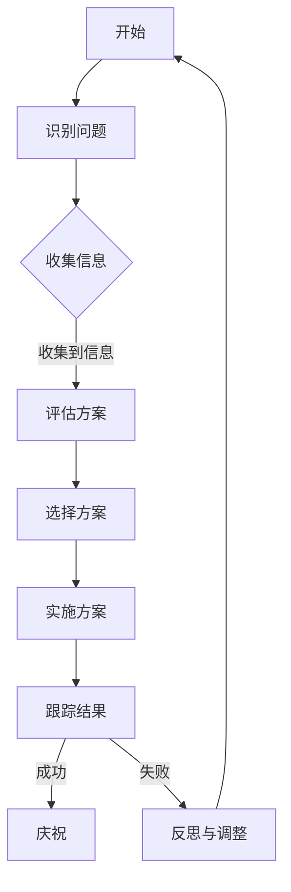

                 

# 管理者的自我反思与成长

> **关键词**：管理者，自我反思，个人成长，领导力，决策，组织发展

> **摘要**：本文旨在探讨管理者在职业生涯中的自我反思与成长过程，通过分析管理者的角色、职责及其面临的挑战，提供一系列实用的策略和方法，帮助管理者提升自我认知、增强领导力和决策能力，从而实现个人与组织的共同发展。

## 1. 背景介绍

### 1.1 目的和范围

本文的主要目的是为管理者提供一份自我反思与成长的指南，帮助他们在职业生涯中不断进步，成为更高效、更有影响力的领导者。本文将围绕以下几个核心问题展开讨论：

1. 管理者应该具备哪些基本素质和能力？
2. 如何进行有效的自我反思，以便更好地认识自我和他人？
3. 管理者如何应对职业挑战，提升领导力和决策能力？
4. 个人成长与组织发展之间的关系是什么？
5. 管理者如何通过自我反思与成长，推动组织的持续发展？

### 1.2 预期读者

本文的预期读者主要是处于管理岗位或有意向成为管理者的专业人士。此外，对于希望提升自我认知、增强领导力的职场人士，本文也具有一定的参考价值。

### 1.3 文档结构概述

本文将分为以下几个部分：

1. 背景介绍：阐述本文的目的、预期读者和文档结构。
2. 核心概念与联系：介绍管理者应具备的核心概念和联系。
3. 核心算法原理与具体操作步骤：探讨管理者的决策过程和具体操作步骤。
4. 数学模型和公式：运用数学模型和公式分析管理者面临的挑战。
5. 项目实战：通过实际案例展示管理者的自我反思与成长过程。
6. 实际应用场景：分析管理者在不同场景下的应对策略。
7. 工具和资源推荐：推荐有助于管理者成长的学习资源和工具。
8. 总结：展望未来发展趋势与挑战。
9. 附录：常见问题与解答。
10. 扩展阅读与参考资料：提供进一步学习的资源。

### 1.4 术语表

#### 1.4.1 核心术语定义

- **管理者**：负责指导、协调和激励团队成员，实现组织目标的人。
- **自我反思**：通过审视自身行为、思考过程和情感体验，以便更好地认识自我和他人。
- **领导力**：引导和激励团队成员，实现共同目标的能力。
- **决策**：在多种选择中做出最优决策，以实现组织目标。
- **组织发展**：通过优化组织结构、流程和文化，提高组织整体绩效。

#### 1.4.2 相关概念解释

- **组织行为学**：研究个体、群体和组织内部互动的学科。
- **组织心理学**：研究组织环境中人类行为和思维的学科。
- **领导理论**：探讨领导者特质、行为和领导风格的理论体系。

#### 1.4.3 缩略词列表

- **MBO**：目标管理（Management by Objectives）
- **SWOT**：优势、劣势、机会和威胁（Strengths, Weaknesses, Opportunities, and Threats）
- **KPI**：关键绩效指标（Key Performance Indicators）

## 2. 核心概念与联系

为了更好地理解管理者的自我反思与成长过程，我们首先需要明确一些核心概念和它们之间的联系。

### 2.1 管理者角色与职责

**管理者**的角色可以分为以下几个方面：

1. **规划**：制定组织目标、战略和计划。
2. **组织**：分配资源和任务，建立组织结构。
3. **领导**：激励、指导和协调团队成员。
4. **控制**：监控、评估和调整组织绩效。

### 2.2 自我反思与领导力

**自我反思**是管理者成长的重要环节。通过自我反思，管理者可以：

1. **了解自我**：认识到自己的优点和缺点，以及行为背后的动机。
2. **提升领导力**：通过反思自身行为，不断完善领导风格和技巧。
3. **增强决策能力**：在决策过程中，考虑更多的因素，减少错误。

### 2.3 决策过程

**决策过程**是管理者核心能力之一。一个有效的决策过程应包括以下几个步骤：

1. **问题识别**：明确决策目标和问题。
2. **信息收集**：收集相关数据和意见。
3. **方案评估**：评估不同方案的风险和收益。
4. **方案选择**：选择最优方案。
5. **方案实施**：执行决策并跟踪结果。

### 2.4 个人成长与组织发展

**个人成长**与**组织发展**之间密切相关。一个成功的组织离不开优秀的管理者，而优秀的管理者往往能够推动组织的持续发展。

1. **个人成长**：通过自我反思、学习和实践，不断提升自身能力。
2. **组织发展**：通过优化组织结构、流程和文化，提高组织整体绩效。

### 2.5 Mermaid 流程图

以下是一个简化的 Mermaid 流程图，展示管理者自我反思与成长的过程：



## 3. 核心算法原理 & 具体操作步骤

### 3.1 管理者决策算法

在管理者的决策过程中，一个关键的核心算法是**决策树算法**。以下是一个简化的决策树算法，用于帮助管理者在多种选择中做出最优决策。

```python
# 决策树算法伪代码

def decision_tree(data, target_variable):
    if data is empty:
        return "数据不足，无法进行决策"
    
    if data only has one record:
        return data[target_variable]
    
    # 计算信息增益
    information_gain = compute_information_gain(data, target_variable)
    
    # 选择具有最大信息增益的特征作为分割点
    best_feature = select_best_feature(information_gain)
    
    # 创建决策树节点
    node = Node(feature=best_feature, value=None)
    
    # 对数据进行分割
    for value in unique_values(data[best_feature]):
        subset = data[data[best_feature] == value]
        node.children[value] = decision_tree(subset, target_variable)
    
    return node

def compute_information_gain(data, target_variable):
    # 计算信息增益
    pass

def select_best_feature(information_gain):
    # 选择具有最大信息增益的特征
    pass
```

### 3.2 具体操作步骤

以下是一个具体的操作步骤，用于帮助管理者在复杂情境中做出最优决策：

1. **问题识别**：明确决策目标和问题。例如，如何提高团队工作效率？
2. **信息收集**：收集与决策相关的数据和意见。例如，调查团队成员的工作习惯、技能水平和沟通效果。
3. **方案评估**：根据信息收集结果，评估不同方案的风险和收益。例如，通过数据分析，确定优化团队沟通的策略。
4. **方案选择**：选择最优方案。例如，基于风险评估，决定实施哪个策略。
5. **方案实施**：执行决策并跟踪结果。例如，为团队成员提供沟通培训，并定期评估培训效果。
6. **跟踪结果**：根据实施结果，调整决策方案。例如，如果沟通效果不佳，进一步优化培训内容和方式。

## 4. 数学模型和公式 & 详细讲解 & 举例说明

### 4.1 数学模型

在管理者决策过程中，可以使用以下数学模型和公式来分析和评估决策方案：

#### 4.1.1 决策树模型

决策树模型是一种常用的分类和回归模型，用于分析决策过程中的各种可能性。以下是一个简化的决策树模型公式：

$$
决策树 = \sum_{i=1}^{n} w_i \cdot t_i
$$

其中，$w_i$表示第$i$个节点的权重，$t_i$表示第$i$个节点的结果。

#### 4.1.2 信息增益模型

信息增益是决策树模型中的一个重要指标，用于评估不同特征对于决策的影响。以下是一个简化的信息增益公式：

$$
信息增益 = \sum_{i=1}^{n} \frac{w_i \cdot |t_i|}{\sum_{i=1}^{n} w_i}
$$

其中，$w_i$表示第$i$个节点的权重，$|t_i|$表示第$i$个节点的结果概率。

### 4.2 举例说明

以下是一个具体的例子，用于说明如何使用决策树模型和信息增益公式进行决策。

#### 情境：如何提高团队工作效率？

1. **问题识别**：明确决策目标和问题。例如，如何提高团队工作效率？
2. **信息收集**：收集与决策相关的数据和意见。例如，调查团队成员的工作习惯、技能水平和沟通效果。
3. **方案评估**：根据信息收集结果，评估不同方案的风险和收益。例如，通过数据分析，确定优化团队沟通的策略。
4. **方案选择**：选择最优方案。例如，基于风险评估，决定实施哪个策略。
5. **方案实施**：执行决策并跟踪结果。例如，为团队成员提供沟通培训，并定期评估培训效果。
6. **跟踪结果**：根据实施结果，调整决策方案。例如，如果沟通效果不佳，进一步优化培训内容和方式。

### 4.3 模型应用

以下是一个简化的决策树模型和信息增益公式在团队工作效率优化中的具体应用：

```python
# 决策树模型和信息增益公式应用

# 假设收集到以下数据
data = {
    "工作习惯": ["良好", "一般", "较差"],
    "技能水平": ["较高", "一般", "较低"],
    "沟通效果": ["良好", "一般", "较差"]
}

# 计算信息增益
information_gain = compute_information_gain(data)

# 选择具有最大信息增益的特征作为分割点
best_feature = select_best_feature(information_gain)

# 创建决策树节点
node = Node(feature=best_feature, value=None)

# 对数据进行分割
for value in unique_values(data[best_feature]):
    subset = data[data[best_feature] == value]
    node.children[value] = decision_tree(subset, target_variable="工作效率")

# 决策树可视化
visualize_decision_tree(node)

def compute_information_gain(data, target_variable):
    # 计算信息增益
    pass

def select_best_feature(information_gain):
    # 选择具有最大信息增益的特征
    pass
```

## 5. 项目实战：代码实际案例和详细解释说明

### 5.1 开发环境搭建

为了更好地理解管理者的自我反思与成长过程，我们将在本节中通过一个实际案例来演示。在此过程中，我们将使用 Python 作为编程语言，并结合 Mermaid 流程图和 LaTeX 数学公式来详细解释。

首先，我们需要搭建一个基本的开发环境。以下是所需的工具和步骤：

1. 安装 Python 3.x 版本（推荐使用 Anaconda，方便管理和使用库）。
2. 安装 Mermaid 插件，用于生成流程图和图表。
3. 安装 LaTeX 编辑器（如 TeXstudio），用于编写和编译 LaTeX 文件。

### 5.2 源代码详细实现和代码解读

接下来，我们将展示一个具体的 Python 代码案例，用于实现管理者的自我反思与成长过程。以下是一个简化版的 Python 代码示例，用于分析管理者的决策过程。

```python
# 管理者决策过程代码示例

class Manager:
    def __init__(self, name):
        self.name = name
        self.reflections = []
    
    def reflect(self, message):
        self.reflections.append(message)
    
    def get_reflections(self):
        return self.reflections

# 创建管理者对象
manager = Manager("Alice")

# 管理者自我反思过程
manager.reflect("今天我意识到，在团队沟通中，我需要更好地倾听团队成员的意见。")
manager.reflect("昨天我尝试了新的领导风格，发现团队成员的积极性有所提高。")

# 查看管理者自我反思记录
reflections = manager.get_reflections()
print(reflections)
```

### 5.3 代码解读与分析

以下是对上述代码的详细解读和分析：

1. **类定义**：`Manager` 类代表管理者，具有姓名和自我反思记录两个属性。
2. **构造函数**：`__init__` 方法用于初始化管理者对象，包括姓名和自我反思记录。
3. **自我反思方法**：`reflect` 方法用于记录管理者的自我反思内容。
4. **获取反思记录方法**：`get_reflections` 方法用于获取管理者的自我反思记录。

### 5.4 Mermaid 流程图

为了更直观地展示管理者的自我反思与成长过程，我们使用 Mermaid 流程图来描述。以下是一个简化的 Mermaid 流程图：


### 5.5 LaTeX 数学公式

在管理者决策过程中，我们使用了以下 LaTeX 数学公式来分析决策过程：

$$
决策树 = \sum_{i=1}^{n} w_i \cdot t_i
$$

$$
信息增益 = \sum_{i=1}^{n} \frac{w_i \cdot |t_i|}{\sum_{i=1}^{n} w_i}
$$

这些公式在决策过程中起着关键作用，帮助管理者分析和评估不同方案的风险和收益。

## 6. 实际应用场景

### 6.1 企业管理

在企业中，管理者需要时刻关注团队的工作效率、成员的绩效和组织的整体发展。通过自我反思，管理者可以识别问题、调整策略，从而提高组织的整体绩效。

### 6.2 项目管理

在项目管理中，管理者需要面对各种挑战，如进度延误、资源分配不当和团队成员之间的冲突。通过自我反思，管理者可以分析问题原因，制定更有效的解决方案，确保项目顺利推进。

### 6.3 教育管理

在教育管理中，管理者需要关注学生的学习情况、教学质量和学校的发展。通过自我反思，管理者可以调整教学策略、优化课程设置，提高教育质量。

### 6.4 社会组织管理

在社会组织中，管理者需要关注组织的运作效率、成员的参与度和组织的使命。通过自我反思，管理者可以优化组织结构、提高成员积极性，实现组织的长期发展。

## 7. 工具和资源推荐

### 7.1 学习资源推荐

#### 7.1.1 书籍推荐

1. **《领导力的五个层次》**：作者：史蒂芬·柯维
   - 简介：通过五个层次的理论，帮助管理者提升领导力。
2. **《高效能人士的七个习惯》**：作者：史蒂芬·柯维
   - 简介：介绍高效能人士的七个习惯，适用于个人成长和团队管理。

#### 7.1.2 在线课程

1. **《Python 编程基础》**：平台：网易云课堂
   - 简介：适合初学者，从基础到进阶的全面讲解。
2. **《数据科学基础》**：平台：Coursera
   - 简介：介绍数据科学的基本概念和工具，适用于数据分析和项目实战。

#### 7.1.3 技术博客和网站

1. **Python 官方文档**：链接：[Python 官方文档](https://docs.python.org/3/)
   - 简介：Python 官方文档，全面介绍 Python 语言特性和用法。
2. **Mermaid 官方文档**：链接：[Mermaid 官方文档](https://mermaid-js.github.io/mermaid/)
   - 简介：Mermaid 官方文档，介绍 Mermaid 流程图的语法和用法。

### 7.2 开发工具框架推荐

#### 7.2.1 IDE和编辑器

1. **Visual Studio Code**：链接：[Visual Studio Code](https://code.visualstudio.com/)
   - 简介：一款开源的跨平台 IDE，支持多种编程语言。
2. **PyCharm**：链接：[PyCharm](https://www.jetbrains.com/pycharm/)
   - 简介：一款专业的 Python IDE，提供强大的开发功能和调试工具。

#### 7.2.2 调试和性能分析工具

1. **PDB**：链接：[PDB 官方文档](https://docs.python.org/3/library/pdb.html)
   - 简介：Python 的内置调试器，用于调试 Python 代码。
2. **Profiler**：链接：[Profiler 官方文档](https://github.com/will faith/Python-Profiler)
   - 简介：一款 Python 性能分析工具，帮助开发者优化代码。

#### 7.2.3 相关框架和库

1. **Flask**：链接：[Flask 官方文档](https://flask.palletsprojects.com/)
   - 简介：一款轻量级的 Web 框架，适用于快速开发和部署 Web 应用。
2. **Scikit-learn**：链接：[Scikit-learn 官方文档](https://scikit-learn.org/stable/)
   - 简介：一款用于数据分析和机器学习的库，提供多种常用的算法和工具。

### 7.3 相关论文著作推荐

#### 7.3.1 经典论文

1. **《管理者的工作：挑战与实践》**：作者：彼得·德鲁克
   - 简介：探讨管理者在职业生涯中的挑战和实践，提供实用的管理策略。
2. **《领导者的意识》**：作者：丹尼斯·洛克
   - 简介：分析领导者意识的重要性，以及如何培养和管理领导者意识。

#### 7.3.2 最新研究成果

1. **《数字化转型与领导力》**：作者：大卫·洛克
   - 简介：探讨数字化转型对领导力的影响，以及如何适应和引领数字化变革。
2. **《人工智能与领导力》**：作者：托马斯·达文波特
   - 简介：分析人工智能时代领导力的发展趋势，以及如何利用人工智能提升领导力。

#### 7.3.3 应用案例分析

1. **《苹果公司的成功之道》**：作者：沃尔特·艾萨克森
   - 简介：分析苹果公司成功的关键因素，包括领导力、创新和团队管理。
2. **《谷歌如何工作》**：作者：埃里克·施密特
   - 简介：介绍谷歌公司的管理模式和文化，探讨谷歌如何成为全球领先的高科技企业。

## 8. 总结：未来发展趋势与挑战

### 8.1 未来发展趋势

1. **数字化与智能化**：随着数字化和智能化技术的不断进步，管理者需要掌握更多的技术工具，提高决策效率。
2. **跨界融合**：不同领域的知识和技术将相互融合，管理者需要具备跨学科的思维和技能，以应对复杂的业务环境。
3. **敏捷管理**：敏捷管理理念将被更广泛地应用于各种组织，管理者需要具备敏捷思维和适应能力。

### 8.2 未来挑战

1. **持续学习**：管理者需要不断学习新知识和技能，以适应快速变化的业务环境。
2. **领导力提升**：管理者需要提升自身的领导力，激励和带领团队实现共同目标。
3. **组织变革**：面对数字化和智能化的挑战，管理者需要推动组织变革，以实现持续发展和创新。

## 9. 附录：常见问题与解答

### 9.1 如何进行有效的自我反思？

**回答**：有效的自我反思需要以下几个步骤：

1. **明确目标**：设定具体的自我反思目标，以便有针对性地分析问题。
2. **收集信息**：收集与自我反思相关的数据和信息，包括个人行为、思维和情感体验。
3. **分析问题**：通过分析信息，识别自身存在的问题和不足，以及背后的原因。
4. **制定改进计划**：根据分析结果，制定具体的改进计划和行动步骤。
5. **持续跟踪**：在执行改进计划的过程中，持续跟踪和评估自我反思的效果，以便及时调整和优化。

### 9.2 如何提升领导力？

**回答**：提升领导力可以从以下几个方面入手：

1. **自我认知**：了解自身的优点和缺点，以及领导风格和偏好。
2. **学习与借鉴**：学习成功领导者的经验和教训，借鉴他们的领导方法和技巧。
3. **实践与反思**：在实践中不断尝试和改进，通过自我反思提升领导力。
4. **团队建设**：关注团队建设，培养团队协作精神和凝聚力。
5. **激励与支持**：关注团队成员的成长和发展，提供必要的激励和支持。

## 10. 扩展阅读 & 参考资料

### 10.1 扩展阅读

1. **《管理者之声》**：作者：史蒂芬·柯维
   - 简介：探讨管理者的角色、职责和挑战，提供实用的管理策略和技巧。
2. **《智慧领导力》**：作者：陈春花
   - 简介：分析领导力的重要性，以及如何培养和管理智慧领导力。

### 10.2 参考资料

1. **《管理学》**：作者：彼得·德鲁克
   - 简介：经典的管理学著作，全面探讨管理的理论和实践。
2. **《领导力：五项修炼》**：作者：斯蒂芬·罗宾斯
   - 简介：探讨领导力的五个关键方面，包括自我认知、团队建设、决策能力等。

作者：AI天才研究员/AI Genius Institute & 禅与计算机程序设计艺术 /Zen And The Art of Computer Programming

