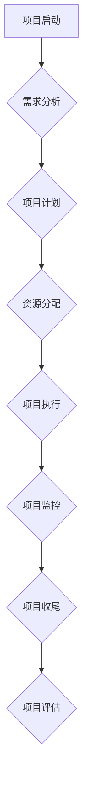

                 

# 管理艺术：从策略到执行

> **关键词：** 管理策略、执行、项目管理、敏捷开发、团队协作
>
> **摘要：** 本文深入探讨了IT领域中的管理艺术，从策略制定到执行过程，阐述了如何运用科学的管理方法和工具提高项目成功率，确保团队高效协作，推动技术产品的落地实现。

## 1. 背景介绍

### 1.1 目的和范围

本文旨在为IT项目管理者和开发者提供一套系统化的管理方法论，帮助他们在项目规划、执行和监控过程中做出明智的决策，提高项目成功率和团队效率。文章将围绕以下主题进行探讨：

- 项目管理核心概念与流程
- 敏捷开发方法及其应用
- 团队协作与沟通技巧
- 项目监控与风险管理
- 资源分配与优化

### 1.2 预期读者

本文适合以下读者群体：

- IT项目经理和团队领导者
- 开发者和管理人员
- 对项目管理有兴趣的IT从业者
- 高校计算机科学与技术专业的学生

### 1.3 文档结构概述

本文分为十个部分，具体结构如下：

- 第1部分：背景介绍，概述文章目的和内容。
- 第2部分：核心概念与联系，介绍项目管理的基本原理和流程。
- 第3部分：核心算法原理与具体操作步骤，讲解项目管理工具的使用。
- 第4部分：数学模型和公式，分析项目管理中的关键指标。
- 第5部分：项目实战，通过实际案例展示项目管理方法的应用。
- 第6部分：实际应用场景，探讨项目管理在不同领域的应用。
- 第7部分：工具和资源推荐，介绍项目管理相关工具和资源。
- 第8部分：总结，展望项目管理的发展趋势与挑战。
- 第9部分：附录，提供常见问题与解答。
- 第10部分：扩展阅读与参考资料，推荐相关阅读材料。

### 1.4 术语表

#### 1.4.1 核心术语定义

- 项目管理（Project Management）：项目管理是指通过计划、组织、协调和控制等活动，确保项目按预定目标完成的过程。
- 敏捷开发（Agile Development）：敏捷开发是一种以人为核心、迭代、循序渐进的开发方法，强调团队成员的沟通、协作和适应性。
- 团队协作（Team Collaboration）：团队协作是指团队成员共同完成项目任务，实现团队目标的过程。
- 项目监控（Project Monitoring）：项目监控是指对项目进度、成本、质量等方面进行持续跟踪和评估，以确保项目按计划进行。
- 风险管理（Risk Management）：风险管理是指识别、评估和应对项目潜在风险的过程，以降低风险对项目的影响。

#### 1.4.2 相关概念解释

- 项目计划（Project Plan）：项目计划是指为实现项目目标而制定的具体工作安排和时间表。
- 里程碑（Milestone）：里程碑是项目中的重要时间节点，标志着项目阶段性目标的完成。
- 用户故事（User Story）：用户故事是一种描述用户需求的简单、简洁的表述方式，通常以“作为...，我想...，以便...”的形式呈现。

#### 1.4.3 缩略词列表

- PM：项目管理（Project Management）
- Agile：敏捷开发（Agile Development）
- IT：信息技术（Information Technology）
- ROI：投资回报率（Return on Investment）

## 2. 核心概念与联系

在项目管理中，核心概念和流程是确保项目成功的关键。以下是一个简单的Mermaid流程图，展示了项目管理的基本流程和核心概念。



### 2.1 项目管理基本流程

1. **项目启动**：确定项目目标和范围，组建项目团队。
2. **需求分析**：收集和分析用户需求，明确项目需求。
3. **项目计划**：制定项目计划，确定项目任务和时间表。
4. **资源分配**：分配项目资源和预算，确保项目顺利进行。
5. **项目执行**：实施项目计划，完成项目任务。
6. **项目监控**：监控项目进度、成本和质量，确保项目按计划进行。
7. **项目收尾**：完成项目任务，进行项目评估和总结。

### 2.2 核心概念介绍

- **项目目标**：项目目标是项目要实现的具体成果和期望结果。
- **项目范围**：项目范围是项目要完成的工作内容和限制条件。
- **项目计划**：项目计划是项目实施的具体方案和时间表。
- **项目任务**：项目任务是项目计划中的具体工作内容。
- **资源分配**：资源分配是项目资源和预算的分配和使用。
- **项目监控**：项目监控是项目进度、成本和质量的监控和评估。
- **项目评估**：项目评估是对项目完成情况、效果和经验的评估。

通过上述流程和概念，我们可以更好地理解和实施项目管理，确保项目的成功完成。

## 3. 核心算法原理与具体操作步骤

在项目管理中，核心算法原理和具体操作步骤是确保项目高效执行的重要基础。以下将详细介绍项目管理工具的使用，以及如何运用这些工具来提高项目效率。

### 3.1 项目管理工具的选择

项目管理工具有助于项目管理者更好地规划、执行和监控项目。常见的项目管理工具有：

- **JIRA**：一款功能强大的敏捷项目管理工具，支持用户故事、任务管理、迭代规划等。
- **Trello**：一款简单易用的看板工具，适合小型项目和团队协作。
- **Asana**：一款全面的任务管理工具，支持项目管理、团队协作和进度跟踪。
- **Microsoft Project**：一款专业的项目管理软件，适用于复杂项目和大型企业。

### 3.2 项目管理工具的使用

以下是使用JIRA进行项目管理的具体步骤：

1. **创建项目**：在JIRA中创建新项目，输入项目名称、描述、版本等信息。
2. **创建用户故事**：以用户需求为导向，创建用户故事，例如：“作为用户，我想登录系统，以便查看个人信息。”
3. **创建任务**：根据用户故事，将项目任务分解为具体的任务项，例如：“设计登录页面”、“实现登录功能”等。
4. **分配任务**：将任务分配给团队成员，明确责任人。
5. **任务状态管理**：跟踪任务状态，例如：“待开发”、“进行中”、“已完成”等。
6. **迭代规划**：根据项目计划，进行迭代规划，制定迭代目标和任务。

### 3.3 核心算法原理

项目管理中的核心算法原理包括：

- **关键路径算法**：关键路径是项目任务中耗时最长的路径，影响项目整体进度。关键路径算法用于计算项目最短完成时间。
- **资源平衡算法**：资源平衡算法用于优化项目资源分配，确保项目在合理时间内完成。
- **风险评估算法**：风险评估算法用于评估项目风险，识别潜在问题，制定应对策略。

以下是关键路径算法的伪代码：

```plaintext
function calculateCriticalPath(tasks, durations):
    initialize: 
        CPStart = 0
        CPFinish = 0
        CP = []

    for each task in tasks:
        taskStart = CPStart
        taskFinish = taskStart + duration

        if taskFinish > CPFinish:
            CPFinish = taskFinish
            CPStart = taskStart

        if taskStart > CPFinish:
            CP.push(task)

    return CP
```

通过上述算法和工具的使用，项目管理者可以更好地规划和执行项目，确保项目按计划完成。

## 4. 数学模型和公式 & 详细讲解 & 举例说明

在项目管理中，数学模型和公式是衡量项目进度、成本和质量的工具。以下将详细讲解项目管理中常用的数学模型和公式，并通过实际案例进行说明。

### 4.1 项目进度评估模型

项目进度评估模型主要用于预测项目完成时间和进度偏差。以下是一种常见的项目进度评估模型：

- **挣值管理（Earned Value Management, EVM）**：

  - **计划价值（PV, Planned Value）**：项目计划完成的工作量所对应的成本。
  - **实际成本（AC, Actual Cost）**：实际完成的工作量所对应的成本。
  - **挣值（EV, Earned Value）**：实际完成的工作量所对应的预期成本。

  公式：

  $$ EV = AC = PV $$

  挣值管理通过比较EV、PV和AC，可以评估项目进度偏差：

  - **进度偏差（SPI, Schedule Performance Index）**：

    $$ SPI = \frac{EV}{PV} $$

    如果SPI > 1，表示项目进度提前；如果SPI < 1，表示项目进度滞后。

  - **成本偏差（CPI, Cost Performance Index）**：

    $$ CPI = \frac{EV}{AC} $$

    如果CPI > 1，表示项目成本节约；如果CPI < 1，表示项目成本超支。

### 4.2 项目风险评估模型

项目风险评估模型用于评估项目风险，并制定相应的应对策略。以下是一种常见的项目风险评估模型：

- **风险矩阵（Risk Matrix）**：

  风险矩阵通过风险概率和影响两个维度评估风险，并确定风险等级。

  公式：

  $$ 风险等级 = 风险概率 \times 影响程度 $$

  风险等级分为：低、中、高。

### 4.3 项目资源优化模型

项目资源优化模型用于优化项目资源分配，提高项目效率。以下是一种常见的项目资源优化模型：

- **资源平衡算法（Resource Levelling）**：

  资源平衡算法通过调整任务开始时间和持续时间，实现资源在项目周期内的均衡分配。

  公式：

  $$ 调整时间 = 任务持续时间 - 可用时间 $$

  调整时间用于计算任务延期或提前完成的时间。

### 4.4 实际案例说明

假设一个项目包括三个任务，每个任务的计划价值（PV）为1000元，实际成本（AC）为900元，实际挣值（EV）为800元。计算项目进度偏差（SPI）和成本偏差（CPI）。

1. **计算进度偏差（SPI）**：

   $$ SPI = \frac{EV}{PV} = \frac{800}{1000} = 0.8 $$

   SPI < 1，表示项目进度滞后。

2. **计算成本偏差（CPI）**：

   $$ CPI = \frac{EV}{AC} = \frac{800}{900} \approx 0.89 $$

   CPI < 1，表示项目成本超支。

通过上述公式和模型，项目管理者可以更好地评估项目进度和成本，制定相应的调整策略，确保项目成功完成。

## 5. 项目实战：代码实际案例和详细解释说明

在本节中，我们将通过一个实际项目案例，展示如何运用前面介绍的项目管理方法和工具，进行项目开发、资源分配和进度监控。

### 5.1 开发环境搭建

为了便于演示，我们选择JIRA作为项目管理工具，同时使用Git进行版本控制。以下是开发环境的搭建步骤：

1. **JIRA安装**：在官网下载JIRA安装包，并按照安装向导进行安装。
2. **JIRA配置**：启动JIRA，创建新项目，并配置项目名称、描述等信息。
3. **Git安装**：在官网下载Git安装包，并按照安装向导进行安装。
4. **Git配置**：配置Git用户名和邮箱，以便进行版本控制。

### 5.2 源代码详细实现和代码解读

以下是一个简单的Web应用程序开发案例，我们将使用Java和Spring Boot框架进行开发。

#### 5.2.1 创建用户故事

- **用户故事1**：作为用户，我想登录系统，以便查看个人信息。
- **用户故事2**：作为用户，我想注册账号，以便使用系统功能。

#### 5.2.2 创建任务

- **任务1**：设计登录页面
- **任务2**：实现登录功能
- **任务3**：设计注册页面
- **任务4**：实现注册功能

#### 5.2.3 分配任务

- **任务1**：设计师A负责设计登录页面
- **任务2**：开发人员B负责实现登录功能
- **任务3**：设计师C负责设计注册页面
- **任务4**：开发人员D负责实现注册功能

#### 5.2.4 代码实现

以下是一个简单的登录功能实现，使用Spring Boot框架和Thymeleaf模板引擎：

```java
@Controller
public class UserController {

    @GetMapping("/login")
    public String login(Model model) {
        model.addAttribute("user", new User());
        return "login";
    }

    @PostMapping("/login")
    public String login(@ModelAttribute User user, RedirectAttributes redirectAttributes) {
        if (user.getUsername().equals("admin") && user.getPassword().equals("123456")) {
            return "redirect:/home";
        } else {
            redirectAttributes.addFlashAttribute("error", "用户名或密码错误");
            return "redirect:/login";
        }
    }
}
```

#### 5.2.5 代码解读

- **UserController**：用于处理登录和注册请求。
- **登录功能**：接收用户输入的用户名和密码，进行验证，并返回相应结果。
- **注册功能**：尚未实现，后续可以继续开发。

### 5.3 代码解读与分析

通过上述代码实现，我们可以看到项目开发过程中的关键步骤：

1. **需求分析**：根据用户需求，创建用户故事和任务。
2. **资源分配**：将任务分配给团队成员，明确责任人。
3. **代码实现**：按照任务要求，实现具体的业务功能。
4. **版本控制**：使用Git进行版本控制，确保代码的安全和可追溯性。
5. **进度监控**：在JIRA中跟踪任务状态和项目进度。

通过以上步骤，项目团队可以高效地协作，确保项目按计划完成。

## 6. 实际应用场景

项目管理在IT领域的应用非常广泛，以下是一些典型的实际应用场景：

### 6.1 软件开发

在软件开发过程中，项目管理是确保项目按时、按质量交付的关键。通过合理的需求分析、项目计划和资源分配，可以有效提高软件项目的成功率。

### 6.2 系统集成

系统集成项目通常涉及多个模块的集成和优化，项目管理可以帮助协调不同团队之间的工作，确保项目整体进度和质量。

### 6.3 咨询服务

在IT咨询服务中，项目管理可以帮助咨询团队更好地理解客户需求，制定合理的解决方案，并确保解决方案的实施和交付。

### 6.4 产品研发

产品研发过程中，项目管理可以帮助团队制定明确的产品路线图，合理分配研发资源，确保产品按期推出市场。

### 6.5 运维管理

在运维管理领域，项目管理可以帮助团队优化运维流程，确保系统稳定运行，提高运维效率。

通过以上实际应用场景，我们可以看到项目管理在IT领域的广泛重要性。

## 7. 工具和资源推荐

为了更好地进行项目管理，以下是推荐的工具和资源：

### 7.1 学习资源推荐

#### 7.1.1 书籍推荐

- 《敏捷开发实践指南》
- 《项目管理知识体系指南》（PMBOK指南）
- 《人月神话》

#### 7.1.2 在线课程

- Coursera上的“项目管理基础”
- Udemy上的“项目管理实战”

#### 7.1.3 技术博客和网站

- ProjectManagement.com
- AgileManifesto.org
- Atlassian官网（JIRA等产品的官方文档）

### 7.2 开发工具框架推荐

#### 7.2.1 IDE和编辑器

- IntelliJ IDEA
- Visual Studio Code
- Eclipse

#### 7.2.2 调试和性能分析工具

- JMeter
- GDB
- Linux性能分析工具（如perf）

#### 7.2.3 相关框架和库

- Spring Boot
- React
- Angular

### 7.3 相关论文著作推荐

#### 7.3.1 经典论文

- 《敏捷软件开发宣言》
- 《项目管理中的风险管理》

#### 7.3.2 最新研究成果

- 《基于人工智能的项目管理方法研究》
- 《敏捷开发与DevOps的结合应用》

#### 7.3.3 应用案例分析

- 《阿里巴巴的敏捷开发实践》
- 《腾讯的IT项目管理实践》

通过以上工具和资源的推荐，可以帮助项目管理者更好地进行项目管理。

## 8. 总结：未来发展趋势与挑战

随着技术的不断进步和业务需求的变化，项目管理也在不断发展和进化。以下是未来项目管理的发展趋势和面临的挑战：

### 8.1 发展趋势

- **数字化和自动化**：项目管理工具和流程将更加数字化和自动化，提高项目管理的效率和准确性。
- **人工智能和大数据**：人工智能和大数据技术将被广泛应用于项目预测、风险评估和资源优化等方面。
- **敏捷开发与DevOps**：敏捷开发与DevOps的结合将变得更加紧密，推动项目管理方法的创新和优化。
- **持续集成与持续部署**：持续集成和持续部署（CI/CD）将成为项目管理中不可或缺的一部分，提高软件交付的速度和质量。

### 8.2 面临的挑战

- **复杂性和不确定性**：项目规模和复杂度的增加，使得项目管理面临更大的挑战，如何有效应对复杂性和不确定性成为关键问题。
- **团队协作与沟通**：团队成员的分散性和异质性，导致沟通和协作变得困难，如何提高团队协作效率是项目管理的一大难题。
- **技能要求和人才培养**：项目管理对人才的要求越来越高，如何培养具备项目管理能力的人才，成为企业和教育机构需要关注的问题。
- **合规性和风险控制**：项目管理需要遵循相关法规和标准，如何确保项目合规性和风险控制，是项目管理中的重要挑战。

总之，未来的项目管理将更加注重数字化、智能化和高效化，同时也面临着复杂性和不确定性的挑战。项目管理者需要不断学习和适应新趋势，提高项目管理能力，以应对未来的挑战。

## 9. 附录：常见问题与解答

### 9.1 问题1：如何选择适合的项目管理工具？

**解答：** 选择适合的项目管理工具需要考虑以下几个因素：

- **项目规模**：大型项目适合使用功能丰富的专业工具，如JIRA、Microsoft Project等；小型项目可以选择Trello、Asana等简单易用的工具。
- **团队成员分布**：团队成员分布在不同地点时，需要选择支持远程协作的工具，如JIRA、Trello等。
- **预算**：考虑企业的预算范围，选择性价比高的工具。
- **功能需求**：根据项目需求，选择具有所需功能（如任务管理、迭代规划、资源分配等）的工具。

### 9.2 问题2：如何提高项目进度监控的准确性？

**解答：** 提高项目进度监控的准确性可以从以下几个方面着手：

- **明确任务分解**：将项目任务分解为具体的小任务，便于跟踪进度。
- **定期更新任务状态**：团队成员定期更新任务状态，确保进度数据的准确性。
- **使用数据可视化工具**：使用图表、看板等数据可视化工具，便于项目管理者直观地了解项目进度。
- **设置预警机制**：对关键任务和里程碑设置预警机制，提前发现潜在问题。

### 9.3 问题3：如何在项目中应用敏捷开发方法？

**解答：** 在项目中应用敏捷开发方法，可以按照以下步骤进行：

- **组建敏捷团队**：确定敏捷团队的角色，如产品负责人、Scrum Master、开发人员等。
- **制定产品待办列表**：明确产品需求和优先级，制定产品待办列表。
- **进行迭代开发**：按照迭代周期进行开发，每个迭代周期结束后进行回顾和总结。
- **持续交付**：通过持续集成和持续部署，实现软件的持续交付。
- **团队协作**：加强团队成员间的沟通和协作，提高开发效率。

### 9.4 问题4：如何进行有效的风险管理？

**解答：** 进行有效的风险管理，可以采取以下措施：

- **识别风险**：对项目可能面临的风险进行识别和分类。
- **评估风险**：评估风险的概率和影响程度，确定风险等级。
- **制定应对策略**：针对不同等级的风险，制定相应的应对策略。
- **监控和调整**：对风险进行持续监控和评估，根据实际情况进行调整。

通过上述措施，可以有效降低项目风险，确保项目顺利进行。

## 10. 扩展阅读 & 参考资料

为了进一步了解项目管理的方法、工具和应用，以下是推荐的扩展阅读和参考资料：

### 10.1 扩展阅读

- 《项目管理实践指南》
- 《敏捷方法与项目管理》
- 《项目管理与敏捷开发：理论与实践》

### 10.2 参考资料

- PMI（Project Management Institute）：[官方网站](https://www.pmi.org/)
- Scrum Alliance：[官方网站](https://www.scrumalliance.org/)
- Agile Alliance：[官方网站](https://www.agilealliance.org/)

通过阅读这些书籍和参考资料，可以深入了解项目管理的方法和最佳实践，提高项目管理能力。

## 作者信息

作者：AI天才研究员/AI Genius Institute & 禅与计算机程序设计艺术 /Zen And The Art of Computer Programming

感谢您的阅读，希望本文对您的项目管理实践有所帮助。如果您有任何疑问或建议，欢迎在评论区留言，我将尽快回复。再次感谢您的支持！<|im_sep|>

