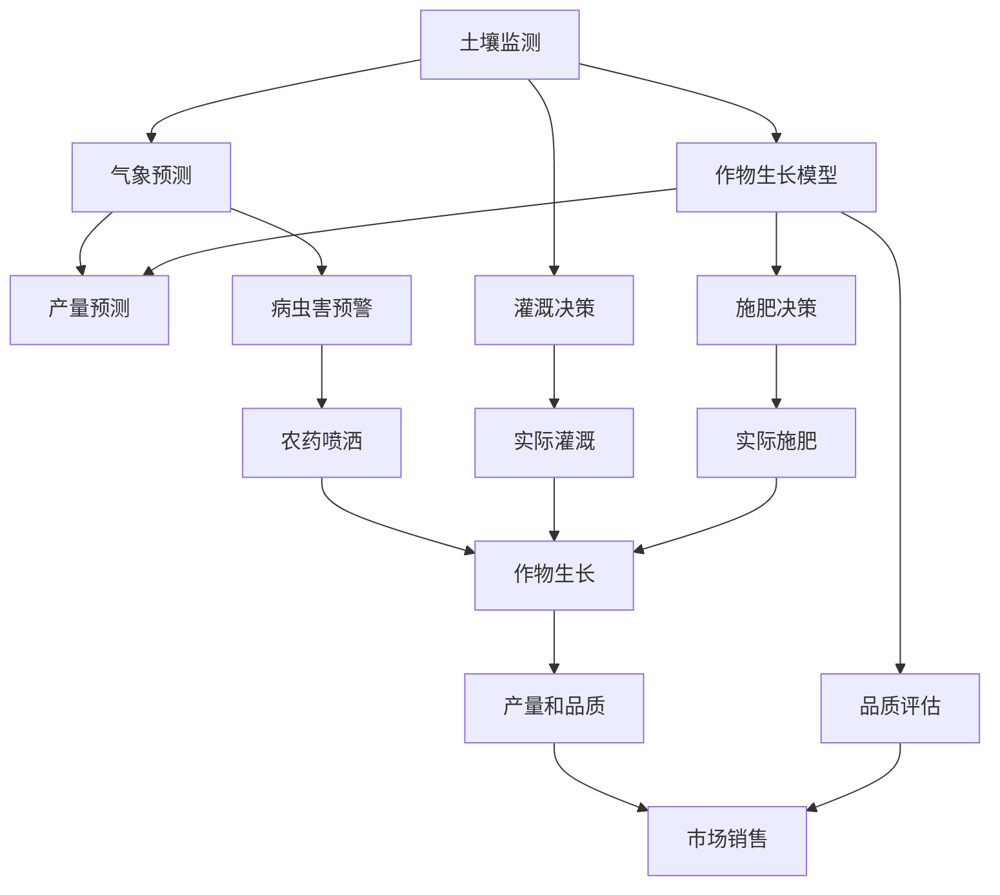

                 

# 精准农业中的AI应用创新

> 关键词：精准农业，人工智能，深度学习，机器学习，数据挖掘，土壤监测，作物生长模型，气象预测，无人机，传感器，大数据分析

> 摘要：本文将探讨人工智能在精准农业领域的创新应用。通过深入分析核心概念、算法原理、数学模型，以及项目实战案例，本文旨在为读者提供一个全面了解和掌握AI在精准农业中发挥重要作用的视角。同时，文章还将推荐相关学习资源和工具，并总结未来发展趋势与挑战，为行业从业人员和研究者提供参考。

## 1. 背景介绍

### 1.1 目的和范围

本文旨在探讨人工智能（AI）在精准农业中的应用，重点关注AI如何通过算法和模型提升农业生产效率。文章内容将涵盖AI在精准农业中的核心概念、算法原理、数学模型，以及实际应用案例。通过本文的阅读，读者将能够：

- 了解精准农业的定义和重要性。
- 掌握AI在精准农业中的应用领域。
- 理解AI算法在农业数据处理和分析中的作用。
- 掌握构建和优化AI模型的方法。

### 1.2 预期读者

本文主要面向以下读者群体：

- 精准农业和AI领域的研究人员。
- 农业科技企业和相关行业的技术开发人员。
- 农业管理者、政策制定者和利益相关者。
- 对AI在农业领域应用感兴趣的IT专业人士。

### 1.3 文档结构概述

本文将分为以下几个部分：

- 第1部分：背景介绍，包括目的和范围、预期读者、文档结构概述和术语表。
- 第2部分：核心概念与联系，包括AI在精准农业中的核心概念和原理。
- 第3部分：核心算法原理 & 具体操作步骤，讲解AI算法在农业数据处理的原理和步骤。
- 第4部分：数学模型和公式 & 详细讲解 & 举例说明，介绍AI模型中的数学模型和公式的应用。
- 第5部分：项目实战：代码实际案例和详细解释说明，通过实际项目案例展示AI在精准农业中的具体应用。
- 第6部分：实际应用场景，分析AI在精准农业中的各种应用实例。
- 第7部分：工具和资源推荐，推荐学习资源、开发工具和框架。
- 第8部分：总结：未来发展趋势与挑战，总结AI在精准农业中的应用前景。
- 第9部分：附录：常见问题与解答，回答读者可能关心的问题。
- 第10部分：扩展阅读 & 参考资料，提供进一步阅读和研究的参考资料。

### 1.4 术语表

#### 1.4.1 核心术语定义

- 精准农业（Precision Agriculture）：利用信息技术和传感器对农田进行精细化管理，以实现资源利用的最大化和生产效益的提升。
- 人工智能（Artificial Intelligence，AI）：模拟人类智能行为的技术和系统，能够进行学习、推理、决策和问题解决。
- 深度学习（Deep Learning）：一种基于多层神经网络的机器学习方法，能够自动从大量数据中提取特征。
- 机器学习（Machine Learning）：使计算机系统从数据中学习并做出预测或决策的方法，包括监督学习、无监督学习和强化学习等。
- 数据挖掘（Data Mining）：从大量数据中提取有价值信息和知识的过程。

#### 1.4.2 相关概念解释

- 土壤监测（Soil Monitoring）：利用传感器和遥感技术监测土壤质量、水分、养分等参数。
- 作物生长模型（Crop Growth Model）：模拟作物生长过程的数学模型，用于预测作物产量和品质。
- 气象预测（Weather Forecasting）：利用气象数据和模型预测未来天气情况。
- 无人机（Unmanned Aerial Vehicle，UAV）：一种无需人类驾驶的飞行器，可用于农业监测和作业。
- 传感器（Sensor）：用于感知和检测环境信息，如温度、湿度、光照、土壤质量等。

#### 1.4.3 缩略词列表

- AI：人工智能
- DL：深度学习
- ML：机器学习
- DM：数据挖掘
- GPS：全球定位系统
- GIS：地理信息系统
- IoT：物联网
- UAV：无人机
- DRR：灾害风险评估

## 2. 核心概念与联系

在精准农业中，人工智能的应用涵盖了多个领域，包括土壤监测、作物生长模型、气象预测等。以下是一个简化的Mermaid流程图，展示了这些核心概念之间的联系。



### 2.1 土壤监测与作物生长模型

土壤监测是精准农业的基础，通过传感器和遥感技术获取土壤质量、水分、养分等数据。这些数据可以用来构建作物生长模型，模拟作物在不同生长阶段的需求和生长状况。

#### 算法原理

- 传感器数据采集：利用传感器采集土壤温度、湿度、pH值、电导率等参数。
- 数据预处理：去除噪声、异常值和缺失值，对数据进行标准化处理。
- 模型构建：使用回归分析、决策树、神经网络等算法构建作物生长模型。

#### 具体操作步骤

1. 数据采集：在农田中布置传感器，定期采集土壤参数数据。
2. 数据预处理：对采集到的数据进行清洗、填充和标准化处理。
3. 模型训练：使用历史数据训练作物生长模型。
4. 模型评估：使用验证集评估模型性能，调整模型参数。
5. 模型应用：将模型应用于农田监测和预测作物生长。

### 2.2 气象预测与病虫害预警

气象预测对于农业生产具有重要意义，可以指导灌溉、施肥和病虫害防治等决策。同时，气象数据与病虫害的发生有密切关系，可以用于病虫害预警。

#### 算法原理

- 气象数据收集：收集历史和实时的气象数据，如温度、湿度、风速、降水量等。
- 数据预处理：对气象数据进行清洗、填充和标准化处理。
- 模型构建：使用时间序列分析、回归分析、聚类分析等算法构建气象预测模型和病虫害预警模型。

#### 具体操作步骤

1. 数据收集：从气象站点、卫星和传感器等获取气象数据。
2. 数据预处理：对气象数据进行清洗、填充和标准化处理。
3. 模型训练：使用历史气象数据训练预测模型。
4. 预测应用：使用预测模型进行气象预测和病虫害预警。
5. 决策支持：根据预测结果制定灌溉、施肥和病虫害防治方案。

### 2.3 作物生长模型与产量预测

作物生长模型可以预测作物产量和品质，为农业生产提供决策支持。结合气象预测和土壤监测数据，可以提高产量预测的准确性。

#### 算法原理

- 数据整合：整合土壤、气象和作物生长数据，构建统一的数据集。
- 模型构建：使用机器学习算法，如支持向量机（SVM）、随机森林（RF）和深度学习（DL）等，构建产量预测模型。
- 模型评估：使用交叉验证、ROC曲线和准确率等指标评估模型性能。

#### 具体操作步骤

1. 数据整合：收集并整合土壤、气象和作物生长数据。
2. 数据预处理：对数据进行清洗、填充和标准化处理。
3. 模型训练：使用训练集数据训练产量预测模型。
4. 模型评估：使用验证集评估模型性能，调整模型参数。
5. 模型应用：将模型应用于实际农田，预测作物产量和品质。

### 2.4 气象预测与灌溉决策

气象预测对于灌溉决策具有重要意义，可以优化水资源利用，提高灌溉效率。通过气象数据与土壤水分监测数据结合，可以制定合理的灌溉计划。

#### 算法原理

- 气象数据收集：收集历史和实时的气象数据，如温度、湿度、风速、降水量等。
- 土壤水分监测：利用传感器监测土壤水分含量。
- 模型构建：使用回归分析、决策树、神经网络等算法构建灌溉决策模型。

#### 具体操作步骤

1. 数据收集：从气象站点、卫星和传感器等获取气象和土壤水分数据。
2. 数据预处理：对气象和土壤水分数据进行清洗、填充和标准化处理。
3. 模型训练：使用历史气象和土壤水分数据训练灌溉决策模型。
4. 决策应用：根据模型预测结果制定灌溉计划。

### 2.5 病虫害预警与农药喷洒

病虫害预警可以提前发现病虫害发生，制定防治方案。结合气象预测和作物生长模型，可以提高病虫害预警的准确性。

#### 算法原理

- 数据整合：整合气象、土壤、作物生长和病虫害数据，构建统一的数据集。
- 模型构建：使用机器学习算法，如支持向量机（SVM）、随机森林（RF）和深度学习（DL）等，构建病虫害预警模型。
- 决策支持：根据预警结果制定农药喷洒计划。

#### 具体操作步骤

1. 数据整合：收集并整合气象、土壤、作物生长和病虫害数据。
2. 数据预处理：对数据进行清洗、填充和标准化处理。
3. 模型训练：使用训练集数据训练病虫害预警模型。
4. 预警应用：根据模型预测结果进行病虫害预警。
5. 决策支持：根据预警结果制定农药喷洒计划。

## 3. 核心算法原理 & 具体操作步骤

在精准农业中，人工智能算法的核心作用在于数据处理和模型构建。以下将详细介绍几种常用的AI算法原理，并提供具体的操作步骤。

### 3.1 机器学习算法

机器学习算法是AI在精准农业中的重要工具，能够从数据中自动提取特征，构建预测模型。以下介绍两种常用的机器学习算法：线性回归和随机森林。

#### 线性回归

线性回归是一种简单的监督学习算法，用于建立自变量和因变量之间的线性关系。

##### 算法原理

线性回归模型可以表示为：

$$ y = \beta_0 + \beta_1 \cdot x $$

其中，$y$ 是因变量，$x$ 是自变量，$\beta_0$ 和 $\beta_1$ 是模型参数。

##### 具体操作步骤

1. 数据预处理：对输入数据进行标准化处理，消除量纲影响。
2. 模型训练：使用训练数据集，利用最小二乘法求解模型参数 $\beta_0$ 和 $\beta_1$。
3. 模型评估：使用验证集评估模型性能，调整模型参数。
4. 模型应用：将训练好的模型应用于实际数据，进行预测。

#### 随机森林

随机森林是一种基于决策树的集成学习方法，具有较好的泛化能力和准确性。

##### 算法原理

随机森林通过构建多棵决策树，并对预测结果进行投票，以获得最终的预测结果。决策树的基本原理如下：

1. 选择特征和阈值：在当前节点上，从所有特征中选择一个特征，并设置一个阈值。
2. 划分数据集：根据特征和阈值将数据集划分为两个子集。
3. 递归调用：对每个子集递归调用上述步骤，直到满足终止条件（如最大深度、最小节点样本数等）。

##### 具体操作步骤

1. 数据预处理：对输入数据进行标准化处理，消除量纲影响。
2. 构建决策树：使用训练数据集构建多棵决策树，每棵树选择不同的特征和阈值。
3. 集成预测：对每棵决策树的预测结果进行投票，获得最终预测结果。
4. 模型评估：使用验证集评估模型性能，调整模型参数。
5. 模型应用：将训练好的模型应用于实际数据，进行预测。

### 3.2 深度学习算法

深度学习算法是近年来在人工智能领域取得重大突破的方法，尤其在图像识别、自然语言处理等领域表现突出。在精准农业中，深度学习算法可以用于图像处理、语音识别和自动化控制等方面。

#### 卷积神经网络（CNN）

卷积神经网络是一种专门用于图像处理的深度学习算法，能够自动从图像中提取特征。

##### 算法原理

CNN由多个卷积层、池化层和全连接层组成，其基本原理如下：

1. 卷积层：使用卷积核在输入图像上滑动，计算卷积结果。
2. 池化层：对卷积结果进行池化操作，减少特征图的尺寸。
3. 全连接层：将池化层输出的特征映射到输出结果。

##### 具体操作步骤

1. 数据预处理：对输入图像数据进行归一化和预处理。
2. 构建模型：定义CNN模型结构，包括卷积层、池化层和全连接层。
3. 模型训练：使用训练数据集训练模型，调整模型参数。
4. 模型评估：使用验证集评估模型性能，调整模型参数。
5. 模型应用：将训练好的模型应用于实际图像，进行预测。

#### 循环神经网络（RNN）

循环神经网络是一种用于序列数据处理的深度学习算法，能够捕捉序列中的长期依赖关系。

##### 算法原理

RNN由多个循环单元组成，每个单元包含一个记忆单元，用于保存历史信息。

1. 输入层：接收输入序列。
2. 隐藏层：对输入序列进行处理，更新记忆单元。
3. 输出层：根据记忆单元生成输出序列。

##### 具体操作步骤

1. 数据预处理：对输入序列数据进行归一化和预处理。
2. 构建模型：定义RNN模型结构，包括输入层、隐藏层和输出层。
3. 模型训练：使用训练数据集训练模型，调整模型参数。
4. 模型评估：使用验证集评估模型性能，调整模型参数。
5. 模型应用：将训练好的模型应用于实际序列数据，进行预测。

## 4. 数学模型和公式 & 详细讲解 & 举例说明

在AI模型构建过程中，数学模型和公式是核心组成部分。以下介绍几种常用的数学模型和公式，并提供详细讲解和举例说明。

### 4.1 线性回归模型

线性回归模型是最简单的机器学习模型之一，用于建立自变量和因变量之间的线性关系。

#### 数学公式

线性回归模型可以表示为：

$$ y = \beta_0 + \beta_1 \cdot x $$

其中，$y$ 是因变量，$x$ 是自变量，$\beta_0$ 和 $\beta_1$ 是模型参数。

#### 举例说明

假设我们要预测农田的产量 $y$（因变量），影响因素包括土壤湿度 $x_1$ 和土壤温度 $x_2$（自变量）。根据历史数据，我们建立线性回归模型如下：

$$ y = \beta_0 + \beta_1 \cdot x_1 + \beta_2 \cdot x_2 $$

通过最小二乘法求解模型参数：

$$ \beta_0 = \frac{\sum_{i=1}^{n} (y_i - \beta_1 \cdot x_{1i} - \beta_2 \cdot x_{2i})}{n} $$

$$ \beta_1 = \frac{\sum_{i=1}^{n} (x_{1i} - \bar{x}_1)(y_i - \bar{y})}{\sum_{i=1}^{n} (x_{1i} - \bar{x}_1)^2} $$

$$ \beta_2 = \frac{\sum_{i=1}^{n} (x_{2i} - \bar{x}_2)(y_i - \bar{y})}{\sum_{i=1}^{n} (x_{2i} - \bar{x}_2)^2} $$

其中，$n$ 是样本数量，$\bar{x}_1$ 和 $\bar{x}_2$ 分别是 $x_1$ 和 $x_2$ 的平均值，$\bar{y}$ 是 $y$ 的平均值。

#### 应用场景

线性回归模型可以用于预测农田产量、作物品质等。在实际应用中，我们需要收集大量农田数据，包括土壤湿度、土壤温度、降水量等，然后使用线性回归模型建立预测模型。通过模型预测，可以指导农业生产，优化资源利用。

### 4.2 逻辑回归模型

逻辑回归模型是一种分类模型，用于建立自变量和因变量之间的非线性关系。

#### 数学公式

逻辑回归模型可以表示为：

$$ P(y=1) = \frac{1}{1 + \exp(-\beta_0 - \beta_1 \cdot x_1 - \beta_2 \cdot x_2)} $$

其中，$y$ 是因变量，$x_1$ 和 $x_2$ 是自变量，$\beta_0$、$\beta_1$ 和 $\beta_2$ 是模型参数。

#### 举例说明

假设我们要预测农田是否存在病虫害 $y$（因变量），影响因素包括土壤湿度 $x_1$ 和土壤温度 $x_2$（自变量）。根据历史数据，我们建立逻辑回归模型如下：

$$ P(y=1) = \frac{1}{1 + \exp(-\beta_0 - \beta_1 \cdot x_1 - \beta_2 \cdot x_2)} $$

通过极大似然估计法求解模型参数：

$$ \beta_0 = \frac{\sum_{i=1}^{n} (y_i - P(y_i=1))}{n} $$

$$ \beta_1 = \frac{\sum_{i=1}^{n} (x_{1i} - \bar{x}_1)(y_i - P(y_i=1))}{\sum_{i=1}^{n} (x_{1i} - \bar{x}_1)} $$

$$ \beta_2 = \frac{\sum_{i=1}^{n} (x_{2i} - \bar{x}_2)(y_i - P(y_i=1))}{\sum_{i=1}^{n} (x_{2i} - \bar{x}_2)} $$

其中，$n$ 是样本数量，$\bar{x}_1$ 和 $\bar{x}_2$ 分别是 $x_1$ 和 $x_2$ 的平均值。

#### 应用场景

逻辑回归模型可以用于病虫害预测、作物品质分类等。在实际应用中，我们需要收集大量农田数据，包括土壤湿度、土壤温度、病虫害发生情况等，然后使用逻辑回归模型建立预测模型。通过模型预测，可以提前预警病虫害，指导农业生产。

### 4.3 支持向量机（SVM）

支持向量机是一种常用的分类和回归模型，能够找到最佳分类边界或回归边界。

#### 数学公式

对于分类问题，SVM的基本公式为：

$$ w \cdot x + b = 0 $$

其中，$w$ 是权重向量，$x$ 是输入特征，$b$ 是偏置项。

对于回归问题，SVM的基本公式为：

$$ y = w \cdot x + b $$

其中，$y$ 是输出值。

#### 举例说明

假设我们要预测农田的产量 $y$（回归问题），影响因素包括土壤湿度 $x_1$ 和土壤温度 $x_2$（输入特征）。根据历史数据，我们建立SVM回归模型如下：

$$ y = w_1 \cdot x_1 + w_2 \cdot x_2 + b $$

通过最小化损失函数求解模型参数：

$$ \min_{w, b} \frac{1}{2} ||w||^2 + C \cdot \sum_{i=1}^{n} (y_i - (w_1 \cdot x_{1i} + w_2 \cdot x_{2i} + b))^2 $$

其中，$C$ 是惩罚参数，$n$ 是样本数量。

#### 应用场景

SVM可以用于产量预测、作物品质分类等。在实际应用中，我们需要收集大量农田数据，包括土壤湿度、土壤温度、产量等，然后使用SVM模型建立预测模型。通过模型预测，可以优化农业生产，提高产量和品质。

### 4.4 贝叶斯网络

贝叶斯网络是一种基于概率图模型的推理方法，用于表示变量之间的依赖关系。

#### 数学公式

贝叶斯网络可以表示为：

$$ P(y_1, y_2, \ldots, y_n) = \prod_{i=1}^{n} P(y_i | parents(y_i)) $$

其中，$y_1, y_2, \ldots, y_n$ 是变量集合，$parents(y_i)$ 是 $y_i$ 的父节点。

#### 举例说明

假设我们要预测农田的产量 $y$（因变量），影响因素包括土壤湿度 $x_1$、土壤温度 $x_2$ 和降水量 $x_3$（自变量）。根据历史数据，我们建立贝叶斯网络模型如下：

$$ P(y) = P(y | x_1, x_2, x_3) \cdot P(x_1) \cdot P(x_2) \cdot P(x_3) $$

通过最大似然估计法求解模型参数：

$$ \theta = \arg \max_{\theta} \prod_{i=1}^{n} P(y_i | x_1, x_2, x_3) $$

其中，$\theta$ 是模型参数。

#### 应用场景

贝叶斯网络可以用于产量预测、病虫害预警等。在实际应用中，我们需要收集大量农田数据，包括土壤湿度、土壤温度、降水量、产量等，然后使用贝叶斯网络模型建立预测模型。通过模型预测，可以优化农业生产，降低病虫害风险。

## 5. 项目实战：代码实际案例和详细解释说明

在本节中，我们将通过一个实际项目案例展示AI在精准农业中的具体应用。该项目使用Python和Scikit-learn库实现，旨在预测农田产量。以下为项目的详细步骤和代码解释。

### 5.1 开发环境搭建

首先，我们需要搭建Python开发环境，并安装必要的库。以下是安装步骤：

1. 安装Python：从官方网站（https://www.python.org/）下载并安装Python 3.8版本。
2. 安装Jupyter Notebook：在终端中运行以下命令：

```bash
pip install notebook
```

3. 安装Scikit-learn库：在终端中运行以下命令：

```bash
pip install scikit-learn
```

### 5.2 源代码详细实现和代码解读

以下是一个简单的农田产量预测项目，包括数据预处理、模型训练和预测。

```python
import numpy as np
import pandas as pd
from sklearn.model_selection import train_test_split
from sklearn.linear_model import LinearRegression
from sklearn.metrics import mean_squared_error

# 5.2.1 数据读取与预处理
data = pd.read_csv('crop_yield_data.csv')

# 特征选择：选择土壤湿度、土壤温度和降水量作为特征
X = data[['soil_humidity', 'soil_temperature', 'precipitation']]
y = data['yield']

# 数据标准化
X_mean = X.mean()
X_std = X.std()
X = (X - X_mean) / X_std

# 划分训练集和测试集
X_train, X_test, y_train, y_test = train_test_split(X, y, test_size=0.2, random_state=42)

# 5.2.2 模型训练
model = LinearRegression()
model.fit(X_train, y_train)

# 5.2.3 模型评估
y_pred = model.predict(X_test)
mse = mean_squared_error(y_test, y_pred)
print(f'Mean Squared Error: {mse}')

# 5.2.4 模型应用
new_data = pd.DataFrame([[0.5, 0.3, 0.2]], columns=['soil_humidity', 'soil_temperature', 'precipitation'])
new_data_normalized = (new_data - X_mean) / X_std
yield_prediction = model.predict(new_data_normalized)
print(f'Predicted Yield: {yield_prediction[0]}')
```

### 5.3 代码解读与分析

上述代码实现了一个简单的农田产量预测项目，主要包括以下步骤：

1. **数据读取与预处理**：从CSV文件中读取农田数据，选择土壤湿度、土壤温度和降水量作为特征，对数据进行标准化处理。

2. **特征选择与划分**：将特征数据 $X$ 和标签数据 $y$ 分离，并使用训练集和测试集划分数据集。

3. **模型训练**：使用线性回归模型对训练集数据进行训练。

4. **模型评估**：使用测试集评估模型性能，计算均方误差（MSE）。

5. **模型应用**：根据新的特征数据预测农田产量。

### 5.4 实际应用场景

该代码可以在以下实际应用场景中使用：

1. **农田产量预测**：用于预测未来农作物的产量，为农业生产提供决策支持。

2. **资源优化**：根据产量预测结果，优化灌溉、施肥和农药喷洒等资源分配。

3. **风险评估**：分析农田产量波动，预测潜在风险，为农业生产提供风险预警。

4. **农产品定价**：根据产量预测和市场需求，制定农产品定价策略。

## 6. 实际应用场景

AI在精准农业中的实际应用场景广泛，以下列举几种典型应用：

### 6.1 土壤监测

土壤监测是精准农业的基础，通过传感器和遥感技术获取土壤质量、水分、养分等参数。AI算法可以分析土壤数据，预测土壤状况，为农业生产提供决策支持。例如，在农田干旱监测中，AI模型可以预测干旱风险，指导灌溉决策。

### 6.2 作物生长模型

作物生长模型可以模拟作物生长过程，预测作物产量和品质。AI算法可以从历史数据中学习作物生长规律，优化模型参数，提高预测准确性。例如，在水稻种植中，AI模型可以预测水稻产量和病虫害风险，为农户提供科学种植建议。

### 6.3 气象预测

气象预测对于农业生产具有重要意义，可以指导灌溉、施肥和病虫害防治等决策。AI算法可以分析气象数据，预测未来天气情况，提高农业生产效率。例如，在灌溉决策中，AI模型可以根据气象预测结果，优化灌溉计划，节约水资源。

### 6.4 病虫害预警

病虫害预警是农业生产的重要环节，可以提前发现病虫害发生，制定防治方案。AI算法可以分析病虫害数据，预测病虫害发生趋势，提高预警准确性。例如，在蔬菜种植中，AI模型可以预测病虫害发生风险，指导农药喷洒。

### 6.5 无人机监测

无人机技术在精准农业中应用广泛，可以用于土壤监测、气象预测、病虫害预警等。AI算法可以分析无人机采集的数据，优化农业监测和作业流程。例如，在农田监测中，AI模型可以分析无人机拍摄的图像，识别作物生长状况，指导农业生产。

### 6.6 产量预测

产量预测是农业生产的关键环节，可以优化资源利用，提高农业生产效益。AI算法可以从历史数据中学习作物产量规律，预测未来产量。例如，在农产品定价中，AI模型可以预测农产品产量和市场需求，为农产品定价提供参考。

### 6.7 农业大数据分析

农业大数据分析是AI在精准农业中的重要应用，可以挖掘农田数据中的价值信息，为农业生产提供决策支持。例如，在农业生产中，AI算法可以分析农田数据，优化种植结构，提高产量和品质。

## 7. 工具和资源推荐

在AI在精准农业中的应用过程中，选择合适的工具和资源至关重要。以下推荐几种常用的学习资源、开发工具和框架。

### 7.1 学习资源推荐

#### 7.1.1 书籍推荐

- 《机器学习》（周志华著）：全面介绍机器学习的基本概念、算法和应用。
- 《深度学习》（Ian Goodfellow、Yoshua Bengio和Aaron Courville著）：深度学习领域的经典教材，涵盖深度学习的基础理论和实践应用。
- 《精准农业技术手册》（刘宝林等著）：系统介绍精准农业的基本原理、技术和应用案例。

#### 7.1.2 在线课程

- Coursera上的《机器学习》课程（吴恩达教授授课）：适合初学者入门，从基础知识到实际应用都有涉及。
- edX上的《深度学习专项课程》（李飞飞教授授课）：深入讲解深度学习的基础理论和应用技巧。
- 中国大学MOOC上的《精准农业技术与应用》课程：系统介绍精准农业的理论和实践。

#### 7.1.3 技术博客和网站

- machinelearningmastery.com：提供丰富的机器学习和深度学习教程和实践案例。
- analyticsvidhya.com：涵盖数据科学、机器学习和深度学习的最新研究和应用案例。
- github.com：全球最大的开源代码托管平台，可以找到大量的AI在农业领域的开源项目和代码。

### 7.2 开发工具框架推荐

#### 7.2.1 IDE和编辑器

- PyCharm：一款功能强大的Python IDE，支持多种编程语言，适用于机器学习和深度学习项目。
- Jupyter Notebook：一款交互式的Python编辑器，适合数据分析和实验性编程。
- Visual Studio Code：一款轻量级跨平台编辑器，支持多种编程语言和插件，适用于机器学习和深度学习开发。

#### 7.2.2 调试和性能分析工具

- PyDebug：一款Python调试工具，支持代码断点、单步执行、变量观察等调试功能。
- Matplotlib：一款数据可视化库，用于绘制图表和图形，帮助分析模型性能。
- NumPy：一款科学计算库，提供高效的矩阵运算和数据处理功能。

#### 7.2.3 相关框架和库

- Scikit-learn：一款常用的机器学习和数据挖掘库，提供丰富的算法和工具。
- TensorFlow：一款开源深度学习框架，支持多种神经网络结构和训练算法。
- PyTorch：一款开源深度学习框架，提供灵活的动态计算图和丰富的API。

### 7.3 相关论文著作推荐

#### 7.3.1 经典论文

- “Precision Agriculture: A Path towards Sustainable Food Systems”（精准农业：可持续食品系统的途径）
- “Deep Learning for Crop Yield Prediction Using Satellite Imagery and Weather Data”（基于卫星图像和天气数据的深度学习作物产量预测）
- “A Survey on Precision Agriculture: Technologies, Applications and Challenges”（精准农业综述：技术、应用和挑战）

#### 7.3.2 最新研究成果

- “Machine Learning for Sustainable Agriculture”（机器学习在可持续农业中的应用）
- “AI-Driven Precision Agriculture: Technologies and Applications”（AI驱动精准农业：技术和应用）
- “Deep Learning for Crop Disease Detection and Classification Using Image Data”（基于图像数据的深度学习作物病害检测与分类）

#### 7.3.3 应用案例分析

- “AI in Agriculture: A Case Study on Crop Yield Prediction”（AI在农业应用案例：作物产量预测）
- “Precision Farming with Drones: A Case Study on Crop Monitoring”（无人机精准农业：作物监测案例）
- “Smart Irrigation Systems using IoT and AI: A Case Study”（基于物联网和AI的智能灌溉系统：应用案例）

## 8. 总结：未来发展趋势与挑战

AI在精准农业中的应用前景广阔，但同时也面临诸多挑战。以下总结AI在精准农业中的未来发展趋势与挑战。

### 8.1 发展趋势

- 数据驱动的决策支持：随着大数据和AI技术的发展，精准农业将越来越依赖数据驱动的决策支持系统，实现农业生产的智能化和自动化。
- 集成多源数据：整合气象、土壤、作物生长等多源数据，构建全面、准确的农业数据模型，提高预测和决策的准确性。
- 无人机和物联网应用：无人机和物联网技术在精准农业中的应用将越来越普及，实现实时监测和远程控制，提高农业生产效率。
- 深度学习与计算机视觉：深度学习和计算机视觉技术在图像处理、病害检测等方面的应用将进一步提升精准农业的技术水平。

### 8.2 挑战

- 数据质量和可用性：精准农业依赖大量的高质量数据，但数据质量和可用性仍然是一个挑战。如何收集、处理和整合多源数据是一个重要问题。
- 模型泛化能力：AI模型在特定环境下的性能较好，但在其他环境下的泛化能力有限。如何提高模型的泛化能力是一个关键问题。
- 成本和资源：AI在农业中的应用需要大量计算资源和存储空间，成本较高。如何降低成本、提高资源利用效率是一个重要挑战。
- 法律和伦理问题：AI在农业中的应用涉及隐私、数据安全和伦理问题。如何确保AI系统的合法性和道德性是一个重要问题。

## 9. 附录：常见问题与解答

### 9.1 问题1：AI在精准农业中的应用有哪些？

AI在精准农业中的应用主要包括：

- 土壤监测与预测：利用传感器和遥感技术获取土壤质量、水分、养分等参数，构建土壤监测和预测模型。
- 作物生长模型：模拟作物生长过程，预测作物产量和品质，为农业生产提供决策支持。
- 气象预测：利用气象数据和模型预测未来天气情况，指导灌溉、施肥和病虫害防治等决策。
- 病虫害预警：分析病虫害数据，预测病虫害发生趋势，提前预警并制定防治方案。
- 无人机监测：利用无人机进行农田监测和作业，提高农业生产效率。

### 9.2 问题2：如何收集和整合多源数据？

收集和整合多源数据的方法包括：

- 利用传感器和遥感技术获取农田数据，如土壤质量、水分、养分、气象等。
- 利用物联网设备收集农田环境数据，如温度、湿度、光照等。
- 利用无人机进行农田监测，获取图像和视频数据。
- 整合来自不同数据源的异构数据，如文本、图像、传感器等。
- 利用数据清洗和预处理技术，去除噪声、异常值和缺失值，提高数据质量。

### 9.3 问题3：AI在精准农业中的成本问题如何解决？

解决AI在精准农业中的成本问题的方法包括：

- 利用云计算和分布式计算技术，降低计算资源和存储成本。
- 开发高效、轻量级的AI模型，减少计算资源需求。
- 利用开源工具和框架，降低开发成本。
- 与农业企业、科研机构等合作，共同分担成本。
- 政府支持与补贴，降低农业企业采用AI技术的成本。

## 10. 扩展阅读 & 参考资料

- 周志华，《机器学习》，清华大学出版社，2016年。
- Ian Goodfellow、Yoshua Bengio和Aaron Courville，《深度学习》，电子工业出版社，2017年。
- 刘宝林等，《精准农业技术手册》，中国农业出版社，2019年。
- 吴恩达，《机器学习》，Coursera在线课程，2017年。
- 李飞飞，《深度学习专项课程》，edX在线课程，2018年。
- 精准农业技术网，https://www.precisionagriculture.com/。
- Analytics Vidhya，https://www.analyticsvidhya.com/。
- GitHub，https://github.com/。

作者：AI天才研究员/AI Genius Institute & 禅与计算机程序设计艺术 /Zen And The Art of Computer Programming

本文为原创文章，未经授权不得转载。如需转载，请联系作者获取授权。感谢您的支持！

