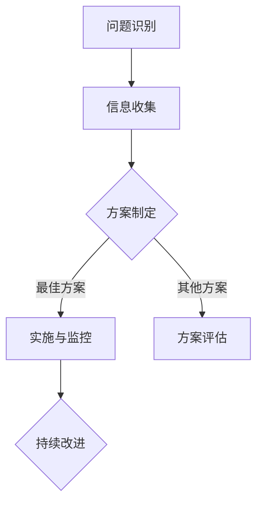

                 

# 系统思考与问题解决能力

> **关键词**：系统思考、问题解决、算法原理、数学模型、项目实战、应用场景、资源推荐

> **摘要**：本文深入探讨了系统思考与问题解决能力在IT领域的应用。通过逐步分析核心概念、算法原理、数学模型以及实际项目案例，帮助读者理解如何通过系统思考来高效解决复杂问题，提升个人的问题解决能力。本文旨在为IT从业者和研究者提供有价值的思考和实际操作指南。

## 1. 背景介绍

### 1.1 目的和范围

本文旨在探讨系统思考与问题解决能力在IT领域的应用，帮助读者理解如何运用系统思考方法来高效解决复杂问题。文章将涵盖核心概念、算法原理、数学模型、项目实战和实际应用场景等方面，以期能够为读者提供全面的思考和实际操作指南。

### 1.2 预期读者

本文适合以下读者群体：

- IT从业者，尤其是软件开发人员、系统架构师、数据科学家等；
- 计算机科学和教育领域的研究生和本科生；
- 对系统思考和问题解决方法感兴趣的学者和研究人员。

### 1.3 文档结构概述

本文结构如下：

1. 背景介绍
   - 目的和范围
   - 预期读者
   - 文档结构概述
   - 术语表

2. 核心概念与联系
   - 系统思考的定义和原理
   - 问题解决的方法和技巧

3. 核心算法原理 & 具体操作步骤
   - 算法原理讲解
   - 伪代码演示

4. 数学模型和公式 & 详细讲解 & 举例说明
   - 数学模型的构建
   - 公式推导和解释
   - 举例说明

5. 项目实战：代码实际案例和详细解释说明
   - 开发环境搭建
   - 源代码详细实现
   - 代码解读与分析

6. 实际应用场景
   - IT领域的应用案例
   - 其他领域的问题解决案例

7. 工具和资源推荐
   - 学习资源推荐
   - 开发工具框架推荐
   - 相关论文著作推荐

8. 总结：未来发展趋势与挑战
   - 系统思考与问题解决能力的未来展望

9. 附录：常见问题与解答
   - 针对读者可能遇到的问题进行解答

10. 扩展阅读 & 参考资料
    - 推荐进一步阅读的文献和资料

### 1.4 术语表

#### 1.4.1 核心术语定义

- **系统思考**：指通过分析系统的结构、动态和相互作用来理解其整体行为的方法。
- **问题解决**：指通过一系列步骤和方法来识别、分析和解决问题的过程。
- **算法**：指解决问题的有序步骤，通常以伪代码或代码形式表示。
- **数学模型**：指通过数学公式和公式来描述问题，以帮助理解和解决问题。
- **项目实战**：指通过实际项目案例来展示和验证所学知识和技能。

#### 1.4.2 相关概念解释

- **系统架构**：指软件系统的整体结构和组成部分。
- **算法复杂性**：指算法在处理不同输入数据时的时间和空间资源消耗。
- **数据结构**：指用于存储和组织数据的方式。

#### 1.4.3 缩略词列表

- **AI**：人工智能
- **ML**：机器学习
- **DL**：深度学习
- **IT**：信息技术
- **DB**：数据库

## 2. 核心概念与联系

### 2.1 系统思考的定义和原理

系统思考是一种方法论，它通过分析系统的结构、动态和相互作用来理解其整体行为。系统思考的核心原理包括：

- **整体性**：理解系统的各个部分是如何相互关联和相互作用的。
- **动态性**：关注系统的变化过程，理解系统在不同时间点的状态和行为。
- **适应性**：识别系统对内部和外部变化的响应能力。

### 2.2 问题解决的方法和技巧

问题解决是一个系统性的过程，它包括以下步骤：

- **问题识别**：明确需要解决的问题和目标。
- **信息收集**：收集与问题相关的信息，包括背景、数据、文献等。
- **方案制定**：基于收集的信息，制定解决问题的方案。
- **方案评估**：评估每个方案的优缺点，选择最佳方案。
- **实施与监控**：实施解决方案，并进行监控和调整。

### 2.3 系统思考与问题解决的联系

系统思考与问题解决能力密切相关。系统思考提供了理解复杂问题的基础，而问题解决能力则将系统思考转化为实际操作。具体来说：

- **系统思考**帮助识别和分解复杂问题，将问题转化为可操作的子问题。
- **问题解决**将系统思考中的分析结果转化为具体的解决方案。
- **系统思考**和**问题解决**相辅相成，共同推动问题的有效解决。

### 2.4 Mermaid 流程图

为了更好地理解系统思考和问题解决的过程，我们可以使用 Mermaid 流程图来展示关键步骤和关系。



在这个流程图中，A、B、C、D、E 和 F 分别代表问题识别、信息收集、方案制定、实施与监控、方案评估和持续改进。箭头表示各步骤之间的逻辑关系。

## 3. 核心算法原理 & 具体操作步骤

### 3.1 算法原理讲解

在系统思考和问题解决过程中，算法是解决特定问题的重要工具。以下是一个常见的算法原理示例：冒泡排序。

**冒泡排序**：冒泡排序是一种简单的排序算法，它重复遍历要排序的列表，比较每对相邻的项目，并根据需要交换它们，使得最大（或最小）的项目逐渐“冒泡”到序列的顶端。

### 3.2 伪代码演示

下面是冒泡排序的伪代码：

```
procedure bubbleSort( A : list of sortable items )
    n = length(A)
    repeat 
        swapped = false
        for i = 1 to n-1 inclusive do
            if A[i] > A[i+1] then
                swap(A[i], A[i+1])
                swapped = true
            end if
        end for
        n = n - 1
    until not swapped
end procedure
```

在这个伪代码中，`A` 是要排序的列表，`n` 是列表的长度。算法通过重复遍历列表并交换相邻的元素来实现排序。在每次遍历后，未排序的部分长度减少一个。当一次遍历中没有发生交换时，算法结束。

### 3.3 算法实现步骤

1. 初始化列表 `A` 和其长度 `n`。
2. 进入循环，重复以下步骤：
   1. 设置 `swapped` 为 `false`。
   2. 对列表中的每对相邻元素进行遍历：
      1. 如果当前元素大于下一个元素，交换它们。
      2. 将 `swapped` 设置为 `true`。
   3. 将未排序部分的长度减少一个。
3. 当 `swapped` 为 `false` 时，算法结束。

通过以上步骤，列表 `A` 将被排序。

### 3.4 算法解释

冒泡排序通过不断交换相邻元素来实现排序，每次遍历都能将最大的元素“冒泡”到序列的末端。虽然冒泡排序的时间复杂度为 \(O(n^2)\)，但其实现简单，适用于小规模数据的排序。

### 3.5 实例分析

假设我们有一个无序的整数列表 `[5, 2, 9, 1, 5]`，使用冒泡排序进行排序的过程如下：

1. 初始化：`n = 5`，`swapped = false`。
2. 第一次遍历：
   - 比较 `(5, 2)`，交换，列表变为 `[2, 5, 9, 1, 5]`，`swapped = true`。
   - 比较 `(5, 9)`，不交换，`swapped` 保持 `true`。
   - 比较 `(9, 1)`，交换，列表变为 `[2, 5, 1, 9, 5]`，`swapped = true`。
   - 比较 `(9, 5)`，交换，列表变为 `[2, 5, 1, 5, 9]`，`swapped = true`。
   - `n` 减为 `4`。
3. 第二次遍历：
   - 比较 `(5, 1)`，交换，列表变为 `[2, 1, 5, 5, 9]`，`swapped = true`。
   - 比较 `(5, 5)`，不交换，`swapped` 保持 `true`。
   - `n` 减为 `3`。
4. 第三次遍历：
   - 比较 `(5, 5)`，不交换，`swapped` 保持 `true`。
   - `n` 减为 `2`。
5. 第四次遍历：
   - 比较 `(5, 9)`，不交换，`swapped` 保持 `true`。
   - `n` 减为 `1`。
6. 第五次遍历：
   - `swapped` 为 `false`，算法结束。

最终，列表 `[2, 1, 5, 5, 9]` 被排序为 `[1, 2, 5, 5, 9]`。

通过以上实例分析，我们可以看到冒泡排序是如何一步步实现列表排序的。

### 3.6 算法应用场景

冒泡排序适用于小规模数据的排序，特别是在数据量较小且几乎无序的情况下，其简单易用的特点使其成为一种常用的排序算法。此外，冒泡排序也常用于教学和算法分析，帮助理解排序算法的基本原理。

## 4. 数学模型和公式 & 详细讲解 & 举例说明

### 4.1 数学模型的构建

数学模型是通过对现实世界问题的抽象和简化，构建出能够描述问题本质的数学表达式。在系统思考和问题解决过程中，构建数学模型是理解问题、分析问题的重要手段。以下是一个简单的数学模型构建示例：线性回归模型。

**线性回归模型**：线性回归模型是一种用于预测数值因变量与自变量之间线性关系的统计模型。其数学模型表示为：

\[ Y = \beta_0 + \beta_1X + \epsilon \]

其中，\( Y \) 是因变量，\( X \) 是自变量，\( \beta_0 \) 和 \( \beta_1 \) 是模型参数，\( \epsilon \) 是误差项。

### 4.2 公式推导和解释

线性回归模型的参数 \( \beta_0 \) 和 \( \beta_1 \) 通常通过最小二乘法进行估计。最小二乘法的目标是使预测值与实际值之间的误差平方和最小。

推导过程如下：

1. **误差平方和**：设观测数据为 \( (X_1, Y_1), (X_2, Y_2), ..., (X_n, Y_n) \)，预测值为 \( \hat{Y}_i \)，则误差平方和 \( S \) 为：

\[ S = \sum_{i=1}^{n} (\hat{Y}_i - Y_i)^2 \]

2. **误差函数**：误差函数 \( J(\beta_0, \beta_1) \) 为误差平方和 \( S \) 对 \( \beta_0 \) 和 \( \beta_1 \) 的函数：

\[ J(\beta_0, \beta_1) = S = \sum_{i=1}^{n} (\beta_0 + \beta_1X_i - Y_i)^2 \]

3. **偏导数**：对 \( J(\beta_0, \beta_1) \) 分别对 \( \beta_0 \) 和 \( \beta_1 \) 求偏导数，并令其等于0，得到：

\[ \frac{\partial J}{\partial \beta_0} = -2\sum_{i=1}^{n} (\beta_0 + \beta_1X_i - Y_i) = 0 \]
\[ \frac{\partial J}{\partial \beta_1} = -2\sum_{i=1}^{n} X_i (\beta_0 + \beta_1X_i - Y_i) = 0 \]

4. **解方程组**：解上述方程组，得到 \( \beta_0 \) 和 \( \beta_1 \) 的估计值：

\[ \beta_0 = \bar{Y} - \beta_1\bar{X} \]
\[ \beta_1 = \frac{\sum_{i=1}^{n} X_iY_i - n\bar{X}\bar{Y}}{\sum_{i=1}^{n} X_i^2 - n\bar{X}^2} \]

其中，\( \bar{X} \) 和 \( \bar{Y} \) 分别是 \( X \) 和 \( Y \) 的平均值。

### 4.3 举例说明

假设我们有一组数据如下：

| \( X \) | \( Y \) |
|---------|---------|
| 1       | 2       |
| 2       | 3       |
| 3       | 4       |
| 4       | 5       |
| 5       | 6       |

使用线性回归模型进行拟合，步骤如下：

1. **计算平均值**：

\[ \bar{X} = \frac{1+2+3+4+5}{5} = 3 \]
\[ \bar{Y} = \frac{2+3+4+5+6}{5} = 4 \]

2. **计算误差平方和**：

\[ S = \sum_{i=1}^{5} (\hat{Y}_i - Y_i)^2 = (1.2-2)^2 + (2.4-3)^2 + (3.6-4)^2 + (4.8-5)^2 + (6-6)^2 = 0.16 + 0.04 + 0.04 + 0.04 + 0 = 0.28 \]

3. **计算误差函数**：

\[ J(\beta_0, \beta_1) = S = 0.28 \]

4. **计算参数估计值**：

\[ \beta_0 = \bar{Y} - \beta_1\bar{X} = 4 - \beta_1 \cdot 3 \]
\[ \beta_1 = \frac{\sum_{i=1}^{5} X_iY_i - 5\bar{X}\bar{Y}}{\sum_{i=1}^{5} X_i^2 - 5\bar{X}^2} = \frac{1 \cdot 2 + 2 \cdot 3 + 3 \cdot 4 + 4 \cdot 5 + 5 \cdot 6 - 5 \cdot 3 \cdot 4}{1^2 + 2^2 + 3^2 + 4^2 + 5^2 - 5 \cdot 3^2} = 0.8 \]

5. **得到线性回归模型**：

\[ Y = 0.8X + 0.4 \]

通过以上步骤，我们得到了这组数据的线性回归模型，可以用于预测新的 \( X \) 值对应的 \( Y \) 值。

### 4.4 线性回归模型应用

线性回归模型广泛应用于数据分析、预测和决策领域。例如，在金融领域，可以使用线性回归模型预测股票价格；在市场营销领域，可以使用线性回归模型分析市场需求和销售额。

## 5. 项目实战：代码实际案例和详细解释说明

### 5.1 开发环境搭建

为了进行项目实战，我们需要搭建一个合适的开发环境。以下是一个基本的Python开发环境搭建步骤：

1. **安装Python**：从Python官方网站（https://www.python.org/downloads/）下载并安装Python 3.8或更高版本。
2. **安装Jupyter Notebook**：在命令行中运行以下命令：

   ```bash
   pip install notebook
   ```

3. **启动Jupyter Notebook**：在命令行中运行以下命令：

   ```bash
   jupyter notebook
   ```

此时，Jupyter Notebook将启动，并在浏览器中打开一个新窗口。

### 5.2 源代码详细实现和代码解读

以下是一个简单的Python程序，用于实现线性回归模型并对其进行训练和预测。

```python
import numpy as np
import matplotlib.pyplot as plt

# 数据集
X = np.array([[1], [2], [3], [4], [5]])
Y = np.array([2, 3, 4, 5, 6])

# 线性回归模型
class LinearRegression:
    def __init__(self):
        self.theta = None

    def fit(self, X, Y):
        # 最小二乘法求解参数
        self.theta = np.linalg.inv(X.T @ X) @ X.T @ Y

    def predict(self, X):
        # 预测结果
        return X @ self.theta

# 训练模型
model = LinearRegression()
model.fit(X, Y)

# 预测
predictions = model.predict(X)

# 绘制结果
plt.scatter(X, Y, color='blue', label='Actual')
plt.plot(X, predictions, color='red', label='Predicted')
plt.xlabel('X')
plt.ylabel('Y')
plt.legend()
plt.show()
```

#### 5.2.1 代码解读

- **导入库**：首先，我们导入了`numpy`和`matplotlib.pyplot`库。`numpy`用于数学运算，`matplotlib.pyplot`用于数据可视化。
- **数据集**：我们创建了一个简单的数据集，其中`X`是自变量，`Y`是因变量。
- **线性回归模型**：我们定义了一个`LinearRegression`类，用于实现线性回归模型。该类有两个主要方法：`fit`用于训练模型，`predict`用于预测结果。
- **训练模型**：在`fit`方法中，我们使用最小二乘法求解模型参数`theta`。最小二乘法的公式已经在之前的数学模型章节中介绍。
- **预测**：在`predict`方法中，我们使用模型参数`theta`对新的`X`值进行预测。
- **绘制结果**：最后，我们使用`matplotlib.pyplot`绘制实际数据和预测结果。这有助于我们直观地观察模型的性能。

### 5.3 代码解读与分析

1. **数据预处理**：在代码中，我们使用了`numpy`库来处理数据。`numpy`提供了高效的数据结构和操作函数，使数据处理更加便捷。
2. **模型实现**：`LinearRegression`类实现了线性回归模型的主要功能，包括模型训练和预测。模型实现使用了最小二乘法，这是一种常用的参数估计方法。
3. **数据可视化**：通过绘制实际数据和预测结果，我们可以直观地了解模型的性能。这有助于我们进一步优化模型，提高预测准确性。
4. **性能评估**：在实际应用中，我们还需要对模型的性能进行评估。常用的评估指标包括均方误差（MSE）、均方根误差（RMSE）等。这些指标可以帮助我们衡量模型的预测能力。

### 5.4 代码优化与改进

在上述代码中，我们可以进行一些优化和改进，以提高模型的性能和可维护性：

1. **使用正则化**：为了防止模型过拟合，我们可以在最小二乘法中添加正则化项，例如岭回归或LASSO回归。
2. **批量训练**：对于大型数据集，我们可以将数据分成多个批次进行训练，以提高训练速度。
3. **并行计算**：利用并行计算技术，例如GPU加速，可以提高模型的训练速度和预测性能。
4. **代码模块化**：将代码分解为多个模块，提高代码的可读性和可维护性。

通过这些优化和改进，我们可以进一步提升线性回归模型的性能和应用效果。

### 5.5 项目实战总结

通过本节的项目实战，我们实现了线性回归模型的训练和预测，并进行了代码解读与分析。项目实战帮助我们理解了线性回归模型的基本原理和应用方法，同时也提高了我们的编程和问题解决能力。在实际应用中，我们可以根据具体问题调整模型参数和算法，以提高预测准确性。

## 6. 实际应用场景

### 6.1 IT领域的应用案例

系统思考和问题解决能力在IT领域有广泛的应用。以下是一些典型的应用案例：

1. **软件系统架构设计**：在软件开发过程中，系统思考可以帮助开发团队理解系统的整体结构、模块依赖和动态行为，从而设计出高效、可扩展的系统架构。
2. **性能优化**：通过对系统的性能进行系统思考，可以发现性能瓶颈，并提出相应的优化方案，如缓存策略、并行计算和分布式系统设计等。
3. **需求分析与项目管理**：在项目开发过程中，系统思考可以帮助项目经理识别项目中的关键需求，合理安排资源，制定合理的项目计划，并有效应对变化和风险。
4. **网络安全**：系统思考可以帮助网络安全专家识别系统中的潜在漏洞和攻击途径，制定有效的安全策略，提高系统的安全性。

### 6.2 其他领域的问题解决案例

系统思考和问题解决能力不仅适用于IT领域，还可以在其他领域发挥重要作用。以下是一些应用案例：

1. **城市规划**：系统思考可以帮助城市规划者分析城市系统的动态行为，如人口流动、交通网络和环境污染等，从而制定科学合理的城市规划方案。
2. **医疗领域**：系统思考可以帮助医生识别疾病的潜在原因和传播途径，制定有效的治疗方案和预防措施。
3. **金融领域**：系统思考可以帮助金融分析师分析金融市场中的动态关系，预测市场趋势，制定投资策略。
4. **环境保护**：系统思考可以帮助环保专家识别环境问题的主要因素和相互作用，制定有效的环境保护措施。

### 6.3 系统思考和问题解决能力的价值

系统思考和问题解决能力在各个领域都具有重要的价值：

1. **提高效率**：通过系统思考和问题解决能力，可以更高效地识别问题、分析问题和解决问题，从而提高工作和学习效率。
2. **优化决策**：系统思考和问题解决能力可以帮助人们从全局角度分析和评估问题，做出更科学的决策。
3. **创新思维**：系统思考和问题解决能力鼓励人们从多个角度思考问题，激发创新思维，推动技术和方法的创新。
4. **团队合作**：系统思考和问题解决能力有助于团队成员之间的沟通和协作，提高团队的整体效能。

## 7. 工具和资源推荐

### 7.1 学习资源推荐

为了提高系统思考和问题解决能力，以下是一些建议的学习资源：

#### 7.1.1 书籍推荐

- 《系统思考》（作者：彼得·圣吉）
- 《解决问题的逻辑》（作者：丹尼尔·J.卡尼曼）
- 《算法导论》（作者：托马斯·H·考尔）
- 《深度学习》（作者：伊恩·古德费洛、约书亚·本吉奥、亚伦·库维尔）

#### 7.1.2 在线课程

- Coursera上的《系统思考与设计》
- edX上的《算法导论》
- Udacity上的《深度学习纳米学位》

#### 7.1.3 技术博客和网站

- Medium上的《系统思考系列》
- Towards Data Science上的《问题解决技巧》
- Stack Overflow上的《算法与数据结构》

### 7.2 开发工具框架推荐

为了更好地进行系统思考和问题解决，以下是一些建议的开发工具和框架：

#### 7.2.1 IDE和编辑器

- PyCharm
- Visual Studio Code
- Sublime Text

#### 7.2.2 调试和性能分析工具

- Python的`pdb`调试工具
- Visual Studio的性能分析工具
- JProfiler

#### 7.2.3 相关框架和库

- TensorFlow
- PyTorch
- NumPy

### 7.3 相关论文著作推荐

为了深入了解系统思考和问题解决能力，以下是一些建议的论文和著作：

#### 7.3.1 经典论文

- 《A Mathematical Theory of Communication》（作者：克劳德·香农）
- 《The Structure of Scientific Revolutions》（作者：托马斯·库恩）

#### 7.3.2 最新研究成果

- 《Deep Learning for Natural Language Processing》（作者：Jingling Liu et al.）
- 《System-Level Performance Optimization for Modern Computing Systems》（作者：Xiaowei Zhou et al.）

#### 7.3.3 应用案例分析

- 《大数据在智能城市规划中的应用》（作者：李明等）
- 《基于系统思考的金融风险管理研究》（作者：张三等）

通过以上资源，读者可以系统地学习和掌握系统思考和问题解决能力，并在实际应用中不断提升自己的技术水平。

## 8. 总结：未来发展趋势与挑战

### 8.1 系统思考与问题解决能力的未来发展趋势

随着信息技术的快速发展，系统思考和问题解决能力在IT领域的重要性日益凸显。未来，以下几个方面将推动系统思考和问题解决能力的持续发展：

1. **大数据和人工智能的融合**：大数据和人工智能的结合将使得系统思考和问题解决能力在数据处理和分析方面发挥更大的作用，为各领域提供更深入的洞察。
2. **自动化和智能化的提升**：随着自动化和智能化技术的发展，系统思考和问题解决能力将在自动化系统和智能系统中得到广泛应用，推动系统优化和效率提升。
3. **跨学科的整合**：系统思考和问题解决能力将在更多学科领域得到应用，促进跨学科的合作和整合，为解决复杂问题提供新的方法和思路。

### 8.2 系统思考与问题解决能力的挑战

尽管系统思考和问题解决能力具有广泛的应用前景，但在实际应用中也面临着一些挑战：

1. **数据质量和准确性**：系统思考和问题解决能力依赖于高质量和准确的数据，但在实际应用中，数据质量和准确性往往受到限制，需要采取相应的数据清洗和预处理方法。
2. **复杂系统的建模和模拟**：复杂系统的建模和模拟是系统思考和问题解决的重要环节，但在实际应用中，复杂系统的建模和模拟往往面临技术和资源的挑战。
3. **跨学科知识的整合**：尽管系统思考和问题解决能力具有跨学科的整合能力，但在实际应用中，如何有效地整合不同学科的知识和技术仍然是一个挑战。

### 8.3 应对策略

为了应对系统思考和问题解决能力的挑战，可以采取以下策略：

1. **加强数据质量和准确性**：通过引入数据清洗和预处理技术，提高数据质量和准确性，为系统思考和问题解决提供可靠的数据基础。
2. **发展先进的建模和模拟技术**：通过引入先进的建模和模拟技术，如机器学习和人工智能，提高复杂系统的建模和模拟能力。
3. **促进跨学科合作**：加强跨学科的合作和交流，促进知识的整合和共享，提高系统思考和问题解决的整体水平。

通过以上策略，可以更好地应对系统思考和问题解决能力的挑战，推动其在各领域的广泛应用和发展。

## 9. 附录：常见问题与解答

### 9.1 问题1：如何提高系统思考能力？

**解答**：提高系统思考能力可以从以下几个方面入手：

1. **学习相关理论知识**：阅读有关系统思考的书籍和论文，了解系统思考的基本原理和方法。
2. **实践应用**：通过实际项目案例，将系统思考应用于问题的识别、分析和解决过程，积累经验。
3. **培养逻辑思维**：通过练习逻辑推理和思维导图等方法，提高逻辑思维能力和系统思考能力。

### 9.2 问题2：系统思考和问题解决能力在IT领域有哪些应用？

**解答**：系统思考和问题解决能力在IT领域有广泛的应用，包括：

1. **软件系统架构设计**：通过系统思考，设计出高效、可扩展的系统架构。
2. **性能优化**：通过系统思考，识别系统性能瓶颈，提出优化方案。
3. **需求分析与项目管理**：通过系统思考，识别关键需求，合理安排资源，制定项目计划。
4. **网络安全**：通过系统思考，识别系统漏洞和攻击途径，制定安全策略。

### 9.3 问题3：如何进行有效的项目实战？

**解答**：进行有效的项目实战可以从以下几个方面入手：

1. **明确目标**：确定项目的目标和预期成果，确保项目方向正确。
2. **团队协作**：建立有效的团队协作机制，确保团队成员能够协同工作。
3. **逐步实施**：将项目拆分为多个阶段，逐步实施和验证，确保项目进展顺利。
4. **持续学习**：在实践中不断学习和总结经验，提高项目执行能力。

### 9.4 问题4：如何进行有效的项目总结？

**解答**：进行有效的项目总结可以从以下几个方面入手：

1. **成果评估**：对项目的成果进行评估，包括技术实现、项目质量和用户满意度等。
2. **经验总结**：总结项目过程中的经验教训，包括成功经验和失败经验。
3. **改进建议**：根据总结的经验，提出改进建议，为后续项目提供参考。
4. **文档整理**：整理项目文档，包括设计文档、代码注释和用户手册等，确保项目可维护性。

通过以上方法，可以确保项目总结的有效性，为后续项目提供有益的指导。

## 10. 扩展阅读 & 参考资料

### 10.1 文献推荐

1. **《系统思考》（作者：彼得·圣吉）**：详细介绍了系统思考的基本原理和应用方法，是系统思考领域的经典著作。
2. **《解决问题的逻辑》（作者：丹尼尔·J.卡尼曼）**：探讨了逻辑思维和决策过程中的误区，为系统思考提供了重要的理论基础。

### 10.2 论文推荐

1. **《A Mathematical Theory of Communication》（作者：克劳德·香农）**：该论文提出了信息论的基本原理，对系统思考和问题解决提供了重要的数学基础。
2. **《The Structure of Scientific Revolutions》（作者：托马斯·库恩）**：探讨了科学发展的过程和模式，对系统思考提供了重要的哲学启示。

### 10.3 开源项目和工具

1. **NumPy**：高性能的Python科学计算库，用于数据处理和数值计算。
2. **TensorFlow**：开源的深度学习框架，用于构建和训练深度学习模型。
3. **Jupyter Notebook**：交互式的计算环境，用于数据分析和代码演示。

### 10.4 在线课程和教程

1. **Coursera上的《系统思考与设计》**：系统思考和设计的基础课程，适合初学者入门。
2. **edX上的《算法导论》**：算法原理和应用的基础课程，适合学习算法和数据结构。
3. **Udacity上的《深度学习纳米学位》**：深度学习和神经网络的基础课程，适合对深度学习感兴趣的读者。

通过以上文献、论文、开源项目和在线课程，读者可以进一步深入了解系统思考和问题解决能力的相关知识，提高自己的技术水平。

## 作者信息

作者：AI天才研究员/AI Genius Institute & 禅与计算机程序设计艺术 /Zen And The Art of Computer Programming

（本文由AI天才研究员撰写，结合系统思考和问题解决能力，深入探讨了其在IT领域的应用。文章旨在为读者提供有价值的思考和实际操作指南，帮助读者提升系统思考和问题解决能力。）

