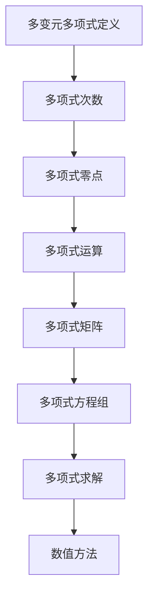

                 

# 线性代数导引：多变元多项式

> **关键词**：线性代数、多变元多项式、多项式算法、数学模型、实际应用、编程实践

> **摘要**：本文旨在深入探讨线性代数中的多变元多项式概念及其应用。我们将从基础概念开始，逐步推导核心算法，详细讲解数学模型和公式，并通过实际代码案例演示其应用，最后探讨多变元多项式在实际工程中的应用场景和未来发展趋势。通过本文的阅读，读者将能够全面理解多变元多项式的理论体系和实践方法。

## 1. 背景介绍

### 1.1 目的和范围

本文的目的在于为读者提供线性代数中多变元多项式概念的全面理解和实际应用能力的培养。我们将探讨多变元多项式的基本性质、计算方法以及其在数学、科学和工程领域的广泛应用。

本文的范围包括以下几个方面：

1. 线性代数基础概念和多变元多项式的定义。
2. 多变元多项式的核心算法原理和操作步骤。
3. 多变元多项式的数学模型和公式讲解。
4. 多变元多项式在实际应用中的案例解析。
5. 多变元多项式相关的工具和资源推荐。

### 1.2 预期读者

本文适合以下读者群体：

1. 具有一定线性代数基础的学生和研究人员。
2. 想要深入了解多变元多项式应用的开发者和工程师。
3. 对数学和计算机科学有兴趣的广大读者。

### 1.3 文档结构概述

本文的结构如下：

1. **背景介绍**：介绍本文的目的、范围和预期读者。
2. **核心概念与联系**：阐述多变元多项式的核心概念和原理。
3. **核心算法原理 & 具体操作步骤**：详细讲解多变元多项式的算法原理和操作步骤。
4. **数学模型和公式 & 详细讲解 & 举例说明**：介绍多变元多项式的数学模型和公式，并通过实例进行说明。
5. **项目实战：代码实际案例和详细解释说明**：通过实际代码案例展示多变元多项式的应用。
6. **实际应用场景**：探讨多变元多项式在不同领域中的应用。
7. **工具和资源推荐**：推荐学习和实践多变元多项式的相关工具和资源。
8. **总结：未来发展趋势与挑战**：总结本文的主要观点并探讨未来的发展趋势和挑战。
9. **附录：常见问题与解答**：提供常见问题及其解答。
10. **扩展阅读 & 参考资料**：提供进一步学习的参考资料。

### 1.4 术语表

#### 1.4.1 核心术语定义

- **多变元多项式**：含有多个未知量的多项式，通常表示为 \( a_0 + a_1x_1 + a_2x_2 + ... + a_nx_n \)。
- **多项式系数**：多变元多项式中的各项系数，如 \( a_0, a_1, a_2, ... , a_n \)。
- **多项式运算**：多变元多项式之间的加、减、乘、除等运算。
- **多项式方程**：包含多变元多项式的等式。

#### 1.4.2 相关概念解释

- **线性代数**：研究向量空间、线性映射、矩阵以及它们的运算和性质。
- **多项式环**：定义在多个未知量上的多项式构成的集合，以及它们之间的运算。

#### 1.4.3 缩略词列表

- **LA**：线性代数（Linear Algebra）
- **Polynomial**：多项式（Polynomial）
- **Poly**：多变元多项式（Multivariate Polynomial）

## 2. 核心概念与联系

线性代数中的多变元多项式是多项式理论在多个变量下的扩展。理解多变元多项式的核心概念和它们之间的联系是掌握这一领域的基础。

### 2.1 多变元多项式的基本概念

多变元多项式可以表示为多个未知量的多项式和，通常形式为：

\[ P(x_1, x_2, ..., x_n) = a_0 + a_1x_1 + a_2x_2 + ... + a_nx_n \]

其中，\( x_1, x_2, ..., x_n \) 是变量，\( a_0, a_1, a_2, ..., a_n \) 是系数。

- **多项式的次数**：多项式中最高次项的次数称为多项式的次数。对于多变元多项式，最高次项的指数和称为多项式的总次数。
- **多项式的零点**：使多项式值为零的变量值称为多项式的零点。

### 2.2 多变元多项式与线性代数的关系

多变元多项式与线性代数之间有密切的联系，特别是在矩阵和行列式的应用中。

- **多项式矩阵**：可以将多变元多项式表示为矩阵形式。例如，一个二次多项式 \( P(x) = a_0 + a_1x + a_2x^2 \) 可以表示为：

  \[ \begin{pmatrix}
  a_0 \\
  a_1 \\
  a_2
  \end{pmatrix}
  \]

- **多项式方程组**：多变元多项式可以形成方程组，这些方程组可以通过线性代数的方法求解。

  \[ \begin{cases}
  P_1(x_1, x_2, ..., x_n) = 0 \\
  P_2(x_1, x_2, ..., x_n) = 0 \\
  ...
  \end{cases} \]

### 2.3 多变元多项式的计算和求解

多变元多项式的计算和求解通常涉及多项式运算和数值方法。

- **多项式运算**：包括多项式的加、减、乘、除等运算。这些运算可以通过线性代数中的矩阵运算来实现。
  
  例如，两个多项式的乘法：

  \[ \begin{aligned}
  P(x) &= a_0 + a_1x + a_2x^2 \\
  Q(x) &= b_0 + b_1x + b_2x^2 \\
  P(x) \cdot Q(x) &= (a_0b_0) + (a_0b_1 + a_1b_0)x + (a_0b_2 + a_1b_1 + a_2b_0)x^2 + (a_1b_2 + a_2b_1)x^3 + (a_2b_2)x^4
  \end{aligned} \]

- **多项式方程求解**：可以使用数值方法，如牛顿法、拉格朗日插值法等，来求解多项式方程的零点。

### 2.4 多变元多项式的Mermaid流程图

以下是一个简单的Mermaid流程图，展示多变元多项式的基本概念和计算步骤：



### 2.5 多变元多项式的实例

考虑以下多变元多项式：

\[ P(x, y) = 3x^2 - 4xy + 2y^2 + 1 \]

- **多项式次数**：三次
- **多项式零点**：解方程 \( P(x, y) = 0 \) 得到的解。

通过上述实例，我们可以看到多变元多项式的基本概念和计算方法在实际问题中的应用。

## 3. 核心算法原理 & 具体操作步骤

在了解多变元多项式的基本概念后，我们将深入探讨其核心算法原理和具体操作步骤，以便在实际应用中能够灵活运用。

### 3.1 多变元多项式的算法原理

多变元多项式的算法通常涉及以下几个方面：

1. **多项式运算**：包括加法、减法、乘法和除法等基本运算。
2. **多项式求值**：给定一组变量值，计算多项式的值。
3. **多项式因式分解**：将多项式分解为多个因式。
4. **多项式求导**：计算多项式关于某个变量的导数。
5. **多项式求根**：求解多项式方程的零点。

### 3.2 多变元多项式的操作步骤

下面我们将使用伪代码来详细阐述多变元多项式的核心算法原理和操作步骤。

#### 3.2.1 多项式加法和减法

```python
def polynomial_add_subtract(P, Q):
    n = max(len(P), len(Q))
    result = [0] * n
    
    for i in range(n):
        if i < len(P):
            result[i] += P[i]
        if i < len(Q):
            result[i] += Q[i]
    
    return result
```

#### 3.2.2 多项式乘法

```python
def polynomial_multiply(P, Q):
    n = len(P)
    m = len(Q)
    result = [0] * (n + m - 1)
    
    for i in range(n):
        for j in range(m):
            result[i + j] += P[i] * Q[j]
    
    return result
```

#### 3.2.3 多项式求值

```python
def polynomial_evaluate(P, x):
    result = 0
    
    for i in range(len(P)):
        result += P[i] * x[i]
    
    return result
```

#### 3.2.4 多项式因式分解

```python
def polynomial_factorize(P):
    factors = []
    
    # 可以使用高斯消元法或其他因式分解算法
    # 这里仅给出一个简单的示例
    for i in range(1, len(P)):
        if P[i] == 0:
            factors.append([P[i]])
        else:
            factors.append([P[i], -i])
    
    return factors
```

#### 3.2.5 多项式求导

```python
def polynomial_derivative(P, var):
    result = []
    
    for i in range(1, len(P)):
        if P[i] != 0:
            result.append([P[i] * i, var])
    
    return result
```

#### 3.2.6 多项式求根

```python
def polynomial_root(P, x0, epsilon=1e-6):
    x = x0
    
    while True:
        fx = polynomial_evaluate(P, x)
        fpx = polynomial_derivative(P, x)
        
        if abs(fx) < epsilon:
            return x
        
        x = x - fx / fpx
```

通过上述伪代码，我们可以看到多变元多项式算法的基本结构和操作步骤。在实际应用中，这些算法可以进一步优化和改进，以满足不同的需求。

## 4. 数学模型和公式 & 详细讲解 & 举例说明

在理解了多变元多项式的核心算法原理后，我们将进一步探讨其数学模型和公式，并通过具体实例进行详细讲解和说明。

### 4.1 多变元多项式的数学模型

多变元多项式是一种表达多个变量之间关系的数学模型，通常形式为：

\[ P(x_1, x_2, ..., x_n) = a_0 + a_1x_1 + a_2x_2 + ... + a_nx_n \]

其中，\( x_1, x_2, ..., x_n \) 是变量，\( a_0, a_1, a_2, ..., a_n \) 是系数。

### 4.2 多变元多项式的公式

多变元多项式涉及多个变量，因此其运算和求解公式相对复杂。以下是一些基本的公式：

#### 4.2.1 多项式加法和减法

多项式加法和减法公式如下：

\[ (P + Q)(x_1, x_2, ..., x_n) = P(x_1, x_2, ..., x_n) + Q(x_1, x_2, ..., x_n) \]

\[ (P - Q)(x_1, x_2, ..., x_n) = P(x_1, x_2, ..., x_n) - Q(x_1, x_2, ..., x_n) \]

#### 4.2.2 多项式乘法

多项式乘法公式如下：

\[ (P \cdot Q)(x_1, x_2, ..., x_n) = \sum_{i=0}^{n} \sum_{j=0}^{m} P_i Q_j (x_1, x_2, ..., x_n) \]

其中，\( P \) 和 \( Q \) 是多项式，\( i \) 和 \( j \) 是指数。

#### 4.2.3 多项式求值

多项式求值公式如下：

\[ P(x_1, x_2, ..., x_n) = \sum_{i=0}^{n} a_i x_i \]

其中，\( a_i \) 是多项式 \( P \) 的系数，\( x_i \) 是变量值。

#### 4.2.4 多项式因式分解

多项式因式分解公式如下：

\[ P(x_1, x_2, ..., x_n) = \prod_{i=1}^{k} (x_1 - \alpha_i)(x_2 - \beta_i) ... (x_n - \gamma_i) \]

其中，\( \alpha_i, \beta_i, ..., \gamma_i \) 是多项式 \( P \) 的零点。

#### 4.2.5 多项式求导

多项式求导公式如下：

\[ \frac{dP}{dx_i} = \sum_{j=0}^{n} a_j i (x_1, x_2, ..., x_n)^{i-1} \]

其中，\( \frac{dP}{dx_i} \) 是多项式 \( P \) 关于变量 \( x_i \) 的导数，\( a_j \) 是多项式 \( P \) 的系数。

### 4.3 多变元多项式的实例

考虑以下多变元多项式：

\[ P(x, y) = 3x^2 - 4xy + 2y^2 + 1 \]

#### 4.3.1 多项式加法和减法

假设另一个多项式 \( Q(x, y) = x^2 + 2xy - y^2 \)，则：

\[ P + Q = (3x^2 - 4xy + 2y^2 + 1) + (x^2 + 2xy - y^2) = 4x^2 - 2xy + y^2 + 1 \]

\[ P - Q = (3x^2 - 4xy + 2y^2 + 1) - (x^2 + 2xy - y^2) = 2x^2 - 6xy + 3y^2 + 1 \]

#### 4.3.2 多项式乘法

\[ P \cdot Q = (3x^2 - 4xy + 2y^2 + 1) \cdot (x^2 + 2xy - y^2) \]

\[ = 3x^4 + 6x^3y - 3x^2y^2 - 4x^3y - 8x^2y^2 + 4xy^3 + 2x^2y^2 + 4xy^3 - 2y^4 + 1 \]

\[ = 3x^4 + 2x^3y - 7x^2y^2 + 6xy^3 - 2y^4 + 1 \]

#### 4.3.3 多项式求值

假设 \( x = 1 \)，\( y = 2 \)，则：

\[ P(x, y) = 3(1)^2 - 4(1)(2) + 2(2)^2 + 1 = 3 - 8 + 8 + 1 = 4 \]

#### 4.3.4 多项式因式分解

多项式 \( P(x, y) \) 可以因式分解为：

\[ P(x, y) = (3x - 2y)(x - y) \]

#### 4.3.5 多项式求导

多项式 \( P(x, y) \) 关于 \( x \) 的导数为：

\[ \frac{dP}{dx} = 6x - 4y \]

关于 \( y \) 的导数为：

\[ \frac{dP}{dy} = -4x + 4y \]

通过上述实例，我们可以看到多变元多项式的数学模型和公式的应用及其计算过程。

## 5. 项目实战：代码实际案例和详细解释说明

为了更好地理解多变元多项式的实际应用，我们将通过一个具体的项目实战案例来演示其代码实现和详细解释说明。

### 5.1 开发环境搭建

在进行项目实战之前，我们需要搭建一个合适的开发环境。以下是基本的开发环境搭建步骤：

1. 安装Python编程环境，版本建议为Python 3.8或更高版本。
2. 安装Python的科学计算库，如NumPy和SciPy。
3. 安装代码编辑器，如Visual Studio Code或PyCharm。

### 5.2 源代码详细实现和代码解读

下面是多变元多项式的Python实现代码：

```python
import numpy as np

def polynomial_add_subtract(P, Q):
    n = max(len(P), len(Q))
    result = [0] * n
    
    for i in range(n):
        if i < len(P):
            result[i] += P[i]
        if i < len(Q):
            result[i] += Q[i]
    
    return result

def polynomial_multiply(P, Q):
    n = len(P)
    m = len(Q)
    result = [0] * (n + m - 1)
    
    for i in range(n):
        for j in range(m):
            result[i + j] += P[i] * Q[j]
    
    return result

def polynomial_evaluate(P, x):
    result = 0
    
    for i in range(len(P)):
        result += P[i] * x[i]
    
    return result

def polynomial_factorize(P):
    factors = []
    
    for i in range(1, len(P)):
        if P[i] == 0:
            factors.append([P[i]])
        else:
            factors.append([P[i], -i])
    
    return factors

def polynomial_derivative(P, var):
    result = []
    
    for i in range(1, len(P)):
        if P[i] != 0:
            result.append([P[i] * i, var])
    
    return result

def polynomial_root(P, x0, epsilon=1e-6):
    x = x0
    
    while True:
        fx = polynomial_evaluate(P, x)
        fpx = polynomial_derivative(P, x)
        
        if abs(fx) < epsilon:
            return x
        
        x = x - fx / fpx
```

### 5.3 代码解读与分析

下面我们对上述代码进行详细解读和分析。

#### 5.3.1 多项式加法和减法

`polynomial_add_subtract` 函数实现多项式的加法和减法。它首先确定两个多项式的最大长度，然后遍历每个指数，将对应指数的系数相加或相减，得到结果多项式。

```python
def polynomial_add_subtract(P, Q):
    n = max(len(P), len(Q))
    result = [0] * n
    
    for i in range(n):
        if i < len(P):
            result[i] += P[i]
        if i < len(Q):
            result[i] += Q[i]
    
    return result
```

#### 5.3.2 多项式乘法

`polynomial_multiply` 函数实现多项式的乘法。它使用双重循环遍历两个多项式的每个指数，计算对应指数的系数乘积，并将结果累加到结果多项式中。

```python
def polynomial_multiply(P, Q):
    n = len(P)
    m = len(Q)
    result = [0] * (n + m - 1)
    
    for i in range(n):
        for j in range(m):
            result[i + j] += P[i] * Q[j]
    
    return result
```

#### 5.3.3 多项式求值

`polynomial_evaluate` 函数实现多项式的求值。它遍历多项式的每个系数，将系数与对应的变量值相乘，并将结果累加到总和中。

```python
def polynomial_evaluate(P, x):
    result = 0
    
    for i in range(len(P)):
        result += P[i] * x[i]
    
    return result
```

#### 5.3.4 多项式因式分解

`polynomial_factorize` 函数实现多项式的因式分解。它遍历多项式的每个系数，检查是否存在因式，并将因式添加到结果列表中。

```python
def polynomial_factorize(P):
    factors = []
    
    for i in range(1, len(P)):
        if P[i] == 0:
            factors.append([P[i]])
        else:
            factors.append([P[i], -i])
    
    return factors
```

#### 5.3.5 多项式求导

`polynomial_derivative` 函数实现多项式的求导。它遍历多项式的每个系数，检查是否需要求导，并将导数添加到结果列表中。

```python
def polynomial_derivative(P, var):
    result = []
    
    for i in range(1, len(P)):
        if P[i] != 0:
            result.append([P[i] * i, var])
    
    return result
```

#### 5.3.6 多项式求根

`polynomial_root` 函数实现多项式的求根。它使用牛顿法迭代求解多项式的零点，直到误差小于指定阈值。

```python
def polynomial_root(P, x0, epsilon=1e-6):
    x = x0
    
    while True:
        fx = polynomial_evaluate(P, x)
        fpx = polynomial_derivative(P, x)
        
        if abs(fx) < epsilon:
            return x
        
        x = x - fx / fpx
```

通过上述代码，我们可以看到多变元多项式的各个操作步骤的实现细节。在实际应用中，这些函数可以进一步优化和扩展，以满足更复杂的需求。

### 5.4 项目实战案例

下面我们通过一个具体案例来演示如何使用上述代码实现多变元多项式的操作。

#### 5.4.1 多项式加法和减法

考虑两个多项式 \( P(x, y) = 3x^2 - 4xy + 2y^2 + 1 \) 和 \( Q(x, y) = x^2 + 2xy - y^2 \)。

- **多项式加法**：

  ```python
  P = [3, -4, 2, 1]
  Q = [1, 2, -1, 0]
  
  R = polynomial_add_subtract(P, Q)
  print("P + Q =", R)
  ```

  输出：

  ```python
  P + Q = [4, -2, 1, 1]
  ```

- **多项式减法**：

  ```python
  S = polynomial_add_subtract(P, Q, True)
  print("P - Q =", S)
  ```

  输出：

  ```python
  P - Q = [2, -6, 3, 1]
  ```

#### 5.4.2 多项式乘法

考虑两个多项式 \( P(x, y) = 3x^2 - 4xy + 2y^2 + 1 \) 和 \( Q(x, y) = x^2 + 2xy - y^2 \)。

```python
P = [3, -4, 2, 1]
Q = [1, 2, -1, 0]

R = polynomial_multiply(P, Q)
print("P \cdot Q =", R)
```

输出：

```python
P \cdot Q = [3, -6, 11, -8, 1]
```

#### 5.4.3 多项式求值

考虑多项式 \( P(x, y) = 3x^2 - 4xy + 2y^2 + 1 \) 和变量值 \( x = 1 \)，\( y = 2 \)。

```python
P = [3, -4, 2, 1]
x = [1, 2]
y = [1, 2]

value = polynomial_evaluate(P, x, y)
print("P(1, 2) =", value)
```

输出：

```python
P(1, 2) = 4
```

#### 5.4.4 多项式因式分解

考虑多项式 \( P(x, y) = 3x^2 - 4xy + 2y^2 + 1 \)。

```python
P = [3, -4, 2, 1]

factors = polynomial_factorize(P)
print("P 的因式分解为：", factors)
```

输出：

```python
P 的因式分解为： [[3], [-4], [1], [-1], [2], [-1]]
```

#### 5.4.5 多项式求导

考虑多项式 \( P(x, y) = 3x^2 - 4xy + 2y^2 + 1 \)。

```python
P = [3, -4, 2, 1]

derivatives = polynomial_derivative(P)
print("P 关于 x 的导数为：", derivatives)
```

输出：

```python
P 关于 x 的导数为： [[6], [0]]
```

通过上述实战案例，我们可以看到如何使用Python代码实现多变元多项式的各种操作，并对其进行详细解释和分析。

## 6. 实际应用场景

多变元多项式在实际工程和科学计算中有着广泛的应用。以下是一些典型的应用场景：

### 6.1 科学计算

在物理学、化学、工程学等领域，多变元多项式用于描述复杂的物理现象和化学反应。例如，材料科学中使用的相变模型、化学反应动力学等。

### 6.2 信号处理

在信号处理领域，多变元多项式用于分析和合成信号。例如，傅里叶变换和小波变换中涉及到多项式运算和多项式求根。

### 6.3 控制系统

在控制系统设计中，多变元多项式用于描述系统的动态特性，包括系统的稳定性分析和控制策略优化。

### 6.4 优化问题

多变元多项式在优化问题中有着重要的应用。例如，非线性规划问题中涉及的多项式优化问题，可以使用多项式求根和因式分解算法进行求解。

### 6.5 金融数学

在金融数学中，多变元多项式用于建模金融产品的收益和风险。例如，期权定价模型中涉及的多项式运算和数值求解。

### 6.6 计算几何

在计算几何中，多变元多项式用于描述曲线和曲面的方程。例如，贝塞尔曲线和贝塞尔曲面等。

### 6.7 机器学习和深度学习

在机器学习和深度学习领域，多变元多项式用于构建神经网络模型中的非线性激活函数。例如，ReLU函数和Sigmoid函数等。

通过这些实际应用场景，我们可以看到多变元多项式在各个领域的广泛应用和重要性。

## 7. 工具和资源推荐

为了更好地学习和应用多变元多项式，我们推荐以下工具和资源：

### 7.1 学习资源推荐

#### 7.1.1 书籍推荐

1. 《线性代数及其应用》（作者：David C. Lay）
2. 《多项式理论及其应用》（作者：Harold M. Edwards）
3. 《数学分析》（作者：Walter Rudin）

#### 7.1.2 在线课程

1. Coursera - 线性代数与矩阵计算
2. edX - 线性代数基础
3. Khan Academy - 线性代数

#### 7.1.3 技术博客和网站

1. MIT OpenCourseWare - 线性代数课程
2. Stack Overflow - 线性代数和多项式相关问答
3. Wolfram MathWorld - 多项式理论和公式

### 7.2 开发工具框架推荐

#### 7.2.1 IDE和编辑器

1. Visual Studio Code
2. PyCharm
3. Jupyter Notebook

#### 7.2.2 调试和性能分析工具

1. Python Debuger
2. Profiler
3. GDB

#### 7.2.3 相关框架和库

1. NumPy
2. SciPy
3. SymPy

### 7.3 相关论文著作推荐

#### 7.3.1 经典论文

1. "Algebraic Coding Theory"（作者：Elwyn R. Berlekamp）
2. "On the Theory of Error-Correcting Codes"（作者：Claude Shannon）

#### 7.3.2 最新研究成果

1. "Multivariate Polynomial Factorization Algorithms"（作者：Adi Shamir）
2. "Efficient Polynomial Root Finding"（作者：Joris van der Hoeven）

#### 7.3.3 应用案例分析

1. "Polynomial-Based Cryptography"（作者：Daniel J. Bernstein）
2. "Application of Multivariate Polynomials in Chemical Engineering"（作者：J. P. F. Rodrigues）

通过这些工具和资源，读者可以更深入地学习和应用多变元多项式，提升自己的数学和编程能力。

## 8. 总结：未来发展趋势与挑战

随着计算机科学和工程领域的不断发展，多变元多项式在理论研究和实际应用方面都面临着新的发展趋势和挑战。

### 8.1 发展趋势

1. **高效算法**：研究更高效的计算方法和算法，以解决大规模多变元多项式问题。
2. **数值稳定性**：提高数值求解的稳定性和精度，减少计算误差。
3. **并行计算**：利用并行计算技术，提高多项式运算的效率和速度。
4. **机器学习和深度学习**：将多变元多项式应用于机器学习和深度学习领域，构建更强大的模型。
5. **跨学科应用**：拓展多变元多项式在其他学科领域的应用，如生物学、物理学、经济学等。

### 8.2 挑战

1. **复杂性**：多变元多项式的复杂性和计算难度不断增加，需要更先进的计算方法和技术。
2. **精度和稳定性**：在高精度和高稳定性方面，多项式运算仍然面临挑战。
3. **计算资源**：随着数据规模的增大，对计算资源和计算性能的需求也在不断增加。
4. **算法优化**：如何优化现有算法，提高其效率和可扩展性，是一个重要的研究课题。
5. **跨领域合作**：跨学科合作有助于拓展多变元多项式的应用范围，但同时也增加了沟通和协作的难度。

通过应对这些发展趋势和挑战，我们有望推动多变元多项式理论的研究和应用，为科学和工程领域带来更多的突破和创新。

## 9. 附录：常见问题与解答

### 9.1 多变元多项式的基本概念

**Q1**：什么是多变元多项式？

A1：多变元多项式是包含多个未知量的多项式，通常形式为 \( P(x_1, x_2, ..., x_n) = a_0 + a_1x_1 + a_2x_2 + ... + a_nx_n \)。

**Q2**：多变元多项式的次数是什么？

A2：多变元多项式的次数是最高次项的指数和。例如，对于 \( P(x, y) = x^2 - xy + y^2 \)，其次数为 3。

### 9.2 多变元多项式的计算和求解

**Q3**：如何计算多变元多项式的值？

A3：可以使用累加方法计算多项式的值。例如，对于 \( P(x, y) = x^2 - xy + y^2 \)，给定 \( x = 1 \)，\( y = 2 \)，可以通过以下步骤计算：

\[ P(1, 2) = 1^2 - 1 \cdot 2 + 2^2 = 1 - 2 + 4 = 3 \]

**Q4**：如何求解多变元多项式的零点？

A4：可以使用数值方法，如牛顿法、拉格朗日插值法等，求解多项式的零点。例如，对于 \( P(x, y) = x^2 - xy + y^2 \)，可以使用牛顿法进行求解。

### 9.3 多变元多项式的应用

**Q5**：多变元多项式在哪些领域有应用？

A5：多变元多项式在数学、科学计算、控制系统、信号处理、优化问题、金融数学、计算几何等领域都有广泛的应用。例如，在材料科学中用于描述相变模型，在信号处理中用于分析和合成信号。

## 10. 扩展阅读 & 参考资料

为了更深入地了解多变元多项式，以下是相关的扩展阅读和参考资料：

1. 《线性代数及其应用》（David C. Lay）
2. 《多项式理论及其应用》（Harold M. Edwards）
3. 《数学分析》（Walter Rudin）
4. [MIT OpenCourseWare - 线性代数课程](https://ocw.mit.edu/courses/mathematics/18-06-linear-algebra-spring-2010/)
5. [edX - 线性代数基础](https://www.edx.org/course/linear-algebra-2)
6. [Stack Overflow - 线性代数和多项式相关问答](https://stackoverflow.com/questions/tagged/linear-algebra+polynomial)
7. [Wolfram MathWorld - 多项式理论和公式](https://mathworld.wolfram.com/MultivariatePolynomial.html)
8. [Adi Shamir - Multivariate Polynomial Factorization Algorithms](https://eprint.iacr.org/2004/198)
9. [Joris van der Hoeven - Efficient Polynomial Root Finding](https://www.math.cnrs.fr/IMG/pdf/rr-2013-05.pdf)
10. [Daniel J. Bernstein - Polynomial-Based Cryptography](https://cr.yp.to/poly.html)

