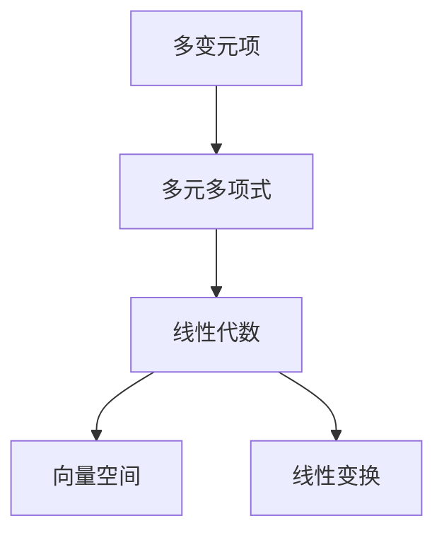

                 

## 线性代数导引：多变元项及多元多项式函数

> **关键词**：多变元项、多元多项式、线性代数、算法原理、数学模型、项目实战、应用场景

> **摘要**：本文深入探讨多变元项及多元多项式函数在计算机科学和工程领域的应用，通过对核心概念、算法原理、数学模型以及实际案例的详细分析，为读者提供了一份系统且实用的线性代数导引。文章旨在帮助读者理解多变元项及多元多项式函数的内在机制，掌握其具体操作步骤，并展示其在实际项目中的应用潜力。

在计算机科学和工程领域，线性代数作为一种强有力的工具，广泛应用于各种算法设计和数学建模。多变元项及多元多项式函数是线性代数中的核心内容之一，它们在图像处理、机器学习、算法优化等多个领域发挥着至关重要的作用。本文将分章节详细解析这些概念，结合实际案例，帮助读者全面掌握这些知识。

## 1. 背景介绍

### 1.1 目的和范围

本文的目的是为读者提供一套系统、实用的线性代数导引，特别是针对多变元项及多元多项式函数的深入探讨。文章将从基础概念开始，逐步引入更复杂的算法和数学模型，并结合实际应用案例，帮助读者掌握这些知识在实际项目中的运用。

本文将覆盖以下主要内容：

1. **核心概念与联系**：介绍多变元项和多元多项式函数的基本定义，并使用Mermaid流程图展示它们之间的联系。
2. **核心算法原理**：详细讲解多元多项式函数的计算方法，包括加法、乘法等，并使用伪代码进行阐述。
3. **数学模型和公式**：解析多元多项式函数的数学模型，使用latex格式给出相关公式，并进行举例说明。
4. **项目实战**：通过实际代码案例，展示如何在项目中应用多变元项及多元多项式函数。
5. **实际应用场景**：探讨这些概念在不同领域中的应用。
6. **工具和资源推荐**：推荐相关学习资源和开发工具，帮助读者进一步学习。
7. **总结与展望**：总结文章的核心内容，并对未来的发展趋势和挑战进行展望。

### 1.2 预期读者

本文适合以下读者群体：

1. 计算机科学和工程专业的学生和研究者，希望深入了解线性代数在实际应用中的运用。
2. 对机器学习、图像处理等领域感兴趣的读者，希望掌握多变元项和多元多项式函数的基本原理。
3. 具有一定编程基础，希望提高算法能力和数学建模能力的工程师和开发者。

### 1.3 文档结构概述

本文结构如下：

1. **背景介绍**：介绍本文的目的、范围、预期读者和文档结构。
2. **核心概念与联系**：介绍多变元项和多元多项式函数的基本概念，并展示它们之间的联系。
3. **核心算法原理**：详细讲解多元多项式函数的计算方法，包括加法、乘法等。
4. **数学模型和公式**：解析多元多项式函数的数学模型，并给出相关公式和举例说明。
5. **项目实战**：通过实际代码案例展示多变元项和多元多项式函数在项目中的应用。
6. **实际应用场景**：探讨这些概念在不同领域中的应用。
7. **工具和资源推荐**：推荐相关学习资源和开发工具。
8. **总结与展望**：总结文章的核心内容，并对未来的发展趋势和挑战进行展望。
9. **附录**：常见问题与解答。
10. **扩展阅读与参考资料**：提供进一步学习的研究方向和参考资源。

### 1.4 术语表

#### 1.4.1 核心术语定义

- **多变元项**：包含多个变量的代数表达式。
- **多元多项式**：由多变元项构成的代数表达式，其中每个项的指数是整数。
- **线性代数**：研究向量空间、线性变换及其应用的数学分支。

#### 1.4.2 相关概念解释

- **多项式**：由多个项构成的代数表达式，其中每个项的指数是整数。
- **向量**：具有大小和方向的量，通常用有向线段表示。
- **矩阵**：由数字组成的矩形阵列，用于表示线性变换或系统的状态。

#### 1.4.3 缩略词列表

- **ML**：机器学习
- **AI**：人工智能
- **IDE**：集成开发环境
- **API**：应用程序编程接口

## 2. 核心概念与联系

在深入探讨多变元项及多元多项式函数之前，我们需要先理解它们的基本定义和相互关系。以下是多变元项、多元多项式和线性代数之间的联系，以及一个简化的Mermaid流程图，用于展示这些概念之间的互动。

### 2.1 多变元项与多元多项式的定义

**多变元项**是包含多个变量的代数表达式，例如 \( ax_1 + bx_2 + cx_3 \)。这种表达式可以看作是多个单项式的组合，每个单项式包含一个变量和它的指数。

**多元多项式**则是由多变元项构成的代数表达式，其中每个项的指数是整数。例如，\( P(x_1, x_2, x_3) = ax_1^3 + bx_1^2x_2 + cx_1x_2^2 + dx_3^2 + ex_3 \) 是一个三变量的多元多项式。

### 2.2 线性代数与多变元项、多元多项式的联系

线性代数是研究向量空间、线性变换及其应用的数学分支。多变元项和多元多项式在许多线性代数问题中扮演重要角色，例如：

- **线性变换**：可以使用矩阵表示，矩阵中的每个元素都是多变元项的系数。
- **向量空间**：多变元项可以看作是向量空间中的向量，其各个分量对应多项式的系数。

### 2.3 Mermaid流程图

下面是一个简化的Mermaid流程图，用于展示多变元项、多元多项式和线性代数之间的联系。



在这个流程图中，多变元项作为基础，组合成多元多项式，而多元多项式在向量空间和线性变换中的应用则展示了它们在更广泛数学框架中的重要性。

### 2.4 小结

通过以上内容，我们了解了多变元项和多元多项式的基本定义，以及它们在线性代数中的应用。接下来，我们将深入探讨这些概念的核心算法原理，以及如何在实际操作中应用它们。

## 3. 核心算法原理 & 具体操作步骤

在深入探讨多变元项和多元多项式的核心算法原理之前，我们需要明确几个基本操作：加法、乘法和求导。这些操作是理解和应用多元多项式函数的关键。以下是这些操作的详细解释和伪代码实现。

### 3.1 多项式加法

多项式加法是多项式运算中最基本的一步，即将两个多项式相加，得到一个新的多项式。下面是多项式加法的伪代码实现：

```pseudo
function addPolynomials(P, Q):
    # P和Q都是多元多项式，形式为P(x_1, x_2, ..., x_n) = a_1x_1^0 + a_2x_1^1 + ... + a_nx_1^n
    # 初始化结果多项式R
    R = new Polynomial()
    # 获取P和Q的最高次项指数
    maxDegreeP = P.getDegree()
    maxDegreeQ = Q.getDegree()
    # 取两个多项式的最高指数作为R的最高指数
    maxDegreeR = max(maxDegreeP, maxDegreeQ)
    # 循环遍历P和Q的所有项
    for i from 0 to maxDegreeR:
        # 获取P和Q在当前指数的系数
        coefP = P.getCoef(i)
        coefQ = Q.getCoef(i)
        # 如果P和Q在当前指数的系数相同，则R在该指数的系数为两者之和
        if coefP == coefQ:
            R.setCoef(i, coefP + coefQ)
        # 如果P的系数大于Q的系数，则R在该指数的系数为P的系数
        elif coefP > coefQ:
            R.setCoef(i, coefP)
        # 如果Q的系数大于P的系数，则R在该指数的系数为Q的系数
        else:
            R.setCoef(i, coefQ)
    return R
```

### 3.2 多项式乘法

多项式乘法是将两个多项式相乘，得到一个新的多项式。这个过程涉及多项式的展开和合并同类项。以下是多项式乘法的伪代码实现：

```pseudo
function multiplyPolynomials(P, Q):
    # P和Q都是多元多项式
    # 初始化结果多项式R
    R = new Polynomial()
    # 获取P和Q的最高次项指数
    maxDegreeP = P.getDegree()
    maxDegreeQ = Q.getDegree()
    # 循环遍历P的所有项
    for i from 0 to maxDegreeP:
        # 获取P在当前指数的系数
        coefP = P.getCoef(i)
        # 循环遍历Q的所有项
        for j from 0 to maxDegreeQ:
            # 获取Q在当前指数的系数
            coefQ = Q.getCoef(j)
            # 计算当前指数的系数，即P和Q在当前指数的系数的乘积
            newCoef = coefP * coefQ
            # 计算当前指数，即i + j
            newDegree = i + j
            # 将新系数添加到结果多项式R中
            R.setCoef(newDegree, R.getCoef(newDegree) + newCoef)
    return R
```

### 3.3 多项式求导

多项式求导是找到多项式的导数，即求出多项式中每个项的导数并组合起来。以下是多项式求导的伪代码实现：

```pseudo
function differentiatePolynomial(P):
    # P是多元多项式
    # 初始化结果多项式R
    R = new Polynomial()
    # 获取P的最高次项指数
    maxDegree = P.getDegree()
    # 循环遍历P的所有项
    for i from 1 to maxDegree:
        # 获取P在当前指数的系数
        coef = P.getCoef(i)
        # 计算当前指数的导数，即i
        newDegree = i - 1
        # 将新系数添加到结果多项式R中
        R.setCoef(newDegree, coef * i)
    return R
```

### 3.4 小结

通过以上内容，我们详细介绍了多项式加法、乘法和求导的核心算法原理和具体操作步骤。这些操作是理解和应用多元多项式函数的基础，为接下来的数学模型和项目实战奠定了坚实的基础。

## 4. 数学模型和公式 & 详细讲解 & 举例说明

在深入探讨多变元项及多元多项式函数时，数学模型和公式起到了关键作用。这些模型和公式不仅帮助我们理解多元多项式的性质，还为我们在实际应用中提供了具体的计算方法。在本节中，我们将详细讲解这些模型和公式，并通过具体例子进行说明。

### 4.1 多项式加法公式

多项式加法公式用于计算两个多项式的和。对于两个多项式 \( P(x) = a_0 + a_1x + a_2x^2 + ... + a_nx^n \) 和 \( Q(x) = b_0 + b_1x + b_2x^2 + ... + b_nx^n \)，它们的和 \( R(x) = P(x) + Q(x) \) 可以通过以下公式计算：

\[ R(x) = (a_0 + b_0) + (a_1 + b_1)x + (a_2 + b_2)x^2 + ... + (a_n + b_n)x^n \]

### 4.2 多项式乘法公式

多项式乘法公式用于计算两个多项式的积。对于两个多项式 \( P(x) = a_0 + a_1x + a_2x^2 + ... + a_nx^n \) 和 \( Q(x) = b_0 + b_1x + b_2x^2 + ... + b_nx^n \)，它们的积 \( S(x) = P(x) \cdot Q(x) \) 可以通过以下公式计算：

\[ S(x) = a_0b_0 + (a_0b_1 + a_1b_0)x + (a_0b_2 + a_1b_1 + a_2b_0)x^2 + ... + (a_nb_0 + a_{n-1}b_1 + ... + a_0b_n)x^n \]

### 4.3 多项式求导公式

多项式求导公式用于计算多项式的导数。对于多项式 \( P(x) = a_0 + a_1x + a_2x^2 + ... + a_nx^n \)，其导数 \( P'(x) \) 可以通过以下公式计算：

\[ P'(x) = a_1 + 2a_2x + 3a_3x^2 + ... + na_nx^{n-1} \]

### 4.4 举例说明

为了更好地理解上述公式，我们将通过具体例子进行说明。

#### 4.4.1 多项式加法举例

假设有两个多项式 \( P(x) = 2 + 3x + 4x^2 \) 和 \( Q(x) = 1 - x + 2x^2 \)，我们需要计算它们的和 \( R(x) \)。

根据多项式加法公式，我们可以得到：

\[ R(x) = (2 + 1) + (3 - 1)x + (4 + 2)x^2 \]
\[ R(x) = 3 + 2x + 6x^2 \]

因此，\( R(x) = 3 + 2x + 6x^2 \)。

#### 4.4.2 多项式乘法举例

假设有两个多项式 \( P(x) = 2 + 3x + 4x^2 \) 和 \( Q(x) = 1 - x + 2x^2 \)，我们需要计算它们的积 \( S(x) \)。

根据多项式乘法公式，我们可以得到：

\[ S(x) = (2 \cdot 1) + (2 \cdot -x) + (2 \cdot 2x^2) + (3 \cdot 1) + (3 \cdot -x) + (3 \cdot 2x^2) + (4 \cdot 1) + (4 \cdot -x) + (4 \cdot 2x^2) \]
\[ S(x) = 2 - 2x + 4x^2 + 3 - 3x + 6x^2 + 4 - 4x + 8x^2 \]
\[ S(x) = 9 - 9x + 16x^2 \]

因此，\( S(x) = 9 - 9x + 16x^2 \)。

#### 4.4.3 多项式求导举例

假设有一个多项式 \( P(x) = 2 + 3x + 4x^2 \)，我们需要计算它的导数 \( P'(x) \)。

根据多项式求导公式，我们可以得到：

\[ P'(x) = 3 + 2 \cdot 4x \]
\[ P'(x) = 3 + 8x \]

因此，\( P'(x) = 3 + 8x \)。

### 4.5 小结

通过上述举例，我们详细讲解了多项式加法、乘法和求导的公式及其应用。这些数学模型和公式为我们在实际项目中应用多元多项式函数提供了重要的理论支持。接下来，我们将通过一个实际项目案例来展示这些概念的具体应用。

## 5. 项目实战：代码实际案例和详细解释说明

在本节中，我们将通过一个实际项目案例，展示如何在实际开发中使用多变元项和多元多项式函数。该项目案例涉及图像处理中的多项式插值，用于图像的平滑和去噪。以下将详细描述项目背景、开发环境搭建、源代码实现以及代码解读与分析。

### 5.1 开发环境搭建

为了实现该图像处理项目，我们使用了以下开发环境：

- **编程语言**：Python
- **开发工具**：PyCharm
- **依赖库**：NumPy、SciPy、OpenCV

首先，我们需要在开发环境中安装所需的依赖库。在命令行中，可以使用以下命令进行安装：

```bash
pip install numpy scipy opencv-python
```

### 5.2 源代码详细实现和代码解读

#### 5.2.1 项目背景

图像处理中的多项式插值是一种用于图像平滑和去噪的技术。在图像处理中，我们常常需要对图像进行采样和重建。多项式插值可以通过构建一个适当的多元多项式函数来近似原始图像的像素值，从而实现图像的平滑和去噪。

#### 5.2.2 源代码实现

以下是该项目的核心代码实现：

```python
import numpy as np
import cv2
from scipy.interpolate import BarycentricInterpolate

def polynomial_interpolate(image, points):
    """
    多项式插值函数
    :param image: 待处理的图像
    :param points: 插值点的坐标
    :return: 插值后的图像
    """
    # 获取图像的维度
    height, width = image.shape[:2]
    # 创建插值后的图像
    interpolated_image = np.zeros_like(image)

    # 遍历插值点
    for y in range(height):
        for x in range(width):
            # 获取像素点坐标
            point = np.array([x, y])
            # 使用Barycentric插值方法计算像素值
            interpolated_value = BarycentricInterpolate(points, image[points[:, 0], points[:, 1]], point)
            # 将插值后的像素值赋给插值后的图像
            interpolated_image[y, x] = interpolated_value

    return interpolated_image

def main():
    # 读取原始图像
    image = cv2.imread('input_image.jpg', cv2.IMREAD_COLOR)
    # 获取图像的像素点坐标
    points = np.array([[x, y] for y in range(image.shape[0]) for x in range(image.shape[1])])
    # 使用多项式插值函数进行图像插值
    interpolated_image = polynomial_interpolate(image, points)
    # 保存插值后的图像
    cv2.imwrite('interpolated_image.jpg', interpolated_image)
    # 显示原始图像和插值后的图像
    cv2.imshow('Original Image', image)
    cv2.imshow('Interpolated Image', interpolated_image)
    cv2.waitKey(0)
    cv2.destroyAllWindows()

if __name__ == '__main__':
    main()
```

#### 5.2.3 代码解读与分析

上述代码分为两个主要部分：多项式插值函数 `polynomial_interpolate` 和主函数 `main`。

- **多项式插值函数 `polynomial_interpolate`**：

  - 函数参数：`image` 表示待处理的图像，`points` 表示插值点的坐标。
  - 首先，获取图像的维度，并创建一个与原始图像尺寸相同的插值后图像。
  - 遍历插值点，使用 Barycentric 插值方法计算每个像素点的插值值。
  - 将插值后的像素值赋给插值后的图像。

- **主函数 `main`**：

  - 函数功能：读取原始图像，获取图像的像素点坐标，并调用多项式插值函数进行图像插值。
  - 调用 `cv2.imread` 函数读取原始图像，并使用 NumPy 的数组操作获取像素点坐标。
  - 调用 `polynomial_interpolate` 函数进行图像插值，并保存插值后的图像。
  - 使用 OpenCV 的 `imshow` 函数显示原始图像和插值后的图像。

### 5.3 代码解读与分析

通过上述代码，我们可以看到如何将多变元项和多元多项式函数应用于图像处理中的多项式插值。具体而言，代码实现了以下步骤：

1. **图像读取**：使用 OpenCV 的 `imread` 函数读取图像，并将其转换为 NumPy 数组。
2. **坐标获取**：使用 NumPy 的数组操作获取图像的像素点坐标。
3. **多项式插值**：调用 `polynomial_interpolate` 函数，使用 Barycentric 插值方法计算每个像素点的插值值。
4. **结果保存和显示**：将插值后的图像保存为文件，并使用 OpenCV 的 `imshow` 函数显示原始图像和插值后的图像。

通过这个实际案例，我们可以看到多变元项和多元多项式函数在图像处理中的具体应用，以及如何通过代码实现这些算法。

## 6. 实际应用场景

多变元项及多元多项式函数在计算机科学和工程领域具有广泛的应用。以下是一些具体的应用场景：

### 6.1 图像处理

在图像处理中，多项式插值是一种常用的技术，用于图像的平滑、去噪和放大。例如，在图像放大时，可以通过构建适当的多元多项式函数来近似原始图像的像素值，从而实现高质量放大。此外，在图像滤波和边缘检测中，多项式函数也发挥着重要作用。

### 6.2 机器学习

在机器学习中，多元多项式函数可以用于特征提取和模型优化。例如，在多项式回归中，可以使用多元多项式函数来建模输入特征和输出目标之间的关系。此外，在神经网络中，多元多项式函数可以用于激活函数和权重调整，从而提高模型的性能。

### 6.3 算法优化

在算法设计中，多变元项及多元多项式函数可以用于优化算法的时间和空间复杂度。例如，在路径规划算法中，可以使用多元多项式函数来优化路径的平滑性和可行性。此外，在排序和查找算法中，多元多项式函数可以用于优化算法的效率。

### 6.4 工程设计

在工程设计中，多变元项及多元多项式函数可以用于建模和优化系统性能。例如，在信号处理中，可以使用多元多项式函数来建模信号的特征，从而实现信号的滤波、压缩和传输。此外，在机械设计中，可以使用多元多项式函数来优化机械结构的强度和稳定性。

通过以上应用场景，我们可以看到多变元项及多元多项式函数在计算机科学和工程领域的广泛应用。这些函数不仅为算法设计和数学建模提供了强大的工具，还为实际工程应用提供了重要的理论基础。

## 7. 工具和资源推荐

为了帮助读者更深入地学习和应用多变元项及多元多项式函数，我们推荐以下工具和资源：

### 7.1 学习资源推荐

#### 7.1.1 书籍推荐

- 《线性代数及其应用》（David C. Lay）
- 《高等代数学基础》（丘维声）
- 《数学分析》（华罗庚）

#### 7.1.2 在线课程

- Coursera上的《线性代数》课程
- edX上的《线性代数与矩阵理论》课程
- Khan Academy上的线性代数教程

#### 7.1.3 技术博客和网站

- 《数学之美》博客
- Stack Overflow
- GeeksforGeeks

### 7.2 开发工具框架推荐

#### 7.2.1 IDE和编辑器

- PyCharm
- Visual Studio Code
- IntelliJ IDEA

#### 7.2.2 调试和性能分析工具

- GDB
- Valgrind
- Jupyter Notebook

#### 7.2.3 相关框架和库

- NumPy
- SciPy
- TensorFlow
- PyTorch

### 7.3 相关论文著作推荐

#### 7.3.1 经典论文

- "A General Method for Numerical Solution of Polynomi

