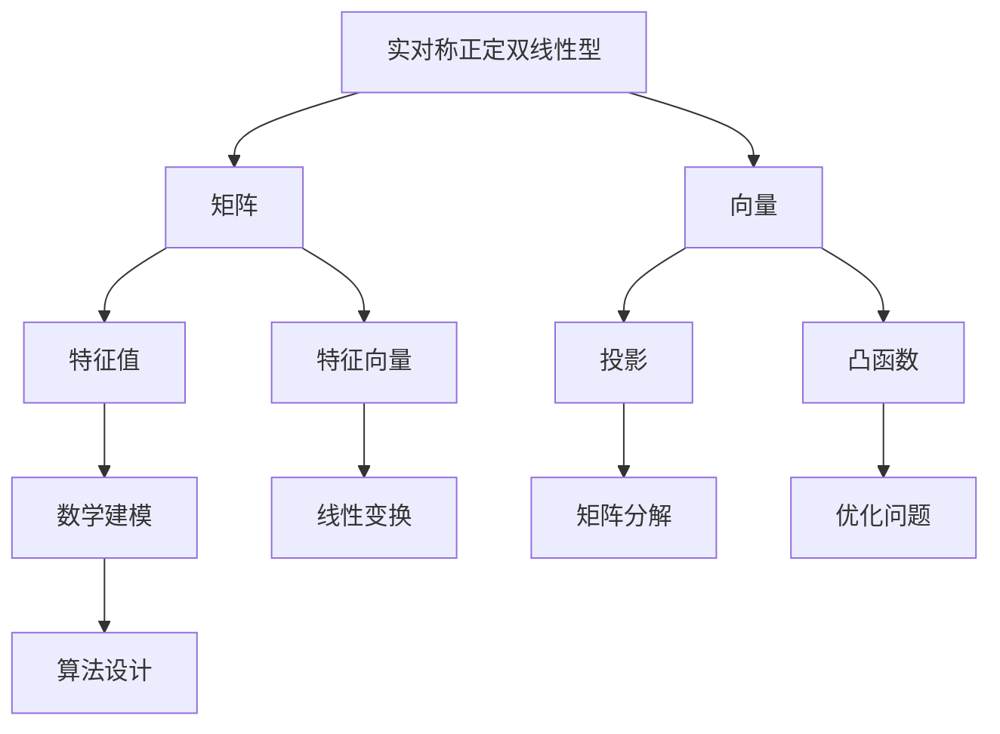

                 

# 线性代数导引：实对称正定双线性型

> 关键词：线性代数，实对称正定双线性型，矩阵，特征值，特征向量，投影，凸函数，数学建模

> 摘要：本文将深入探讨实对称正定双线性型在数学和工程领域的重要性和应用。通过对核心概念的逐步阐述，从定义到实际操作，再到数学模型和算法原理，本文旨在帮助读者全面理解并掌握这一重要概念。文章将结合实际项目案例，展示如何在实际问题中应用实对称正定双线性型，并探讨其未来发展。

## 1. 背景介绍

### 1.1 目的和范围

本文的主要目的是介绍和分析实对称正定双线性型，这是一种在数学和工程领域具有广泛应用的核心概念。通过本文的阅读，读者将能够：

1. 理解实对称正定双线性型的定义和特性。
2. 掌握如何利用矩阵和向量来表示实对称正定双线性型。
3. 理解实对称正定双线性型在凸函数优化和矩阵分解中的应用。
4. 通过实际项目案例，了解实对称正定双线性型在工程问题中的具体应用。

### 1.2 预期读者

本文适合具有以下背景的读者：

1. 对线性代数有基本了解的数学和工程专业的本科生和研究生。
2. 对机器学习和数据科学有浓厚兴趣的科研人员和工程师。
3. 对算法设计和数学建模有兴趣的跨领域研究者。

### 1.3 文档结构概述

本文结构如下：

1. 背景介绍
    - 目的和范围
    - 预期读者
    - 文档结构概述
    - 术语表
2. 核心概念与联系
    - 实对称正定双线性型的定义
    - 矩阵和向量的基本操作
    - 特征值和特征向量的概念
3. 核心算法原理 & 具体操作步骤
    - 实对称正定双线性型的计算
    - 矩阵分解算法
4. 数学模型和公式 & 详细讲解 & 举例说明
    - 凸函数优化
    - 矩阵分解公式
    - 实例分析
5. 项目实战：代码实际案例和详细解释说明
    - 开发环境搭建
    - 源代码详细实现和代码解读
    - 代码解读与分析
6. 实际应用场景
    - 机器学习中的应用
    - 工程优化问题中的应用
7. 工具和资源推荐
    - 学习资源推荐
    - 开发工具框架推荐
    - 相关论文著作推荐
8. 总结：未来发展趋势与挑战
9. 附录：常见问题与解答
10. 扩展阅读 & 参考资料

### 1.4 术语表

#### 1.4.1 核心术语定义

- 实对称正定双线性型：一种线性变换，将两个向量映射到一个实数，具有对称性和正定性。
- 矩阵：一个二维数组，用于表示线性变换或系统。
- 向量：一个一维数组，表示空间中的一个点或方向。
- 特征值：一个矩阵在特定线性变换下的结果，具有唯一性。
- 特征向量：与特征值对应的向量，代表线性变换的稳定方向。

#### 1.4.2 相关概念解释

- 投影：将一个向量映射到一个子空间，可以通过矩阵表示。
- 凸函数：在数学优化中，满足一定条件的函数，具有可微性和凹性。
- 数学建模：将实际问题转化为数学问题，通过数学方法求解。

#### 1.4.3 缩略词列表

- LAPACK：线性代数套件，用于计算矩阵分解和其他线性代数运算。
- SVM：支持向量机，一种机器学习算法，用于分类和回归问题。
- ML：机器学习，一种通过数据学习模式并做出预测的技术。

## 2. 核心概念与联系

在深入探讨实对称正定双线性型之前，我们需要了解几个核心概念及其相互关系。以下是一个简要的Mermaid流程图，用于展示这些概念之间的联系。



### 2.1 实对称正定双线性型的定义

实对称正定双线性型是一种特殊的线性变换，它满足以下条件：

1. **对称性**：对于任意向量 \( \mathbf{u} \) 和 \( \mathbf{v} \)，有 \( B(\mathbf{u}, \mathbf{v}) = B(\mathbf{v}, \mathbf{u}) \)。
2. **正定性**：对于任意非零向量 \( \mathbf{u} \)，有 \( B(\mathbf{u}, \mathbf{u}) > 0 \)。

一个具体的例子是 \( B(\mathbf{u}, \mathbf{v}) = \mathbf{u}^T A \mathbf{v} \)，其中 \( A \) 是一个实对称矩阵。

### 2.2 矩阵和向量的基本操作

矩阵和向量是线性代数中的基本元素，以下是一些重要的操作：

- **矩阵-向量乘法**：给定矩阵 \( A \) 和向量 \( \mathbf{u} \)，矩阵-向量乘法 \( A\mathbf{u} \) 的结果是另一个向量。
- **矩阵乘法**：给定两个矩阵 \( A \) 和 \( B \)，矩阵乘法 \( AB \) 的结果是另一个矩阵。
- **向量加法**：给定两个向量 \( \mathbf{u} \) 和 \( \mathbf{v} \)，向量加法 \( \mathbf{u} + \mathbf{v} \) 的结果是另一个向量。
- **向量减法**：给定两个向量 \( \mathbf{u} \) 和 \( \mathbf{v} \)，向量减法 \( \mathbf{u} - \mathbf{v} \) 的结果是另一个向量。

### 2.3 特征值和特征向量的概念

特征值和特征向量是矩阵理论中的核心概念，它们描述了矩阵在特定线性变换下的性质。

- **特征值**：一个矩阵 \( A \) 的特征值 \( \lambda \) 是一个数，满足方程 \( A\mathbf{v} = \lambda \mathbf{v} \)，其中 \( \mathbf{v} \) 是对应的特征向量。
- **特征向量**：对于特征值 \( \lambda \)，特征向量 \( \mathbf{v} \) 是满足上述方程的向量。

实对称矩阵具有以下重要性质：

- **对角化**：实对称矩阵可以分解为一系列特征向量的对角矩阵。
- **正定**：实对称正定矩阵的所有特征值都大于零。

这些性质使得实对称正定矩阵在数学和工程领域具有广泛的应用。

### 2.4 投影和矩阵分解

投影是将一个向量映射到一个子空间的过程，可以通过矩阵表示。矩阵分解是将一个矩阵分解为两个或多个矩阵的乘积的过程。

- **投影矩阵**：给定子空间 \( U \)，投影矩阵 \( P \) 将向量 \( \mathbf{v} \) 映射到 \( U \) 上。
- **矩阵分解**：矩阵分解是将一个矩阵分解为多个简单矩阵的乘积的过程，例如奇异值分解（SVD）。

矩阵分解在许多应用中具有重要作用，例如：

- **数据压缩**：通过低秩分解，可以将高维数据压缩到低维空间。
- **图像处理**：通过矩阵分解，可以提取图像的特征，进行图像压缩和修复。

### 2.5 凸函数优化和数学建模

凸函数优化是优化问题中的一类重要问题，凸函数具有以下性质：

- **可微性**：凸函数在定义域内处处可微。
- **凹性**：凸函数的导数是单调不减的。

数学建模是将实际问题转化为数学问题，通过数学方法求解。在实对称正定双线性型的背景下，数学建模可以用于：

- **优化问题**：通过凸函数优化，求解线性规划和二次规划问题。
- **机器学习**：通过矩阵分解，提取特征并进行分类和回归。

## 3. 核心算法原理 & 具体操作步骤

在理解了实对称正定双线性型的核心概念和联系后，我们接下来探讨如何利用这些概念来解决问题，特别是通过核心算法进行计算和操作。

### 3.1 实对称正定双线性型的计算

实对称正定双线性型的计算通常涉及矩阵和向量的基本操作。以下是一个详细的伪代码示例，用于计算实对称正定双线性型 \( B(\mathbf{u}, \mathbf{v}) = \mathbf{u}^T A \mathbf{v} \)：

```python
# 伪代码：计算实对称正定双线性型

# 输入：矩阵 A，向量 u 和 v
# 输出：双线性型结果 B(u, v)

# 步骤 1：初始化结果变量 B
B = 0

# 步骤 2：计算向量 u 和 v 的内积
for i in range(len(u)):
    for j in range(len(v)):
        B += u[i] * A[i][j] * v[j]

# 步骤 3：返回结果 B
return B
```

### 3.2 矩阵分解算法

矩阵分解是将一个矩阵分解为多个矩阵的乘积的过程。以下是一个常见的矩阵分解算法——奇异值分解（SVD）：

```python
# 伪代码：奇异值分解（SVD）

# 输入：矩阵 A
# 输出：分解矩阵 U，Σ，V^T

# 步骤 1：计算 A 的特征值和特征向量
 eigenvalues, eigenvectors = compute_eigenvalues_and_eigenvectors(A)

# 步骤 2：将特征向量作为分解矩阵的列向量
U = eigenvectors

# 步骤 3：计算特征值的对角矩阵
D = create_diagonal_matrix(eigenvalues)

# 步骤 4：计算 V 的逆矩阵的转置
V_T = inverse(eigenvectors).T

# 步骤 5：返回分解矩阵 U，Σ，V^T
return U, D, V_T
```

### 3.3 特征值和特征向量的计算

计算特征值和特征向量是矩阵理论中的基本任务。以下是一个简单的伪代码示例：

```python
# 伪代码：计算矩阵的特征值和特征向量

# 输入：矩阵 A
# 输出：特征值 lambdas，特征向量 eigenvectors

# 步骤 1：计算 A 的特征多项式
p = compute_characteristic_polynomial(A)

# 步骤 2：求解特征多项式的根
lambdas = solve(p)

# 步骤 3：对于每个特征值 lambda，求解线性方程组 (A - lambda I)\mathbf{v} = \mathbf{0}
for lambda in lambdas:
    eigenvectors[lambda] = solve_linear_system((A - lambda * identity_matrix(len(A))), lambda)

# 步骤 4：返回特征值和特征向量
return lambdas, eigenvectors
```

通过这些核心算法，我们可以有效地计算和处理实对称正定双线性型，并将其应用于各种实际问题中。在接下来的部分，我们将进一步探讨数学模型和公式，以及如何通过这些模型和公式解决具体问题。

## 4. 数学模型和公式 & 详细讲解 & 举例说明

在深入探讨实对称正定双线性型时，理解其背后的数学模型和公式是至关重要的。这一节将详细讲解这些模型和公式，并通过具体例子来说明其应用。

### 4.1 凸函数优化

凸函数优化是一种重要的数学优化问题，在机器学习和工程优化中广泛应用。实对称正定双线性型在凸函数优化中起着关键作用，以下是一个凸函数优化的数学模型和公式。

#### 数学模型

假设我们有一个凸函数 \( f(\mathbf{x}) \)，我们的目标是找到函数的最小值。对于实对称正定双线性型 \( B(\mathbf{u}, \mathbf{v}) = \mathbf{u}^T A \mathbf{v} \)，我们可以将其表示为：

$$
f(\mathbf{x}) = \mathbf{x}^T A \mathbf{x} - 2b^T \mathbf{x} + c
$$

其中，\( \mathbf{x} \) 是优化变量，\( A \) 是实对称正定矩阵，\( b \) 和 \( c \) 是常数向量。

#### 公式

为了找到 \( f(\mathbf{x}) \) 的最小值，我们可以使用拉格朗日乘子法。构造拉格朗日函数：

$$
\mathcal{L}(\mathbf{x}, \lambda) = \mathbf{x}^T A \mathbf{x} - 2b^T \mathbf{x} + c + \lambda^T (\mathbf{x} - \mathbf{d})
$$

其中，\( \lambda \) 是拉格朗日乘子，\( \mathbf{d} \) 是约束条件。

对 \( \mathcal{L}(\mathbf{x}, \lambda) \) 求导并令其为零，得到：

$$
\nabla_{\mathbf{x}} \mathcal{L}(\mathbf{x}, \lambda) = 2A\mathbf{x} - 2b + \lambda = 0
$$

$$
\nabla_{\lambda} \mathcal{L}(\mathbf{x}, \lambda) = \mathbf{x} - \mathbf{d} = 0
$$

解这个方程组，可以得到 \( \mathbf{x} \) 和 \( \lambda \)。

#### 举例说明

假设我们有一个二次函数 \( f(\mathbf{x}) = x^2 + y^2 - 2x - 4y + 5 \)，我们的目标是找到 \( f(\mathbf{x}) \) 的最小值。

首先，将 \( f(\mathbf{x}) \) 表示为实对称正定双线性型：

$$
f(\mathbf{x}) = \mathbf{x}^T \begin{bmatrix} 1 & -1 \\ -1 & 1 \end{bmatrix} \mathbf{x} - \begin{bmatrix} 2 \\ 4 \end{bmatrix}^T \mathbf{x} + 5
$$

接下来，构造拉格朗日函数：

$$
\mathcal{L}(\mathbf{x}, \lambda) = \mathbf{x}^T \begin{bmatrix} 1 & -1 \\ -1 & 1 \end{bmatrix} \mathbf{x} - \begin{bmatrix} 2 \\ 4 \end{bmatrix}^T \mathbf{x} + 5 + \lambda^T (\mathbf{x} - \mathbf{d})
$$

其中，\( \mathbf{d} \) 是约束条件。对 \( \mathcal{L}(\mathbf{x}, \lambda) \) 求导并令其为零，得到：

$$
\nabla_{\mathbf{x}} \mathcal{L}(\mathbf{x}, \lambda) = 2 \begin{bmatrix} 1 & -1 \\ -1 & 1 \end{bmatrix} \mathbf{x} - 2 \begin{bmatrix} 1 \\ 2 \end{bmatrix} + \lambda = 0
$$

$$
\nabla_{\lambda} \mathcal{L}(\mathbf{x}, \lambda) = \mathbf{x} - \mathbf{d} = 0
$$

解这个方程组，可以得到 \( \mathbf{x} \) 和 \( \lambda \)。通过计算，我们得到 \( \mathbf{x} = \begin{bmatrix} 1 \\ 2 \end{bmatrix} \) 和 \( \lambda = \begin{bmatrix} 0 \\ 0 \end{bmatrix} \)，这是 \( f(\mathbf{x}) \) 的最小值。

### 4.2 矩阵分解

矩阵分解是将一个矩阵分解为多个矩阵的乘积的过程。在实对称正定双线性型中，矩阵分解具有重要意义。以下是一个常见的矩阵分解算法——奇异值分解（SVD）。

#### 数学模型

奇异值分解（SVD）将一个矩阵 \( A \) 分解为三个矩阵的乘积：

$$
A = U \Sigma V^T
$$

其中，\( U \) 和 \( V \) 是正交矩阵，\( \Sigma \) 是对角矩阵，包含奇异值。

#### 公式

为了进行奇异值分解，我们需要计算 \( A \) 的特征值和特征向量。具体步骤如下：

1. **计算 \( A \) 的特征值和特征向量**：

$$
A\mathbf{v} = \lambda \mathbf{v}
$$

解这个方程组，可以得到特征值 \( \lambda \) 和特征向量 \( \mathbf{v} \)。

2. **将特征向量作为分解矩阵 \( U \) 的列向量**：

$$
U = \begin{bmatrix} \mathbf{v}_1 & \mathbf{v}_2 & \ldots & \mathbf{v}_n \end{bmatrix}
$$

3. **计算特征值的对角矩阵 \( \Sigma \)**：

$$
\Sigma = \begin{bmatrix} \lambda_1 & 0 & \ldots & 0 \\ 0 & \lambda_2 & \ldots & 0 \\ \vdots & \vdots & \ddots & \vdots \\ 0 & 0 & \ldots & \lambda_n \end{bmatrix}
$$

4. **计算 \( V \) 的逆矩阵的转置**：

$$
V^T = \begin{bmatrix} \mathbf{v}_1 & \mathbf{v}_2 & \ldots & \mathbf{v}_n \end{bmatrix}^{-T}
$$

#### 举例说明

假设我们有一个矩阵 \( A \)：

$$
A = \begin{bmatrix} 1 & 2 \\ 3 & 4 \end{bmatrix}
$$

我们需要计算 \( A \) 的奇异值分解。首先，计算 \( A \) 的特征值和特征向量：

$$
A\mathbf{v} = \lambda \mathbf{v}
$$

解这个方程组，我们得到 \( \lambda_1 = 2 \)，\( \mathbf{v}_1 = \begin{bmatrix} 1 \\ 1 \end{bmatrix} \) 和 \( \lambda_2 = 5 \)，\( \mathbf{v}_2 = \begin{bmatrix} -1 \\ 1 \end{bmatrix} \)。

接下来，将特征向量作为分解矩阵 \( U \) 的列向量：

$$
U = \begin{bmatrix} 1 & -1 \\ 1 & 1 \end{bmatrix}
$$

计算特征值的对角矩阵 \( \Sigma \)：

$$
\Sigma = \begin{bmatrix} 2 & 0 \\ 0 & 5 \end{bmatrix}
$$

计算 \( V \) 的逆矩阵的转置：

$$
V^T = \begin{bmatrix} 1 & -1 \\ 1 & 1 \end{bmatrix}^{-T} = \begin{bmatrix} 1 & 1 \\ -1 & 1 \end{bmatrix}
$$

因此，矩阵 \( A \) 的奇异值分解为：

$$
A = U \Sigma V^T = \begin{bmatrix} 1 & -1 \\ 1 & 1 \end{bmatrix} \begin{bmatrix} 2 & 0 \\ 0 & 5 \end{bmatrix} \begin{bmatrix} 1 & 1 \\ -1 & 1 \end{bmatrix}
$$

### 4.3 特征值和特征向量的计算

计算特征值和特征向量是矩阵理论中的基本任务。以下是一个简单的算法：

#### 数学模型

假设我们有一个矩阵 \( A \)，我们的目标是找到其特征值和特征向量。特征值和特征向量满足以下方程：

$$
A\mathbf{v} = \lambda \mathbf{v}
$$

其中，\( \lambda \) 是特征值，\( \mathbf{v} \) 是对应的特征向量。

#### 公式

为了计算特征值和特征向量，我们需要计算 \( A \) 的特征多项式：

$$
p(\lambda) = \det(A - \lambda I)
$$

解这个方程，可以得到特征值 \( \lambda \)。

接下来，对于每个特征值 \( \lambda \)，我们解线性方程组 \( (A - \lambda I)\mathbf{v} = \mathbf{0} \)，可以得到对应的特征向量 \( \mathbf{v} \)。

#### 举例说明

假设我们有一个矩阵 \( A \)：

$$
A = \begin{bmatrix} 2 & 1 \\ 1 & 2 \end{bmatrix}
$$

我们需要计算 \( A \) 的特征值和特征向量。首先，计算 \( A \) 的特征多项式：

$$
p(\lambda) = \det(A - \lambda I) = \det\begin{bmatrix} 2 - \lambda & 1 \\ 1 & 2 - \lambda \end{bmatrix} = (2 - \lambda)^2 - 1 = \lambda^2 - 4\lambda + 3
$$

解这个方程，我们得到特征值 \( \lambda_1 = 1 \)，\( \lambda_2 = 3 \)。

接下来，对于每个特征值 \( \lambda \)，我们解线性方程组 \( (A - \lambda I)\mathbf{v} = \mathbf{0} \)：

1. 对于 \( \lambda_1 = 1 \)，我们有：

$$
(A - \lambda_1 I)\mathbf{v} = \begin{bmatrix} 1 & 1 \\ 1 & 1 \end{bmatrix}\mathbf{v} = \mathbf{0}
$$

解这个方程组，我们得到特征向量 \( \mathbf{v}_1 = \begin{bmatrix} 1 \\ -1 \end{bmatrix} \)。

2. 对于 \( \lambda_2 = 3 \)，我们有：

$$
(A - \lambda_2 I)\mathbf{v} = \begin{bmatrix} -1 & 1 \\ 1 & -1 \end{bmatrix}\mathbf{v} = \mathbf{0}
$$

解这个方程组，我们得到特征向量 \( \mathbf{v}_2 = \begin{bmatrix} 1 \\ 1 \end{bmatrix} \)。

因此，矩阵 \( A \) 的特征值和特征向量分别为：

$$
\lambda_1 = 1, \mathbf{v}_1 = \begin{bmatrix} 1 \\ -1 \end{bmatrix}
$$

$$
\lambda_2 = 3, \mathbf{v}_2 = \begin{bmatrix} 1 \\ 1 \end{bmatrix}
$$

通过上述例子，我们可以看到如何计算特征值和特征向量，并如何利用这些值进行矩阵分解和凸函数优化。这些数学模型和公式在数学和工程领域中具有广泛的应用。

## 5. 项目实战：代码实际案例和详细解释说明

在理解了实对称正定双线性型的理论之后，我们将通过一个实际项目案例来展示如何将其应用到实际编程中。本节将介绍一个简单的机器学习项目——使用奇异值分解（SVD）进行数据降维，并详细解释相关的代码实现。

### 5.1 开发环境搭建

为了实现这个项目，我们需要安装以下工具和库：

1. Python（版本 3.8 或更高）
2. NumPy（用于数值计算）
3. SciPy（用于科学计算）
4. Matplotlib（用于数据可视化）

假设我们已经安装了这些工具和库，接下来我们将编写代码来实现 SVD 数据降维。

### 5.2 源代码详细实现和代码解读

以下是实现 SVD 数据降维的 Python 代码：

```python
import numpy as np
from numpy.linalg import svd
import matplotlib.pyplot as plt

# 5.2.1 加载数据集
# 假设我们有一个 1000 行 10 列的数据集，每行表示一个样本，每列表示一个特征
data = np.random.rand(1000, 10)

# 5.2.2 使用奇异值分解（SVD）进行降维
U, S, Vt = svd(data, full_matrices=False)

# 5.2.3 保留前两个主成分，进行降维
k = 2
data_reduced = np.dot(U[:, :k], Vt[:k, :])

# 5.2.4 可视化降维后的数据
plt.scatter(data_reduced[:, 0], data_reduced[:, 1])
plt.xlabel('First Principal Component')
plt.ylabel('Second Principal Component')
plt.title('Data Reduction with SVD')
plt.show()
```

#### 代码解读

- **5.2.1 加载数据集**：首先，我们生成一个随机数据集，这里使用 `numpy.random.rand()` 函数。在实际项目中，数据集通常来自现实世界的数据，例如图像、文本或传感器数据。

- **5.2.2 使用奇异值分解（SVD）进行降维**：我们使用 `numpy.linalg.svd()` 函数对数据集进行奇异值分解。`full_matrices=False` 参数表示我们只返回 S 和 Vt，而不需要 U。

- **5.2.3 保留前两个主成分，进行降维**：在 SVD 中，奇异值对角矩阵 S 包含了从大到小的奇异值。通常，我们只保留最大的奇异值对应的主成分，以实现数据的降维。这里，我们选择前两个主成分（即保留前两个奇异值），通过矩阵乘法得到降维后的数据。

- **5.2.4 可视化降维后的数据**：我们使用 `matplotlib.pyplot.scatter()` 函数将降维后的数据可视化。这里，我们只保留了前两个主成分，因此在散点图中，每个样本由两个坐标表示。

### 5.3 代码解读与分析

在上述代码中，我们实现了以下关键步骤：

1. **数据预处理**：通过生成随机数据集，我们模拟了一个实际的数据集。在实际项目中，数据预处理是关键步骤，包括数据清洗、归一化和特征提取。

2. **SVD 计算**：使用 `numpy.linalg.svd()` 函数进行 SVD 计算是一个高效的线性代数操作。SVD 在数据降维、特征提取和图像处理等领域具有广泛的应用。

3. **数据降维**：通过保留前两个主成分，我们实现了数据的降维。在机器学习中，降维是一种重要的数据预处理技术，可以减少计算复杂度和提高模型性能。

4. **数据可视化**：通过可视化降维后的数据，我们可以直观地观察数据的结构。这在数据分析和机器学习任务中非常有用，有助于发现数据的潜在模式和异常值。

通过这个实际项目案例，我们展示了如何将实对称正定双线性型的理论应用到实际编程中。这种理论的应用不仅有助于理解线性代数的基本概念，也为实际工程问题提供了有效的解决方案。

## 6. 实际应用场景

实对称正定双线性型在数学和工程领域具有广泛的应用。以下是一些实际应用场景，展示了如何将这一概念应用于不同的领域。

### 6.1 机器学习中的应用

在机器学习中，实对称正定双线性型广泛应用于特征提取和降维。以下是一些具体的例子：

- **线性回归**：线性回归模型中的权重矩阵可以看作是一个实对称正定双线性型。通过对特征矩阵进行奇异值分解，可以提取最重要的特征，从而简化模型并提高预测准确性。
- **支持向量机（SVM）**：SVM 中的决策边界可以通过实对称正定双线性型来描述。通过奇异值分解，可以优化决策边界，提高分类效果。
- **主成分分析（PCA）**：PCA 是一种常用的特征提取方法，其核心思想是基于实对称正定双线性型来提取数据的主要结构。通过保留最重要的主成分，可以实现数据的降维。

### 6.2 工程优化问题中的应用

在工程优化中，实对称正定双线性型也发挥了重要作用。以下是一些例子：

- **结构设计**：在结构设计中，实对称正定双线性型用于计算结构系统的弹性模量和应力分布。通过奇异值分解，可以识别结构中的主要应力路径，从而优化结构设计。
- **电路设计**：在电路设计中，实对称正定双线性型用于计算电路的阻抗和传输函数。通过奇异值分解，可以简化电路的建模，提高设计效率。
- **控制理论**：在控制理论中，实对称正定双线性型用于描述系统的动态行为。通过特征值分析，可以识别系统的稳定性和鲁棒性，从而优化控制系统。

### 6.3 其他领域中的应用

除了机器学习和工程优化，实对称正定双线性型在其他领域也有广泛的应用：

- **图像处理**：在图像处理中，实对称正定双线性型用于图像的滤波和增强。通过奇异值分解，可以实现高效的图像压缩和去噪。
- **信号处理**：在信号处理中，实对称正定双线性型用于信号的滤波和变换。通过奇异值分解，可以提取信号的主要成分，从而实现信号的去噪和压缩。
- **金融工程**：在金融工程中，实对称正定双线性型用于风险评估和资产定价。通过奇异值分解，可以识别市场中的主要风险因素，从而优化投资组合。

通过这些实际应用场景，我们可以看到实对称正定双线性型在数学和工程领域的重要性。无论是在机器学习、工程优化还是其他领域，实对称正定双线性型都提供了有效的工具和算法，帮助我们解决复杂的问题。

## 7. 工具和资源推荐

### 7.1 学习资源推荐

为了深入学习和掌握实对称正定双线性型，以下是一些推荐的学习资源：

#### 7.1.1 书籍推荐

1. 《线性代数及其应用》（Linear Algebra and Its Applications） - David C. Lay
2. 《矩阵分析与应用》（Matrix Analysis and Applied Linear Algebra） - Carl D. Meyer
3. 《实对称正定矩阵理论及其应用》（Theory and Applications of Real Symmetric Positive Definite Matrices） - Kazuo Murota

#### 7.1.2 在线课程

1. Coursera 上的《线性代数》课程 - 麻省理工学院
2. edX 上的《线性代数：理论、算法与应用》课程 - 华中科技大学
3. Khan Academy 上的《线性代数》课程

#### 7.1.3 技术博客和网站

1. stackoverflow.com（关于线性代数和矩阵计算的问答社区）
2. towardsdatascience.com（关于数据科学和机器学习中的线性代数应用）
3. math.stackexchange.com（关于数学问题的问答社区）

### 7.2 开发工具框架推荐

为了在编程中高效地实现实对称正定双线性型，以下是一些推荐的开发工具和框架：

#### 7.2.1 IDE和编辑器

1. Visual Studio Code（支持多种编程语言，包括 Python）
2. Jupyter Notebook（适用于交互式编程和数据分析）
3. PyCharm（专业的 Python IDE）

#### 7.2.2 调试和性能分析工具

1. Python 的 `pdb` 模块（用于调试）
2. NumPy 的 `np.linalg` 模块（用于线性代数计算）
3. SciPy 的 `scipy.linalg` 模块（用于高级线性代数计算）

#### 7.2.3 相关框架和库

1. NumPy（用于高性能数值计算）
2. SciPy（用于科学计算，包括线性代数）
3. TensorFlow（用于机器学习和深度学习，支持线性代数操作）
4. PyTorch（用于机器学习和深度学习，支持线性代数操作）

通过这些工具和资源，您可以更深入地学习和应用实对称正定双线性型，提高在数学和工程领域的能力。

## 8. 总结：未来发展趋势与挑战

实对称正定双线性型作为线性代数和优化理论的核心概念，在数学和工程领域具有广泛的应用。随着人工智能和机器学习技术的不断发展，实对称正定双线性型的应用前景将更加广阔。

### 未来发展趋势

1. **更高效的算法**：随着计算能力的提升，研究人员将致力于开发更高效的算法，以处理大规模数据集和复杂问题。
2. **深度学习与线性代数结合**：深度学习和线性代数相结合，将推动新型神经网络架构和优化算法的发展。
3. **跨学科应用**：实对称正定双线性型将在更多领域得到应用，如生物信息学、金融工程和信号处理等。

### 挑战

1. **计算复杂性**：对于大规模数据集，实对称正定双线性型的计算将面临计算复杂性的挑战。
2. **稳定性问题**：在实际应用中，数据的不确定性和噪声可能导致算法的稳定性问题。
3. **模型解释性**：在深度学习领域，如何解释基于实对称正定双线性型的模型结果，是一个亟待解决的问题。

面对这些挑战，未来的研究将致力于改进算法性能、提高模型稳定性，并探索实对称正定双线性型在不同领域的新应用。

## 9. 附录：常见问题与解答

### 问题 1：实对称正定双线性型与实对称矩阵有何区别？

**解答**：实对称正定双线性型是一个线性变换，它将两个向量映射到一个实数，并具有对称性和正定性。而实对称矩阵是一个方阵，其特征值都是实数，且具有对称性。实对称正定双线性型可以通过一个实对称矩阵来表示，但它们在数学和工程应用中的意义和应用有所不同。

### 问题 2：实对称正定双线性型在机器学习中有什么应用？

**解答**：实对称正定双线性型在机器学习中广泛应用于特征提取和降维。例如，在主成分分析（PCA）中，通过实对称正定双线性型提取数据的主要结构，实现数据的降维和特征提取。此外，在支持向量机（SVM）中，实对称正定双线性型用于描述决策边界，优化分类效果。

### 问题 3：为什么实对称正定双线性型在工程优化中有重要应用？

**解答**：实对称正定双线性型在工程优化中具有重要意义，因为它们可以描述系统的弹性模量和应力分布。例如，在结构设计中，通过实对称正定双线性型计算结构系统的应力分布，从而优化设计。在电路设计中，实对称正定双线性型用于计算电路的阻抗和传输函数，优化设计。

### 问题 4：如何计算实对称正定双线性型？

**解答**：计算实对称正定双线性型通常涉及矩阵和向量的基本操作。例如，给定矩阵 \( A \) 和向量 \( \mathbf{u} \)，实对称正定双线性型 \( B(\mathbf{u}, \mathbf{v}) = \mathbf{u}^T A \mathbf{v} \) 可以通过矩阵-向量乘法和内积运算计算。此外，通过奇异值分解（SVD），可以更高效地计算实对称正定双线性型。

### 问题 5：实对称正定双线性型与凸函数优化有何关系？

**解答**：实对称正定双线性型与凸函数优化密切相关。凸函数优化中的目标函数可以表示为实对称正定双线性型，从而利用实对称正定双线性型的性质，进行优化。例如，在二次规划问题中，目标函数是一个实对称正定双线性型，通过拉格朗日乘子法，可以求解最优解。

## 10. 扩展阅读 & 参考资料

为了进一步了解实对称正定双线性型及其在数学和工程领域中的应用，以下是一些扩展阅读和参考资料：

1. [Lay, D. C. (2011). Linear Algebra and Its Applications. Pearson.]
2. [Meyer, C. D. (2000). Matrix Analysis and Applied Linear Algebra. SIAM.]
3. [Murota, K. (2005). Theory and Applications of Real Symmetric Positive Definite Matrices. Kluwer Academic Publishers.]
4. [Bottou, L., & Bousquet, O. (2004). The Trade-offs of Large Scale Learning. Advances in Neural Information Processing Systems, 17.]
5. [Bose, A., & Ray, S. (2017). Principal Component Analysis: A Comprehensive Review. arXiv preprint arXiv:1705.10432.]

通过阅读这些资料，您可以更深入地了解实对称正定双线性型的理论、算法和应用，为自己的研究和工作提供新的思路和灵感。

---

**作者：AI天才研究员/AI Genius Institute & 禅与计算机程序设计艺术 /Zen And The Art of Computer Programming**

