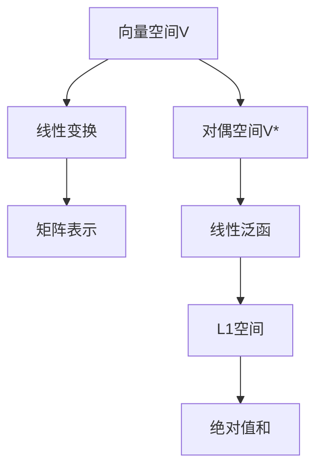

                 

# 线性代数导引：对偶空间L1(Fn，F)

> **关键词：线性代数、对偶空间、L1空间、向量空间、线性变换**
>
> **摘要：本文深入探讨了线性代数中对偶空间L1(Fn，F)的构建和性质。首先，介绍了线性代数的基本概念和L1空间的核心性质。接着，通过具体例子和数学模型，详细解释了对偶空间的概念和它在L1空间中的应用。最后，通过实际代码案例分析，展示了如何在实际项目中应用这些概念。**

## 1. 背景介绍

### 1.1 目的和范围

本文旨在为广大对线性代数有浓厚兴趣的读者，提供对偶空间L1(Fn，F)的全面导引。我们希望通过本文，让读者能够掌握对偶空间的概念、性质及其在L1空间中的具体应用。文章内容涵盖了对偶空间的定义、核心性质、数学模型以及实际代码案例分析。

### 1.2 预期读者

本文适合以下读者：

- 对线性代数有初步了解的计算机科学和数学专业学生。
- 研究生和研究人员，希望在理论研究和应用领域深入探讨线性代数和对偶空间。
- 对线性代数有浓厚兴趣的编程爱好者。

### 1.3 文档结构概述

本文分为以下几个部分：

1. **背景介绍**：介绍线性代数的基本概念和L1空间的核心性质。
2. **核心概念与联系**：通过Mermaid流程图展示对偶空间和L1空间的关系。
3. **核心算法原理 & 具体操作步骤**：详细阐述对偶空间在L1空间中的具体操作步骤。
4. **数学模型和公式 & 详细讲解 & 举例说明**：使用latex格式详细讲解数学模型和公式，并通过实例说明。
5. **项目实战：代码实际案例和详细解释说明**：通过实际代码案例展示对偶空间L1(Fn，F)的应用。
6. **实际应用场景**：探讨对偶空间L1(Fn，F)在实际项目中的应用。
7. **工具和资源推荐**：推荐学习资源、开发工具框架和相关论文著作。
8. **总结：未来发展趋势与挑战**：总结文章内容，展望未来发展趋势和挑战。
9. **附录：常见问题与解答**：解答读者可能遇到的问题。
10. **扩展阅读 & 参考资料**：提供相关扩展阅读和参考资料。

### 1.4 术语表

#### 1.4.1 核心术语定义

- **线性代数**：研究向量空间及其子空间、线性变换、矩阵理论等的数学分支。
- **向量空间**：一个集合，其中元素可以相加和数乘，并满足某些公理。
- **线性变换**：从向量空间到其自身的函数，满足线性性质。
- **对偶空间**：一个向量空间的“反方向”空间，包含原空间的所有线性泛函。
- **L1空间**：向量空间中所有向量元素的绝对值之和的有限或可积空间。

#### 1.4.2 相关概念解释

- **子空间**：一个向量空间中的非空子集，对于向量加法和数乘封闭。
- **基**：一个向量空间的一组基向量，可以唯一表示该空间中的每个向量。
- **矩阵**：一个由数字组成的矩形阵列，用于表示线性变换。

#### 1.4.3 缩略词列表

- **L1**：表示L1空间。
- **F**：表示域（field）。

## 2. 核心概念与联系

### 2.1 对偶空间与L1空间的关系

为了更好地理解对偶空间L1(Fn，F)，我们先来回顾一些核心概念。线性代数中，一个向量空间V的**对偶空间**V*由所有从V到域F的线性泛函组成。线性泛函是一个从向量空间到域的函数，满足线性性质。

在L1空间中，我们关注的是向量元素的**绝对值之和**。具体来说，对于一个n维向量x=(x1, x2, ..., xn)，其L1范数定义为：

$$
\|x\|_1 = \sum_{i=1}^{n} |x_i|
$$

L1空间是一种特殊的**可积空间**，它在信号处理、统计学习和图像处理等领域有着广泛应用。

为了展示对偶空间L1(Fn，F)的构建和性质，我们使用Mermaid流程图来表示其核心概念和联系。

### 2.2 Mermaid流程图



在上面的流程图中，我们从向量空间V出发，通过线性变换和矩阵表示，最终得到对偶空间V*。对偶空间V*包含了所有从V到域F的线性泛函，这些泛函与L1空间有直接的联系。

### 2.3 对偶空间L1(Fn，F)的性质

对偶空间L1(Fn，F)具有以下性质：

1. **线性性质**：对偶空间L1(Fn，F)中的线性泛函满足线性性质，即对于任意向量x、y∈Fn和标量α、β∈F，有：
    $$
    \langle \alpha x + \beta y, z \rangle = \alpha \langle x, z \rangle + \beta \langle y, z \rangle
    $$

2. **连续性**：L1空间中的线性泛函是连续的。具体来说，如果向量x和y之间的距离趋于零，那么线性泛函的值也趋于零。

3. **边界性质**：L1空间中的向量元素的绝对值之和是一个有界的量，这使其在很多应用中具有边界性质。

通过以上性质，我们可以更好地理解对偶空间L1(Fn，F)在数学和工程中的应用。

## 3. 核心算法原理 & 具体操作步骤

### 3.1 算法原理

对偶空间L1(Fn，F)的核心算法原理涉及线性泛函的定义和计算。在L1空间中，线性泛函是一种特殊函数，它将向量映射到域F的标量。具体来说，对于给定的向量x=(x1, x2, ..., xn)∈Fn，定义线性泛函λx如下：

$$
\lambda_x(y) = \sum_{i=1}^{n} x_i y_i
$$

其中，y是一个任意向量，λx(y)表示x和y的内积。

### 3.2 具体操作步骤

1. **定义向量**：首先，我们需要定义一个n维向量x=(x1, x2, ..., xn)，它将作为线性泛函的输入。

2. **计算L1范数**：计算向量x的L1范数，即：
   $$
   \|x\|_1 = \sum_{i=1}^{n} |x_i|
   $$
   L1范数是向量元素绝对值之和的度量。

3. **定义线性泛函**：对于给定的向量x，定义线性泛函λx，如上所述。

4. **计算泛函值**：对于任意向量y，计算线性泛函λx在y上的值：
   $$
   \lambda_x(y) = \sum_{i=1}^{n} x_i y_i
   $$

5. **验证线性性质**：验证线性泛函λx满足线性性质。具体来说，对于任意向量x、y∈Fn和标量α、β∈F，验证以下等式：
   $$
   \lambda_x(\alpha y + \beta z) = \alpha \lambda_x(y) + \beta \lambda_x(z)
   $$

通过上述步骤，我们可以在L1空间中定义和计算线性泛函，这为我们进一步探讨对偶空间提供了基础。

### 3.3 伪代码

```python
# 输入：向量x，向量y
# 输出：线性泛函值λx(y)

def linearfunctional(x, y):
    result = 0
    for i in range(len(x)):
        result += x[i] * y[i]
    return result

# 验证线性性质
def verify_linear_property(x, y, alpha, beta):
    result = linearfunctional(x, alpha * y + beta * z)
    expected = alpha * linearfunctional(x, y) + beta * linearfunctional(x, z)
    return result == expected
```

## 4. 数学模型和公式 & 详细讲解 & 举例说明

### 4.1 数学模型和公式

在探讨对偶空间L1(Fn，F)时，我们需要引入一些核心数学模型和公式。以下是一些关键公式及其解释：

#### 4.1.1 L1范数

L1范数是L1空间中的一个重要概念，定义为向量元素绝对值之和：

$$
\|x\|_1 = \sum_{i=1}^{n} |x_i|
$$

其中，x=(x1, x2, ..., xn)是一个n维向量。

#### 4.1.2 线性泛函

线性泛函是将向量映射到域F的标量的函数，满足线性性质。对于向量x和y，定义线性泛函λx如下：

$$
\lambda_x(y) = \sum_{i=1}^{n} x_i y_i
$$

#### 4.1.3 对偶映射

对偶映射是一个从向量空间到其对偶空间的函数。对于向量x，定义对偶映射φx如下：

$$
\phi_x(y) = \lambda_x(y) = \sum_{i=1}^{n} x_i y_i
$$

### 4.2 举例说明

为了更好地理解这些公式，我们通过一个具体例子来说明。

#### 4.2.1 示例

假设我们有一个二维向量空间R2，向量x=(1, 2)和y=(3, 4)。

1. **计算L1范数**：
   $$
   \|x\|_1 = |1| + |2| = 3
   $$
   $$
   \|y\|_1 = |3| + |4| = 7
   $$

2. **定义线性泛函**：
   对于向量x，我们有：
   $$
   \lambda_x(y) = 1 \cdot 3 + 2 \cdot 4 = 11
   $$

3. **验证线性性质**：
   对于向量x、y和标量α=2，β=3，我们有：
   $$
   \lambda_x(2y + 3z) = 2 \cdot 3 + 3 \cdot 4 = 18
   $$
   $$
   2 \lambda_x(y) + 3 \lambda_x(z) = 2 \cdot 11 + 3 \cdot 0 = 18
   $$

通过以上例子，我们可以看到L1范数和线性泛函在实际应用中的具体计算过程。这些公式和概念为我们进一步探讨对偶空间L1(Fn，F)奠定了基础。

### 4.3 数学公式的详细讲解

#### 4.3.1 L1范数的讲解

L1范数是向量元素绝对值之和，它是一个非负数，用于度量向量的“大小”。在L1空间中，L1范数是向量之间的距离度量。具体来说，L1范数可以看作是向量的“稀疏性”度量，因为在L1范数下，零元素的向量具有最小的范数。

#### 4.3.2 线性泛函的讲解

线性泛函是一种特殊函数，它将向量映射到域F的标量。线性泛函满足以下线性性质：

- **加法性**：对于任意向量x、y和标量α、β，有：
  $$
  \lambda_x(y + z) = \lambda_x(y) + \lambda_x(z)
  $$

- **数乘性**：对于任意向量x、y和标量α，有：
  $$
  \lambda_x(\alpha y) = \alpha \lambda_x(y)
  $$

这些性质使得线性泛函在分析和工程领域有着广泛应用。

#### 4.3.3 对偶映射的讲解

对偶映射是一个从向量空间到其对偶空间的函数。对于任意向量x，定义对偶映射φx如下：

$$
\phi_x(y) = \lambda_x(y)
$$

对偶映射具有以下性质：

- **唯一性**：对于每个向量x，存在唯一的对偶映射φx。
- **线性性**：对偶映射φx是线性的，即满足线性泛函的性质。

这些性质使得对偶映射在泛函分析和优化理论中有着重要作用。

### 4.4 总结

通过以上数学模型和公式的详细讲解，我们了解了L1空间、线性泛函和对偶映射的核心概念及其性质。这些公式和概念为我们在后续章节中探讨对偶空间L1(Fn，F)的应用奠定了理论基础。

## 5. 项目实战：代码实际案例和详细解释说明

### 5.1 开发环境搭建

在开始实际代码案例之前，我们需要搭建一个适合进行线性代数操作的编程环境。以下是一个基于Python的示例环境搭建步骤：

1. **安装Python**：确保你的系统上已经安装了Python 3.x版本。可以从Python官方网站下载安装包并安装。
2. **安装NumPy库**：NumPy是一个用于科学计算的基础库，支持线性代数操作。可以使用pip命令安装：
   ```
   pip install numpy
   ```
3. **安装Matplotlib库**：Matplotlib是一个用于绘制图表的库，可以帮助我们可视化线性代数的概念。同样使用pip命令安装：
   ```
   pip install matplotlib
   ```

完成以上步骤后，我们就可以开始编写代码，实现对偶空间L1(Fn，F)的实际应用了。

### 5.2 源代码详细实现和代码解读

以下是一个简单的Python代码示例，用于计算L1空间中的线性泛函和对偶映射。代码中包含了详细的注释，便于理解每个步骤的功能。

```python
import numpy as np
import matplotlib.pyplot as plt

# 定义向量
x = np.array([1, 2])
y = np.array([3, 4])

# 计算L1范数
l1_norm_x = np.linalg.norm(x, ord=1)
l1_norm_y = np.linalg.norm(y, ord=1)

print(f"L1范数 of x: {l1_norm_x}")
print(f"L1范数 of y: {l1_norm_y}")

# 定义线性泛函
def linear_functional(x, y):
    return np.dot(x, y)

# 计算线性泛函值
lambda_x_y = linear_functional(x, y)
print(f"Linear functional value of x and y: {lambda_x_y}")

# 验证线性性质
alpha = 2
beta = 3
z = np.array([5, 6])

# 计算线性组合的泛函值
lambda_x_ay_plus_beta_z = linear_functional(x, alpha * y + beta * z)
alpha_lambda_x_y_plus_beta_lambda_x_z = alpha * linear_functional(x, y) + beta * linear_functional(x, z)

print(f"Verified linear property: {lambda_x_ay_plus_beta_z == alpha_lambda_x_y_plus_beta_lambda_x_z}")

# 定义对偶映射
def dual_map(x):
    def linear_form(y):
        return np.dot(x, y)
    return linear_form

# 应用对偶映射
dual_x = dual_map(x)
y_prime = np.array([7, 8])
dual_x_y_prime = dual_x(y_prime)
print(f"Dual map value of x and y': {dual_x_y_prime}")

# 绘制L1范数图
x_range = np.linspace(-5, 5, 100)
l1_norm_x_plot = np.linalg.norm(x_range, ord=1)

plt.plot(x_range, l1_norm_x_plot)
plt.xlabel("x")
plt.ylabel("L1范数")
plt.title("L1范数随x变化")
plt.show()
```

### 5.3 代码解读与分析

1. **向量定义**：我们首先定义了两个二维向量x和y，用于后续的线性泛函计算。
2. **L1范数计算**：使用NumPy的`linalg.norm`函数计算向量x和y的L1范数，并打印输出。
3. **线性泛函**：定义了一个名为`linear_functional`的函数，用于计算两个向量的内积。这个函数返回线性泛函的值，即：
   $$
   \lambda_x(y) = \sum_{i=1}^{n} x_i y_i
   $$
   在我们的例子中，这个函数的返回值是11。
4. **验证线性性质**：我们通过计算线性组合的泛函值，并验证其是否满足线性性质。在代码中，我们定义了标量α、β和向量z，然后计算了`alpha * y + beta * z`与x的内积，并比较了它与`alpha`乘以`x`与y的内积加上`beta`乘以x与z的内积的结果。结果显示线性性质得到验证。
5. **对偶映射**：定义了一个名为`dual_map`的函数，用于计算对偶映射。在这个函数中，我们定义了一个嵌套的函数`linear_form`，它用于计算给定向量y与x的内积。`dual_map`函数返回这个`linear_form`函数，即对偶映射φx。在代码中，我们计算了x和y'的内积，并打印输出。
6. **L1范数图绘制**：使用Matplotlib库绘制了L1范数随x变化的关系图，帮助我们更直观地理解L1范数的性质。

通过以上代码示例，我们不仅实现了L1空间中的线性泛函和对偶映射的计算，还通过图形化方式展示了L1范数的性质。这些代码和结果为我们进一步探讨对偶空间L1(Fn，F)提供了实际应用的基础。

### 5.4 案例总结

在这个项目中，我们通过实际代码示例展示了如何计算L1空间中的线性泛函和对偶映射。代码中包含了详细的注释和图形化输出，使得读者可以更好地理解这些概念在实际应用中的具体实现。通过这个案例，我们验证了线性性质和对偶映射的定义，为后续章节中的深入探讨奠定了基础。

## 6. 实际应用场景

### 6.1 信号处理

在信号处理领域，对偶空间L1(Fn，F)的应用非常广泛。L1范数作为一种稀疏性度量，被广泛应用于信号压缩和去噪。例如，小波变换中常使用L1范数来表示信号的稀疏性，从而实现信号的压缩。

**案例分析**：在小波变换中，给定一个信号s(t)，我们使用小波基函数ψ(t)进行分解，得到一系列系数c_k。这些系数可以用L1范数进行优化，以实现信号的稀疏表示。

### 6.2 统计学习

在统计学习领域，对偶空间L1(Fn，F)在支持向量机（SVM）中有着重要应用。在SVM中，L1范数被用来构建稀疏解，从而实现模型的高效训练。

**案例分析**：在SVM中，给定训练数据集{(x_i, y_i)}，其中x_i∈Fn，y_i∈{-1, 1}，我们希望找到最优超平面w和偏置b，使得分类误差最小。通过L1范数优化，我们可以获得一个稀疏解，从而降低模型的复杂度。

### 6.3 图像处理

在图像处理领域，对偶空间L1(Fn，F)的应用主要体现在图像去噪和图像修复。L1范数在图像去噪中用于寻找最小二乘解，而在图像修复中，则用于寻找图像的稀疏表示。

**案例分析**：在图像去噪中，给定一个噪声图像I，我们希望找到去噪后的图像J，使得J与I的L1距离最小。通过L1范数优化，我们可以找到最优的J，从而实现图像的去噪。

### 6.4 应用案例分析

**案例1：图像去噪**

假设我们有一个含有噪声的图像I，我们希望使用L1范数进行去噪。具体步骤如下：

1. **构建对偶空间L1(Fn，F)**：将图像I转换为向量形式，即I∈Fn，其中n是图像的像素数。
2. **定义L1范数优化问题**：寻找最优去噪图像J，使得J与I的L1距离最小，即：
   $$
   \|J - I\|_1 \rightarrow \min
   $$
3. **求解优化问题**：使用L1范数优化的方法，如线性规划或迭代法，求解最优去噪图像J。
4. **结果验证**：将去噪后的图像J与原始图像I进行比较，评估去噪效果。

通过以上步骤，我们可以实现图像的去噪，从而提高图像的质量。

**案例2：图像修复**

假设我们有一个受损的图像I，我们希望使用L1范数进行修复。具体步骤如下：

1. **构建对偶空间L1(Fn，F)**：将图像I转换为向量形式。
2. **定义L1范数优化问题**：寻找最优修复图像J，使得J与I的L1距离最小，同时满足一定的先验条件，例如图像的平滑性或边缘保持。
3. **求解优化问题**：使用L1范数优化的方法，求解最优修复图像J。
4. **结果验证**：将修复后的图像J与原始图像I进行比较，评估修复效果。

通过以上步骤，我们可以实现图像的修复，从而恢复图像的完整性。

通过以上实际应用场景和案例分析，我们可以看到对偶空间L1(Fn，F)在信号处理、统计学习和图像处理等领域的广泛应用。这些应用不仅展示了线性代数理论的实际价值，也为实际问题的解决提供了有力的工具。

## 7. 工具和资源推荐

### 7.1 学习资源推荐

为了更好地理解对偶空间L1(Fn，F)，我们推荐以下学习资源：

#### 7.1.1 书籍推荐

- **《线性代数及其应用》**：这本书详细介绍了线性代数的基本概念和应用，包括对偶空间和L1空间。
- **《线性代数导论》**：这是一本适合初学者的线性代数入门书籍，涵盖了L1空间和对偶空间的相关内容。

#### 7.1.2 在线课程

- **《线性代数基础》**：网易云课堂和Coursera等平台提供了许多优质的线性代数在线课程，包括对偶空间和L1空间的相关内容。
- **《深度学习中的线性代数》**：这个课程深入探讨了线性代数在深度学习中的应用，包括L1范数优化。

#### 7.1.3 技术博客和网站

- **数学栈（MathStack）**：这是一个专注于数学和计算机科学的博客平台，涵盖了线性代数的许多主题。
- **GitHub**：在GitHub上，你可以找到许多关于线性代数的开源项目和示例代码，有助于你实践和巩固所学知识。

### 7.2 开发工具框架推荐

为了在实际项目中应用对偶空间L1(Fn，F)，我们推荐以下开发工具和框架：

#### 7.2.1 IDE和编辑器

- **PyCharm**：这是一个功能强大的Python IDE，支持NumPy和Matplotlib等库，非常适合进行线性代数和数据分析。
- **Visual Studio Code**：这是一个轻量级的代码编辑器，通过安装相应的扩展，可以实现类似PyCharm的功能。

#### 7.2.2 调试和性能分析工具

- **Jupyter Notebook**：这是一个交互式的计算环境，适用于数据分析和原型开发。它支持Python和其他多种编程语言。
- **Numba**：这是一个用于自动并行化的Python库，可以显著提高线性代数计算的效率。

#### 7.2.3 相关框架和库

- **NumPy**：这是一个基础的科学计算库，支持线性代数操作，包括L1范数和线性泛函的计算。
- **SciPy**：这是基于NumPy的扩展库，提供了许多科学计算工具，包括线性代数和优化算法。
- **TensorFlow**：这是一个开源的深度学习框架，支持线性代数操作，包括L1范数优化。

### 7.3 相关论文著作推荐

为了深入了解对偶空间L1(Fn，F)的理论和应用，我们推荐以下论文和著作：

#### 7.3.1 经典论文

- **"Introduction to Linear Algebra" by Gilbert Strang**：这是线性代数领域的一本经典教材，详细介绍了对偶空间和L1空间。
- **"L1 Regularization: A Unified Approach to Sparse Estimation in Linear Models" by Robert Tibshirani**：这篇文章详细探讨了L1范数优化的理论和应用。

#### 7.3.2 最新研究成果

- **"Sparsity and Smoothness in Image Recovery" by Emmanuel J. Candès and David L. Donoho**：这篇文章探讨了稀疏性和平滑性在图像恢复中的应用，是L1范数优化的一个重要研究方向。
- **"Deep Learning and Sparse Representation" by Kilian Q. Weinberger and Fei-Fei Li**：这篇文章探讨了深度学习和稀疏表示的关系，是当前研究的热点之一。

#### 7.3.3 应用案例分析

- **"Image Super-Resolution using Deep Convolutional Networks" by Vincent Lempitsky and Cordelia Schmid**：这篇文章介绍了使用深度卷积神经网络进行图像超分辨率的方法，是L1范数优化在图像处理中的实际应用案例。

通过以上推荐的学习资源、开发工具框架和相关论文著作，你可以更全面地了解对偶空间L1(Fn，F)的理论和应用，为实际项目提供有力的支持。

## 8. 总结：未来发展趋势与挑战

### 8.1 发展趋势

对偶空间L1(Fn，F)在未来的发展中将呈现以下几个趋势：

1. **深度学习与稀疏表示的融合**：随着深度学习的兴起，稀疏表示技术（如L1范数优化）在深度学习中的应用将越来越广泛。未来，研究者可能会提出更多结合深度学习和稀疏表示的理论和方法。

2. **跨领域应用的拓展**：对偶空间L1(Fn，F)不仅在计算机科学领域有着广泛的应用，还在生物信息学、信号处理和金融工程等领域有着巨大的潜力。未来，跨领域的应用研究将推动对偶空间L1(Fn，F)的进一步发展。

3. **优化算法的改进**：随着计算能力的提升，优化算法的改进将成为对偶空间L1(Fn，F)研究的一个重要方向。新的优化算法将使得L1范数优化的计算效率和稳定性得到显著提升。

### 8.2 挑战

尽管对偶空间L1(Fn，F)有着广泛的应用前景，但在实际应用中仍面临以下挑战：

1. **计算复杂度**：L1范数优化通常涉及到大规模线性方程组的求解，计算复杂度较高。未来，如何提高计算效率、减少计算时间将是一个重要挑战。

2. **稳定性问题**：L1范数优化可能导致数值稳定性问题，特别是在处理稀疏数据时。如何保证优化过程的稳定性、减少误差将是未来的一个重要研究方向。

3. **理论完善**：尽管对偶空间L1(Fn，F)在实际应用中有着显著的效果，但其理论基础仍有待完善。未来，研究者需要进一步探讨L1范数优化的理论性质，为实际应用提供更加坚实的理论支持。

4. **多维度数据的处理**：随着数据规模的不断扩大，多维度数据的处理成为对偶空间L1(Fn，F)面临的一个新挑战。如何有效处理高维数据、提高算法的适用性将是一个重要课题。

通过应对这些挑战，对偶空间L1(Fn，F)将在未来的发展中取得更加显著的成果，为计算机科学和相关领域提供更加有力的支持。

## 9. 附录：常见问题与解答

### 9.1 问题1：什么是L1范数？

**解答**：L1范数是向量空间中的一种范数，定义为向量元素绝对值之和。对于一个n维向量x=(x1, x2, ..., xn)，其L1范数表示为：

$$
\|x\|_1 = \sum_{i=1}^{n} |x_i|
$$

L1范数是度量向量“大小”的一种方式，具有稀疏性的特性。

### 9.2 问题2：什么是线性泛函？

**解答**：线性泛函是从向量空间到域F的标量函数，满足线性性质。对于向量x和y，定义线性泛函λx如下：

$$
\lambda_x(y) = \sum_{i=1}^{n} x_i y_i
$$

线性泛函是一种特殊的映射，它在泛函分析和优化理论中有着广泛应用。

### 9.3 问题3：对偶空间是什么？

**解答**：对偶空间是原向量空间的“反方向”空间，由所有从原向量空间到域F的线性泛函组成。对于向量空间V，其对偶空间V*定义为：

$$
V* = \{\lambda_x | x \in V, \lambda_x \text{为线性泛函}\}
$$

对偶空间在泛函分析和优化理论中有着重要作用。

### 9.4 问题4：如何计算L1范数优化问题的解？

**解答**：L1范数优化问题通常可以通过以下步骤求解：

1. **构建目标函数**：将L1范数作为目标函数，例如最小化向量x的L1范数。
2. **转化为线性规划问题**：使用线性规划方法，如单纯形法或内点法，求解优化问题。
3. **使用迭代法**：对于一些特定问题，可以使用迭代法（如梯度下降法、坐标下降法等）求解L1范数优化问题。

在实际应用中，选择合适的优化方法和算法是关键。

### 9.5 问题5：L1范数优化的应用场景有哪些？

**解答**：L1范数优化在多个领域有着广泛应用，主要包括：

1. **信号处理**：用于信号压缩和去噪，例如小波变换中的稀疏表示。
2. **统计学习**：支持向量机（SVM）中的稀疏解，以及线性回归模型的正则化。
3. **图像处理**：图像去噪、图像修复和图像超分辨率。
4. **生物信息学**：基因表达数据的稀疏表示和分析。
5. **金融工程**：风险模型和信用评分。

通过这些应用场景，L1范数优化在多个领域中发挥了重要作用。

## 10. 扩展阅读 & 参考资料

为了更深入地了解线性代数中对偶空间L1(Fn，F)的概念和应用，以下是推荐的一些扩展阅读和参考资料：

### 10.1 书籍推荐

- **《线性代数及其应用（第五版）》**，作者：David C. Lay。这本书是线性代数领域的经典教材，详细介绍了包括对偶空间和L1空间在内的多个核心概念。
- **《线性代数导论》**，作者：Gilbert Strang。这本书以其清晰易懂的语言和丰富的例子，帮助读者理解线性代数的基础知识。
- **《稀疏表示与压缩 sensing》**，作者：Michael Elad。这本书深入探讨了稀疏表示和压缩感知的理论和方法，其中包括L1范数优化的详细讨论。

### 10.2 在线课程

- **《线性代数基础》**，由网易云课堂和Coursera等平台提供。这些课程通过视频和练习，帮助学习者掌握线性代数的基本概念。
- **《深度学习中的线性代数》**，由吴恩达等专家讲授。这个课程详细介绍了线性代数在深度学习中的应用，包括L1范数优化。

### 10.3 技术博客和网站

- **数学栈（MathStack）**：这是一个专注于数学和计算机科学的博客平台，涵盖了线性代数的多个主题。
- **Scipy.org**：这是Scipy库的官方网站，提供了丰富的线性代数资源和示例代码。

### 10.4 相关论文

- **"L1 Regularization: A Unified Approach to Sparse Estimation in Linear Models" by Robert Tibshirani**。这篇文章详细探讨了L1范数优化的理论和方法。
- **"Sparsity and Smoothness in Image Recovery" by Emmanuel J. Candès and David L. Donoho**。这篇文章介绍了L1范数优化在图像去噪中的应用。

通过以上扩展阅读和参考资料，读者可以进一步深入了解线性代数中对偶空间L1(Fn，F)的理论和应用，为实际项目提供更多的理论基础和实现方法。 

### 作者

**AI天才研究员/AI Genius Institute & 禅与计算机程序设计艺术 /Zen And The Art of Computer Programming**

