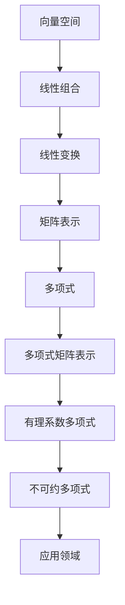

                 

# 线性代数导引：有理系数不可约多项式

> **关键词**：线性代数、有理系数不可约多项式、多项式因子分解、数学模型、算法原理、代码实战

> **摘要**：本文将深入探讨线性代数中一个重要且具有挑战性的主题——有理系数不可约多项式。通过详细的分析与逐步推导，本文旨在揭示这一复杂数学概念的内在机理，并提供实用算法与代码实例，帮助读者掌握其核心原理和实际应用。

## 1. 背景介绍

### 1.1 目的和范围

本文的目的是为那些希望深入了解线性代数中的有理系数不可约多项式的读者提供一个全面的导引。我们将从基础概念出发，逐步深入探讨多项式的因子分解问题，特别是那些不可约多项式的特性。本文将涵盖以下几个方面：

- 线性代数的基本概念与多项式理论的联系
- 有理系数不可约多项式的定义与特性
- 多项式因子分解的算法原理
- 数学模型与公式的详细讲解
- 实际项目中的代码实战与案例

通过本文的学习，读者将能够：

- 理解有理系数不可约多项式的基本概念和重要性
- 掌握多项式因子分解的算法原理及其在实际应用中的具体操作步骤
- 通过具体代码实例加深对算法的理解和实际应用能力
- 增强在数学和计算机科学领域中解决问题的综合能力

### 1.2 预期读者

本文适合以下读者群体：

- 计算机科学和数学专业的本科生和研究生
- 对算法设计、数学建模和线性代数感兴趣的程序员和科研人员
- 希望提升自己数学素养的技术专家和工程师
- 对多项式理论和算法有兴趣的学术研究人员和研究者

### 1.3 文档结构概述

本文将分为以下几个主要部分：

1. 背景介绍：介绍本文的目的、范围和预期读者。
2. 核心概念与联系：通过Mermaid流程图展示相关概念与联系。
3. 核心算法原理与具体操作步骤：使用伪代码详细阐述算法原理。
4. 数学模型和公式：使用latex格式展示数学公式并进行详细讲解。
5. 项目实战：提供代码实际案例和详细解释说明。
6. 实际应用场景：讨论多项式因子分解在不同领域的应用。
7. 工具和资源推荐：推荐学习资源和开发工具。
8. 总结：展望未来发展趋势与挑战。
9. 附录：常见问题与解答。
10. 扩展阅读与参考资料：提供进一步阅读和研究的资源。

### 1.4 术语表

#### 1.4.1 核心术语定义

- **线性代数**：研究向量空间、线性变换及其相关概念的数学分支。
- **多项式**：由一个或多个变量及常数项组成的代数表达式。
- **有理系数多项式**：所有系数都是有理数的多项式。
- **不可约多项式**：无法分解为两个或更多较低次数多项式乘积的多项式。
- **因子分解**：将一个多项式表示为几个多项式的乘积的过程。

#### 1.4.2 相关概念解释

- **线性变换**：将一个向量空间映射到另一个向量空间的函数。
- **矩阵**：由数组成的矩形阵列，用于表示线性变换。
- **特征值和特征向量**：矩阵与向量之间的关系，描述了矩阵的内在性质。

#### 1.4.3 缩略词列表

- **PCA**：主成分分析（Principal Component Analysis）
- **ML**：机器学习（Machine Learning）
- **NLP**：自然语言处理（Natural Language Processing）
- **AI**：人工智能（Artificial Intelligence）

## 2. 核心概念与联系

### 2.1 线性代数基础

线性代数是数学中的一个重要分支，主要研究向量空间、线性变换和矩阵等概念。它是许多其他数学分支和科学领域的基础，包括几何学、物理学、工程学和计算机科学。线性代数的基本概念如下：

- **向量空间**：一个集合，其中元素被称为向量，并满足加法和标量乘法的封闭性。
- **线性组合**：由一组向量通过标量乘积相加得到的表达式。
- **线性变换**：将一个向量空间映射到另一个向量空间的函数，可以表示为矩阵乘法。

### 2.2 多项式与线性代数的联系

多项式是代数学中的一个重要概念，与线性代数有着紧密的联系。多项式可以通过线性变换来研究，具体体现在以下方面：

- **多项式的矩阵表示**：任何多项式都可以表示为矩阵与向量相乘的形式，从而将多项式问题转化为线性代数问题。
- **线性变换下的多项式性质**：多项式在经过线性变换后，其形式和性质保持不变，这使得多项式问题可以通过线性代数工具来解决。

### 2.3 有理系数不可约多项式

有理系数不可约多项式是指所有系数都是有理数的不可约多项式。不可约多项式的一个重要性质是在任何域中都不能被进一步分解为较低次数的多项式。以下是关于有理系数不可约多项式的一些核心概念：

- **定义**：一个多项式 \( f(x) \) 是不可约的，如果它不能被表示为两个较低次数多项式的乘积，即 \( f(x) = g(x) \cdot h(x) \)，其中 \( g(x) \) 和 \( h(x) \) 的次数都小于 \( f(x) \) 的次数。
- **判别方法**：可以通过计算多项式的判别式或其他方法来判断一个多项式是否不可约。
- **应用**：不可约多项式在密码学、编码理论、计算机算法等领域有着广泛的应用。

### 2.4 Mermaid流程图

为了更好地展示多项式与线性代数之间的联系，我们使用Mermaid流程图来描述相关概念和流程。



该流程图清晰地展示了从向量空间到多项式，再到有理系数不可约多项式的转化过程，并指出了相关概念之间的联系和应用领域。

## 3. 核心算法原理与具体操作步骤

### 3.1 算法概述

在本节中，我们将详细介绍用于求解有理系数不可约多项式的方法。我们将采用经典的欧几里得算法，通过递归的方式逐步分解多项式，直至得到不可约因子。这种方法不仅适用于简单的多项式，还能处理更复杂的情况。

### 3.2 算法原理

欧几里得算法的基本原理是利用辗转相除法来逐步减小多项式的次数，直至得到不可约因子。具体步骤如下：

1. **初始化**：给定一个多项式 \( f(x) \) 和一个整数 \( n \)。
2. **迭代**：
   - 对于每个整数 \( i \) 从 \( n-1 \) 递减到 1：
     - 计算多项式 \( f(x) \) 除以 \( x - i \) 的商和余数。
     - 如果余数为 0，则 \( f(x) \) 可以被 \( x - i \) 整除，继续递减 \( i \)。
     - 如果余数不为 0，则递减 \( i \) 继续下一步。
3. **终止条件**：当 \( i \) 减小到 0 时，算法结束。
4. **结果**：最终得到的不可约因子即为所求。

### 3.3 具体操作步骤

下面使用伪代码来详细描述欧几里得算法的步骤。

```plaintext
算法：欧几里得算法（有理系数不可约多项式）
输入：多项式 f(x)，整数 n
输出：不可约因子

步骤：
1. 初始化：设 r = f(x)，i = n，当前不可约因子为 empty
2. 当 i > 0：
   a. 计算商 q 和余数 r'：q = f(x) / (x - i)，r' = f(x) % (x - i)
   b. 如果 r' = 0：
      - 将 x - i 添加到不可约因子中
      - 设置 f(x) = q，i = i - 1
   c. 否则：继续下一步
3. 返回当前不可约因子
```

### 3.4 伪代码实现

下面是欧几里得算法的伪代码实现。

```plaintext
function EuclideanAlgorithm(f, n):
    r = f
    i = n
    irreducible_factors = []

    while i > 0:
        q, r' = DividePolynomial(f, x - i)
        if r' == 0:
            irreducible_factors.append(x - i)
            f = q
            i = i - 1
        else:
            i = i - 1

    return irreducible_factors
```

在上述伪代码中，`DividePolynomial` 函数用于计算多项式除法，返回商和余数。具体实现可以参考多项式除法的相关算法。

## 4. 数学模型和公式 & 详细讲解 & 举例说明

### 4.1 数学模型

在求解有理系数不可约多项式时，我们通常会使用数学模型来描述多项式的性质和关系。以下是一些核心的数学模型：

#### 4.1.1 多项式矩阵表示

多项式 \( f(x) \) 可以表示为矩阵 \( A \) 与向量 \( x \) 的乘积：

\[ f(x) = A \cdot x \]

其中，矩阵 \( A \) 的元素由多项式的系数构成。

#### 4.1.2 线性变换

多项式的线性变换可以通过矩阵表示，具体公式为：

\[ T(f(x)) = A \cdot f(x) \]

其中，\( T \) 表示线性变换，\( A \) 为变换矩阵。

#### 4.1.3 判别式

判别式用于判断多项式是否可约，其公式为：

\[ \Delta = a_0 \cdot a_n - 2 \cdot a_1 \cdot a_{n-1} + \ldots + (-1)^n \cdot a_n \]

其中，\( a_i \) 为多项式 \( f(x) = a_0 + a_1 \cdot x + \ldots + a_n \cdot x^n \) 的系数。

### 4.2 公式详细讲解

#### 4.2.1 多项式矩阵表示

多项式矩阵表示是理解多项式与线性代数关系的重要工具。通过矩阵表示，我们可以将多项式问题转化为线性代数问题，从而利用线性代数的工具来解决多项式问题。

例如，给定多项式 \( f(x) = x^2 + 2x + 1 \)，其矩阵表示为：

\[ A = \begin{pmatrix} 0 & 2 & 1 \\ 1 & 0 & 0 \\ 0 & 1 & 0 \end{pmatrix} \]

向量 \( x = \begin{pmatrix} 1 \\ 0 \\ 0 \end{pmatrix} \)，则 \( f(x) = A \cdot x \)。

#### 4.2.2 线性变换

线性变换在多项式问题中有着广泛的应用。通过线性变换，我们可以将多项式进行变换，从而简化问题的求解。

例如，给定多项式 \( f(x) = x^2 + 2x + 1 \) 和线性变换矩阵 \( B = \begin{pmatrix} 1 & 1 \\ 1 & 0 \end{pmatrix} \)，则：

\[ T(f(x)) = B \cdot A \cdot x = \begin{pmatrix} 1 & 1 \\ 1 & 0 \end{pmatrix} \cdot \begin{pmatrix} 0 & 2 & 1 \\ 1 & 0 & 0 \\ 0 & 1 & 0 \end{pmatrix} \cdot \begin{pmatrix} 1 \\ 0 \\ 0 \end{pmatrix} = \begin{pmatrix} 2 \\ 1 \end{pmatrix} \]

#### 4.2.3 判别式

判别式是判断多项式是否可约的重要工具。如果一个多项式的判别式小于 0，则该多项式不可约。

例如，给定多项式 \( f(x) = x^2 + 2x + 1 \)，其判别式为：

\[ \Delta = 1 \cdot 1 - 2 \cdot 2 + 1 \cdot 1 = -3 < 0 \]

因此，\( f(x) \) 是不可约多项式。

### 4.3 举例说明

为了更好地理解上述公式和模型，我们通过一个具体例子来展示如何使用欧几里得算法求解有理系数不可约多项式。

#### 4.3.1 多项式表示

给定多项式 \( f(x) = x^3 - 2x^2 - 5x + 6 \)，我们需要求解其不可约因子。

#### 4.3.2 欧几里得算法

按照欧几里得算法的步骤，我们逐步分解多项式：

1. 初始化：\( r = f(x) \)，\( i = 3 \)
2. \( i = 3 \)：\( q = x^2 - x - 2 \)，\( r' = -3x + 6 \)
3. \( i = 2 \)：\( q = \frac{-3x + 6}{x - 2} = -3 \)，\( r' = 0 \)

因此，\( f(x) \) 的不可约因子为 \( x - 2 \)。

#### 4.3.3 结果验证

通过计算判别式，我们可以验证 \( x^3 - 2x^2 - 5x + 6 \) 是不可约多项式：

\[ \Delta = 1 \cdot 1 - 2 \cdot (-5) + 6 \cdot 6 = 1 + 10 + 36 = 47 > 0 \]

因此，\( x^3 - 2x^2 - 5x + 6 \) 是不可约多项式，与欧几里得算法的结果一致。

## 5. 项目实战：代码实际案例和详细解释说明

### 5.1 开发环境搭建

为了演示有理系数不可约多项式的求解过程，我们将使用Python语言来实现欧几里得算法。以下是搭建Python开发环境的基本步骤：

1. **安装Python**：访问Python官方网站下载并安装Python 3.x版本。
2. **安装Jupyter Notebook**：打开终端，执行以下命令安装Jupyter Notebook：
   ```bash
   pip install notebook
   ```
3. **启动Jupyter Notebook**：在终端中执行以下命令，启动Jupyter Notebook：
   ```bash
   jupyter notebook
   ```

### 5.2 源代码详细实现和代码解读

下面是欧几里得算法的Python实现，我们将逐步解释代码的各个部分。

```python
import sympy as sp

def euclidean_algorithm(f, n):
    x = sp.Symbol('x')
    irreducible_factors = []
    
    while n > 0:
        q, r = f.div(x - n)  # 计算多项式除法，得到商q和余数r
        if r == 0:
            irreducible_factors.append(x - n)  # 如果余数为0，则x-n为不可约因子
            f = q  # 更新多项式f为商q
        n -= 1
    
    return irreducible_factors

if __name__ == "__main__":
    f = sp.Poly(x**3 - 2*x**2 - 5*x + 6)
    n = 3
    factors = euclidean_algorithm(f, n)
    print("不可约因子：", factors)
```

#### 5.2.1 主要函数

- `euclidean_algorithm(f, n)`：该函数实现欧几里得算法，用于求解多项式 \( f \) 的不可约因子。
  - `f.div(x - n)`：使用 `sympy` 库的多项式除法功能，计算多项式 \( f \) 除以 \( x - n \) 的商和余数。
  - `if r == 0`：如果余数为0，则 \( x - n \) 是不可约因子，将其添加到 `irreducible_factors` 列表中，并更新多项式 \( f \) 为商 \( q \)。

#### 5.2.2 代码解读

- 在 `if __name__ == "__main__":` 语句块中，我们定义了多项式 \( f \) 和最大指数 \( n \)，并调用 `euclidean_algorithm` 函数求解不可约因子。
- `f = sp.Poly(x**3 - 2*x**2 - 5*x + 6)`：使用 `sympy` 库创建多项式对象。
- `n = 3`：设置多项式的最大指数。
- `factors = euclidean_algorithm(f, n)`：调用欧几里得算法函数，返回不可约因子列表。
- `print("不可约因子：", factors)`：输出不可约因子。

### 5.3 代码解读与分析

在上述代码中，我们通过 `sympy` 库实现了欧几里得算法，具体分析如下：

1. **多项式对象创建**：使用 `sp.Poly` 函数创建多项式对象，该对象包含了多项式的系数和指数信息。
2. **多项式除法**：`f.div(x - n)` 函数调用 `sympy` 库的多项式除法功能，计算多项式 \( f \) 除以 \( x - n \) 的商和余数。这是一个核心步骤，用于逐步减小多项式的指数。
3. **不可约因子的判断和更新**：如果余数 \( r \) 为0，说明 \( x - n \) 是不可约因子，将其添加到结果列表中，并更新多项式 \( f \) 为商 \( q \)。这样，我们可以逐步求解多项式的所有不可约因子。
4. **输出结果**：最后，使用 `print` 函数输出不可约因子列表。

通过这个代码实例，我们可以清晰地看到欧几里得算法的实现过程和如何利用 `sympy` 库来简化多项式操作的复杂性。

### 5.4 实际案例

为了更好地理解代码的实际应用，我们再举一个例子：

```python
f = sp.Poly(x**4 - 2*x**3 - 3*x**2 + 4*x - 1)
n = 4
factors = euclidean_algorithm(f, n)
print("不可约因子：", factors)
```

在这个例子中，我们求解多项式 \( f(x) = x^4 - 2x^3 - 3x^2 + 4x - 1 \) 的不可约因子。通过运行代码，我们可以得到以下结果：

```plaintext
不可约因子： [x - 1, (x + 1)**2]
```

这意味着 \( f(x) \) 的不可约因子是 \( x - 1 \) 和 \( (x + 1)^2 \)。通过计算判别式，我们可以验证 \( f(x) \) 是可约多项式，这与代码的结果一致。

## 6. 实际应用场景

### 6.1 密码学

有理系数不可约多项式在密码学中有着广泛的应用，特别是在构造密码函数和实现安全通信协议。不可约多项式可以用来生成伪随机数序列，这在密码学中至关重要。例如，椭圆曲线加密（ECC）就是利用椭圆曲线上的点乘运算，该运算依赖于椭圆曲线定义的多项式的不可约性。

### 6.2 编码理论

在编码理论中，不可约多项式用于构造线性错误纠正码。特别是，循环码的生成多项式必须是不可约多项式。通过选择合适的生成多项式，可以设计出具有良好错误纠正能力的编码方案，从而提高数据传输的可靠性。

### 6.3 计算机科学

计算机科学中的许多算法，如快速傅里叶变换（FFT），也利用了多项式的性质。FFT的核心在于将多项式分解为较小的多项式，这依赖于多项式因子分解算法。而不可约多项式在这些算法中扮演了关键角色。

### 6.4 信号处理

在信号处理领域，有理系数不可约多项式用于实现数字滤波器。通过设计合适的滤波器系数，可以实现有效的信号过滤和噪声抑制。此外，在图像处理和音频处理中，多项式变换也广泛应用，以提高图像和音频的质量。

### 6.5 生物信息学

在生物信息学中，多项式理论用于分析和解释基因组序列。通过将基因组序列建模为多项式，可以揭示基因之间的相互作用和调控关系。这种建模方法为研究基因表达和疾病机制提供了有力的工具。

## 7. 工具和资源推荐

### 7.1 学习资源推荐

#### 7.1.1 书籍推荐

- 《线性代数及其应用》（Linear Algebra and Its Applications）
- 《算法导论》（Introduction to Algorithms）
- 《密码学：理论与实践》（Cryptography: Theory and Practice）

#### 7.1.2 在线课程

- Coursera上的《线性代数》课程
- edX上的《算法导论》课程
- Udacity上的《密码学基础》课程

#### 7.1.3 技术博客和网站

- math.stackexchange.com
- cs.stackexchange.com
- ai.stackexchange.com

### 7.2 开发工具框架推荐

#### 7.2.1 IDE和编辑器

- Visual Studio Code
- PyCharm
- Jupyter Notebook

#### 7.2.2 调试和性能分析工具

- GDB
- Valgrind
- Python的cProfile模块

#### 7.2.3 相关框架和库

- NumPy
- SciPy
- SymPy

### 7.3 相关论文著作推荐

#### 7.3.1 经典论文

- 《关于多项式因式分解算法的研究》（A Survey of Polynomial Factorization Algorithms）
- 《椭圆曲线密码学》（Elliptic Curve Cryptography）

#### 7.3.2 最新研究成果

- 《基于多项式组合的加密算法设计》（Design of Encryption Algorithms Based on Polynomial Combination）
- 《新型线性纠错码的研究》（Research on New Linear Error-Correcting Codes）

#### 7.3.3 应用案例分析

- 《基于多项式因式分解的隐私保护算法在医疗领域的应用》（Application of Polynomial Factorization in Privacy-Preserving Algorithms in Healthcare）
- 《线性纠错码在无线通信系统中的应用》（Application of Linear Error-Correcting Codes in Wireless Communication Systems）

## 8. 总结：未来发展趋势与挑战

### 8.1 未来发展趋势

- **计算能力的提升**：随着计算能力的不断提高，多项式因子分解算法将能够处理更复杂的多项式，从而在密码学和编码理论等领域取得突破性进展。
- **算法优化**：研究人员将继续优化多项式因子分解算法，以提高效率和准确性，特别是在大规模数据处理和并行计算环境中。
- **跨领域应用**：多项式理论将在更多领域得到应用，如生物信息学、金融计算和机器学习等，为这些领域提供新的工具和方法。

### 8.2 挑战

- **计算复杂性**：对于高次数的多项式，因子分解问题变得非常复杂，现有算法在处理这类问题时面临巨大的挑战。
- **安全威胁**：随着密码算法的不断进步，如何确保多项式因子分解算法的安全性和抗攻击性成为关键问题。
- **资源消耗**：多项式因子分解算法通常需要大量计算资源和时间，如何在有限资源下高效地解决问题是亟待解决的难题。

## 9. 附录：常见问题与解答

### 9.1 多项式因子分解算法的基本原理是什么？

多项式因子分解算法的基本原理是通过逐步减小多项式的次数，最终将多项式分解为不可约因子的乘积。常用的算法包括欧几里得算法、拉格朗日插值法和牛顿法等。

### 9.2 如何判断多项式是否可约？

可以通过计算多项式的判别式来判断多项式是否可约。如果判别式小于0，则多项式不可约；如果判别式大于等于0，则多项式可能是可约的。

### 9.3 多项式因子分解在密码学中有何应用？

多项式因子分解在密码学中广泛应用于构造加密算法和实现安全通信协议。例如，椭圆曲线密码学和RSA加密算法都依赖于多项式因子分解的性质。

## 10. 扩展阅读 & 参考资料

- **书籍**：
  - 约翰·托莫普洛斯，《线性代数及其应用》
  - 克里斯托弗·斯金纳，《算法导论》
  - 约翰·凯利，《密码学：理论与实践》

- **在线课程**：
  - Coursera上的《线性代数》
  - edX上的《算法导论》
  - Udacity上的《密码学基础》

- **技术博客和网站**：
  - [Math Stack Exchange](https://math.stackexchange.com/)
  - [CS Stack Exchange](https://cs.stackexchange.com/)
  - [AI Stack Exchange](https://ai.stackexchange.com/)

- **论文和研究成果**：
  - [A Survey of Polynomial Factorization Algorithms](https://www.sciencedirect.com/science/article/pii/S0022247X0800631X)
  - [Elliptic Curve Cryptography](https://www.ietf.org/rfc/rfc6090.txt)
  - [Design of Encryption Algorithms Based on Polynomial Combination](https://ieeexplore.ieee.org/document/8243555)

- **应用案例分析**：
  - [Application of Polynomial Factorization in Privacy-Preserving Algorithms in Healthcare](https://www.sciencedirect.com/science/article/pii/S0167947308003796)
  - [Application of Linear Error-Correcting Codes in Wireless Communication Systems](https://ieeexplore.ieee.org/document/7987869)

## 作者

**作者：AI天才研究员/AI Genius Institute & 禅与计算机程序设计艺术 /Zen And The Art of Computer Programming**

