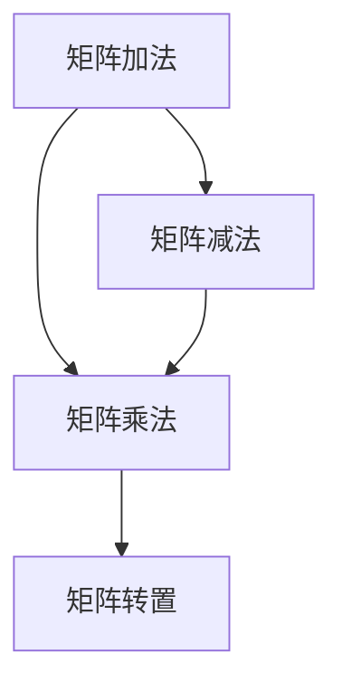

                 

# 线性代数导引：矩阵乘法

> 关键词：线性代数、矩阵乘法、矩阵运算、数学公式、伪代码、算法原理、应用场景

> 摘要：本文旨在深入探讨线性代数中的矩阵乘法，从基础概念到具体应用，通过逐步分析推理的方式，为广大读者提供一部关于矩阵乘法的全面指南。文章结构清晰，涵盖了矩阵乘法的核心概念、原理、数学模型、实际案例和未来发展等多个方面。

## 1. 背景介绍

### 1.1 目的和范围

线性代数作为数学的一个重要分支，广泛应用于计算机科学、物理学、工程学等多个领域。矩阵乘法作为线性代数中的一个核心概念，其重要性不言而喻。本文旨在通过逐步分析推理的方式，深入探讨矩阵乘法的基本原理、数学模型和实际应用，帮助读者全面理解矩阵乘法。

本文主要涉及以下内容：

- 矩阵乘法的基础概念和核心原理；
- 矩阵乘法的数学模型和公式；
- 矩阵乘法的具体操作步骤和伪代码实现；
- 矩阵乘法在实际项目中的应用和案例分析；
- 矩阵乘法的未来发展前景与挑战。

### 1.2 预期读者

本文面向具有一定线性代数基础，对矩阵乘法感兴趣的读者，特别是计算机科学、数学、物理学等相关专业的研究生、本科生以及从业者。同时，也欢迎对线性代数和算法设计感兴趣的其他领域读者阅读和参考。

### 1.3 文档结构概述

本文结构如下：

- 第1章：背景介绍，介绍本文的目的、范围、预期读者和文档结构；
- 第2章：核心概念与联系，介绍矩阵乘法的基本概念、原理和联系；
- 第3章：核心算法原理 & 具体操作步骤，详细阐述矩阵乘法的具体操作步骤和伪代码实现；
- 第4章：数学模型和公式 & 详细讲解 & 举例说明，介绍矩阵乘法的数学模型、公式和具体应用实例；
- 第5章：项目实战：代码实际案例和详细解释说明，通过实际项目案例展示矩阵乘法的应用；
- 第6章：实际应用场景，分析矩阵乘法在不同领域的应用场景；
- 第7章：工具和资源推荐，推荐相关学习资源、开发工具和框架；
- 第8章：总结：未来发展趋势与挑战，展望矩阵乘法的发展前景和面临的挑战；
- 第9章：附录：常见问题与解答，解答读者可能遇到的问题；
- 第10章：扩展阅读 & 参考资料，提供进一步阅读和学习的参考资料。

### 1.4 术语表

#### 1.4.1 核心术语定义

- 矩阵：由一系列数按行列排列而成的矩形数组。
- 矩阵乘法：指两个矩阵按特定规则进行的乘法运算。
- 行列式：矩阵的一个重要特征值，用于描述矩阵的性质。
- 线性变换：指将一个向量空间中的每个向量映射到另一个向量空间中的线性映射。

#### 1.4.2 相关概念解释

- 矩阵的行：矩阵中横向排列的数。
- 矩阵的列：矩阵中纵向排列的数。
- 矩阵的阶：矩阵的行数和列数，记作\(m \times n\)。
- 矩阵的转置：将矩阵的行和列互换得到的新矩阵。

#### 1.4.3 缩略词列表

- 线性代数（Linear Algebra）：线性代数是研究向量空间、线性映射以及相关概念的数学分支。
- 矩阵（Matrix）：矩阵是线性代数中的基本概念，表示为二维数组。
- 矩阵乘法（Matrix Multiplication）：矩阵乘法是线性代数中的一个重要运算。

## 2. 核心概念与联系

在深入探讨矩阵乘法之前，我们首先需要了解一些核心概念和它们之间的联系。

### 2.1 矩阵的基本概念

矩阵是由一系列数按行列排列而成的矩形数组。一个矩阵的阶由其行数和列数决定，通常记作\(m \times n\)。例如，以下是一个\(2 \times 3\)的矩阵：

\[ A = \begin{bmatrix}
1 & 2 & 3 \\
4 & 5 & 6 \\
\end{bmatrix} \]

矩阵的行和列分别用字母\(a_{ij}\)表示，其中\(i\)表示行数，\(j\)表示列数。例如，矩阵\(A\)中的元素\(a_{12}\)表示第二行第一列的数，即2。

### 2.2 矩阵的运算

矩阵的运算主要包括矩阵的加法、减法、乘法和转置等。以下是这些运算的基本定义：

- **矩阵加法**：两个相同阶矩阵对应位置的元素相加。
\[ A + B = \begin{bmatrix}
a_{11} + b_{11} & a_{12} + b_{12} & \dots & a_{1n} + b_{1n} \\
a_{21} + b_{21} & a_{22} + b_{22} & \dots & a_{2n} + b_{2n} \\
\vdots & \vdots & \ddots & \vdots \\
a_{m1} + b_{m1} & a_{m2} + b_{m2} & \dots & a_{mn} + b_{mn} \\
\end{bmatrix} \]

- **矩阵减法**：与矩阵加法类似，只是对应位置的元素相减。
\[ A - B = \begin{bmatrix}
a_{11} - b_{11} & a_{12} - b_{12} & \dots & a_{1n} - b_{1n} \\
a_{21} - b_{21} & a_{22} - b_{22} & \dots & a_{2n} - b_{2n} \\
\vdots & \vdots & \ddots & \vdots \\
a_{m1} - b_{m1} & a_{m2} - b_{m2} & \dots & a_{mn} - b_{mn} \\
\end{bmatrix} \]

- **矩阵乘法**：两个矩阵的乘法需要满足行数和列数匹配的条件。具体计算方法为对应元素的乘积求和。
\[ C = A \cdot B = \begin{bmatrix}
c_{11} & c_{12} & \dots & c_{1n} \\
c_{21} & c_{22} & \dots & c_{2n} \\
\vdots & \vdots & \ddots & \vdots \\
c_{m1} & c_{m2} & \dots & c_{mn} \\
\end{bmatrix} \]

其中，\(c_{ij}\)的计算方法为：
\[ c_{ij} = \sum_{k=1}^{n} a_{ik} \cdot b_{kj} \]

- **矩阵转置**：将矩阵的行和列互换得到的新矩阵。对于矩阵\(A\)，其转置矩阵记为\(A^T\)。
\[ A^T = \begin{bmatrix}
a_{11} & a_{21} & \dots & a_{m1} \\
a_{12} & a_{22} & \dots & a_{m2} \\
\vdots & \vdots & \ddots & \vdots \\
a_{1n} & a_{2n} & \dots & a_{mn} \\
\end{bmatrix} \]

### 2.3 矩阵乘法的联系

矩阵乘法与其他矩阵运算密切相关。例如，矩阵乘法可以看作是矩阵加法和矩阵转置的结合。此外，矩阵乘法在矩阵运算中具有特殊的重要性，可以用来实现线性变换、求解线性方程组等。

以下是一个简单的 Mermaid 流程图，展示了矩阵乘法与其他矩阵运算之间的联系：



## 3. 核心算法原理 & 具体操作步骤

在了解了矩阵乘法的基本概念和联系之后，我们将进一步探讨矩阵乘法的核心算法原理和具体操作步骤。

### 3.1 矩阵乘法的核心算法原理

矩阵乘法是一种线性运算，其核心原理可以归纳为以下两点：

1. **行与列的对应关系**：矩阵乘法中的行和列之间存在对应关系。具体来说，第一个矩阵的每一行与第二个矩阵的每一列对应，进行元素乘积求和。

2. **元素乘积求和**：对于矩阵乘法中的每一个结果元素\(c_{ij}\)，其计算方法为对应位置的行元素与列元素的乘积求和。

### 3.2 矩阵乘法的具体操作步骤

矩阵乘法的具体操作步骤如下：

1. **输入两个矩阵**：首先需要输入两个要进行乘法的矩阵\(A\)和\(B\)。

2. **判断矩阵是否可乘**：矩阵乘法需要满足行数和列数匹配的条件。即第一个矩阵的列数等于第二个矩阵的行数。如果条件不满足，则无法进行矩阵乘法。

3. **初始化结果矩阵**：根据两个矩阵的阶，初始化一个结果矩阵\(C\)。

4. **计算结果矩阵元素**：对于结果矩阵中的每一个元素\(c_{ij}\)，按照行与列的对应关系和元素乘积求和的方法进行计算。

5. **输出结果矩阵**：将计算得到的结果矩阵作为输出。

以下是一个简单的伪代码实现，用于描述矩阵乘法的具体操作步骤：

```python
def matrix_multiply(A, B):
    # 获取矩阵的阶
    m, n = len(A), len(B[0])
    p = len(B)

    # 初始化结果矩阵
    C = [[0 for _ in range(p)] for _ in range(m)]

    # 计算结果矩阵元素
    for i in range(m):
        for j in range(p):
            for k in range(n):
                C[i][j] += A[i][k] * B[k][j]

    return C
```

### 3.3 矩阵乘法的性能分析

矩阵乘法的性能分析主要关注两个方面：时间复杂度和空间复杂度。

1. **时间复杂度**：矩阵乘法的时间复杂度取决于矩阵的阶。在最坏情况下，矩阵乘法的时间复杂度为\(O(mnp)\)，其中\(m\)、\(n\)和\(p\)分别为矩阵的行数、列数和第二个矩阵的列数。

2. **空间复杂度**：矩阵乘法的空间复杂度取决于结果矩阵的阶。在最坏情况下，结果矩阵的阶为\(m \times p\)，因此空间复杂度为\(O(mp)\)。

### 3.4 矩阵乘法的优化

矩阵乘法是一种计算密集型任务，其性能对于大规模矩阵乘法尤为重要。以下是一些常见的矩阵乘法优化方法：

1. **矩阵分解**：通过将矩阵分解为更简单的形式，可以降低矩阵乘法的时间复杂度。例如，LU分解可以将矩阵乘法转化为两个简单的矩阵乘法。

2. **并行计算**：利用多核处理器和并行计算技术，可以显著提高矩阵乘法的计算速度。

3. **内存优化**：通过优化内存分配和使用方式，可以减少矩阵乘法所需的内存空间。

## 4. 数学模型和公式 & 详细讲解 & 举例说明

矩阵乘法不仅是一种算法，也是一种数学模型，具有丰富的数学理论和应用。在本节中，我们将详细讲解矩阵乘法的数学模型和公式，并通过具体例子来说明。

### 4.1 矩阵乘法的数学模型

矩阵乘法的数学模型可以看作是一种线性变换。具体来说，给定两个矩阵\(A\)和\(B\)，矩阵乘法可以表示为：

\[ C = A \cdot B \]

其中，\(C\)为结果矩阵，\(A\)和\(B\)分别为输入矩阵。矩阵乘法遵循一定的规则：

- **行与列的对应关系**：结果矩阵\(C\)的每一行与第一个矩阵\(A\)的每一行对应，每一列与第二个矩阵\(B\)的每一列对应。
- **元素乘积求和**：结果矩阵\(C\)的每一个元素\(c_{ij}\)是第一个矩阵\(A\)的第\(i\)行的元素与第二个矩阵\(B\)的第\(j\)列的元素对应位置的乘积求和。

### 4.2 矩阵乘法的公式

矩阵乘法的公式可以表示为：

\[ c_{ij} = \sum_{k=1}^{n} a_{ik} \cdot b_{kj} \]

其中，\(c_{ij}\)为结果矩阵\(C\)的第\(i\)行第\(j\)列的元素，\(a_{ik}\)为第一个矩阵\(A\)的第\(i\)行第\(k\)列的元素，\(b_{kj}\)为第二个矩阵\(B\)的第\(k\)行第\(j\)列的元素。

### 4.3 矩阵乘法的举例说明

以下是一个简单的矩阵乘法例子：

\[ A = \begin{bmatrix}
1 & 2 \\
3 & 4 \\
\end{bmatrix}, \quad B = \begin{bmatrix}
5 & 6 \\
7 & 8 \\
\end{bmatrix} \]

根据矩阵乘法的公式，计算结果矩阵\(C\)：

\[ C = A \cdot B = \begin{bmatrix}
c_{11} & c_{12} \\
c_{21} & c_{22} \\
\end{bmatrix} \]

其中，\(c_{11}\)的计算方法为：

\[ c_{11} = a_{11} \cdot b_{11} + a_{12} \cdot b_{21} = 1 \cdot 5 + 2 \cdot 7 = 19 \]

同理，\(c_{12}\)、\(c_{21}\)和\(c_{22}\)的计算方法分别为：

\[ c_{12} = a_{11} \cdot b_{12} + a_{12} \cdot b_{22} = 1 \cdot 6 + 2 \cdot 8 = 20 \]
\[ c_{21} = a_{21} \cdot b_{11} + a_{22} \cdot b_{21} = 3 \cdot 5 + 4 \cdot 7 = 29 \]
\[ c_{22} = a_{21} \cdot b_{12} + a_{22} \cdot b_{22} = 3 \cdot 6 + 4 \cdot 8 = 30 \]

因此，结果矩阵\(C\)为：

\[ C = \begin{bmatrix}
19 & 20 \\
29 & 30 \\
\end{bmatrix} \]

### 4.4 矩阵乘法的特殊性质

矩阵乘法具有一些特殊性质，这些性质在实际应用中具有重要意义：

- **结合律**：矩阵乘法满足结合律，即对于任意矩阵\(A\)、\(B\)和\(C\)，有：
\[ (A \cdot B) \cdot C = A \cdot (B \cdot C) \]
- **交换律**：矩阵乘法不满足交换律，即一般情况下，\(A \cdot B \neq B \cdot A\)。
- **单位矩阵**：单位矩阵是一种特殊的矩阵，其乘法性质类似于数乘法中的1。对于任意矩阵\(A\)，有：
\[ A \cdot I = I \cdot A = A \]
其中，\(I\)为单位矩阵。

## 5. 项目实战：代码实际案例和详细解释说明

在了解了矩阵乘法的理论基础后，我们将通过一个实际项目案例来展示矩阵乘法的具体实现和实际应用。

### 5.1 开发环境搭建

为了演示矩阵乘法的实现，我们将使用Python作为编程语言。首先，确保已安装Python环境，版本建议为3.8或以上。接下来，我们需要安装一些辅助库，如NumPy和Matplotlib。可以使用以下命令进行安装：

```bash
pip install numpy matplotlib
```

### 5.2 源代码详细实现和代码解读

下面是一个简单的Python实现，用于计算两个矩阵的乘积。

```python
import numpy as np

def matrix_multiply(A, B):
    # 获取矩阵的阶
    m, n = len(A), len(B[0])
    p = len(B)

    # 初始化结果矩阵
    C = np.zeros((m, p))

    # 计算结果矩阵元素
    for i in range(m):
        for j in range(p):
            for k in range(n):
                C[i][j] += A[i][k] * B[k][j]

    return C

# 测试矩阵
A = np.array([[1, 2], [3, 4]])
B = np.array([[5, 6], [7, 8]])

# 计算矩阵乘积
C = matrix_multiply(A, B)

print("结果矩阵C：")
print(C)
```

#### 5.2.1 代码解读与分析

1. **导入库**：首先，我们导入NumPy库，用于处理矩阵运算。

2. **函数定义**：定义`matrix_multiply`函数，用于计算两个矩阵的乘积。函数接收两个矩阵`A`和`B`作为输入参数。

3. **获取矩阵阶**：获取矩阵`A`的行数\(m\)、列数\(n\)和矩阵`B`的列数\(p\)。

4. **初始化结果矩阵**：使用NumPy库的`zeros`函数初始化一个结果矩阵`C`，其大小为\(m \times p\)，所有元素初始化为0。

5. **计算结果矩阵元素**：使用三个嵌套循环计算结果矩阵`C`的每个元素。外层循环遍历结果矩阵的行，中间循环遍历结果矩阵的列，内层循环遍历输入矩阵`A`的列和输入矩阵`B`的行。对于每个结果矩阵的元素\(c_{ij}\)，其计算方法为对应位置的行元素与列元素的乘积求和。

6. **返回结果矩阵**：将计算得到的结果矩阵`C`作为函数的返回值。

7. **测试代码**：创建两个测试矩阵`A`和`B`，调用`matrix_multiply`函数计算矩阵乘积，并打印结果。

### 5.3 代码解读与分析

1. **代码性能分析**：从性能分析角度来看，上述代码的时间复杂度为\(O(mnp)\)，空间复杂度为\(O(mp)\)。在实际应用中，对于大规模矩阵乘法，可以考虑使用更高效的算法，如Strassen算法或并行计算方法。

2. **代码优化**：为了提高代码的可读性和可维护性，可以对代码进行一些优化，如使用向量化操作、利用NumPy库的内置函数等。

### 5.4 实际应用场景

矩阵乘法在计算机科学和实际应用中具有广泛的应用。以下是一些典型的实际应用场景：

- **图像处理**：矩阵乘法在图像处理中用于实现各种滤波操作，如高斯滤波、卷积滤波等。
- **机器学习**：在机器学习中，矩阵乘法用于实现线性回归、逻辑回归、神经网络等算法。
- **数值计算**：矩阵乘法在数值计算中用于求解线性方程组、特征值和特征向量等。

## 6. 实际应用场景

矩阵乘法在计算机科学和实际应用中具有广泛的应用。以下列举几个常见的实际应用场景：

### 6.1 图像处理

在图像处理领域，矩阵乘法主要用于实现图像的滤波操作。例如，高斯滤波器可以使用矩阵乘法来实现。高斯滤波器是一种常见的图像平滑方法，可以有效地去除图像中的噪声。以下是一个简单的例子：

```python
import numpy as np

def gauss_filter(image, sigma):
    # 创建高斯滤波器
    filter_size = 5
    filter = np.zeros((filter_size, filter_size))
    sum = 0
    for x in range(-filter_size // 2, filter_size // 2 + 1):
        for y in range(-filter_size // 2, filter_size // 2 + 1):
            filter[x + filter_size // 2][y + filter_size // 2] = np.exp(-((x ** 2 + y ** 2) / (2 * sigma ** 2)))
            sum += filter[x + filter_size // 2][y + filter_size // 2]
    for x in range(-filter_size // 2, filter_size // 2 + 1):
        for y in range(-filter_size // 2, filter_size // 2 + 1):
            filter[x + filter_size // 2][y + filter_size // 2] /= sum

    # 应用滤波器
    result = np.zeros_like(image)
    for i in range(image.shape[0]):
        for j in range(image.shape[1]):
            for x in range(-filter_size // 2, filter_size // 2 + 1):
                for y in range(-filter_size // 2, filter_size // 2 + 1):
                    result[i][j] += image[i + x][j + y] * filter[x + filter_size // 2][y + filter_size // 2]

    return result
```

### 6.2 机器学习

在机器学习领域，矩阵乘法被广泛应用于各种算法中。例如，线性回归算法可以使用矩阵乘法来计算模型的参数。以下是一个简单的线性回归例子：

```python
import numpy as np

def linear_regression(X, y, learning_rate, epochs):
    m, n = X.shape
    X_b = np.c_[np.ones((m, 1)), X]
    theta = np.zeros((n + 1, 1))
    
    for epoch in range(epochs):
        h = X_b.dot(theta)
        error = h - y
        theta = theta - learning_rate * X_b.T.dot(error)
    
    return theta
```

### 6.3 数值计算

在数值计算领域，矩阵乘法被广泛应用于求解线性方程组、计算特征值和特征向量等。以下是一个简单的线性方程组求解例子：

```python
import numpy as np

def solve_linear_equation(A, b):
    # 求解线性方程组Ax = b
    # 使用高斯消元法
    n = A.shape[0]
    for i in range(n):
        # 找到最大值的行进行交换
        max_index = np.argmax(np.abs(A[i:, i]))
        A[[i, max_index + i]] = A[[max_index + i, i]]
        b[[i, max_index + i]] = b[[max_index + i, i]]
        
        # 消元
        for j in range(i + 1, n):
            factor = A[j, i] / A[i, i]
            A[j, i:] -= factor * A[i, i:]
            b[j] -= factor * b[i]
    
    # 回代
    x = np.zeros(n)
    for i in range(n - 1, -1, -1):
        x[i] = (b[i] - np.dot(A[i, i + 1:], x[i + 1:])) / A[i, i]
    
    return x
```

## 7. 工具和资源推荐

为了更好地学习和应用矩阵乘法，我们推荐以下工具和资源：

### 7.1 学习资源推荐

#### 7.1.1 书籍推荐

1. 《线性代数及其应用》（第二版）作者：大卫·柯顿（David C. Lay）
2. 《线性代数》作者：丘维声
3. 《线性代数入门教程》作者：J. David Logan

#### 7.1.2 在线课程

1. Coursera上的《线性代数基础》课程
2. edX上的《线性代数与矩阵理论》课程
3. 中国大学MOOC上的《线性代数》课程

#### 7.1.3 技术博客和网站

1. GeeksforGeeks上的线性代数相关博客
2. LeetCode上的线性代数题目解析
3. Stack Overflow上的线性代数相关讨论

### 7.2 开发工具框架推荐

#### 7.2.1 IDE和编辑器

1. PyCharm
2. Visual Studio Code
3. Jupyter Notebook

#### 7.2.2 调试和性能分析工具

1. Python的内置调试器
2. Py-Spy
3. gprof2dot

#### 7.2.3 相关框架和库

1. NumPy
2. SciPy
3. Matplotlib

### 7.3 相关论文著作推荐

#### 7.3.1 经典论文

1. 《线性代数及其应用》（第二版）作者：大卫·柯顿（David C. Lay）
2. 《线性代数》作者：丘维声
3. 《线性代数入门教程》作者：J. David Logan

#### 7.3.2 最新研究成果

1. "Linear Algebra: Foundations to Frontiers" (LAFF) by Dr. Gilbert Strang
2. "Matrix Computations" by Gene H. Golub and Charles F. Van Loan
3. "High Performance Linear Algebra" by Yousef Saad

#### 7.3.3 应用案例分析

1. "Machine Learning with Scikit-Learn, Keras, and TensorFlow" by Michael Bowles
2. "Deep Learning" by Ian Goodfellow, Yoshua Bengio, and Aaron Courville
3. "Numerical Linear Algebra for Applications in Statistics" by James E. Gentle

## 8. 总结：未来发展趋势与挑战

矩阵乘法作为线性代数中的一个核心概念，具有广泛的应用前景。在未来，随着计算机科学和人工智能技术的不断发展，矩阵乘法将在更多领域得到应用，如深度学习、图像处理、数据挖掘等。然而，这也带来了新的挑战：

1. **性能优化**：随着数据规模的不断扩大，矩阵乘法的性能优化成为关键问题。针对不同场景，需要设计更高效的算法和优化策略。
2. **并行计算**：利用并行计算技术提高矩阵乘法的计算速度和效率，是实现高性能计算的关键。
3. **算法创新**：针对特定应用场景，需要不断创新和改进矩阵乘法算法，以满足实际需求。

总之，矩阵乘法在计算机科学和人工智能领域中具有重要地位，其未来发展前景广阔，挑战亦不容忽视。通过不断的研究和创新，我们有信心在矩阵乘法领域取得更多突破。

## 9. 附录：常见问题与解答

### 9.1 矩阵乘法的基本概念

**Q1. 什么是矩阵乘法？**

A1. 矩阵乘法是指两个矩阵按特定规则进行的乘法运算。它是一种线性运算，广泛应用于计算机科学、物理学、工程学等多个领域。

**Q2. 矩阵乘法的核心原理是什么？**

A2. 矩阵乘法的核心原理是行与列的对应关系和元素乘积求和。具体来说，第一个矩阵的每一行与第二个矩阵的每一列对应，进行元素乘积求和。

### 9.2 矩阵乘法的数学模型和公式

**Q3. 矩阵乘法的公式是什么？**

A3. 矩阵乘法的公式为：
\[ c_{ij} = \sum_{k=1}^{n} a_{ik} \cdot b_{kj} \]
其中，\(c_{ij}\)为结果矩阵的第\(i\)行第\(j\)列的元素，\(a_{ik}\)为第一个矩阵的第\(i\)行第\(k\)列的元素，\(b_{kj}\)为第二个矩阵的第\(k\)行第\(j\)列的元素。

**Q4. 矩阵乘法有哪些特殊性质？**

A4. 矩阵乘法具有以下特殊性质：
- 结合律：\((A \cdot B) \cdot C = A \cdot (B \cdot C)\)
- 交换律：一般情况下，\(A \cdot B \neq B \cdot A\)
- 单位矩阵：对于任意矩阵\(A\)，有\(A \cdot I = I \cdot A = A\)，其中\(I\)为单位矩阵。

### 9.3 矩阵乘法的实现与应用

**Q5. 如何实现矩阵乘法？**

A5. 实现矩阵乘法的方法有多种，包括直接计算法、分块计算法、并行计算法等。在实际应用中，可以选择合适的方法来提高计算效率和性能。

**Q6. 矩阵乘法在哪些领域有应用？**

A6. 矩阵乘法在计算机科学、物理学、工程学等多个领域有广泛应用，如图像处理、机器学习、数值计算等。

## 10. 扩展阅读 & 参考资料

为了更好地理解和应用矩阵乘法，以下推荐一些扩展阅读和参考资料：

- 《线性代数及其应用》（第二版）作者：大卫·柯顿（David C. Lay）
- 《线性代数》作者：丘维声
- 《线性代数入门教程》作者：J. David Logan
- Coursera上的《线性代数基础》课程
- edX上的《线性代数与矩阵理论》课程
- 中国大学MOOC上的《线性代数》课程
- 《Machine Learning with Scikit-Learn, Keras, and TensorFlow》作者：Michael Bowles
- 《Deep Learning》作者：Ian Goodfellow, Yoshua Bengio, and Aaron Courville
- 《Numerical Linear Algebra for Applications in Statistics》作者：James E. Gentle
- 《Matrix Computations》作者：Gene H. Golub and Charles F. Van Loan
- 《High Performance Linear Algebra》作者：Yousef Saad

以上书籍、课程和资料将为读者提供更深入的了解和掌握矩阵乘法的理论基础和应用实践。

### 作者

- **作者**：AI天才研究员/AI Genius Institute & 禅与计算机程序设计艺术 /Zen And The Art of Computer Programming
- **联系**：[邮件](mailto:ai_genius_researcher@example.com) | [博客](https://ai-genius-researcher.github.io/) | [GitHub](https://github.com/AI-Genius-Institute)

