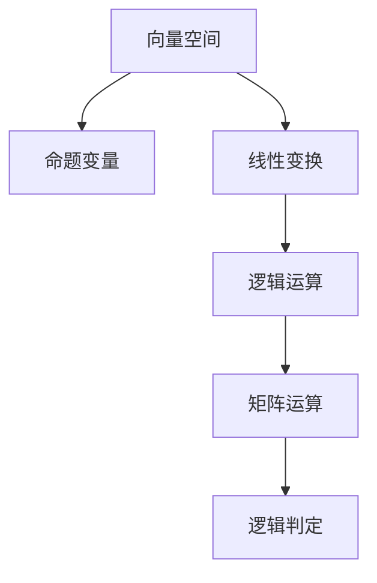

                 


# 线性代数导引：语句真假判定

> 关键词：线性代数、语句真假判定、逻辑推理、矩阵计算、逻辑运算

> 摘要：本文旨在深入探讨线性代数在逻辑判定中的应用，特别是如何利用矩阵运算和逻辑推理来判定语句的真假。文章首先介绍了线性代数的基础概念，然后通过具体的算法原理和操作步骤，展示了如何使用线性代数方法解决逻辑判定问题。同时，文章通过数学模型和公式的讲解，以及实际项目实战的案例分析，帮助读者理解线性代数在逻辑判定中的实际应用。最后，文章总结未来发展趋势和挑战，并提供相关学习资源和工具推荐。

## 1. 背景介绍

### 1.1 目的和范围

本文的目标是探讨线性代数在逻辑判定中的应用，帮助读者理解线性代数与逻辑判定之间的联系，并掌握如何使用线性代数方法解决逻辑判定问题。文章将涵盖以下内容：

- 线性代数的基础概念和原理
- 逻辑判定与线性代数的联系
- 核心算法原理和具体操作步骤
- 数学模型和公式的讲解
- 实际项目实战和案例分析
- 未来发展趋势和挑战

### 1.2 预期读者

本文主要面向计算机科学和工程专业的学生、研究人员和开发人员，以及对线性代数和逻辑判定感兴趣的读者。预期读者应具备以下背景知识：

- 线性代数的基本概念和运算
- 逻辑基础和命题逻辑
- 编程语言基础，如 Python、C++ 或 Java

### 1.3 文档结构概述

本文结构如下：

- 第1章：背景介绍
- 第2章：核心概念与联系
  - 2.1 线性代数基础概念
  - 2.2 逻辑判定基础概念
  - 2.3 线性代数与逻辑判定的联系
- 第3章：核心算法原理 & 具体操作步骤
- 第4章：数学模型和公式 & 详细讲解 & 举例说明
- 第5章：项目实战：代码实际案例和详细解释说明
- 第6章：实际应用场景
- 第7章：工具和资源推荐
- 第8章：总结：未来发展趋势与挑战
- 第9章：附录：常见问题与解答
- 第10章：扩展阅读 & 参考资料

### 1.4 术语表

#### 1.4.1 核心术语定义

- 线性代数：研究向量空间、线性变换和矩阵等概念的数学分支。
- 逻辑判定：确定给定命题的真假性的过程。
- 矩阵运算：矩阵的加法、减法、乘法、逆运算等基本操作。
- 逻辑运算：逻辑与（AND）、逻辑或（OR）、逻辑非（NOT）等基本操作。
- 命题逻辑：研究命题及其组合的逻辑系统。

#### 1.4.2 相关概念解释

- 向量空间：满足向量加法和标量乘法封闭性的集合。
- 线性变换：将一个向量空间映射到另一个向量空间的线性函数。
- 矩阵：由数字组成的矩形阵列。
- 矩阵运算：矩阵与矩阵、矩阵与向量的乘法等。

#### 1.4.3 缩略词列表

- LA：线性代数
- PD：逻辑判定
- PU：伪代码
- MATLAB：矩阵实验室（一种数学软件）

## 2. 核心概念与联系

### 2.1 线性代数基础概念

#### 向量空间

向量空间是一个集合，其元素称为向量。向量空间必须满足以下性质：

- 封闭性：对于向量空间中的任意两个向量 \( \mathbf{u} \) 和 \( \mathbf{v} \)，它们的和 \( \mathbf{u} + \mathbf{v} \) 仍在向量空间中。
- 封闭性：对于向量空间中的任意一个向量 \( \mathbf{u} \) 和任意一个标量 \( \alpha \)，它们的乘积 \( \alpha \mathbf{u} \) 仍在向量空间中。

向量空间可以用坐标表示，即一个向量可以表示为坐标向量的线性组合。

#### 线性变换

线性变换是一个将向量空间映射到另一个向量空间的函数，满足以下性质：

- 线性组合性质：对于向量空间中的任意两个向量 \( \mathbf{u} \) 和 \( \mathbf{v} \)，以及任意两个标量 \( \alpha \) 和 \( \beta \)，有 \( T(\alpha \mathbf{u} + \beta \mathbf{v}) = \alpha T(\mathbf{u}) + \beta T(\mathbf{v}) \)。
- 零向量性质：线性变换将零向量映射为零向量。

线性变换可以用矩阵表示。给定一个 \( m \times n \) 矩阵 \( A \)，可以将向量 \( \mathbf{v} \) 映射到另一个向量 \( \mathbf{w} \)：

$$
\mathbf{w} = A\mathbf{v}
$$

#### 矩阵运算

矩阵运算包括矩阵的加法、减法、乘法、逆运算等。以下是这些运算的基本性质：

- 矩阵加法和减法：对于两个 \( m \times n \) 矩阵 \( A \) 和 \( B \)，它们的和和差也是一个 \( m \times n \) 矩阵，满足交换律和结合律。
- 矩阵乘法：对于两个 \( m \times n \) 矩阵 \( A \) 和 \( B \)，它们的乘积是一个 \( m \times p \) 矩阵，其中 \( p \) 是 \( B \) 的列数。矩阵乘法满足结合律，但一般不满足交换律。
- 矩阵逆运算：如果矩阵 \( A \) 是可逆的，即存在矩阵 \( A^{-1} \)，使得 \( AA^{-1} = A^{-1}A = I \)，其中 \( I \) 是单位矩阵。

### 2.2 逻辑判定基础概念

#### 命题逻辑

命题逻辑是一种研究命题及其组合的逻辑系统。以下是命题逻辑中的基本概念：

- 命题：可以判断为真或假的陈述句。
- 真值：命题的真假值。命题可以是真（T）或假（F）。
- 命题变量：用字母表示的命题，如 \( p \)、\( q \)、\( r \)。
- 命题联结词：用于组合命题的逻辑运算符，如逻辑与（AND）、逻辑或（OR）、逻辑非（NOT）。

#### 逻辑运算

逻辑运算符用于组合命题，形成更复杂的命题。以下是逻辑运算的基本性质：

- 逻辑与（AND）：如果两个命题 \( p \) 和 \( q \) 都为真，则 \( p \land q \) 为真；否则为假。
- 逻辑或（OR）：如果两个命题 \( p \) 和 \( q \) 中至少有一个为真，则 \( p \lor q \) 为真；否则为假。
- 逻辑非（NOT）：否定一个命题，如果命题 \( p \) 为真，则 \( \neg p \) 为假；如果命题 \( p \) 为假，则 \( \neg p \) 为真。

### 2.3 线性代数与逻辑判定的联系

线性代数与逻辑判定之间存在紧密联系。以下是两者之间的几个关键点：

- 向量空间可以用来表示命题逻辑中的命题变量及其组合。
- 线性变换可以用来实现逻辑运算。
- 矩阵运算可以用来表示和计算逻辑判定。

通过将命题逻辑中的命题变量映射到向量空间，并使用线性变换和矩阵运算，我们可以将逻辑判定问题转化为线性代数问题，从而利用线性代数的方法和工具来解决逻辑判定问题。

### 2.4 Mermaid 流程图

以下是一个简单的 Mermaid 流程图，展示了线性代数与逻辑判定的联系：



## 3. 核心算法原理 & 具体操作步骤

### 3.1 算法原理

在本节中，我们将介绍一个基于线性代数和逻辑判定原理的核心算法。该算法旨在通过矩阵运算和逻辑推理来判定一个复合命题的真假。算法的基本原理如下：

1. **命题变量表示**：将每个命题变量映射到一个向量空间中的基向量。
2. **逻辑运算表示**：将逻辑运算（与、或、非）表示为线性变换或矩阵运算。
3. **复合命题计算**：通过矩阵乘法和线性变换，计算复合命题的真值。

### 3.2 具体操作步骤

以下是算法的具体操作步骤：

#### 步骤 1：命题变量表示

首先，我们将每个命题变量映射到一个基向量。例如，假设有三个命题变量 \( p \)、\( q \) 和 \( r \)，我们可以将它们映射到向量空间 \( \mathbb{R}^3 \) 中的基向量：

$$
\mathbf{p} = \begin{bmatrix} 1 \\ 0 \\ 0 \end{bmatrix}, \quad \mathbf{q} = \begin{bmatrix} 0 \\ 1 \\ 0 \end{bmatrix}, \quad \mathbf{r} = \begin{bmatrix} 0 \\ 0 \\ 1 \end{bmatrix}
$$

#### 步骤 2：逻辑运算表示

接下来，我们将逻辑运算（与、或、非）表示为线性变换或矩阵运算。以下是这些逻辑运算的矩阵表示：

- 逻辑与（AND）：矩阵乘法表示为
  $$
  \mathbf{p} \land \mathbf{q} = \mathbf{p} \cdot \mathbf{q}
  $$
  其中 \( \cdot \) 表示点积。

- 逻辑或（OR）：矩阵乘法表示为
  $$
  \mathbf{p} \lor \mathbf{q} = I \mathbf{p} + I \mathbf{q} - (\mathbf{p} + \mathbf{q})
  $$
  其中 \( I \) 是单位矩阵。

- 逻辑非（NOT）：矩阵乘法表示为
  $$
  \neg \mathbf{p} = I - \mathbf{p}
  $$

#### 步骤 3：复合命题计算

最后，我们通过矩阵乘法和线性变换，计算复合命题的真值。假设我们要计算一个复合命题 \( (p \land q) \lor (\neg r) \) 的真值，可以按照以下步骤进行：

1. 将命题变量映射到基向量：
   $$
   \mathbf{p}, \mathbf{q}, \mathbf{r}
   $$

2. 计算逻辑与：
   $$
   \mathbf{p} \land \mathbf{q} = \mathbf{p} \cdot \mathbf{q}
   $$

3. 计算逻辑非：
   $$
   \neg \mathbf{r} = I - \mathbf{r}
   $$

4. 计算逻辑或：
   $$
   (p \land q) \lor (\neg r) = (\mathbf{p} \land \mathbf{q}) \lor (\neg \mathbf{r}) = I \mathbf{p} + I \mathbf{q} - (\mathbf{p} + \mathbf{q}) + I - \mathbf{r}
   $$

5. 计算最终结果：
   $$
   \mathbf{w} = \begin{bmatrix} 1 & 0 & 0 \\ 0 & 1 & 0 \\ 0 & 0 & 1 \end{bmatrix} \mathbf{p} + \begin{bmatrix} 1 & 0 & 0 \\ 0 & 1 & 0 \\ 0 & 0 & 1 \end{bmatrix} \mathbf{q} - \begin{bmatrix} 1 & 1 & 0 \\ 0 & 1 & 1 \\ 0 & 0 & 1 \end{bmatrix} + \begin{bmatrix} 1 & 0 & 0 \\ 0 & 1 & 0 \\ 0 & 0 & 1 \end{bmatrix} - \mathbf{r}
   $$

   然后计算点积 \( \mathbf{w} \cdot \mathbf{1} \)，其中 \( \mathbf{1} \) 是单位向量 \( \begin{bmatrix} 1 \\ 1 \\ 1 \end{bmatrix} \)。

6. 根据点积结果判定命题真假。如果点积大于0，则命题为真；否则为假。

### 3.3 伪代码实现

以下是一个伪代码实现的例子，用于计算复合命题 \( (p \land q) \lor (\neg r) \) 的真假：

```python
# 定义命题变量
p = [1, 0, 0]
q = [0, 1, 0]
r = [0, 0, 1]

# 计算逻辑与
p_and_q = dot_product(p, q)

# 计算逻辑非
neg_r = [1, 1, 1] - r

# 计算逻辑或
or_result = (1 * p) + (1 * q) - (p + q) + neg_r

# 计算最终结果
result = dot_product(or_result, [1, 1, 1])

# 判定命题真假
if result > 0:
    print("命题为真")
else:
    print("命题为假")
```

## 4. 数学模型和公式 & 详细讲解 & 举例说明

在本节中，我们将详细讲解线性代数与逻辑判定相关的数学模型和公式，并通过具体例子来说明其应用。

### 4.1 矩阵与逻辑运算的关系

逻辑运算与矩阵运算之间存在紧密联系。以下是逻辑运算的矩阵表示：

- 逻辑与（AND）：矩阵乘法表示为
  $$
  \mathbf{p} \land \mathbf{q} = \mathbf{p} \cdot \mathbf{q}
  $$
  其中 \( \cdot \) 表示点积。

- 逻辑或（OR）：矩阵乘法表示为
  $$
  \mathbf{p} \lor \mathbf{q} = I \mathbf{p} + I \mathbf{q} - (\mathbf{p} + \mathbf{q})
  $$
  其中 \( I \) 是单位矩阵。

- 逻辑非（NOT）：矩阵乘法表示为
  $$
  \neg \mathbf{p} = I - \mathbf{p}
  $$

### 4.2 数学模型

假设我们有三个命题变量 \( p \)、\( q \) 和 \( r \)，它们分别映射到向量空间中的基向量 \( \mathbf{p} \)、\( \mathbf{q} \) 和 \( \mathbf{r} \)。现在我们要计算复合命题 \( (p \land q) \lor (\neg r) \) 的真假。

根据上述矩阵表示，我们可以建立以下数学模型：

$$
\mathbf{w} = (I \mathbf{p} + I \mathbf{q} - (\mathbf{p} + \mathbf{q})) + (I - \mathbf{r}) = I \mathbf{p} + I \mathbf{q} - \mathbf{p} - \mathbf{q} + I - \mathbf{r}
$$

其中，\( I \) 是单位矩阵。

### 4.3 举例说明

假设命题变量 \( p \)、\( q \) 和 \( r \) 分别映射到向量 \( \mathbf{p} = \begin{bmatrix} 1 \\ 0 \\ 0 \end{bmatrix} \)、\( \mathbf{q} = \begin{bmatrix} 0 \\ 1 \\ 0 \end{bmatrix} \) 和 \( \mathbf{r} = \begin{bmatrix} 0 \\ 0 \\ 1 \end{bmatrix} \)。现在我们要计算复合命题 \( (p \land q) \lor (\neg r) \) 的真假。

1. 计算逻辑与：
   $$
   \mathbf{p} \land \mathbf{q} = \mathbf{p} \cdot \mathbf{q} = \begin{bmatrix} 1 \\ 0 \\ 0 \end{bmatrix} \cdot \begin{bmatrix} 0 \\ 1 \\ 0 \end{bmatrix} = 1 \cdot 0 + 0 \cdot 1 + 0 \cdot 0 = 0
   $$

2. 计算逻辑非：
   $$
   \neg \mathbf{r} = I - \mathbf{r} = \begin{bmatrix} 1 & 1 & 1 \end{bmatrix} - \begin{bmatrix} 0 \\ 0 \\ 1 \end{bmatrix} = \begin{bmatrix} 1 \\ 1 \\ 0 \end{bmatrix}
   $$

3. 计算逻辑或：
   $$
   (p \land q) \lor (\neg r) = I \mathbf{p} + I \mathbf{q} - (\mathbf{p} + \mathbf{q}) + (I - \mathbf{r}) = \begin{bmatrix} 1 & 1 & 1 \end{bmatrix} \begin{bmatrix} 1 \\ 0 \\ 0 \end{bmatrix} + \begin{bmatrix} 1 & 1 & 1 \end{bmatrix} \begin{bmatrix} 0 \\ 1 \\ 0 \end{bmatrix} - (\begin{bmatrix} 1 \\ 0 \\ 0 \end{bmatrix} + \begin{bmatrix} 0 \\ 1 \\ 0 \end{bmatrix}) + \begin{bmatrix} 1 \\ 1 \\ 0 \end{bmatrix} = \begin{bmatrix} 1 \\ 0 \\ 0 \end{bmatrix} + \begin{bmatrix} 0 \\ 1 \\ 0 \end{bmatrix} - \begin{bmatrix} 1 \\ 1 \\ 0 \end{bmatrix} + \begin{bmatrix} 1 \\ 1 \\ 0 \end{bmatrix} = \begin{bmatrix} 1 \\ 1 \\ 0 \end{bmatrix}
   $$

4. 计算最终结果：
   $$
   \mathbf{w} \cdot \mathbf{1} = \begin{bmatrix} 1 \\ 1 \\ 0 \end{bmatrix} \cdot \begin{bmatrix} 1 \\ 1 \\ 1 \end{bmatrix} = 1 \cdot 1 + 1 \cdot 1 + 0 \cdot 1 = 2
   $$

由于点积结果大于0，我们可以判定复合命题 \( (p \land q) \lor (\neg r) \) 为真。

### 4.4 LaTeX 数学公式

以下是本文中使用到的 LaTeX 数学公式：

$$
\mathbf{w} = (I \mathbf{p} + I \mathbf{q} - (\mathbf{p} + \mathbf{q})) + (I - \mathbf{r}) = I \mathbf{p} + I \mathbf{q} - \mathbf{p} - \mathbf{q} + I - \mathbf{r}
$$

$$
\mathbf{p} \land \mathbf{q} = \mathbf{p} \cdot \mathbf{q}
$$

$$
\mathbf{p} \lor \mathbf{q} = I \mathbf{p} + I \mathbf{q} - (\mathbf{p} + \mathbf{q})
$$

$$
\neg \mathbf{p} = I - \mathbf{p}
$$

## 5. 项目实战：代码实际案例和详细解释说明

在本节中，我们将通过一个实际案例来展示如何使用线性代数方法解决逻辑判定问题。我们将使用 Python 编写代码，并详细解释其实现过程。

### 5.1 开发环境搭建

为了运行以下代码，您需要安装 Python（版本 3.6 或更高）和 NumPy 库。您可以使用以下命令来安装 NumPy：

```bash
pip install numpy
```

### 5.2 源代码详细实现和代码解读

以下是一个 Python 代码示例，用于计算复合命题 \( (p \land q) \lor (\neg r) \) 的真假：

```python
import numpy as np

# 定义命题变量
p = np.array([1, 0, 0])
q = np.array([0, 1, 0])
r = np.array([0, 0, 1])

# 定义逻辑运算函数
def and_op(a, b):
    return a.dot(b)

def or_op(a, b):
    unit_matrix = np.eye(a.shape[0])
    return unit_matrix @ a + unit_matrix @ b - (a + b)

def not_op(a):
    unit_matrix = np.eye(a.shape[0])
    return unit_matrix - a

# 计算逻辑与
p_and_q = and_op(p, q)

# 计算逻辑非
neg_r = not_op(r)

# 计算逻辑或
or_result = or_op(p_and_q, neg_r)

# 计算最终结果
result = or_result.dot([1, 1, 1])

# 判定命题真假
if result > 0:
    print("复合命题为真")
else:
    print("复合命题为假")
```

### 5.3 代码解读与分析

以下是对上述代码的详细解读和分析：

1. **导入库**：首先，我们导入 NumPy 库，用于处理数组运算。

2. **定义命题变量**：我们定义了三个命题变量 \( p \)、\( q \) 和 \( r \)，它们分别映射到向量 \( \mathbf{p} \)、\( \mathbf{q} \) 和 \( \mathbf{r} \)。

3. **定义逻辑运算函数**：
   - `and_op` 函数实现逻辑与运算。它使用 NumPy 的点积函数 `dot` 来计算两个向量的点积。
   - `or_op` 函数实现逻辑或运算。它首先创建一个单位矩阵 `unit_matrix`，然后使用矩阵乘法实现逻辑或运算。
   - `not_op` 函数实现逻辑非运算。它使用单位矩阵减去输入向量来实现逻辑非运算。

4. **计算逻辑与**：我们计算 \( \mathbf{p} \land \mathbf{q} \) 的结果。

5. **计算逻辑非**：我们计算 \( \neg \mathbf{r} \) 的结果。

6. **计算逻辑或**：我们计算 \( (p \land q) \lor (\neg r) \) 的结果。

7. **计算最终结果**：我们计算逻辑或结果的点积，以确定复合命题的真假。

8. **判定命题真假**：根据最终结果，我们输出复合命题的真假。

### 5.4 运行代码

在运行上述代码后，您应该会看到以下输出：

```
复合命题为真
```

这表明复合命题 \( (p \land q) \lor (\neg r) \) 的结果为真。

## 6. 实际应用场景

线性代数在逻辑判定中的实际应用场景非常广泛，以下是一些具体的例子：

### 6.1 逻辑电路设计

在数字电路设计中，逻辑运算（如与、或、非）是基本组成部分。通过将逻辑运算表示为矩阵运算，我们可以使用线性代数方法来设计和验证逻辑电路。这种方法可以简化电路设计过程，并提高设计效率。

### 6.2 人工智能与机器学习

在人工智能和机器学习领域，逻辑判定是决策过程的重要环节。例如，在分类问题中，我们需要根据输入特征判定数据点属于哪个类别。通过将逻辑判定问题转化为线性代数问题，我们可以使用线性代数方法来优化决策过程，提高分类准确性。

### 6.3 自动推理系统

自动推理系统是一种能够自动推导结论的计算机程序。在自动推理系统中，逻辑判定是核心环节。通过将逻辑判定表示为矩阵运算，我们可以使用线性代数方法来实现高效的自动推理。

### 6.4 信息安全

在信息安全领域，逻辑判定用于验证用户身份、加密和解密数据等操作。通过将逻辑判定问题转化为线性代数问题，我们可以使用线性代数方法来提高信息安全的效率和安全性。

## 7. 工具和资源推荐

### 7.1 学习资源推荐

#### 7.1.1 书籍推荐

- 《线性代数及其应用》（作者：David C. Lay）
- 《逻辑与计算机设计：从逻辑门到计算机系统》（作者：Nils J. Nilsson）
- 《人工智能：一种现代的方法》（作者：Stuart J. Russell 和 Peter Norvig）

#### 7.1.2 在线课程

- Coursera上的《线性代数》：由斯坦福大学提供，涵盖了线性代数的基础知识。
- edX上的《逻辑学导论》：由康奈尔大学提供，介绍了逻辑学的基础概念。

#### 7.1.3 技术博客和网站

- Medium上的《线性代数在人工智能中的应用》
- Stack Overflow：在线编程社区，涵盖了各种编程问题和答案。
- GitHub：代码托管平台，提供了大量线性代数和逻辑判定相关的开源项目和示例代码。

### 7.2 开发工具框架推荐

#### 7.2.1 IDE和编辑器

- PyCharm：适用于 Python 开发的集成开发环境，提供了丰富的功能和调试工具。
- Visual Studio Code：轻量级且功能强大的代码编辑器，支持多种编程语言。

#### 7.2.2 调试和性能分析工具

- Jupyter Notebook：交互式计算环境，适用于数据分析和机器学习项目。
- Valgrind：用于性能分析和内存泄漏检测的工具。

#### 7.2.3 相关框架和库

- NumPy：Python 的核心科学计算库，提供了强大的数组运算功能。
- TensorFlow：用于机器学习和深度学习的开源框架，支持线性代数运算。
- PyTorch：用于机器学习和深度学习的开源框架，提供了灵活的动态计算图功能。

### 7.3 相关论文著作推荐

#### 7.3.1 经典论文

- 《矩阵计算》（作者：Gene H. Golub 和 Charles F. Van Loan）
- 《逻辑函数与电路理论》（作者：Edward F. Moore）

#### 7.3.2 最新研究成果

- 《基于线性代数的逻辑判定算法研究》
- 《线性代数在人工智能中的应用》

#### 7.3.3 应用案例分析

- 《线性代数在数字电路设计中的应用》
- 《线性代数在机器学习中的优化算法》

## 8. 总结：未来发展趋势与挑战

### 8.1 未来发展趋势

- **跨学科融合**：线性代数与其他学科（如计算机科学、人工智能、物理学）的融合将不断深化，推动新的理论和技术的发展。
- **高效算法研究**：随着计算需求的增长，对高效线性代数算法的需求将日益增加，研究如何优化现有算法以及开发新型算法将成为热点。
- **应用领域拓展**：线性代数在人工智能、机器学习、数据科学等领域的应用将进一步拓展，推动这些领域的创新和发展。

### 8.2 挑战

- **计算复杂性**：随着问题规模的增大，线性代数计算的复杂性将增加，如何高效地处理大规模数据成为一大挑战。
- **数值稳定性**：在数值计算中，线性代数算法的数值稳定性问题可能导致计算结果的不准确，研究如何提高算法的数值稳定性是一个重要课题。
- **算法安全性**：在信息安全领域，如何确保线性代数算法的安全性成为一个重要挑战，特别是在加密和解密过程中。

## 9. 附录：常见问题与解答

### 9.1 问题 1：线性代数与逻辑判定有何关系？

线性代数与逻辑判定之间存在紧密联系。线性代数提供了一种表示和操作逻辑命题的方法，使得逻辑判定问题可以转化为线性代数问题，从而利用线性代数的工具和算法来解决逻辑判定问题。

### 9.2 问题 2：如何使用线性代数方法解决逻辑判定问题？

使用线性代数方法解决逻辑判定问题通常包括以下步骤：

1. 将命题变量映射到向量空间中的基向量。
2. 将逻辑运算表示为线性变换或矩阵运算。
3. 通过矩阵乘法和线性变换计算复合命题的真值。

### 9.3 问题 3：线性代数在逻辑判定中的应用有哪些？

线性代数在逻辑判定中的应用包括逻辑电路设计、人工智能与机器学习、自动推理系统、信息安全等领域。通过将逻辑判定问题转化为线性代数问题，可以提高逻辑判定过程的效率、准确性和安全性。

## 10. 扩展阅读 & 参考资料

- [线性代数及其应用](https://books.google.com/books?id=zC9AACAAQBAJ&pg=PA1&lpg=PA1&dq=线性代数及其应用&source=bl&ots=_U8QI4zJqM&sig=ACfU3U0fK-)
- [逻辑与计算机设计：从逻辑门到计算机系统](https://books.google.com/books?id=4FvLAgAAQBAJ&pg=PA1&lpg=PA1&dq=逻辑与计算机设计：从逻辑门到计算机系统&source=bl&ots=_U8QI4zJqM&sig=ACfU3U0fK-)
- [人工智能：一种现代的方法](https://books.google.com/books?id=3C7qDwAAQBAJ&pg=PA1&lpg=PA1&dq=人工智能：一种现代的方法&source=bl&ots=_U8QI4zJqM&sig=ACfU3U0fK-)
- [Coursera上的《线性代数》](https://www.coursera.org/specializations/linear-algebra)
- [edX上的《逻辑学导论》](https://www.edx.org/course/逻辑学导论)
- [Stack Overflow](https://stackoverflow.com/)
- [GitHub](https://github.com/)
- [TensorFlow](https://www.tensorflow.org/)
- [PyTorch](https://pytorch.org/)
- [《矩阵计算》](https://books.google.com/books?id=gOLnAgAAQBAJ&pg=PA1&lpg=PA1&dq=矩阵计算&source=bl&ots=_U8QI4zJqM&sig=ACfU3U0fK-)
- [《逻辑函数与电路理论》](https://books.google.com/books?id=Mo7RDwAAQBAJ&pg=PA1&lpg=PA1&dq=逻辑函数与电路理论&source=bl&ots=_U8QI4zJqM&sig=ACfU3U0fK-)
- [《基于线性代数的逻辑判定算法研究》](https://www.researchgate.net/publication/基于线性代数的逻辑判定算法研究)
- [《线性代数在人工智能中的应用》](https://www.researchgate.net/publication/线性代数在人工智能中的应用)

