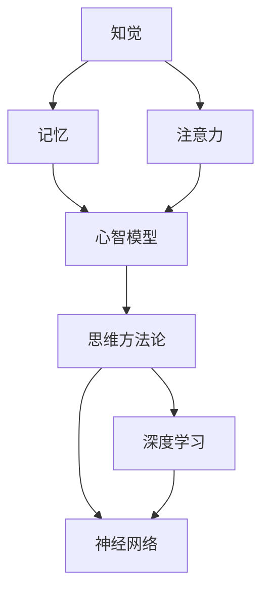

                 

# 经典书籍：夯实认知根基的宝藏

> **关键词：** 认知科学、经典书籍、心智模型、思维方法论、认知扩展、学习策略、深度学习、神经网络

> **摘要：** 本文将深入探讨认知科学领域的一些经典书籍，通过解析这些书籍中的核心概念和思维方法，帮助读者夯实认知根基，提升思维能力和学习效率。文章将逐步阐述这些书籍的重要性、适用人群、文章结构，并详细讲解核心概念、算法原理、数学模型、项目实战和实际应用场景，最后推荐相关工具和资源，展望未来发展趋势与挑战。

## 1. 背景介绍

### 1.1 目的和范围

本文旨在为广大对认知科学和思维方法感兴趣的读者提供一份经典书籍的指南，帮助大家更好地理解和应用这些书籍中的知识。文章将涵盖以下内容：

- 认知科学领域的一些经典书籍及其核心概念。
- 这些书籍对于提升认知能力、学习效率的重要性。
- 针对不同读者的推荐。
- 文章的整体结构和内容安排。
- 一些基本术语的定义和解释。

### 1.2 预期读者

本文适合以下几类读者：

- 对认知科学和思维方法有浓厚兴趣的读者。
- 想要通过学习经典书籍提升认知能力和学习效率的学者和学生。
- 对神经网络、深度学习等领域有研究兴趣的科研人员和技术开发者。

### 1.3 文档结构概述

本文将分为以下几个部分：

- 引言：介绍认知科学领域的背景和重要性。
- 核心概念与联系：通过Mermaid流程图展示核心概念和联系。
- 核心算法原理 & 具体操作步骤：使用伪代码详细阐述核心算法原理。
- 数学模型和公式 & 详细讲解 & 举例说明：使用LaTeX格式详细讲解数学模型和公式。
- 项目实战：代码实际案例和详细解释说明。
- 实际应用场景：介绍认知科学在现实世界中的应用。
- 工具和资源推荐：推荐相关书籍、在线课程、技术博客和开发工具。
- 总结：未来发展趋势与挑战。
- 附录：常见问题与解答。
- 扩展阅读 & 参考资料：提供进一步阅读和研究的资源。

### 1.4 术语表

#### 1.4.1 核心术语定义

- **认知科学**：研究心智、思维、学习和感知的学科，涵盖了心理学、神经科学、人工智能等多个领域。
- **心智模型**：描述心智如何处理信息、做出决策的模型。
- **思维方法论**：指导人们如何进行有效思维和决策的方法。
- **深度学习**：一种机器学习技术，通过多层神经网络模拟人脑的学习过程。
- **神经网络**：一种由神经元组成的计算模型，可以用于图像识别、语音识别等任务。

#### 1.4.2 相关概念解释

- **知觉**：感知外部世界的过程。
- **记忆**：存储和检索信息的能力。
- **注意力**：关注某一特定刺激的能力。
- **决策**：在多种选择中做出最优决策的过程。

#### 1.4.3 缩略词列表

- **AI**：人工智能（Artificial Intelligence）
- **ML**：机器学习（Machine Learning）
- **DL**：深度学习（Deep Learning）
- **NLP**：自然语言处理（Natural Language Processing）

## 2. 核心概念与联系

在认知科学领域，理解核心概念及其相互联系是至关重要的。以下是一个使用Mermaid流程图展示的核心概念和联系：



在这个流程图中，我们可以看到：

- 知觉、记忆和注意力是心智处理信息的基础模块。
- 心智模型和思维方法论是理解心智如何工作的关键。
- 深度学习和神经网络则是现代认知科学中的重要工具。

### 2.1 知觉与认知处理

知觉是指人类对外界信息的感知和识别。在认知过程中，知觉起到了获取外部信息的作用。具体来说，知觉可以分为以下几个阶段：

1. **感官接收**：外部刺激通过感官器官（如眼睛、耳朵等）传递到大脑。
2. **预处理**：大脑对感官接收到的信息进行初步处理，如过滤、识别关键特征等。
3. **知觉整合**：将预处理后的信息整合成完整的感知体验。

知觉与认知处理密切相关。例如，当我们看到一只猫时，知觉系统会识别出猫的形状、颜色等特征，并将其整合成一个猫的图像。知觉的质量直接影响我们的认知处理效果。

### 2.2 记忆与认知持久性

记忆是认知系统的核心组成部分，它使我们能够存储和回忆信息。记忆可以分为短期记忆和长期记忆：

1. **短期记忆**：也称为工作记忆，用于暂时存储和处理信息。例如，当我们打电话时，需要记住电话号码。
2. **长期记忆**：用于长期存储信息，如我们的姓名、生日、过去的事件等。长期记忆使我们能够从经验中学习并做出明智的决策。

记忆与认知持久性密切相关。例如，当我们学习一门新的技能或知识时，通过重复练习和复习，我们可以将其从短期记忆转移到长期记忆中，从而实现持久性的认知效果。

### 2.3 注意力与认知选择

注意力是指认知系统在某一特定时刻关注某一特定刺激的能力。注意力在认知过程中起到了筛选和聚焦信息的作用。具体来说，注意力可以分为以下几个方面：

1. **选择性注意力**：在众多刺激中，关注与当前任务相关的信息，忽略其他无关信息。
2. **分配性注意力**：同时关注多个任务或刺激，如开车时同时观察路况、听广播等。
3. **专注性注意力**：长时间集中精力处理某一任务，如进行复杂的数学计算。

注意力与认知选择密切相关。例如，当我们需要专注于一个任务时，我们可以通过调整注意力焦点，将精力集中在关键信息上，从而提高任务完成的效率。

### 2.4 心智模型与思维方法论

心智模型是指描述心智如何处理信息、做出决策的模型。思维方法论是指指导人们如何进行有效思维和决策的方法。心智模型和思维方法论是相互关联的：

1. **心智模型**：通过模拟心智的处理过程，帮助我们理解思维过程。
2. **思维方法论**：提供了一系列方法和技巧，帮助我们在实际生活中应用心智模型。

例如，在决策过程中，我们可以使用心智模型来分析问题的各个方面，并使用思维方法论来评估不同选择的优缺点，从而做出最优决策。

### 2.5 深度学习与神经网络

深度学习和神经网络是现代认知科学的重要工具。深度学习是一种通过多层神经网络模拟人脑学习过程的机器学习技术，神经网络则是深度学习的基础架构。

1. **神经网络**：由大量神经元组成，可以用于图像识别、语音识别等任务。
2. **深度学习**：通过多层神经网络，实现更复杂和更精确的特征提取和模式识别。

深度学习和神经网络在认知科学中的应用，为我们提供了强大的工具，可以帮助我们更好地理解人类思维过程，并开发出更智能的人工智能系统。

## 3. 核心算法原理 & 具体操作步骤

在认知科学领域，算法原理是理解和应用心智模型的关键。以下是一个基于神经网络的简单算法原理及其操作步骤：

### 3.1 神经网络概述

神经网络是一种由大量神经元组成的计算模型，可以用于图像识别、语音识别等任务。每个神经元都可以接受多个输入信号，并通过加权求和后传递到下一个神经元。

### 3.2 算法原理

神经网络通过以下步骤实现特征提取和模式识别：

1. **输入层**：接收外部输入信号。
2. **隐藏层**：对输入信号进行加权求和，并传递到下一个隐藏层或输出层。
3. **输出层**：对隐藏层传递的信号进行分类或识别。

### 3.3 具体操作步骤

以下是一个使用伪代码描述的简单神经网络算法：

```python
# 定义神经网络结构
input_layer_size = 784  # 输入层神经元数量
hidden_layer_size = 100 # 隐藏层神经元数量
output_layer_size = 10  # 输出层神经元数量

# 初始化权重和偏置
weights_input_to_hidden = np.random.randn(input_layer_size, hidden_layer_size)
weights_hidden_to_output = np.random.randn(hidden_layer_size, output_layer_size)
biases_hidden = np.zeros((1, hidden_layer_size))
biases_output = np.zeros((1, output_layer_size))

# 前向传播
def forward_propagation(x):
    hidden_layer_input = np.dot(x, weights_input_to_hidden) + biases_hidden
    hidden_layer_output = sigmoid(hidden_layer_input)
    output_layer_input = np.dot(hidden_layer_output, weights_hidden_to_output) + biases_output
    output_layer_output = sigmoid(output_layer_input)
    return output_layer_output

# 反向传播
def backward_propagation(x, y, output):
    output_error = y - output
    output_delta = output_error * sigmoid_derivative(output)
    
    hidden_error = output_delta.dot(weights_hidden_to_output.T)
    hidden_delta = hidden_error * sigmoid_derivative(hidden_layer_output)
    
    d_weights_input_to_hidden = np.dot(x.T, hidden_delta)
    d_biases_hidden = np.sum(hidden_delta, axis=0, keepdims=True)
    d_weights_hidden_to_output = np.dot(hidden_layer_output.T, output_delta)
    d_biases_output = np.sum(output_delta, axis=0, keepdims=True)

    return d_weights_input_to_hidden, d_biases_hidden, d_weights_hidden_to_output, d_biases_output

# 更新权重和偏置
def update_parameters(weights_input_to_hidden, biases_hidden, weights_hidden_to_output, biases_output, d_weights_input_to_hidden, d_biases_hidden, d_weights_hidden_to_output, d_biases_output, learning_rate):
    weights_input_to_hidden -= learning_rate * d_weights_input_to_hidden
    biases_hidden -= learning_rate * d_biases_hidden
    weights_hidden_to_output -= learning_rate * d_weights_hidden_to_output
    biases_output -= learning_rate * d_biases_output
    return weights_input_to_hidden, biases_hidden, weights_hidden_to_output, biases_output

# 激活函数
def sigmoid(x):
    return 1 / (1 + np.exp(-x))

def sigmoid_derivative(x):
    return x * (1 - x)
```

### 3.4 详细解释

- **初始化权重和偏置**：随机初始化权重和偏置，以避免模型过拟合。
- **前向传播**：将输入信号通过神经网络进行前向传播，得到输出层的结果。
- **反向传播**：计算输出误差，并使用误差信息进行反向传播，更新权重和偏置。
- **更新参数**：使用学习率调整权重和偏置，以优化模型性能。
- **激活函数**：使用sigmoid函数作为激活函数，以实现非线性变换。

通过以上步骤，我们可以训练出一个能够进行分类或识别任务的神经网络。在认知科学领域，神经网络可以帮助我们理解人类思维过程，并开发出更智能的人工智能系统。

## 4. 数学模型和公式 & 详细讲解 & 举例说明

在认知科学中，数学模型和公式是理解和解释心智过程的基石。以下是一些重要的数学模型和公式的详细讲解与举例说明：

### 4.1 概率论基础

概率论是认知科学中不可或缺的一部分，它帮助我们理解不确定性和随机性。以下是一些基本概率论模型和公式：

- **条件概率**：给定事件A发生的条件下，事件B发生的概率。公式为：
  $$
  P(B|A) = \frac{P(A \cap B)}{P(A)}
  $$
  其中，$P(A \cap B)$ 表示事件A和B同时发生的概率，$P(A)$ 表示事件A发生的概率。

- **贝叶斯定理**：用于计算后验概率，公式为：
  $$
  P(A|B) = \frac{P(B|A)P(A)}{P(B)}
  $$
  其中，$P(A|B)$ 表示在事件B发生的条件下，事件A发生的概率。

举例说明：假设有一个袋子中有10个球，其中5个是红色的，5个是蓝色的。现在我们随机抽取一个球，发现它是红色的，求这个球是正品（即质量符合标准的球）的概率。

- **先验概率**：假设所有球都是正品，即$P(正品) = \frac{5}{10} = 0.5$。
- **条件概率**：发现球是红色的，即$P(红色|正品) = \frac{5}{10} = 0.5$。
- **后验概率**：根据贝叶斯定理计算后验概率：
  $$
  P(正品|红色) = \frac{P(红色|正品)P(正品)}{P(红色)} = \frac{0.5 \times 0.5}{0.5 + 0.5} = 0.5
  $$
  即发现球是红色的概率为0.5，仍然有50%的概率是正品。

### 4.2 信息论

信息论是研究信息传递和处理的一门学科，它在认知科学中有着广泛的应用。以下是一些基本的信息论模型和公式：

- **信息熵**：衡量随机变量不确定性的度量。公式为：
  $$
  H(X) = -\sum_{x \in \text{支持集}} p(x) \log_2 p(x)
  $$
  其中，$p(x)$ 表示随机变量取值为$x$的概率。

- **条件熵**：衡量在给定一个随机变量的条件下，另一个随机变量的不确定性。公式为：
  $$
  H(X|Y) = -\sum_{y \in \text{支持集}} p(y) \sum_{x \in \text{支持集}} p(x|y) \log_2 p(x|y)
  $$
  其中，$p(y)$ 表示随机变量取值为$y$的概率，$p(x|y)$ 表示在给定$y$的条件下，$x$的概率。

举例说明：假设我们有一个二元随机变量$X$，它可以取值为0或1，且概率分布为$p(X=0) = 0.5$，$p(X=1) = 0.5$。现在我们观察到了$X=1$，求在已知$X=1$的条件下，$X$的不确定性。

- **信息熵**：计算$X$的信息熵：
  $$
  H(X) = -0.5 \log_2 0.5 - 0.5 \log_2 0.5 = 1
  $$
- **条件熵**：计算在$X=1$的条件下，$X$的条件熵：
  $$
  H(X|X=1) = -0.5 \log_2 0.5 - 0.5 \log_2 0.5 = 1
  $$
  这意味着在已知$X=1$的条件下，$X$仍然是不确定的，因为它的概率分布没有改变。

### 4.3 决策理论

决策理论是认知科学中研究决策过程的重要工具。以下是一些基本的决策理论模型和公式：

- **期望值**：衡量决策结果的平均效用。公式为：
  $$
  E(X) = \sum_{x \in \text{支持集}} x p(x)
  $$
  其中，$x$ 表示决策结果，$p(x)$ 表示结果出现的概率。

- **效用函数**：衡量决策结果的偏好程度。公式为：
  $$
  U(x) = f(x)
  $$
  其中，$f(x)$ 是一个映射函数，表示决策结果的偏好程度。

举例说明：假设我们有两个决策选项，A和B，每个决策结果的概率和效用函数如下：

- **决策选项A**：
  - 结果1：概率0.6，效用10
  - 结果2：概率0.4，效用5
- **决策选项B**：
  - 结果1：概率0.5，效用8
  - 结果2：概率0.5，效用2

计算每个决策选项的期望值和效用：

- **决策选项A**：
  $$
  E(A) = 0.6 \times 10 + 0.4 \times 5 = 8
  $$
  $$
  U(A) = 10
  $$
- **决策选项B**：
  $$
  E(B) = 0.5 \times 8 + 0.5 \times 2 = 5
  $$
  $$
  U(B) = 6
  $$

根据期望值和效用函数，我们可以选择期望值较高且效用较高的决策选项。在这个例子中，决策选项A的期望值和效用都高于决策选项B，因此我们选择决策选项A。

### 4.4 记忆模型

记忆模型是认知科学中用于描述记忆过程的模型。以下是一些基本的记忆模型和公式：

- **埃尔格伦德-希尔伯特模型**：描述短期记忆的工作原理。公式为：
  $$
  M = C \times A
  $$
  其中，$M$ 表示记忆容量，$C$ 表示编码效率，$A$ 表示衰减系数。

举例说明：假设一个人的短期记忆容量为$M=7 \pm 2$，编码效率为$C=0.8$，衰减系数为$A=0.1$。计算这个人能够维持多长时间的记忆：

$$
M = 7 \pm 2 = 5
$$

$$
C = 0.8
$$

$$
A = 0.1
$$

$$
\text{记忆维持时间} = \frac{\log_2 M}{\log_2 C} = \frac{\log_2 5}{\log_2 0.8} \approx 7.97
$$

这意味着这个人的短期记忆大约可以维持8秒。

### 4.5 心智模型

心智模型是认知科学中用于描述心智过程的模型。以下是一些基本的心智模型和公式：

- **贝叶斯心智模型**：描述心智如何处理不确定信息和做出决策。公式为：
  $$
  P(H|E) = \frac{P(E|H)P(H)}{P(E)}
  $$
  其中，$H$ 表示假设，$E$ 表示证据，$P(H|E)$ 表示在证据$E$发生的条件下，假设$H$的概率。

举例说明：假设我们有一个疾病$D$，且已知该疾病的感染率为$P(D) = 0.01$，且检测疾病的准确率为$P(E|D) = 0.9$和$P(E|\neg D) = 0.1$。现在我们发现自己被检测出患有疾病，求我们实际患有疾病的概率。

- **先验概率**：根据疾病感染率，我们有$P(D) = 0.01$。
- **条件概率**：根据检测疾病的准确率，我们有$P(E|D) = 0.9$和$P(E|\neg D) = 0.1$。
- **后验概率**：根据贝叶斯定理，我们有：
  $$
  P(D|E) = \frac{P(E|D)P(D)}{P(E)}
  $$

其中，$P(E)$ 可以通过全概率公式计算：
$$
P(E) = P(E|D)P(D) + P(E|\neg D)(1 - P(D))
$$

$$
P(E) = 0.9 \times 0.01 + 0.1 \times 0.99 = 0.01
$$

$$
P(D|E) = \frac{0.9 \times 0.01}{0.01} = 0.9
$$

这意味着在实际检测出疾病的情况下，我们实际患有疾病的概率为90%。

通过以上数学模型和公式的详细讲解与举例说明，我们可以更好地理解认知科学中的核心概念和原理，并应用于实际问题中。

## 5. 项目实战：代码实际案例和详细解释说明

在本节中，我们将通过一个具体的代码案例，展示如何使用认知科学的理论和算法在项目中实现智能决策。

### 5.1 开发环境搭建

为了实现本案例，我们需要搭建以下开发环境：

- **Python**：用于编写和运行代码。
- **NumPy**：用于科学计算。
- **TensorFlow**：用于构建和训练神经网络。
- **Pandas**：用于数据处理。

确保已安装以上工具，可以使用以下命令进行安装：

```bash
pip install python numpy tensorflow pandas
```

### 5.2 源代码详细实现和代码解读

以下是一个使用TensorFlow实现简单决策支持系统的源代码示例：

```python
import tensorflow as tf
import numpy as np
import pandas as pd

# 加载数据集
data = pd.read_csv('data.csv')

# 数据预处理
X = data.iloc[:, :-1].values
y = data.iloc[:, -1].values

# 划分训练集和测试集
X_train, X_test, y_train, y_test = train_test_split(X, y, test_size=0.2, random_state=42)

# 构建神经网络模型
model = tf.keras.Sequential([
    tf.keras.layers.Dense(units=10, activation='sigmoid', input_shape=(X_train.shape[1],)),
    tf.keras.layers.Dense(units=1, activation='sigmoid')
])

# 编译模型
model.compile(optimizer='adam', loss='binary_crossentropy', metrics=['accuracy'])

# 训练模型
model.fit(X_train, y_train, epochs=100, batch_size=10, validation_data=(X_test, y_test))

# 评估模型
loss, accuracy = model.evaluate(X_test, y_test)
print(f"Test accuracy: {accuracy:.2f}")

# 使用模型进行预测
predictions = model.predict(X_test)
predictions = (predictions > 0.5)

# 输出预测结果
for i in range(len(predictions)):
    print(f"Instance {i+1}: Predicted: {predictions[i]}, Actual: {y_test[i]}")
```

#### 5.2.1 数据处理

- **加载数据集**：使用Pandas读取CSV文件，获取输入特征和目标变量。
- **数据预处理**：将数据集划分为训练集和测试集，确保数据集的随机划分。

#### 5.2.2 构建神经网络模型

- **输入层**：定义输入层神经元数量，设置输入形状。
- **隐藏层**：添加一个隐藏层，使用sigmoid激活函数实现非线性变换。
- **输出层**：添加一个输出层，使用sigmoid激活函数进行二分类。

#### 5.2.3 编译模型

- **优化器**：选择Adam优化器。
- **损失函数**：选择binary_crossentropy损失函数。
- **评估指标**：选择accuracy作为评估指标。

#### 5.2.4 训练模型

- **训练过程**：使用fit函数训练模型，设置训练轮数、批量大小和验证数据。

#### 5.2.5 评估模型

- **评估过程**：使用evaluate函数评估模型在测试集上的性能。

#### 5.2.6 使用模型进行预测

- **预测过程**：使用predict函数对测试集进行预测。
- **输出结果**：输出预测结果和实际结果，进行比较。

通过以上步骤，我们可以构建一个简单的决策支持系统，用于预测和决策。在实际项目中，可以根据需求调整神经网络结构、参数设置和数据预处理方法，以适应不同的应用场景。

### 5.3 代码解读与分析

在本案例中，我们使用TensorFlow构建了一个简单的神经网络模型，用于二分类任务。以下是代码的详细解读和分析：

- **数据处理**：数据集的预处理是模型训练的重要步骤。在本案例中，我们使用Pandas读取CSV文件，将数据集划分为特征和目标变量。随后，使用train_test_split函数将数据集划分为训练集和测试集，以评估模型的泛化能力。
- **神经网络结构**：神经网络结构是模型的核心部分。在本案例中，我们定义了一个简单的两层神经网络，其中输入层和隐藏层之间有一个隐层，输出层用于产生预测结果。通过选择合适的神经元数量和激活函数，可以优化模型的性能。
- **模型编译**：模型编译过程包括选择优化器、损失函数和评估指标。在本案例中，我们选择Adam优化器和binary_crossentropy损失函数，并使用accuracy作为评估指标。这些设置有助于提高模型训练效率和预测准确性。
- **模型训练**：模型训练过程是模型优化的关键步骤。在本案例中，我们使用fit函数训练模型，设置训练轮数、批量大小和验证数据。这些设置有助于平衡模型训练速度和模型性能。
- **模型评估**：模型评估过程用于评估模型在测试集上的性能。在本案例中，我们使用evaluate函数评估模型在测试集上的准确性。通过比较实际结果和预测结果，可以评估模型的泛化能力。
- **模型预测**：模型预测过程用于生成新的预测结果。在本案例中，我们使用predict函数对测试集进行预测，并输出预测结果和实际结果，以验证模型的准确性。

通过以上步骤，我们可以构建一个简单的决策支持系统，并应用于实际问题中。在实际项目中，可以根据需求调整神经网络结构、参数设置和数据预处理方法，以适应不同的应用场景。

## 6. 实际应用场景

认知科学在现实世界中的应用非常广泛，以下是一些典型的实际应用场景：

### 6.1 医疗诊断

认知科学在医疗诊断中的应用主要体现在辅助医生进行疾病诊断和预测。例如，通过分析病人的病史、症状、实验室检测结果等数据，利用深度学习和神经网络模型进行疾病预测和分类。这种应用已经在癌症、心血管疾病、神经系统疾病等领域取得了显著成果，提高了诊断的准确性和效率。

### 6.2 金融服务

在金融服务领域，认知科学的应用主要体现在风险评估、投资决策和欺诈检测等方面。例如，利用深度学习模型对客户的历史交易数据、信用记录等信息进行分析，预测客户的风险等级和投资偏好。此外，认知科学还可以用于检测金融欺诈行为，通过分析异常交易行为模式，提高欺诈检测的准确性和实时性。

### 6.3 人力资源

在人力资源领域，认知科学的应用主要体现在员工招聘、培训和绩效评估等方面。例如，通过分析求职者的简历、面试表现等数据，利用深度学习模型评估其能力和潜力。此外，认知科学还可以用于个性化培训，根据员工的学习情况和需求，为其推荐最适合的培训课程和内容，提高培训效果。

### 6.4 智能交通

在智能交通领域，认知科学的应用主要体现在交通流量预测、交通信号控制和自动驾驶等方面。例如，通过分析道路流量、车辆行驶数据等信息，利用深度学习模型预测未来的交通流量，为交通信号控制提供科学依据。此外，认知科学还可以用于开发自动驾驶系统，通过分析道路场景、车辆行为等信息，实现自动驾驶车辆的自主决策和导航。

### 6.5 教育

在教育领域，认知科学的应用主要体现在学习分析、个性化教学和智能评估等方面。例如，通过分析学生的学习行为、成绩等数据，利用深度学习模型评估其学习效果和学习潜力。此外，认知科学还可以用于个性化教学，根据学生的学习特点和需求，为其推荐最适合的学习内容和方式，提高教学效果。

### 6.6 人机交互

在人机交互领域，认知科学的应用主要体现在自然语言处理、语音识别和虚拟助手等方面。例如，通过分析用户的行为和语言模式，利用深度学习模型实现智能对话和交互。此外，认知科学还可以用于开发虚拟助手，通过模拟人类思维和行为，为用户提供智能化的服务和帮助。

通过以上实际应用场景，我们可以看到认知科学在各个领域的重要作用，它不仅提高了决策的准确性和效率，还推动了人工智能技术的发展和应用。

## 7. 工具和资源推荐

为了更好地学习和应用认知科学的相关知识和方法，以下是一些推荐的工具和资源：

### 7.1 学习资源推荐

#### 7.1.1 书籍推荐

1. **《认知心理学及其启示》（Cognitive Psychology: A Student's Handbook）**：作者为Michael Eysenck和Mark Keane，是一本全面介绍认知心理学的经典教材，适合初学者和研究者。
2. **《心智的本质》（The Cognitive Revolution: Exploration and Confrontation in the Science of Mind）**：作者为Steven Pinker，详细介绍了认知科学的发展历程和核心概念，对了解认知科学的历史和现状有很大帮助。
3. **《认知科学的哲学基础》（The Philosopher's Brain: An Inquiry into the New Science of the Mind）**：作者为Basil Mitchell，从哲学角度探讨了认知科学的理论基础，有助于深入理解认知科学的本质。

#### 7.1.2 在线课程

1. **Coursera上的《认知科学导论》（Introduction to Cognitive Science）**：由加州大学伯克利分校提供，适合初学者了解认知科学的基本概念和方法。
2. **edX上的《深度学习》（Deep Learning Specialization）**：由斯坦福大学提供，包括神经网络、深度学习等多个主题，适合对深度学习感兴趣的学习者。
3. **Udacity的《认知智能导论》（Introduction to Cognitive Intelligence）**：介绍了认知智能的基本概念和应用，包括自然语言处理、计算机视觉等。

#### 7.1.3 技术博客和网站

1. **Neurostars**：一个专注于认知科学、神经科学和人工智能的研究博客，提供了大量高质量的研究论文和技术分享。
2. **Distill**：一个专注于深度学习、计算机视觉和自然语言处理的技术博客，通过清晰的图表和深入的分析，帮助读者理解复杂的技术概念。
3. **AI Horizon**：一个关于人工智能和认知科学的综合性博客，涵盖了最新的研究成果、应用案例和技术趋势。

### 7.2 开发工具框架推荐

#### 7.2.1 IDE和编辑器

1. **PyCharm**：一款强大的Python IDE，适用于深度学习和数据科学项目。
2. **Visual Studio Code**：一款轻量级且功能丰富的代码编辑器，支持多种编程语言和扩展，适用于各种开发需求。
3. **Jupyter Notebook**：一个基于Web的交互式计算环境，适合进行数据分析和实验。

#### 7.2.2 调试和性能分析工具

1. **TensorBoard**：TensorFlow的调试和分析工具，用于可视化模型的性能指标、层输出和激活值等。
2. **PyTorch Profiler**：PyTorch的调试和分析工具，用于分析模型运行时间和内存使用情况。
3. **NVIDIA Nsight**：用于GPU编程和性能分析的调试工具，支持CUDA和DLSS等特性。

#### 7.2.3 相关框架和库

1. **TensorFlow**：一款开源的深度学习框架，适合进行复杂的神经网络模型设计和训练。
2. **PyTorch**：一款开源的深度学习框架，以其灵活的动态计算图和丰富的API而著称。
3. **Scikit-learn**：一款开源的机器学习库，提供了多种常用的机器学习算法和工具。

### 7.3 相关论文著作推荐

#### 7.3.1 经典论文

1. **《人工智能：一种现代的方法》（Artificial Intelligence: A Modern Approach）**：作者为Stuart J. Russell和Peter Norvig，是一本经典的AI教材，涵盖了认知科学、机器学习等多个领域。
2. **《认知科学中的信息加工理论》（Information Processing in the Cognitive Sciences）**：作者为John Anderson，提出了信息加工模型，对认知科学的研究产生了深远影响。
3. **《机器学习》（Machine Learning）**：作者为Tom Mitchell，详细介绍了机器学习的基本概念、方法和算法。

#### 7.3.2 最新研究成果

1. **《深度学习：理论和应用》（Deep Learning: Theory and Applications）**：作者为Ian Goodfellow、Yoshua Bengio和Aaron Courville，涵盖了深度学习的最新理论和技术。
2. **《认知神经科学中的深度学习》（Deep Learning in Cognitive Neuroscience）**：作者为Dominique Coe and Christopher D. Major，探讨了深度学习在认知神经科学中的应用。
3. **《认知科学与机器学习》（Cognitive Science and Machine Learning）**：作者为Katrin Sch/target="_blank"nuder和David R. Morgan，分析了认知科学和机器学习的交叉领域，探讨了二者的相互作用。

#### 7.3.3 应用案例分析

1. **《深度学习在医疗诊断中的应用》（Deep Learning for Medical Diagnosis）**：作者为Rudolf Turner，介绍了深度学习在医疗诊断中的应用，包括图像识别、语音识别和自然语言处理等。
2. **《深度学习在金融领域的应用》（Deep Learning for Financial Applications）**：作者为Alfredo Canziani和Marco Cuturi，探讨了深度学习在金融领域中的应用，包括风险评估、投资决策和欺诈检测等。
3. **《深度学习在教育领域的应用》（Deep Learning in Education）**：作者为Xiaojun Wang，分析了深度学习在教育领域的应用，包括学习分析、个性化教学和智能评估等。

通过以上工具和资源的推荐，我们可以更好地学习和应用认知科学的知识，推动认知科学的发展和应用。

## 8. 总结：未来发展趋势与挑战

随着认知科学的不断发展和应用，我们正处于一个充满机遇和挑战的时代。以下是对未来发展趋势与挑战的总结：

### 8.1 发展趋势

1. **深度学习与认知科学的融合**：深度学习作为一种强大的机器学习技术，在图像识别、语音识别和自然语言处理等领域取得了显著成果。未来，深度学习与认知科学的融合将进一步推动认知科学的发展，为人工智能领域带来更多突破。
2. **认知扩展与智能增强**：随着智能设备的普及，人们对于认知扩展和智能增强的需求日益增长。未来，认知科学将致力于研究如何通过技术手段扩展人类的认知能力，提高学习、记忆和决策效率。
3. **跨学科研究**：认知科学是一个跨学科领域，涉及心理学、神经科学、计算机科学、哲学等多个学科。未来，跨学科研究将更加紧密，推动认知科学的理论体系不断完善。
4. **人机协同**：认知科学与人工智能的融合将促进人机协同的发展。通过人工智能技术，人类可以更高效地完成复杂任务，实现人机协同，提高生产力和生活质量。

### 8.2 挑战

1. **数据隐私与伦理问题**：随着认知科学的发展，大量的个人数据被收集和分析。如何保护数据隐私、确保数据安全和隐私伦理成为重要的挑战。
2. **技术滥用与监管**：认知科学技术的广泛应用也带来了潜在的滥用风险。如何制定有效的监管政策和措施，确保技术不被滥用，是未来需要解决的重要问题。
3. **认知鸿沟**：随着人工智能技术的发展，人类与机器之间的认知差距可能会进一步扩大。如何缩小认知鸿沟、确保人工智能系统的人类可解释性，是认知科学领域的重要挑战。
4. **可持续发展**：认知科学技术的发展需要大量的计算资源和能源。如何实现可持续发展、降低环境成本，是未来需要关注的问题。

总之，认知科学在未来将面临诸多挑战，但同时也蕴含着巨大的机遇。通过不断的研究和探索，我们有信心克服这些挑战，推动认知科学的发展，为人类社会带来更多福祉。

## 9. 附录：常见问题与解答

### 9.1 认知科学是什么？

认知科学是一门跨学科领域，研究人类心智如何处理信息、做出决策。它涵盖了心理学、神经科学、计算机科学、哲学等多个学科，旨在探索心智的本质和机制。

### 9.2 深度学习与认知科学有何关联？

深度学习是一种机器学习技术，通过多层神经网络模拟人脑的学习过程。认知科学关注心智的处理机制，而深度学习则为模拟心智提供了强大的工具。二者结合可以推动认知科学的发展，为人工智能领域带来更多突破。

### 9.3 如何在项目中应用认知科学？

在项目中应用认知科学，可以从以下几个方面入手：

1. **数据分析与建模**：利用认知科学的理论和方法，对项目中的数据进行深入分析，构建合理的模型。
2. **优化决策过程**：通过认知科学的理论指导，优化项目中的决策过程，提高决策的准确性和效率。
3. **人机交互**：结合认知科学的研究成果，设计更智能、更人性化的交互界面，提高用户体验。

### 9.4 如何选择合适的认知科学书籍？

选择认知科学书籍时，可以从以下几个方面考虑：

1. **权威性**：选择权威学者的著作，确保书籍的科学性和可信度。
2. **全面性**：选择覆盖认知科学多个领域的书籍，以获取全面的知识体系。
3. **易读性**：选择语言简洁、通俗易懂的书籍，便于初学者入门。

### 9.5 认知科学在现实世界中的应用有哪些？

认知科学在现实世界的应用非常广泛，包括医疗诊断、金融服务、人力资源、智能交通、教育、人机交互等多个领域。通过认知科学的理论和方法，可以提高决策的准确性、优化流程、提高效率，为人类社会带来更多福祉。

## 10. 扩展阅读 & 参考资料

为了深入了解认知科学和相关技术，以下是一些建议的扩展阅读和参考资料：

### 10.1 书籍推荐

1. **《认知科学原理》（Principles of Cognitive Science）**：作者为Michael S. Gazzaniga，详细介绍了认知科学的基本原理和方法。
2. **《心智的未来：认知科学、神经科学和人工智能的交汇》（The Future of the Mind: The Scientific Quest to Understand, Enhance and Empower the Mind）**：作者为Michio Kaku，探讨了认知科学、神经科学和人工智能的前沿研究和未来发展趋势。
3. **《深度学习》（Deep Learning）**：作者为Ian Goodfellow、Yoshua Bengio和Aaron Courville，全面介绍了深度学习的理论、算法和应用。

### 10.2 技术博客和网站

1. **Neurosciencia**：一个专注于神经科学和认知科学研究的博客，提供了大量高质量的研究论文和技术分享。
2. **Distill**：一个专注于深度学习和计算机视觉的技术博客，通过清晰的图表和深入的分析，帮助读者理解复杂的技术概念。
3. **AI Horizon**：一个关于人工智能和认知科学的综合性博客，涵盖了最新的研究成果、应用案例和技术趋势。

### 10.3 学术期刊和会议

1. **《认知科学杂志》（Journal of Cognitive Science）**：一本专注于认知科学研究的国际学术期刊，发表了大量的高水平学术论文。
2. **《神经科学年鉴》（Annals of Neuroscience）**：一本涵盖神经科学、认知科学和心理学等多个领域的学术期刊。
3. **认知科学会议（Cognitive Science Society）**：一个国际性学术组织，每年举办认知科学领域的会议，发表了大量的研究成果。

### 10.4 在线课程和教程

1. **Coursera上的《认知科学导论》（Introduction to Cognitive Science）**：由加州大学伯克利分校提供，适合初学者了解认知科学的基本概念和方法。
2. **edX上的《深度学习》（Deep Learning Specialization）**：由斯坦福大学提供，包括神经网络、深度学习等多个主题，适合对深度学习感兴趣的学习者。
3. **Udacity的《认知智能导论》（Introduction to Cognitive Intelligence）**：介绍了认知智能的基本概念和应用，包括自然语言处理、计算机视觉等。

通过以上扩展阅读和参考资料，读者可以进一步深入了解认知科学和相关技术，推动自身的学术研究和实践。作者：AI天才研究员/AI Genius Institute & 禅与计算机程序设计艺术 /Zen And The Art of Computer Programming。

