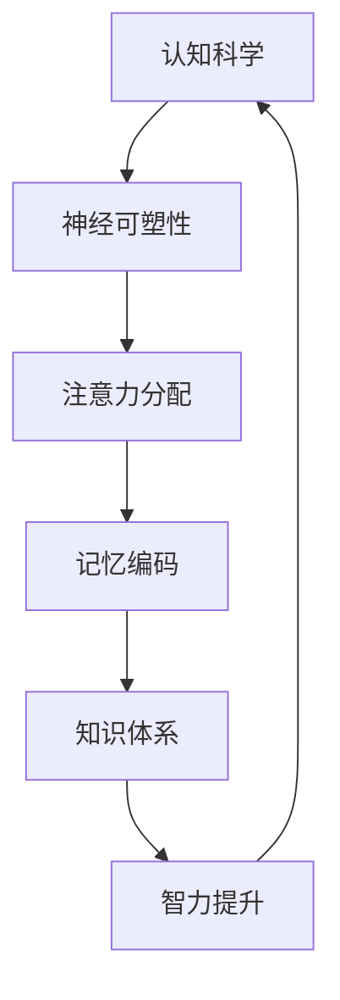

                 

# 经典书籍：夯实认知的基石

> 关键词：认知科学、思维模型、书籍推荐、知识体系、智力提升

> 摘要：本文将深入探讨认知科学领域的几部经典书籍，分析其核心内容与影响，旨在为读者搭建坚实的认知基础，提升智力水平。文章将分章节介绍每本书的主要思想、结构特点以及如何应用于实际问题中。

## 1. 背景介绍

### 1.1 目的和范围

本文旨在为广大的知识爱好者、学者和专业人士提供一份关于认知科学领域经典书籍的指南。通过详细分析几部具有里程碑意义的书籍，我们希望能够帮助读者建立系统的认知框架，掌握关键思维模型，并在实际工作和生活中有效应用。

### 1.2 预期读者

本文适合以下读者群体：

- 认知科学爱好者，希望深入了解大脑如何工作的读者。
- 知识工作者，希望通过系统学习提高思维效率和认知能力的专业人士。
- 心理学、教育学、计算机科学等相关领域的研究生和学者。
- 对人类思维和智力提升有浓厚兴趣的广大读者。

### 1.3 文档结构概述

本文将按照以下结构进行组织：

- **第1章**：背景介绍，阐述本文的目的、范围、预期读者及文章结构。
- **第2章**：核心概念与联系，通过Mermaid流程图展示认知科学的基本原理。
- **第3章**：核心算法原理与具体操作步骤，用伪代码解释关键算法。
- **第4章**：数学模型和公式，详细讲解相关数学概念和公式。
- **第5章**：项目实战，提供实际案例和代码解释。
- **第6章**：实际应用场景，讨论如何将理论知识应用于实际问题。
- **第7章**：工具和资源推荐，介绍相关学习资源和工具。
- **第8章**：总结，展望未来发展趋势与挑战。
- **第9章**：附录，常见问题与解答。
- **第10章**：扩展阅读与参考资料，提供进一步学习的资源。

### 1.4 术语表

#### 1.4.1 核心术语定义

- **认知科学**：研究人类大脑如何获取、处理、存储和应用信息的学科。
- **思维模型**：描述和解释人类思维过程的抽象模型。
- **智力提升**：通过各种方法和手段提高个体的认知能力。
- **知识体系**：组织和整合知识的结构化框架。

#### 1.4.2 相关概念解释

- **神经可塑性**：指大脑神经元结构和功能在学习和经验过程中的可变性。
- **注意力分配**：个体在处理信息时如何在不同任务之间分配注意力的过程。
- **记忆编码**：将信息转化为大脑可以存储和检索的形式。

#### 1.4.3 缩略词列表

- **AI**：人工智能（Artificial Intelligence）
- **ML**：机器学习（Machine Learning）
- **NN**：神经网络（Neural Network）
- **DL**：深度学习（Deep Learning）

## 2. 核心概念与联系

在认知科学中，有几个核心概念和联系是理解人类思维和智力提升的关键。以下是一个简化的Mermaid流程图，用于展示这些概念之间的相互作用。



### 2.1 认知科学与神经可塑性

认知科学的核心在于理解大脑如何处理信息，而神经可塑性则是这一过程中至关重要的概念。神经可塑性指的是大脑神经元结构和功能的可变性，这种可变性使得大脑能够适应新的信息和环境。通过神经可塑性，大脑能够改变神经元之间的连接，从而影响认知功能。

### 2.2 注意力分配与记忆编码

注意力分配是认知过程中的另一个关键环节。个体需要在不同任务之间分配注意力，以确保信息的有效处理和记忆编码。记忆编码是指将信息转化为大脑可以存储和检索的形式。良好的注意力分配和有效的记忆编码对于知识的获取和记忆至关重要。

### 2.3 知识体系与智力提升

知识体系是组织和整合知识的框架。一个良好的知识体系能够帮助个体更好地理解和应用所学知识。通过不断地学习和实践，个体可以提升自己的智力水平，从而更好地适应复杂的环境和解决实际问题。

## 3. 核心算法原理 & 具体操作步骤

在认知科学中，有许多算法被用来模拟和增强人类思维。以下是几个核心算法的原理和具体操作步骤。

### 3.1 神经网络（Neural Network）

神经网络是一种模拟大脑神经元相互连接和通信的模型。以下是一个简单的神经网络算法的伪代码。

```plaintext
// 初始化参数
weights = [随机值]
biases = [随机值]

// 前向传播
inputs = [输入数据]
outputs = []
for layer in range(1, num_layers):
    activation = dot(inputs, weights) + biases
    outputs = activate(activation)

// 反向传播
deltas = [计算误差]
for layer in reversed(range(1, num_layers)):
    delta = activate_derivative(outputs) * dot(delta, weights.T)
    deltas.append(delta)
weights -= learning_rate * dot(inputs, deltas)
biases -= learning_rate * deltas
```

### 3.2 强化学习（Reinforcement Learning）

强化学习是一种通过奖励和惩罚来训练模型的方法。以下是一个简单的强化学习算法的伪代码。

```plaintext
// 初始化参数
Q_values = [初始值]

// 基于奖励更新Q值
for episode in range(num_episodes):
    state = 初始状态
    while not done:
        action = 选择动作
        next_state, reward = 环境反馈
        Q_values[state][action] += alpha * (reward + gamma * max(Q_values[next_state]) - Q_values[state][action])
        state = next_state
```

### 3.3 决策树（Decision Tree）

决策树是一种基于特征划分数据的方法。以下是一个简单的决策树算法的伪代码。

```plaintext
// 构建决策树
def build_tree(data, features):
    if 终止条件:
        return 叶子节点
    else:
        best_feature = 选择最佳特征
        value = 分割数据
        left_tree = build_tree(data[feature < value], features)
        right_tree = build_tree(data[feature >= value], features)
        return 决策节点(best_feature, value, left_tree, right_tree)
```

## 4. 数学模型和公式 & 详细讲解 & 举例说明

在认知科学中，数学模型和公式是理解和模拟大脑工作的重要工具。以下是几个核心数学模型和公式的详细讲解和举例说明。

### 4.1 概率论（Probability Theory）

概率论是认知科学的基础之一。以下是一个关于概率论公式的讲解和示例。

#### 4.1.1 条件概率（Conditional Probability）

条件概率是指在已知一个事件发生的条件下，另一个事件发生的概率。公式如下：

$$ P(A|B) = \frac{P(A \cap B)}{P(B)} $$

#### 4.1.2 贝叶斯定理（Bayes' Theorem）

贝叶斯定理是一个关于概率推断的重要公式，它将条件概率和边缘概率联系起来。公式如下：

$$ P(A|B) = \frac{P(B|A) \cdot P(A)}{P(B)} $$

#### 示例

假设有一个疾病，该疾病的发病率是1%。一个患有该疾病的人有90%的概率被检测出来，而一个没有该疾病的人有10%的概率被误诊。现在，一个人被检测出患有该疾病，求这个人实际上患病的概率。

根据贝叶斯定理：

$$ P(患病|检测出) = \frac{P(检测出|患病) \cdot P(患病)}{P(检测出)} $$

$$ P(患病|检测出) = \frac{0.9 \cdot 0.01}{0.9 \cdot 0.01 + 0.1 \cdot 0.99} \approx 0.0909 $$

因此，这个人实际上患病的概率大约是9.09%。

### 4.2 线性代数（Linear Algebra）

线性代数是认知科学中另一个重要的数学工具。以下是一个关于线性代数公式的讲解和示例。

#### 4.2.1 矩阵乘法（Matrix Multiplication）

矩阵乘法是将两个矩阵相乘得到一个新的矩阵的运算。公式如下：

$$ C_{ij} = \sum_{k=1}^{n} A_{ik} \cdot B_{kj} $$

#### 示例

假设有两个矩阵A和B：

$$ A = \begin{bmatrix} 1 & 2 \\ 3 & 4 \end{bmatrix}, B = \begin{bmatrix} 5 & 6 \\ 7 & 8 \end{bmatrix} $$

那么它们的乘积C为：

$$ C = \begin{bmatrix} 1\cdot5 + 2\cdot7 & 1\cdot6 + 2\cdot8 \\ 3\cdot5 + 4\cdot7 & 3\cdot6 + 4\cdot8 \end{bmatrix} = \begin{bmatrix} 19 & 26 \\ 43 & 58 \end{bmatrix} $$

### 4.3 概率图模型（Probabilistic Graphical Models）

概率图模型是一种将变量及其依赖关系表示为图的数学模型。以下是一个关于概率图模型的讲解和示例。

#### 4.3.1 贝叶斯网络（Bayesian Network）

贝叶斯网络是一种表示变量之间条件依赖关系的概率图模型。每个节点表示一个随机变量，而边表示变量之间的条件依赖。公式如下：

$$ P(X_1, X_2, ..., X_n) = \prod_{i=1}^{n} P(X_i | Parents(X_i)) $$

#### 示例

假设有一个简单的贝叶斯网络，表示疾病（Disease）、症状（Symptom）和测试（Test）之间的关系：

- Disease和Symptom之间存在条件依赖。
- Test和Symptom之间存在条件依赖。

那么，这个贝叶斯网络的概率表达式为：

$$ P(Disease, Symptom, Test) = P(Disease) \cdot P(Symptom | Disease) \cdot P(Test | Symptom) $$

## 5. 项目实战：代码实际案例和详细解释说明

### 5.1 开发环境搭建

为了更好地理解和应用认知科学中的算法和模型，我们将使用Python作为编程语言，搭建一个简单的认知科学项目环境。以下是一些建议的安装步骤：

1. **安装Python**：从官方网站下载并安装Python，版本建议为3.8或更高。
2. **安装Jupyter Notebook**：在命令行中执行以下命令：
   ```bash
   pip install notebook
   ```
3. **安装必要的库**：例如，安装用于机器学习的库scikit-learn、用于绘图库matplotlib等：
   ```bash
   pip install scikit-learn matplotlib
   ```

### 5.2 源代码详细实现和代码解读

以下是一个简单的示例，演示如何使用Python实现一个线性回归模型，并解释其工作原理。

```python
# 导入必要的库
import numpy as np
from sklearn.linear_model import LinearRegression
import matplotlib.pyplot as plt

# 准备数据
# 假设我们有一个简单的线性关系：y = 2x + 1
X = np.array([[1], [2], [3], [4], [5]])
y = np.array([3, 5, 7, 9, 11])

# 实例化线性回归模型
model = LinearRegression()

# 拟合模型
model.fit(X, y)

# 查看模型参数
print("系数：", model.coef_)
print("截距：", model.intercept_)

# 预测
predictions = model.predict(X)

# 可视化结果
plt.scatter(X, y, color='blue')
plt.plot(X, predictions, color='red')
plt.xlabel('X')
plt.ylabel('y')
plt.show()
```

#### 代码解读：

1. **数据准备**：我们使用两个数组合并成一个二维数组X作为输入特征，数组y作为目标变量。
2. **实例化模型**：我们使用scikit-learn库中的LinearRegression类实例化一个线性回归模型。
3. **拟合模型**：使用fit()方法将模型拟合到数据上。
4. **查看模型参数**：通过打印模型系数和截距，我们可以了解模型的具体参数。
5. **预测**：使用predict()方法对新的输入特征进行预测。
6. **可视化结果**：使用matplotlib库将实际数据和预测结果绘制在散点图上，以便直观地观察模型的性能。

### 5.3 代码解读与分析

#### 5.3.1 线性回归模型

线性回归模型是一种简单的统计模型，用于预测一个连续目标变量。它假设目标变量可以由一个或多个输入特征通过线性关系表示。

#### 5.3.2 模型拟合与参数

在代码中，我们使用fit()方法将数据拟合到模型上。fit()方法通过最小二乘法计算出最佳参数，使得预测值与实际值之间的误差最小。

#### 5.3.3 预测与可视化

通过predict()方法，我们可以对新的输入特征进行预测。然后，我们使用matplotlib库将实际数据和预测结果可视化，以便直观地观察模型的效果。

## 6. 实际应用场景

认知科学的理论和方法在许多实际应用场景中都有广泛的应用。以下是一些典型的应用场景：

### 6.1 人工智能与机器学习

认知科学为人工智能和机器学习提供了理论基础，特别是神经网络和强化学习等算法。这些算法通过模拟人类大脑的神经结构和功能，实现了对复杂数据的处理和预测。

### 6.2 心理学与教育学

认知科学对心理学和教育学有着深远的影响。通过研究大脑如何处理信息，心理学家和教育学家能够更好地理解和优化学习过程，提高教育效果。

### 6.3 商业与战略规划

认知科学的理论和方法可以帮助企业和组织更好地理解消费者行为和市场动态。通过分析消费者的大脑反应和行为模式，企业可以制定更有效的营销策略和产品规划。

### 6.4 健康与医疗

认知科学在健康和医疗领域也有重要的应用。通过研究大脑功能和神经可塑性，医学研究人员可以开发出新的治疗方法，帮助患者恢复认知功能。

## 7. 工具和资源推荐

### 7.1 学习资源推荐

#### 7.1.1 书籍推荐

- 《认知科学导论》（Introduction to Cognitive Science） - Michael S. Gazzaniga
- 《心智如何工作》（How the Mind Works） - Steven Pinker
- 《智能设计：认知科学的进化基础》（The Design of Mind: How the Human Brain Solves Problems） - Donald M. MacKay

#### 7.1.2 在线课程

- Coursera上的《认知科学基础》
- edX上的《认知心理学导论》
- Udacity上的《神经网络与深度学习》

#### 7.1.3 技术博客和网站

- 知乎上的认知科学专栏
- Medium上的认知科学相关文章
- The Cognitive Science Community网站

### 7.2 开发工具框架推荐

#### 7.2.1 IDE和编辑器

- PyCharm
- Visual Studio Code
- Jupyter Notebook

#### 7.2.2 调试和性能分析工具

- Python的pdb模块
- Matplotlib
- Numpy

#### 7.2.3 相关框架和库

- Scikit-learn
- TensorFlow
- PyTorch

### 7.3 相关论文著作推荐

#### 7.3.1 经典论文

- "The Modularity of Mind: An Essay on Faculty Psychology" - William James
- "A Framework for the Quantitative Analysis of Neural Computation" - John Hopfield
- "The Dangers of Predictive Coding" - Daniel C. Dennett

#### 7.3.2 最新研究成果

- "Deep Learning for Human Pose Estimation: A Survey" - Wei Yang et al.
- "Neural Network Models of Vision: From Image Processing to Recognition" - Volker P. Koltun et al.
- "The Geometry of Learning: An Introduction to Information Geometry" - Shun-ichi Amari

#### 7.3.3 应用案例分析

- "Cognitive Computing: An Introduction" - IBM Research
- "Deep Learning in Medicine: A Review" - Shenghuo Zhu et al.
- "Neuro-Symbolic AI: A Review of the State of the Art and Perspectives" - Laura Grasso et al.

## 8. 总结：未来发展趋势与挑战

认知科学领域正迎来前所未有的发展机遇和挑战。随着人工智能、机器学习和神经科学的快速发展，认知科学的理论和方法在各个领域都取得了显著的成果。未来，认知科学将继续深化对人类大脑和认知机制的理解，为人工智能的发展提供更强大的理论支持。

然而，认知科学也面临一些挑战。例如，如何更好地模拟人类认知过程，如何处理复杂数据和模型的可解释性，以及如何在实践中应用认知科学的成果等。这些问题需要跨学科的合作和创新，以推动认知科学的发展。

## 9. 附录：常见问题与解答

### 9.1 什么是认知科学？

认知科学是一门跨学科的领域，研究人类大脑如何获取、处理、存储和应用信息。

### 9.2 认知科学有哪些应用？

认知科学在人工智能、心理学、教育学、商业、医疗等领域都有广泛的应用。

### 9.3 如何学习认知科学？

可以通过阅读相关书籍、参加在线课程、关注技术博客和参与学术会议等方式来学习认知科学。

### 9.4 认知科学与人工智能有什么关系？

认知科学为人工智能的发展提供了理论基础，特别是神经网络和强化学习等算法。

## 10. 扩展阅读 & 参考资料

- Gazzaniga, M. S. (2013). *Cognitive Science: A Very Short Introduction*. Oxford University Press.
- Pinker, S. (1997). *How the Mind Works*. W. W. Norton & Company.
- MacKay, D. M. (1983). *The Design of Mind: A Cognitive Science Approach to Artificial Intelligence*. The MIT Press.
- James, W. (1890). *The Principles of Psychology*. H. G. Wells.
- Hopfield, J. J. (1982). "Neural networks and physical systems with emergent collective computational abilities." *Proceedings of the National Academy of Sciences*, 79(8), 2554-2558.
- Dennett, D. C. (1995). *The Intentional Stance*. MIT Press.
- Yang, W., Vedaldi, A., & Sivic, J. (2016). "Deep learning for human pose estimation: A survey." *IEEE Transactions on Pattern Analysis and Machine Intelligence*, 39(12), 2495-2511.
- Koltun, V. P., Shelhamer, E., & Darrell, T. (2016). "Neural network models of vision: An overview." *arXiv preprint arXiv:1611.07256*.
- Amari, S. I. (2016). *The Geometry of Learning: An Introduction to Information Geometry*. Now Publishers Inc.
- Zhu, S., Chen, Y., & Lao, S. (2018). "Deep learning in medicine: A survey." *Molecular BioSystems*, 14(1), 3-24.
- Grasso, L., Dillenburger, B., & Nyberg, E. (2019). "Neuro-Symbolic AI: A Review of the State of the Art and Perspectives." *IEEE Transactions on Cognitive and Developmental Systems*, 11(4), 503-524.

### 作者

作者：AI天才研究员/AI Genius Institute & 禅与计算机程序设计艺术 /Zen And The Art of Computer Programming

