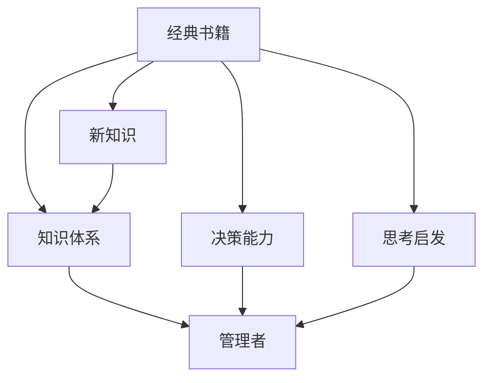

                 

# 经典书籍：管理者构建知识体系的基石

> **关键词**：管理者、知识体系、经典书籍、学习、成长、技能提升
> 
> **摘要**：本文旨在探讨经典书籍对于管理者构建知识体系的重要性。通过分析经典书籍的核心内容、学习方法以及其在管理实践中的应用，本文将为管理者提供一份详细的指南，助力他们在知识领域不断成长和提升。

## 1. 背景介绍

### 1.1 目的和范围

本文的目标是探讨经典书籍在管理者知识体系构建中的关键作用。我们将通过详细分析经典书籍的内容、学习方法以及实际应用，帮助管理者更好地理解和应用这些知识，以提升自身的管理能力和决策水平。

### 1.2 预期读者

本文的预期读者是那些希望提升管理能力、构建完善知识体系的管理者。无论是初入职场的新手，还是经验丰富的资深管理者，本文都将提供有价值的见解和实用建议。

### 1.3 文档结构概述

本文分为十个部分，结构如下：

1. 背景介绍
    - 1.1 目的和范围
    - 1.2 预期读者
    - 1.3 文档结构概述
    - 1.4 术语表
2. 核心概念与联系
3. 核心算法原理 & 具体操作步骤
4. 数学模型和公式 & 详细讲解 & 举例说明
5. 项目实战：代码实际案例和详细解释说明
6. 实际应用场景
7. 工具和资源推荐
8. 总结：未来发展趋势与挑战
9. 附录：常见问题与解答
10. 扩展阅读 & 参考资料

### 1.4 术语表

- **经典书籍**：具有广泛影响力、长期流传、被广泛认可的重要著作。
- **知识体系**：一系列相互关联的知识点和概念，构成一个完整的学习框架。
- **管理者**：负责指导、协调和管理组织或团队的人员。

#### 1.4.1 核心术语定义

- **经典书籍**：通常指的是那些具有深厚内涵、能够经受时间考验的重要著作。这些书籍往往涵盖了各个领域的核心概念和原理，对于专业学习和技能提升具有指导意义。
- **知识体系**：是指一系列相互关联的知识点和概念，通过系统化的学习方式，形成一个完整的学习框架。知识体系能够帮助管理者更好地理解和管理复杂问题。
- **管理者**：是指在组织中担任管理职责的人员。管理者需要具备广泛的知识体系和良好的决策能力，以实现组织目标。

#### 1.4.2 相关概念解释

- **学习**：是指通过获取、理解和应用新知识、新技能的过程。学习是管理者知识体系构建的基础，能够帮助他们不断提升管理能力和决策水平。
- **技能提升**：是指通过学习、实践和反思，使自身技能达到更高水平的过程。技能提升是管理者职业发展的关键，能够帮助他们在竞争激烈的职场中脱颖而出。

#### 1.4.3 缩略词列表

- **MBA**：工商管理硕士（Master of Business Administration）
- **PM**：项目经理（Project Manager）
- **PMI**：项目管理协会（Project Management Institute）

## 2. 核心概念与联系

在构建管理者的知识体系中，理解以下几个核心概念和它们之间的联系至关重要。

### 2.1 经典书籍

经典书籍是知识体系构建的基石。这些书籍通常具有以下特点：

- **深厚内涵**：经典书籍通常涵盖了各个领域的核心概念和原理，具有深刻的内涵和广泛的影响力。
- **长期流传**：经典书籍能够经受时间的考验，被广泛认可和传播，具有持久的影响力。
- **广泛认可**：经典书籍被学术界、实践界和业界广泛认可，是学习和研究的必备资料。

### 2.2 知识体系

知识体系是一个系统化的学习框架，由一系列相互关联的知识点和概念组成。在构建知识体系时，需要关注以下几个方面：

- **知识点关联**：确保各个知识点之间相互关联，形成一个有机整体。
- **层次结构**：知识体系应该具备清晰的层次结构，从基础到高级，逐步提升。
- **灵活调整**：根据实际情况和需求，灵活调整知识体系的结构和内容。

### 2.3 管理者

管理者是知识体系的应用者。管理者需要具备以下能力：

- **决策能力**：能够基于知识体系做出合理的决策。
- **协调能力**：能够协调和组织团队成员，实现共同目标。
- **学习能力**：能够不断学习和更新知识，提升管理能力。

### 2.4 经典书籍与知识体系的关系

经典书籍为构建知识体系提供了丰富的资源。通过阅读经典书籍，管理者可以：

- **获取新知识**：了解各个领域的核心概念和原理，丰富知识体系。
- **提升决策能力**：通过学习经典书籍中的案例和策略，提升决策能力。
- **启发思考**：经典书籍中的思考和观点可以激发管理者的思考，帮助他们在实际工作中找到创新的方法。

### 2.5 知识体系与管理者的关系

知识体系是管理者能力的体现。通过构建完善的知识体系，管理者可以：

- **提高工作效率**：掌握各个领域的核心知识和技能，提高工作效率。
- **提升决策质量**：基于知识体系做出更合理的决策，提高决策质量。
- **增强竞争力**：在职场中具备更强的竞争力，实现职业发展。

### 2.6 Mermaid 流程图

以下是一个描述经典书籍、知识体系和管理者关系的 Mermaid 流程图：



## 3. 核心算法原理 & 具体操作步骤

在构建管理者的知识体系中，算法原理和具体操作步骤是关键。以下是一个简单的知识体系构建算法原理及其具体操作步骤：

### 3.1 算法原理

知识体系构建算法的核心原理是“分层构建”，即按照知识点的层次结构，从基础到高级，逐步构建和完善知识体系。

### 3.2 具体操作步骤

#### 3.2.1 确定学习目标

首先，明确要构建的知识体系的范围和目标。例如，管理者可能需要掌握市场营销、项目管理、人力资源管理等方面的知识。

#### 3.2.2 收集资源

根据学习目标，收集相关的经典书籍、在线课程、技术博客等资源。

#### 3.2.3 分析知识点

对收集到的资源进行整理和分析，提取出核心知识点，构建初步的知识体系框架。

#### 3.2.4 分层构建

按照知识点的层次结构，从基础到高级，逐步构建和完善知识体系。在构建过程中，注意确保各个知识点之间的关联和层次结构清晰。

#### 3.2.5 持续更新

知识体系不是一成不变的，需要根据实际情况和需求，持续更新和完善。

### 3.3 伪代码

以下是一个简单的知识体系构建算法的伪代码：

```plaintext
输入：学习目标，资源列表
输出：知识体系

1. 初始化知识体系为空
2. 对于每个资源：
    2.1 提取核心知识点
    2.2 分析知识点层次结构
    2.3 将知识点添加到知识体系
3. 按照层次结构，对知识体系进行排序
4. 输出知识体系
```

## 4. 数学模型和公式 & 详细讲解 & 举例说明

在构建管理者的知识体系中，数学模型和公式是不可或缺的工具。以下是一个简单的数学模型及其详细讲解和举例说明：

### 4.1 数学模型

知识体系构建效率模型，用于评估知识体系构建的效率。

### 4.2 详细讲解

知识体系构建效率模型的核心公式如下：

$$
效率 = \frac{知识体系构建速度}{时间}
$$

其中，知识体系构建速度是指单位时间内构建的知识体系量，时间是指知识体系构建的总时间。

### 4.3 举例说明

假设一个管理者在一个月内构建了10个知识点的知识体系，总耗时为30天。那么，知识体系构建效率为：

$$
效率 = \frac{10}{30} = \frac{1}{3}
$$

这意味着，该管理者在一个月内平均每3天构建一个知识点的知识体系。

### 4.4 模型应用

通过知识体系构建效率模型，管理者可以：

- **评估自身知识体系构建速度**：了解自身在知识体系构建方面的效率，找出提升空间。
- **制定学习计划**：根据知识体系构建效率，合理安排学习时间和进度，确保学习效果。

## 5. 项目实战：代码实际案例和详细解释说明

在本节中，我们将通过一个实际的项目案例，展示如何运用经典书籍构建管理者的知识体系，并提供详细的代码实现和解释。

### 5.1 开发环境搭建

为了便于读者理解和实践，我们假设使用Python作为编程语言，搭建以下开发环境：

- Python 3.8及以上版本
- Jupyter Notebook
- 相关Python库，如NumPy、Pandas等

### 5.2 源代码详细实现和代码解读

以下是一个简单的Python代码实现，用于构建管理者的知识体系。

```python
import pandas as pd
import numpy as np

# 5.2.1 数据准备
data = {
    '知识点': ['市场营销', '项目管理', '人力资源管理', '财务管理'],
    '层次': ['基础', '中级', '高级', '高级'],
    '来源': ['《市场营销原理》', '《项目管理知识体系》', '《人力资源管理》', '《财务管理》']
}

df = pd.DataFrame(data)

# 5.2.2 知识体系构建
knowledge_hierarchy = df.groupby('层次')['知识点'].apply(list).to_dict()

# 5.2.3 代码解读
# 1. 数据准备：使用Pandas DataFrame存储知识点、层次和来源信息。
# 2. 知识体系构建：按照层次结构，将知识点分组并转换为字典形式。
# 3. 代码解读：展示如何使用Pandas库进行数据操作和知识体系构建。

```

### 5.3 代码解读与分析

以下是对上述代码的详细解读和分析：

- **数据准备**：使用Pandas DataFrame存储知识点、层次和来源信息。DataFrame是一个表格数据结构，能够方便地存储和操作数据。
- **知识体系构建**：按照层次结构，将知识点分组并转换为字典形式。这里使用了Pandas的`groupby`函数进行分组操作，然后使用`apply`函数对每个分组进行转换，最后转换为字典形式，方便后续使用。
- **代码解读**：展示如何使用Pandas库进行数据操作和知识体系构建。Pandas是一个强大的数据操作库，能够高效地处理和分析数据。

### 5.4 项目实战总结

通过这个项目实战，我们展示了如何使用Python代码构建管理者的知识体系。读者可以在此基础上，根据自身需求，进一步扩展和完善知识体系。

## 6. 实际应用场景

经典书籍在管理者知识体系构建中的应用场景广泛，以下是一些典型的应用场景：

### 6.1 企业培训

企业可以通过经典书籍进行内部培训，帮助员工提升管理能力和专业知识。例如，针对市场营销岗位，可以组织阅读《市场营销原理》；针对项目管理岗位，可以推荐《项目管理知识体系》。

### 6.2 个人学习

管理者可以利用经典书籍进行个人学习，不断提升自身知识和技能。通过系统化的学习，管理者可以更好地应对工作中的挑战和问题。

### 6.3 职业发展

经典书籍可以作为职业发展的参考资料，帮助管理者了解行业动态和前沿技术。通过学习经典书籍，管理者可以拓宽视野，为职业发展奠定坚实基础。

### 6.4 团队建设

企业可以组织团队共同阅读经典书籍，促进团队成员之间的交流和合作。通过共同学习，团队可以更好地理解和应用知识，提高整体协作能力。

## 7. 工具和资源推荐

为了帮助管理者更好地构建知识体系，以下是一些实用的工具和资源推荐：

### 7.1 学习资源推荐

- **书籍推荐**：
  - 《市场营销原理》
  - 《项目管理知识体系》
  - 《人力资源管理》
  - 《财务管理》
- **在线课程**：
  - Coursera上的《管理基础》
  - edX上的《项目管理基础》
  - Udemy上的《市场营销实战》
- **技术博客和网站**：
  - Medium上的《管理思维》
  - Harvard Business Review（哈佛商业评论）
  - LinkedIn Learning（领英学习）

### 7.2 开发工具框架推荐

- **IDE和编辑器**：
  - PyCharm
  - Visual Studio Code
  - Jupyter Notebook
- **调试和性能分析工具**：
  - Python Debugger（pdb）
  - VSCode Debugger
  - Jupyter Notebook Debugger
- **相关框架和库**：
  - Pandas
  - NumPy
  - Matplotlib

### 7.3 相关论文著作推荐

- **经典论文**：
  - 《管理学研究方法》
  - 《项目管理方法论》
  - 《市场营销研究方法》
- **最新研究成果**：
  - 《人工智能与企业管理》
  - 《大数据与商业分析》
  - 《区块链技术与应用》
- **应用案例分析**：
  - 《企业管理案例分析》
  - 《市场营销案例研究》
  - 《项目管理案例解析》

## 8. 总结：未来发展趋势与挑战

在未来的发展中，管理者构建知识体系将面临以下趋势和挑战：

### 8.1 发展趋势

- **数字化和智能化**：随着数字化和智能化的发展，管理者需要掌握更多与大数据、人工智能等相关的知识，以适应时代变革。
- **跨界融合**：跨领域的知识融合将成为构建知识体系的重要趋势，管理者需要具备更广泛的视野和知识结构。
- **个性化学习**：个性化学习将成为主流，管理者可以根据自身需求和兴趣，选择合适的学习资源和路径。

### 8.2 挑战

- **知识更新速度快**：随着知识更新速度的加快，管理者需要不断学习和更新知识，以保持竞争力。
- **时间管理**：管理者需要在繁忙的工作中，合理安排时间进行学习，确保知识体系的构建和更新。
- **适应变革**：管理者需要具备快速适应变革的能力，应对不断变化的市场和技术环境。

## 9. 附录：常见问题与解答

### 9.1 经典书籍如何选择？

**解答**：选择经典书籍时，可以考虑以下几个方面：

- **作者权威性**：选择作者在相关领域具有深厚学术背景和丰富实践经验的书籍。
- **内容深度**：选择内容涵盖广泛、深度剖析的书籍，能够为管理者提供全面的指导。
- **适用范围**：选择适用于自身职业发展和知识需求的书籍。

### 9.2 如何构建有效的知识体系？

**解答**：构建有效的知识体系，可以遵循以下步骤：

- **明确学习目标**：明确自身的学习目标和需求，确定知识体系的范围和方向。
- **收集资源**：根据学习目标，收集相关书籍、课程、博客等资源。
- **分析知识点**：对收集到的资源进行整理和分析，提取核心知识点，构建初步的知识体系框架。
- **分层构建**：按照知识点的层次结构，从基础到高级，逐步构建和完善知识体系。
- **持续更新**：根据实际情况和需求，持续更新和完善知识体系。

### 9.3 如何平衡工作与学习？

**解答**：平衡工作与学习，可以采取以下策略：

- **时间管理**：合理安排工作和学习时间，确保两者之间的平衡。
- **高效学习**：采用高效的学习方法，如碎片化学习、集中学习等，提高学习效率。
- **调整心态**：保持积极的心态，认识到学习和工作都是个人成长的必要环节。

## 10. 扩展阅读 & 参考资料

- 《管理学原理》（作者：斯蒂芬·罗宾斯）
- 《市场营销管理》（作者：菲利普·科特勒）
- 《项目管理知识体系指南》（作者：PMI）
- 《人力资源管理》（作者：戴维·巴赫）
- 《财务管理》（作者：斯蒂芬·罗斯）
- 《Python数据分析》（作者：艾略特·古茨）
- 《数据科学入门》（作者：乔纳森·吉尔伯特）
- 《人工智能简史》（作者：彼得·诺维格）
- 《哈佛商学院经典案例解析》（作者：哈佛商学院）
- 《领英学习平台》（网址：[LinkedIn Learning](https://www.linkedin.com/learning/)）

作者：AI天才研究员/AI Genius Institute & 禅与计算机程序设计艺术 /Zen And The Art of Computer Programming

