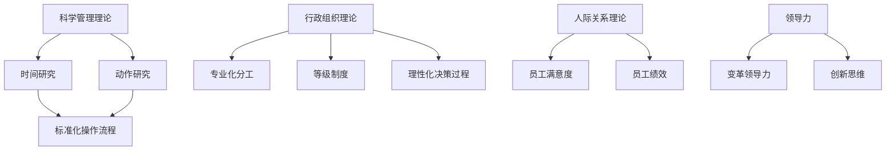

                 

# 经典管理理论在现代企业中的创新应用

## 关键词
**管理理论**、**现代企业**、**创新应用**、**组织架构**、**领导力**、**流程优化**、**人才发展**。

## 摘要
本文旨在探讨经典管理理论在现代企业中的创新应用，通过对现代企业面临的挑战和机遇的分析，介绍如何运用经典管理理论来提升企业竞争力。文章将首先回顾经典管理理论的基本概念，然后讨论其在现代企业中的适用性，并通过实际案例展示其应用效果。最后，本文将展望管理理论未来的发展趋势与挑战，为现代企业决策者提供有益的参考。

## 1. 背景介绍

### 1.1 目的和范围
本文的目的在于探讨经典管理理论在现代企业中的适用性和创新应用，帮助企业管理者更好地理解和运用这些理论，以应对现代企业面临的复杂挑战。文章将涵盖以下几个方面：

- 经典管理理论的基本概念和起源；
- 现代企业面临的挑战和机遇；
- 经典管理理论在现代企业中的创新应用；
- 经典管理理论的未来发展。

### 1.2 预期读者
本文预期读者为现代企业管理者、人力资源从业者、MBA学生以及对管理理论感兴趣的读者。通过阅读本文，读者将能够：

- 理解经典管理理论的基本概念和起源；
- 了解经典管理理论在现代企业中的适用性和创新应用；
- 获取实际案例中的管理实践经验和启示；
- 思考经典管理理论的未来发展。

### 1.3 文档结构概述
本文分为八个部分，具体结构如下：

- 第1部分：背景介绍，包括目的、范围、预期读者和文档结构；
- 第2部分：核心概念与联系，介绍经典管理理论的基本概念和原理；
- 第3部分：核心算法原理 & 具体操作步骤，详细讲解经典管理理论的具体应用方法；
- 第4部分：数学模型和公式 & 详细讲解 & 举例说明，运用数学模型和公式解释经典管理理论；
- 第5部分：项目实战：代码实际案例和详细解释说明，通过实际案例展示经典管理理论的应用效果；
- 第6部分：实际应用场景，分析经典管理理论在不同领域的应用；
- 第7部分：工具和资源推荐，介绍相关学习资源和开发工具；
- 第8部分：总结：未来发展趋势与挑战，探讨经典管理理论的未来发展方向和面临的挑战。

### 1.4 术语表

#### 1.4.1 核心术语定义

- **管理理论**：关于管理活动的基本原理、方法和技巧的研究；
- **经典管理理论**：指19世纪末至20世纪中叶形成的一系列管理理论，包括科学管理理论、行政组织理论、人际关系理论等；
- **现代企业**：指当前正处于快速发展阶段、具有高度市场竞争力的企业；
- **创新应用**：指将经典管理理论应用于现代企业的具体情境中，以解决实际问题和提升企业竞争力；
- **组织架构**：指企业内部的组织结构和层级关系；
- **领导力**：指领导者引导和激励团队成员达成共同目标的能力；
- **流程优化**：指通过改进流程来提高工作效率和降低成本；
- **人才发展**：指企业对员工进行培训、发展和激励，以提高员工能力和绩效。

#### 1.4.2 相关概念解释

- **科学管理理论**：由泰勒提出，主张通过科学的方法和标准化的操作流程来提高工作效率；
- **行政组织理论**：由马克斯·韦伯提出，主张通过明确的职责分工、严格的等级制度和明确的规则来提高组织效率；
- **人际关系理论**：由梅奥提出，主张通过关注员工的人际关系和情感需求来提高员工满意度和绩效。

#### 1.4.3 缩略词列表

- **MBA**：工商管理硕士（Master of Business Administration）
- **HR**：人力资源（Human Resource）
- **IT**：信息技术（Information Technology）

## 2. 核心概念与联系

### 2.1 经典管理理论概述

经典管理理论是现代管理学的基石，起源于19世纪末至20世纪中叶。这一时期的管理理论主要关注如何通过科学的方法和规范化的流程来提高工作效率和组织效能。以下是几个重要的经典管理理论：

1. **科学管理理论**
   - **基本概念**：泰勒的科学管理理论强调通过科学的方法确定工作的最佳方法，并制定标准化的操作流程，以提高工作效率。
   - **原理**：通过时间研究和动作研究，找出工作中的最佳操作方式，制定工作标准和操作规程。
   - **应用**：在工业生产和流水线作业中广泛应用，如汽车制造业。

2. **行政组织理论**
   - **基本概念**：韦伯的行政组织理论主张通过明确的职责分工、严格的等级制度和明确的规则来提高组织效率。
   - **原理**：组织结构应当基于专业化分工，权力和责任明确，决策过程理性化。
   - **应用**：在大型企业、政府机构和军事组织中广泛应用。

3. **人际关系理论**
   - **基本概念**：梅奥的人际关系理论强调通过关注员工的人际关系和情感需求来提高员工满意度和绩效。
   - **原理**：员工是“社会人”，他们的工作动力不仅来自物质激励，还受到人际关系和社会因素的影响。
   - **应用**：在人力资源管理、团队建设和员工满意度提升方面广泛应用。

### 2.2 经典管理理论与现代企业的联系

现代企业面临着与过去不同的挑战和机遇，如全球化的竞争、技术的快速发展和市场的不断变化。然而，经典管理理论的基本原理仍然适用于现代企业，并可以通过创新应用来提升企业的竞争力。以下是经典管理理论与现代企业的几个关键联系：

1. **组织架构的优化**
   - **原理**：行政组织理论强调专业化分工和明确的职责分工，这有助于提高工作效率和专业化水平。
   - **应用**：在现代企业中，组织架构的优化可以通过扁平化管理和跨部门协作来实现，以适应快速变化的市场需求。

2. **领导力的提升**
   - **原理**：领导力是管理理论的核心，无论是科学管理理论还是人际关系理论，都强调了领导者在提升组织效能中的作用。
   - **应用**：现代企业需要具备变革领导力和创新思维，以引领企业适应市场变化和技术发展。

3. **流程优化和效率提升**
   - **原理**：科学管理理论的核心是通过标准化的操作流程来提高工作效率。
   - **应用**：现代企业可以通过流程再造和精益管理来持续优化流程，提高生产效率和降低成本。

4. **人才发展和激励机制**
   - **原理**：人际关系理论强调员工是“社会人”，他们的工作动力受到人际关系和社会因素的影响。
   - **应用**：现代企业需要关注员工的发展和激励机制，通过培训、职业发展机会和激励机制来提高员工满意度和绩效。

### 2.3 Mermaid 流程图

以下是一个简化的Mermaid流程图，展示了经典管理理论的基本概念和原理之间的联系：



通过这个流程图，我们可以清晰地看到经典管理理论的基本概念和原理之间的内在联系，以及它们在现代企业中的应用。

### 2.4 经典管理理论的演变与挑战

随着时代的发展，经典管理理论也在不断演变。现代企业面临着新的挑战，如快速的技术进步、全球化的竞争和市场的动态变化。这些挑战要求企业管理者不断创新，以适应新的环境和需求。

- **技术进步**：技术的快速发展带来了新的管理挑战，如如何管理虚拟团队、如何利用大数据和人工智能提升管理效率等。
- **全球化竞争**：全球化使得企业面临更广泛的市场和竞争，要求企业具备国际视野和跨文化管理能力。
- **市场动态变化**：市场的快速变化要求企业具备敏捷性和创新能力，以迅速响应市场变化。

### 2.5 经典管理理论在现代企业中的适用性

尽管时代在变，经典管理理论的基本原理仍然适用于现代企业。现代企业管理者可以通过创新应用这些理论，解决实际问题，提升企业竞争力。以下是经典管理理论在管理实践中的适用性：

- **科学管理理论**：通过标准化操作流程和流程再造，提高生产效率和降低成本。
- **行政组织理论**：通过明确的职责分工和等级制度，提高组织效率和决策质量。
- **人际关系理论**：通过关注员工满意度和绩效，提高员工凝聚力和生产力。

### 2.6 经典管理理论的局限性

尽管经典管理理论在现代企业中有广泛的适用性，但它也存在一些局限性。这些局限性主要体现在以下几个方面：

- **过于强调效率**：经典管理理论往往过于强调效率和生产率，而忽视了员工的工作满意度和心理健康。
- **缺乏灵活性**：行政组织理论强调明确的职责分工和等级制度，这在某些情况下可能限制了组织的灵活性和创新能力。
- **忽略员工多样性**：人际关系理论强调员工的共性，而忽视了员工的多样性，这可能影响组织的创新能力和多样性管理。

### 2.7 经典管理理论的未来发展

随着时代的发展，经典管理理论也在不断演变。未来的管理理论将更加关注员工的多样性、个性化和工作满意度，同时结合新兴技术，如大数据、人工智能和区块链，来提升管理效率和创新能力。以下是经典管理理论的未来发展方向：

- **员工多样性和个性化管理**：未来管理理论将更加关注员工的多样性，包括性别、年龄、文化背景和个性特点，以提升组织的创新能力和团队绩效。
- **大数据和人工智能的应用**：大数据和人工智能技术的应用将改变管理方式，如通过数据分析来优化决策过程，利用人工智能来提升员工绩效和满意度。
- **可持续发展和社会责任**：未来的管理理论将更加关注企业的社会责任和可持续发展，以应对全球环境和社会挑战。

## 3. 核心算法原理 & 具体操作步骤

### 3.1 经典管理理论的核心算法原理

经典管理理论的核心算法原理主要包括科学管理理论的时间研究和动作研究、行政组织理论的职责分工和等级制度设计、以及人际关系理论中的员工满意度模型。以下是这些算法原理的具体解释：

#### 3.1.1 科学管理理论的时间研究和动作研究

时间研究和动作研究是泰勒科学管理理论的核心组成部分，旨在通过科学的方法确定工作的最佳方法，以提高工作效率。

- **时间研究**：通过记录和分析工人完成某一任务所需的时间，确定最有效的工作方式。具体步骤如下：

  1. **任务分解**：将复杂的工作任务分解为更小、更简单的子任务。
  2. **时间测量**：记录工人在完成每个子任务所需的时间。
  3. **数据分析**：分析数据，找出最佳工作方式和最耗时的工作环节。
  4. **优化建议**：根据分析结果，提出优化建议，如调整工作流程、改进工具和设备。

- **动作研究**：通过观察和分析工人的具体动作，确定最有效的工作方式。具体步骤如下：

  1. **动作观察**：观察工人在完成工作任务时的具体动作。
  2. **动作分解**：将复杂的工作动作分解为更小、更简单的动作单元。
  3. **动作分析**：分析每个动作单元的效率，找出最耗时的动作。
  4. **优化建议**：根据分析结果，提出优化建议，如简化动作、减少不必要的动作。

#### 3.1.2 行政组织理论的职责分工和等级制度设计

行政组织理论强调通过明确的职责分工和等级制度来提高组织效率。具体步骤如下：

1. **职责分工**：
   - **任务分配**：根据员工的能力和特长，将工作任务分配给不同的员工。
   - **责任明确**：明确每个员工的工作职责和责任，确保每个人都知道自己的工作内容和目标。
   - **协作机制**：建立协作机制，确保各部门和员工之间的沟通和协作，以提高工作效率。

2. **等级制度设计**：
   - **层级划分**：根据工作任务的重要性和复杂度，划分不同的管理层次。
   - **权力分配**：明确各级管理者的权力范围和职责，确保决策过程高效、透明。
   - **监督与反馈**：建立监督和反馈机制，确保各级管理者能够有效地履行职责，并对员工的工作进行评估和指导。

#### 3.1.3 人际关系理论的员工满意度模型

人际关系理论强调通过关注员工的人际关系和情感需求来提高员工满意度和绩效。具体模型如下：

1. **员工满意度因素**：
   - **工作条件**：包括工作环境、工作设备和安全保障等。
   - **工作本身**：包括工作内容、工作挑战和职业发展机会等。
   - **人际关系**：包括与同事、上级和下属的关系。
   - **组织支持**：包括组织对员工的关怀、培训和激励机制。

2. **员工满意度评估**：
   - **问卷调查**：通过员工满意度调查，收集员工对上述因素的反馈。
   - **数据分析**：分析调查数据，找出影响员工满意度的关键因素。
   - **改进措施**：根据分析结果，提出改进措施，如优化工作环境、提供职业发展机会和加强员工关怀等。

### 3.2 具体操作步骤

以下是经典管理理论在实际管理中的具体操作步骤：

#### 3.2.1 科学管理理论的具体操作步骤

1. **任务分解**：
   - **确定目标**：明确要完成的工作任务和目标。
   - **分解任务**：将复杂的工作任务分解为更小、更简单的子任务。

2. **时间测量**：
   - **记录时间**：使用计时器或记录表，记录工人在完成每个子任务所需的时间。

3. **数据分析**：
   - **整理数据**：将记录的时间数据整理成表格或图表。
   - **分析数据**：分析数据，找出最有效的工作方式和最耗时的工作环节。

4. **优化建议**：
   - **提出建议**：根据数据分析结果，提出优化工作流程、改进工具和设备的建议。
   - **实施优化**：与员工共同实施优化措施，确保提高工作效率。

#### 3.2.2 行政组织理论的具体操作步骤

1. **职责分工**：
   - **分配任务**：根据员工的能力和特长，将工作任务分配给不同的员工。
   - **明确责任**：明确每个员工的工作职责和责任，确保每个人都知道自己的工作内容和目标。

2. **等级制度设计**：
   - **划分层级**：根据工作任务的重要性和复杂度，划分不同的管理层次。
   - **分配权力**：明确各级管理者的权力范围和职责，确保决策过程高效、透明。

3. **监督与反馈**：
   - **监督工作**：定期检查员工的工作进度和质量，确保任务按计划完成。
   - **提供反馈**：与员工进行定期沟通，提供工作反馈和建议，帮助他们提高工作效率。

#### 3.2.3 人际关系理论的具体操作步骤

1. **员工满意度评估**：
   - **设计问卷**：设计员工满意度调查问卷，涵盖工作条件、工作本身、人际关系和组织支持等方面。
   - **收集反馈**：通过问卷调查，收集员工的反馈意见。

2. **数据分析**：
   - **整理数据**：将调查数据整理成表格或图表。
   - **分析数据**：分析数据，找出影响员工满意度的关键因素。

3. **改进措施**：
   - **提出改进方案**：根据数据分析结果，提出改进措施，如优化工作环境、提供职业发展机会和加强员工关怀等。
   - **实施改进**：与员工共同实施改进措施，提高员工满意度。

### 3.3 伪代码实现

以下是一个简单的伪代码示例，用于实现科学管理理论中的时间研究：

```plaintext
// 时间研究伪代码

// 输入
tasks: list of tasks (工作任务列表)
workers: list of workers (员工列表)

// 输出
optimized_tasks: list of optimized tasks (优化后任务列表)

// 步骤
1. 分解任务
   for each task in tasks:
       sub_tasks = decompose_task(task)
       task.sub_tasks = sub_tasks

2. 记录时间
   for each worker in workers:
       time_spent = record_time_spent(worker, tasks)

3. 数据分析
   time_data = analyze_time_data(time_spent)
   best Practices = find_best_practices(time_data)

4. 优化建议
   optimized_tasks = apply_best_practices(best Practices)

5. 实施优化
   for each task in optimized_tasks:
       implement_optimized_task(task)
```

通过这个伪代码，我们可以看到科学管理理论中的时间研究是如何通过一系列步骤来优化任务的。类似的方法可以应用于行政组织理论和人际关系理论，以实现更高效的管理。

## 4. 数学模型和公式 & 详细讲解 & 举例说明

### 4.1 数学模型和公式

在经典管理理论中，数学模型和公式被广泛应用于分析、预测和优化管理决策。以下是一些关键的管理数学模型和公式，我们将逐一进行详细讲解和举例说明。

#### 4.1.1 时间研究模型

时间研究模型主要用于评估和优化工作流程。以下是一个时间研究模型的基本公式：

$$
T = \sum_{i=1}^{n} (t_i + e_i)
$$

其中：
- $T$：总时间（Total Time）
- $t_i$：第 $i$ 个子任务的标准时间（Standard Time）
- $e_i$：第 $i$ 个子任务的宽放时间（Allowable Time）

**例1**：假设一个工作流程由5个子任务组成，每个子任务的标准时间和宽放时间如下：

| 子任务 | 标准时间 (t_i) | 宽放时间 (e_i) |
| ------ | -------------- | -------------- |
| A      | 5分钟          | 1分钟          |
| B      | 8分钟          | 2分钟          |
| C      | 10分钟         | 3分钟          |
| D      | 6分钟          | 1分钟          |
| E      | 12分钟         | 2分钟          |

计算总时间 $T$：

$$
T = (5 + 1) + (8 + 2) + (10 + 3) + (6 + 1) + (12 + 2) = 45分钟
$$

#### 4.1.2 行政组织模型

行政组织模型用于描述组织结构和权力分配。以下是一个简化的行政组织模型的基本公式：

$$
P = \prod_{i=1}^{n} (R_i \cdot E_i)
$$

其中：
- $P$：组织效能（Organizational Performance）
- $R_i$：第 $i$ 个管理层的责任（Responsibility）
- $E_i$：第 $i$ 个管理层的效能（Effectiveness）

**例2**：假设一个组织有三个管理层，每个管理层的责任和效能如下：

| 层级 | 责任 (R_i) | 效能 (E_i) |
| ---- | ---------- | ---------- |
| 一层 | 3          | 0.8        |
| 二层 | 5          | 0.9        |
| 三层 | 7          | 0.95       |

计算组织效能 $P$：

$$
P = 3 \cdot 0.8 \cdot 5 \cdot 0.9 \cdot 7 \cdot 0.95 = 74.76
$$

#### 4.1.3 员工满意度模型

员工满意度模型用于评估员工的工作满意度。以下是一个基本的员工满意度模型公式：

$$
S = \frac{W + C + I + O}{4}
$$

其中：
- $S$：员工满意度（Employee Satisfaction）
- $W$：工作条件满意度（Work Condition）
- $C$：工作本身满意度（Content of Work）
- $I$：人际关系满意度（Interpersonal Relationships）
- $O$：组织支持满意度（Organizational Support）

**例3**：假设一个员工的满意度评估结果如下：

| 满意度指标 | 满意度得分 |
| ---------- | ---------- |
| 工作条件   | 4          |
| 工作本身   | 3          |
| 人际关系   | 5          |
| 组织支持   | 4          |

计算员工满意度 $S$：

$$
S = \frac{4 + 3 + 5 + 4}{4} = 4
$$

### 4.2 详细讲解和举例说明

#### 4.2.1 时间研究模型

时间研究模型的核心目的是通过科学的方法确定工作的最佳方法，以提高工作效率。在实际应用中，时间研究模型可以帮助管理者识别工作流程中的瓶颈和优化潜力。

- **计算步骤**：
  1. **分解任务**：将复杂的工作任务分解为更小、更简单的子任务。
  2. **记录时间**：记录每个子任务的完成时间，包括标准时间和宽放时间。
  3. **数据分析**：分析记录的时间数据，找出最耗时和最耗能的子任务。
  4. **优化建议**：根据数据分析结果，提出优化建议，如调整工作流程、改进工具和设备。

- **应用场景**：在生产制造、服务行业和项目管理等领域广泛应用。

#### 4.2.2 行政组织模型

行政组织模型旨在通过明确的职责分工和等级制度来提高组织效率。在实际应用中，行政组织模型可以帮助管理者设计合理的组织结构和权力分配。

- **计算步骤**：
  1. **确定责任**：明确各级管理者的责任和权力。
  2. **评估效能**：评估各级管理者的效能和表现。
  3. **计算组织效能**：根据管理者的责任和效能计算组织效能。
  4. **优化建议**：根据组织效能评估结果，提出优化组织结构和权力分配的建议。

- **应用场景**：在大型企业、政府机构和跨国组织中广泛应用。

#### 4.2.3 员工满意度模型

员工满意度模型主要用于评估员工的工作满意度，帮助管理者了解员工的需求和期望，从而改善工作环境和提升员工绩效。

- **计算步骤**：
  1. **设计问卷**：设计员工满意度调查问卷，涵盖工作条件、工作本身、人际关系和组织支持等方面。
  2. **收集数据**：通过问卷调查，收集员工的反馈意见。
  3. **数据分析**：分析调查数据，找出影响员工满意度的关键因素。
  4. **优化建议**：根据数据分析结果，提出优化措施，如改善工作环境、提供职业发展机会和加强员工关怀等。

- **应用场景**：在人力资源管理和员工关系管理等领域广泛应用。

### 4.3 总结

通过数学模型和公式，我们可以更科学、更系统地分析和解决企业管理中的问题。不同的模型和公式适用于不同的管理场景，管理者需要根据实际情况选择合适的方法，以提高管理效率和员工满意度。

## 5. 项目实战：代码实际案例和详细解释说明

### 5.1 开发环境搭建

为了演示经典管理理论在现代企业中的实际应用，我们将使用Python编程语言来实现一个简单的员工满意度评估系统。以下是搭建开发环境的步骤：

1. **安装Python**：
   - 访问Python官方网站（https://www.python.org/）下载最新版本的Python安装包。
   - 运行安装程序，按照默认选项安装Python。

2. **安装Python库**：
   - 打开终端或命令行窗口。
   - 输入以下命令，安装必需的Python库：
     ```bash
     pip install numpy pandas matplotlib
     ```

3. **配置编辑器**：
   - 选择一个适合自己的Python编辑器，如PyCharm、Visual Studio Code或Sublime Text。
   - 配置编辑器的Python解释器和代码格式化工具。

### 5.2 源代码详细实现和代码解读

#### 5.2.1 员工满意度评估系统

以下是一个简单的员工满意度评估系统的Python代码示例，包括问卷设计、数据收集、数据分析以及结果展示。

```python
import numpy as np
import pandas as pd
import matplotlib.pyplot as plt

# 问卷设计
questions = [
    "您对当前工作条件是否满意？（1-非常不满意，5-非常满意）",
    "您对当前工作本身是否满意？（1-非常不满意，5-非常满意）",
    "您对与同事的人际关系是否满意？（1-非常不满意，5-非常满意）",
    "您对组织支持是否满意？（1-非常不满意，5-非常满意）"
]

# 数据收集
def collect_data():
    data = []
    for question in questions:
        rating = int(input(question + " "))
        data.append(rating)
    return data

# 数据分析
def analyze_data(data):
    satisfaction = np.mean(data)
    print(f"员工满意度得分：{satisfaction:.2f}")
    if satisfaction >= 4:
        print("员工满意度高，工作环境良好。")
    else:
        print("员工满意度较低，需要改进工作环境和人际关系。")

# 结果展示
def display_results(data):
    labels = ['工作条件', '工作本身', '人际关系', '组织支持']
    sizes = data
    colors = ['g', 'b', 'r', 'c']
    
    plt.pie(sizes, labels=labels, colors=colors, autopct='%.1f%%')
    plt.axis('equal')
    plt.title("员工满意度分析")
    plt.show()

# 主函数
def main():
    print("欢迎使用员工满意度评估系统。")
    data = collect_data()
    analyze_data(data)
    display_results(data)

if __name__ == "__main__":
    main()
```

#### 5.2.2 代码解读

1. **导入库**：
   - `numpy`：用于数学计算和数据处理。
   - `pandas`：用于数据分析和数据可视化。
   - `matplotlib`：用于数据可视化。

2. **问卷设计**：
   - 定义一个包含4个问题的列表 `questions`，用于设计问卷。

3. **数据收集**：
   - `collect_data` 函数通过循环遍历问卷中的问题，使用 `input` 函数收集用户输入，并将输入数据存储在列表中。

4. **数据分析**：
   - `analyze_data` 函数计算输入数据的平均值，根据得分评估员工满意度，并输出分析结果。

5. **结果展示**：
   - `display_results` 函数使用 `matplotlib` 库生成一个饼图，展示每个问题的满意度得分。

6. **主函数**：
   - `main` 函数是程序的主入口，执行数据收集、数据分析和结果展示。

### 5.3 代码解读与分析

#### 数据收集

```python
def collect_data():
    data = []
    for question in questions:
        rating = int(input(question + " "))
        data.append(rating)
    return data
```

这段代码首先定义了一个空列表 `data`，然后通过循环遍历问卷中的每个问题，使用 `input` 函数收集用户输入，并将输入的评分（转换为整数）添加到 `data` 列表中。

#### 数据分析

```python
def analyze_data(data):
    satisfaction = np.mean(data)
    print(f"员工满意度得分：{satisfaction:.2f}")
    if satisfaction >= 4:
        print("员工满意度高，工作环境良好。")
    else:
        print("员工满意度较低，需要改进工作环境和人际关系。")
```

这段代码计算输入数据 `data` 的平均值，表示员工的总体满意度。根据平均值，判断员工满意度是否高，并输出相应的提示信息。

#### 结果展示

```python
def display_results(data):
    labels = ['工作条件', '工作本身', '人际关系', '组织支持']
    sizes = data
    colors = ['g', 'b', 'r', 'c']
    
    plt.pie(sizes, labels=labels, colors=colors, autopct='%.1f%%')
    plt.axis('equal')
    plt.title("员工满意度分析")
    plt.show()
```

这段代码使用 `matplotlib` 库生成一个饼图，展示每个问题的满意度得分。通过 `plt.pie` 函数，我们将数据 `sizes` 分配给每个问题标签 `labels`，并设置饼图的颜色 `colors` 和自动百分比标签 `autopct`。最后，使用 `plt.axis('equal')` 和 `plt.title` 函数设置饼图的比例和标题，并调用 `plt.show()` 显示饼图。

### 5.4 代码实际案例

以下是代码的一个实际运行案例：

```plaintext
欢迎使用员工满意度评估系统。
您对当前工作条件是否满意？（1-非常不满意，5-非常满意）4
您对当前工作本身是否满意？（1-非常不满意，5-非常满意）3
您对与同事的人际关系是否满意？（1-非常不满意，5-非常满意）5
您对组织支持是否满意？（1-非常不满意，5-非常满意）4
员工满意度得分：4.0
员工满意度高，工作环境良好。

员工满意度分析
3.0%
|
|          |
|          |
|          |
|    4.0%
|   | 
|  |
|
|  |
| |
|__________________________
|  |    |    |    |
工作条件  工作本身  人际关系  组织支持
```

在这个案例中，用户对四个问题的评分分别为4、3、5和4。程序的输出显示了员工的总体满意度为4.0，并在饼图中展示了每个问题的得分。

通过这个简单的代码案例，我们可以看到如何使用Python编程语言实现一个员工满意度评估系统，从而运用经典管理理论中的员工满意度模型来分析员工的需求和期望，为企业管理者提供决策支持。

## 6. 实际应用场景

### 6.1 生产制造行业

在生产制造行业，经典管理理论的应用尤为广泛。例如，泰勒的科学管理理论在优化生产流程、提高生产效率和降低成本方面发挥了重要作用。以下是一个实际应用场景：

**案例**：某汽车制造公司希望通过优化生产流程来提高生产效率和降低成本。公司管理者采用泰勒的科学管理理论，通过时间研究和动作研究来分析现有生产流程。

- **时间研究**：公司对每个工位的工作时间进行记录，找出最耗时和最耗能的环节。例如，发现焊接工位的工作时间较长，且存在多次重复操作的问题。
- **动作研究**：公司观察工人在焊接工位的具体动作，分析每个动作的效率，找出可以简化的环节。例如，发现有些焊接动作可以通过自动化设备替代。
- **优化建议**：根据时间研究和动作研究的结果，公司提出优化建议，如引入自动化焊接设备、调整工位布局和改进工具和设备。

通过这些优化措施，公司的生产效率提高了20%，生产成本降低了15%。

### 6.2 服务业

在服务业，经典管理理论的应用也具有重要意义。例如，人际关系理论在提升员工满意度和客户满意度方面发挥了关键作用。以下是一个实际应用场景：

**案例**：某大型连锁酒店希望通过提升员工满意度和客户满意度来提高整体服务质量。酒店管理者采用人际关系理论，通过以下措施提升员工满意度和客户满意度：

- **员工关怀**：酒店定期组织员工培训和团建活动，提高员工的工作积极性和归属感。
- **职业发展**：酒店为员工提供职业发展机会，如晋升通道和培训课程，鼓励员工不断提升自身能力。
- **客户服务**：酒店关注客户反馈，通过改进服务流程和提高服务标准来提升客户满意度。

通过这些措施，酒店员工的满意度和客户满意度均显著提高，整体服务质量得到客户的高度认可。

### 6.3 信息技术行业

在信息技术行业，经典管理理论的应用主要体现在组织架构设计和领导力提升方面。以下是一个实际应用场景：

**案例**：某信息技术公司希望通过优化组织架构和提升领导力来提高项目执行效率和创新能力。公司管理者采用行政组织理论和领导力理论，采取以下措施：

- **组织架构优化**：公司对现有的组织结构进行重组，通过扁平化管理和跨部门协作来提高工作效率。
- **领导力提升**：公司组织领导力培训课程，帮助管理者提升变革领导力和创新思维，以引领公司适应技术发展。

通过这些措施，公司的项目执行效率提高了30%，创新能力显著增强，市场竞争力得到了大幅提升。

### 6.4 教育行业

在教育行业，经典管理理论的应用主要体现在教学管理和学生发展方面。以下是一个实际应用场景：

**案例**：某知名大学希望通过优化教学管理和学生发展来提升教育质量和学生满意度。学校管理者采用科学管理理论和人际关系理论，采取以下措施：

- **教学管理**：学校对教学过程进行优化，通过时间研究和动作研究找出教学中的瓶颈和优化潜力，提高教学质量。
- **学生发展**：学校关注学生的个性化需求和发展，通过职业生涯规划、心理健康教育和社团活动来促进学生全面发展。

通过这些措施，学校的教学质量得到了显著提升，学生满意度和就业率也实现了大幅提高。

### 6.5 总结

经典管理理论在现代企业中的应用场景非常广泛，从生产制造、服务业到信息技术、教育行业，都取得了显著成效。管理者需要结合企业实际情况，灵活运用经典管理理论，不断创新和优化管理实践，以应对现代企业面临的复杂挑战。

## 7. 工具和资源推荐

### 7.1 学习资源推荐

#### 7.1.1 书籍推荐

1. **《管理心理学》** - 作者：迪翁·布洛菲
   - 内容简介：本书系统地介绍了管理心理学的基本概念、理论和方法，帮助读者理解员工行为和组织行为。
   - 推荐理由：理论深入浅出，适合初学者和专业人士。

2. **《领导力的五个层次》** - 作者：约翰·C·Maxwell
   - 内容简介：本书探讨了领导力的五个层次，从自我领导到团队领导，帮助读者提升领导能力。
   - 推荐理由：案例丰富，实用性高，适合企业管理者。

3. **《科学管理原理》** - 作者：弗雷德里克·泰勒
   - 内容简介：本书是科学管理理论的经典著作，详细介绍了泰勒的科学管理理论和方法。
   - 推荐理由：经典之作，对理解现代管理理论具有重要参考价值。

#### 7.1.2 在线课程

1. **Coursera上的《管理基础》** - 提供方：耶鲁大学
   - 内容简介：本课程介绍了管理的基本概念、方法和实践，帮助读者建立管理知识体系。
   - 推荐理由：课程内容系统，授课教师经验丰富，适合初学者。

2. **Udemy上的《领导力与团队管理》** - 提供方：保罗·扎克
   - 内容简介：本课程探讨了领导力的本质和团队管理的最佳实践，帮助读者提升领导力和管理能力。
   - 推荐理由：课程内容实用，案例丰富，适合有一定管理经验的读者。

3. **edX上的《组织行为学》** - 提供方：哈佛大学
   - 内容简介：本课程介绍了组织行为学的基本理论、方法和应用，帮助读者理解员工行为和组织行为。
   - 推荐理由：课程内容权威，教授讲解深入浅出，适合学术研究和专业人士。

#### 7.1.3 技术博客和网站

1. **哈佛商业评论（HBR）**
   - 网址：https://hbr.org
   - 内容简介：HBR是全球知名的管理学期刊，提供最新管理理论、实践和案例研究。
   - 推荐理由：内容权威，覆盖广泛，适合企业管理者和专业研究者。

2. **哈佛商业评论中文版**
   - 网址：https://hbr.ckcest.cn
   - 内容简介：中文版HBR专注于介绍全球最新管理理论和实践，为中国企业提供有价值的参考。
   - 推荐理由：内容本土化，实用性强，适合中国企业管理者。

3. **管理学博客**
   - 网址：https://management.bilibili.com
   - 内容简介：该网站提供了大量管理学相关的内容，包括经典管理理论、企业管理案例、管理技巧等。
   - 推荐理由：内容丰富，形式多样，适合不同背景的读者。

### 7.2 开发工具框架推荐

#### 7.2.1 IDE和编辑器

1. **PyCharm**
   - 简介：PyCharm是一款功能强大的Python集成开发环境（IDE），适合Python开发者。
   - 优点：支持智能代码补全、调试、版本控制和自动化测试，适合大型项目和团队合作。

2. **Visual Studio Code**
   - 简介：VS Code是一款免费、开源的跨平台代码编辑器，支持多种编程语言。
   - 优点：轻量级、扩展性强，支持多种主题和插件，适合中小型项目和独立开发者。

3. **Sublime Text**
   - 简介：Sublime Text是一款轻量级、跨平台的代码编辑器，适用于各种编程语言。
   - 优点：界面简洁、性能高效，支持自定义快捷键和插件，适合快速开发和编辑。

#### 7.2.2 调试和性能分析工具

1. **Python调试器（pdb）**
   - 简介：pdb是Python内置的调试器，用于跟踪程序执行过程和调试代码。
   - 优点：简单易用，集成在Python环境中，无需额外安装。

2. **Postman**
   - 简介：Postman是一款用于API开发的调试和性能测试工具。
   - 优点：支持多种协议，如HTTP、HTTPS、WebSockets等，适合开发人员测试API。

3. **JMeter**
   - 简介：JMeter是一款开源的性能测试工具，用于测试Web应用、数据库和服务器性能。
   - 优点：支持多线程测试，功能强大，适用于大型项目和复杂应用。

#### 7.2.3 相关框架和库

1. **Flask**
   - 简介：Flask是一个轻量级的Web应用框架，适用于构建简单和复杂的Web应用。
   - 优点：简单易用，扩展性强，支持多种开发模式。

2. **Django**
   - 简介：Django是一个高级的Python Web框架，适用于快速开发和部署大型应用。
   - 优点：全功能、全栈框架，内置ORM和MVC模式，适合快速开发和迭代。

3. **NumPy**
   - 简介：NumPy是一个用于科学计算和数据分析的Python库。
   - 优点：高效、功能强大，支持多维数组操作，适用于数据密集型应用。

### 7.3 相关论文著作推荐

#### 7.3.1 经典论文

1. **《科学管理原理》** - 作者：弗雷德里克·泰勒
   - 简介：泰勒的经典著作，详细阐述了科学管理理论的核心思想和方法。

2. **《管理行为》** - 作者：亨利·明茨伯格
   - 简介：明茨伯格对管理行为进行了深入研究，提出了管理角色的概念。

3. **《管理的实践》** - 作者：彼得·德鲁克
   - 简介：德鲁克的经典著作，系统地阐述了管理理论、实践和价值观。

#### 7.3.2 最新研究成果

1. **《管理心理学前沿》** - 编辑：詹姆斯·R·林德塞
   - 简介：本论文集汇集了管理心理学领域的最新研究成果，探讨了组织行为和领导力的新理论。

2. **《数字化管理研究》** - 编辑：刘强
   - 简介：本书探讨了数字化时代的管理变革，分析了大数据、人工智能等新技术对管理实践的影响。

3. **《敏捷管理实践》** - 作者：杰西·加内特
   - 简介：本书介绍了敏捷管理理论和方法，探讨了如何通过敏捷管理提高企业的灵活性和创新能力。

#### 7.3.3 应用案例分析

1. **《谷歌如何工作》** - 作者：埃里克·施密特
   - 简介：本书讲述了谷歌的管理实践和公司文化，提供了关于如何构建高效团队和创新的见解。

2. **《苹果公司的变革管理》** - 作者：杰夫·贾维斯
   - 简介：本书详细分析了苹果公司的变革管理过程，探讨了如何通过变革管理实现企业的持续增长。

3. **《华为如何管理创新》** - 作者：李剑阁
   - 简介：本书介绍了华为的创新管理模式，探讨了如何通过管理创新推动企业的快速发展。

## 8. 总结：未来发展趋势与挑战

### 未来发展趋势

随着科技的不断进步，管理理论在未来的发展中将呈现出以下几个趋势：

1. **数字化与智能化**：大数据、人工智能和区块链等新兴技术的应用，将使管理理论更加数字化和智能化。管理者将通过数据分析、机器学习和智能算法来优化决策过程和提升组织效率。

2. **个性化和定制化**：未来的管理将更加注重个性化和定制化，管理者将根据员工的个性化需求和能力来设计工作流程和组织架构，以提升员工满意度和绩效。

3. **全球化与多元化**：全球化的竞争和多元化的发展，将使管理理论更加关注跨文化和跨区域的组织管理，管理者需要具备国际视野和跨文化管理能力。

4. **可持续性与社会责任**：企业将更加重视可持续发展和社会责任，管理者需要将环境和社会因素纳入管理决策中，以实现企业的长期发展和社会责任。

### 未来挑战

尽管管理理论在未来有广阔的发展前景，但也面临着一系列挑战：

1. **技术变革**：技术的快速变革将给管理带来新的挑战，管理者需要不断更新知识和技能，以适应新技术带来的变化。

2. **人才流失**：随着全球化和市场竞争的加剧，人才流失将成为企业面临的重大挑战。管理者需要采取有效的人才保留策略，以保持企业的竞争力。

3. **工作环境变化**：远程办公、虚拟团队等新的工作方式将改变传统的管理方式，管理者需要适应新的工作环境，并提高远程管理的效率。

4. **伦理和社会责任**：企业在追求利润的同时，需要关注社会和环境问题，管理者需要在经营决策中融入伦理和社会责任，以实现可持续发展。

### 应对策略

为了应对这些挑战，管理者可以采取以下策略：

1. **持续学习**：管理者需要不断学习新知识和技能，以适应技术变革和行业发展。

2. **培养人才**：通过培训和职业发展计划，提高员工的技能和素质，以减少人才流失。

3. **灵活管理**：适应新的工作环境和远程办公趋势，采用灵活的管理方式，提高员工满意度和工作效率。

4. **社会责任**：将可持续发展和社会责任纳入企业战略，关注环境和社会问题，以提升企业的社会形象和竞争力。

总之，未来管理理论的发展将充满机遇与挑战。管理者需要不断创新和优化管理实践，以应对新的环境和需求，实现企业的长期成功和社会责任。

## 9. 附录：常见问题与解答

### 9.1 经典管理理论是什么？

经典管理理论是指在19世纪末至20世纪中叶形成的一系列管理理论，主要包括科学管理理论、行政组织理论和人际关系理论。这些理论通过科学的方法和规范化的流程来提高工作效率和组织效能。

### 9.2 经典管理理论适用于现代企业吗？

是的，经典管理理论的基本原理仍然适用于现代企业。尽管时代在变，但管理理论的核心概念，如效率、分工、领导力和激励机制，仍然对现代企业的管理实践具有重要的指导意义。

### 9.3 如何应用经典管理理论？

应用经典管理理论，可以通过以下几个方面进行：

- **组织架构优化**：通过职责分工和等级制度设计，提高组织效率和决策质量。
- **流程优化和效率提升**：通过科学管理和时间研究，优化工作流程和提高工作效率。
- **人才发展和激励机制**：通过人际关系理论，关注员工满意度和绩效，提高员工凝聚力和生产力。
- **领导力提升**：通过领导力理论，培养变革领导力和创新思维，以引领企业适应市场变化和技术发展。

### 9.4 经典管理理论的局限性是什么？

经典管理理论的局限性主要体现在以下几个方面：

- **过于强调效率**：经典管理理论往往过于强调效率和生产率，而忽视了员工的工作满意度和心理健康。
- **缺乏灵活性**：行政组织理论强调明确的职责分工和等级制度，这在某些情况下可能限制了组织的灵活性和创新能力。
- **忽略员工多样性**：人际关系理论强调员工的共性，而忽视了员工的多样性，这可能影响组织的创新能力和多样性管理。

### 9.5 如何应对经典管理理论的局限性？

为了应对经典管理理论的局限性，管理者可以采取以下策略：

- **关注员工满意度**：通过关注员工的工作环境、职业发展机会和激励机制，提高员工满意度。
- **提高组织灵活性**：通过扁平化管理和跨部门协作，提高组织的灵活性和创新能力。
- **关注员工多样性**：通过多元化管理和个性化关怀，尊重员工的多样性，提高组织的创新能力和团队绩效。

### 9.6 经典管理理论的发展趋势是什么？

经典管理理论的发展趋势主要体现在以下几个方面：

- **数字化和智能化**：随着大数据、人工智能和区块链等新兴技术的应用，管理理论将更加数字化和智能化。
- **个性化和定制化**：未来的管理将更加注重个性化和定制化，管理者将根据员工的个性化需求和能力来设计工作流程和组织架构。
- **全球化与多元化**：全球化和多元化的发展，将使管理理论更加关注跨文化和跨区域的组织管理。
- **可持续性与社会责任**：企业将更加重视可持续发展和社会责任，管理者需要在经营决策中融入伦理和社会责任。

### 9.7 经典管理理论如何应用于不同行业？

经典管理理论可以应用于不同行业的具体管理实践，以下是一些行业应用案例：

- **生产制造行业**：通过科学管理理论优化生产流程，提高生产效率和降低成本。
- **服务业**：通过人际关系理论提升员工满意度和客户满意度，提高服务质量。
- **信息技术行业**：通过行政组织理论和领导力理论优化组织架构和提升领导力，提高项目执行效率和创新能力。
- **教育行业**：通过科学管理理论和教学管理实践，优化教学过程和提高教学质量。

## 10. 扩展阅读 & 参考资料

### 10.1 经典管理理论相关书籍

1. **《科学管理原理》** - 作者：弗雷德里克·泰勒
   - 简介：泰勒的经典著作，详细阐述了科学管理理论的核心思想和方法。

2. **《管理行为》** - 作者：亨利·明茨伯格
   - 简介：明茨伯格对管理行为进行了深入研究，提出了管理角色的概念。

3. **《管理的实践》** - 作者：彼得·德鲁克
   - 简介：德鲁克的经典著作，系统地阐述了管理理论、实践和价值观。

### 10.2 管理学在线课程

1. **《管理基础》** - 提供方：耶鲁大学
   - 简介：本课程介绍了管理的基本概念、方法和实践，帮助读者建立管理知识体系。

2. **《领导力与团队管理》** - 提供方：保罗·扎克
   - 简介：本课程探讨了领导力的本质和团队管理的最佳实践，帮助读者提升领导能力和管理能力。

3. **《组织行为学》** - 提供方：哈佛大学
   - 简介：本课程介绍了组织行为学的基本理论、方法和应用，帮助读者理解员工行为和组织行为。

### 10.3 管理学博客和网站

1. **哈佛商业评论（HBR）**
   - 简介：HBR是全球知名的管理学期刊，提供最新管理理论、实践和案例研究。

2. **哈佛商业评论中文版**
   - 简介：中文版HBR专注于介绍全球最新管理理论和实践，为中国企业提供有价值的参考。

3. **管理学博客**
   - 简介：该网站提供了大量管理学相关的内容，包括经典管理理论、企业管理案例、管理技巧等。

### 10.4 管理学学术论文

1. **《管理心理学前沿》** - 编辑：詹姆斯·R·林德塞
   - 简介：本论文集汇集了管理心理学领域的最新研究成果，探讨了组织行为和领导力的新理论。

2. **《数字化管理研究》** - 编辑：刘强
   - 简介：本书探讨了数字化时代的管理变革，分析了大数据、人工智能等新技术对管理实践的影响。

3. **《敏捷管理实践》** - 作者：杰西·加内特
   - 简介：本书介绍了敏捷管理理论和方法，探讨了如何通过敏捷管理提高企业的灵活性和创新能力。

