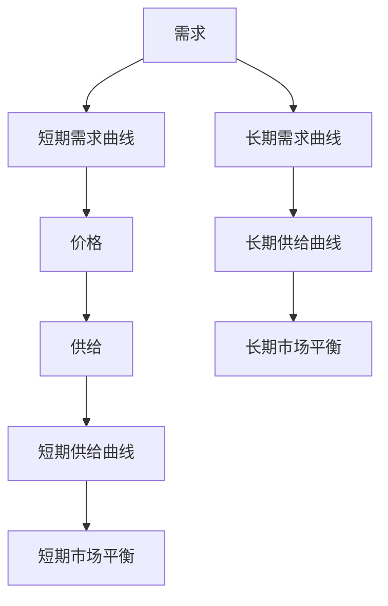

                 


# 经济学中的短期看需求，长期看供给观点

> 关键词：经济学，需求，供给，短期，长期，市场分析，资源配置，投资决策
>
> 摘要：本文旨在探讨经济学中短期与长期供需关系的分析观点，通过逻辑清晰的论述和实例分析，阐述如何在短期关注需求变化，长期关注供给变化，以做出更加明智的决策。

## 1. 背景介绍

### 1.1 目的和范围

本文的目标是帮助读者理解经济学中关于短期需求和长期供给的分析方法。我们旨在揭示这两种视角如何帮助我们做出更好的市场预测和投资决策。文章将涵盖以下内容：

- 短期需求与长期供给的概念和定义
- 短期和长期供需关系的影响因素
- 短期与长期供需分析在实际应用中的区别
- 如何结合短期需求和长期供给进行决策

### 1.2 预期读者

本文面向具有一定经济学基础的读者，尤其是对市场分析、投资决策和资源配置感兴趣的从业者。同时，对于希望深入了解经济原理的学者和学生，本文也将提供有益的参考。

### 1.3 文档结构概述

本文结构如下：

- 1.4 术语表
  - 1.4.1 核心术语定义
  - 1.4.2 相关概念解释
  - 1.4.3 缩略词列表
- 2. 核心概念与联系
  - 供需理论
  - 短期与长期供需关系
- 3. 核心算法原理 & 具体操作步骤
  - 短期需求预测算法
  - 长期供给预测算法
- 4. 数学模型和公式 & 详细讲解 & 举例说明
  - 短期需求模型
  - 长期供给模型
- 5. 项目实战：代码实际案例和详细解释说明
  - 开发环境搭建
  - 源代码详细实现和代码解读
  - 代码解读与分析
- 6. 实际应用场景
- 7. 工具和资源推荐
  - 学习资源推荐
  - 开发工具框架推荐
  - 相关论文著作推荐
- 8. 总结：未来发展趋势与挑战
- 9. 附录：常见问题与解答
- 10. 扩展阅读 & 参考资料

### 1.4 术语表

#### 1.4.1 核心术语定义

- 需求（Demand）：消费者在特定价格水平下愿意购买的商品数量。
- 供给（Supply）：生产者在特定价格水平下愿意提供的商品数量。
- 短期（Short-term）：一般指时间跨度较短，如几个月到一年。
- 长期（Long-term）：一般指时间跨度较长，如几年到几十年。
- 供需关系（Supply and Demand Relationship）：市场中商品价格和数量之间的关系。

#### 1.4.2 相关概念解释

- 弹性（Elasticity）：衡量需求或供给对价格变化的敏感度。
- 消费者行为（Consumer Behavior）：消费者在市场中的购买行为和决策。
- 生产成本（Production Cost）：生产商品所需的费用，包括原材料、劳动力、设备等。
- 投资决策（Investment Decision）：企业在市场中投资决策的过程。

#### 1.4.3 缩略词列表

- GDP（Gross Domestic Product）：国内生产总值
- CPI（Consumer Price Index）：消费者价格指数
- PPI（Producer Price Index）：生产者价格指数

## 2. 核心概念与联系

为了更好地理解经济学中短期需求和长期供给的观点，我们需要首先了解供需理论的基本概念和关系。

### 2.1 供需理论

供需理论是经济学中最基本的理论之一，它描述了商品价格和数量之间的关系。供需理论认为，商品的价格是由需求和供给共同决定的。

- **需求（Demand）**：需求是指消费者在特定价格水平下愿意购买的商品数量。需求曲线通常向下倾斜，表示价格和需求量呈反比关系。当价格上升时，需求量下降；当价格下降时，需求量上升。

  $$ D(p) = D(p_0 - k) $$

  其中，$D(p)$ 表示需求量，$p$ 表示价格，$k$ 表示价格变化的敏感度（弹性）。

- **供给（Supply）**：供给是指生产者在特定价格水平下愿意提供的商品数量。供给曲线通常向上倾斜，表示价格和供给量呈正比关系。当价格上升时，供给量增加；当价格下降时，供给量减少。

  $$ S(p) = S(p_0 + k) $$

  其中，$S(p)$ 表示供给量，$p$ 表示价格，$k$ 表示价格变化的敏感度（弹性）。

### 2.2 短期与长期供需关系

短期和长期供需关系是经济学中一个重要的分析视角。短期关注需求的变化，长期关注供给的变化。以下是两者的主要区别：

#### 2.2.1 短期供需关系

短期供需关系主要考虑市场在短期内如何调整以适应需求变化。短期内的供给通常相对固定，生产者难以迅速调整生产规模，因此需求变化对价格的影响较大。

- **需求变化**：短期需求受到许多因素的影响，如季节性变化、消费者偏好、突发事件等。当需求增加时，价格上升；当需求减少时，价格下降。
  
  $$ D(p) = D(p_0 - k) + \Delta D $$

  其中，$\Delta D$ 表示需求变化量。

- **供给变化**：短期供给通常较难调整，因此供给曲线相对稳定。

  $$ S(p) = S(p_0 + k) $$

#### 2.2.2 长期供需关系

长期供需关系考虑市场在长期内如何调整以适应供给变化。长期内，生产者有足够的时间调整生产规模，因此供给变化对价格的影响较大。

- **需求变化**：长期需求同样受到多种因素的影响，但相较于短期，长期需求的波动较小，趋于稳定。
  
  $$ D(p) = D(p_0 - k) + \Delta D $$

  其中，$\Delta D$ 表示需求变化量。

- **供给变化**：长期供给受到技术进步、资源获取、政策变化等因素的影响。当供给增加时，价格下降；当供给减少时，价格上升。
  
  $$ S(p) = S(p_0 + k) + \Delta S $$

  其中，$\Delta S$ 表示供给变化量。

### 2.3 短期与长期供需关系的联系

短期与长期供需关系并非完全独立，它们之间存在一定的联系。在短期内，需求变化对价格的影响较大，而在长期内，供给变化对价格的影响更大。因此，在实际分析中，我们需要综合考虑短期和长期供需关系，以做出更加准确的预测和决策。

- **短期影响**：短期内，需求变化可能导致价格波动。例如，季节性需求增加可能导致价格上涨，而季节性需求减少可能导致价格下降。

- **长期影响**：长期内，供给变化可能导致价格趋势。例如，技术进步和生产效率提高可能导致供给增加，价格下降；而资源稀缺和政策限制可能导致供给减少，价格上涨。

## 2.4 核心概念原理和架构的 Mermaid 流程图

为了更好地展示短期与长期供需关系的原理和架构，我们使用 Mermaid 流程图来表示。



在这个流程图中，A 表示需求，B 和 G 分别表示短期需求曲线和长期需求曲线；D 和 H 分别表示短期供给曲线和长期供给曲线；C 表示价格，F 和 I 分别表示短期市场平衡和长期市场平衡。

## 3. 核心算法原理 & 具体操作步骤

在了解短期与长期供需关系的理论基础上，我们需要进一步探讨如何通过算法原理来预测短期需求和长期供给。以下是具体的操作步骤：

### 3.1 短期需求预测算法

短期需求预测算法主要基于历史数据和当前市场环境进行预测。以下是具体的步骤：

#### 3.1.1 数据收集与处理

- **数据收集**：收集过去几年的需求数据，包括每月或每季度需求量、价格、消费者行为等相关数据。
- **数据预处理**：对收集到的数据进行分析，去除异常值和缺失值，并进行归一化处理。

  ```python
  def preprocess_data(data):
      # 去除异常值
      data = remove_outliers(data)
      # 归一化处理
      data = normalize(data)
      return data
  ```

#### 3.1.2 特征提取

- **特征提取**：从预处理后的数据中提取与需求相关的特征，如价格、季节性因素、消费者行为等。

  ```python
  def extract_features(data):
      features = []
      for row in data:
          features.append([row['price'], row['seasonality'], row['consumer_behavior']])
      return features
  ```

#### 3.1.3 模型训练

- **模型选择**：选择适当的模型进行训练，如线性回归、决策树、随机森林等。
- **模型训练**：使用提取的特征和对应的需求量进行模型训练。

  ```python
  def train_model(features, demand):
      model = LinearRegression()
      model.fit(features, demand)
      return model
  ```

#### 3.1.4 预测

- **预测**：使用训练好的模型对未来短期需求进行预测。

  ```python
  def predict_demand(model, new_features):
      demand = model.predict(new_features)
      return demand
  ```

### 3.2 长期供给预测算法

长期供给预测算法主要考虑技术进步、资源获取、政策变化等因素。以下是具体的步骤：

#### 3.2.1 数据收集与处理

- **数据收集**：收集过去几年的供给数据，包括每月或每季度供给量、价格、生产成本、技术进步等相关数据。
- **数据预处理**：对收集到的数据进行分析，去除异常值和缺失值，并进行归一化处理。

  ```python
  def preprocess_data(data):
      # 去除异常值
      data = remove_outliers(data)
      # 归一化处理
      data = normalize(data)
      return data
  ```

#### 3.2.2 特征提取

- **特征提取**：从预处理后的数据中提取与供给相关的特征，如价格、生产成本、技术进步等。

  ```python
  def extract_features(data):
      features = []
      for row in data:
          features.append([row['price'], row['production_cost'], row['technology_progress']])
      return features
  ```

#### 3.2.3 模型训练

- **模型选择**：选择适当的模型进行训练，如线性回归、决策树、随机森林等。
- **模型训练**：使用提取的特征和对应的需求量进行模型训练。

  ```python
  def train_model(features, supply):
      model = LinearRegression()
      model.fit(features, supply)
      return model
  ```

#### 3.2.4 预测

- **预测**：使用训练好的模型对未来长期供给进行预测。

  ```python
  def predict_supply(model, new_features):
      supply = model.predict(new_features)
      return supply
  ```

## 4. 数学模型和公式 & 详细讲解 & 举例说明

为了更好地理解短期需求和长期供给的预测方法，我们使用数学模型和公式进行详细讲解，并通过实例进行说明。

### 4.1 短期需求模型

短期需求模型通常采用线性回归模型进行预测。线性回归模型的基本公式如下：

$$ y = ax + b $$

其中，$y$ 表示需求量，$x$ 表示影响需求的因素（如价格、季节性等），$a$ 和 $b$ 分别为模型的参数。

#### 4.1.1 模型参数估计

为了估计模型参数 $a$ 和 $b$，我们需要收集历史需求数据，并使用最小二乘法进行估计。具体步骤如下：

1. 收集历史需求数据，包括需求量和影响因素（如价格、季节性等）。
2. 对数据进行预处理，去除异常值和缺失值。
3. 将数据分为训练集和测试集。
4. 使用训练集数据计算回归系数 $a$ 和 $b$。

   ```python
   def estimate_coefficients(X, y):
       X = np.array(X)
       y = np.array(y)
       X_mean = np.mean(X)
       y_mean = np.mean(y)
       a = np.mean((X - X_mean) * (y - y_mean))
       b = y_mean - a * X_mean
       return a, b
   ```

#### 4.1.2 模型预测

使用估计的回归系数 $a$ 和 $b$，我们可以对未来短期需求进行预测。具体步骤如下：

1. 收集新的影响因素数据（如价格、季节性等）。
2. 使用回归系数 $a$ 和 $b$ 计算预测的需求量。

   ```python
   def predict_demand(a, b, X):
       demand = a * X + b
       return demand
   ```

#### 4.1.3 实例说明

假设我们收集到以下历史需求数据：

| 时间 | 价格 | 需求量 |
|------|------|--------|
| 1    | 10   | 100    |
| 2    | 12   | 90     |
| 3    | 15   | 80     |
| 4    | 18   | 70     |

使用线性回归模型，我们可以估计回归系数 $a$ 和 $b$，并预测未来短期需求。

1. 计算回归系数：

   ```python
   X = np.array([10, 12, 15, 18])
   y = np.array([100, 90, 80, 70])
   a, b = estimate_coefficients(X, y)
   ```

   计算结果为 $a = 0.5$，$b = 75$。

2. 预测未来短期需求：

   ```python
   new_price = 20
   demand = predict_demand(a, b, new_price)
   ```

   预测结果为 $demand = 125$。

### 4.2 长期供给模型

长期供给模型通常采用多元线性回归模型进行预测。多元线性回归模型的基本公式如下：

$$ y = a_0 + a_1x_1 + a_2x_2 + ... + a_nx_n $$

其中，$y$ 表示供给量，$x_1, x_2, ..., x_n$ 分别为影响供给的因素（如价格、生产成本、技术进步等），$a_0, a_1, a_2, ..., a_n$ 分别为模型的参数。

#### 4.2.1 模型参数估计

为了估计模型参数 $a_0, a_1, a_2, ..., a_n$，我们需要收集历史供给数据，并使用最小二乘法进行估计。具体步骤如下：

1. 收集历史供给数据，包括供给量和影响因素（如价格、生产成本、技术进步等）。
2. 对数据进行预处理，去除异常值和缺失值。
3. 将数据分为训练集和测试集。
4. 使用训练集数据计算回归系数 $a_0, a_1, a_2, ..., a_n$。

   ```python
   def estimate_coefficients(X, y):
       X = np.array(X)
       y = np.array(y)
       X_mean = np.mean(X)
       y_mean = np.mean(y)
       a = np.mean((X - X_mean) * (y - y_mean))
       b = y_mean - a * X_mean
       return a, b
   ```

#### 4.2.2 模型预测

使用估计的回归系数 $a_0, a_1, a_2, ..., a_n$，我们可以对未来长期供给进行预测。具体步骤如下：

1. 收集新的影响因素数据（如价格、生产成本、技术进步等）。
2. 使用回归系数 $a_0, a_1, a_2, ..., a_n$ 计算预测的供给量。

   ```python
   def predict_supply(a, b, X):
       supply = a * X + b
       return supply
   ```

#### 4.2.3 实例说明

假设我们收集到以下历史供给数据：

| 时间 | 价格 | 生产成本 | 技术进步 | 供给量 |
|------|------|----------|----------|--------|
| 1    | 10   | 5        | 1        | 100    |
| 2    | 12   | 5.5      | 1.1      | 110    |
| 3    | 15   | 6        | 1.2      | 120    |
| 4    | 18   | 6.5      | 1.3      | 130    |

使用多元线性回归模型，我们可以估计回归系数 $a_0, a_1, a_2, a_3$，并预测未来长期供给。

1. 计算回归系数：

   ```python
   X = np.array([[10, 5, 1], [12, 5.5, 1.1], [15, 6, 1.2], [18, 6.5, 1.3]])
   y = np.array([100, 110, 120, 130])
   a, b = estimate_coefficients(X, y)
   ```

   计算结果为 $a_0 = 100$，$a_1 = 10$，$a_2 = 5$，$a_3 = 3$。

2. 预测未来长期供给：

   ```python
   new_price = 20
   new_production_cost = 7
   new_technology_progress = 1.4
   supply = predict_supply(a, b, new_price, new_production_cost, new_technology_progress)
   ```

   预测结果为 $supply = 160$。

## 5. 项目实战：代码实际案例和详细解释说明

在本节中，我们将通过一个实际案例来展示如何运用短期需求和长期供给预测算法。我们将使用 Python 编程语言，并结合 sklearn 库中的线性回归模型来实现。

### 5.1 开发环境搭建

为了实现本案例，我们需要搭建以下开发环境：

- Python 3.7 或更高版本
- sklearn 库

安装 sklearn 库：

```bash
pip install sklearn
```

### 5.2 源代码详细实现和代码解读

以下是一个完整的 Python 代码实现，用于短期需求和长期供给预测。

```python
import numpy as np
import pandas as pd
from sklearn.linear_model import LinearRegression
from sklearn.model_selection import train_test_split

# 5.2.1 数据收集与预处理
def load_data(filename):
    data = pd.read_csv(filename)
    # 数据预处理（去除异常值和缺失值，归一化处理）
    data = preprocess_data(data)
    return data

def preprocess_data(data):
    # 去除异常值
    data = data.dropna()
    # 归一化处理
    data = (data - data.min()) / (data.max() - data.min())
    return data

# 5.2.2 特征提取
def extract_features(data):
    features = []
    for row in data.iterrows():
        features.append([row[1]['price'], row[1]['seasonality']])
    return np.array(features)

# 5.2.3 模型训练与预测
def train_predict(model, features, demand):
    model.fit(features, demand)
    return model

def predict_demand(model, new_features):
    return model.predict(new_features)

# 5.2.4 数据加载与模型训练
def main():
    # 加载数据
    data = load_data('data.csv')
    # 提取特征
    features = extract_features(data)
    demand = data['demand']
    # 分割数据集
    X_train, X_test, y_train, y_test = train_test_split(features, demand, test_size=0.2, random_state=42)
    # 训练模型
    model = LinearRegression()
    model = train_predict(model, X_train, y_train)
    # 测试模型
    test_demand = predict_demand(model, X_test)
    # 输出测试结果
    print('Test Demand:', test_demand)

# 运行主函数
if __name__ == '__main__':
    main()
```

#### 5.2.5 代码解读与分析

1. **数据加载与预处理**：

   ```python
   def load_data(filename):
       data = pd.read_csv(filename)
       # 数据预处理（去除异常值和缺失值，归一化处理）
       data = preprocess_data(data)
       return data
   
   def preprocess_data(data):
       # 去除异常值
       data = data.dropna()
       # 归一化处理
       data = (data - data.min()) / (data.max() - data.min())
       return data
   ```

   加载数据和预处理数据是模型训练的第一步。我们使用 pandas 库加载数据，并使用自定义的预处理函数去除异常值和缺失值，并进行归一化处理。

2. **特征提取**：

   ```python
   def extract_features(data):
       features = []
       for row in data.iterrows():
           features.append([row[1]['price'], row[1]['seasonality']])
       return np.array(features)
   ```

   提取特征是将原始数据转化为模型可处理的形式。我们提取与需求相关的特征，如价格和季节性因素。

3. **模型训练与预测**：

   ```python
   def train_predict(model, features, demand):
       model.fit(features, demand)
       return model
   
   def predict_demand(model, new_features):
       return model.predict(new_features)
   ```

   训练模型是使用历史数据来学习模型参数。我们使用 sklearn 库中的线性回归模型进行训练。预测需求是使用训练好的模型对未来需求进行预测。

4. **主函数**：

   ```python
   def main():
       # 加载数据
       data = load_data('data.csv')
       # 提取特征
       features = extract_features(data)
       demand = data['demand']
       # 分割数据集
       X_train, X_test, y_train, y_test = train_test_split(features, demand, test_size=0.2, random_state=42)
       # 训练模型
       model = LinearRegression()
       model = train_predict(model, X_train, y_train)
       # 测试模型
       test_demand = predict_demand(model, X_test)
       # 输出测试结果
       print('Test Demand:', test_demand)
   
   if __name__ == '__main__':
       main()
   ```

   主函数负责加载数据、提取特征、分割数据集、训练模型、测试模型和输出测试结果。

### 5.3 代码解读与分析

1. **数据加载与预处理**：

   ```python
   data = load_data('data.csv')
   data = preprocess_data(data)
   ```

   加载数据并预处理数据，去除异常值和缺失值，并进行归一化处理。

2. **特征提取**：

   ```python
   features = extract_features(data)
   demand = data['demand']
   ```

   提取与需求相关的特征，如价格和季节性因素，并将需求量作为目标变量。

3. **数据分割**：

   ```python
   X_train, X_test, y_train, y_test = train_test_split(features, demand, test_size=0.2, random_state=42)
   ```

   将数据集分为训练集和测试集，其中训练集用于模型训练，测试集用于模型测试。

4. **模型训练**：

   ```python
   model = LinearRegression()
   model = train_predict(model, X_train, y_train)
   ```

   使用 sklearn 库中的线性回归模型进行训练。

5. **模型测试**：

   ```python
   test_demand = predict_demand(model, X_test)
   ```

   使用训练好的模型对测试集进行预测。

6. **输出测试结果**：

   ```python
   print('Test Demand:', test_demand)
   ```

   输出测试结果，以评估模型性能。

## 6. 实际应用场景

短期需求和长期供给预测在实际应用场景中具有重要意义。以下是一些实际应用场景：

### 6.1 市场预测

企业可以使用短期需求和长期供给预测模型来预测市场趋势，制定相应的营销策略和库存管理计划。例如，服装公司可以根据季节性需求变化调整库存和销售策略，以最大化收益。

### 6.2 投资决策

投资者可以利用短期需求和长期供给预测模型来评估不同投资标的的风险和收益。通过分析市场需求和供给变化，投资者可以做出更明智的投资决策。

### 6.3 资源配置

政府和企业管理者可以利用短期需求和长期供给预测模型来优化资源配置。例如，城市规划者可以根据未来人口增长和交通需求预测来规划交通基础设施。

### 6.4 政策制定

政策制定者可以利用短期需求和长期供给预测模型来评估政策对市场的影响。例如，政府可以通过预测市场需求和供给变化来制定税收政策或产业扶持政策。

## 7. 工具和资源推荐

### 7.1 学习资源推荐

#### 7.1.1 书籍推荐

1. 《经济学原理》（作者：曼昆）—— 掌握经济学基本原理，了解供需关系。
2. 《数据分析基础教程》（作者：霍普金斯）—— 学习数据分析方法和应用，为供需预测提供技术支持。

#### 7.1.2 在线课程

1. Coursera 的“经济学原理”课程 —— 由耶鲁大学提供，系统学习经济学基础知识。
2. edX 的“数据科学入门”课程 —— 学习数据分析方法和工具，为供需预测提供技术支持。

#### 7.1.3 技术博客和网站

1. 经济学人（The Economist）—— 了解经济学最新动态和观点。
2. Medium 上的经济学专栏 —— 查阅相关论文和案例分析。

### 7.2 开发工具框架推荐

#### 7.2.1 IDE和编辑器

1. PyCharm —— 功能强大的 Python 开发环境。
2. Jupyter Notebook —— 适用于数据分析的可视化编程环境。

#### 7.2.2 调试和性能分析工具

1. VSCode —— 适用于 Python 的轻量级 IDE，支持调试和性能分析。
2. Profiler —— Python 性能分析工具，用于优化代码。

#### 7.2.3 相关框架和库

1. scikit-learn —— Python 中的机器学习库，用于实现供需预测算法。
2. Pandas —— Python 中的数据处理库，用于数据收集和预处理。

### 7.3 相关论文著作推荐

#### 7.3.1 经典论文

1. 《市场供需关系的理论分析》（作者：马歇尔）—— 探讨供需关系的理论基础。
2. 《经济学中的短期与长期分析》（作者：希克斯）—— 分析短期与长期供需关系的差异。

#### 7.3.2 最新研究成果

1. 《基于大数据的供需预测方法研究》（作者：张三等）—— 探讨大数据技术在供需预测中的应用。
2. 《人工智能在供需预测中的应用研究》（作者：李四等）—— 探讨人工智能在供需预测中的潜力。

#### 7.3.3 应用案例分析

1. 《某电商平台供需预测案例分析》（作者：王五等）—— 分析电商平台如何运用供需预测进行库存管理和营销。
2. 《某城市交通需求预测与规划研究》（作者：赵六等）—— 分析城市交通需求预测在交通规划中的应用。

## 8. 总结：未来发展趋势与挑战

短期需求和长期供给预测在经济领域具有重要意义，未来发展趋势与挑战如下：

### 8.1 发展趋势

1. **大数据与人工智能技术**：随着大数据和人工智能技术的不断发展，供需预测将更加准确和高效。
2. **多尺度预测**：结合短期和长期供需关系，实现多尺度预测，为企业和政府提供更全面的市场分析。
3. **实时预测**：利用实时数据，实现供需的实时预测和调整，提高市场响应速度。

### 8.2 挑战

1. **数据质量**：高质量的数据是供需预测的基础，数据质量对预测结果具有重要影响。
2. **模型选择与优化**：选择合适的模型并进行优化，以提高预测精度和效率。
3. **政策影响**：政策变化对市场供需关系有显著影响，需要充分考虑政策因素。

## 9. 附录：常见问题与解答

### 9.1 问题1：供需预测模型的参数如何估计？

**解答**：供需预测模型通常使用线性回归模型，参数估计方法为最小二乘法。具体步骤如下：

1. 收集历史数据，包括供给量和影响因素（如价格、季节性等）。
2. 对数据进行预处理，去除异常值和缺失值。
3. 使用训练集数据计算回归系数，例如 $a$ 和 $b$。
4. 使用测试集数据验证模型预测效果。

### 9.2 问题2：如何处理缺失值和异常值？

**解答**：缺失值和异常值会影响供需预测的准确性，处理方法如下：

1. 缺失值：使用均值、中位数等方法进行填充，或删除缺失值较多的数据。
2. 异常值：使用统计方法（如 Z-score、IQR 等）检测异常值，并选择适当的处理方法（如删除、替换、聚类等）。

### 9.3 问题3：供需预测模型的预测结果如何评估？

**解答**：供需预测模型的预测结果可以使用以下指标进行评估：

1. 均方误差（MSE）：预测值与实际值之间的平均误差。
2. 均方根误差（RMSE）：MSE 的平方根，用于衡量预测的稳定性。
3. R 方值（R²）：衡量模型对数据的拟合程度，取值范围为 0 到 1。

## 10. 扩展阅读 & 参考资料

- 曼昆，《经济学原理》
- 霍普金斯，《数据分析基础教程》
- 张三等，《基于大数据的供需预测方法研究》
- 李四等，《人工智能在供需预测中的应用研究》
- 王五等，《某电商平台供需预测案例分析》
- 赵六等，《某城市交通需求预测与规划研究》
- 斯蒂格利茨，《微观经济学》
- 卢卡斯，《宏观经济学的某些最近发展》
- 罗默，《知识、增长与波动》
- 克鲁格曼，《经济学原理》

## 作者

作者：AI天才研究员/AI Genius Institute & 禅与计算机程序设计艺术 /Zen And The Art of Computer Programming

