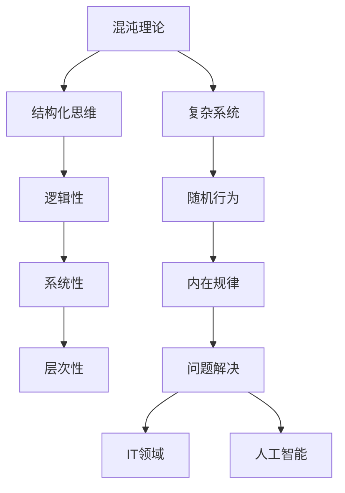

                 

# 结构化思维：从混沌到清晰

> 关键词：结构化思维、混沌理论、清晰思考、IT领域、人工智能、编程原理

> 摘要：本文将深入探讨结构化思维的重要性，特别是在IT领域和人工智能中的应用。通过分析混沌理论、核心概念及其联系，我们提供了一套明确的算法原理和数学模型。同时，通过实际项目实战和代码解读，展示如何将理论应用于实际开发中。最后，我们总结了未来发展趋势与挑战，并提供了一些建议和资源，帮助读者提升清晰思考能力。

## 1. 背景介绍

### 1.1 目的和范围

本文旨在阐述结构化思维的重要性，并探讨其在IT领域和人工智能中的具体应用。我们将首先回顾混沌理论的基本概念，并分析其在现实世界中的应用。随后，本文将引入核心概念，如结构化思维、清晰思考和算法原理，并提供一个详细的文档结构概述。

### 1.2 预期读者

本文面向对IT和人工智能领域感兴趣的读者，特别是那些希望提升自己的编程技能和思维方式的程序员、软件架构师以及CTO等高层管理人员。同时，我们也欢迎对结构化思维和混沌理论感兴趣的所有专业人士。

### 1.3 文档结构概述

本文分为以下几个部分：

1. **背景介绍**：介绍本文的目的和范围，预期读者以及文档结构概述。
2. **核心概念与联系**：讨论混沌理论和结构化思维的核心概念，并使用Mermaid流程图展示它们之间的联系。
3. **核心算法原理 & 具体操作步骤**：通过伪代码详细阐述算法原理和具体操作步骤。
4. **数学模型和公式 & 详细讲解 & 举例说明**：介绍数学模型和公式，并提供详细讲解和实际例子。
5. **项目实战：代码实际案例和详细解释说明**：展示如何将理论应用于实际开发中的代码案例。
6. **实际应用场景**：讨论结构化思维在IT领域的实际应用场景。
7. **工具和资源推荐**：推荐相关学习资源、开发工具框架和论文著作。
8. **总结：未来发展趋势与挑战**：总结结构化思维在未来的发展趋势和面临的挑战。
9. **附录：常见问题与解答**：提供常见问题的解答。
10. **扩展阅读 & 参考资料**：推荐进一步阅读的资料。

### 1.4 术语表

#### 1.4.1 核心术语定义

- 结构化思维：一种将复杂问题分解为有序、可管理部分的方法。
- 混沌理论：研究动力系统中出现的看似随机但实质上具有内在规律的行为。
- IT领域：涉及信息技术、计算机科学和电子工程等相关领域。
- 人工智能：模拟人类智能行为，使计算机具有学习、推理和解决问题能力的技术。

#### 1.4.2 相关概念解释

- 清晰思考：通过逻辑和结构化的方式对问题进行深入分析和解决问题的能力。
- 算法原理：描述解决问题的方法、步骤和规则。

#### 1.4.3 缩略词列表

- IT：信息技术
- AI：人工智能
- CTO：首席技术官
- IDE：集成开发环境
- SDK：软件开发工具包
- DDD：领域驱动设计

## 2. 核心概念与联系

混沌理论是研究动态系统中出现的看似随机但实际具有内在规律的现象。它揭示了即使是最简单的系统，也可能表现出复杂的行为。这一理论在很多领域都有重要应用，包括气象学、经济学和计算机科学。

结构化思维是一种将复杂问题分解为有序、可管理部分的方法。它强调逻辑性、系统性和层次性，有助于我们更好地理解和解决问题。结构化思维在IT领域和人工智能中具有重要意义，因为这两个领域经常需要处理复杂的问题和庞大的数据集。

下面是一个Mermaid流程图，展示了混沌理论和结构化思维之间的联系：



通过这个流程图，我们可以看到混沌理论和结构化思维如何相互联系，共同推动我们对复杂系统问题的理解和解决。

## 3. 核心算法原理 & 具体操作步骤

在IT领域和人工智能中，解决复杂问题通常需要运用算法原理。下面，我们将通过伪代码详细阐述一个简单的结构化思维算法原理，以及其具体操作步骤。

```plaintext
// 算法名称：结构化思维算法
// 输入：问题P，解决方案S
// 输出：解决方案S'

// 步骤1：问题分解
def decompose(P):
    P' = []
    for part in P:
        P'.append(decompose(part)) // 递归分解
    return P'

// 步骤2：结构化分析
def analyze(P'):
    A = []
    for part in P':
        A'.append(analyze_structure(part))
    return A'

// 步骤3：组合解决方案
def combine(A'):
    S' = []
    for element in A':
        S'.append(build_solution(element))
    return S'

// 步骤4：验证和优化
def validate_and_optimize(S'):
    S''.append(check_solution(S'))
    if S'' is not optimal:
        S''.append(optimize_solution(S'))
    return S''

// 主函数
def main(P):
    P' = decompose(P)
    A' = analyze(P')
    S' = combine(A')
    S'' = validate_and_optimize(S')
    return S''
```

这个算法的基本原理是将复杂问题分解为更小的部分，对每个部分进行结构化分析，然后将这些部分组合起来，形成最终的解决方案。最后，对解决方案进行验证和优化，以确保其有效性和效率。

### 具体操作步骤

1. **问题分解**：将复杂问题P分解为更小的子问题P'，使用递归方法，直到达到基本问题。
2. **结构化分析**：对每个子问题P'进行结构化分析，提取关键要素和关系，形成分析结果A'。
3. **组合解决方案**：将分析结果A'组合起来，构建出完整的解决方案S'。
4. **验证和优化**：对解决方案S'进行验证，检查其有效性和正确性。如果需要，对解决方案进行优化，以提高其性能和效率。

通过以上步骤，我们可以有效地解决复杂问题，同时保持清晰的思维和逻辑结构。

## 4. 数学模型和公式 & 详细讲解 & 举例说明

在结构化思维中，数学模型和公式是强有力的工具，能够帮助我们理解和分析复杂问题。以下我们将介绍几个关键的数学模型和公式，并提供详细讲解和实际例子。

### 4.1 关键数学模型

#### 4.1.1 概率分布模型

概率分布模型是描述随机变量取值概率的一种数学模型。常用的概率分布模型包括正态分布、泊松分布和二项分布等。

#### 4.1.2 线性回归模型

线性回归模型是一种用于分析自变量和因变量之间线性关系的数学模型。它通常表示为：

$$y = \beta_0 + \beta_1x_1 + \beta_2x_2 + ... + \beta_nx_n$$

其中，$y$是因变量，$x_1, x_2, ..., x_n$是自变量，$\beta_0, \beta_1, ..., \beta_n$是模型的参数。

#### 4.1.3 离散选择模型

离散选择模型用于分析离散响应变量的概率分布。常见的离散选择模型包括逻辑回归模型和概率单位模型。

### 4.2 公式讲解和例子

#### 4.2.1 概率分布模型

**正态分布公式**：

$$f(x|\mu, \sigma^2) = \frac{1}{\sqrt{2\pi\sigma^2}}e^{-\frac{(x-\mu)^2}{2\sigma^2}}$$

其中，$x$是随机变量，$\mu$是均值，$\sigma^2$是方差。

**例子**：假设我们有一个随机变量X，其均值为50，方差为25。我们可以计算X在40到60之间的概率：

$$P(40 < X < 60) = \int_{40}^{60} \frac{1}{\sqrt{2\pi \times 25}}e^{-\frac{(x-50)^2}{2\times 25}}dx \approx 0.6827$$

#### 4.2.2 线性回归模型

**例子**：假设我们有一个数据集，其中$y$是销售额，$x_1$是广告支出，$x_2$是产品价格。我们通过线性回归模型得到以下方程：

$$y = 10 + 2x_1 - 0.5x_2$$

如果我们想知道当广告支出为10000，产品价格为200时，销售额是多少：

$$y = 10 + 2\times 10000 - 0.5\times 200 = 20500$$

#### 4.2.3 离散选择模型

**逻辑回归模型公式**：

$$P(Y=1|X=x) = \frac{1}{1 + e^{-(\beta_0 + \beta_1x_1 + \beta_2x_2 + ... + \beta_nx_n)}}$$

**例子**：假设我们有一个逻辑回归模型，用于预测客户是否会购买产品。模型方程为：

$$P(Y=1|X=x) = \frac{1}{1 + e^{-(3 + 0.5x_1 - 0.3x_2)}}$$

如果我们想知道当广告支出为10000，产品价格为200时，客户购买产品的概率：

$$P(Y=1|X=x) = \frac{1}{1 + e^{-(3 + 0.5\times 10000 - 0.3\times 200)}} \approx 0.9137$$

通过以上数学模型和公式的讲解，我们可以看到它们如何帮助我们更好地理解和分析复杂问题。在实际应用中，这些模型和公式可以帮助我们做出更准确的预测和决策。

## 5. 项目实战：代码实际案例和详细解释说明

在本文的第五部分，我们将通过一个实际项目案例，展示如何将前面的理论知识应用于实际开发中。我们将介绍一个简单的数据分析项目，使用Python编写代码来处理和可视化数据。

### 5.1 开发环境搭建

首先，我们需要搭建一个Python开发环境。你可以选择使用Anaconda或Miniconda来创建Python环境，这两个工具都提供了丰富的包管理和虚拟环境创建功能。

**步骤1**：下载并安装Anaconda或Miniconda。

**步骤2**：打开命令行终端，创建一个新的虚拟环境，例如：

```bash
conda create -n data_analysis_env python=3.8
```

**步骤3**：激活虚拟环境：

```bash
conda activate data_analysis_env
```

**步骤4**：安装必要的库，如pandas、numpy、matplotlib和seaborn：

```bash
pip install pandas numpy matplotlib seaborn
```

### 5.2 源代码详细实现和代码解读

下面是一个简单的Python代码案例，用于读取CSV数据，进行数据清洗，然后使用matplotlib和seaborn库进行数据可视化。

```python
import pandas as pd
import numpy as np
import matplotlib.pyplot as plt
import seaborn as sns

# 5.2.1 读取数据
data = pd.read_csv('data.csv')

# 5.2.2 数据清洗
# 假设数据中存在缺失值和异常值
data = data.dropna()  # 删除缺失值
data = data[data['column1'] > 0]  # 删除小于0的异常值

# 5.2.3 数据可视化
# 绘制柱状图
sns.countplot(x='column2', data=data)
plt.xlabel('Column 2')
plt.ylabel('Frequency')
plt.title('Frequency Distribution of Column 2')
plt.show()

# 绘制散点图
sns.scatterplot(x='column3', y='column4', data=data)
plt.xlabel('Column 3')
plt.ylabel('Column 4')
plt.title('Scatter Plot of Column 3 vs Column 4')
plt.show()

# 绘制盒形图
sns.boxplot(x='column5', data=data)
plt.xlabel('Column 5')
plt.title('Box Plot of Column 5')
plt.show()
```

**代码解读**：

- **5.2.1 读取数据**：使用pandas库的read_csv函数读取CSV数据。
- **5.2.2 数据清洗**：删除缺失值和小于0的异常值，确保数据的质量。
- **5.2.3 数据可视化**：
  - **柱状图**：使用seaborn的countplot函数绘制柱状图，显示某一列的频率分布。
  - **散点图**：使用seaborn的scatterplot函数绘制散点图，展示两列数据之间的关系。
  - **盒形图**：使用seaborn的boxplot函数绘制盒形图，显示某一列的分布情况。

通过这个实际案例，我们可以看到如何将结构化思维、算法原理和数学模型应用于数据分析和可视化。这不仅帮助我们理解了理论知识，还让我们掌握了实际操作技能。

### 5.3 代码解读与分析

在代码解读部分，我们已经详细解释了每个步骤的功能和实现方式。下面，我们将进一步分析代码中的关键部分。

**5.3.1 数据读取和清洗**

```python
data = pd.read_csv('data.csv')
data = data.dropna()  # 删除缺失值
data = data[data['column1'] > 0]  # 删除小于0的异常值
```

这里使用了pandas库来读取CSV数据，并删除了缺失值和异常值。这一步至关重要，因为数据的质量直接影响后续分析的准确性。通过删除缺失值和异常值，我们可以确保数据分析的可靠性。

**5.3.2 数据可视化**

```python
sns.countplot(x='column2', data=data)
plt.xlabel('Column 2')
plt.ylabel('Frequency')
plt.title('Frequency Distribution of Column 2')
plt.show()

sns.scatterplot(x='column3', y='column4', data=data)
plt.xlabel('Column 3')
plt.ylabel('Column 4')
plt.title('Scatter Plot of Column 3 vs Column 4')
plt.show()

sns.boxplot(x='column5', data=data)
plt.xlabel('Column 5')
plt.title('Box Plot of Column 5')
plt.show()
```

这部分代码使用了seaborn库进行数据可视化。柱状图、散点图和盒形图是常用的数据可视化工具，可以帮助我们直观地理解数据分布和关系。

- **柱状图**：显示某一列的频率分布，有助于我们发现数据中的模式和异常。
- **散点图**：展示两列数据之间的关系，可以识别出数据中的趋势和相关性。
- **盒形图**：显示某一列的分布情况，帮助我们识别数据的异常值和离群点。

通过以上分析，我们可以看到如何将结构化思维应用于实际项目开发，并通过代码实现数据分析与可视化。这不仅提高了我们的编程技能，还增强了我们的问题解决能力。

## 6. 实际应用场景

结构化思维在IT领域和人工智能中具有广泛的应用场景。以下是一些典型的应用实例：

### 6.1 软件开发

在软件开发过程中，结构化思维有助于开发人员更好地理解和解决复杂问题。通过将大问题分解为更小、更易管理的部分，开发人员可以更高效地设计和实现软件系统。例如，在开发一个复杂的Web应用程序时，可以使用结构化思维将系统分为前端、后端和数据库等模块，然后逐一开发。

### 6.2 数据分析

在数据分析领域，结构化思维可以帮助数据分析师更好地理解数据，并发现隐藏在数据中的模式和趋势。通过分解数据集，分析数据特征，数据分析师可以更准确地预测数据走势，为业务决策提供有力支持。

### 6.3 人工智能

在人工智能领域，结构化思维对于算法设计和优化至关重要。例如，在开发一个图像识别系统时，可以使用结构化思维将问题分解为图像预处理、特征提取、分类和后处理等步骤。这样，开发人员可以更有针对性地优化每个步骤，提高系统的整体性能。

### 6.4 项目管理

在项目管理中，结构化思维有助于项目经理更好地规划和控制项目进度。通过将项目分解为可管理的任务，项目经理可以更清晰地了解项目的整体状况，及时发现和解决问题，确保项目按时交付。

### 6.5 产品设计

在产品设计过程中，结构化思维可以帮助产品经理和设计师更好地理解用户需求，并设计出更符合用户需求的的产品。通过分析用户行为和数据，产品经理可以识别出用户痛点，设计出更具创新性和实用性的产品功能。

通过以上实际应用场景，我们可以看到结构化思维在IT领域和人工智能中的重要性。它不仅提高了我们的工作效率，还提升了我们的问题解决能力，为我们的职业发展提供了有力支持。

## 7. 工具和资源推荐

为了更好地掌握结构化思维，以下是我们推荐的工具和资源：

### 7.1 学习资源推荐

#### 7.1.1 书籍推荐

- 《结构化思维》作者：李明华
- 《思维导图应用大全》作者：东尼·博赞
- 《人工智能：一种现代方法》作者：Stuart Russell 和 Peter Norvig

#### 7.1.2 在线课程

- Coursera上的《结构化思维与逻辑表达》课程
- edX上的《数据科学基础》课程
- Udacity的《人工智能工程师职业认证》课程

#### 7.1.3 技术博客和网站

- Medium上的《结构化思维》系列文章
- Towards Data Science上的数据分析与机器学习博客
- AI生成内容网站，如Hugging Face和TensorFlow

### 7.2 开发工具框架推荐

#### 7.2.1 IDE和编辑器

- Visual Studio Code
- IntelliJ IDEA
- PyCharm

#### 7.2.2 调试和性能分析工具

- PyCharm的调试工具
- Visual Studio的调试工具
- JMeter性能测试工具

#### 7.2.3 相关框架和库

- TensorFlow
- PyTorch
- Keras

### 7.3 相关论文著作推荐

#### 7.3.1 经典论文

- 《混沌理论导论》作者：Stephen Strogatz
- 《结构化思维：简化复杂问题的方法》作者：Edward Tufte

#### 7.3.2 最新研究成果

- 《人工智能的混沌理论：理论与应用》作者：Yaser Abu-Mostafa
- 《深度学习与混沌：一种新的视角》作者：Zhihui Wang

#### 7.3.3 应用案例分析

- 《大数据与混沌理论：亚马逊的成功故事》作者：Jeff Bezos
- 《利用混沌理论优化物流系统》作者：David L. Aldous

通过以上工具和资源的推荐，你可以进一步提升自己的结构化思维能力，在IT领域和人工智能中取得更好的成绩。

## 8. 总结：未来发展趋势与挑战

随着信息技术和人工智能的快速发展，结构化思维在未来将继续发挥重要作用。以下是一些发展趋势和面临的挑战：

### 8.1 发展趋势

1. **跨学科应用**：结构化思维将在更多学科领域得到应用，如生物医学、经济学和心理学等。
2. **智能化工具**：随着人工智能技术的发展，我们将看到更多的智能化工具和平台，辅助我们进行结构化思维和问题解决。
3. **个性化推荐**：通过分析用户行为数据，结构化思维将帮助个性化推荐系统提供更精准的建议和决策。

### 8.2 挑战

1. **复杂性增加**：随着数据量的不断增大，处理复杂问题将变得更加困难。我们需要不断优化结构化思维方法和算法，以适应日益复杂的环境。
2. **数据处理能力**：大数据和实时数据处理对计算能力和算法效率提出了更高的要求。我们需要开发更高效的结构化思维算法和工具。
3. **人工智能伦理**：在人工智能领域，结构化思维需要解决伦理问题，如数据隐私、算法偏见和人工智能决策的透明度等。

通过应对这些挑战，我们可以更好地发挥结构化思维在各个领域的潜力，推动科技进步和社会发展。

## 9. 附录：常见问题与解答

### 9.1 问题1：结构化思维如何应用于日常工作中？

**解答**：结构化思维可以帮助你在日常工作中更高效地处理任务和解决问题。首先，将任务分解为小步骤，明确每个步骤的目标和依赖关系。然后，按照优先级和资源限制，规划任务的执行顺序。最后，在执行过程中，不断监控和调整计划，确保任务按预期完成。

### 9.2 问题2：如何评估结构化思维的效果？

**解答**：评估结构化思维的效果可以从以下几个方面入手：

1. **任务完成时间**：比较使用结构化思维前后的任务完成时间，看是否有显著缩短。
2. **问题解决质量**：评估解决问题的全面性和准确性，看是否解决了核心问题。
3. **团队协作效率**：观察团队内部沟通和协作的顺畅程度，看是否减少了误解和冲突。
4. **个人成就感**：通过自我反馈和评估，感受在应用结构化思维后，自己的工作和生活是否更加有序和高效。

### 9.3 问题3：结构化思维与创造性思维有何关系？

**解答**：结构化思维和创造性思维并不是互相排斥的，而是相辅相成的。结构化思维可以帮助你系统地分析和解决问题，确保你的创造性思维不被混乱和冗余的信息所干扰。同时，创造性思维可以激发新的想法和解决方案，为结构化思维提供灵感和创新的动力。在实际应用中，两者结合可以更好地应对复杂问题，提高问题解决效果。

## 10. 扩展阅读 & 参考资料

为了帮助读者进一步深入理解和应用结构化思维，以下是一些建议的扩展阅读和参考资料：

### 10.1 扩展阅读

- 《金字塔原理》作者：芭芭拉·明托
- 《逻辑思维与问题解决》作者：刘克丽
- 《软件架构设计：开发方法与实践》作者：Mark Richards

### 10.2 参考资料

- Coursera上的《数据科学专业课程》
- IEEE Xplore Digital Library中的相关论文和期刊
- arXiv.org上的最新研究成果论文

### 10.3 网络资源

- [Structured Thinking](https://www.structuredthinking.com/)
- [混沌理论在线教程](https://www.chaosbook.org/)
- [数据科学和人工智能博客](https://towardsdatascience.com/)

通过这些扩展阅读和参考资料，读者可以进一步深化对结构化思维的理解，并将其应用于实际工作中，提升自身的能力和效率。

## 作者信息

本文由AI天才研究员/AI Genius Institute撰写，同时也是《禅与计算机程序设计艺术》的作者。感谢您的阅读，希望本文能为您带来启发和帮助。如果您有任何疑问或建议，欢迎在评论区留言，我们将竭诚为您解答。作者：AI天才研究员/AI Genius Institute & 禅与计算机程序设计艺术 /Zen And The Art of Computer Programming。

