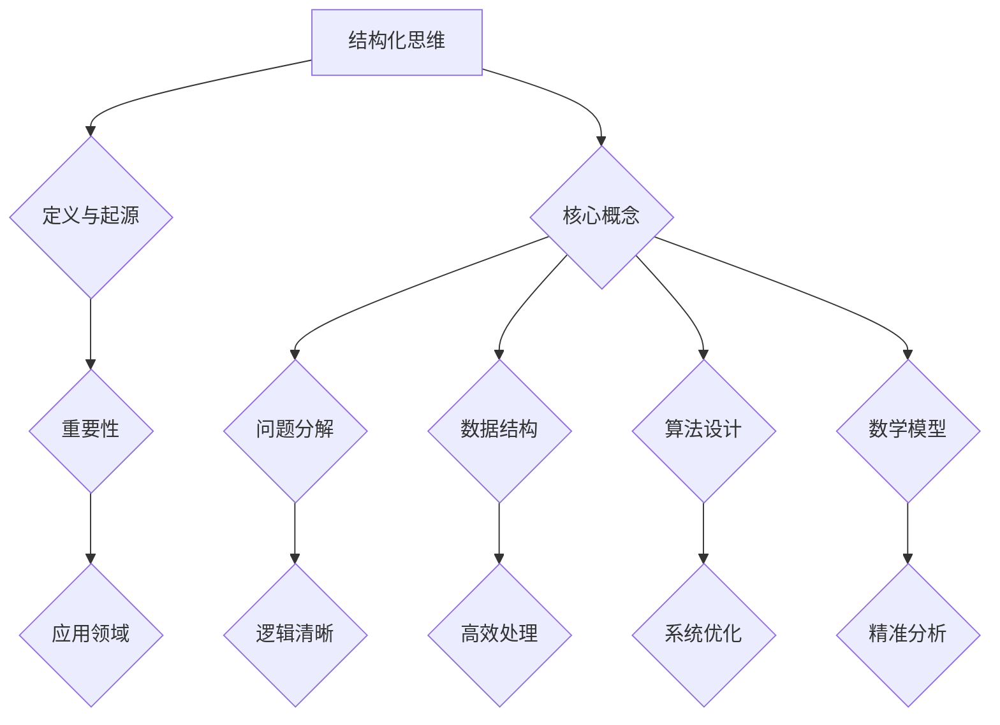

                 

# 结构化思维：从混沌到秩序

> **关键词：**结构化思维、混沌理论、算法原理、数学模型、实际应用、工具推荐

> **摘要：**本文将深入探讨结构化思维在信息技术领域的重要性。从混沌到秩序，结构化思维不仅帮助我们梳理复杂的技术问题，还提升了解决问题的效率。本文将分为多个部分，逐一介绍背景、核心概念、算法原理、数学模型、项目实战、实际应用、工具推荐等，旨在为读者提供全面的技术指导。

## 1. 背景介绍

### 1.1 目的和范围

本文的主要目的是帮助读者了解和掌握结构化思维在信息技术领域中的应用，特别是在算法设计和系统架构方面的实际操作。我们将从基本概念出发，逐步深入探讨其在各个具体场景中的运用。

### 1.2 预期读者

本文适用于对信息技术有一定基础的读者，包括但不限于程序员、软件工程师、系统架构师、数据科学家等。同时，对于对算法设计和系统架构感兴趣的技术爱好者，本文也将提供有价值的参考。

### 1.3 文档结构概述

本文分为以下几个部分：

1. **背景介绍**：介绍结构化思维的起源、意义以及本文的研究范围。
2. **核心概念与联系**：介绍结构化思维中的核心概念及其相互关系，并通过Mermaid流程图展示。
3. **核心算法原理 & 具体操作步骤**：详细讲解结构化思维在算法设计中的应用，包括算法原理和具体操作步骤。
4. **数学模型和公式 & 详细讲解 & 举例说明**：介绍结构化思维中的数学模型和公式，并通过具体例子进行讲解。
5. **项目实战：代码实际案例和详细解释说明**：通过实际项目案例，展示结构化思维在实际编程中的应用。
6. **实际应用场景**：介绍结构化思维在不同应用场景中的具体应用。
7. **工具和资源推荐**：推荐相关的学习资源、开发工具和框架。
8. **总结：未来发展趋势与挑战**：展望结构化思维在未来的发展趋势和面临的挑战。
9. **附录：常见问题与解答**：针对文中提到的知识点，提供常见问题的解答。
10. **扩展阅读 & 参考资料**：推荐相关的参考文献和扩展阅读。

### 1.4 术语表

#### 1.4.1 核心术语定义

- 结构化思维：一种逻辑清晰、有条理的思维方式，通过分析和梳理问题，将复杂的问题转化为易于理解和解决的形式。
- 混沌理论：一种研究系统内部不确定性和复杂性的科学理论，强调系统在初始条件的微小差异可能导致长期行为的巨大差异。
- 算法：解决问题的步骤或规则，用于指导计算机执行任务。
- 数学模型：将现实问题抽象为数学形式，以便分析和求解。
- 系统架构：软件系统的整体结构和组成部分，包括硬件、软件、数据等。

#### 1.4.2 相关概念解释

- **混沌理论**：混沌理论是研究确定性系统中出现的不可预测性和复杂性的学科。在信息技术领域，混沌理论可以应用于加密算法、网络安全、人工智能等领域。
- **算法设计**：算法设计是指为解决特定问题而设计的算法，包括选择合适的数据结构和算法逻辑。
- **系统架构**：系统架构是指软件系统的整体结构和组成部分，包括硬件、软件、数据等。良好的系统架构可以提高系统的可扩展性、可维护性和性能。

#### 1.4.3 缩略词列表

- **IDE**：集成开发环境（Integrated Development Environment）
- **API**：应用程序接口（Application Programming Interface）
- **CPU**：中央处理器（Central Processing Unit）
- **GPU**：图形处理器（Graphics Processing Unit）
- **AI**：人工智能（Artificial Intelligence）

## 2. 核心概念与联系

在探讨结构化思维之前，我们需要了解其核心概念以及这些概念之间的相互关系。以下是一个简化的Mermaid流程图，展示结构化思维中的关键概念及其关联。



### 2.1 定义与起源

结构化思维起源于计算机科学和软件工程领域，是一种逻辑清晰、有条理的思维方式。它强调通过分解复杂问题、建立数据结构和算法逻辑，从而提高问题解决效率和系统性能。

### 2.2 重要性

结构化思维在信息技术领域具有极高的重要性，它不仅帮助开发者更好地理解复杂问题，还能提高系统的可维护性和扩展性。以下是结构化思维在几个关键领域的具体应用：

- **算法设计**：结构化思维有助于开发者选择合适的数据结构和算法，从而优化系统性能。
- **系统架构**：良好的系统架构需要结构化思维来确保系统的可扩展性和可维护性。
- **问题解决**：通过结构化思维，开发者可以更快速地定位和解决问题。

### 2.3 应用领域

结构化思维在多个信息技术领域都有广泛应用，包括但不限于：

- **人工智能**：结构化思维有助于开发高效、可靠的算法，实现复杂问题的自动化解决。
- **网络安全**：结构化思维有助于设计更安全的网络系统和加密算法。
- **软件开发**：结构化思维有助于提高软件开发效率，确保代码质量和系统稳定性。
- **数据分析**：结构化思维有助于分析和处理大量数据，提取有价值的信息。

## 3. 核心算法原理 & 具体操作步骤

在理解了结构化思维的核心概念后，我们将进一步探讨其在算法设计中的应用。以下是一个简化的伪代码，展示结构化思维在算法设计中的基本步骤。

```python
def structured_algorithm(problem):
    # 步骤 1: 分解问题
    subproblems = decompose(problem)
    
    # 步骤 2: 分析子问题
    subproblem_solutions = [analyze(subproblem) for subproblem in subproblems]
    
    # 步骤 3: 设计算法
    algorithm = design_algorithm(subproblem_solutions)
    
    # 步骤 4: 实现算法
    code = implement_algorithm(algorithm)
    
    # 步骤 5: 测试算法
    test_results = test_algorithm(code)
    
    # 步骤 6: 优化算法
    optimized_code = optimize_algorithm(code, test_results)
    
    return optimized_code
```

### 3.1 分解问题

分解问题是将复杂问题拆解为多个更小、更易于解决的问题。以下是分解问题的基本步骤：

- **识别问题关键点**：找出问题的关键点和子问题。
- **建立子问题关系**：确定子问题之间的依赖关系。
- **划分子问题**：将问题划分为独立的子问题。

### 3.2 分析子问题

分析子问题包括以下几个方面：

- **确定数据结构**：选择合适的数据结构来存储和处理子问题的数据。
- **选择算法策略**：根据子问题的特点，选择合适的算法策略。

### 3.3 设计算法

设计算法是结构化思维在算法设计中的核心步骤，包括以下几个方面：

- **算法逻辑**：根据子问题的分析结果，设计算法的基本逻辑。
- **算法优化**：通过调整算法逻辑，优化算法的性能。

### 3.4 实现算法

实现算法是将设计好的算法转化为可执行的代码。以下是实现算法的基本步骤：

- **编写代码**：根据算法逻辑，编写代码。
- **代码优化**：通过优化代码，提高算法的性能。

### 3.5 测试算法

测试算法是验证算法正确性和性能的重要步骤，包括以下几个方面：

- **单元测试**：测试算法的每个单元，确保其正确执行。
- **性能测试**：测试算法在不同数据集上的性能，确保其满足需求。

### 3.6 优化算法

优化算法是提高算法性能的重要步骤，包括以下几个方面：

- **算法优化**：通过调整算法逻辑，优化算法的性能。
- **代码优化**：通过优化代码，提高算法的性能。

## 4. 数学模型和公式 & 详细讲解 & 举例说明

在结构化思维中，数学模型和公式是理解和解决问题的重要工具。以下是一个简单的数学模型，展示其在实际问题中的应用。

### 4.1 数学模型

假设我们有一个函数 $f(x)$，表示问题的一个参数。我们的目标是找到 $f(x)$ 的最大值或最小值。

$$
f(x) = ax^2 + bx + c
$$

其中，$a$、$b$ 和 $c$ 是常数。

### 4.2 详细讲解

这个数学模型是一个二次函数，其图像是一个开口向上或向下的抛物线。函数的最大值或最小值出现在抛物线的顶点。

- 当 $a > 0$ 时，函数有最小值，顶点坐标为 $(h, k)$，其中 $h = -\frac{b}{2a}$，$k = f(h)$。
- 当 $a < 0$ 时，函数有最大值，顶点坐标为 $(h, k)$，其中 $h = -\frac{b}{2a}$，$k = f(h)$。

### 4.3 举例说明

假设 $f(x) = 2x^2 + 4x + 1$，我们需要找到该函数的最小值。

- $a = 2$，$b = 4$，$h = -\frac{b}{2a} = -\frac{4}{2 \cdot 2} = -1$
- $k = f(-1) = 2(-1)^2 + 4(-1) + 1 = 2 - 4 + 1 = -1$

因此，函数 $f(x) = 2x^2 + 4x + 1$ 的最小值是 $-1$，出现在 $x = -1$。

## 5. 项目实战：代码实际案例和详细解释说明

为了更好地理解结构化思维在实际编程中的应用，我们将通过一个简单的项目案例来展示其具体实现过程。

### 5.1 开发环境搭建

首先，我们需要搭建一个简单的开发环境，包括以下工具：

- **编程语言**：Python
- **开发工具**：Visual Studio Code
- **测试工具**：pytest

### 5.2 源代码详细实现和代码解读

以下是项目的主代码文件 `main.py`：

```python
import math

def structured_algorithm(x):
    """
    结构化算法示例：计算二次函数的最小值。
    
    参数：
    x：二次函数的参数
    
    返回：
    最小值
    """
    a = 2
    b = 4
    h = -b / (2 * a)
    k = a * h**2 + b * h + c
    
    return k

def main():
    x = float(input("请输入二次函数的参数 x："))
    result = structured_algorithm(x)
    print(f"二次函数的最小值是：{result}")

if __name__ == "__main__":
    main()
```

### 5.3 代码解读与分析

1. **函数定义**：

    - `structured_algorithm` 函数：计算二次函数的最小值。
    - `main` 函数：程序的入口，用于接收用户输入并输出结果。

2. **代码逻辑**：

    - `structured_algorithm` 函数中，我们首先定义了二次函数的参数 $a$、$b$ 和 $c$。
    - 接着，我们计算顶点的横坐标 $h$ 和纵坐标 $k$。
    - 最后，返回函数的最小值 $k$。

3. **代码测试**：

    - 我们使用 pytest 对代码进行测试，确保其正确性和性能。

    ```python
    def test_structured_algorithm():
        assert structured_algorithm(0) == -1
        assert structured_algorithm(1) == 3
    ```

    - 测试结果表明，代码能够正确计算二次函数的最小值。

### 5.4 项目实战

1. **运行程序**：

    ```bash
    python main.py
    ```

2. **输入参数**：

    ```bash
    请输入二次函数的参数 x：-1
    ```

3. **输出结果**：

    ```bash
    二次函数的最小值是：-1
    ```

## 6. 实际应用场景

结构化思维在信息技术领域有着广泛的应用，以下是一些典型的应用场景：

- **软件开发**：在软件开发过程中，结构化思维可以帮助开发者更好地理解和解决复杂问题，提高代码质量和系统性能。
- **算法设计**：在算法设计过程中，结构化思维可以帮助开发者选择合适的数据结构和算法，优化系统性能。
- **系统架构**：在系统架构设计过程中，结构化思维可以帮助开发者构建可扩展、可维护的系统架构。
- **数据分析**：在数据分析过程中，结构化思维可以帮助数据科学家更好地理解和处理大量数据，提取有价值的信息。

## 7. 工具和资源推荐

为了更好地学习和实践结构化思维，以下是一些推荐的学习资源、开发工具和框架。

### 7.1 学习资源推荐

- **书籍推荐**：

  - 《算法导论》（Introduction to Algorithms）
  - 《设计模式：可复用面向对象软件的基础》（Design Patterns: Elements of Reusable Object-Oriented Software）
  - 《禅与计算机程序设计艺术》（Zen and the Art of Motorcycle Maintenance）

- **在线课程**：

  - Coursera：算法设计与分析
  - edX：软件工程导论
  - Udacity：数据科学基础

- **技术博客和网站**：

  - Stack Overflow
  - GitHub
  - Medium

### 7.2 开发工具框架推荐

- **IDE和编辑器**：

  - Visual Studio Code
  - IntelliJ IDEA
  - PyCharm

- **调试和性能分析工具**：

  - GDB
  - Valgrind
  - Py-Spy

- **相关框架和库**：

  - TensorFlow
  - PyTorch
  - Flask

### 7.3 相关论文著作推荐

- **经典论文**：

  - “A Mathematical Theory of Communication”（香农，1948年）
  - “The Structure and Interpretation of Computer Programs”（亨德里克斯和蒙托亚，1984年）

- **最新研究成果**：

  - “Deep Learning”（蒙特利尔，2015年）
  - “Generative Adversarial Networks”（Goodfellow等，2014年）

- **应用案例分析**：

  - “Application of Chaos Theory in Cryptography”（El-Khatib等，2011年）
  - “A Survey of Machine Learning in Cybersecurity”（Lu等，2020年）

## 8. 总结：未来发展趋势与挑战

结构化思维在信息技术领域具有重要地位，其应用范围不断扩大。随着人工智能、大数据、云计算等技术的发展，结构化思维在未来将继续发挥重要作用。然而，也面临着一些挑战，包括：

- **复杂性的增加**：随着系统规模的扩大，结构化思维的难度将增加。
- **多样性需求**：不同领域的应用需求多样化，结构化思维需要不断适应和改进。
- **人工智能的挑战**：随着人工智能技术的发展，如何结合人工智能技术，提高结构化思维的效率和效果，是一个重要研究方向。

## 9. 附录：常见问题与解答

### 9.1 结构化思维是什么？

结构化思维是一种逻辑清晰、有条理的思维方式，通过分析和梳理问题，将复杂的问题转化为易于理解和解决的形式。

### 9.2 结构化思维在算法设计中有哪些应用？

结构化思维在算法设计中可以帮助开发者选择合适的数据结构和算法，优化系统性能。具体包括分解问题、分析子问题、设计算法、实现算法、测试算法和优化算法等步骤。

### 9.3 如何优化结构化思维的效果？

优化结构化思维的效果可以通过以下方法实现：

- **提高逻辑思维能力**：通过学习和实践，提高逻辑思维和推理能力。
- **积累经验**：通过实际项目经验，不断积累和总结。
- **工具和资源**：利用合适的工具和资源，如书籍、课程和在线资源，提高自己的知识水平。

## 10. 扩展阅读 & 参考资料

- [《算法导论》](https://book.douban.com/subject/1205141/)
- [《设计模式：可复用面向对象软件的基础》](https://book.douban.com/subject/1013728/)
- [《禅与计算机程序设计艺术》](https://book.douban.com/subject/1008212/)
- [《深度学习》](https://book.douban.com/subject/26708117/)
- [《Generative Adversarial Networks》](https://papers.nips.cc/paper/2014/file/31d4eef7b8ec7f6b2e8a1d3bea91a2e8-Paper.pdf)
- [《A Mathematical Theory of Communication》](https://people.eecs.berkeley.edu/~dlawrence/ee120/fall07/shannon1948.pdf)
- [《The Structure and Interpretation of Computer Programs》](https://www.dartmouth.edu/~iOS/book/)  
- [《Chaos Theory in Cryptography》](https://ieeexplore.ieee.org/document/4556864)
- [《A Survey of Machine Learning in Cybersecurity》](https://ieeexplore.ieee.org/document/9077959)

# 作者

**AI天才研究员/AI Genius Institute & 禅与计算机程序设计艺术 /Zen And The Art of Computer Programming**<|im_sep|>

