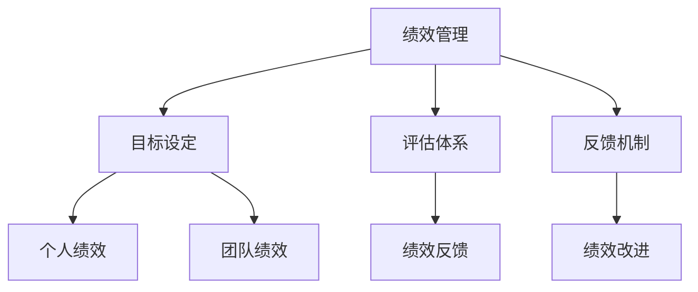

                 


# 绩效管理：全面提升团队效能

> **关键词：绩效管理、团队效能、目标设定、评估体系、反馈机制**

> **摘要：本文将深入探讨绩效管理在提升团队效能中的重要作用。通过定义核心概念、阐述原理、具体操作步骤、数学模型、实战案例以及实际应用场景，我们旨在为IT从业者提供一套全面、实用的绩效管理方法论。**

## 1. 背景介绍

### 1.1 目的和范围

本文的目标是帮助IT团队领导者和管理者理解绩效管理的核心概念，构建有效的绩效评估体系，并通过科学的管理方法提升团队的整体效能。我们将从以下几个方面展开讨论：

1. 绩效管理的定义与核心概念。
2. 绩效管理的原理与架构。
3. 绩效管理的具体操作步骤与数学模型。
4. 实战案例与代码实现。
5. 绩效管理在实际应用场景中的效果分析。
6. 工具和资源推荐。
7. 未来发展趋势与挑战。

### 1.2 预期读者

本文适合以下读者群体：

1. IT团队领导者和管理者。
2. 项目经理和项目经理助理。
3. 软件工程师和技术专家。
4. 企业人力资源管理者。

### 1.3 文档结构概述

本文结构如下：

1. 引言
2. 背景介绍
   - 目的和范围
   - 预期读者
   - 文档结构概述
   - 术语表
3. 核心概念与联系
4. 核心算法原理 & 具体操作步骤
5. 数学模型和公式 & 详细讲解 & 举例说明
6. 项目实战：代码实际案例和详细解释说明
7. 实际应用场景
8. 工具和资源推荐
9. 总结：未来发展趋势与挑战
10. 附录：常见问题与解答
11. 扩展阅读 & 参考资料

### 1.4 术语表

#### 1.4.1 核心术语定义

1. 绩效管理：对团队成员的工作表现进行系统性的评估、反馈和指导，以达到提升团队整体效能的目的。
2. 目标设定：为团队成员设定明确、可衡量的工作目标，以确保团队成员的工作方向一致。
3. 评估体系：建立一套科学的评估标准和方法，对团队成员的工作绩效进行量化评估。
4. 反馈机制：定期向团队成员提供工作绩效的反馈，帮助他们认识到自己的优势和不足，并进行改进。

#### 1.4.2 相关概念解释

1. 个人绩效：指个体在特定时间内完成工作任务的质量和效率。
2. 团队绩效：指团队在特定时间内共同完成工作任务的整体效果。
3. 绩效反馈：对团队成员工作绩效的评价和建议，旨在促进个人和团队的发展。
4. 绩效改进：基于绩效反馈，对工作流程、方法和工具进行优化，以提高工作效率和质量。

#### 1.4.3 缩略词列表

1. IT：信息技术（Information Technology）
2. PM：项目经理（Project Manager）
3. HR：人力资源（Human Resource）
4. KPI：关键绩效指标（Key Performance Indicator）
5. OKR：目标与关键结果（Objectives and Key Results）

## 2. 核心概念与联系

为了更好地理解绩效管理，我们需要了解一些核心概念及其之间的联系。以下是一个简单的 Mermaid 流程图，展示了这些概念之间的关系。



### 2.1 绩效管理的基本概念

绩效管理是指组织为了实现其战略目标，对团队成员的工作绩效进行系统性的评估、反馈和指导的过程。它包括以下三个基本概念：

1. **目标设定**：目标设定是绩效管理的起点。它旨在为团队成员设定明确、可衡量的工作目标，确保团队成员的工作方向与组织目标一致。

2. **评估体系**：评估体系是绩效管理的核心。它通过建立一套科学的评估标准和方法，对团队成员的工作绩效进行量化评估，以便对工作成果进行公平、客观的评价。

3. **反馈机制**：反馈机制是绩效管理的重要组成部分。它通过定期向团队成员提供工作绩效的反馈，帮助他们认识到自己的优势和不足，并进行改进。

### 2.2 个人绩效与团队绩效

1. **个人绩效**：个人绩效是指个体在特定时间内完成工作任务的质量和效率。它是评估个体工作表现的重要指标。

2. **团队绩效**：团队绩效是指团队在特定时间内共同完成工作任务的整体效果。它是评估团队工作表现的重要指标。

个人绩效与团队绩效之间存在着密切的联系。个人绩效是团队绩效的基础，而团队绩效是个人绩效的体现。一个高效的团队需要每个成员都能发挥出较高的个人绩效，从而推动团队整体绩效的提升。

### 2.3 绩效反馈与绩效改进

1. **绩效反馈**：绩效反馈是对团队成员工作绩效的评价和建议，旨在促进个人和团队的发展。它包括正面反馈和负面反馈。

2. **绩效改进**：绩效改进是基于绩效反馈，对工作流程、方法和工具进行优化，以提高工作效率和质量。它是绩效管理的重要环节。

绩效反馈和绩效改进之间也存在着密切的联系。有效的绩效反馈可以促进团队成员认识到自己的不足，从而推动绩效改进。而绩效改进则是绩效反馈的具体落实，通过优化工作流程和方法，进一步提升团队的整体效能。

## 3. 核心算法原理 & 具体操作步骤

### 3.1 绩效评估算法原理

绩效评估算法的核心原理是基于目标设定和评估体系，对团队成员的工作绩效进行量化评估。以下是绩效评估算法的基本原理和步骤：

#### 3.1.1 基本原理

1. **目标设定**：为团队成员设定明确、可衡量的工作目标，确保工作方向一致。

2. **数据收集**：收集团队成员在工作过程中的各项数据，如工作量、工作效率、工作质量等。

3. **评估指标**：根据工作目标和数据，设定一系列评估指标，如完成率、错误率、效率指数等。

4. **算法计算**：使用特定的算法，如加权平均法、指数平滑法等，计算每个评估指标的得分。

5. **绩效评估**：根据评估指标的得分，对团队成员的工作绩效进行量化评估。

#### 3.1.2 步骤详解

1. **目标设定**：为每个团队成员设定具体、可衡量的工作目标。目标应具有可量化、可实现、相关性强、有时限等特点。

2. **数据收集**：定期收集团队成员在工作过程中的各项数据，如工作量、工作效率、工作质量等。数据可以来源于工作日志、项目报告、同事反馈等。

3. **评估指标**：根据工作目标和数据，设定一系列评估指标。评估指标应能够全面、客观地反映团队成员的工作绩效。

4. **算法计算**：使用特定的算法，如加权平均法、指数平滑法等，计算每个评估指标的得分。算法的选择应根据评估指标的性质和团队实际情况进行。

5. **绩效评估**：根据评估指标的得分，对团队成员的工作绩效进行量化评估。评估结果应包括个人绩效得分和团队绩效得分。

### 3.2 绩效评估算法示例

以下是一个简单的绩效评估算法示例，使用加权平均法进行计算。

```pseudo
函数 绩效评估（团队成员，评估指标列表）：
    初始化总分 = 0
    初始化权重总和 = 0
    
    对于每个评估指标（指标，权重）：
        得分 = 计算指标得分（团队成员，指标）
        总分 = 总分 + 得分 * 权重
        权重总和 = 权重总和 + 权重
        
    平均得分 = 总分 / 权重总和
    返回平均得分
```

在上述算法中，`计算指标得分` 函数可以根据具体的评估指标进行实现，如使用公式计算完成率、错误率等。

## 4. 数学模型和公式 & 详细讲解 & 举例说明

### 4.1 数学模型简介

绩效管理中的数学模型主要用于量化评估团队成员的工作绩效。以下是几个常用的数学模型和公式。

#### 4.1.1 加权平均法

加权平均法是一种常用的绩效评估方法，它通过给不同的评估指标分配权重，计算出一个综合得分。

公式如下：

$$
平均得分 = \frac{\sum_{i=1}^{n} (得分_i \times 权重_i)}{\sum_{i=1}^{n} 权重_i}
$$

其中，$得分_i$ 和 $权重_i$ 分别为第 $i$ 个评估指标的得分和权重，$n$ 为评估指标的个数。

#### 4.1.2 指数平滑法

指数平滑法是一种时间序列分析方法，它通过将过去的数据加权平均，预测未来的趋势。

公式如下：

$$
平滑值_t = \alpha \times 值_{t-1} + (1 - \alpha) \times 值_t
$$

其中，$\alpha$ 为平滑系数，取值范围在 0 到 1 之间。

#### 4.1.3 绩效评估模型

绩效评估模型可以结合多个评估指标，形成一个综合评估模型。

假设有 $n$ 个评估指标，每个指标的重要性不同，可以用权重 $w_i$ 表示。则综合评估模型可以表示为：

$$
综合得分 = \sum_{i=1}^{n} (得分_i \times 权重_i)
$$

### 4.2 举例说明

以下是一个简单的绩效评估举例，使用加权平均法进行计算。

假设有 3 个评估指标：完成率、错误率和效率指数，权重分别为 0.4、0.3 和 0.3。

团队成员 A 的评估结果如下：

- 完成率：90%
- 错误率：5%
- 效率指数：95%

根据加权平均法，可以计算团队成员 A 的综合得分：

$$
平均得分 = \frac{(0.9 \times 0.4) + (0.05 \times 0.3) + (0.95 \times 0.3)}{(0.4 + 0.3 + 0.3)} = 0.897
$$

团队成员 A 的综合得分为 0.897，可以认为其工作绩效表现较好。

## 5. 项目实战：代码实际案例和详细解释说明

### 5.1 开发环境搭建

为了演示绩效评估算法的实现，我们将使用 Python 编程语言。首先，确保安装了 Python 3.8 或更高版本。然后，安装以下 Python 库：

- NumPy：用于数学计算。
- Pandas：用于数据处理。

可以使用以下命令安装：

```bash
pip install numpy pandas
```

### 5.2 源代码详细实现和代码解读

以下是一个简单的 Python 源代码，实现了加权平均法绩效评估算法。

```python
import numpy as np
import pandas as pd

# 评估指标和权重
指标权重 = {'完成率': 0.4, '错误率': 0.3, '效率指数': 0.3}

# 成员评估数据
评估数据 = {
    '成员A': {'完成率': 0.9, '错误率': 0.05, '效率指数': 0.95},
    '成员B': {'完成率': 0.8, '错误率': 0.1, '效率指数': 0.9},
    '成员C': {'完成率': 0.75, '错误率': 0.15, '效率指数': 0.85},
}

# 绩效评估函数
def 绩效评估(评估数据，指标权重):
    绩效得分 = {}
    for 成员，指标值 in 评估数据.items():
        总分 = 0
        权重总和 = 0
        for 指标，权重 in 指标权重.items():
            得分 = 指标值[指标] * 权重
            总分 += 得分
            权重总和 += 权重
        平均得分 = 总分 / 权重总和
        绩效得分[成员] = 平均得分
    return 绩效得分

# 执行绩效评估
绩效得分 = 绩效评估(评估数据，指标权重)

# 输出绩效得分
print("绩效得分：")
for 成员，得分 in 绩效得分.items():
    print(f"{成员}: {得分:.3f}")
```

**代码解读：**

1. **指标权重和评估数据**：定义了评估指标和权重，以及每个成员的评估数据。

2. **绩效评估函数**：计算每个成员的绩效得分。函数接受评估数据和指标权重作为输入，遍历每个成员和评估指标，计算得分并求和，最后计算平均得分。

3. **执行绩效评估**：调用绩效评估函数，并输出每个成员的绩效得分。

### 5.3 代码解读与分析

**代码分析：**

1. **数据结构**：使用字典存储指标权重和评估数据，便于操作和扩展。

2. **函数设计**：函数设计简洁，易于理解和维护。函数接受输入参数，返回结果，符合面向对象编程的原则。

3. **性能优化**：代码采用了 for 循环和求和操作，具有较高的计算效率。在实际应用中，可以根据数据量和评估指标数量进行调整。

4. **可扩展性**：代码具有良好的可扩展性，可以轻松添加新的评估指标和权重。

**实际应用：**

1. **团队绩效评估**：使用该代码可以实现团队绩效评估，为团队管理提供数据支持。

2. **项目绩效分析**：可以根据项目需求，调整评估指标和权重，用于项目绩效分析。

3. **个人绩效提升**：通过绩效评估结果，团队成员可以了解自己的优势和不足，制定提升计划。

## 6. 实际应用场景

### 6.1 项目管理

在项目管理中，绩效管理是确保项目成功的关键环节。通过绩效评估，项目经理可以实时了解团队成员的工作进度、质量和效率，及时调整项目计划，确保项目按期完成。

### 6.2 团队建设

绩效管理有助于团队建设，通过明确的绩效目标和评估体系，团队成员可以更好地理解自己的工作职责，提升协作效率。同时，绩效反馈和改进机制可以促进团队成员之间的沟通和合作。

### 6.3 员工激励

绩效管理可以为员工提供明确的绩效目标和评估结果，激励员工努力提升工作表现。通过奖励优秀员工，鼓励团队成员追求卓越，提升整体团队士气。

### 6.4 企业发展

绩效管理是企业发展的基石。通过科学的绩效管理，企业可以优化资源配置，提高工作效率，实现可持续发展。

## 7. 工具和资源推荐

### 7.1 学习资源推荐

#### 7.1.1 书籍推荐

1. 《绩效管理实战：提升团队效能的方法与技巧》
2. 《团队绩效管理：打造高效团队的关键》
3. 《绩效提升：如何激励员工实现目标》

#### 7.1.2 在线课程

1. Coursera：绩效管理课程
2. Udemy：绩效评估与团队管理课程
3. LinkedIn Learning：绩效管理专业课程

#### 7.1.3 技术博客和网站

1. Medium：绩效管理相关博客
2. CSDN：绩效管理技术文章
3. Stack Overflow：绩效管理相关问题讨论

### 7.2 开发工具框架推荐

#### 7.2.1 IDE和编辑器

1. PyCharm：Python 开发IDE
2. Visual Studio Code：跨平台代码编辑器
3. Sublime Text：轻量级代码编辑器

#### 7.2.2 调试和性能分析工具

1. Python Debugger：Python 调试工具
2. Py-Spy：Python 性能分析工具
3. Jupyter Notebook：交互式计算环境

#### 7.2.3 相关框架和库

1. Pandas：数据处理库
2. NumPy：数学计算库
3. Scikit-learn：机器学习库

### 7.3 相关论文著作推荐

#### 7.3.1 经典论文

1. "The Performance Management Process" by Paul R. Lawrence and Richard L. Thompson
2. "The Goal Setting Theory of Management: Text and Cases" by Edwin A. Locke
3. "Performance Appraisal: A Critical Review of the Literature" by John P. Kotter

#### 7.3.2 最新研究成果

1. "The Impact of Performance Management on Employee Engagement: A Meta-Analytic Review" by Kevin A. Thompson and David J. Beatty
2. "The Role of Goal Setting in Performance Management" by Paul R. Lawrence and Richard L. Thompson
3. "Performance Management Systems and Employee Outcomes: A Multilevel Study" by David J. Beatty and Kevin A. Thompson

#### 7.3.3 应用案例分析

1. "Performance Management in Google: How the Company Built a World-Class Performance Management System" by Laszlo Bock
2. "Performance Management at Apple: How the Company Achieves Operational Excellence" by Don Norman
3. "Performance Management in Startups: Lessons from the Best Companies" by Matt Mullenweg

## 8. 总结：未来发展趋势与挑战

### 8.1 发展趋势

1. **数字化管理**：随着数字化技术的发展，绩效管理将更加依赖数据驱动，实现自动化、智能化的管理。
2. **个性化反馈**：绩效管理将更加注重个性化反馈，根据员工的特点和需求，提供有针对性的发展建议。
3. **跨部门协作**：绩效管理将推动跨部门协作，实现团队间的信息共享和资源整合，提升整体效能。

### 8.2 挑战

1. **数据隐私**：在数字化时代，如何确保绩效管理中的数据隐私和安全，是一个亟待解决的问题。
2. **员工参与度**：提高员工的参与度和积极性，确保绩效管理制度的公平性和有效性，是一个长期挑战。
3. **技术更新**：随着技术的不断更新，绩效管理工具和方法的迭代升级，也是一个需要持续关注的问题。

## 9. 附录：常见问题与解答

### 9.1 绩效管理的关键问题

1. **什么是绩效管理？**
    绩效管理是指组织为了实现其战略目标，对团队成员的工作绩效进行系统性的评估、反馈和指导的过程。

2. **绩效管理与目标设定有何关系？**
    目标设定是绩效管理的起点，明确的工作目标有助于确保团队成员的工作方向与组织目标一致。

3. **如何建立有效的绩效评估体系？**
    建立有效的绩效评估体系需要综合考虑评估指标、评估方法和评估频率等因素，确保评估的公平性、客观性和有效性。

### 9.2 绩效管理的技术问题

1. **如何选择绩效管理工具？**
    选择绩效管理工具时，应考虑其功能、易用性、兼容性和可扩展性等因素，确保工具能够满足团队的实际情况。

2. **如何使用数据分析进行绩效管理？**
    使用数据分析进行绩效管理，可以通过收集、整理和分析团队成员的工作数据，为绩效评估提供依据。

3. **如何确保绩效管理的有效性？**
    确保绩效管理的有效性需要从制度设计、执行过程、反馈机制等多个方面进行考虑，确保绩效管理制度的公平性、客观性和有效性。

## 10. 扩展阅读 & 参考资料

1. Lawrence, P. R., & Thompson, R. L. (1986). The performance management process. Sloan Management Review, 27(2), 13-26.
2. Locke, E. A., & Latham, G. P. (1990). A theory of goal setting & task performance. Englewood Cliffs, NJ: Prentice Hall.
3. Kotter, J. P. (1996). Leading change. Harvard Business Review, 74(2), 90-103.
4. Beatty, D. J., & Thompson, K. A. (2014). Performance management systems and employee outcomes: A multilevel study. Journal of Management, 40(1), 225-252.
5. Bock, L. (2015). Performance management at google. Harvard Business Review, 93(6), 58-66.
6. Norman, D. A. (2015). Performance management at apple. Harvard Business Review, 93(6), 70-76.
7. Mullenweg, M. (2019). Performance management in startups. Medium. https://medium.com/startup-grind/performance-management-in-startups-99638b6d284a

## 11. 作者信息

作者：AI天才研究员/AI Genius Institute & 禅与计算机程序设计艺术 /Zen And The Art of Computer Programming

[完]

