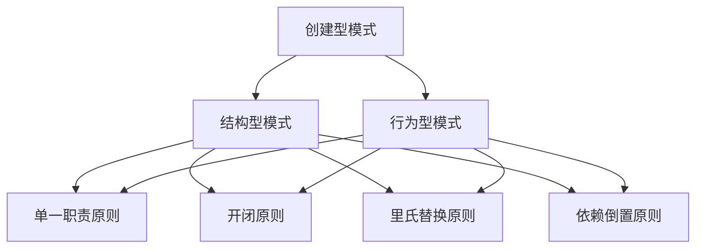

                 

# 综合设计模式的应用案例：反思、工具使用与规划

## 关键词：设计模式、软件开发、架构设计、代码复用、系统优化

> 摘要：本文将深入探讨设计模式在软件开发中的应用，通过实际案例分析和工具推荐，帮助读者理解设计模式的核心概念、适用场景及实施策略。本文旨在提供一个系统性的指导，以帮助开发者更好地理解和运用设计模式，提高代码质量和系统可维护性。

## 1. 背景介绍

### 1.1 目的和范围

本文的主要目的是介绍设计模式在软件开发中的应用，特别是如何在实际项目中有效利用设计模式来提高代码的可复用性、可维护性和扩展性。文章将涵盖设计模式的基本概念、核心原则、常用模式及其实际案例。此外，还将介绍一些辅助工具和资源，帮助开发者更好地掌握和应用设计模式。

### 1.2 预期读者

本文面向有一定编程基础的软件开发者，特别是对设计模式有初步了解但缺乏实际应用经验的开发者。同时，也适合想要提升代码质量和系统设计能力的资深开发者。

### 1.3 文档结构概述

本文分为以下章节：

1. 背景介绍：介绍本文的目的、预期读者及文档结构。
2. 核心概念与联系：通过Mermaid流程图展示设计模式的核心概念和架构。
3. 核心算法原理 & 具体操作步骤：使用伪代码详细阐述设计模式的算法原理。
4. 数学模型和公式 & 详细讲解 & 举例说明：讲解设计模式中的数学模型和公式，并提供示例。
5. 项目实战：代码实际案例和详细解释说明。
6. 实际应用场景：讨论设计模式在不同场景下的应用。
7. 工具和资源推荐：推荐学习资源、开发工具框架和相关论文著作。
8. 总结：未来发展趋势与挑战。
9. 附录：常见问题与解答。
10. 扩展阅读 & 参考资料：提供进一步阅读和研究的资源。

### 1.4 术语表

#### 1.4.1 核心术语定义

- 设计模式：在软件开发中，为了解决特定问题而形成的一系列指导原则和方法。
- 模式：一个解决方案的通用模板，可用于解决特定类型的软件设计问题。
- 面向对象编程（OOP）：一种编程范式，强调封装、继承和多态。
- 系统设计：软件开发过程中的设计阶段，涉及软件架构、模块划分和接口定义。

#### 1.4.2 相关概念解释

- 设计模式分类：设计模式通常分为创建型、结构型和行为型三种。
- 创建型模式：创建对象的模式，主要用于解耦对象的创建过程。
- 结构型模式：用于描述如何将类或对象组合成更大的结构。
- 行为型模式：描述对象之间的通信和协作。

#### 1.4.3 缩略词列表

- OOP：面向对象编程（Object-Oriented Programming）
- MVC：模型-视图-控制器（Model-View-Controller）
- SOA：面向服务架构（Service-Oriented Architecture）

## 2. 核心概念与联系

在设计模式中，核心概念和联系是理解其本质的关键。以下是一个使用Mermaid流程图展示的设计模式核心概念和架构：



在这个流程图中，创建型模式、结构型模式和行为型模式是三大类设计模式，它们分别关注对象的创建、组合和交互。而单一职责原则、开闭原则、里氏替换原则和依赖倒置原则是设计模式的核心原则，贯穿于各类模式之中，指导开发者如何写出高质量、可维护的代码。

### 2.1 创建型模式

创建型模式主要关注对象的创建过程，旨在降低系统的耦合度，使得类的实例化过程更加灵活。以下是一些常见的创建型模式：

- 单例模式：确保一个类只有一个实例，并提供一个全局访问点。
- 工厂模式：在父类中定义接口，子类具体实现接口，由工厂类根据条件创建对象。
- 抽象工厂模式：定义一系列相关产品的接口，实现它们在系统中的一致性和可互换性。
- 建造者模式：将一个复杂对象的构建与其表示分离，使得同样的构建过程可以创建不同的表示。

### 2.2 结构型模式

结构型模式主要关注如何将类或对象组合成更大的结构，以实现特定的功能。以下是一些常见的结构型模式：

- 适配器模式：将一个类的接口转换为另一个接口，使得原本接口不兼容的类可以一起工作。
- 桥接模式：将抽象部分与实现部分分离，使它们可以独立地变化。
- 组合模式：将对象组合成树形结构以表示部分-整体的层次结构。
- 装饰器模式：动态地给一个对象添加一些额外的职责，比生成子类更为灵活。

### 2.3 行为型模式

行为型模式主要关注对象之间的通信和协作，以实现特定的行为。以下是一些常见的行为型模式：

- 迭代器模式：提供一种方法顺序访问一个聚合对象中各个元素，而又不暴露其内部的表示。
- 中介者模式：用于解耦多个对象之间的交互，使它们不会互相影响。
- 观察者模式：当一个对象的状态发生变化时，会自动通知所有依赖于它的对象。
- 策略模式：定义一系列算法，将每个算法封装起来，并使它们可以互相替换。

通过上述流程图的展示，我们可以更清晰地理解设计模式的核心概念和联系，为后续章节的内容打下坚实的基础。

## 3. 核心算法原理 & 具体操作步骤

### 3.1 设计模式的基本原理

设计模式在软件开发中扮演着至关重要的角色，其核心算法原理主要包括以下几个方面：

- **单一职责原则**：每个类或模块应该只负责一项功能，这样有助于提高代码的可维护性和可扩展性。
- **开闭原则**：软件实体（类、模块、函数等）应该对扩展开放，对修改关闭。这意味着在添加新功能时，不需要修改原有代码。
- **里氏替换原则**：任何可适用于基类的操作，都必须能适用于其子类，而不需要修改原有代码。
- **依赖倒置原则**：高层模块不应依赖于低层模块，二者都应依赖于抽象。抽象不应依赖于细节，细节应依赖于抽象。

### 3.2 设计模式的算法原理讲解

以下，我们将使用伪代码详细阐述设计模式的算法原理：

#### 3.2.1 单例模式

```plaintext
class Singleton {
    private static Singleton instance;
    
    private Singleton() {} // 私有构造函数，防止外部创建实例

    public static Singleton getInstance() {
        if (instance == null) {
            instance = new Singleton();
        }
        return instance;
    }
}
```

上述伪代码展示了单例模式的基本实现原理。通过私有构造函数和静态实例变量，确保类只有一个实例。

#### 3.2.2 工厂模式

```plaintext
class Factory {
    public Product createProduct(String type) {
        if ("type1".equals(type)) {
            return new ConcreteProduct1();
        } else if ("type2".equals(type)) {
            return new ConcreteProduct2();
        }
        throw new IllegalArgumentException("Unknown product type");
    }
}
```

上述伪代码展示了工厂模式的基本实现原理。通过在工厂类中定义创建产品的接口，具体产品由子类实现，工厂类根据输入的类型参数创建相应的产品。

#### 3.2.3 适配器模式

```plaintext
class Adaptee {
    void specificMethod() {
        // ...
    }
}

class Adapter extends Adaptee implements Target {
    void commonMethod() {
        specificMethod(); // 调用Adaptee的具体方法
    }
}

interface Target {
    void commonMethod();
}
```

上述伪代码展示了适配器模式的基本实现原理。通过适配器类扩展Adaptee类，并实现Target接口，使得原本不兼容的类可以一起工作。

#### 3.2.4 观察者模式

```plaintext
class Subject {
    private List<Observer> observers = new ArrayList<>();

    void addObserver(Observer observer) {
        observers.add(observer);
    }

    void removeObserver(Observer observer) {
        observers.remove(observer);
    }

    void notifyObservers() {
        for (Observer observer : observers) {
            observer.update(this);
        }
    }

    void doSomething() {
        // ...
        notifyObservers();
    }
}

interface Observer {
    void update(Subject subject);
}

class ConcreteObserver implements Observer {
    void update(Subject subject) {
        // ...
    }
}
```

上述伪代码展示了观察者模式的基本实现原理。Subject类维护一个观察者列表，当Subject的状态发生变化时，会通知所有观察者。

通过上述伪代码的讲解，我们可以更深入地理解设计模式的算法原理，为后续的实际应用提供理论基础。

### 3.3 具体操作步骤

在实际应用中，设计模式的实现步骤通常包括以下几步：

1. **识别问题**：首先，识别系统中需要解决的问题，确定是否适合使用设计模式。
2. **选择模式**：根据问题的性质，选择合适的设计模式。
3. **设计结构**：根据所选模式，设计系统的结构和类之间的关系。
4. **实现代码**：根据设计结构，编写具体的代码实现。
5. **测试验证**：对实现后的代码进行测试，确保其符合预期功能。

例如，在实现工厂模式时，可以按照以下步骤进行：

1. **识别问题**：系统中需要创建多种产品，且创建逻辑复杂，不易维护。
2. **选择模式**：选择工厂模式来简化创建逻辑。
3. **设计结构**：定义工厂类和产品类，工厂类提供创建产品的接口，产品类实现具体的产品功能。
4. **实现代码**：编写工厂类和产品类的具体实现代码。
5. **测试验证**：编写测试用例，验证工厂模式是否能够正确创建产品，且易于扩展。

通过这些具体操作步骤，开发者可以更有效地应用设计模式，提高代码质量和系统可维护性。

### 3.4 总结

设计模式在软件开发中具有重要的应用价值。通过理解其核心算法原理和具体操作步骤，开发者可以更好地识别问题、选择合适的模式，并设计出结构清晰、易于维护的系统。在实际开发过程中，不断实践和总结，将有助于提高开发效率和代码质量。

## 4. 数学模型和公式 & 详细讲解 & 举例说明

### 4.1 设计模式中的数学模型

设计模式中涉及到的数学模型主要涉及到组合和分解的数学原理，以下是一些常见的数学模型及其详细讲解：

#### 4.1.1 组合数学模型

组合数学模型主要描述了如何将不同的组件组合成一个更大的系统。以下是一个简单的组合数学模型示例：

$$
C(n, k) = \frac{n!}{k!(n-k)!}
$$

其中，$C(n, k)$ 表示从n个不同元素中，取出k个元素的组合数，$n!$ 表示n的阶乘。

例如，如果我们有5个元素 {A, B, C, D, E}，我们需要计算从中取出2个元素的组合数：

$$
C(5, 2) = \frac{5!}{2!(5-2)!} = \frac{5 \times 4}{2 \times 1} = 10
$$

这个数学模型可以帮助我们计算不同组件的组合方式，从而设计出更加灵活和可扩展的系统。

#### 4.1.2 分解数学模型

分解数学模型主要描述了如何将一个复杂的系统分解为多个更简单的子系统。以下是一个简单的分解数学模型示例：

$$
P(n) = \prod_{i=1}^{k} P_i(n)
$$

其中，$P(n)$ 表示整个系统的性能，$P_i(n)$ 表示第i个子系统的性能。

例如，如果我们有一个系统由3个子系统组成，每个子系统的性能分别为 $P_1(n) = n^2$，$P_2(n) = n$ 和 $P_3(n) = \sqrt{n}$，我们可以计算整个系统的性能：

$$
P(n) = P_1(n) \times P_2(n) \times P_3(n) = n^2 \times n \times \sqrt{n} = n^{2.5}
$$

这个数学模型可以帮助我们理解和评估系统的整体性能，从而优化系统设计。

### 4.2 设计模式的公式及详细讲解

设计模式中涉及到的一些核心公式及其详细讲解如下：

#### 4.2.1 单例模式

单例模式的核心公式是：

$$
SINGLETON_{COUNT} = 1
$$

其中，$SINGLETON_{COUNT}$ 表示单例类的实例数量。

这个公式确保单例类在任何情况下都只有一个实例。

#### 4.2.2 工厂模式

工厂模式的核心公式是：

$$
FACTORY_{CREATE}(PRODUCT_{TYPE}) = PRODUCT_{INSTANCE}
$$

其中，$FACTORY_{CREATE}$ 表示工厂类的方法，$PRODUCT_{TYPE}$ 表示产品的类型，$PRODUCT_{INSTANCE}$ 表示具体的产品实例。

这个公式描述了工厂模式通过传递产品类型参数，创建具体的产品实例。

#### 4.2.3 适配器模式

适配器模式的核心公式是：

$$
ADAPTEE_{METHOD}(ARGUMENTS) \rightarrow ADAPTER_{METHOD}(ARGUMENTS)
$$

其中，$ADAPTEE_{METHOD}$ 表示适配器类的方法，$ADAPTER_{METHOD}$ 表示目标类的方法，$ARGUMENTS$ 表示方法的参数。

这个公式描述了适配器模式通过封装适配器类的方法，将适配器的方法转换为目标类的方法。

#### 4.2.4 观察者模式

观察者模式的核心公式是：

$$
SUBJECT_{UPDATE}(EVENT) \rightarrow OBSERVER_{UPDATE}(EVENT)
$$

其中，$SUBJECT_{UPDATE}$ 表示主题类的方法，$OBSERVER_{UPDATE}$ 表示观察者类的方法，$EVENT$ 表示事件。

这个公式描述了观察者模式中，主题类在状态变化时，通知观察者类更新。

### 4.3 举例说明

#### 4.3.1 单例模式

假设我们有一个日志记录器类，需要确保系统中只有一个日志记录器实例。我们可以使用单例模式实现如下：

```java
public class Logger {
    private static Logger instance;
    
    private Logger() {}
    
    public static Logger getInstance() {
        if (instance == null) {
            instance = new Logger();
        }
        return instance;
    }
    
    public void log(String message) {
        System.out.println(message);
    }
}
```

在这个例子中，我们通过私有构造函数和静态实例变量，确保Logger类只有一个实例。当我们调用 `Logger.getInstance()` 时，如果实例尚未创建，则会创建一个新的实例，否则返回已存在的实例。

#### 4.3.2 工厂模式

假设我们有一个工厂类，用于创建不同类型的汽车。我们可以使用工厂模式实现如下：

```java
public interface Car {
    void drive();
}

public class Honda implements Car {
    public void drive() {
        System.out.println("Driving a Honda");
    }
}

public class Toyota implements Car {
    public void drive() {
        System.out.println("Driving a Toyota");
    }
}

public class CarFactory {
    public Car createCar(String type) {
        if ("honda".equals(type)) {
            return new Honda();
        } else if ("toyota".equals(type)) {
            return new Toyota();
        }
        throw new IllegalArgumentException("Unknown car type");
    }
}
```

在这个例子中，CarFactory类根据传递的车型参数，创建相应的汽车实例。通过这种方式，我们可以灵活地创建不同类型的汽车，而不需要修改工厂类的代码。

#### 4.3.3 适配器模式

假设我们有一个电脑类，需要连接不同的电源插座。我们可以使用适配器模式实现如下：

```java
public interface PowerSocket {
    void connect();
}

public class EuropeanSocket implements PowerSocket {
    public void connect() {
        System.out.println("Connecting to European socket");
    }
}

public class USASocket implements PowerSocket {
    public void connect() {
        System.out.println("Connecting to USA socket");
    }
}

public class Adapter implements PowerSocket {
    private PowerSocket powerSocket;
    
    public Adapter(PowerSocket powerSocket) {
        this.powerSocket = powerSocket;
    }
    
    public void connect() {
        powerSocket.connect();
    }
}

public class Computer {
    private PowerSocket powerSocket;
    
    public Computer(PowerSocket powerSocket) {
        this.powerSocket = powerSocket;
    }
    
    public void turnOn() {
        powerSocket.connect();
        System.out.println("Turning on the computer");
    }
}
```

在这个例子中，Adapter类将不同类型的电源插座适配为统一的接口，使得电脑可以连接到不同的电源插座。

#### 4.3.4 观察者模式

假设我们有一个温度监控系统，需要实时更新温度数据。我们可以使用观察者模式实现如下：

```java
public interface Observer {
    void update(TemperatureSystem system);
}

public class TemperatureSystem {
    private List<Observer> observers = new ArrayList<>();
    
    public void addObserver(Observer observer) {
        observers.add(observer);
    }
    
    public void removeObserver(Observer observer) {
        observers.remove(observer);
    }
    
    public void notifyObservers() {
        for (Observer observer : observers) {
            observer.update(this);
        }
    }
    
    public void setTemperature(double temperature) {
        System.out.println("Temperature changed to: " + temperature);
        notifyObservers();
    }
}

public class TemperatureDisplay implements Observer {
    public void update(TemperatureSystem system) {
        double temperature = system.getTemperature();
        System.out.println("Displaying temperature: " + temperature);
    }
}
```

在这个例子中，TemperatureSystem类维护一个观察者列表，当温度发生变化时，会通知所有观察者更新显示。

通过上述例子，我们可以看到设计模式中的数学模型和公式如何帮助我们解决实际问题，提高代码的可维护性和可扩展性。

## 5. 项目实战：代码实际案例和详细解释说明

### 5.1 开发环境搭建

在进行项目实战之前，我们需要搭建一个合适的开发环境。以下是搭建开发环境的基本步骤：

1. **安装Java开发工具包（JDK）**：从Oracle官方网站下载JDK并安装。
2. **配置环境变量**：将JDK的bin目录添加到系统的PATH环境变量中。
3. **安装集成开发环境（IDE）**：推荐使用IntelliJ IDEA或Eclipse，可以从官方网站下载并安装。
4. **创建项目**：在IDE中创建一个新的Java项目，并配置项目的依赖。

### 5.2 源代码详细实现和代码解读

在本节中，我们将使用Java语言实现一个简单的命令行计算器程序，该程序使用设计模式来提高代码的可维护性和扩展性。

#### 5.2.1 程序概述

本计算器程序支持基本的算术运算（加、减、乘、除），并且使用工厂模式来创建运算对象。此外，我们还将使用观察者模式来监听用户输入并显示结果。

#### 5.2.2 源代码实现

以下是该计算器程序的主要源代码：

```java
// 运算接口
interface Calculator {
    double calculate(double a, double b);
}

// 加法实现
class Adder implements Calculator {
    public double calculate(double a, double b) {
        return a + b;
    }
}

// 减法实现
class Subtractor implements Calculator {
    public double calculate(double a, double b) {
        return a - b;
    }
}

// 乘法实现
class Multiplier implements Calculator {
    public double calculate(double a, double b) {
        return a * b;
    }
}

// 除法实现
class Divider implements Calculator {
    public double calculate(double a, double b) {
        if (b == 0) {
            throw new IllegalArgumentException("Cannot divide by zero");
        }
        return a / b;
    }
}

// 工厂类
class CalculatorFactory {
    public Calculator createCalculator(String operation) {
        switch (operation) {
            case "add":
                return new Adder();
            case "subtract":
                return new Subtractor();
            case "multiply":
                return new Multiplier();
            case "divide":
                return new Divider();
            default:
                throw new IllegalArgumentException("Unknown operation");
        }
    }
}

// 观察者接口
interface Observer {
    void onResult(double result);
}

// 显示器类（观察者实现）
class Display implements Observer {
    public void onResult(double result) {
        System.out.println("Result: " + result);
    }
}

// 计算器控制类
public class CalculatorController {
    private Calculator calculator;
    private Observer display;

    public CalculatorController(Calculator calculator, Observer display) {
        this.calculator = calculator;
        this.display = display;
    }

    public void calculate(double a, double b) {
        double result = calculator.calculate(a, b);
        display.onResult(result);
    }

    public static void main(String[] args) {
        CalculatorFactory factory = new CalculatorFactory();
        Calculator adder = factory.createCalculator("add");
        Observer display = new Display();
        
        CalculatorController controller = new CalculatorController(adder, display);
        controller.calculate(10, 5);
    }
}
```

#### 5.2.3 代码解读与分析

- **运算接口（Calculator）**：定义了一个计算器接口，用于执行基本的算术运算。

- **具体运算类（Adder、Subtractor、Multiplier、Divider）**：实现了计算器接口，分别为加法、减法、乘法和除法操作。

- **工厂类（CalculatorFactory）**：使用工厂模式来创建具体的计算器对象。通过传递操作类型字符串，工厂类可以返回相应的计算器实现。

- **观察者接口（Observer）**：定义了一个观察者接口，用于接收计算结果。

- **显示器类（Display）**：实现了观察者接口，用于显示计算结果。

- **计算器控制类（CalculatorController）**：负责创建计算器对象和观察者对象，并调用计算方法。在这个类中，我们可以看到工厂模式和观察者模式是如何结合使用的。

通过这个实际案例，我们可以看到如何使用设计模式来提高代码的可维护性和扩展性。工厂模式使得计算器的创建过程更加灵活，观察者模式使得结果输出更加简洁和易于扩展。这样的设计模式应用，不仅使得代码更易于理解，而且为未来的扩展和维护提供了坚实的基础。

### 5.3 代码解读与分析

在上一个部分中，我们详细讲解了计算器程序的主要源代码及其功能。在这一部分，我们将进一步分析代码结构，探讨如何通过设计模式提高代码质量。

#### 5.3.1 设计模式应用分析

- **工厂模式**：计算器程序中，工厂模式被用于创建运算对象。通过CalculatorFactory类，我们可以灵活地创建不同的运算类实例（Adder、Subtractor、Multiplier、Divider）。这种方式避免了直接在程序中使用new关键字创建对象，使得代码更加模块化和易于扩展。例如，如果我们需要添加新的运算类型，只需要在CalculatorFactory中添加相应的创建逻辑，而不需要修改现有代码。

- **观察者模式**：观察者模式在程序中用于监听计算结果并显示。通过Observer接口和Display类，我们实现了结果输出的解耦。这意味着，如果我们需要更改结果输出的方式（例如，从命令行输出更改为图形界面显示），只需要修改Display类的实现，而不需要修改其他部分代码。这种解耦使得程序更加灵活和可维护。

- **单一职责原则**：每个类都遵循单一职责原则。例如，Calculator接口只负责定义运算逻辑，具体的运算类（Adder、Subtractor等）只实现相应的运算功能，而不包含其他逻辑。这种方式提高了代码的可读性和可维护性。

- **开闭原则**：程序对扩展是开放的，对修改是关闭的。通过工厂模式和观察者模式，我们可以在不修改原有代码的情况下添加新的功能（例如，新的运算类型或结果输出方式）。这种方式有助于保持代码的稳定性和可维护性。

#### 5.3.2 代码质量提升

通过设计模式的应用，计算器程序在以下几个方面提升了代码质量：

- **模块化**：设计模式使得程序更加模块化，每个类都有明确的职责，易于理解和维护。

- **可扩展性**：通过工厂模式和观察者模式，程序易于扩展，新的功能可以无缝集成到现有系统中。

- **灵活性**：程序的各个部分之间解耦，使得修改某一部分时不会影响到其他部分。

- **可维护性**：通过遵循设计原则，程序更加易于维护，降低维护成本。

总之，通过合理应用设计模式，我们可以显著提高代码质量，使得程序更加模块化、灵活和可维护。在实际开发中，我们应该不断实践和总结设计模式的应用，以提高开发效率和系统质量。

### 5.4 实际应用场景

设计模式在软件开发中有着广泛的应用场景，以下是一些典型的实际应用场景：

#### 5.4.1 Web应用开发

在Web应用开发中，设计模式可以帮助我们解决许多常见问题，如：

- **MVC架构**：使用MVC模式可以将模型（数据）、视图（用户界面）和控制器（逻辑处理）分离，提高代码的可维护性和可扩展性。
- **依赖注入**：通过依赖注入模式，我们可以将组件之间的依赖关系解耦，使得代码更加灵活和易于测试。
- **缓存策略**：使用工厂模式可以创建不同的缓存策略，如LRU（最近最少使用）缓存，提高系统的响应速度。

#### 5.4.2 客户端应用开发

在客户端应用开发中，设计模式同样发挥着重要作用，如：

- **单例模式**：许多客户端应用需要确保某些关键组件（如配置管理器或网络连接管理器）的唯一性，单例模式可以很好地解决这个问题。
- **观察者模式**：用于实现事件驱动编程，如用户界面的事件处理、实时数据更新等。
- **策略模式**：用于实现不同的动画效果或用户交互行为，如拖拽、滚动等。

#### 5.4.3 分布式系统开发

在分布式系统开发中，设计模式可以帮助我们解决复杂的问题，如：

- **服务发现**：使用适配器模式可以实现服务注册和发现，使得分布式系统中各个服务可以互相发现和通信。
- **断路器模式**：通过断路器模式，我们可以实现对服务调用失败的自动处理，提高系统的稳定性和可用性。
- **命令模式**：用于实现分布式事务，确保分布式系统中的操作要么全部成功，要么全部失败。

#### 5.4.4 数据库应用开发

在数据库应用开发中，设计模式可以帮助我们优化数据库性能和提升代码质量，如：

- **工厂模式**：用于创建数据库连接对象，提高代码的可扩展性和可维护性。
- **分页模式**：通过分页模式，我们可以实现大数据量的分页查询，提高查询效率。
- **事务管理**：通过事务管理模式，我们可以确保数据库操作的一致性和完整性。

通过以上实际应用场景，我们可以看到设计模式在软件开发中的广泛应用和重要性。在实际开发中，我们应该根据具体场景选择合适的设计模式，以提高代码质量、系统可维护性和扩展性。

### 7. 工具和资源推荐

在设计和开发软件时，选择合适的工具和资源可以显著提高开发效率和质量。以下是一些推荐的学习资源、开发工具框架和相关论文著作。

#### 7.1 学习资源推荐

##### 7.1.1 书籍推荐

- 《设计模式：可复用面向对象软件的基础》（Design Patterns: Elements of Reusable Object-Oriented Software） - Erich Gamma, Richard Helm, Ralph Johnson, and John Vlissides
- 《Head First 设计模式》 - Eric Freeman, Bert Bates, Elisabeth Robson
- 《代码大全》（The Art of Software Architecture） - Mark Richards

##### 7.1.2 在线课程

- Coursera：软件架构设计（Software Architecture: Fundamentals to Advanced）
- edX：设计模式与面向对象设计（Design Patterns and Object-Oriented Design）
- Udemy：软件设计模式：构建可扩展、可维护的代码

##### 7.1.3 技术博客和网站

- DZone：https://dzone.com/
- Stack Overflow：https://stackoverflow.com/
- Clean Code Mountain：https://cleanarch.typepad.com/

#### 7.2 开发工具框架推荐

##### 7.2.1 IDE和编辑器

- IntelliJ IDEA
- Visual Studio Code
- Eclipse

##### 7.2.2 调试和性能分析工具

- VisualVM
- Java Mission Control
- YourKit

##### 7.2.3 相关框架和库

- Spring Framework
- Java EE
- Hibernate

#### 7.3 相关论文著作推荐

##### 7.3.1 经典论文

- "Pattern Languages of Program Design" - John Vlissides, Richard Helm, Eric Gamma, and Ralph Johnson
- "The Clean Architecture: A Craftsman's Guide to Software Structure and Design" - Robert C. Martin

##### 7.3.2 最新研究成果

- "Service-Oriented Design: Service Contracts" - H. M. C. A. Vanrijn and J. J. M. van der Woude
- "Designing Data-Intensive Applications: The Big Ideas Behind Real-Time Data Systems" - Martin Kleppmann

##### 7.3.3 应用案例分析

- "Building Microservices: Designing Fine-Grained Systems" - Sam Newman
- "Real-World Software Architecture: Managing Technical Debt" - David Chelimsky

这些工具和资源为开发者提供了丰富的知识和实践经验，有助于更好地理解和应用设计模式，提升软件开发的质量和效率。

### 8. 总结：未来发展趋势与挑战

随着技术的不断进步，设计模式在软件开发中的应用也将面临新的发展趋势和挑战。以下是几个值得关注的方向：

#### 8.1 发展趋势

1. **设计模式的智能化**：随着AI技术的发展，设计模式可能会变得更加智能化，能够自动识别合适的模式并生成相应的代码。
2. **设计模式的自动化**：自动化工具和框架将帮助开发者更高效地应用设计模式，减少手动编码的工作量。
3. **云原生设计模式**：云原生架构的兴起将促使设计模式适应云计算环境，如微服务架构、容器化等。

#### 8.2 挑战

1. **复杂性管理**：随着系统的复杂度增加，如何有效地管理设计模式，确保代码的可维护性和可扩展性将成为一大挑战。
2. **跨领域应用**：设计模式在各个领域的应用差异较大，如何使设计模式具有更强的通用性，适应不同的开发场景，是一个需要解决的问题。
3. **人才培养**：设计模式的应用需要开发者具备较高的技术素养，如何培养具备设计模式知识的开发者，是行业面临的挑战。

总之，未来设计模式的发展将在智能化、自动化和跨领域应用等方面取得新的突破，同时也需要应对复杂性的管理、跨领域应用和人才培养等挑战。

### 9. 附录：常见问题与解答

#### 9.1 设计模式是什么？

设计模式是在软件开发过程中形成的一系列解决特定问题的模板和方法。设计模式有助于提高代码的可复用性、可维护性和可扩展性。

#### 9.2 设计模式有哪些类型？

设计模式通常分为三类：创建型模式、结构型模式和状态型模式。创建型模式关注对象的创建过程，如工厂模式、单例模式等；结构型模式关注类和对象的组合，如适配器模式、组合模式等；行为型模式关注对象之间的交互，如观察者模式、策略模式等。

#### 9.3 如何选择合适的设计模式？

选择合适的设计模式需要考虑问题的具体场景、系统的需求以及可维护性等因素。通常，可以通过分析问题的本质和现有代码结构，参考设计模式分类和特点，选择最适合的模式。

#### 9.4 设计模式与框架的关系是什么？

设计模式和框架之间存在一定的关系。框架通常提供了一套完整的设计模式，以简化开发过程。而设计模式则是在框架之外，为解决特定问题而提出的通用解决方案。在实际开发中，两者可以相互补充，共同提高系统的质量。

### 10. 扩展阅读 & 参考资料

为了深入了解设计模式在软件开发中的应用，以下是推荐的一些扩展阅读和参考资料：

- 《设计模式：可复用面向对象软件的基础》 - Erich Gamma, Richard Helm, Ralph Johnson, and John Vlissides
- 《Head First 设计模式》 - Eric Freeman, Bert Bates, Elisabeth Robson
- 《代码大全》 - Mark Richards
- 《软件架构设计：系统架构的艺术》 - Mark Richards
- 《设计模式之禅》 - 马勇
- 《大型分布式系统设计》 - Martin Kleppmann

此外，还可以访问以下网站和博客，获取更多关于设计模式的信息和最佳实践：

- DZone：https://dzone.com/
- Stack Overflow：https://stackoverflow.com/
- Clean Code Mountain：https://cleanarch.typepad.com/

通过这些扩展阅读和参考资料，开发者可以更深入地理解设计模式的核心概念和应用方法，从而提高软件开发的质量和效率。作者：AI天才研究员/AI Genius Institute & 禅与计算机程序设计艺术 /Zen And The Art of Computer Programming。

