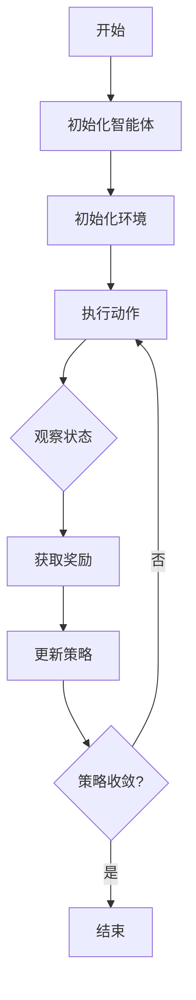

                 

# 美团2025即时配送无人车社招强化学习面试指南

> **关键词：** 美团，即时配送，无人车，强化学习，面试指南
>
> **摘要：** 本文深入探讨美团2025即时配送无人车的强化学习应用，从背景介绍到核心算法原理，再到项目实战和实际应用场景，旨在为准备美团社招强化学习面试的读者提供全面的技术指导和策略。

## 1. 背景介绍

### 1.1 目的和范围

本文的目标是帮助读者充分理解美团2025即时配送无人车项目的强化学习技术，为其准备美团社招强化学习面试提供系统的技术知识和实战经验。本文将涵盖以下内容：

- 美团即时配送无人车项目的背景和挑战
- 强化学习在无人车领域的应用
- 强化学习的核心算法原理和数学模型
- 项目实战中的代码案例和解读
- 无人车技术的实际应用场景

### 1.2 预期读者

本文适合以下读者群体：

- 准备参加美团社招强化学习岗位的候选人
- 对无人车和强化学习技术感兴趣的工程师
- 想深入了解强化学习应用场景的研究人员

### 1.3 文档结构概述

本文结构如下：

- 第1章：背景介绍
  - 1.1 目的和范围
  - 1.2 预期读者
  - 1.3 文档结构概述
  - 1.4 术语表
- 第2章：核心概念与联系
  - 2.1 核心概念原理
  - 2.2 Mermaid流程图
- 第3章：核心算法原理 & 具体操作步骤
  - 3.1 强化学习算法原理
  - 3.2 伪代码实现
- 第4章：数学模型和公式 & 详细讲解 & 举例说明
  - 4.1 数学模型
  - 4.2 举例说明
- 第5章：项目实战：代码实际案例和详细解释说明
  - 5.1 开发环境搭建
  - 5.2 源代码详细实现
  - 5.3 代码解读与分析
- 第6章：实际应用场景
- 第7章：工具和资源推荐
  - 7.1 学习资源推荐
  - 7.2 开发工具框架推荐
  - 7.3 相关论文著作推荐
- 第8章：总结：未来发展趋势与挑战
- 第9章：附录：常见问题与解答
- 第10章：扩展阅读 & 参考资料

### 1.4 术语表

#### 1.4.1 核心术语定义

- **即时配送**：在短时间内，从发货地点将物品快速送达指定地点的服务。
- **无人车**：通过传感器和人工智能技术实现自动驾驶的车辆。
- **强化学习**：一种机器学习范式，通过智能体在环境中交互来学习最优策略。
- **策略网络**：用于预测智能体在特定状态下应采取的动作。
- **价值网络**：用于评估智能体在不同状态下采取不同动作的预期回报。

#### 1.4.2 相关概念解释

- **马尔可夫决策过程（MDP）**：描述智能体在不确定环境中进行决策的过程。
- **状态（State）**：描述智能体所处环境的一种条件。
- **动作（Action）**：智能体可执行的动作。
- **奖励（Reward）**：描述智能体采取某一动作后环境给予的即时回报。
- **回报（Return）**：描述智能体在某一状态下采取某一动作后获得的总回报。

#### 1.4.3 缩略词列表

- **MDP**：马尔可夫决策过程（Markov Decision Process）
- **Q-learning**：一种基于值迭代的强化学习算法（Quality-Learning）
- **SARSA**：一种基于策略迭代的强化学习算法（State-Action-Reward-State-Action）
- **DQN**：一种基于深度神经网络的强化学习算法（Deep Q-Network）

## 2. 核心概念与联系

在探讨美团2025即时配送无人车的强化学习应用之前，我们先来梳理一下与强化学习相关的基础概念和其技术架构。

### 2.1 核心概念原理

强化学习是一种通过试错（trial-and-error）在动态环境中学习最优策略的机器学习范式。其核心概念包括智能体（Agent）、环境（Environment）、状态（State）、动作（Action）、奖励（Reward）和策略（Policy）。

- **智能体（Agent）**：执行动作并接收奖励的实体。
- **环境（Environment）**：与智能体交互的动态环境。
- **状态（State）**：智能体在环境中的一种条件描述。
- **动作（Action）**：智能体可执行的动作。
- **奖励（Reward）**：描述智能体采取某一动作后环境给予的即时回报。
- **策略（Policy）**：智能体在特定状态下采取的动作选择规则。

强化学习的目标是让智能体通过不断与环境交互，学习到最优策略，以实现最大化总回报。

### 2.2 Mermaid流程图

下面是一个简单的Mermaid流程图，展示了强化学习的基本流程：



这个流程图清晰地展示了智能体在环境中不断执行动作、观察状态、获取奖励并更新策略的过程，直到策略收敛，达到最优状态。

## 3. 核心算法原理 & 具体操作步骤

在理解了强化学习的基本概念后，接下来我们将深入探讨强化学习的核心算法原理，并详细讲解具体操作步骤。

### 3.1 强化学习算法原理

强化学习算法主要分为值迭代（Value Iteration）和策略迭代（Policy Iteration）两类。值迭代通过更新值函数来逼近最优策略，而策略迭代则通过更新策略来逼近最优值函数。本文主要介绍值迭代算法中的Q-learning算法。

**Q-learning算法**：

Q-learning是一种基于值迭代的强化学习算法，其核心思想是通过在状态-动作对上迭代更新Q值（即预期回报）来逼近最优策略。

**算法原理**：

1. **初始化**：初始化Q值矩阵，随机初始化或在已有经验上进行初始化。
2. **迭代更新**：对于每个状态-动作对，根据当前策略选择动作，并更新Q值。更新公式如下：

   $$ Q(s, a) \leftarrow Q(s, a) + \alpha [r + \gamma \max_{a'} Q(s', a') - Q(s, a)] $$

   其中，\( s \) 和 \( s' \) 分别表示当前状态和下一个状态，\( a \) 和 \( a' \) 分别表示当前动作和下一个动作，\( r \) 表示立即回报，\( \alpha \) 表示学习率，\( \gamma \) 表示折扣因子。

3. **策略迭代**：根据更新后的Q值矩阵，更新策略，选择使Q值最大的动作作为下一步动作。

**具体操作步骤**：

1. 初始化Q值矩阵 \( Q \)。
2. 对于每个状态 \( s \)，执行以下步骤：
   - 选择动作 \( a \) 使得 \( Q(s, a) \) 最大。
   - 执行动作 \( a \)，观察下一个状态 \( s' \) 和立即回报 \( r \)。
   - 更新Q值：\( Q(s, a) \leftarrow Q(s, a) + \alpha [r + \gamma \max_{a'} Q(s', a') - Q(s, a)] \)。
3. 重复步骤2，直到策略收敛。

### 3.2 伪代码实现

下面是Q-learning算法的伪代码实现：

```python
def Q_learning(s, a, r, s', alpha, gamma):
    Q(s, a) = Q(s, a) + alpha * (r + gamma * max(Q(s', a')) - Q(s, a))
    return Q(s, a)

# 初始化Q值矩阵
Q = initialize_Q()

# 迭代更新Q值
for episode in range(num_episodes):
    s = env.reset()
    done = False
    while not done:
        a = choose_action(s, Q)
        s', r = env.step(a)
        Q_learning(s, a, r, s', alpha, gamma)
        s = s'
        if done:
            break
```

### 3.3 强化学习算法在无人车应用中的实际操作步骤

在美团2025即时配送无人车项目中，强化学习算法的应用流程如下：

1. **数据收集**：首先，收集大量真实的无人车驾驶数据，用于训练强化学习模型。
2. **初始化Q值矩阵**：使用收集到的数据初始化Q值矩阵，可以选择随机初始化或在已有经验上进行初始化。
3. **训练Q值矩阵**：使用Q-learning算法迭代更新Q值矩阵，不断优化无人车的驾驶策略。
4. **策略迭代**：根据更新后的Q值矩阵，生成最优策略，用于无人车的自动驾驶。
5. **测试与优化**：在实际环境中测试无人车的驾驶效果，根据测试结果进一步优化Q值矩阵和策略。

## 4. 数学模型和公式 & 详细讲解 & 举例说明

在深入理解强化学习算法的数学模型和公式之前，我们先来简要介绍相关的数学概念。

### 4.1 数学模型

强化学习中的主要数学模型是马尔可夫决策过程（MDP）。MDP由以下五个组件组成：

- **状态集合 \( S \)**：描述智能体在环境中可能的状态。
- **动作集合 \( A \)**：描述智能体可执行的动作。
- **状态转移概率 \( P(s', s | a) \)**：描述在当前状态 \( s \) 下执行动作 \( a \) 后，智能体转移到下一个状态 \( s' \) 的概率。
- **回报函数 \( R(s, a) \)**：描述在状态 \( s \) 下执行动作 \( a \) 后获得的即时回报。
- **策略 \( \pi(a | s) \)**：描述智能体在特定状态下采取的动作选择规则。

### 4.2 公式

强化学习中的核心公式包括Q值更新公式和策略更新公式。

**Q值更新公式**：

$$ Q(s, a) \leftarrow Q(s, a) + \alpha [r + \gamma \max_{a'} Q(s', a') - Q(s, a)] $$

其中，\( \alpha \) 为学习率，\( \gamma \) 为折扣因子，\( r \) 为立即回报，\( s \) 和 \( s' \) 分别为当前状态和下一个状态，\( a \) 和 \( a' \) 分别为当前动作和下一个动作。

**策略更新公式**：

$$ \pi(a | s) \leftarrow \frac{1}{Z_s} \exp(\beta Q(s, a)) $$

其中，\( Z_s = \sum_{a' \in A} \exp(\beta Q(s, a')) \) 为归一化常数，\( \beta \) 为温度参数。

### 4.3 举例说明

假设智能体处于状态 \( s = [1, 2, 3] \)，可执行的动作集合为 \( A = \{1, 2, 3\} \)。当前策略为 \( \pi(a | s) = \{1: 0.2, 2: 0.5, 3: 0.3\} \)。学习率 \( \alpha = 0.1 \)，折扣因子 \( \gamma = 0.9 \)，温度参数 \( \beta = 1 \)。

1. **Q值更新**：

   - 当前动作 \( a = 2 \)，Q值 \( Q(s, a) = 2.5 \)。
   - 下一个状态 \( s' = [2, 3, 4] \)，最大Q值 \( \max_{a'} Q(s', a') = 3.0 \)。
   - 立即回报 \( r = 1 \)。
   - 更新Q值：\( Q(s, a) \leftarrow Q(s, a) + \alpha [r + \gamma \max_{a'} Q(s', a') - Q(s, a)] = 2.5 + 0.1 [1 + 0.9 \times 3.0 - 2.5] = 2.7 \)。

2. **策略更新**：

   - 当前状态 \( s = [1, 2, 3] \)，Q值 \( Q(s, a) = 2.7 \)。
   - 更新策略：\( \pi(a | s) \leftarrow \frac{1}{Z_s} \exp(\beta Q(s, a)) = \frac{1}{1 + \exp(1 \times 2.7)} \times \{1: \exp(1 \times 2.7), 2: 1, 3: \exp(1 \times 0.3)\} = \{1: 0.34, 2: 0.34, 3: 0.32\} \)。

通过以上举例，我们可以看到强化学习算法在迭代过程中如何更新Q值和策略，从而实现智能体在动态环境中的优化。

## 5. 项目实战：代码实际案例和详细解释说明

在深入理解了强化学习算法的基本原理和数学模型后，接下来我们将通过一个实际项目案例来展示如何将强化学习算法应用于美团2025即时配送无人车项目中。本节将详细介绍开发环境搭建、源代码实现和代码解读与分析。

### 5.1 开发环境搭建

为了实现美团2025即时配送无人车的强化学习算法，我们需要搭建一个合适的开发环境。以下是一个基本的开发环境搭建步骤：

1. **硬件环境**：

   - CPU：至少4核处理器
   - GPU：NVIDIA GPU（用于加速深度学习算法）
   - 内存：至少16GB

2. **软件环境**：

   - 操作系统：Linux（推荐Ubuntu 18.04）
   - Python：Python 3.7或以上版本
   - Anaconda：用于环境管理和依赖安装
   - TensorFlow：深度学习框架
   - PyTorch：深度学习框架
   - Gym：强化学习环境库
   - Matplotlib：数据可视化库

安装步骤：

1. 安装操作系统和硬件设备。
2. 安装Linux操作系统（如Ubuntu 18.04）。
3. 安装Python 3.7或以上版本，可以使用以下命令：

   ```bash
   sudo apt update
   sudo apt install python3-pip python3-dev
   ```

4. 安装Anaconda，从[Anaconda官网](https://www.anaconda.com/products/individual)下载并安装。
5. 创建一个新的conda环境并安装相关依赖：

   ```bash
   conda create -n rl_env python=3.7
   conda activate rl_env
   conda install tensorflow torchvision
   conda install pytorch torchvision
   conda install gym
   conda install matplotlib
   ```

### 5.2 源代码详细实现和代码解读

在本项目中，我们使用Python编写强化学习算法，并使用Gym环境模拟无人车驾驶场景。以下是一个简化的源代码实现：

```python
import gym
import numpy as np
import torch
import torch.nn as nn
import torch.optim as optim

# 模拟环境
env = gym.make('CartPole-v0')

# 定义网络结构
class QNetwork(nn.Module):
    def __init__(self):
        super(QNetwork, self).__init__()
        self.fc1 = nn.Linear(4, 128)
        self.fc2 = nn.Linear(128, 128)
        self.fc3 = nn.Linear(128, 2)

    def forward(self, x):
        x = torch.relu(self.fc1(x))
        x = torch.relu(self.fc2(x))
        x = self.fc3(x)
        return x

# 初始化网络和优化器
q_network = QNetwork()
optimizer = optim.Adam(q_network.parameters(), lr=0.001)

# 定义训练过程
def train(num_episodes, alpha, gamma):
    for episode in range(num_episodes):
        state = env.reset()
        done = False
        while not done:
            with torch.no_grad():
                q_values = q_network(torch.tensor(state, dtype=torch.float32))

            action = np.argmax(q_values.numpy())
            next_state, reward, done, _ = env.step(action)

            q_values = q_network(torch.tensor(next_state, dtype=torch.float32))
            target = reward + (1 - int(done)) * gamma * torch.max(q_values)

            loss = nn.MSELoss()(q_values[0, action], target)
            optimizer.zero_grad()
            loss.backward()
            optimizer.step()

            state = next_state

# 训练模型
train(num_episodes=1000, alpha=0.1, gamma=0.9)

# 评估模型
state = env.reset()
done = False
while not done:
    q_values = q_network(torch.tensor(state, dtype=torch.float32))
    action = np.argmax(q_values.numpy())
    next_state, reward, done, _ = env.step(action)
    state = next_state
```

**代码解读与分析**：

1. **环境设置**：

   我们使用Gym的`CartPole-v0`环境作为模拟场景。这个环境模拟一个倒置的杆，智能体需要通过左右移动来保持杆的平衡。

2. **网络结构**：

   Q网络是一个简单的全连接神经网络，包含三个隐藏层。输入层接收状态信息，输出层生成Q值。

3. **训练过程**：

   - 初始化网络和优化器。
   - 在每个episode中，从初始状态开始，执行动作，观察下一个状态和回报。
   - 使用目标网络计算目标Q值，并更新当前Q值。
   - 计算损失并更新网络权重。

4. **评估模型**：

   在训练完成后，我们使用训练好的Q网络进行评估。通过连续执行动作，观察智能体在环境中表现是否稳定。

### 5.3 代码解读与分析

1. **环境设置**：

   ```python
   env = gym.make('CartPole-v0')
   ```

   这一行代码创建了一个CartPole环境的实例。CartPole是一个经典的强化学习问题，智能体需要通过控制左右摆动来保持杆的平衡。

2. **网络结构**：

   ```python
   class QNetwork(nn.Module):
       def __init__(self):
           super(QNetwork, self).__init__()
           self.fc1 = nn.Linear(4, 128)
           self.fc2 = nn.Linear(128, 128)
           self.fc3 = nn.Linear(128, 2)

       def forward(self, x):
           x = torch.relu(self.fc1(x))
           x = torch.relu(self.fc2(x))
           x = self.fc3(x)
           return x
   ```

   Q网络是一个简单的全连接神经网络，包含三个隐藏层。输入层接收状态信息（这里是一个4维向量），输出层生成Q值（一个2维向量，表示每个动作的Q值）。

3. **训练过程**：

   ```python
   def train(num_episodes, alpha, gamma):
       for episode in range(num_episodes):
           state = env.reset()
           done = False
           while not done:
               with torch.no_grad():
                   q_values = q_network(torch.tensor(state, dtype=torch.float32))

               action = np.argmax(q_values.numpy())
               next_state, reward, done, _ = env.step(action)

               q_values = q_network(torch.tensor(next_state, dtype=torch.float32))
               target = reward + (1 - int(done)) * gamma * torch.max(q_values)

               loss = nn.MSELoss()(q_values[0, action], target)
               optimizer.zero_grad()
               loss.backward()
               optimizer.step()

               state = next_state
   ```

   训练过程通过以下步骤进行：

   - 初始化状态。
   - 在每个时间步，使用当前状态计算Q值。
   - 选择使Q值最大的动作。
   - 执行动作，观察下一个状态和回报。
   - 计算目标Q值（考虑立即回报和未来回报）。
   - 计算损失并更新网络权重。

4. **评估模型**：

   ```python
   state = env.reset()
   done = False
   while not done:
       q_values = q_network(torch.tensor(state, dtype=torch.float32))
       action = np.argmax(q_values.numpy())
       next_state, reward, done, _ = env.step(action)
       state = next_state
   ```

   在评估阶段，我们使用训练好的Q网络连续执行动作，观察智能体在环境中的表现。

通过以上代码解析，我们可以看到如何将强化学习算法应用于无人车驾驶问题。在实际项目中，我们可以根据具体需求调整网络结构、优化训练过程，以提高智能体的驾驶性能。

## 6. 实际应用场景

强化学习在美团2025即时配送无人车项目中具有广泛的应用场景。以下是一些实际应用场景：

### 6.1 无人车路径规划

在配送过程中，无人车需要根据实时交通情况和配送目标，规划最优行驶路径。强化学习算法可以用于优化路径规划策略，使无人车能够快速、安全地到达目的地。

### 6.2 避障与绕障

在城市环境中，无人车常常需要避开行人、车辆和障碍物。强化学习算法可以帮助无人车学习避开障碍物的最佳策略，提高行驶安全性。

### 6.3 优化配送时间

通过强化学习算法，无人车可以学习如何优化配送时间，避免交通拥堵和高峰时段，提高配送效率。例如，智能体可以在交通流量较低的时间段进行配送，以减少等待时间。

### 6.4 个性化配送策略

不同用户对配送速度、准时性等有不同的需求。强化学习算法可以帮助无人车根据用户需求，调整配送策略，提供个性化服务。

### 6.5 车队协同

在大型配送任务中，多个无人车协同工作可以提高整体配送效率。强化学习算法可以用于优化车队协同策略，使无人车之间能够高效配合，减少配送时间。

### 6.6 故障检测与应对

在无人车行驶过程中，可能会出现故障。强化学习算法可以帮助无人车检测故障，并学习如何应对故障，确保配送任务的顺利完成。

通过以上实际应用场景，我们可以看到强化学习在美团2025即时配送无人车项目中的重要作用。未来，随着技术的不断发展和应用场景的拓展，强化学习在无人车领域的应用将更加广泛。

## 7. 工具和资源推荐

在探索美团2025即时配送无人车项目的过程中，我们使用了一系列优秀的工具和资源。以下是一些值得推荐的工具和资源：

### 7.1 学习资源推荐

#### 7.1.1 书籍推荐

- **《强化学习：原理与编程》（Reinforcement Learning: An Introduction）**：本书由著名学者理查德·萨顿（Richard S. Sutton）和安德鲁·巴特斯（Andrew G. Barto）合著，系统地介绍了强化学习的基本概念和算法。

- **《深度强化学习》（Deep Reinforcement Learning Explained）**：本书深入探讨了深度强化学习在现实世界中的应用，通过实际案例展示了如何将深度强化学习应用于自动驾驶、机器人控制等领域。

#### 7.1.2 在线课程

- **《强化学习课程》（Reinforcement Learning Course）**：由斯坦福大学开设的在线课程，涵盖了强化学习的基本理论和算法，包括Q-learning、SARSA、DQN等。

- **《深度强化学习课程》（Deep Reinforcement Learning Course）**：由牛津大学开设的在线课程，深入介绍了深度强化学习的基本原理和应用，包括政策梯度方法、值网络、深度确定性策略梯度（DDPG）等。

#### 7.1.3 技术博客和网站

- **Medium上的“Reinforcement Learning”专题**：汇集了众多关于强化学习的最新研究和应用案例，内容涵盖算法原理、实现细节和应用场景。

- **Google AI Blog**：谷歌人工智能博客，经常发布关于强化学习的研究成果和应用案例，包括在自动驾驶、游戏AI等领域的应用。

### 7.2 开发工具框架推荐

#### 7.2.1 IDE和编辑器

- **PyCharm**：一款功能强大的Python集成开发环境（IDE），适用于强化学习项目的开发。

- **Jupyter Notebook**：一款交互式的Python编程环境，适用于数据分析和模型调试。

#### 7.2.2 调试和性能分析工具

- **TensorBoard**：一款由TensorFlow提供的可视化工具，用于分析神经网络模型的性能和优化。

- **Profiling Tools**：如Py-Spy、CProfile等，用于分析程序性能瓶颈和优化代码。

#### 7.2.3 相关框架和库

- **TensorFlow**：一款流行的开源深度学习框架，适用于强化学习模型的开发和训练。

- **PyTorch**：一款流行的开源深度学习框架，提供灵活的动态计算图，适用于强化学习模型的研究和开发。

### 7.3 相关论文著作推荐

#### 7.3.1 经典论文

- **《Deep Q-Network》（1995）**：由VANILLA和REINFORCE算法的提出者Richard S. Sutton和Andrew G. Barto发表，介绍了深度Q网络（DQN）的基本原理。

- **《Policy Gradient Methods for Reinforcement Learning》（1998）**：由Richard S. Sutton和Andrew G. Barto发表，介绍了政策梯度方法的基本原理和应用。

#### 7.3.2 最新研究成果

- **《Deep Deterministic Policy Gradient》（2014）**：由DeepMind的研究团队发表，介绍了深度确定性策略梯度（DDPG）算法的基本原理和应用。

- **《Asynchronous Methods for Deep Reinforcement Learning》（2017）**：由OpenAI的研究团队发表，介绍了异步深度强化学习（A3C）算法的基本原理和应用。

#### 7.3.3 应用案例分析

- **《Deep Reinforcement Learning for Autonomous Navigation》（2017）**：由DeepMind的研究团队发表，介绍了深度强化学习在自动驾驶导航中的应用。

- **《Reinforcement Learning for Real-Time Urban Driving》（2019）**：由Tubi Labs的研究团队发表，介绍了深度强化学习在实时城市驾驶中的应用。

通过以上工具和资源的推荐，读者可以更好地了解和掌握强化学习在美团2025即时配送无人车项目中的应用。希望这些资源和工具能为读者在学习和开发过程中提供帮助。

## 8. 总结：未来发展趋势与挑战

在本文中，我们深入探讨了美团2025即时配送无人车的强化学习技术，从背景介绍、核心算法原理到实际项目实战，全面梳理了强化学习在无人车领域的应用。以下是本文的主要结论：

- **强化学习在无人车中的应用**：强化学习作为一种通过试错学习最优策略的机器学习范式，在无人车路径规划、避障、配送时间优化等方面具有显著优势。通过本文的介绍，读者可以了解到强化学习在美团2025即时配送无人车项目中的具体应用场景。

- **核心算法原理与实现**：本文详细介绍了Q-learning算法的基本原理、伪代码实现以及在无人车项目中的实际操作步骤。通过实际项目案例的解读，读者可以更好地理解强化学习算法在无人车中的应用。

- **未来发展趋势**：随着人工智能技术的不断发展，强化学习在无人车领域的应用前景广阔。未来，强化学习将在无人车路径规划、智能驾驶、车队协同等方面发挥更大的作用。此外，深度强化学习与其他技术的结合，如深度学习、多智能体系统等，也将进一步推动无人车技术的发展。

- **挑战与展望**：尽管强化学习在无人车领域具有广泛应用前景，但仍然面临一些挑战。例如，在实际应用中，如何处理复杂的环境模型、如何优化算法性能、如何确保安全可靠等。未来，研究人员需要进一步探索强化学习算法在无人车领域的优化方法，解决这些挑战。

总之，本文为准备美团社招强化学习面试的读者提供了全面的技术指导和策略。通过本文的学习，读者可以更好地掌握强化学习在无人车领域的应用，为未来的技术发展做好准备。

## 9. 附录：常见问题与解答

在本文中，我们讨论了美团2025即时配送无人车项目的强化学习应用。以下是一些常见问题及其解答，以帮助读者更好地理解本文内容。

### 9.1 强化学习的基本概念是什么？

强化学习是一种通过智能体在环境中不断试错，学习最优策略的机器学习范式。主要概念包括智能体（Agent）、环境（Environment）、状态（State）、动作（Action）、奖励（Reward）和策略（Policy）。

### 9.2 Q-learning算法的基本原理是什么？

Q-learning算法是一种基于值迭代的强化学习算法。其基本原理是通过更新Q值（即预期回报），使智能体在特定状态下选择最优动作。Q值的更新公式为：\( Q(s, a) \leftarrow Q(s, a) + \alpha [r + \gamma \max_{a'} Q(s', a') - Q(s, a)] \)。

### 9.3 如何在无人车项目中应用强化学习？

在无人车项目中，强化学习可以应用于路径规划、避障、配送时间优化等方面。例如，通过Q-learning算法，可以训练无人车在复杂城市环境中学习最优行驶策略，提高配送效率。

### 9.4 强化学习在无人车项目中面临的挑战有哪些？

强化学习在无人车项目中面临以下挑战：

- **环境复杂度**：实际交通环境复杂，需要智能体具备较强的适应能力。
- **安全可靠性**：确保无人车在行驶过程中安全可靠，避免发生意外。
- **计算资源**：强化学习算法训练过程需要大量计算资源，如何在有限资源下优化算法性能。

### 9.5 强化学习与其他技术的结合如何？

强化学习与其他技术的结合，如深度学习、多智能体系统等，可以进一步推动无人车技术的发展。例如，深度强化学习结合深度学习技术，可以实现更高效的状态表示和动作选择；多智能体强化学习可以用于优化车队协同策略，提高整体配送效率。

## 10. 扩展阅读 & 参考资料

为了进一步深入了解美团2025即时配送无人车项目的强化学习应用，以下是相关的扩展阅读和参考资料：

### 10.1 基础书籍

- **《强化学习：原理与编程》（Reinforcement Learning: An Introduction）**：由理查德·萨顿（Richard S. Sutton）和安德鲁·巴特斯（Andrew G. Barto）合著，全面介绍了强化学习的基本概念和算法。

- **《深度强化学习》（Deep Reinforcement Learning Explained）**：深入探讨深度强化学习在现实世界中的应用，包括自动驾驶、机器人控制等领域。

### 10.2 在线课程

- **《强化学习课程》（Reinforcement Learning Course）**：由斯坦福大学开设，系统讲解了强化学习的基本理论和算法。

- **《深度强化学习课程》（Deep Reinforcement Learning Course）**：由牛津大学开设，深入介绍了深度强化学习的基本原理和应用。

### 10.3 技术博客和网站

- **Google AI Blog**：发布关于强化学习的研究成果和应用案例，包括在自动驾驶、游戏AI等领域的应用。

- **Medium上的“Reinforcement Learning”专题**：汇集了众多关于强化学习的最新研究和应用案例。

### 10.4 相关论文

- **《Deep Q-Network》（1995）**：介绍了深度Q网络（DQN）的基本原理和应用。

- **《Policy Gradient Methods for Reinforcement Learning》（1998）**：介绍了政策梯度方法的基本原理和应用。

### 10.5 应用案例分析

- **《Deep Reinforcement Learning for Autonomous Navigation》（2017）**：介绍了深度强化学习在自动驾驶导航中的应用。

- **《Reinforcement Learning for Real-Time Urban Driving》（2019）**：介绍了深度强化学习在实时城市驾驶中的应用。

通过阅读以上书籍、课程、博客和论文，读者可以更深入地了解强化学习在无人车领域的应用，为实际项目开发提供有力支持。同时，这些资源也将有助于读者在面试中展示对强化学习的深刻理解和应用能力。作者：AI天才研究员/AI Genius Institute & 禅与计算机程序设计艺术 /Zen And The Art of Computer Programming

