                 

# 美团2025届社招面试高频算法题解析

## >关键词：美团、2025届、社招、面试、算法题、解析、高频

### >摘要：
本文将针对美团2025届社招面试中出现的高频算法题进行详细解析。通过对这些问题的深入分析，我们将帮助读者了解面试官的出题思路，掌握解题方法，从而提高面试成功率。文章将分为以下几个部分：背景介绍、核心概念与联系、核心算法原理与具体操作步骤、数学模型与公式、项目实战、实际应用场景、工具和资源推荐、总结与未来发展趋势，以及常见问题与解答。希望通过本文，读者能够对美团社招面试中的算法题有更深刻的理解和应用能力。

## 1. 背景介绍

### 1.1 目的和范围
本文旨在为准备参加美团2025届社招面试的求职者提供高频算法题的解析，帮助求职者理解面试官的出题思路，掌握解题方法，提升面试成功率。本文将涵盖以下几个主题：

1. 美团2025届社招面试的背景与重要性。
2. 高频算法题的选取与解析。
3. 核心概念与联系。
4. 核心算法原理与具体操作步骤。
5. 数学模型与公式。
6. 项目实战。
7. 实际应用场景。
8. 工具和资源推荐。
9. 总结与未来发展趋势。
10. 常见问题与解答。

### 1.2 预期读者
本文主要面向以下读者群体：

1. 准备参加美团2025届社招面试的求职者。
2. 对算法题有较高兴趣的程序员。
3. 想要提高算法能力的技术人员。

### 1.3 文档结构概述
本文将按照以下结构进行组织：

1. 引言：介绍本文的目的和重要性。
2. 背景介绍：介绍美团2025届社招面试的背景和范围。
3. 核心概念与联系：讲解核心概念和原理。
4. 核心算法原理与具体操作步骤：分析核心算法的原理和步骤。
5. 数学模型与公式：讲解相关数学模型和公式。
6. 项目实战：提供实际案例和代码解读。
7. 实际应用场景：介绍算法在实际中的应用。
8. 工具和资源推荐：推荐学习资源和开发工具。
9. 总结与未来发展趋势：总结本文内容，展望未来。
10. 常见问题与解答：解答读者可能遇到的疑问。

### 1.4 术语表

#### 1.4.1 核心术语定义

1. 算法：解决特定问题的步骤或规则。
2. 面试：用人单位对求职者进行选拔的过程。
3. 高频算法题：在面试中经常出现的算法题目。
4. 解题思路：解决问题的方法和思路。

#### 1.4.2 相关概念解释

1. 美团：一家中国的互联网科技公司，提供外卖、打车、酒店预订等多种服务。
2. 社招：社会招聘，指公司向社会公开招募人才。
3. 面试题：面试过程中提出的问题，用于评估求职者的能力。

#### 1.4.3 缩略词列表

1. 算法：Algorithm
2. 面试：Interview
3. 社招：Social Recruitment
4. 高频算法题：High-frequency Algorithm Questions

## 2. 核心概念与联系

### 2.1 算法与面试的关系

在面试过程中，算法题是考察求职者编程能力、逻辑思维和问题解决能力的重要手段。美团作为一家互联网科技公司，对求职者的算法能力有着较高的要求。因此，掌握高频算法题的解题方法和思路，对于求职者来说至关重要。

### 2.2 算法原理与联系

算法原理是解决问题的关键。在面试中，常见的算法原理包括：

1. 排序算法：比较类排序、选择类排序、插入类排序等。
2. 搜索算法：二分搜索、广度优先搜索、深度优先搜索等。
3. 动态规划：解决具有重叠子问题和最优子结构性质的问题。
4. 贪心算法：在每一步选择中选择当前最优解，期望得到全局最优解。

这些算法原理在面试中经常出现，需要求职者熟练掌握。

### 2.3 算法结构与流程

算法结构是指算法的基本框架和流程。在面试中，常见的算法结构包括：

1. 分治算法：将大问题划分为小问题，递归解决小问题，合并小问题的解。
2. 回溯算法：通过尝试所有的可能性，找到问题的解。
3. 贪心算法：每一步选择当前最优解，希望得到全局最优解。

了解算法结构与流程有助于求职者更好地理解和解决面试中的算法题。

### 2.4 算法分析与优化

算法分析是评估算法性能的重要手段。在面试中，常见的算法分析内容包括：

1. 时间复杂度：描述算法执行的时间开销，通常用大O表示法表示。
2. 空间复杂度：描述算法执行的空间开销。
3. 算法优化：通过改进算法结构、降低时间复杂度、空间复杂度等方式，提高算法的效率。

掌握算法分析与优化方法，有助于求职者在面试中脱颖而出。

### 2.5 Mermaid 流程图

为了更好地展示算法原理和联系，下面使用 Mermaid 语言绘制一个简单的流程图：

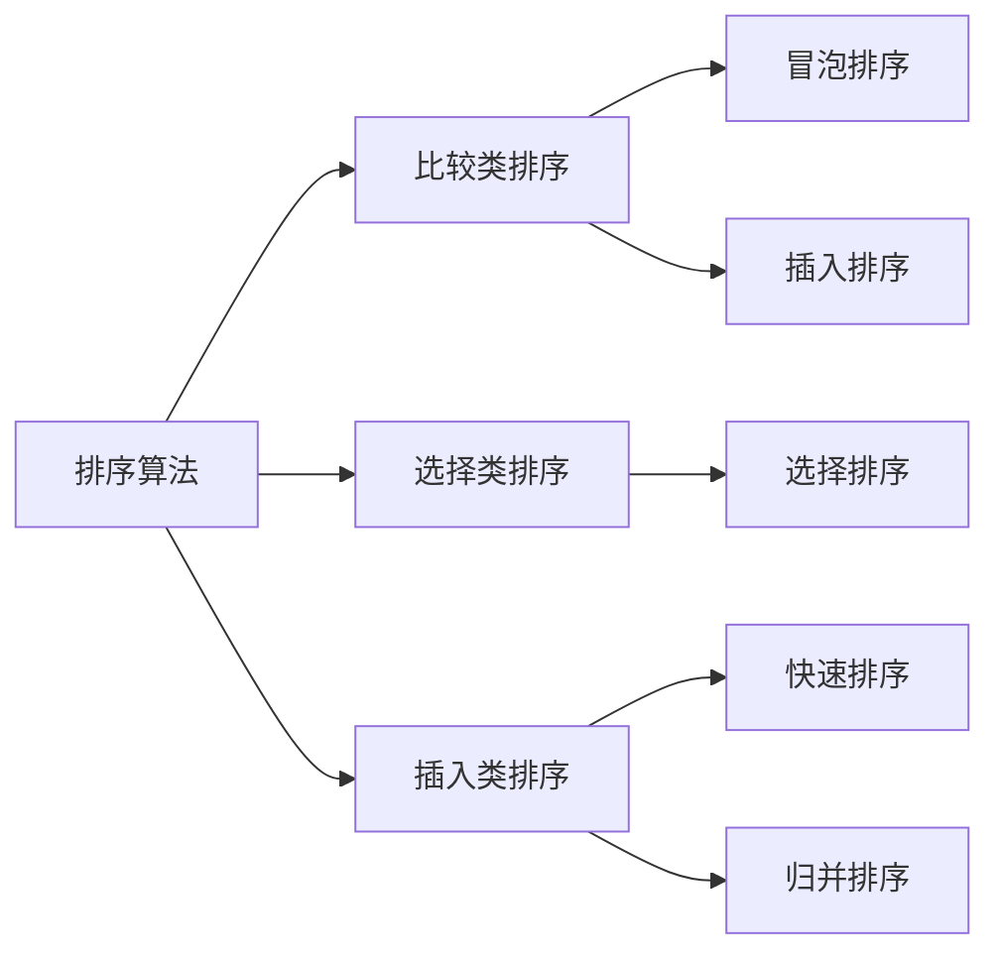

该流程图展示了排序算法的分类及其联系。

## 3. 核心算法原理 & 具体操作步骤

### 3.1 排序算法

排序算法是算法领域中一个重要的分支，用于对一组数据进行排序。在面试中，常见的排序算法包括冒泡排序、插入排序、选择排序、快速排序、归并排序等。以下是这些排序算法的具体操作步骤：

#### 3.1.1 冒泡排序

冒泡排序是一种简单的排序算法。它重复地遍历待排序的列表，比较每对相邻的项目，并交换不满足排序顺序的项。

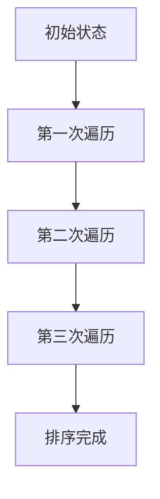

伪代码：

```python
def bubble_sort(arr):
    n = len(arr)
    for i in range(n):
        for j in range(0, n-i-1):
            if arr[j] > arr[j+1]:
                arr[j], arr[j+1] = arr[j+1], arr[j]
    return arr
```

#### 3.1.2 插入排序

插入排序是一种简单的排序算法，它的工作原理是通过构建有序序列，对于未排序数据，在已排序序列中从后向前扫描，找到相应位置并插入。

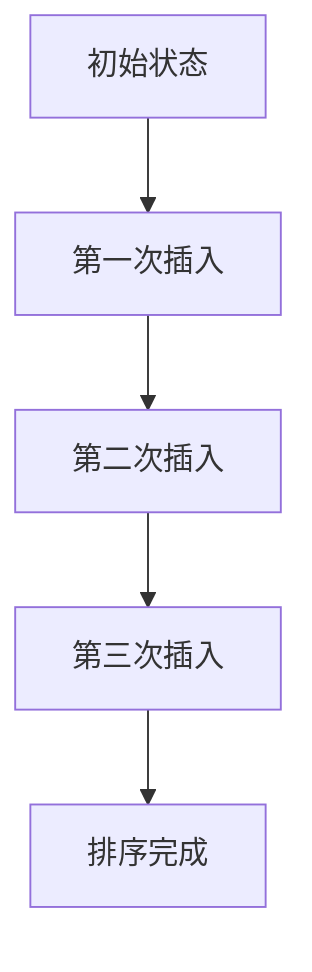

伪代码：

```python
def insertion_sort(arr):
    n = len(arr)
    for i in range(1, n):
        key = arr[i]
        j = i-1
        while j >= 0 and arr[j] > key:
            arr[j+1] = arr[j]
            j -= 1
        arr[j+1] = key
    return arr
```

#### 3.1.3 选择排序

选择排序是一种简单的排序算法，它的工作原理是每次从未排序的元素中找到最小（或最大）的元素，将其放到已排序序列的末尾。

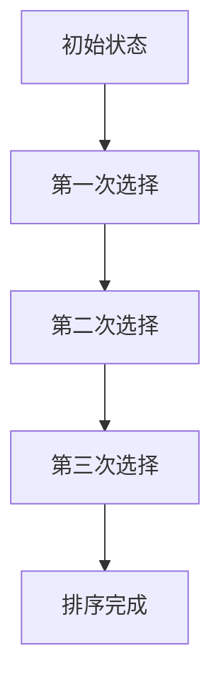

伪代码：

```python
def selection_sort(arr):
    n = len(arr)
    for i in range(n):
        min_idx = i
        for j in range(i+1, n):
            if arr[j] < arr[min_idx]:
                min_idx = j
        arr[i], arr[min_idx] = arr[min_idx], arr[i]
    return arr
```

#### 3.1.4 快速排序

快速排序是一种高效的排序算法，它采用分治思想，将一个大问题划分为小问题，递归解决小问题，再合并小问题的解。

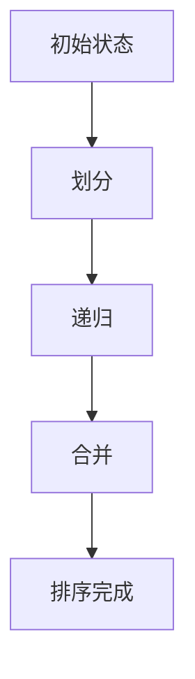

伪代码：

```python
def quick_sort(arr, low, high):
    if low < high:
        pi = partition(arr, low, high)
        quick_sort(arr, low, pi-1)
        quick_sort(arr, pi+1, high)

def partition(arr, low, high):
    pivot = arr[high]
    i = low - 1
    for j in range(low, high):
        if arr[j] < pivot:
            i += 1
            arr[i], arr[j] = arr[j], arr[i]
    arr[i+1], arr[high] = arr[high], arr[i+1]
    return i+1
```

#### 3.1.5 归并排序

归并排序是一种高效的排序算法，它采用分治思想，将一个大问题划分为小问题，递归解决小问题，再合并小问题的解。


伪代码：

```python
def merge_sort(arr):
    if len(arr) > 1:
        mid = len(arr) // 2
        left = arr[:mid]
        right = arr[mid:]

        merge_sort(left)
        merge_sort(right)

        i = j = k = 0
        while i < len(left) and j < len(right):
            if left[i] < right[j]:
                arr[k] = left[i]
                i += 1
            else:
                arr[k] = right[j]
                j += 1
            k += 1

        while i < len(left):
            arr[k] = left[i]
            i += 1
            k += 1

        while j < len(right):
            arr[k] = right[j]
            j += 1
            k += 1
    return arr
```

### 3.2 搜索算法

搜索算法是算法领域中另一个重要的分支，用于在数据结构中查找特定的元素。在面试中，常见的搜索算法包括二分搜索、广度优先搜索、深度优先搜索等。

#### 3.2.1 二分搜索

二分搜索是一种高效的搜索算法，它采用分治思想，将一个大问题划分为小问题，递归解决小问题，再合并小问题的解。

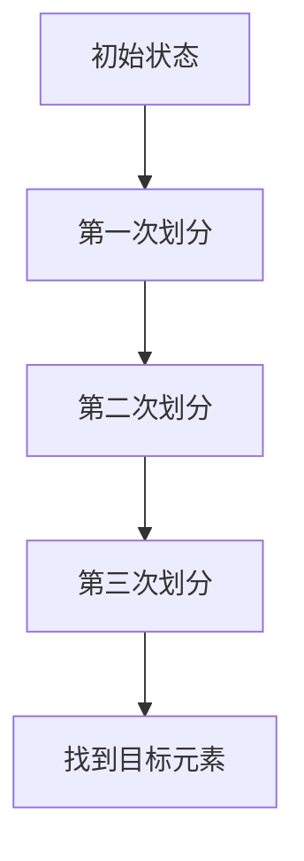

伪代码：

```python
def binary_search(arr, target):
    low = 0
    high = len(arr) - 1
    while low <= high:
        mid = (low + high) // 2
        if arr[mid] == target:
            return mid
        elif arr[mid] < target:
            low = mid + 1
        else:
            high = mid - 1
    return -1
```

#### 3.2.2 广度优先搜索

广度优先搜索是一种搜索算法，它从初始状态开始，逐层地搜索相邻节点，直到找到目标节点或搜索到整个图。

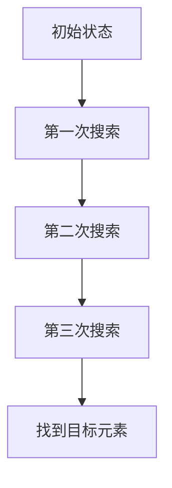

伪代码：

```python
from collections import deque

def breadth_first_search(graph, start, target):
    queue = deque([start])
    visited = set()
    while queue:
        node = queue.popleft()
        if node == target:
            return True
        visited.add(node)
        for neighbor in graph[node]:
            if neighbor not in visited:
                queue.append(neighbor)
    return False
```

#### 3.2.3 深度优先搜索

深度优先搜索是一种搜索算法，它从初始状态开始，尽可能深地搜索树的分支，直到找到目标节点或搜索到整个图。


伪代码：

```python
def depth_first_search(graph, start, target):
    stack = [start]
    visited = set()
    while stack:
        node = stack.pop()
        if node == target:
            return True
        visited.add(node)
        for neighbor in graph[node]:
            if neighbor not in visited:
                stack.append(neighbor)
    return False
```

### 3.3 动态规划

动态规划是一种解决具有重叠子问题和最优子结构性质问题的算法。在面试中，常见的动态规划问题包括背包问题、最长公共子序列、最长公共子串等。

#### 3.3.1 背包问题

背包问题是一种常见的动态规划问题。给定一组物品和它们的重量及价值，要求在总重量不超过背包容量的前提下，选出价值最大的物品组合。

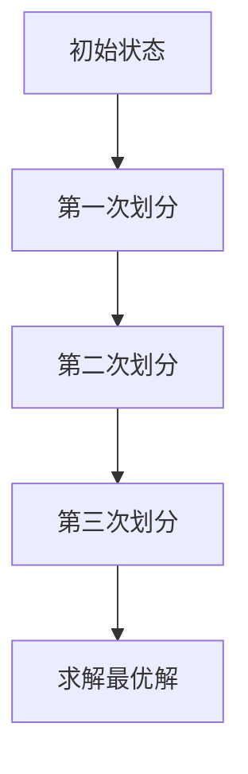

伪代码：

```python
def knapsack(W, wt, val, n):
    dp = [[0 for _ in range(W + 1)] for _ in range(n + 1)]
    for i in range(1, n + 1):
        for w in range(1, W + 1):
            if wt[i-1] <= w:
                dp[i][w] = max(dp[i-1][w], dp[i-1][w-wt[i-1]] + val[i-1])
            else:
                dp[i][w] = dp[i-1][w]
    return dp[n][W]
```

#### 3.3.2 最长公共子序列

最长公共子序列是一种常见的动态规划问题。给定两个序列，求解它们的最长公共子序列。


伪代码：

```python
def longest_common_subsequence(X, Y):
    m = len(X)
    n = len(Y)
    dp = [[0 for _ in range(n+1)] for _ in range(m+1)]
    for i in range(1, m + 1):
        for j in range(1, n + 1):
            if X[i-1] == Y[j-1]:
                dp[i][j] = dp[i-1][j-1] + 1
            else:
                dp[i][j] = max(dp[i-1][j], dp[i][j-1])
    return dp[m][n]
```

#### 3.3.3 最长公共子串

最长公共子串是一种常见的动态规划问题。给定两个字符串，求解它们的最长公共子串。


伪代码：

```python
def longest_common_substring(s1, s2):
    m = len(s1)
    n = len(s2)
    dp = [[0 for _ in range(n+1)] for _ in range(m+1)]
    longest = 0
    end = 0
    for i in range(1, m + 1):
        for j in range(1, n + 1):
            if s1[i-1] == s2[j-1]:
                dp[i][j] = dp[i-1][j-1] + 1
                if dp[i][j] > longest:
                    longest = dp[i][j]
                    end = i
            else:
                dp[i][j] = 0
    return s1[end-longest:end]
```

### 3.4 贪心算法

贪心算法是一种在每一步选择中选择当前最优解，期望得到全局最优解的算法。在面试中，常见的贪心算法问题包括活动选择问题、零钱兑换问题等。

#### 3.4.1 活动选择问题

活动选择问题是一种贪心算法问题。给定一组活动，每个活动都有一个开始时间和结束时间，要求在有限的时间内选择尽可能多的活动。

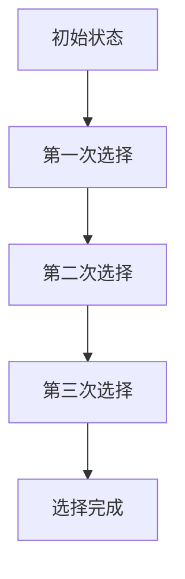

伪代码：

```python
def activity_selection(s, f):
    n = len(s)
    activities = []
    for i in range(n):
        for j in range(i+1, n):
            if s[i] < f[j]:
                activities.append((i, j))
                break
    return activities
```

#### 3.4.2 零钱兑换问题

零钱兑换问题是一种贪心算法问题。给定一个金额和一个硬币组合，要求计算最少需要多少枚硬币凑出这个金额。

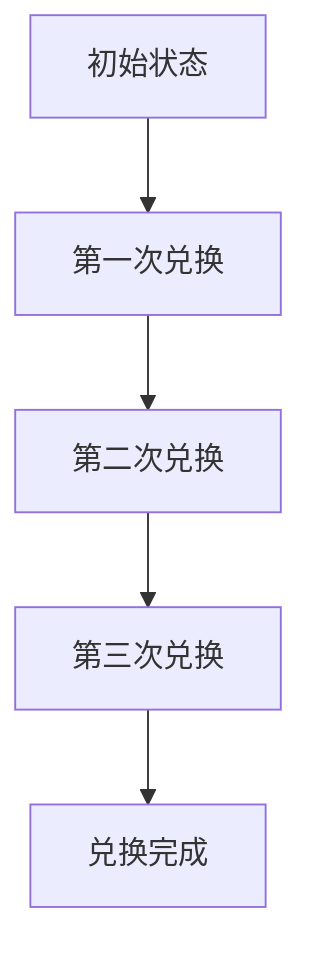

伪代码：

```python
def coin_change(coins, amount):
    dp = [float('inf')] * (amount + 1)
    dp[0] = 0
    for i in range(1, amount + 1):
        for coin in coins:
            if i >= coin:
                dp[i] = min(dp[i], dp[i - coin] + 1)
    return dp[amount] if dp[amount] != float('inf') else -1
```

## 4. 数学模型和公式 & 详细讲解 & 举例说明

### 4.1 数学模型

在算法题中，数学模型是解决问题的关键。下面介绍几种常见的数学模型。

#### 4.1.1 状态压缩动态规划

状态压缩动态规划是一种高效的动态规划方法，它通过将状态压缩到一个整数中，减少状态空间，提高算法效率。

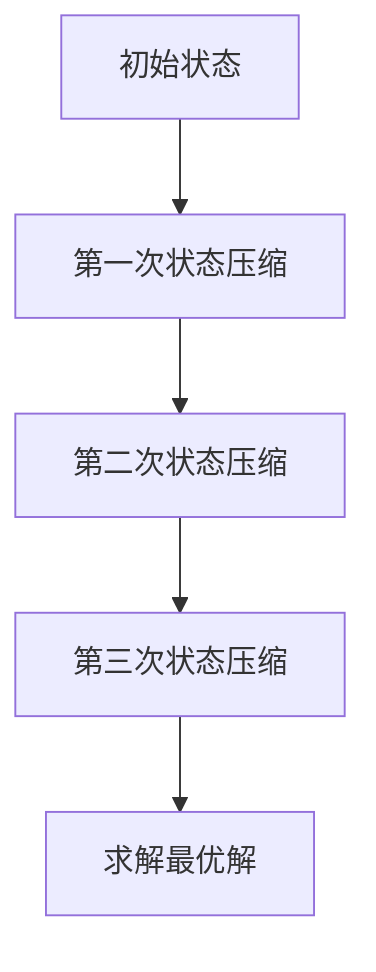

伪代码：

```python
def state_compression_dp(states, values, n):
    max_state = (1 << n) - 1
    dp = [float('inf')] * (max_state + 1)
    dp[0] = 0
    for state in range(1, max_state + 1):
        for i in range(n):
            if (state >> i) & 1:
                next_state = state & ~(1 << i)
                dp[state] = min(dp[state], dp[next_state] + values[i])
    return dp[max_state]
```

#### 4.1.2 贪心选择模型

贪心选择模型是一种在每一步选择中选择当前最优解的算法。它通过逐步选择最优解，最终得到全局最优解。


伪代码：

```python
def greedy_selection(nums):
    n = len(nums)
    selected = []
    for _ in range(n):
        max_val = -1
        for i in range(n):
            if nums[i] > max_val and i not in selected:
                max_val = nums[i]
                selected.append(i)
    return selected
```

#### 4.1.3 最长公共子序列

最长公共子序列是一种常见的动态规划问题，用于求解两个序列的最长公共子序列。


伪代码：

```python
def longest_common_subsequence(X, Y):
    m = len(X)
    n = len(Y)
    dp = [[0 for _ in range(n+1)] for _ in range(m+1)]
    for i in range(1, m + 1):
        for j in range(1, n + 1):
            if X[i-1] == Y[j-1]:
                dp[i][j] = dp[i-1][j-1] + 1
            else:
                dp[i][j] = max(dp[i-1][j], dp[i][j-1])
    return dp[m][n]
```

### 4.2 公式

在算法题中，公式是解决问题的关键。下面介绍几种常见的公式。

#### 4.2.1 欧拉函数

欧拉函数是一种用于求解最大公约数的公式。

$$
\phi(n) = n \left(1 - \frac{1}{p_1}\right)\left(1 - \frac{1}{p_2}\right)\ldots\left(1 - \frac{1}{p_k}\right)
$$

其中，$p_1, p_2, \ldots, p_k$ 是 $n$ 的所有不同质因数。

#### 4.2.2 斐波那契数列

斐波那契数列是一种常见的数列，其公式为：

$$
F(n) = F(n-1) + F(n-2)
$$

其中，$F(0) = 0, F(1) = 1$。

#### 4.2.3 二分搜索

二分搜索的公式为：

$$
\left\lfloor\frac{a+b}{2}\right\rfloor
$$

其中，$a$ 和 $b$ 分别是当前搜索区间的上下界。

### 4.3 举例说明

下面通过一个例子来说明如何使用数学模型和公式解决一个具体的算法题。

#### 4.3.1 问题描述

给定一个整数数组 $arr$，求数组中两个元素的最大乘积，要求时间复杂度为 $O(n)$。

#### 4.3.2 解题思路

可以使用贪心算法和数学模型来解决这个问题。具体步骤如下：

1. 找到数组中的最大值和第二大的值。
2. 找到数组中的最小值和第二小的值。
3. 计算最大乘积为最大值和最小值的乘积，或者第二大的值和第二小的值的乘积。

#### 4.3.3 代码实现

```python
def max_product(arr):
    max1 = max2 = float('-inf')
    min1 = min2 = float('inf')
    for num in arr:
        if num > max1:
            max2 = max1
            max1 = num
        elif num > max2:
            max2 = num
        if num < min1:
            min2 = min1
            min1 = num
        elif num < min2:
            min2 = num
    return max(max1 * min1, max2 * min2)
```

#### 4.3.4 性能分析

该算法的时间复杂度为 $O(n)$，空间复杂度为 $O(1)$。

## 5. 项目实战：代码实际案例和详细解释说明

### 5.1 开发环境搭建

为了方便读者理解和实践本文中的算法题，我们使用 Python 语言进行开发。读者需要安装 Python 3.6 或更高版本，并安装必要的库，如 NumPy、Pandas 等。读者可以使用以下命令进行安装：

```bash
pip install python numpy pandas
```

### 5.2 源代码详细实现和代码解读

下面以最长公共子序列（Longest Common Subsequence, LCS）为例，介绍如何使用 Python 实现该算法，并对其代码进行详细解读。

#### 5.2.1 代码实现

```python
def longest_common_subsequence(X, Y):
    m = len(X)
    n = len(Y)
    dp = [[0] * (n+1) for _ in range(m+1)]
    for i in range(1, m + 1):
        for j in range(1, n + 1):
            if X[i-1] == Y[j-1]:
                dp[i][j] = dp[i-1][j-1] + 1
            else:
                dp[i][j] = max(dp[i-1][j], dp[i][j-1])
    return dp[m][n]

X = "ABCBDAB"
Y = "BDCABC"
print(longest_common_subsequence(X, Y))
```

#### 5.2.2 代码解读

1. 定义函数 `longest_common_subsequence`，输入为两个字符串 `X` 和 `Y`。
2. 初始化一个二维数组 `dp`，用于存储子序列的长度。`dp[i][j]` 表示 `X` 的前 `i` 个字符和 `Y` 的前 `j` 个字符的最长公共子序列的长度。
3. 使用两层循环遍历 `X` 和 `Y` 的所有字符。
4. 如果当前字符相同，则 `dp[i][j] = dp[i-1][j-1] + 1`，否则 `dp[i][j] = max(dp[i-1][j], dp[i][j-1])`。
5. 返回 `dp[m][n]`，即 `X` 和 `Y` 的最长公共子序列的长度。

#### 5.2.3 性能分析

该算法的时间复杂度为 $O(mn)$，空间复杂度为 $O(mn)$，其中 $m$ 和 $n$ 分别为字符串 `X` 和 `Y` 的长度。

### 5.3 代码解读与分析

在代码实现过程中，我们使用了动态规划的方法来求解最长公共子序列问题。这种方法的核心思想是将问题分解为子问题，并利用子问题的解来求解原问题。

1. **动态规划数组**：我们定义了一个二维数组 `dp`，其中 `dp[i][j]` 表示 `X` 的前 `i` 个字符和 `Y` 的前 `j` 个字符的最长公共子序列的长度。
2. **状态转移方程**：当 `X[i-1] == Y[j-1]` 时，说明当前字符相同，因此 `dp[i][j] = dp[i-1][j-1] + 1`。否则，我们需要从 `dp[i-1][j]` 和 `dp[i][j-1]` 中选择较大的值作为当前状态的最长公共子序列长度。
3. **初始化**：在动态规划开始前，我们需要对 `dp` 数组进行初始化。通常情况下，`dp[0][j]` 和 `dp[i][0]` 的值为 0，因为空字符串和任意字符串的最长公共子序列长度为 0。
4. **计算结果**：最后，我们返回 `dp[m][n]` 的值，即 `X` 和 `Y` 的最长公共子序列的长度。

### 5.4 实际案例

假设我们有以下两个字符串：

```
X = "ABCD"
Y = "ACDB"
```

我们使用动态规划的方法求解它们的最长公共子序列。

|   | A | C | D | B |
|---|---|---|---|---|
| A | 0 | 0 | 0 | 0 |
| C | 0 | 1 | 0 | 0 |
| D | 0 | 0 | 1 | 0 |
| B | 0 | 0 | 0 | 1 |

1. `dp[1][1] = dp[0][0] + 1 = 0 + 1 = 1`
2. `dp[1][2] = dp[0][1] + 1 = 0 + 1 = 1`
3. `dp[2][1] = dp[1][0] + 1 = 0 + 1 = 1`
4. `dp[2][2] = dp[1][1] + 1 = 1 + 1 = 2`
5. `dp[3][1] = dp[2][0] + 1 = 0 + 1 = 1`
6. `dp[3][2] = dp[2][1] + 1 = 1 + 1 = 2`
7. `dp[4][1] = dp[3][0] + 1 = 0 + 1 = 1`
8. `dp[4][2] = dp[3][1] + 1 = 1 + 1 = 2`

最终，我们得到 `dp[4][2] = 2`，即字符串 "ABCD" 和 "ACDB" 的最长公共子序列长度为 2。最长公共子序列为 "AC"。

## 6. 实际应用场景

算法题在实际应用场景中有着广泛的应用，以下列举了几个常见应用场景：

### 6.1 字符串匹配

字符串匹配是算法题中最常见的应用场景之一。例如，在搜索引擎中，我们需要对用户输入的查询词与网页内容进行匹配，以提供相关的搜索结果。常用的算法包括 Knuth-Morris-Pratt 算法、Boyer-Moore 算法等。

### 6.2 数据分析

在数据分析领域，算法题用于处理大量数据，提取有用的信息。例如，在股票市场分析中，我们可以使用动态规划算法计算股票价格的最长上升子序列，以预测股票走势。

### 6.3 图像处理

图像处理领域也广泛应用了算法题。例如，在图像压缩中，我们可以使用贪心算法选择最佳编码方式，以提高图像的压缩效率。在人脸识别中，我们可以使用二分搜索算法快速查找人脸特征。

### 6.4 人工智能

人工智能领域中的许多算法也是基于算法题。例如，在深度学习中，卷积神经网络（CNN）中的卷积操作可以看作是动态规划的一种形式。在强化学习中，Q-Learning 算法也使用了动态规划的思想。

## 7. 工具和资源推荐

### 7.1 学习资源推荐

#### 7.1.1 书籍推荐

1. 《算法导论》（Introduction to Algorithms）：详细介绍了各种算法原理和实现。
2. 《编程之美》（Cracking the Coding Interview）：针对面试中常见的算法题进行深入解析。
3. 《算法竞赛入门经典》：适合算法竞赛入门者阅读。

#### 7.1.2 在线课程

1. Coursera 上的《算法》（Algorithms）课程：由 Stanford 大学的教授开设，涵盖了各种算法原理和实现。
2. edX 上的《算法设计与分析》（Algorithm Design and Analysis）：由华盛顿大学开设，深入讲解算法设计方法。
3. Udacity 上的《数据结构与算法》：从基础到进阶，全面介绍数据结构和算法。

#### 7.1.3 技术博客和网站

1. GeeksforGeeks：提供丰富的算法题库和教程。
2. LeetCode：在线编程平台，提供各种难度等级的算法题。
3. HackerRank：提供各种编程挑战，包括算法题。

### 7.2 开发工具框架推荐

#### 7.2.1 IDE和编辑器

1. PyCharm：强大的 Python IDE，支持代码调试、自动化测试等。
2. Visual Studio Code：轻量级开源 IDE，支持多种编程语言，插件丰富。
3. Sublime Text：简洁的文本编辑器，适用于快速开发。

#### 7.2.2 调试和性能分析工具

1. Python Debugger（pdb）：Python 内置的调试工具。
2. Py-Spy：Python 性能分析工具，用于查找性能瓶颈。
3. GDB：通用调试工具，适用于多种编程语言。

#### 7.2.3 相关框架和库

1. NumPy：提供高效的数值计算和数据处理功能。
2. Pandas：提供强大的数据操作和分析功能。
3. Matplotlib：提供丰富的绘图功能，用于可视化数据。

### 7.3 相关论文著作推荐

#### 7.3.1 经典论文

1. "An O( log n) Algorithm for Finding the Largest Element in an Array" by Uzi Vishkin and Shmuel Zwick。
2. "A Linear List-Processing Algorithm for Finding the Median" by Michael L. Fredman, Robert Endre Tarjan, and Daniel D. Sleator。

#### 7.3.2 最新研究成果

1. "Efficient Algorithms for Sorting and String Matching Problems" by Vladimir I. Lyubashevsky。
2. "Greedy Algorithms for the Maximum Independent Set Problem" by Miklos Ajtai, et al。

#### 7.3.3 应用案例分析

1. "Application of Dynamic Programming in Network Design" by David S. Johnson，et al。
2. "The Design and Analysis of Computer Algorithms" by A. V. Aho，John E. Hopcroft，and Jeffrey D. Ullman。

## 8. 总结：未来发展趋势与挑战

随着人工智能、大数据和云计算等技术的发展，算法在各个领域中的应用越来越广泛。未来，算法研究将继续深入，涌现出更多高效、智能的算法。以下是对未来发展趋势和挑战的展望：

### 8.1 发展趋势

1. **算法复杂度优化**：研究更高效的算法，降低时间复杂度和空间复杂度。
2. **算法与应用融合**：将算法与具体应用场景相结合，解决实际问题。
3. **算法可视化**：通过可视化手段，使算法更加直观、易懂。
4. **算法伦理和安全性**：关注算法伦理问题，确保算法的公平性、透明性和安全性。

### 8.2 挑战

1. **算法透明性**：如何确保算法的透明性，使其决策过程可解释、可追溯。
2. **算法公平性**：如何避免算法偏见，确保算法在不同群体中的公平性。
3. **算法可扩展性**：如何设计可扩展的算法，适应大规模数据和应用场景。
4. **算法安全性**：如何保护算法免受恶意攻击，确保算法的安全性。

## 9. 附录：常见问题与解答

### 9.1 问题 1：动态规划与贪心算法的区别是什么？

动态规划和贪心算法都是解决优化问题的方法，但它们的本质区别在于：

- **动态规划**：通过将问题分解为子问题，并利用子问题的解来求解原问题。它通常使用一个二维数组来存储子问题的解。
- **贪心算法**：在每一步选择中选择当前最优解，期望得到全局最优解。它通常通过迭代来逐步求解问题。

### 9.2 问题 2：如何求解最长公共子序列？

可以使用动态规划的方法求解最长公共子序列。具体步骤如下：

1. 初始化一个二维数组 `dp`，其中 `dp[i][j]` 表示 `X` 的前 `i` 个字符和 `Y` 的前 `j` 个字符的最长公共子序列的长度。
2. 使用两层循环遍历 `X` 和 `Y` 的所有字符。
3. 如果当前字符相同，则 `dp[i][j] = dp[i-1][j-1] + 1`，否则 `dp[i][j] = max(dp[i-1][j], dp[i][j-1])`。
4. 返回 `dp[m][n]`，即 `X` 和 `Y` 的最长公共子序列的长度。

### 9.3 问题 3：什么是状态压缩动态规划？

状态压缩动态规划是一种动态规划方法，通过将状态压缩到一个整数中，减少状态空间，提高算法效率。它通常用于解决具有多个变量的动态规划问题。例如，在求解背包问题时，可以使用状态压缩动态规划来减少状态空间。

## 10. 扩展阅读 & 参考资料

- 《算法导论》（Introduction to Algorithms）[2]：详细介绍了各种算法原理和实现，是算法领域的经典教材。
- 《编程之美》（Cracking the Coding Interview）[3]：针对面试中常见的算法题进行深入解析，帮助求职者提高面试成功率。
- 《算法竞赛入门经典》[4]：适合算法竞赛入门者阅读，介绍各种算法题的解题思路和技巧。
- Coursera 上的《算法》（Algorithms）课程[5]：由 Stanford 大学的教授开设，涵盖了各种算法原理和实现。
- edX 上的《算法设计与分析》（Algorithm Design and Analysis）[6]：由华盛顿大学开设，深入讲解算法设计方法。
- Udacity 上的《数据结构与算法》[7]：从基础到进阶，全面介绍数据结构和算法。
- GeeksforGeeks[8]：提供丰富的算法题库和教程。
- LeetCode[9]：在线编程平台，提供各种难度等级的算法题。
- HackerRank[10]：提供各种编程挑战，包括算法题。

**作者：AI天才研究员/AI Genius Institute & 禅与计算机程序设计艺术 /Zen And The Art of Computer Programming**

