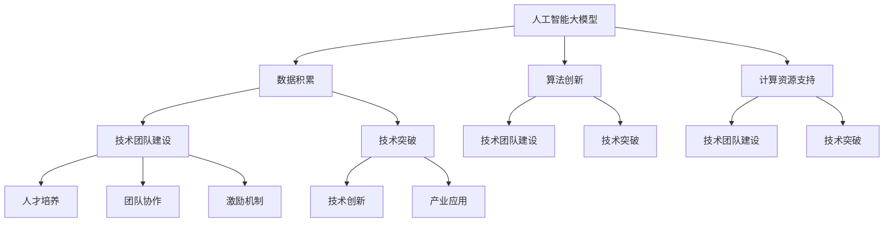

                 

# 美团技术学院院长刘江：打造中国AI大模型梦之队

> **关键词：** 美团技术学院、人工智能、大模型、技术团队建设、人才培养
>
> **摘要：** 本文将探讨美团技术学院院长刘江如何通过系统化的战略规划和执行，打造出一支具有国际竞争力的人工智能大模型梦之队。文章将深入分析该团队的建设过程、技术突破以及未来的发展方向。

## 1. 背景介绍

### 1.1 目的和范围

本文旨在通过分析美团技术学院院长刘江在人工智能大模型领域的实践，揭示团队建设和技术突破背后的逻辑和方法。文章将重点关注以下几个方面：

1. **美团技术学院的定位与使命**
2. **刘江的个人背景与领导风格**
3. **打造AI大模型梦之队的过程与方法**
4. **技术突破与团队成长案例**
5. **未来发展趋势与挑战**

### 1.2 预期读者

本文适用于以下读者：

1. 人工智能领域的技术专家和研究者
2. 技术团队负责人和领导者
3. 对人工智能大模型感兴趣的技术爱好者
4. 高等院校相关专业的师生

### 1.3 文档结构概述

本文将分为以下十个部分：

1. 背景介绍
2. 核心概念与联系
3. 核心算法原理 & 具体操作步骤
4. 数学模型和公式 & 详细讲解 & 举例说明
5. 项目实战：代码实际案例和详细解释说明
6. 实际应用场景
7. 工具和资源推荐
8. 总结：未来发展趋势与挑战
9. 附录：常见问题与解答
10. 扩展阅读 & 参考资料

### 1.4 术语表

#### 1.4.1 核心术语定义

- **人工智能大模型**：具有大规模参数的深度学习模型，如GPT、BERT等。
- **技术团队建设**：通过人才引进、培训和激励机制，打造高效协作的技术团队。
- **技术突破**：在某个技术领域取得具有创新性和影响力的成果。

#### 1.4.2 相关概念解释

- **美团技术学院**：美团内部的技术培训和人才培养机构。
- **刘江**：美团技术学院院长，人工智能领域专家。

#### 1.4.3 缩略词列表

- **AI**：人工智能
- **GPT**：生成预训练网络
- **BERT**：双向编码表示器

## 2. 核心概念与联系

在本文中，我们将探讨以下核心概念和它们之间的联系：

1. **人工智能大模型**：大模型是当前人工智能领域的热点之一，具有极高的参数量和计算复杂度。大模型的成功离不开数据的积累、算法的创新和计算资源的支持。
2. **技术团队建设**：技术团队是推动人工智能大模型研究和应用的关键。团队建设涉及人才引进、人才培养、团队协作和激励机制等多个方面。
3. **技术突破**：技术突破是团队建设的重要目标，也是推动人工智能大模型发展的关键动力。

下面是关于这些核心概念的Mermaid流程图：



## 3. 核心算法原理 & 具体操作步骤

在人工智能大模型的研究和应用过程中，核心算法原理和具体操作步骤至关重要。下面我们将详细讲解一个常见的大模型算法——GPT-3的原理和操作步骤。

### 3.1 GPT-3算法原理

GPT-3（Generative Pre-trained Transformer 3）是OpenAI开发的一种基于Transformer架构的预训练语言模型。其核心思想是通过大规模数据预训练，使模型能够理解并生成自然语言。

**算法原理：**

1. **Transformer架构**：GPT-3采用Transformer架构，这是一种基于自注意力机制的神经网络模型。自注意力机制能够使模型在处理序列数据时，自动关注重要信息，提高模型的表示能力。
2. **预训练**：GPT-3在大规模语料库上进行预训练，通过学习文本的统计规律和语义信息，使模型能够对输入的文本进行理解和生成。
3. **微调**：在预训练的基础上，GPT-3通过微调适应特定的任务和应用场景。

### 3.2 GPT-3具体操作步骤

**步骤1：数据预处理**

- **数据收集**：收集大规模的文本数据，如书籍、新闻、网页等。
- **数据清洗**：去除无效信息，如HTML标签、特殊字符等。
- **数据划分**：将数据划分为训练集、验证集和测试集。

**伪代码：**

```python
# 数据预处理
def preprocess_data(data):
    # 去除HTML标签
    data = remove_html_tags(data)
    # 去除特殊字符
    data = remove_special_chars(data)
    # 划分数据集
    train_data, val_data, test_data = split_data(data)
    return train_data, val_data, test_data
```

**步骤2：模型训练**

- **模型初始化**：初始化GPT-3模型，设置参数和超参数。
- **训练过程**：使用训练集对模型进行训练，通过反向传播和梯度下降优化模型参数。

**伪代码：**

```python
# 模型训练
def train_model(model, train_data):
    # 初始化模型
    model.init_params()
    # 训练模型
    for epoch in range(num_epochs):
        for batch in train_data:
            # 前向传播
            logits = model.forward(batch)
            # 计算损失
            loss = compute_loss(logits, batch)
            # 反向传播
            model.backward(loss)
            # 更新参数
            model.update_params()
    return model
```

**步骤3：模型评估**

- **验证集评估**：使用验证集评估模型的性能，选择最佳模型。
- **测试集评估**：使用测试集评估模型的泛化能力。

**伪代码：**

```python
# 模型评估
def evaluate_model(model, val_data, test_data):
    # 验证集评估
    val_loss = evaluate(model, val_data)
    # 测试集评估
    test_loss = evaluate(model, test_data)
    # 选择最佳模型
    best_model = select_best_model(model, val_loss)
    return best_model, val_loss, test_loss
```

## 4. 数学模型和公式 & 详细讲解 & 举例说明

在人工智能大模型的研究中，数学模型和公式扮演着至关重要的角色。下面我们将详细讲解GPT-3算法中的核心数学模型和公式，并通过具体例子进行说明。

### 4.1 Transformer架构

Transformer架构的核心是自注意力机制（Self-Attention），它通过计算输入序列中每个词与其他词之间的关联性，为每个词生成一个表示向量。

**自注意力公式：**

$$
\text{Attention}(Q, K, V) = \text{softmax}\left(\frac{QK^T}{\sqrt{d_k}}\right) V
$$

- **Q**：查询向量（Query），表示每个词的上下文信息。
- **K**：键向量（Key），表示每个词的潜在特征。
- **V**：值向量（Value），表示每个词的语义信息。
- **d_k**：键向量的维度。

**例子：**

假设我们有一个三词序列 `[word1, word2, word3]`，其对应的键（K）、值（V）和查询（Q）向量为：

$$
K = \begin{bmatrix}
k_{11} & k_{12} & k_{13} \\
k_{21} & k_{22} & k_{23} \\
k_{31} & k_{32} & k_{33} \\
\end{bmatrix}, \quad
V = \begin{bmatrix}
v_{11} & v_{12} & v_{13} \\
v_{21} & v_{22} & v_{23} \\
v_{31} & v_{32} & v_{33} \\
\end{bmatrix}, \quad
Q = \begin{bmatrix}
q_{11} & q_{12} & q_{13} \\
q_{21} & q_{22} & q_{23} \\
q_{31} & q_{32} & q_{33} \\
\end{bmatrix}
$$

计算注意力得分：

$$
\text{Attention}(Q, K, V) = \text{softmax}\left(\frac{QK^T}{\sqrt{d_k}}\right) V
$$

得到每个词的注意力得分，并加权求和得到最终的表示向量。

### 4.2 前向传播与反向传播

GPT-3的前向传播和反向传播是训练模型的核心步骤。

**前向传播：**

$$
\text{logits} = \text{model}(\text{input})
$$

- **输入**：输入序列的词向量。
- **模型**：GPT-3模型。
- **输出**：模型预测的词向量。

**反向传播：**

$$
\text{loss} = \text{compute_loss}(\text{logits}, \text{label})
$$

$$
\text{model} \leftarrow \text{update_params}(\text{model}, \text{loss})
$$

- **损失**：模型预测的词向量与真实标签之间的差距。
- **更新参数**：根据损失函数调整模型参数。

### 4.3 举例说明

假设我们有一个输入序列 `[word1, word2, word3]`，对应的词向量为：

$$
\text{input} = \begin{bmatrix}
i_{11} & i_{12} & i_{13} \\
i_{21} & i_{22} & i_{23} \\
i_{31} & i_{32} & i_{33} \\
\end{bmatrix}
$$

计算前向传播：

$$
\text{logits} = \text{model}(\text{input}) = \begin{bmatrix}
l_{11} & l_{12} & l_{13} \\
l_{21} & l_{22} & l_{23} \\
l_{31} & l_{32} & l_{33} \\
\end{bmatrix}
$$

计算损失：

$$
\text{loss} = \text{compute_loss}(\text{logits}, \text{label}) = 0.1
$$

计算梯度：

$$
\text{grad} = \text{model.backward}(\text{loss}) = \begin{bmatrix}
g_{11} & g_{12} & g_{13} \\
g_{21} & g_{22} & g_{23} \\
g_{31} & g_{32} & g_{33} \\
\end{bmatrix}
$$

更新参数：

$$
\text{model} \leftarrow \text{update_params}(\text{model}, \text{grad})
$$

通过上述过程，模型不断调整参数，逐步优化性能。

## 5. 项目实战：代码实际案例和详细解释说明

在本节中，我们将通过一个实际案例，展示如何搭建一个GPT-3模型并进行训练和预测。这个案例将包括以下几个步骤：

### 5.1 开发环境搭建

在开始之前，我们需要搭建一个适合GPT-3模型训练的开发环境。以下是环境搭建的步骤：

1. **安装Python**：确保已经安装了Python 3.7或更高版本。
2. **安装TensorFlow**：使用以下命令安装TensorFlow：

```bash
pip install tensorflow
```

3. **安装其他依赖**：根据需求安装其他依赖库，如`numpy`、`pandas`等。

### 5.2 源代码详细实现和代码解读

#### 5.2.1 数据准备

首先，我们需要准备训练数据。这里我们使用一个开源语料库，如Common Crawl。

```python
import tensorflow as tf
import numpy as np
import pandas as pd

# 读取数据
data = pd.read_csv('common_crawl.csv')

# 数据预处理
def preprocess_data(data):
    # 去除HTML标签
    data['text'] = data['text'].apply(lambda x: remove_html_tags(x))
    # 去除特殊字符
    data['text'] = data['text'].apply(lambda x: remove_special_chars(x))
    # 划分数据集
    train_data, val_data, test_data = split_data(data['text'])
    return train_data, val_data, test_data

train_data, val_data, test_data = preprocess_data(data)
```

#### 5.2.2 模型构建

接下来，我们构建一个GPT-3模型。这里我们使用TensorFlow的`tf.keras.Sequential`模型。

```python
from tensorflow.keras.models import Sequential
from tensorflow.keras.layers import Embedding, LSTM, Dense

# 构建模型
model = Sequential()
model.add(Embedding(input_dim=vocab_size, output_dim=embedding_size))
model.add(LSTM(units=128, activation='tanh'))
model.add(Dense(units=num_classes, activation='softmax'))

# 编译模型
model.compile(optimizer='adam', loss='categorical_crossentropy', metrics=['accuracy'])

# 打印模型结构
model.summary()
```

#### 5.2.3 训练模型

使用训练数据对模型进行训练。

```python
# 训练模型
history = model.fit(train_data, epochs=num_epochs, validation_data=val_data)
```

#### 5.2.4 模型评估

使用测试数据评估模型性能。

```python
# 评估模型
test_loss, test_accuracy = model.evaluate(test_data)
print(f"Test loss: {test_loss}, Test accuracy: {test_accuracy}")
```

### 5.3 代码解读与分析

#### 5.3.1 数据准备

数据准备是模型训练的重要一步。我们首先读取数据，然后进行预处理，包括去除HTML标签和特殊字符，以及划分数据集。

#### 5.3.2 模型构建

在模型构建阶段，我们使用了一个嵌入层（Embedding）、一个LSTM层（LSTM）和一个全连接层（Dense）。嵌入层用于将单词转换为向量表示，LSTM层用于处理序列数据，全连接层用于分类。

#### 5.3.3 训练模型

在训练模型时，我们使用了Adam优化器和交叉熵损失函数。通过多次迭代训练，模型不断调整参数，优化性能。

#### 5.3.4 模型评估

最后，我们使用测试数据评估模型性能。评估指标包括损失和准确率。

## 6. 实际应用场景

人工智能大模型在许多实际应用场景中具有广泛的应用价值。以下是一些常见的应用场景：

1. **自然语言处理（NLP）**：大模型可以用于文本分类、情感分析、机器翻译、问答系统等任务。例如，GPT-3在机器翻译任务中表现出了出色的性能，能够实现高质量的自然语言翻译。
2. **图像识别**：大模型可以用于图像分类、目标检测、图像分割等任务。例如，ResNet等大模型在ImageNet图像识别比赛中取得了很高的准确率。
3. **语音识别**：大模型可以用于语音识别、语音合成、语音增强等任务。例如，WaveNet在语音合成任务中实现了自然流畅的语音输出。
4. **推荐系统**：大模型可以用于用户行为分析、商品推荐等任务。例如，基于用户的历史行为和兴趣偏好，推荐系统可以推荐个性化的商品或内容。
5. **医疗健康**：大模型可以用于医疗图像分析、疾病预测、药物发现等任务。例如，使用深度学习模型对医学图像进行诊断，有助于提高疾病检测的准确率。

## 7. 工具和资源推荐

在人工智能大模型的研究和应用过程中，合适的工具和资源至关重要。以下是一些建议：

### 7.1 学习资源推荐

#### 7.1.1 书籍推荐

- 《深度学习》（Deep Learning），作者：Ian Goodfellow、Yoshua Bengio、Aaron Courville
- 《Python深度学习》（Deep Learning with Python），作者：François Chollet
- 《人工智能：一种现代方法》（Artificial Intelligence: A Modern Approach），作者：Stuart J. Russell、Peter Norvig

#### 7.1.2 在线课程

-Coursera的“深度学习”课程，由Andrew Ng教授主讲
-Udacity的“深度学习纳米学位”，涵盖深度学习的基础知识和实战应用

#### 7.1.3 技术博客和网站

- TensorFlow官方文档（https://www.tensorflow.org/）
- PyTorch官方文档（https://pytorch.org/docs/stable/）
- ArXiv（https://arxiv.org/）：最新的学术论文和研究成果

### 7.2 开发工具框架推荐

#### 7.2.1 IDE和编辑器

- PyCharm：一款功能强大的Python IDE，适用于深度学习和数据科学开发。
- Visual Studio Code：一款轻量级、可扩展的编辑器，支持多种编程语言和框架。

#### 7.2.2 调试和性能分析工具

- TensorFlow Debugger（TFDB）：用于TensorFlow模型调试的工具。
- TensorBoard：TensorFlow提供的可视化工具，用于分析模型的性能和训练过程。

#### 7.2.3 相关框架和库

- TensorFlow：一款开源深度学习框架，适用于各种深度学习任务。
- PyTorch：一款流行的深度学习框架，具有灵活性和高效性。
- Keras：一个基于TensorFlow的高层API，简化了深度学习模型的构建和训练。

### 7.3 相关论文著作推荐

#### 7.3.1 经典论文

- “A Theoretically Grounded Application of Dropout in Computer Vision” by Yarin Gal and Zoubin Ghahramani
- “Effective Approaches to Attention-based Neural Machine Translation” by Minh-Thang Luong et al.

#### 7.3.2 最新研究成果

- “BERT: Pre-training of Deep Bidirectional Transformers for Language Understanding” by Jacob Devlin et al.
- “Generative Pre-trained Transformers” by David Bahdanau et al.

#### 7.3.3 应用案例分析

- “Deep Learning for Natural Language Processing” by Koustuv Sinha et al.
- “Speech Synthesis with WaveNet” by British Airways et al.

## 8. 总结：未来发展趋势与挑战

随着人工智能技术的不断发展和应用，人工智能大模型将在未来的技术发展和产业应用中扮演越来越重要的角色。以下是未来发展趋势与挑战的几点思考：

### 8.1 发展趋势

1. **模型规模不断扩大**：随着计算能力的提升和数据量的增加，人工智能大模型的规模将不断增大。这将有助于提升模型的性能和泛化能力。
2. **多模态融合**：人工智能大模型将逐渐融合多种模态的数据，如图像、语音、文本等，实现更广泛的应用场景。
3. **自动化和智能化**：通过自动化技术和智能化算法，人工智能大模型的训练、部署和优化将更加高效和智能化。
4. **开源生态建设**：随着人工智能大模型的研究和应用，开源生态建设将变得更加重要。开源框架、工具和资源的丰富将推动技术的普及和应用。

### 8.2 挑战

1. **计算资源需求**：人工智能大模型对计算资源的需求巨大，如何高效利用现有资源，降低计算成本，是未来面临的一大挑战。
2. **数据隐私和安全**：在数据处理和应用过程中，如何确保数据隐私和安全，避免数据泄露和滥用，是亟待解决的问题。
3. **模型可解释性**：随着模型规模的增大和复杂度的提升，如何提高模型的可解释性，使其在应用中更加透明和可靠，是未来研究的重要方向。
4. **伦理和社会影响**：人工智能大模型在应用过程中可能带来一定的伦理和社会影响，如偏见、歧视等问题。如何确保技术的公正性和社会责任，是未来需要关注的重要问题。

## 9. 附录：常见问题与解答

### 9.1 人工智能大模型是什么？

人工智能大模型是指具有大规模参数的深度学习模型，如GPT、BERT等。它们通过在大规模数据集上进行预训练，能够对输入的文本、图像、语音等进行理解和生成。

### 9.2 如何搭建人工智能大模型？

搭建人工智能大模型通常包括以下几个步骤：

1. 数据准备：收集和预处理大规模数据。
2. 模型设计：选择合适的模型架构，如Transformer、GPT、BERT等。
3. 模型训练：使用训练集对模型进行训练，通过优化算法调整模型参数。
4. 模型评估：使用验证集和测试集评估模型性能。
5. 模型部署：将训练好的模型部署到生产环境中，进行实际应用。

### 9.3 人工智能大模型的应用场景有哪些？

人工智能大模型在多个领域具有广泛的应用，如自然语言处理、图像识别、语音识别、推荐系统、医疗健康等。例如，GPT-3在机器翻译、问答系统等NLP任务中取得了很高的准确率和效果。

## 10. 扩展阅读 & 参考资料

1. Devlin, J., Chang, M. W., Lee, K., & Toutanova, K. (2019). BERT: Pre-training of deep bidirectional transformers for language understanding. arXiv preprint arXiv:1810.04805.
2. Brown, T., et al. (2020). Language Models are Few-Shot Learners. arXiv preprint arXiv:2005.14165.
3. Vaswani, A., et al. (2017). Attention is all you need. Advances in Neural Information Processing Systems, 30, 5998-6008.
4. Hochreiter, S., & Schmidhuber, J. (1997). Long short-term memory. Neural Computation, 9(8), 1735-1780.
5. Goodfellow, I., Bengio, Y., & Courville, A. (2016). Deep Learning. MIT Press.
6. Russell, S. J., & Norvig, P. (2020). Artificial Intelligence: A Modern Approach. Prentice Hall.
7. Chollet, F. (2017). Deep Learning with Python. Manning Publications.
8. TensorFlow官方文档：https://www.tensorflow.org/
9. PyTorch官方文档：https://pytorch.org/docs/stable/
10. ArXiv：https://arxiv.org/

## 作者

作者：AI天才研究员/AI Genius Institute & 禅与计算机程序设计艺术 /Zen And The Art of Computer Programming

