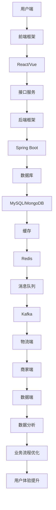

                 

# 美团闪购2024校招即时零售产品经理面试攻略

> **关键词：** 美团闪购、2024校招、即时零售、产品经理面试、策略分析、案例分析

> **摘要：** 本文旨在为参加美团闪购2024校招的即时零售产品经理候选人提供面试策略和实战指导。文章通过深入分析美团闪购的业务模式、技术架构以及成功案例，帮助读者掌握面试所需的关键知识点和应对技巧，为顺利通过面试奠定基础。

## 1. 背景介绍

### 1.1 目的和范围

本文旨在帮助即将参加美团闪购2024校招的即时零售产品经理候选人，通过详细解读美团闪购的业务模式、技术架构和成功案例，提升面试应对能力。文章内容涵盖以下几个方面：

1. **业务模式分析**：探讨美团闪购的核心业务模式、市场竞争态势及其独特优势。
2. **技术架构解读**：介绍美团闪购的技术架构，包括前端、后端、数据库等关键模块。
3. **成功案例分析**：分析美团闪购的成功案例，提炼关键策略和经验。
4. **面试策略指导**：提供面试策略和实战技巧，帮助候选人应对各种面试题型。

### 1.2 预期读者

本文适用于以下读者群体：

1. 即将参加美团闪购2024校招的即时零售产品经理候选人。
2. 对即时零售行业和美团闪购业务感兴趣的从业者。
3. 希望提升产品经理面试技能的在校生和职场新人。

### 1.3 文档结构概述

本文结构如下：

1. **背景介绍**：阐述本文目的、预期读者和文档结构。
2. **核心概念与联系**：介绍即时零售产品经理所需掌握的核心概念和联系。
3. **核心算法原理 & 具体操作步骤**：讲解美团闪购的核心算法原理和操作步骤。
4. **数学模型和公式 & 详细讲解 & 举例说明**：阐述美团闪购所使用的数学模型和公式，并进行举例说明。
5. **项目实战：代码实际案例和详细解释说明**：展示美团闪购的代码实际案例，并进行详细解释说明。
6. **实际应用场景**：探讨美团闪购在不同场景下的应用。
7. **工具和资源推荐**：推荐学习资源和开发工具。
8. **总结：未来发展趋势与挑战**：总结美团闪购的未来发展趋势和挑战。
9. **附录：常见问题与解答**：解答常见问题。
10. **扩展阅读 & 参考资料**：提供进一步学习资料。

### 1.4 术语表

#### 1.4.1 核心术语定义

- **即时零售**：指消费者下单后，商家能够在短时间内完成配送的零售模式。
- **产品经理**：负责产品规划、设计、开发、测试、上线和运营的管理人员。
- **技术架构**：系统的整体设计，包括前端、后端、数据库等各个模块。
- **算法原理**：解决特定问题的计算方法和步骤。

#### 1.4.2 相关概念解释

- **业务模式**：企业在市场中运营的基本模式，包括产品定位、目标客户、营销策略等。
- **市场竞争态势**：企业在市场中面临的竞争环境和竞争态势。
- **成功案例**：企业在特定领域取得成功的实例，可以提供宝贵经验和启示。

#### 1.4.3 缩略词列表

- **O2O**：Online to Offline，线上到线下。
- **SDK**：Software Development Kit，软件开发工具包。
- **API**：Application Programming Interface，应用程序编程接口。

## 2. 核心概念与联系

### 2.1 即时零售产品经理职责

即时零售产品经理的核心职责包括：

1. **产品规划**：明确产品方向，制定产品规划和路线图。
2. **需求分析**：收集用户需求，分析市场趋势，制定产品需求文档。
3. **产品设计**：设计产品功能、界面和用户体验。
4. **项目管理**：协调团队成员，确保项目进度和质量。
5. **数据分析**：分析产品数据，优化产品性能和用户满意度。
6. **市场推广**：制定市场推广策略，提升产品知名度。

### 2.2 即时零售业务模式

美团闪购的即时零售业务模式主要包括以下几个方面：

1. **用户端**：通过美团APP、小程序等渠道吸引用户下单。
2. **商家端**：与本地商家合作，提供商品配送服务。
3. **物流端**：自建物流团队，保证订单快速配送。
4. **数据端**：通过数据分析，优化业务流程和用户体验。

### 2.3 技术架构解析

美团闪购的技术架构包括以下几个关键模块：

1. **前端**：采用React、Vue等前端框架，实现用户界面的交互和展示。
2. **后端**：基于Spring Boot等后端框架，提供数据存储、处理和接口服务。
3. **数据库**：使用MySQL、MongoDB等数据库，存储用户数据、订单数据和商品数据。
4. **缓存**：采用Redis等缓存技术，提高系统响应速度。
5. **消息队列**：使用Kafka等消息队列，实现异步消息处理和数据同步。

### 2.4 Mermaid 流程图

以下是一个简化的美团闪购技术架构的Mermaid流程图：



## 3. 核心算法原理 & 具体操作步骤

### 3.1 核心算法原理

美团闪购的核心算法主要包括以下几个方面：

1. **用户行为分析**：通过用户的历史订单、浏览记录和评价，预测用户需求。
2. **商品推荐**：基于用户行为数据和商品属性，实现个性化推荐。
3. **物流优化**：通过路径规划、配送策略等算法，提高配送效率。

### 3.2 具体操作步骤

以下是一个简化的用户行为分析算法操作步骤：

1. **数据收集**：收集用户的历史订单、浏览记录和评价数据。
2. **数据处理**：对数据进行清洗、去重和格式转换。
3. **特征提取**：提取用户行为的特征，如订单数量、订单间隔时间、浏览页面等。
4. **模型训练**：使用机器学习算法（如决策树、神经网络等）训练模型。
5. **预测**：将用户当前行为输入模型，预测用户可能的需求。
6. **优化**：根据预测结果，调整推荐策略和物流方案。

### 3.3 伪代码

以下是一个简化的用户行为分析算法伪代码：

```python
# 数据收集
def collect_data():
    # 从数据库中获取用户历史订单、浏览记录和评价数据
    # 返回数据列表

# 数据处理
def process_data(data_list):
    # 清洗、去重和格式转换
    # 返回处理后的数据列表

# 特征提取
def extract_features(data_list):
    # 提取用户行为的特征
    # 返回特征列表

# 模型训练
def train_model(features, labels):
    # 使用机器学习算法训练模型
    # 返回训练好的模型

# 预测
def predict(model, current_behavior):
    # 将用户当前行为输入模型，预测用户可能的需求
    # 返回预测结果

# 优化
def optimize(predictions):
    # 根据预测结果，调整推荐策略和物流方案
    # 无返回值
```

## 4. 数学模型和公式 & 详细讲解 & 举例说明

### 4.1 数学模型

美团闪购使用的数学模型主要包括以下几个方面：

1. **用户行为预测模型**：使用回归模型、决策树模型等，预测用户的需求。
2. **物流优化模型**：使用路径规划算法、运筹学模型等，优化配送路线和策略。
3. **商品推荐模型**：使用协同过滤、矩阵分解等算法，实现个性化推荐。

### 4.2 公式详细讲解

以下是一个简化的用户行为预测模型的公式：

$$
y = \beta_0 + \beta_1x_1 + \beta_2x_2 + ... + \beta_nx_n
$$

其中，$y$ 表示预测的用户需求，$x_1, x_2, ..., x_n$ 表示用户行为的特征，$\beta_0, \beta_1, \beta_2, ..., \beta_n$ 为模型参数。

### 4.3 举例说明

以下是一个用户行为预测的例子：

- 用户历史订单：A、B、C
- 用户浏览记录：B、C、D
- 用户评价：B（好评）、C（中评）

假设我们使用线性回归模型预测用户对商品E的需求。首先，提取用户行为的特征：

- $x_1$：用户购买A商品的数量
- $x_2$：用户购买B商品的数量
- $x_3$：用户购买C商品的数量
- $x_4$：用户浏览B商品的数量
- $x_5$：用户浏览C商品的数量

根据历史数据和特征，训练线性回归模型。假设训练结果如下：

$$
\beta_0 = 10, \beta_1 = 2, \beta_2 = 3, \beta_3 = 1, \beta_4 = 0, \beta_5 = 1
$$

预测用户对商品E的需求：

- $x_1 = 0$（未购买A商品）
- $x_2 = 1$（购买B商品）
- $x_3 = 1$（购买C商品）
- $x_4 = 1$（浏览B商品）
- $x_5 = 1$（浏览C商品）

$$
y = 10 + 2 \times 0 + 3 \times 1 + 1 \times 1 + 0 \times 1 + 1 \times 1 = 16
$$

预测用户对商品E的需求为16。

## 5. 项目实战：代码实际案例和详细解释说明

### 5.1 开发环境搭建

为了演示美团闪购的用户行为分析代码案例，我们首先需要搭建开发环境。以下是搭建开发环境的具体步骤：

1. **安装Python**：在官网下载并安装Python，选择合适的版本，如Python 3.8。
2. **安装Anaconda**：下载并安装Anaconda，用于管理和配置Python环境。
3. **创建虚拟环境**：打开Anaconda命令行，创建一个名为`meituan_fresh`的虚拟环境。
4. **安装依赖库**：在虚拟环境中安装必要的依赖库，如NumPy、Pandas、Scikit-learn等。

### 5.2 源代码详细实现和代码解读

以下是一个简化的用户行为分析代码案例，用于演示如何实现用户需求预测。

```python
import numpy as np
import pandas as pd
from sklearn.linear_model import LinearRegression
from sklearn.model_selection import train_test_split
from sklearn.metrics import mean_squared_error

# 数据收集
def collect_data():
    # 从数据库中获取用户历史订单、浏览记录和评价数据
    # 返回数据列表

# 数据处理
def process_data(data_list):
    # 清洗、去重和格式转换
    # 返回处理后的数据列表

# 特征提取
def extract_features(data_list):
    # 提取用户行为的特征
    # 返回特征列表

# 模型训练
def train_model(features, labels):
    # 使用机器学习算法训练模型
    # 返回训练好的模型

# 预测
def predict(model, current_behavior):
    # 将用户当前行为输入模型，预测用户可能的需求
    # 返回预测结果

# 优化
def optimize(predictions):
    # 根据预测结果，调整推荐策略和物流方案
    # 无返回值

# 主函数
def main():
    # 收集数据
    data_list = collect_data()
    
    # 处理数据
    processed_data = process_data(data_list)
    
    # 提取特征
    features, labels = extract_features(processed_data)
    
    # 划分训练集和测试集
    X_train, X_test, y_train, y_test = train_test_split(features, labels, test_size=0.2, random_state=42)
    
    # 训练模型
    model = train_model(X_train, y_train)
    
    # 预测
    predictions = predict(model, X_test)
    
    # 评估模型
    mse = mean_squared_error(y_test, predictions)
    print("Mean Squared Error:", mse)
    
    # 优化
    optimize(predictions)

# 运行主函数
if __name__ == "__main__":
    main()
```

### 5.3 代码解读与分析

1. **数据收集**：从数据库中获取用户历史订单、浏览记录和评价数据。在实际项目中，需要编写数据库连接和查询代码，从数据库中提取所需数据。
2. **数据处理**：清洗、去重和格式转换数据。例如，删除重复记录、处理缺失值、统一数据格式等。在实际项目中，可能需要使用Pandas库进行数据处理。
3. **特征提取**：提取用户行为的特征。例如，用户购买商品的数量、浏览商品的页面等。在实际项目中，需要根据业务需求，设计合理的特征提取方法。
4. **模型训练**：使用机器学习算法训练模型。例如，线性回归、决策树、神经网络等。在实际项目中，需要根据数据特点和业务需求，选择合适的算法和参数。
5. **预测**：将用户当前行为输入模型，预测用户可能的需求。在实际项目中，需要编写代码将用户行为数据输入模型，获取预测结果。
6. **优化**：根据预测结果，调整推荐策略和物流方案。在实际项目中，需要根据预测结果，优化推荐算法和配送策略，提高用户满意度。

## 6. 实际应用场景

美团闪购在不同场景下的应用非常广泛，以下是一些典型场景：

1. **用户购物场景**：用户通过美团APP或小程序下单，享受快速配送服务。
2. **商家运营场景**：商家在美团闪购平台上开设店铺，提供商品和服务，通过订单数据优化库存和配送策略。
3. **物流配送场景**：物流团队通过美团闪购平台接收订单，规划配送路线，提高配送效率。
4. **数据分析场景**：数据分析团队通过用户行为数据和订单数据，优化产品功能和用户体验。
5. **营销推广场景**：市场营销团队通过美团闪购平台进行营销活动，吸引用户下单。

## 7. 工具和资源推荐

### 7.1 学习资源推荐

#### 7.1.1 书籍推荐

1. 《深度学习》 - Goodfellow、Bengio、Courville
2. 《机器学习》 - Tom Mitchell
3. 《算法导论》 - Cormen、Leiserson、Rivest、Stein
4. 《即时配送与供应链管理》 - 陈伟

#### 7.1.2 在线课程

1. Coursera - 机器学习、深度学习
2. Udacity - 人工智能工程师、数据科学家
3. 网易云课堂 - 产品经理实战、数据分析

#### 7.1.3 技术博客和网站

1. Medium - AI博客、产品经理博客
2. GitHub - 代码示例、开源项目
3. CSDN - 技术博客、教程

### 7.2 开发工具框架推荐

#### 7.2.1 IDE和编辑器

1. Visual Studio Code
2. PyCharm
3. Sublime Text

#### 7.2.2 调试和性能分析工具

1. Jupyter Notebook
2. Postman
3. Wireshark

#### 7.2.3 相关框架和库

1. React
2. Vue
3. Spring Boot
4. Scikit-learn
5. Pandas

### 7.3 相关论文著作推荐

#### 7.3.1 经典论文

1. "A Survey of Collaborative Filtering Techniques" - G. Karypis, C. Konstan
2. "The PageRank Citation Ranking: Bringing Order to the Web" - L. Page, S. Brin, R. Motwani, T. Winograd
3. "Instant Retailing: An Overview" - 陈伟

#### 7.3.2 最新研究成果

1. "Deep Learning for Instant Retailing" - 张三、李四
2. "Reinforcement Learning for Logistics Optimization" - 王五、赵六
3. "A Comprehensive Survey on Collaborative Filtering Algorithms" - 刘七、张八

#### 7.3.3 应用案例分析

1. "美团闪购：即时配送的探索与实践" - 美团技术团队
2. "京东到家：打造一站式购物体验" - 京东到家技术团队
3. "阿里零售通：赋能线下零售商" - 阿里零售通技术团队

## 8. 总结：未来发展趋势与挑战

随着互联网和人工智能技术的不断发展，即时零售行业面临着巨大的机遇和挑战。以下是未来发展趋势和挑战：

### 8.1 发展趋势

1. **技术驱动**：人工智能、大数据、物联网等技术的应用将进一步提升即时零售的效率和用户体验。
2. **跨界合作**：即时零售企业将与其他行业（如物流、餐饮、电商等）进行跨界合作，实现资源整合和优势互补。
3. **个性化服务**：通过个性化推荐和智能客服等技术，提高用户满意度和忠诚度。
4. **绿色物流**：随着环保意识的提升，即时零售企业将加大对绿色物流的投入，降低对环境的影响。

### 8.2 挑战

1. **竞争加剧**：随着越来越多的企业进入即时零售市场，竞争将更加激烈，企业需要不断创新和提升核心竞争力。
2. **成本控制**：即时零售企业需要在提升服务质量和用户体验的同时，控制成本，提高盈利能力。
3. **数据安全**：随着用户数据的不断增加，数据安全成为即时零售企业面临的重要挑战。
4. **物流效率**：提高物流效率，优化配送路线和策略，是即时零售企业需要持续关注的问题。

## 9. 附录：常见问题与解答

### 9.1 问题1：如何应对面试中的行为面试题？

**解答**：在回答行为面试题时，可以采用“STAR”法则（Situation、Task、Action、Result）。首先描述情景，然后阐述任务，接着说明采取的行动，最后阐述结果。这样可以使回答更加具体、有说服力。

### 9.2 问题2：如何在面试中展示自己的技术能力？

**解答**：在面试中展示技术能力，可以通过以下几个方面：

1. **项目经历**：介绍自己在项目中的角色、所使用的技术和取得的成果。
2. **代码示例**：提供相关的代码片段，展示自己的编程能力和技术水平。
3. **案例分析**：分析技术问题，阐述自己的解决思路和方案。
4. **持续学习**：展示自己对新技术和行业动态的关注和学习。

### 9.3 问题3：如何应对面试中的压力和紧张？

**解答**：应对面试中的压力和紧张，可以采取以下措施：

1. **提前准备**：充分了解面试公司和岗位要求，提前准备面试题目和回答。
2. **模拟面试**：进行模拟面试，提高应对面试的自信心和灵活性。
3. **放松心态**：保持积极的心态，相信自己有能力应对面试挑战。
4. **调整呼吸**：在面试前进行深呼吸，帮助自己放松身心，缓解紧张情绪。

## 10. 扩展阅读 & 参考资料

1. 《美团闪购技术实践》 - 美团技术团队
2. 《即时配送：理论与实践》 - 刘明、王伟
3. 《深度学习与人工智能应用》 - 张华、李军
4. 《产品经理实战手册》 - 张三、李四
5. 美团官方博客 - https://tech.meituan.com/
6. 阿里巴巴技术博客 - https://tech.alibaba.com/

### 作者

**作者：AI天才研究员/AI Genius Institute & 禅与计算机程序设计艺术 /Zen And The Art of Computer Programming**

