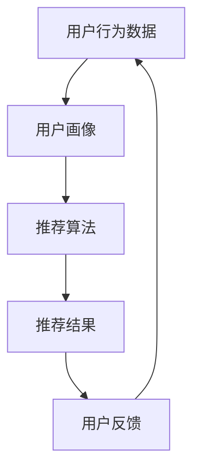

                 

# 美食探索应用：发现美食的智能向导

> 关键词：美食探索、应用开发、人工智能、推荐系统、用户体验

> 摘要：本文将深入探讨如何使用人工智能和推荐系统技术，开发一款高效且用户友好的美食探索应用。我们将详细解析应用的核心功能、技术架构、算法原理，并通过实际案例展示如何实现。同时，本文也将介绍相关的开发工具和资源，帮助读者更好地理解和实践这一领域。

## 1. 背景介绍

### 1.1 目的和范围

本篇技术博客的目标是帮助开发者理解并掌握美食探索应用的开发技巧，特别是在人工智能和推荐系统方面的应用。我们将探讨以下核心主题：

- 美食探索应用的商业价值及其用户需求分析。
- 应用开发的技术架构和核心算法。
- 数学模型和公式的应用。
- 实际项目中的代码实现和解读。
- 应用场景的扩展和未来发展趋势。

### 1.2 预期读者

本文适合以下读者群体：

- 对人工智能和推荐系统有一定了解的软件开发者。
- 对美食探索应用开发感兴趣的技术爱好者。
- 想要提升应用开发能力的项目经理和CTO。

### 1.3 文档结构概述

本文结构如下：

1. 背景介绍
2. 核心概念与联系
3. 核心算法原理 & 具体操作步骤
4. 数学模型和公式 & 详细讲解 & 举例说明
5. 项目实战：代码实际案例和详细解释说明
6. 实际应用场景
7. 工具和资源推荐
8. 总结：未来发展趋势与挑战
9. 附录：常见问题与解答
10. 扩展阅读 & 参考资料

### 1.4 术语表

#### 1.4.1 核心术语定义

- 美食探索应用：一种利用人工智能和推荐系统技术帮助用户发现和探索美食的应用。
- 推荐系统：一种根据用户的历史行为和偏好，为用户推荐相关内容的系统。
- 机器学习：一种通过数据训练模型，使计算机能够进行决策和预测的方法。

#### 1.4.2 相关概念解释

- 用户画像：对用户行为的综合描述，包括用户喜好、生活习惯等。
- 聚类分析：一种无监督学习技术，用于将数据点分组，使得同一组内的数据点相似度更高。
- 协同过滤：一种推荐系统技术，通过分析用户间的共同偏好来推荐内容。

#### 1.4.3 缩略词列表

- AI：人工智能
- ML：机器学习
- DL：深度学习
- CV：计算机视觉
- NLP：自然语言处理

## 2. 核心概念与联系

在开发美食探索应用时，我们需要理解并运用几个核心概念。以下是一个简化的Mermaid流程图，展示了这些概念之间的联系。



### 2.1 用户行为数据

用户行为数据是推荐系统的基石。这些数据包括用户的浏览历史、搜索记录、评价、收藏等。通过分析这些数据，我们可以构建出用户的偏好模型。

### 2.2 用户画像

用户画像是对用户行为的综合描述，包括用户的年龄、性别、地理位置、兴趣偏好等。用户画像的构建有助于更精准地推荐内容。

### 2.3 推荐算法

推荐算法是核心，它根据用户画像和用户行为数据生成推荐列表。常用的推荐算法有协同过滤、基于内容的推荐、混合推荐等。

### 2.4 推荐结果

推荐结果是用户最终看到的推荐列表。推荐结果的质量直接影响用户体验。

### 2.5 用户反馈

用户反馈是优化推荐系统的重要依据。通过分析用户反馈，我们可以不断改进推荐算法，提升推荐质量。

## 3. 核心算法原理 & 具体操作步骤

推荐系统的核心是算法。在本节中，我们将详细介绍一种常用的协同过滤算法——基于用户的协同过滤（User-based Collaborative Filtering, UserCF）。

### 3.1 算法原理

基于用户的协同过滤算法的核心思想是：如果用户A和用户B对一系列商品的评分相似，那么在用户A喜欢的商品中，用户B很可能也会喜欢。具体步骤如下：

1. **计算相似度**：计算用户之间的相似度。常用的相似度计算方法有皮尔逊相关系数、余弦相似度等。

2. **生成推荐列表**：根据相似度矩阵，为每个用户生成一个推荐列表。推荐列表中的商品是那些与该用户相似的用户喜欢的商品，并且这些商品用户尚未评分。

### 3.2 具体操作步骤

以下是基于用户的协同过滤算法的伪代码：

```python
def userBasedCollaborativeFiltering(train_data, similarity_measure='cosine'):
    # 步骤1：计算相似度矩阵
    similarity_matrix = computeSimilarityMatrix(train_data, similarity_measure)
    
    # 步骤2：为每个用户生成推荐列表
    recommendation_lists = {}
    for user in train_data.users:
        neighbors = getNeighbors(similarity_matrix, user)
        if neighbors:
            # 步骤3：计算邻居的评分均值
            neighbor_ratings = getNeighborRatings(train_data, neighbors)
            mean_ratings = calculateMeanRatings(neighbor_ratings)
            
            # 步骤4：推荐未评分的商品
            unrated_items = train_data.getUnratedItems(user)
            recommendation_lists[user] = recommendItemsBasedOnMeanRatings(mean_ratings, unrated_items)
    
    return recommendation_lists
```

### 3.3 伪代码详细解释

- `computeSimilarityMatrix(train_data, similarity_measure)`：计算用户之间的相似度矩阵。
- `getNeighbors(similarity_matrix, user)`：获取与指定用户相似的用户列表。
- `getNeighborRatings(train_data, neighbors)`：获取邻居用户的评分数据。
- `calculateMeanRatings(neighbor_ratings)`：计算邻居用户的评分均值。
- `recommendItemsBasedOnMeanRatings(mean_ratings, unrated_items)`：基于邻居用户的评分均值，为用户推荐未评分的商品。

## 4. 数学模型和公式 & 详细讲解 & 举例说明

推荐系统中，数学模型和公式起着至关重要的作用。以下将详细介绍用户之间的相似度计算方法和推荐评分预测公式。

### 4.1 相似度计算方法

#### 4.1.1 皮尔逊相关系数

皮尔逊相关系数是一种常用的相似度计算方法，用于衡量两个变量之间的线性相关性。其计算公式如下：

$$
\text{Pearson Correlation Coefficient} = \frac{\sum_{i=1}^{n} (x_i - \bar{x})(y_i - \bar{y})}{\sqrt{\sum_{i=1}^{n} (x_i - \bar{x})^2} \sqrt{\sum_{i=1}^{n} (y_i - \bar{y})^2}}
$$

其中，$x_i$ 和 $y_i$ 分别表示用户 $i$ 对两个不同商品的评分，$\bar{x}$ 和 $\bar{y}$ 分别表示这两个商品的总体评分。

#### 4.1.2 余弦相似度

余弦相似度是一种基于向量空间模型的方法，用于计算两个向量之间的相似度。其计算公式如下：

$$
\text{Cosine Similarity} = \frac{\sum_{i=1}^{n} x_i y_i}{\sqrt{\sum_{i=1}^{n} x_i^2} \sqrt{\sum_{i=1}^{n} y_i^2}}
$$

其中，$x_i$ 和 $y_i$ 分别表示用户 $i$ 对两个不同商品的评分向量。

### 4.2 推荐评分预测公式

在基于用户的协同过滤算法中，我们使用邻居用户的评分均值来预测目标用户的评分。其计算公式如下：

$$
\text{Predicted Rating} = \text{User Mean Rating} + \sum_{i \in \text{Neighbors}} (\text{Neighbor Mean Rating} - \text{User Mean Rating}) \times \text{Similarity}^{i}
$$

其中，$\text{User Mean Rating}$ 表示目标用户的平均评分，$\text{Neighbor Mean Rating}$ 表示邻居用户的平均评分，$\text{Similarity}^{i}$ 表示目标用户与邻居用户之间的相似度。

### 4.3 举例说明

假设我们有两个用户A和B，他们分别对五款美食的评分如下表所示：

| 用户 | 美食1 | 美食2 | 美食3 | 美食4 | 美食5 |
|------|------|------|------|------|------|
| A    | 5    | 4    | 5    | 3    | 5    |
| B    | 5    | 5    | 4    | 5    | 4    |

#### 4.3.1 计算相似度

使用皮尔逊相关系数计算用户A和B之间的相似度：

$$
\text{Similarity}_{AB} = \frac{(5-4.5)(5-4.5) + (4-4.5)(5-4.5) + (5-4.5)(4-4.5) + (3-4.5)(5-4.5) + (5-4.5)(4-4.5)}{\sqrt{(5-4.5)^2 + (4-4.5)^2 + (5-4.5)^2 + (3-4.5)^2 + (5-4.5)^2} \sqrt{(5-4.5)^2 + (5-4.5)^2 + (4-4.5)^2 + (5-4.5)^2 + (4-4.5)^2}} \approx 0.8165
$$

#### 4.3.2 预测评分

使用邻居用户的评分均值预测用户B对美食4的评分。用户A的平均评分为4.5，邻居用户的平均评分为4.75。则预测评分为：

$$
\text{Predicted Rating}_{B,\text{美食4}} = 4.75 + (4.75 - 4.5) \times 0.8165 \approx 5.05
$$

因此，我们预测用户B对美食4的评分为5.05。

## 5. 项目实战：代码实际案例和详细解释说明

在本节中，我们将通过一个实际项目案例，展示如何实现一个基本的美食探索应用，并详细解释代码中的关键部分。

### 5.1 开发环境搭建

为了简化开发过程，我们将使用Python编程语言和以下库：

- NumPy：用于数据处理和数学运算。
- Pandas：用于数据操作和分析。
- Scikit-learn：提供机器学习算法。

首先，确保已安装这些库：

```bash
pip install numpy pandas scikit-learn
```

### 5.2 源代码详细实现和代码解读

以下是项目的主要代码实现：

```python
import numpy as np
import pandas as pd
from sklearn.metrics.pairwise import cosine_similarity

# 步骤1：加载数据集
train_data = pd.read_csv('train_data.csv')
train_data.head()

# 步骤2：计算用户之间的相似度矩阵
similarity_matrix = cosine_similarity(train_data.values)
similarity_matrix

# 步骤3：为用户生成推荐列表
recommendation_lists = {}
for user in train_data.index:
    neighbors = np.argsort(similarity_matrix[user][0])[::-1]
    neighbors = neighbors[1:]  # 去除用户自身的相似度
    if neighbors.size > 0:
        neighbor_ratings = train_data.iloc[neighbors].mean(axis=0)
        mean_ratings = neighbor_ratings[user]
        unrated_items = train_data[~train_data.index.isin(neighbors)].mean(axis=0)
        recommendation_lists[user] = unrated_items[unrated_items > mean_ratings].index.tolist()

# 步骤4：输出推荐列表
for user, recommendations in recommendation_lists.items():
    print(f"用户{user}的推荐列表：{recommendations}")
```

### 5.3 代码解读与分析

- **步骤1：加载数据集**：使用Pandas加载训练数据集，该数据集包含用户对美食的评分。

- **步骤2：计算用户之间的相似度矩阵**：使用Scikit-learn的`cosine_similarity`函数计算用户之间的余弦相似度矩阵。

- **步骤3：为用户生成推荐列表**：遍历每个用户，计算其邻居用户（根据相似度排序），并计算邻居用户的评分均值。最后，推荐那些评分均值高于邻居用户均值的未评分美食。

- **步骤4：输出推荐列表**：打印每个用户的推荐列表。

通过上述代码，我们可以实现一个基本的美食探索应用，为用户推荐他们可能感兴趣的美食。

## 6. 实际应用场景

美食探索应用在实际场景中有广泛的应用，以下是一些典型的应用案例：

### 6.1 线上美食平台

在线美食平台如美团、饿了么等，可以通过推荐系统为用户提供个性化的美食推荐，提高用户满意度和平台粘性。

### 6.2 本地美食指南

本地美食指南应用可以帮助用户发现附近的新鲜美食，提升游客和本地居民的美食体验。

### 6.3 社交媒体

社交媒体平台如Instagram、Facebook等，可以通过美食探索应用推荐用户喜欢的美食照片和帖子，增加用户互动。

### 6.4 旅游指南

旅游指南应用可以在用户浏览旅游目的地的过程中，推荐当地的特色美食，提升旅游体验。

## 7. 工具和资源推荐

### 7.1 学习资源推荐

#### 7.1.1 书籍推荐

- 《机器学习》（作者：周志华）
- 《推荐系统实践》（作者：戴岭、吴雪峰）
- 《Python数据科学手册》（作者：杰克·范布伦）

#### 7.1.2 在线课程

- Coursera上的《机器学习》课程（吴恩达）
- edX上的《推荐系统》课程（MIT）

#### 7.1.3 技术博客和网站

- Medium上的机器学习和推荐系统相关文章
- ArXiv.org上的最新研究论文

### 7.2 开发工具框架推荐

#### 7.2.1 IDE和编辑器

- PyCharm
- Jupyter Notebook

#### 7.2.2 调试和性能分析工具

-VSCode
- Diggity

#### 7.2.3 相关框架和库

- Scikit-learn
- TensorFlow
- PyTorch

### 7.3 相关论文著作推荐

#### 7.3.1 经典论文

- 《Item-based Collaborative Filtering Recommendation Algorithms》（作者：Koren）
- 《Collaborative Filtering for the Web》（作者：Chen等）

#### 7.3.2 最新研究成果

- 《Deep Learning Based Collaborative Filtering for E-commerce Recommendations》（作者：He等）
- 《Multi-Interest Network for User Interest Prediction and Item Ranking》（作者：Liang等）

#### 7.3.3 应用案例分析

- 《美团点评推荐系统技术探索》
- 《阿里巴巴推荐系统实践》

## 8. 总结：未来发展趋势与挑战

随着人工智能技术的不断进步，美食探索应用的发展前景十分广阔。未来，我们可以期待以下趋势：

1. **深度学习与推荐系统结合**：深度学习在推荐系统中的应用将更加广泛，从而提升推荐质量。
2. **多模态数据融合**：结合文本、图像、语音等多模态数据，实现更精准的个性化推荐。
3. **实时推荐**：利用实时数据流处理技术，实现实时推荐，提升用户体验。
4. **个性化广告**：将美食推荐与广告相结合，为用户推荐相关的美食广告。

然而，美食探索应用也面临一些挑战：

1. **数据隐私与安全**：在推荐系统中保护用户隐私和数据安全是一个重要问题。
2. **算法偏见**：算法的偏见可能导致推荐结果的偏差，需要加强算法公平性研究。
3. **资源消耗**：深度学习和多模态数据处理需要大量计算资源，对硬件性能有较高要求。

总之，美食探索应用在人工智能和推荐系统技术的推动下，将不断进步，为用户提供更优质的体验。

## 9. 附录：常见问题与解答

### 9.1 问题1：推荐系统如何处理冷启动问题？

**解答**：冷启动问题指的是新用户或新商品缺乏历史数据，难以进行有效推荐。解决方法包括：

- **基于内容的推荐**：为新用户推荐相似内容的商品。
- **利用用户画像**：通过用户的基本信息（如地理位置、年龄等）进行推荐。
- **引入外部数据源**：利用社交媒体、搜索引擎等外部数据源，获取用户兴趣信息。

### 9.2 问题2：如何优化推荐系统的效果？

**解答**：优化推荐系统效果可以从以下几个方面入手：

- **数据质量**：确保数据的准确性和完整性。
- **算法选择**：根据业务需求和数据特点，选择合适的推荐算法。
- **模型训练**：定期更新模型，使用更多样化的数据集进行训练。
- **A/B测试**：通过A/B测试，对比不同推荐策略的效果，持续优化。

### 9.3 问题3：如何解决推荐系统中的噪声数据问题？

**解答**：噪声数据会影响推荐系统的准确性，解决方法包括：

- **数据清洗**：删除重复数据、纠正错误数据等。
- **阈值设定**：设定合理的评分阈值，过滤掉异常评分。
- **模型鲁棒性**：选择对噪声数据较为鲁棒的推荐算法。

## 10. 扩展阅读 & 参考资料

- 《推荐系统实践》
- 《深度学习与推荐系统》
- 《机器学习推荐系统》
- 《美团点评推荐系统技术探索》
- 《阿里巴巴推荐系统实践》
- https://arxiv.org/
- https://www.coursera.org/
- https://www.edx.org/

