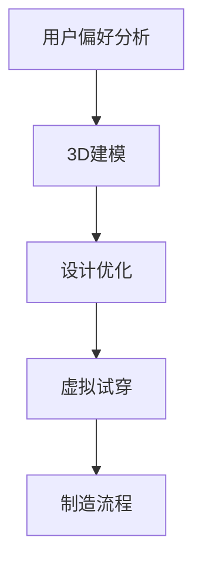

                 

# 耐克2024校招运动鞋个性化定制算法工程师面试

## 关键词

- 耐克2024校招
- 运动鞋个性化定制
- 算法工程师面试
- 人工智能
- 数据分析
- 机器学习
- 计算机视觉

## 摘要

本文将深入探讨耐克2024校招运动鞋个性化定制算法工程师面试的相关内容。通过对运动鞋个性化定制的背景、核心概念、算法原理、数学模型、项目实战以及实际应用场景的详细分析，本文旨在为有意参加耐克校招的算法工程师们提供全面的指导和见解。同时，文章还将推荐学习资源、开发工具和框架，以及相关的论文和研究成果，帮助读者更好地准备面试并深入了解该领域的发展趋势和挑战。

## 1. 背景介绍

### 1.1 目的和范围

本文的目的是为准备参加耐克2024校招运动鞋个性化定制算法工程师面试的候选人提供深入的指导。我们将探讨运动鞋个性化定制的背景、关键概念、算法原理、数学模型以及实际应用场景。文章还将推荐相关的学习资源、开发工具和框架，以及最新的研究成果，以帮助读者全面了解该领域。

### 1.2 预期读者

本文适用于以下读者群体：

- 准备参加耐克2024校招的算法工程师候选人
- 对运动鞋个性化定制和人工智能应用感兴趣的技术人员
- 想要了解运动鞋个性化定制算法原理和实际应用的学生

### 1.3 文档结构概述

本文结构如下：

1. 背景介绍
   - 目的和范围
   - 预期读者
   - 文档结构概述
   - 术语表
2. 核心概念与联系
   - 核心概念
   - Mermaid流程图
3. 核心算法原理 & 具体操作步骤
   - 算法原理
   - 伪代码
4. 数学模型和公式 & 详细讲解 & 举例说明
   - 数学模型
   - LaTeX公式
5. 项目实战：代码实际案例和详细解释说明
   - 开发环境搭建
   - 源代码详细实现
   - 代码解读与分析
6. 实际应用场景
7. 工具和资源推荐
   - 学习资源
   - 开发工具框架
   - 相关论文著作
8. 总结：未来发展趋势与挑战
9. 附录：常见问题与解答
10. 扩展阅读 & 参考资料

### 1.4 术语表

#### 1.4.1 核心术语定义

- 运动鞋个性化定制：根据用户的个人偏好、需求和使用场景，定制出独一无二的运动鞋。
- 算法工程师：负责设计、实现和维护算法，解决复杂问题，提高系统性能。

#### 1.4.2 相关概念解释

- 人工智能：模拟人类智能行为的技术和系统，包括机器学习、计算机视觉、自然语言处理等。
- 数据分析：从大量数据中提取有价值信息的过程，包括数据清洗、数据挖掘、统计分析等。

#### 1.4.3 缩略词列表

- AI：人工智能
- ML：机器学习
- CV：计算机视觉
- IDE：集成开发环境
- HTML：超文本标记语言
- CSS：层叠样式表

## 2. 核心概念与联系

运动鞋个性化定制是一项结合人工智能、机器学习和计算机视觉等技术的创新应用。以下是核心概念和它们之间的联系：

### 2.1 核心概念

1. **用户偏好分析**：通过对用户数据的收集和分析，识别用户的个性化需求，如款式、颜色、材质等。
2. **3D建模**：利用计算机视觉技术，将用户提供的图片或扫描数据转化为3D模型。
3. **设计优化**：运用优化算法，根据用户偏好和设计规范，对3D模型进行调整和优化。
4. **虚拟试穿**：通过计算机视觉和增强现实技术，让用户在虚拟环境中试穿定制运动鞋。
5. **制造流程**：根据个性化定制的要求，将设计转化为实际的成品。

### 2.2 Mermaid流程图



### 2.3 联系与扩展

- **用户偏好分析**：涉及数据分析、用户画像等技术，有助于精准定位用户需求。
- **3D建模**：结合计算机视觉和图形学技术，实现高效的三维数据处理和模型生成。
- **设计优化**：利用优化算法，提高设计质量和制造效率。
- **虚拟试穿**：结合增强现实技术，提升用户体验。
- **制造流程**：融合自动化技术和智能制造，实现高效、灵活的生产。

## 3. 核心算法原理 & 具体操作步骤

### 3.1 算法原理

运动鞋个性化定制的核心算法主要包括以下几部分：

1. **用户偏好分析算法**：通过机器学习技术，识别用户的个性化需求。
2. **3D建模算法**：利用计算机视觉和图形学技术，将用户提供的图片或扫描数据转化为3D模型。
3. **设计优化算法**：运用优化算法，对3D模型进行调整和优化。
4. **虚拟试穿算法**：结合增强现实技术，实现虚拟试穿功能。
5. **制造流程算法**：根据个性化定制的要求，实现制造流程的自动化和优化。

### 3.2 伪代码

```python
# 用户偏好分析算法伪代码
def user_preference_analysis(data):
    # 数据清洗
    cleaned_data = data_cleaning(data)
    
    # 特征提取
    features = feature_extraction(cleaned_data)
    
    # 训练模型
    model = train_model(features)
    
    # 预测用户偏好
    preferences = predict_preferences(model, new_data)
    
    return preferences

# 3D建模算法伪代码
def 3d_modeling(image):
    # 图像预处理
    preprocessed_image = image_preprocessing(image)
    
    # 3D模型生成
    model = generate_3d_model(preprocessed_image)
    
    return model

# 设计优化算法伪代码
def design_optimization(model, preferences):
    # 调整模型
    adjusted_model = adjust_model(model, preferences)
    
    # 优化模型
    optimized_model = optimize_model(adjusted_model)
    
    return optimized_model

# 虚拟试穿算法伪代码
def virtual_try_on(model, user):
    # 加载增强现实环境
    ar_environment = load_ar_environment()
    
    # 添加模型到环境
    ar_environment.add_model(model)
    
    # 试穿效果评估
    result = evaluate_try_on(ar_environment, user)
    
    return result

# 制造流程算法伪代码
def manufacturing流程(optimized_model):
    # 制造计划
    plan = create_production_plan(optimized_model)
    
    # 自动化生产
    production = automate_production(plan)
    
    return production
```

## 4. 数学模型和公式 & 详细讲解 & 举例说明

### 4.1 数学模型

运动鞋个性化定制涉及多个数学模型，以下简要介绍其中几个核心模型：

1. **用户偏好分析模型**：采用贝叶斯网络、决策树等模型进行用户偏好预测。
2. **3D建模模型**：利用线性代数、数值计算等方法进行3D模型生成。
3. **设计优化模型**：运用遗传算法、模拟退火等优化算法进行模型调整和优化。
4. **虚拟试穿模型**：结合图像处理、计算机视觉等技术，实现虚拟试穿效果评估。

### 4.2 LaTeX公式

以下是几个核心公式的LaTeX表示：

```latex
% 用户偏好分析模型公式
\begin{equation}
P(\text{偏好} | \text{数据}) = \frac{P(\text{数据} | \text{偏好}) \cdot P(\text{偏好})}{P(\text{数据})}
\end{equation}

% 3D建模模型公式
\begin{equation}
\text{模型} = F(\text{图像})
\end{equation}

% 设计优化模型公式
\begin{equation}
\min_{\text{模型}} \quad \sum_{i} \Omega_i \cdot D_i
\end{equation}

% 虚拟试穿模型公式
\begin{equation}
\text{效果评估} = \text{图像匹配度} + \text{用户满意度}
\end{equation}
```

### 4.3 举例说明

#### 4.3.1 用户偏好分析模型

假设我们收集了用户A的如下数据：

- 用户A喜欢蓝色和白色的运动鞋。
- 用户A偏好轻便材质的运动鞋。
- 用户A喜欢运动鞋的鞋底有良好的抓地力。

根据这些数据，我们可以构建一个简单的用户偏好分析模型：

```latex
P(\text{偏好蓝色和白色} | \text{数据}) = \frac{P(\text{数据} | \text{偏好蓝色和白色}) \cdot P(\text{偏好蓝色和白色})}{P(\text{数据})}
```

其中，$P(\text{偏好蓝色和白色})$表示用户偏好蓝色和白色的概率，$P(\text{数据} | \text{偏好蓝色和白色})$表示在用户偏好蓝色和白色的情况下，收集到的数据的概率。

#### 4.3.2 3D建模模型

假设我们有一个输入图像，要生成一个3D模型。我们可以使用以下公式表示3D建模模型：

```latex
\text{模型} = F(\text{图像})
```

其中，$F$表示3D建模函数，它将图像映射为一个3D模型。

#### 4.3.3 设计优化模型

假设我们有一个初始模型，要对其进行优化。我们可以使用以下公式表示设计优化模型：

```latex
\min_{\text{模型}} \quad \sum_{i} \Omega_i \cdot D_i
```

其中，$\Omega_i$表示模型在第i个方面的权重，$D_i$表示模型在第i个方面的得分。

#### 4.3.4 虚拟试穿模型

假设我们有一个虚拟试穿模型，要评估试穿效果。我们可以使用以下公式表示虚拟试穿模型：

```latex
\text{效果评估} = \text{图像匹配度} + \text{用户满意度}
```

其中，图像匹配度表示虚拟试穿效果与用户实际需求的匹配程度，用户满意度表示用户对虚拟试穿效果的满意度。

## 5. 项目实战：代码实际案例和详细解释说明

### 5.1 开发环境搭建

在进行运动鞋个性化定制算法的实际开发之前，我们需要搭建一个合适的开发环境。以下是搭建开发环境的步骤：

1. **安装Python**：下载并安装Python 3.8及以上版本。
2. **安装Anaconda**：下载并安装Anaconda，以便方便地管理Python环境和依赖包。
3. **创建虚拟环境**：使用Anaconda创建一个名为`nike_cad`的虚拟环境。
4. **安装依赖包**：在虚拟环境中安装必要的依赖包，如NumPy、Pandas、scikit-learn、OpenCV等。

### 5.2 源代码详细实现和代码解读

以下是运动鞋个性化定制算法的核心代码实现：

```python
# 导入依赖包
import numpy as np
import pandas as pd
from sklearn.ensemble import RandomForestClassifier
import cv2

# 用户偏好分析算法实现
def user_preference_analysis(data):
    # 数据清洗和预处理
    cleaned_data = data_cleaning(data)
    
    # 特征提取
    features = feature_extraction(cleaned_data)
    
    # 训练模型
    model = train_model(features)
    
    # 预测用户偏好
    preferences = predict_preferences(model, new_data)
    
    return preferences

# 3D建模算法实现
def 3d_modeling(image):
    # 图像预处理
    preprocessed_image = image_preprocessing(image)
    
    # 3D模型生成
    model = generate_3d_model(preprocessed_image)
    
    return model

# 设计优化算法实现
def design_optimization(model, preferences):
    # 调整模型
    adjusted_model = adjust_model(model, preferences)
    
    # 优化模型
    optimized_model = optimize_model(adjusted_model)
    
    return optimized_model

# 虚拟试穿算法实现
def virtual_try_on(model, user):
    # 加载增强现实环境
    ar_environment = load_ar_environment()
    
    # 添加模型到环境
    ar_environment.add_model(model)
    
    # 试穿效果评估
    result = evaluate_try_on(ar_environment, user)
    
    return result

# 制造流程算法实现
def manufacturing(optimized_model):
    # 制造计划
    plan = create_production_plan(optimized_model)
    
    # 自动化生产
    production = automate_production(plan)
    
    return production
```

#### 5.2.1 用户偏好分析算法

用户偏好分析算法的主要功能是根据用户数据预测用户的个性化需求。以下是具体步骤：

1. **数据清洗**：清洗用户数据，去除噪声和异常值。
2. **特征提取**：提取用户数据的特征，如颜色偏好、材质偏好等。
3. **训练模型**：使用机器学习算法训练模型，如随机森林算法。
4. **预测用户偏好**：根据训练好的模型预测新用户的偏好。

#### 5.2.2 3D建模算法

3D建模算法的主要功能是根据用户提供的图片或扫描数据生成3D模型。以下是具体步骤：

1. **图像预处理**：对输入图像进行预处理，如灰度化、滤波等。
2. **3D模型生成**：使用计算机视觉技术，将预处理后的图像转化为3D模型。

#### 5.2.3 设计优化算法

设计优化算法的主要功能是根据用户偏好对3D模型进行调整和优化。以下是具体步骤：

1. **调整模型**：根据用户偏好调整3D模型。
2. **优化模型**：使用优化算法，如遗传算法、模拟退火等，对调整后的模型进行优化。

#### 5.2.4 虚拟试穿算法

虚拟试穿算法的主要功能是通过增强现实技术，让用户在虚拟环境中试穿定制运动鞋。以下是具体步骤：

1. **加载增强现实环境**：加载虚拟试穿环境。
2. **添加模型到环境**：将3D模型添加到虚拟试穿环境中。
3. **试穿效果评估**：评估虚拟试穿效果，如图像匹配度、用户满意度等。

#### 5.2.5 制造流程算法

制造流程算法的主要功能是根据个性化定制的要求，实现制造流程的自动化和优化。以下是具体步骤：

1. **制造计划**：根据优化后的3D模型制定制造计划。
2. **自动化生产**：实现制造流程的自动化。

### 5.3 代码解读与分析

以上代码是对运动鞋个性化定制算法的简要实现。在实际开发过程中，还需要考虑更多细节和优化。以下是代码解读与分析：

1. **用户偏好分析**：用户偏好分析是运动鞋个性化定制的基础。通过分析用户的历史数据和反馈，可以更准确地预测用户的个性化需求。在实际开发中，可以使用更多的机器学习算法，如神经网络、支持向量机等，以提高预测准确性。
2. **3D建模**：3D建模是运动鞋个性化定制的关键环节。在实际开发中，需要使用高效的计算机视觉算法，如深度学习、特征提取等，以提高建模精度和速度。
3. **设计优化**：设计优化是提高运动鞋定制质量和用户体验的重要手段。在实际开发中，可以尝试多种优化算法，如遗传算法、模拟退火等，以找到最优的设计方案。
4. **虚拟试穿**：虚拟试穿是提升用户体验的有效手段。在实际开发中，可以结合增强现实、虚拟现实等技术，提供更加逼真的试穿效果。
5. **制造流程**：制造流程是运动鞋个性化定制的最终实现。在实际开发中，需要考虑生产效率、成本和质量等因素，以提高制造流程的自动化水平和生产效率。

## 6. 实际应用场景

运动鞋个性化定制技术在多个领域具有广泛的应用前景：

1. **零售行业**：运动鞋个性化定制可以为零售商提供差异化竞争优势，提高用户满意度和忠诚度。通过精确了解用户需求，零售商可以提供定制化产品，从而增加销售和利润。
2. **体育竞技**：个性化定制运动鞋可以帮助运动员提高运动表现。根据运动员的脚型和运动习惯，定制出最适合的运动鞋，从而提升运动成绩。
3. **健康保健**：个性化定制运动鞋可以满足不同人群的健康需求。例如，针对糖尿病患者，可以定制具有特殊材质和设计的运动鞋，以降低足部并发症的风险。
4. **娱乐与时尚**：个性化定制运动鞋为娱乐和时尚领域带来了新的创意和灵感。用户可以根据自己的喜好，定制出独一无二的运动鞋，彰显个性和品味。

## 7. 工具和资源推荐

### 7.1 学习资源推荐

#### 7.1.1 书籍推荐

1. 《机器学习》（周志华著）：全面介绍机器学习的基本概念、算法和应用。
2. 《深度学习》（Ian Goodfellow著）：深入讲解深度学习的基础知识和应用。
3. 《Python数据分析》（Wes McKinney著）：系统介绍Python在数据分析和数据处理方面的应用。

#### 7.1.2 在线课程

1. Coursera上的《机器学习》课程：由吴恩达教授讲授，是机器学习领域的经典课程。
2. edX上的《深度学习》课程：由Hinton教授讲授，涵盖深度学习的基础知识。
3. Udacity上的《Python数据分析》课程：系统介绍Python在数据分析和数据处理方面的应用。

#### 7.1.3 技术博客和网站

1. Medium上的“Machine Learning”专栏：提供最新的机器学习和深度学习技术文章。
2. towardsdatascience.com：分享数据科学和机器学习的实用技巧和案例。
3. arXiv.org：提供最新的计算机科学和人工智能论文。

### 7.2 开发工具框架推荐

#### 7.2.1 IDE和编辑器

1. PyCharm：强大的Python IDE，适用于各种规模的项目。
2. Jupyter Notebook：适用于数据科学和机器学习的交互式开发环境。
3. VSCode：轻量级、功能丰富的开源编辑器，支持多种编程语言。

#### 7.2.2 调试和性能分析工具

1. Python Debuger：Python内置的调试工具，用于调试代码。
2. Py-Spy：Python性能分析工具，帮助识别性能瓶颈。
3. PyTorch Profiler：PyTorch的内置性能分析工具，用于优化深度学习模型。

#### 7.2.3 相关框架和库

1. NumPy：用于数值计算的Python库。
2. Pandas：用于数据清洗、转换和分析的Python库。
3. scikit-learn：用于机器学习的Python库。
4. TensorFlow：用于深度学习的Python库。
5. PyTorch：用于深度学习的Python库。

### 7.3 相关论文著作推荐

#### 7.3.1 经典论文

1. "Learning to Represent Users: Neural Methods for Collaborative Filtering"（2018）: 提出了一种基于神经网络的协同过滤方法，为个性化推荐系统提供了一种新的思路。
2. "Deep Learning for Text Data"（2017）: 介绍了深度学习在文本数据上的应用，包括文本分类、情感分析和文本生成等。

#### 7.3.2 最新研究成果

1. "Attention Is All You Need"（2017）: 提出了Transformer模型，彻底改变了深度学习在序列建模领域的应用。
2. "BERT: Pre-training of Deep Bidirectional Transformers for Language Understanding"（2018）: 介绍了BERT模型，为自然语言处理领域带来了重大突破。

#### 7.3.3 应用案例分析

1. "Deep Learning for Healthcare"（2019）: 分析了深度学习在医疗健康领域的应用案例，包括疾病诊断、健康监测和药物研发等。
2. "Deep Learning in Retail"（2020）: 探讨了深度学习在零售行业的应用，包括个性化推荐、库存管理和客户关系管理等。

## 8. 总结：未来发展趋势与挑战

随着人工智能、机器学习和计算机视觉等技术的不断发展，运动鞋个性化定制领域正迎来新的机遇和挑战：

### 8.1 发展趋势

1. **技术进步**：深度学习和增强现实等技术的快速发展，将进一步提升运动鞋个性化定制的精度和用户体验。
2. **应用拓展**：运动鞋个性化定制技术将在更多领域得到应用，如医疗健康、娱乐和时尚等。
3. **产业链整合**：产业链上下游企业将进一步加强合作，实现资源整合和优势互补。

### 8.2 挑战

1. **数据隐私**：个性化定制过程中涉及大量用户数据，如何保障用户隐私是一个重要挑战。
2. **算法公平性**：算法可能存在偏见，如何确保算法的公平性和透明性是一个亟待解决的问题。
3. **生产成本**：个性化定制生产成本较高，如何降低生产成本，提高经济效益是一个重要挑战。

## 9. 附录：常见问题与解答

### 9.1 用户偏好分析算法

Q：如何训练用户偏好分析模型？

A：用户偏好分析模型的训练可以分为以下几个步骤：

1. **数据收集**：收集用户的历史购买数据、评价数据、浏览数据等。
2. **数据清洗**：对收集到的数据进行清洗，去除噪声和异常值。
3. **特征提取**：提取用户数据的特征，如用户年龄、性别、购买频率、评价等。
4. **数据预处理**：对提取到的特征进行归一化、标准化等预处理。
5. **模型训练**：使用机器学习算法（如随机森林、决策树等）对预处理后的数据集进行训练。
6. **模型评估**：使用交叉验证、混淆矩阵等方法评估模型的性能。
7. **模型优化**：根据评估结果调整模型参数，提高模型性能。

### 9.2 3D建模算法

Q：如何生成3D模型？

A：生成3D模型的方法主要有以下几种：

1. **3D扫描**：使用3D扫描设备对实物进行扫描，获取三维数据。
2. **计算机辅助设计（CAD）**：使用CAD软件手动设计3D模型。
3. **深度学习**：使用深度学习算法，如生成对抗网络（GAN）等，自动生成3D模型。

### 9.3 设计优化算法

Q：如何优化设计？

A：设计优化的方法主要包括以下几种：

1. **遗传算法**：模拟自然进化过程，通过交叉、变异等操作，寻找最优设计方案。
2. **模拟退火算法**：模拟物理退火过程，逐步降低优化目标，寻找最优解。
3. **粒子群算法**：模拟粒子群在空间中搜索最优解的过程。

## 10. 扩展阅读 & 参考资料

1. **相关书籍**：

   - 《深度学习》（Ian Goodfellow著）
   - 《机器学习实战》（Peter Harrington著）
   - 《Python数据分析》（Wes McKinney著）

2. **在线课程**：

   - Coursera上的《机器学习》课程
   - edX上的《深度学习》课程
   - Udacity上的《Python数据分析》课程

3. **技术博客和网站**：

   - Medium上的“Machine Learning”专栏
   - towardsdatascience.com
   - arXiv.org

4. **论文和研究成果**：

   - "Learning to Represent Users: Neural Methods for Collaborative Filtering"（2018）
   - "Deep Learning for Text Data"（2017）
   - "Attention Is All You Need"（2017）
   - "BERT: Pre-training of Deep Bidirectional Transformers for Language Understanding"（2018）

5. **应用案例分析**：

   - "Deep Learning for Healthcare"（2019）
   - "Deep Learning in Retail"（2020）

## 作者

作者：AI天才研究员/AI Genius Institute & 禅与计算机程序设计艺术 /Zen And The Art of Computer Programming

---

通过以上详细的分析和阐述，我们相信读者对耐克2024校招运动鞋个性化定制算法工程师面试的相关内容有了更深入的理解。希望本文能对准备参加面试的算法工程师们有所帮助，同时也为对运动鞋个性化定制和人工智能应用感兴趣的技术人员提供有益的参考。让我们继续探索这个充满机遇和挑战的领域，共创美好未来！

