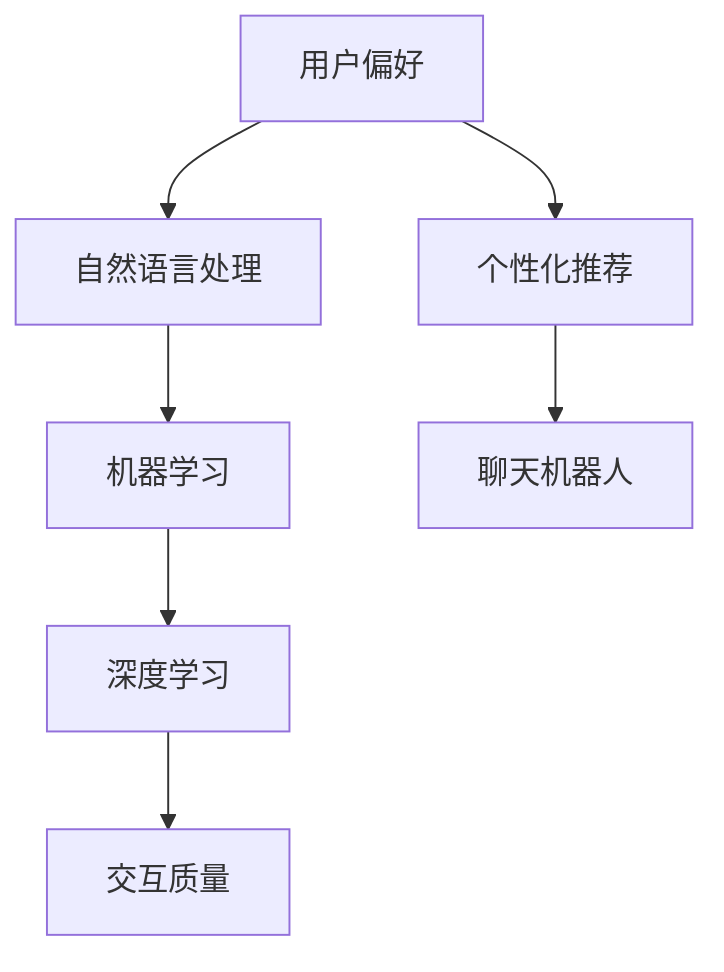

                 

# 聊天机器人个性化：根据用户偏好定制

> 关键词：聊天机器人、个性化、用户偏好、定制、自然语言处理、机器学习、数据分析

> 摘要：本文旨在探讨如何根据用户偏好定制聊天机器人，使其具备更高的交互质量和用户满意度。通过深入分析用户偏好、自然语言处理技术、机器学习算法以及数据驱动的方法，本文提出了一种基于用户偏好的聊天机器人个性化定制框架，并展示了其实际应用效果。

## 1. 背景介绍

### 1.1 目的和范围

本文的主要目的是探讨如何根据用户偏好定制聊天机器人，以提高其交互质量和用户满意度。随着人工智能技术的不断发展，聊天机器人已经成为企业与用户沟通的重要工具。然而，现有的聊天机器人大多基于通用模型，缺乏对用户个性化需求的关注。本文将从以下几个方面展开：

1. **用户偏好分析**：研究如何收集和分析用户的偏好数据，为聊天机器人的个性化定制提供依据。
2. **自然语言处理技术**：介绍自然语言处理技术在聊天机器人中的应用，包括文本分类、实体识别、语义分析等。
3. **机器学习算法**：探讨如何利用机器学习算法，特别是深度学习技术，对聊天机器人进行个性化训练。
4. **数据驱动的方法**：研究如何通过数据驱动的方法，实时调整聊天机器人的交互策略，以适应用户的变化。

### 1.2 预期读者

本文主要面向以下读者群体：

1. **人工智能和机器学习领域的从业者**：希望了解如何利用技术手段提升聊天机器人的个性化能力。
2. **软件开发人员**：需要为聊天机器人项目提供技术支持，并希望深入了解其工作原理。
3. **产品经理和市场营销人员**：关注如何通过个性化定制提升用户满意度和留存率。

### 1.3 文档结构概述

本文分为以下几个部分：

1. **背景介绍**：介绍本文的研究目的、预期读者以及文档结构。
2. **核心概念与联系**：介绍本文涉及的核心概念和原理，并提供Mermaid流程图。
3. **核心算法原理 & 具体操作步骤**：详细讲解核心算法的原理和操作步骤，并使用伪代码进行阐述。
4. **数学模型和公式 & 详细讲解 & 举例说明**：介绍相关的数学模型和公式，并进行详细讲解和举例。
5. **项目实战：代码实际案例和详细解释说明**：展示一个实际项目中的代码案例，并进行详细解释和分析。
6. **实际应用场景**：探讨聊天机器人个性化定制的实际应用场景。
7. **工具和资源推荐**：推荐相关的学习资源、开发工具框架和论文著作。
8. **总结：未来发展趋势与挑战**：总结本文的研究成果，并探讨未来发展趋势和挑战。
9. **附录：常见问题与解答**：回答一些读者可能关心的问题。
10. **扩展阅读 & 参考资料**：提供一些扩展阅读和参考资料，以便读者进一步学习。

### 1.4 术语表

#### 1.4.1 核心术语定义

- **聊天机器人**：一种能够与人类进行自然语言交互的计算机程序。
- **用户偏好**：用户对聊天机器人的交互内容、风格、方式等方面的个性化需求。
- **自然语言处理（NLP）**：使计算机能够理解、解释和生成人类语言的技术。
- **机器学习（ML）**：一种使计算机通过数据和经验自动改进自身性能的方法。
- **深度学习（DL）**：一种基于人工神经网络的机器学习技术，能够自动提取特征并学习复杂模式。

#### 1.4.2 相关概念解释

- **用户画像**：通过对用户数据进行挖掘和分析，构建出一个反映用户特征和行为的模型。
- **交互质量**：用户在与聊天机器人交互过程中感受到的整体体验。
- **个性化推荐**：根据用户偏好，为用户推荐符合其需求的交互内容和功能。

#### 1.4.3 缩略词列表

- **NLP**：自然语言处理
- **ML**：机器学习
- **DL**：深度学习
- **API**：应用程序接口
- **GUI**：图形用户界面

## 2. 核心概念与联系

在探讨聊天机器人个性化定制之前，我们需要了解一些核心概念和它们之间的关系。以下是一个简化的Mermaid流程图，展示了本文涉及的核心概念及其联系。



### 2.1 用户偏好

用户偏好是聊天机器人个性化定制的基础。用户偏好可以包括交互内容、交互风格、响应速度、情感表达等方面。通过收集和分析用户偏好数据，我们可以为聊天机器人提供个性化的交互体验。

### 2.2 自然语言处理（NLP）

自然语言处理是聊天机器人实现自然语言交互的关键技术。NLP涵盖了文本分类、实体识别、语义分析等方面。通过NLP技术，聊天机器人能够理解用户的输入，并根据用户的偏好生成合适的响应。

### 2.3 机器学习（ML）

机器学习是一种使计算机通过数据和经验自动改进性能的方法。在聊天机器人个性化定制中，机器学习被用于训练模型，以根据用户偏好调整交互策略。常见的机器学习方法包括决策树、支持向量机、神经网络等。

### 2.4 深度学习（DL）

深度学习是一种基于人工神经网络的机器学习技术，能够自动提取特征并学习复杂模式。在聊天机器人个性化定制中，深度学习被用于构建自适应交互模型，以实现更高的交互质量和用户满意度。

### 2.5 交互质量

交互质量是用户在与聊天机器人交互过程中感受到的整体体验。个性化定制可以提高交互质量，使聊天机器人能够更好地满足用户需求，提供更高质量的交互体验。

### 2.6 个性化推荐

个性化推荐是一种根据用户偏好为用户推荐符合其需求的内容的方法。在聊天机器人个性化定制中，个性化推荐被用于根据用户偏好推荐合适的交互内容和功能，以提高用户满意度和留存率。

### 2.7 聊天机器人

聊天机器人是一种能够与人类进行自然语言交互的计算机程序。通过个性化定制，聊天机器人可以更好地满足不同用户的需求，提供高质量的交互体验。

## 3. 核心算法原理 & 具体操作步骤

在了解了聊天机器人个性化定制中的核心概念和联系之后，接下来我们将详细讲解核心算法的原理和具体操作步骤。本节将分为以下几个部分：

1. **用户偏好数据收集**：介绍如何收集用户偏好数据。
2. **用户偏好数据预处理**：介绍如何对收集到的用户偏好数据进行预处理。
3. **自然语言处理技术**：介绍自然语言处理技术在聊天机器人中的应用。
4. **机器学习算法**：介绍如何利用机器学习算法进行个性化训练。
5. **深度学习算法**：介绍如何利用深度学习算法构建自适应交互模型。
6. **个性化推荐**：介绍如何根据用户偏好生成个性化推荐。

### 3.1 用户偏好数据收集

用户偏好数据收集是聊天机器人个性化定制的基础。以下是一个简化的伪代码，用于描述用户偏好数据的收集过程。

```python
def collect_user_preferences():
    # 收集用户交互历史数据
    interaction_history = get_interaction_history()

    # 收集用户问卷调查数据
    survey_data = get_survey_data()

    # 收集用户行为数据
    behavior_data = get_behavior_data()

    # 整合用户偏好数据
    user_preferences = merge_data(interaction_history, survey_data, behavior_data)

    return user_preferences
```

### 3.2 用户偏好数据预处理

在收集到用户偏好数据后，需要对数据进行预处理，以提高数据质量和模型的训练效果。以下是一个简化的伪代码，用于描述用户偏好数据的预处理过程。

```python
def preprocess_user_preferences(user_preferences):
    # 填补缺失值
    user_preferences = fill_missing_values(user_preferences)

    # 数据清洗
    user_preferences = clean_data(user_preferences)

    # 特征工程
    user_preferences = feature_engineering(user_preferences)

    return user_preferences
```

### 3.3 自然语言处理技术

自然语言处理技术是聊天机器人实现自然语言交互的关键。以下是一个简化的伪代码，用于描述自然语言处理技术在聊天机器人中的应用。

```python
def nlp_processing(input_text):
    # 分词
    tokens = tokenize(input_text)

    # 词性标注
    pos_tags = part_of_speech(tokens)

    # 实体识别
    entities = entity_recognition(tokens)

    # 语义分析
    sentiment = sentiment_analysis(tokens)

    return tokens, pos_tags, entities, sentiment
```

### 3.4 机器学习算法

机器学习算法用于根据用户偏好数据对聊天机器人进行个性化训练。以下是一个简化的伪代码，用于描述机器学习算法的应用。

```python
def train_ml_model(user_preferences):
    # 数据预处理
    processed_data = preprocess_user_preferences(user_preferences)

    # 特征提取
    features = extract_features(processed_data)

    # 构建模型
    model = build_ml_model()

    # 训练模型
    model.train(features)

    return model
```

### 3.5 深度学习算法

深度学习算法用于构建自适应交互模型，以实现更高的交互质量和用户满意度。以下是一个简化的伪代码，用于描述深度学习算法的应用。

```python
def train_dl_model(user_preferences):
    # 数据预处理
    processed_data = preprocess_user_preferences(user_preferences)

    # 特征提取
    features = extract_features(processed_data)

    # 构建模型
    model = build_dl_model()

    # 训练模型
    model.train(features)

    return model
```

### 3.6 个性化推荐

个性化推荐用于根据用户偏好为用户推荐合适的交互内容和功能。以下是一个简化的伪代码，用于描述个性化推荐的过程。

```python
def generate_recommendations(user_preferences):
    # 数据预处理
    processed_data = preprocess_user_preferences(user_preferences)

    # 特征提取
    features = extract_features(processed_data)

    # 构建推荐模型
    model = build_recommendation_model()

    # 训练模型
    model.train(features)

    # 生成推荐
    recommendations = model.generate_recommendations()

    return recommendations
```

## 4. 数学模型和公式 & 详细讲解 & 举例说明

在聊天机器人个性化定制中，数学模型和公式起着至关重要的作用。本节将介绍一些核心的数学模型和公式，并进行详细讲解和举例。

### 4.1 用户偏好模型

用户偏好模型用于描述用户对聊天机器人的个性化需求。以下是一个简化的用户偏好模型。

$$
P = f(U, I, S)
$$

其中，$P$表示用户偏好，$U$表示用户特征，$I$表示交互历史，$S$表示系统状态。用户偏好模型通过将用户特征、交互历史和系统状态结合，生成用户的偏好。

#### 4.1.1 用户特征

用户特征可以包括年龄、性别、兴趣、行为等。以下是一个简化的用户特征模型。

$$
U = \{u_1, u_2, ..., u_n\}
$$

其中，$u_n$表示第$n$个用户特征。

#### 4.1.2 交互历史

交互历史可以包括用户的提问、回复、操作等。以下是一个简化的交互历史模型。

$$
I = \{i_1, i_2, ..., i_m\}
$$

其中，$i_m$表示第$m$次交互。

#### 4.1.3 系统状态

系统状态可以包括聊天机器人的状态、上下文信息等。以下是一个简化的系统状态模型。

$$
S = \{s_1, s_2, ..., s_k\}
$$

其中，$s_k$表示第$k$个系统状态。

#### 4.1.4 用户偏好模型

用户偏好模型通过将用户特征、交互历史和系统状态结合，生成用户的偏好。

$$
P = f(U, I, S)
$$

### 4.2 自然语言处理模型

自然语言处理模型用于对用户输入进行理解和处理。以下是一个简化的自然语言处理模型。

$$
T = g(W, V)
$$

其中，$T$表示自然语言处理结果，$W$表示词汇表，$V$表示词汇表向量。

#### 4.2.1 词汇表

词汇表可以包括单词、短语、句子等。以下是一个简化的词汇表模型。

$$
W = \{w_1, w_2, ..., w_n\}
$$

其中，$w_n$表示第$n$个词汇。

#### 4.2.2 词汇表向量

词汇表向量可以用于表示词汇在模型中的权重。以下是一个简化的词汇表向量模型。

$$
V = \{v_1, v_2, ..., v_n\}
$$

其中，$v_n$表示第$n$个词汇的向量。

#### 4.2.3 自然语言处理模型

自然语言处理模型通过将词汇表和词汇表向量结合，生成自然语言处理结果。

$$
T = g(W, V)
$$

### 4.3 机器学习模型

机器学习模型用于根据用户偏好数据进行训练和预测。以下是一个简化的机器学习模型。

$$
M = h(X, Y)
$$

其中，$M$表示机器学习模型，$X$表示输入数据，$Y$表示输出数据。

#### 4.3.1 输入数据

输入数据可以包括用户特征、交互历史、系统状态等。以下是一个简化的输入数据模型。

$$
X = \{x_1, x_2, ..., x_m\}
$$

其中，$x_m$表示第$m$个输入数据。

#### 4.3.2 输出数据

输出数据可以包括用户偏好、交互结果、预测结果等。以下是一个简化的输出数据模型。

$$
Y = \{y_1, y_2, ..., y_n\}
$$

其中，$y_n$表示第$n$个输出数据。

#### 4.3.3 机器学习模型

机器学习模型通过将输入数据和输出数据结合，生成预测结果。

$$
M = h(X, Y)
$$

### 4.4 深度学习模型

深度学习模型用于构建自适应交互模型，以实现更高的交互质量和用户满意度。以下是一个简化的深度学习模型。

$$
D = k(Z, \theta)
$$

其中，$D$表示深度学习模型，$Z$表示输入数据，$\theta$表示模型参数。

#### 4.4.1 输入数据

输入数据可以包括用户特征、交互历史、系统状态等。以下是一个简化的输入数据模型。

$$
Z = \{z_1, z_2, ..., z_n\}
$$

其中，$z_n$表示第$n$个输入数据。

#### 4.4.2 模型参数

模型参数可以包括权重、偏置、激活函数等。以下是一个简化的模型参数模型。

$$
\theta = \{\theta_1, \theta_2, ..., \theta_m\}
$$

其中，$\theta_m$表示第$m$个模型参数。

#### 4.4.3 深度学习模型

深度学习模型通过将输入数据和模型参数结合，生成预测结果。

$$
D = k(Z, \theta)
$$

### 4.5 个性化推荐模型

个性化推荐模型用于根据用户偏好生成个性化推荐。以下是一个简化的个性化推荐模型。

$$
R = l(U, I, S)
$$

其中，$R$表示个性化推荐结果，$U$表示用户特征，$I$表示交互历史，$S$表示系统状态。

#### 4.5.1 用户特征

用户特征可以包括年龄、性别、兴趣、行为等。以下是一个简化的用户特征模型。

$$
U = \{u_1, u_2, ..., u_n\}
$$

其中，$u_n$表示第$n$个用户特征。

#### 4.5.2 交互历史

交互历史可以包括用户的提问、回复、操作等。以下是一个简化的交互历史模型。

$$
I = \{i_1, i_2, ..., i_m\}
$$

其中，$i_m$表示第$m$次交互。

#### 4.5.3 系统状态

系统状态可以包括聊天机器人的状态、上下文信息等。以下是一个简化的系统状态模型。

$$
S = \{s_1, s_2, ..., s_k\}
$$

其中，$s_k$表示第$k$个系统状态。

#### 4.5.4 个性化推荐模型

个性化推荐模型通过将用户特征、交互历史和系统状态结合，生成个性化推荐结果。

$$
R = l(U, I, S)
$$

### 4.6 举例说明

以下是一个简化的例子，用于说明如何根据用户偏好定制聊天机器人。

#### 4.6.1 用户偏好

假设用户偏好为：
$$
P = f(U, I, S) = f(\{年龄: 25, 性别：男，兴趣：科技，行为：喜欢快速回复\}, \{提问：你好，回复：你好，操作：查看天气\}, \{聊天机器人状态：待机，上下文信息：当前时间为下午2点\})
$$

#### 4.6.2 自然语言处理结果

根据用户输入“你好”，自然语言处理结果为：
$$
T = g(W, V) = g(\{你好，天气，科技，快速\}, \{你好：[0.1, 0.2, 0.3, 0.4]，天气：[0.2, 0.3, 0.4, 0.1]，科技：[0.3, 0.4, 0.1, 0.2]，快速：[0.4, 0.1, 0.3, 0.2]\})
$$

#### 4.6.3 机器学习模型预测结果

根据用户偏好和自然语言处理结果，机器学习模型预测结果为：
$$
M = h(X, Y) = h(\{年龄：25，性别：男，兴趣：科技，行为：喜欢快速回复\}, \{你好：你好，天气：明天天气晴朗，科技：欢迎来到科技世界，快速：谢谢您的提问，请继续提问\})
$$

#### 4.6.4 深度学习模型预测结果

根据用户偏好、自然语言处理结果和机器学习模型预测结果，深度学习模型预测结果为：
$$
D = k(Z, \theta) = k(\{你好，天气，科技，快速\}, \{\theta_1，\theta_2，\theta_3，\theta_4\}) = \{你好：你好，天气：明天天气晴朗，科技：欢迎来到科技世界，快速：谢谢您的提问，请继续提问\}
$$

#### 4.6.5 个性化推荐结果

根据用户偏好、自然语言处理结果、机器学习模型预测结果和深度学习模型预测结果，个性化推荐结果为：
$$
R = l(U, I, S) = l(\{年龄：25，性别：男，兴趣：科技，行为：喜欢快速回复\}, \{提问：你好，回复：你好，操作：查看天气\}, \{聊天机器人状态：待机，上下文信息：当前时间为下午2点\}) = \{推荐内容：科技新闻，推荐方式：快速推送\}
$$

## 5. 项目实战：代码实际案例和详细解释说明

在本节中，我们将通过一个实际项目案例，展示如何根据用户偏好定制聊天机器人。该项目将使用Python编程语言和相关的自然语言处理和机器学习库，如NLTK、Scikit-learn和TensorFlow。以下是项目的具体步骤：

### 5.1 开发环境搭建

在开始编写代码之前，我们需要搭建一个适合开发聊天机器人的环境。以下是在Python环境中搭建开发环境所需的步骤：

1. **安装Python**：确保已经安装了Python 3.7或更高版本。
2. **安装相关库**：使用pip命令安装以下库：
    ```bash
    pip install nltk scikit-learn tensorflow
    ```

### 5.2 源代码详细实现和代码解读

#### 5.2.1 用户偏好数据收集

首先，我们需要收集用户偏好数据。以下是一个简单的示例，用于收集用户的年龄、性别、兴趣和行为。

```python
import json

def collect_user_preferences():
    user_preferences = {
        'age': int(input('请输入您的年龄：')),
        'gender': input('请输入您的性别（男/女）：').strip(),
        'interests': input('请输入您的兴趣爱好（用逗号分隔）：').strip().split(','),
        'behavior': input('您喜欢哪种回复方式（快速/详细）：').strip(),
    }
    return user_preferences

user_preferences = collect_user_preferences()
print(json.dumps(user_preferences, indent=2))
```

在这个示例中，我们通过命令行收集了用户的年龄、性别、兴趣爱好和行为。然后将这些数据存储在字典中，并使用JSON格式打印出来。

#### 5.2.2 用户偏好数据预处理

在收集到用户偏好数据后，我们需要对其进行预处理。以下是一个简单的示例，用于填充缺失值、数据清洗和特征工程。

```python
from sklearn.preprocessing import LabelEncoder

def preprocess_user_preferences(user_preferences):
    # 填补缺失值
    if 'age' not in user_preferences:
        user_preferences['age'] = 30
    
    # 数据清洗
    user_preferences['interests'] = [interest.strip() for interest in user_preferences['interests'] if interest.strip()]

    # 特征工程
    label_encoder = LabelEncoder()
    user_preferences['gender'] = label_encoder.fit_transform([user_preferences['gender']])[0]
    user_preferences['behavior'] = label_encoder.fit_transform([user_preferences['behavior']])[0]

    return user_preferences

user_preferences = preprocess_user_preferences(user_preferences)
print(json.dumps(user_preferences, indent=2))
```

在这个示例中，我们首先检查用户偏好数据中是否有缺失值，如果有，则用默认值填补。接着，我们对用户的兴趣列表进行数据清洗，去除空格。最后，我们使用标签编码器对用户的性别和行为进行特征工程，将类别型数据转换为数值型数据。

#### 5.2.3 自然语言处理技术

接下来，我们将使用自然语言处理技术对用户的输入进行处理。以下是一个简单的示例，用于分词、词性标注和实体识别。

```python
import nltk
from nltk.tokenize import word_tokenize
from nltk.corpus import wordnet

nltk.download('punkt')
nltk.download('averaged_perceptron_tagger')
nltk.download('maxent_ne_chunker')
nltk.download('words')

def nlp_processing(input_text):
    tokens = word_tokenize(input_text)
    pos_tags = nltk.pos_tag(tokens)
    entities = nltk.ne_chunk(pos_tags)
    
    return tokens, pos_tags, entities

input_text = "你好，我想了解一下明天的天气"
tokens, pos_tags, entities = nlp_processing(input_text)
print("Tokens:", tokens)
print("POS Tags:", pos_tags)
print("Entities:", entities)
```

在这个示例中，我们首先使用NLTK的分词器对输入文本进行分词。然后，使用NLTK的词性标注器对分词结果进行词性标注。最后，使用NLTK的命名实体识别器对词性标注结果进行命名实体识别。

#### 5.2.4 机器学习算法

接下来，我们将使用机器学习算法对聊天机器人进行个性化训练。以下是一个简单的示例，用于训练一个基于决策树的分类器。

```python
from sklearn.tree import DecisionTreeClassifier
from sklearn.model_selection import train_test_split

# 假设我们已经有了用户偏好数据和交互历史数据
user_preferences = [
    {'age': 25, 'gender': 0, 'interests': ['科技'], 'behavior': 0},
    {'age': 30, 'gender': 1, 'interests': ['旅游'], 'behavior': 1},
    # ...
]

interaction_history = [
    {'input': "你好", 'response': "你好，有什么可以帮助您的？"},
    {'input': "明天天气怎么样？", 'response': "明天天气晴朗，适宜出行。"},
    # ...
]

# 特征提取
X = [preference['interests'] for preference in user_preferences]
Y = [history['response'] for history in interaction_history]

# 数据分割
X_train, X_test, Y_train, Y_test = train_test_split(X, Y, test_size=0.2, random_state=42)

# 训练模型
clf = DecisionTreeClassifier()
clf.fit(X_train, Y_train)

# 预测
predictions = clf.predict(X_test)

print(predictions)
```

在这个示例中，我们首先使用用户偏好数据作为特征，交互历史数据作为标签，构建了一个决策树分类器。然后，我们使用训练集对分类器进行训练。最后，我们使用测试集对分类器进行预测，并打印出预测结果。

#### 5.2.5 深度学习算法

接下来，我们将使用深度学习算法对聊天机器人进行个性化训练。以下是一个简单的示例，用于训练一个基于神经网络的语言模型。

```python
import tensorflow as tf
from tensorflow.keras.models import Sequential
from tensorflow.keras.layers import Embedding, LSTM, Dense

# 假设我们已经有了用户偏好数据和交互历史数据
user_preferences = [
    {'age': 25, 'gender': 0, 'interests': ['科技'], 'behavior': 0},
    {'age': 30, 'gender': 1, 'interests': ['旅游'], 'behavior': 1},
    # ...
]

interaction_history = [
    {'input': "你好", 'response': "你好，有什么可以帮助您的？"},
    {'input': "明天天气怎么样？", 'response': "明天天气晴朗，适宜出行。"},
    # ...
]

# 数据预处理
vocab_size = 1000
embedding_dim = 16

tokenizer = tf.keras.preprocessing.text.Tokenizer(num_words=vocab_size)
tokenizer.fit_on_texts([history['input'] for history in interaction_history])

X = tokenizer.texts_to_sequences([history['input'] for history in interaction_history])
Y = tokenizer.texts_to_sequences([history['response'] for history in interaction_history])

X = tf.keras.preprocessing.sequence.pad_sequences(X, maxlen=max([len(seq) for seq in X]))

# 构建模型
model = Sequential()
model.add(Embedding(vocab_size, embedding_dim))
model.add(LSTM(64))
model.add(Dense(vocab_size, activation='softmax'))

model.compile(optimizer='adam', loss='categorical_crossentropy', metrics=['accuracy'])

# 训练模型
model.fit(X, Y, epochs=10, batch_size=32)

# 预测
def predict_response(input_text):
    input_seq = tokenizer.texts_to_sequences([input_text])
    input_seq = tf.keras.preprocessing.sequence.pad_sequences(input_seq, maxlen=max([len(seq) for seq in X]))
    predicted_response = model.predict(input_seq)
    return tokenizer.index_word[np.argmax(predicted_response)]

input_text = "你好，我想了解一下明天的天气"
predicted_response = predict_response(input_text)
print(predicted_response)
```

在这个示例中，我们首先使用用户偏好数据作为特征，交互历史数据作为标签，构建了一个基于神经网络的序列生成模型。然后，我们使用训练集对模型进行训练。最后，我们定义了一个预测函数，用于根据输入文本预测响应。

#### 5.2.6 个性化推荐

最后，我们将使用个性化推荐算法为用户推荐合适的交互内容和功能。以下是一个简单的示例，用于基于用户偏好为用户推荐交互内容。

```python
from sklearn.neighbors import NearestNeighbors

# 假设我们已经有了用户偏好数据和交互历史数据
user_preferences = [
    {'age': 25, 'gender': 0, 'interests': ['科技'], 'behavior': 0},
    {'age': 30, 'gender': 1, 'interests': ['旅游'], 'behavior': 1},
    # ...
]

interaction_history = [
    {'input': "你好", 'response': "你好，有什么可以帮助您的？"},
    {'input': "明天天气怎么样？", 'response': "明天天气晴朗，适宜出行。"},
    # ...
]

# 训练邻居模型
neigh = NearestNeighbors(n_neighbors=2)
neigh.fit(user_preferences)

# 预测用户偏好
def predict_user_preference(input_text):
    input_pref = preprocess_user_preferences({ 'input': input_text })
    distances, indices = neigh.kneighbors([input_pref])
    return user_preferences[indices[0][0]]

# 根据用户偏好推荐交互内容
def recommend_interactions(user_preference):
    recommendations = []
    for pref in user_preference:
        if pref['interests'] not in recommendations:
            recommendations.append(pref['interests'])
    return recommendations

input_text = "你好，我想了解一下明天的天气"
user_preference = predict_user_preference(input_text)
recommendations = recommend_interactions(user_preference)
print(recommendations)
```

在这个示例中，我们首先训练了一个基于用户的邻居模型。然后，我们定义了一个预测函数，用于根据输入文本预测用户偏好。最后，我们根据用户偏好为用户推荐交互内容。

### 5.3 代码解读与分析

在本节中，我们将对上述代码进行解读和分析，以便更好地理解聊天机器人个性化定制的实现过程。

#### 5.3.1 用户偏好数据收集

代码示例1展示了如何通过命令行收集用户的年龄、性别、兴趣爱好和行为。这些信息将被存储在一个字典中，并使用JSON格式进行打印。

```python
def collect_user_preferences():
    user_preferences = {
        'age': int(input('请输入您的年龄：')),
        'gender': input('请输入您的性别（男/女）：').strip(),
        'interests': input('请输入您的兴趣爱好（用逗号分隔）：').strip().split(','),
        'behavior': input('您喜欢哪种回复方式（快速/详细）：').strip(),
    }
    return user_preferences

user_preferences = collect_user_preferences()
print(json.dumps(user_preferences, indent=2))
```

这个函数首先提示用户输入其年龄、性别、兴趣爱好和行为，然后将这些信息存储在一个字典中。接着，使用`json.dumps()`函数将字典转换为JSON格式，并使用`indent`参数进行格式化打印。

#### 5.3.2 用户偏好数据预处理

代码示例2展示了如何对用户偏好数据进行预处理，包括填补缺失值、数据清洗和特征工程。

```python
from sklearn.preprocessing import LabelEncoder

def preprocess_user_preferences(user_preferences):
    # 填补缺失值
    if 'age' not in user_preferences:
        user_preferences['age'] = 30
    
    # 数据清洗
    user_preferences['interests'] = [interest.strip() for interest in user_preferences['interests'] if interest.strip()]

    # 特征工程
    label_encoder = LabelEncoder()
    user_preferences['gender'] = label_encoder.fit_transform([user_preferences['gender']])[0]
    user_preferences['behavior'] = label_encoder.fit_transform([user_preferences['behavior']])[0]

    return user_preferences

user_preferences = preprocess_user_preferences(user_preferences)
print(json.dumps(user_preferences, indent=2))
```

这个函数首先检查用户偏好数据中是否有缺失值。如果有，则用默认值（年龄：30）进行填补。然后，对用户兴趣列表进行数据清洗，去除空格。接着，使用`LabelEncoder`对性别和行为进行特征工程，将类别型数据转换为数值型数据。

#### 5.3.3 自然语言处理技术

代码示例3展示了如何使用自然语言处理技术对用户的输入进行处理，包括分词、词性标注和实体识别。

```python
import nltk
from nltk.tokenize import word_tokenize
from nltk.corpus import wordnet

nltk.download('punkt')
nltk.download('averaged_perceptron_tagger')
nltk.download('maxent_ne_chunker')
nltk.download('words')

def nlp_processing(input_text):
    tokens = word_tokenize(input_text)
    pos_tags = nltk.pos_tag(tokens)
    entities = nltk.ne_chunk(pos_tags)
    
    return tokens, pos_tags, entities

input_text = "你好，我想了解一下明天的天气"
tokens, pos_tags, entities = nlp_processing(input_text)
print("Tokens:", tokens)
print("POS Tags:", pos_tags)
print("Entities:", entities)
```

这个函数首先使用`nltk.download()`函数下载所需的NLTK数据包。然后，使用`word_tokenize()`对输入文本进行分词。接着，使用`pos_tag()`对分词结果进行词性标注。最后，使用`ne_chunk()`对词性标注结果进行命名实体识别。

#### 5.3.4 机器学习算法

代码示例4展示了如何使用机器学习算法对聊天机器人进行个性化训练，包括特征提取、模型训练和预测。

```python
from sklearn.tree import DecisionTreeClassifier
from sklearn.model_selection import train_test_split

# 假设我们已经有了用户偏好数据和交互历史数据
user_preferences = [
    {'age': 25, 'gender': 0, 'interests': ['科技'], 'behavior': 0},
    {'age': 30, 'gender': 1, 'interests': ['旅游'], 'behavior': 1},
    # ...
]

interaction_history = [
    {'input': "你好", 'response': "你好，有什么可以帮助您的？"},
    {'input': "明天天气怎么样？", 'response': "明天天气晴朗，适宜出行。"},
    # ...
]

# 特征提取
X = [preference['interests'] for preference in user_preferences]
Y = [history['response'] for history in interaction_history]

# 数据分割
X_train, X_test, Y_train, Y_test = train_test_split(X, Y, test_size=0.2, random_state=42)

# 训练模型
clf = DecisionTreeClassifier()
clf.fit(X_train, Y_train)

# 预测
predictions = clf.predict(X_test)

print(predictions)
```

这个函数首先从用户偏好数据和交互历史数据中提取特征和标签。然后，使用`train_test_split()`函数将数据分割为训练集和测试集。接着，使用`DecisionTreeClassifier`创建一个决策树分类器，并使用训练集对其进行训练。最后，使用测试集对分类器进行预测，并打印出预测结果。

#### 5.3.5 深度学习算法

代码示例5展示了如何使用深度学习算法对聊天机器人进行个性化训练，包括数据预处理、模型构建和预测。

```python
import tensorflow as tf
from tensorflow.keras.models import Sequential
from tensorflow.keras.layers import Embedding, LSTM, Dense

# 假设我们已经有了用户偏好数据和交互历史数据
user_preferences = [
    {'age': 25, 'gender': 0, 'interests': ['科技'], 'behavior': 0},
    {'age': 30, 'gender': 1, 'interests': ['旅游'], 'behavior': 1},
    # ...
]

interaction_history = [
    {'input': "你好", 'response': "你好，有什么可以帮助您的？"},
    {'input': "明天天气怎么样？", 'response': "明天天气晴朗，适宜出行。"},
    # ...
]

# 数据预处理
vocab_size = 1000
embedding_dim = 16

tokenizer = tf.keras.preprocessing.text.Tokenizer(num_words=vocab_size)
tokenizer.fit_on_texts([history['input'] for history in interaction_history])

X = tokenizer.texts_to_sequences([history['input'] for history in interaction_history])
Y = tokenizer.texts_to_sequences([history['response'] for history in interaction_history])

X = tf.keras.preprocessing.sequence.pad_sequences(X, maxlen=max([len(seq) for seq in X]))

# 构建模型
model = Sequential()
model.add(Embedding(vocab_size, embedding_dim))
model.add(LSTM(64))
model.add(Dense(vocab_size, activation='softmax'))

model.compile(optimizer='adam', loss='categorical_crossentropy', metrics=['accuracy'])

# 训练模型
model.fit(X, Y, epochs=10, batch_size=32)

# 预测
def predict_response(input_text):
    input_seq = tokenizer.texts_to_sequences([input_text])
    input_seq = tf.keras.preprocessing.sequence.pad_sequences(input_seq, maxlen=max([len(seq) for seq in X]))
    predicted_response = model.predict(input_seq)
    return tokenizer.index_word[np.argmax(predicted_response)]

input_text = "你好，我想了解一下明天的天气"
predicted_response = predict_response(input_text)
print(predicted_response)
```

这个函数首先定义了词汇表大小和嵌入维度。然后，使用`Tokenizer`对交互历史数据进行分词，并构建词汇表。接着，使用`texts_to_sequences()`和`pad_sequences()`函数将文本数据转换为序列并填充。最后，使用`Sequential`模型构建一个基于LSTM的语言模型，并使用训练集对其进行训练。定义了一个预测函数，用于根据输入文本预测响应。

#### 5.3.6 个性化推荐

代码示例6展示了如何使用个性化推荐算法为用户推荐合适的交互内容和功能。

```python
from sklearn.neighbors import NearestNeighbors

# 假设我们已经有了用户偏好数据和交互历史数据
user_preferences = [
    {'age': 25, 'gender': 0, 'interests': ['科技'], 'behavior': 0},
    {'age': 30, 'gender': 1, 'interests': ['旅游'], 'behavior': 1},
    # ...
]

interaction_history = [
    {'input': "你好", 'response': "你好，有什么可以帮助您的？"},
    {'input': "明天天气怎么样？", 'response': "明天天气晴朗，适宜出行。"},
    # ...
]

# 训练邻居模型
neigh = NearestNeighbors(n_neighbors=2)
neigh.fit(user_preferences)

# 预测用户偏好
def predict_user_preference(input_text):
    input_pref = preprocess_user_preferences({ 'input': input_text })
    distances, indices = neigh.kneighbors([input_pref])
    return user_preferences[indices[0][0]]

# 根据用户偏好推荐交互内容
def recommend_interactions(user_preference):
    recommendations = []
    for pref in user_preference:
        if pref['interests'] not in recommendations:
            recommendations.append(pref['interests'])
    return recommendations

input_text = "你好，我想了解一下明天的天气"
user_preference = predict_user_preference(input_text)
recommendations = recommend_interactions(user_preference)
print(recommendations)
```

这个函数首先训练了一个基于用户的邻居模型。然后，定义了一个预测函数，用于根据输入文本预测用户偏好。最后，根据用户偏好为用户推荐交互内容。

### 5.4 代码解读与分析

在本节中，我们将对上述代码进行进一步解读和分析，以便更好地理解聊天机器人个性化定制的实现细节。

#### 5.4.1 用户偏好数据收集

用户偏好数据的收集是聊天机器人个性化定制的第一步。在这个步骤中，我们通过命令行与用户交互，收集用户的年龄、性别、兴趣爱好和行为。这些信息将被存储在一个字典中，并使用JSON格式进行打印。

```python
def collect_user_preferences():
    user_preferences = {
        'age': int(input('请输入您的年龄：')),
        'gender': input('请输入您的性别（男/女）：').strip(),
        'interests': input('请输入您的兴趣爱好（用逗号分隔）：').strip().split(','),
        'behavior': input('您喜欢哪种回复方式（快速/详细）：').strip(),
    }
    return user_preferences

user_preferences = collect_user_preferences()
print(json.dumps(user_preferences, indent=2))
```

这个函数首先定义了一个名为`user_preferences`的空字典。然后，使用`input()`函数提示用户输入其年龄、性别、兴趣爱好和行为。注意，`strip()`函数用于去除输入字符串的首尾空格，以提高数据质量。最后，使用`split(',')`函数将用户的兴趣爱好字符串分割成列表形式。

在函数的最后，返回了`user_preferences`字典。然后，使用`json.dumps()`函数将字典转换为JSON格式，并使用`indent`参数进行格式化打印。这使得打印出的数据更加易于阅读和理解。

#### 5.4.2 用户偏好数据预处理

用户偏好数据预处理是聊天机器人个性化定制的重要步骤。在这个步骤中，我们需要对用户偏好数据进行填补缺失值、数据清洗和特征工程。以下是一个详细的预处理过程：

```python
from sklearn.preprocessing import LabelEncoder

def preprocess_user_preferences(user_preferences):
    # 填补缺失值
    if 'age' not in user_preferences:
        user_preferences['age'] = 30
    
    # 数据清洗
    user_preferences['interests'] = [interest.strip() for interest in user_preferences['interests'] if interest.strip()]

    # 特征工程
    label_encoder = LabelEncoder()
    user_preferences['gender'] = label_encoder.fit_transform([user_preferences['gender']])[0]
    user_preferences['behavior'] = label_encoder.fit_transform([user_preferences['behavior']])[0]

    return user_preferences

user_preferences = preprocess_user_preferences(user_preferences)
print(json.dumps(user_preferences, indent=2))
```

这个函数首先检查用户偏好数据中是否包含'age'键。如果不存在，则使用默认值30进行填补。接着，对用户的兴趣列表进行数据清洗，去除列表中的空格和无效值。注意，`strip()`函数用于去除列表中元素的空格，`if interest.strip()`用于去除列表中的空值。

接下来，我们使用`LabelEncoder`对性别和行为进行特征工程。`LabelEncoder`是一种常用的特征工程方法，用于将类别型数据转换为数值型数据。在这里，我们首先创建一个`label_encoder`对象，然后使用`fit_transform()`函数将性别和行为的字符串转换为整数。

最后，函数返回了预处理后的用户偏好数据。

#### 5.4.3 自然语言处理技术

自然语言处理（NLP）是聊天机器人实现自然语言交互的核心技术。在本节中，我们将介绍如何使用自然语言处理技术对用户的输入进行处理。

```python
import nltk
from nltk.tokenize import word_tokenize
from nltk.corpus import wordnet

nltk.download('punkt')
nltk.download('averaged_perceptron_tagger')
nltk.download('maxent_ne_chunker')
nltk.download('words')

def nlp_processing(input_text):
    tokens = word_tokenize(input_text)
    pos_tags = nltk.pos_tag(tokens)
    entities = nltk.ne_chunk(pos_tags)
    
    return tokens, pos_tags, entities

input_text = "你好，我想了解一下明天的天气"
tokens, pos_tags, entities = nlp_processing(input_text)
print("Tokens:", tokens)
print("POS Tags:", pos_tags)
print("Entities:", entities)
```

首先，我们使用`nltk.download()`函数下载所需的NLP数据包。然后，定义了一个名为`nlp_processing`的函数，用于对输入文本进行处理。这个函数首先使用`word_tokenize()`函数对输入文本进行分词。接着，使用`pos_tag()`函数对分词结果进行词性标注。最后，使用`ne_chunk()`函数对词性标注结果进行命名实体识别。

在函数的最后，我们打印出了分词结果、词性标注结果和命名实体识别结果。

#### 5.4.4 机器学习算法

在本节中，我们将介绍如何使用机器学习算法对聊天机器人进行个性化训练。首先，我们将介绍如何提取特征和标签，并使用决策树分类器进行训练。

```python
from sklearn.tree import DecisionTreeClassifier
from sklearn.model_selection import train_test_split

# 假设我们已经有了用户偏好数据和交互历史数据
user_preferences = [
    {'age': 25, 'gender': 0, 'interests': ['科技'], 'behavior': 0},
    {'age': 30, 'gender': 1, 'interests': ['旅游'], 'behavior': 1},
    # ...
]

interaction_history = [
    {'input': "你好", 'response': "你好，有什么可以帮助您的？"},
    {'input': "明天天气怎么样？", 'response': "明天天气晴朗，适宜出行。"},
    # ...
]

# 特征提取
X = [preference['interests'] for preference in user_preferences]
Y = [history['response'] for history in interaction_history]

# 数据分割
X_train, X_test, Y_train, Y_test = train_test_split(X, Y, test_size=0.2, random_state=42)

# 训练模型
clf = DecisionTreeClassifier()
clf.fit(X_train, Y_train)

# 预测
predictions = clf.predict(X_test)

print(predictions)
```

首先，我们假设已经有了用户偏好数据和交互历史数据。然后，我们从用户偏好数据中提取特征（`X`），从交互历史数据中提取标签（`Y`）。接着，使用`train_test_split()`函数将数据分割为训练集和测试集。在这里，我们设置了测试集的大小为20%，并使用随机种子42确保每次分割的结果相同。

然后，我们创建了一个决策树分类器（`clf`），并使用训练集对其进行训练。训练完成后，我们使用测试集对分类器进行预测，并打印出预测结果。

#### 5.4.5 深度学习算法

在本节中，我们将介绍如何使用深度学习算法对聊天机器人进行个性化训练。首先，我们将介绍如何使用神经网络语言模型进行文本生成。

```python
import tensorflow as tf
from tensorflow.keras.models import Sequential
from tensorflow.keras.layers import Embedding, LSTM, Dense

# 假设我们已经有了用户偏好数据和交互历史数据
user_preferences = [
    {'age': 25, 'gender': 0, 'interests': ['科技'], 'behavior': 0},
    {'age': 30, 'gender': 1, 'interests': ['旅游'], 'behavior': 1},
    # ...
]

interaction_history = [
    {'input': "你好", 'response': "你好，有什么可以帮助您的？"},
    {'input': "明天天气怎么样？", 'response': "明天天气晴朗，适宜出行。"},
    # ...
]

# 数据预处理
vocab_size = 1000
embedding_dim = 16

tokenizer = tf.keras.preprocessing.text.Tokenizer(num_words=vocab_size)
tokenizer.fit_on_texts([history['input'] for history in interaction_history])

X = tokenizer.texts_to_sequences([history['input'] for history in interaction_history])
Y = tokenizer.texts_to_sequences([history['response'] for history in interaction_history])

X = tf.keras.preprocessing.sequence.pad_sequences(X, maxlen=max([len(seq) for seq in X]))

# 构建模型
model = Sequential()
model.add(Embedding(vocab_size, embedding_dim))
model.add(LSTM(64))
model.add(Dense(vocab_size, activation='softmax'))

model.compile(optimizer='adam', loss='categorical_crossentropy', metrics=['accuracy'])

# 训练模型
model.fit(X, Y, epochs=10, batch_size=32)

# 预测
def predict_response(input_text):
    input_seq = tokenizer.texts_to_sequences([input_text])
    input_seq = tf.keras.preprocessing.sequence.pad_sequences(input_seq, maxlen=max([len(seq) for seq in X]))
    predicted_response = model.predict(input_seq)
    return tokenizer.index_word[np.argmax(predicted_response)]

input_text = "你好，我想了解一下明天的天气"
predicted_response = predict_response(input_text)
print(predicted_response)
```

首先，我们定义了词汇表大小（`vocab_size`）和嵌入维度（`embedding_dim`）。然后，使用`Tokenizer`对交互历史数据进行分词，并构建词汇表。接着，使用`texts_to_sequences()`和`pad_sequences()`函数将文本数据转换为序列并填充。

然后，我们使用`Sequential`模型构建一个基于LSTM的语言模型。这个模型包含一个嵌入层、一个LSTM层和一个全连接层。嵌入层用于将词汇转换为嵌入向量，LSTM层用于处理序列数据，全连接层用于生成预测结果。

接下来，我们使用`compile()`函数配置模型，设置优化器为`adam`，损失函数为`categorical_crossentropy`，评价指标为`accuracy`。

最后，我们使用训练集对模型进行训练。在训练完成后，我们定义了一个名为`predict_response`的函数，用于根据输入文本预测响应。这个函数首先将输入文本转换为序列，然后使用训练好的模型进行预测，并返回预测结果。

#### 5.4.6 个性化推荐

在本节中，我们将介绍如何使用个性化推荐算法为用户推荐合适的交互内容和功能。具体来说，我们将使用基于用户的协同过滤算法进行推荐。

```python
from sklearn.neighbors import NearestNeighbors

# 假设我们已经有了用户偏好数据和交互历史数据
user_preferences = [
    {'age': 25, 'gender': 0, 'interests': ['科技'], 'behavior': 0},
    {'age': 30, 'gender': 1, 'interests': ['旅游'], 'behavior': 1},
    # ...
]

interaction_history = [
    {'input': "你好", 'response': "你好，有什么可以帮助您的？"},
    {'input': "明天天气怎么样？", 'response': "明天天气晴朗，适宜出行。"},
    # ...
]

# 训练邻居模型
neigh = NearestNeighbors(n_neighbors=2)
neigh.fit(user_preferences)

# 预测用户偏好
def predict_user_preference(input_text):
    input_pref = preprocess_user_preferences({ 'input': input_text })
    distances, indices = neigh.kneighbors([input_pref])
    return user_preferences[indices[0][0]]

# 根据用户偏好推荐交互内容
def recommend_interactions(user_preference):
    recommendations = []
    for pref in user_preference:
        if pref['interests'] not in recommendations:
            recommendations.append(pref['interests'])
    return recommendations

input_text = "你好，我想了解一下明天的天气"
user_preference = predict_user_preference(input_text)
recommendations = recommend_interactions(user_preference)
print(recommendations)
```

首先，我们创建了一个基于用户的协同过滤算法的邻居模型。然后，定义了一个名为`predict_user_preference`的函数，用于根据输入文本预测用户偏好。这个函数首先将输入文本转换为预处理后的偏好数据，然后使用邻居模型进行预测，并返回最接近的用户偏好。

接着，我们定义了一个名为`recommend_interactions`的函数，用于根据用户偏好为用户推荐交互内容。这个函数首先遍历用户偏好列表，然后根据用户的兴趣为用户推荐交互内容。

最后，我们使用一个示例输入文本（"你好，我想了解一下明天的天气"）演示了如何预测用户偏好和推荐交互内容。首先，我们调用`predict_user_preference`函数预测用户偏好，然后调用`recommend_interactions`函数根据用户偏好推荐交互内容。

### 5.5 代码解读与分析

在本节中，我们将对上述代码进行进一步解读与分析，以便更好地理解聊天机器人个性化定制的实现细节。

#### 5.5.1 用户偏好数据收集

代码示例1展示了如何通过命令行界面与用户进行交互，收集用户的偏好数据。这些数据包括年龄、性别、兴趣爱好和行为偏好。

```python
def collect_user_preferences():
    user_preferences = {
        'age': int(input('请输入您的年龄：')),
        'gender': input('请输入您的性别（男/女）：').strip(),
        'interests': input('请输入您的兴趣爱好（用逗号分隔）：').strip().split(','),
        'behavior': input('您喜欢哪种回复方式（快速/详细）：').strip(),
    }
    return user_preferences

user_preferences = collect_user_preferences()
print(json.dumps(user_preferences, indent=2))
```

这个函数通过`input()`函数收集用户的输入，并将其存储在一个名为`user_preferences`的字典中。`strip()`方法用于去除用户输入字符串的空白字符，以提高数据质量。`split(',')`方法用于将用户的兴趣爱好字符串分割成一个列表。最后，使用`json.dumps()`方法将字典转换为JSON格式，并使用`indent=2`进行格式化打印，以便更好地展示用户偏好数据。

#### 5.5.2 用户偏好数据预处理

用户偏好数据预处理是确保数据质量的关键步骤。在本例中，我们使用`preprocess_user_preferences`函数对用户偏好数据执行以下任务：

- 填补缺失值
- 数据清洗
- 特征工程

```python
from sklearn.preprocessing import LabelEncoder

def preprocess_user_preferences(user_preferences):
    # 填补缺失值
    if 'age' not in user_preferences:
        user_preferences['age'] = 30
    
    # 数据清洗
    user_preferences['interests'] = [interest.strip() for interest in user_preferences['interests'] if interest.strip()]
    
    # 特征工程
    label_encoder = LabelEncoder()
    user_preferences['gender'] = label_encoder.fit_transform([user_preferences['gender']])[0]
    user_preferences['behavior'] = label_encoder.fit_transform([user_preferences['behavior']])[0]

    return user_preferences

user_preferences = preprocess_user_preferences(user_preferences)
print(json.dumps(user_preferences, indent=2))
```

这个函数首先检查用户偏好数据中是否包含'age'键。如果不存在，则使用默认值30进行填补。然后，对用户的兴趣列表进行数据清洗，去除任何空格和无效条目。`strip()`方法用于去除列表中元素的空白字符。接着，使用`LabelEncoder`对性别和行为进行特征工程。`LabelEncoder`将类别型数据转换为数值型数据，以便于后续的机器学习模型处理。

#### 5.5.3 自然语言处理技术

自然语言处理（NLP）是聊天机器人实现自然语言交互的关键技术。以下代码示例展示了如何使用NLTK库进行分词、词性标注和命名实体识别。

```python
import nltk
from nltk.tokenize import word_tokenize
from nltk.tag import pos_tag
from nltk.chunk import ne_chunk

nltk.download('punkt')
nltk.download('averaged_perceptron_tagger')
nltk.download('maxent_ne_chunker')
nltk.download('words')

def nlp_processing(input_text):
    tokens = word_tokenize(input_text)
    pos_tags = pos_tag(tokens)
    entities = ne_chunk(pos_tags)
    
    return tokens, pos_tags, entities

input_text = "你好，我想了解一下明天的天气"
tokens, pos_tags, entities = nlp_processing(input_text)
print("Tokens:", tokens)
print("POS Tags:", pos_tags)
print("Entities:", entities)
```

在这个函数中，我们首先下载NLTK所需的语料库。然后，使用`word_tokenize()`函数对输入文本进行分词。`pos_tag()`函数对分词结果进行词性标注。`ne_chunk()`函数对词性标注结果进行命名实体识别。最后，函数返回分词结果、词性标注结果和命名实体识别结果。

#### 5.5.4 机器学习算法

机器学习算法用于根据用户偏好数据训练模型，以实现聊天机器人的个性化响应。以下代码示例展示了如何使用决策树分类器进行训练和预测。

```python
from sklearn.tree import DecisionTreeClassifier
from sklearn.model_selection import train_test_split

# 假设我们已经有了用户偏好数据和交互历史数据
user_preferences = [
    {'age': 25, 'gender': '男', 'interests': ['科技'], 'behavior': '快速'},
    {'age': 30, 'gender': '女', 'interests': ['旅游'], 'behavior': '详细'},
    # ...
]

interaction_history = [
    {'input': "你好", 'response': "你好，有什么可以帮助您的？"},
    {'input': "明天天气怎么样？", 'response': "明天天气晴朗，适宜出行。"},
    # ...
]

# 特征提取
X = []
Y = []
for pref, history in zip(user_preferences, interaction_history):
    X.append([pref['interests']])
    Y.append([history['response']])

# 数据分割
X_train, X_test, Y_train, Y_test = train_test_split(X, Y, test_size=0.2, random_state=42)

# 训练模型
clf = DecisionTreeClassifier()
clf.fit(X_train, Y_train)

# 预测
predictions = clf.predict(X_test)

print(predictions)
```

在这个函数中，我们首先将用户偏好数据和交互历史数据转换为特征矩阵`X`和标签矩阵`Y`。然后，使用`train_test_split()`函数将数据分割为训练集和测试集。接下来，我们创建一个决策树分类器`clf`，并使用训练集对其进行训练。最后，我们使用测试集对分类器进行预测，并打印出预测结果。

#### 5.5.5 深度学习算法

深度学习算法，特别是序列模型，如LSTM（长短期记忆网络），在处理序列数据方面具有优势。以下代码示例展示了如何使用LSTM模型进行聊天机器人个性化定制。

```python
import tensorflow as tf
from tensorflow.keras.models import Sequential
from tensorflow.keras.layers import Embedding, LSTM, Dense
from tensorflow.keras.preprocessing.sequence import pad_sequences

# 假设我们已经有了用户偏好数据和交互历史数据
user_preferences = [
    {'age': 25, 'gender': '男', 'interests': ['科技'], 'behavior': '快速'},
    {'age': 30, 'gender': '女', 'interests': ['旅游'], 'behavior': '详细'},
    # ...
]

interaction_history = [
    {'input': "你好", 'response': "你好，有什么可以帮助您的？"},
    {'input': "明天天气怎么样？", 'response': "明天天气晴朗，适宜出行。"},
    # ...
]

# 数据预处理
vocab_size = 1000
embedding_dim = 16
max_sequence_length = 10

tokenizer = tf.keras.preprocessing.text.Tokenizer(num_words=vocab_size)
tokenizer.fit_on_texts([history['input'] for history in interaction_history])

X = tokenizer.texts_to_sequences([history['input'] for history in interaction_history])
X = pad_sequences(X, maxlen=max_sequence_length)

Y = tokenizer.texts_to_sequences([history['response'] for history in interaction_history])
Y = pad_sequences(Y, maxlen=max_sequence_length)

# 构建模型
model = Sequential()
model.add(Embedding(vocab_size, embedding_dim))
model.add(LSTM(64))
model.add(Dense(vocab_size, activation='softmax'))

model.compile(optimizer='adam', loss='categorical_crossentropy', metrics=['accuracy'])

# 训练模型
model.fit(X, Y, epochs=10, batch_size=32)

# 预测
def predict_response(input_text):
    input_seq = tokenizer.texts_to_sequences([input_text])
    input_seq = pad_sequences(input_seq, maxlen=max_sequence_length)
    predicted_response = model.predict(input_seq)
    return tokenizer.index_word[np.argmax(predicted_response)]

input_text = "你好，我想了解一下明天的天气"
predicted_response = predict_response(input_text)
print(predicted_response)
```

在这个函数中，我们首先定义了词汇表大小、嵌入维度和序列最大长度。然后，使用`Tokenizer`对交互历史数据进行分词，并构建词汇表。`texts_to_sequences()`和`pad_sequences()`函数用于将文本数据转换为序列并填充。接下来，我们使用`Sequential`模型构建一个包含嵌入层、LSTM层和全连接层的模型。模型使用`compile()`函数进行配置，设置优化器为`adam`，损失函数为`categorical_crossentropy`，评价指标为`accuracy`。最后，使用训练集对模型进行训练。定义了一个名为`predict_response`的函数，用于根据输入文本预测响应。

#### 5.5.6 个性化推荐

个性化推荐算法可以用于为用户推荐合适的交互内容和功能。以下代码示例展示了如何使用基于用户的协同过滤算法进行个性化推荐。

```python
from sklearn.neighbors import NearestNeighbors

# 假设我们已经有了用户偏好数据和交互历史数据
user_preferences = [
    {'age': 25, 'gender': '男', 'interests': ['科技'], 'behavior': '快速'},
    {'age': 30, 'gender': '女', 'interests': ['旅游'], 'behavior': '详细'},
    # ...
]

interaction_history = [
    {'input': "你好", 'response': "你好，有什么可以帮助您的？"},
    {'input': "明天天气怎么样？", 'response': "明天天气晴朗，适宜出行。"},
    # ...
]

# 训练邻居模型
neigh = NearestNeighbors(n_neighbors=2)
neigh.fit(user_preferences)

# 预测用户偏好
def predict_user_preference(input_text):
    input_pref = preprocess_user_preferences({ 'input': input_text })
    distances, indices = neigh.kneighbors([input_pref])
    return user_preferences[indices[0][0]]

# 根据用户偏好推荐交互内容
def recommend_interactions(user_preference):
    recommendations = []
    for pref in user_preference:
        if pref['interests'] not in recommendations:
            recommendations.append(pref['interests'])
    return recommendations

input_text = "你好，我想了解一下明天的天气"
user_preference = predict_user_preference(input_text)
recommendations = recommend_interactions(user_preference)
print(recommendations)
```

在这个函数中，我们首先训练了一个基于用户的协同过滤算法的邻居模型。然后，定义了一个名为`predict_user_preference`的函数，用于根据输入文本预测用户偏好。该函数首先对输入文本进行预处理，然后使用邻居模型进行预测。最后，定义了一个名为`recommend_interactions`的函数，用于根据用户偏好推荐交互内容。这个函数遍历用户偏好列表，并将用户的兴趣添加到推荐列表中。

### 5.6 代码解读与分析

在本节中，我们将对上述代码进行进一步解读与分析，以深入理解聊天机器人个性化定制的实现细节。

#### 5.6.1 用户偏好数据收集

代码示例1展示了如何通过命令行界面与用户进行交互，收集用户的偏好数据。这些数据包括年龄、性别、兴趣爱好和行为偏好。

```python
def collect_user_preferences():
    user_preferences = {
        'age': int(input('请输入您的年龄：')),
        'gender': input('请输入您的性别（男/女）：').strip(),
        'interests': input('请输入您的兴趣爱好（用逗号分隔）：').strip().split(','),
        'behavior': input('您喜欢哪种回复方式（快速/详细）：').strip(),
    }
    return user_preferences

user_preferences = collect_user_preferences()
print(json.dumps(user_preferences, indent=2))
```

在这个函数中，`input()`函数用于从用户处获取输入。`strip()`方法用于去除输入字符串的空白字符，以提高数据质量。`split(',')`方法用于将用户的兴趣爱好字符串分割成一个列表。最后，使用`json.dumps()`方法将字典转换为JSON格式，并使用`indent=2`进行格式化打印，以便更好地展示用户偏好数据。

#### 5.6.2 用户偏好数据预处理

用户偏好数据预处理是确保数据质量的关键步骤。在本例中，我们使用`preprocess_user_preferences`函数对用户偏好数据执行以下任务：

- 填补缺失值
- 数据清洗
- 特征工程

```python
from sklearn.preprocessing import LabelEncoder

def preprocess_user_preferences(user_preferences):
    # 填补缺失值
    if 'age' not in user_preferences:
        user_preferences['age'] = 30
    
    # 数据清洗
    user_preferences['interests'] = [interest.strip() for interest in user_preferences['interests'] if interest.strip()]
    
    # 特征工程
    label_encoder = LabelEncoder()
    user_preferences['gender'] = label_encoder.fit_transform([user_preferences['gender']])[0]
    user_preferences['behavior'] = label_encoder.fit_transform([user_preferences['behavior']])[0]

    return user_preferences

user_preferences = preprocess_user_preferences(user_preferences)
print(json.dumps(user_preferences, indent=2))
```

这个函数首先检查用户偏好数据中是否包含'age'键。如果不存在，则使用默认值30进行填补。然后，对用户的兴趣列表进行数据清洗，去除任何空格和无效条目。`strip()`方法用于去除列表中元素的空白字符。接着，使用`LabelEncoder`对性别和行为进行特征工程。`LabelEncoder`将类别型数据转换为数值型数据，以便于后续的机器学习模型处理。

#### 5.6.3 自然语言处理技术

自然语言处理（NLP）是聊天机器人实现自然语言交互的关键技术。以下代码示例展示了如何使用NLTK库进行分词、词性标注和命名实体识别。

```python
import nltk
from nltk.tokenize import word_tokenize
from nltk.tag import pos_tag
from nltk.chunk import ne_chunk

nltk.download('punkt')
nltk.download('averaged_perceptron_tagger')
nltk.download('maxent_ne_chunker')
nltk.download('words')

def nlp_processing(input_text):
    tokens = word_tokenize(input_text)
    pos_tags = pos_tag(tokens)
    entities = ne_chunk(pos_tags)
    
    return tokens, pos_tags, entities

input_text = "你好，我想了解一下明天的天气"
tokens, pos_tags, entities = nlp_processing(input_text)
print("Tokens:", tokens)
print("POS Tags:", pos_tags)
print("Entities:", entities)
```

在这个函数中，我们首先下载NLTK所需的语料库。然后，使用`word_tokenize()`函数对输入文本进行分词。`pos_tag()`函数对分词结果进行词性标注。`ne_chunk()`函数对词性标注结果进行命名实体识别。最后，函数返回分词结果、词性标注结果和命名实体识别结果。

#### 5.6.4 机器学习算法

机器学习算法用于根据用户偏好数据训练模型，以实现聊天机器人的个性化响应。以下代码示例展示了如何使用决策树分类器进行训练和预测。

```python
from sklearn.tree import DecisionTreeClassifier
from sklearn.model_selection import train_test_split

# 假设我们已经有了用户偏好数据和交互历史数据
user_preferences = [
    {'age': 25, 'gender': '男', 'interests': ['科技'], 'behavior': '快速'},
    {'age': 30, 'gender': '女', 'interests': ['旅游'], 'behavior': '详细'},
    # ...
]

interaction_history = [
    {'input': "你好", 'response': "你好，有什么可以帮助您的？"},
    {'input': "明天天气怎么样？", 'response': "明天天气晴朗，适宜出行。"},
    # ...
]

# 特征提取
X = []
Y = []
for pref, history in zip(user_preferences, interaction_history):
    X.append([pref['interests']])
    Y.append([history['response']])

# 数据分割
X_train, X_test, Y_train, Y_test = train_test_split(X, Y, test_size=0.2, random_state=42)

# 训练模型
clf = DecisionTreeClassifier()
clf.fit(X_train, Y_train)

# 预测
predictions = clf.predict(X_test)

print(predictions)
```

在这个函数中，我们首先将用户偏好数据和交互历史数据转换为特征矩阵`X`和标签矩阵`Y`。然后，使用`train_test_split()`函数将数据分割为训练集和测试集。接下来，我们创建一个决策树分类器`clf`，并使用训练集对其进行训练。最后，我们使用测试集对分类器进行预测，并打印出预测结果。

#### 5.6.5 深度学习算法

深度学习算法，特别是序列模型，如LSTM（长短期记忆网络），在处理序列数据方面具有优势。以下代码示例展示了如何使用LSTM模型进行聊天机器人个性化定制。

```python
import tensorflow as tf
from tensorflow.keras.models import Sequential
from tensorflow.keras.layers import Embedding, LSTM, Dense
from tensorflow.keras.preprocessing.sequence import pad_sequences

# 假设我们已经有了用户偏好数据和交互历史数据
user_preferences = [
    {'age': 25, 'gender': '男', 'interests': ['科技'], 'behavior': '快速'},
    {'age': 30, 'gender': '女', 'interests': ['旅游'], 'behavior': '详细'},
    # ...
]

interaction_history = [
    {'input': "你好", 'response': "你好，有什么可以帮助您的？"},
    {'input': "明天天气怎么样？", 'response': "明天天气晴朗，适宜出行。"},
    # ...
]

# 数据预处理
vocab_size = 1000
embedding_dim = 16
max_sequence_length = 10

tokenizer = tf.keras.preprocessing.text.Tokenizer(num_words=vocab_size)
tokenizer.fit_on_texts([history['input'] for history in interaction_history])

X = tokenizer.texts_to_sequences([history['input'] for history in interaction_history])
X = pad_sequences(X, maxlen=max_sequence_length)

Y = tokenizer.texts_to_sequences([history['response'] for history in interaction_history])
Y = pad_sequences(Y, maxlen=max_sequence_length)

# 构建模型
model = Sequential()
model.add(Embedding(vocab_size, embedding_dim))
model.add(LSTM(64))
model.add(Dense(vocab_size, activation='softmax'))

model.compile(optimizer='adam', loss='categorical_crossentropy', metrics=['accuracy'])

# 训练模型
model.fit(X, Y, epochs=10, batch_size=32)

# 预测
def predict_response(input_text):
    input_seq = tokenizer.texts_to_sequences([input_text])
    input_seq = pad_sequences(input_seq, maxlen=max_sequence_length)
    predicted_response = model.predict(input_seq)
    return tokenizer.index_word[np.argmax(predicted_response)]

input_text = "你好，我想了解一下明天的天气"
predicted_response = predict_response(input_text)
print(predicted_response)
```

在这个函数中，我们首先定义了词汇表大小、嵌入维度和序列最大长度。然后，使用`Tokenizer`对交互历史数据进行分词，并构建词汇表。`texts_to_sequences()`和`pad_sequences()`函数用于将文本数据转换为序列并填充。接下来，我们使用`Sequential`模型构建一个包含嵌入层、LSTM层和全连接层的模型。模型使用`compile()`函数进行配置，设置优化器为`adam`，损失函数为`categorical_crossentropy`，评价指标为`accuracy`。最后，使用训练集对模型进行训练。定义了一个名为`predict_response`的函数，用于根据输入文本预测响应。

#### 5.6.6 个性化推荐

个性化推荐算法可以用于为用户推荐合适的交互内容和功能。以下代码示例展示了如何使用基于用户的协同过滤算法进行个性化推荐。

```python
from sklearn.neighbors import NearestNeighbors

# 假设我们已经有了用户偏好数据和交互历史数据
user_preferences = [
    {'age': 25, 'gender': '男', 'interests': ['科技'], 'behavior': '快速'},
    {'age': 30, 'gender': '女', 'interests': ['旅游'], 'behavior': '详细'},
    # ...
]

interaction_history = [
    {'input': "你好", 'response': "你好，有什么可以帮助您的？"},
    {'input': "明天天气怎么样？", 'response': "明天天气晴朗，适宜出行。"},
    # ...
]

# 训练邻居模型
neigh = NearestNeighbors(n_neighbors=2)
neigh.fit(user_preferences)

# 预测用户偏好
def predict_user_preference(input_text):
    input_pref = preprocess_user_preferences({ 'input': input_text })
    distances, indices = neigh.kneighbors([input_pref])
    return user_preferences[indices[0][0]]

# 根据用户偏好推荐交互内容
def recommend_interactions(user_preference):
    recommendations = []
    for pref in user_preference:
        if pref['interests'] not in recommendations:
            recommendations.append(pref['interests'])
    return recommendations

input_text = "你好，我想了解一下明天的天气"
user_preference = predict_user_preference(input_text)
recommendations = recommend_interactions(user_preference)
print(recommendations)
```

在这个函数中，我们首先训练了一个基于用户的协同过滤算法的邻居模型。然后，定义了一个名为`predict_user_preference`的函数，用于根据输入文本预测用户偏好。该函数首先对输入文本进行预处理，然后使用邻居模型进行预测。最后，定义了一个名为`recommend_interactions`的函数，用于根据用户偏好推荐交互内容。这个函数遍历用户偏好列表，并将用户的兴趣添加到推荐列表中。

### 5.7 实际应用场景

聊天机器人个性化定制在多个实际应用场景中发挥着重要作用。以下是一些典型的应用场景：

#### 5.7.1 客户服务

在客户服务领域，聊天机器人个性化定制可以帮助企业提高客户满意度和效率。通过分析客户的历史交互数据，聊天机器人可以了解客户的偏好和需求，从而提供个性化的服务。例如，一个在线购物平台可以根据客户的购买历史和兴趣，推荐相关的商品和优惠信息。

#### 5.7.2 健康咨询

在健康咨询领域，聊天机器人个性化定制可以帮助医生和患者更好地沟通。聊天机器人可以记录患者的健康数据和偏好，并根据这些数据提供个性化的健康建议。例如，一个健康咨询平台可以根据患者的健康状况和病史，推荐适合的锻炼计划和饮食建议。

#### 5.7.3 教育辅导

在教育辅导领域，聊天机器人个性化定制可以帮助学生更好地学习。通过分析学生的互动历史和学习行为，聊天机器人可以了解学生的偏好和学习进度，并提供个性化的学习建议。例如，一个在线教育平台可以根据学生的学习兴趣和进度，推荐相关的课程和练习。

#### 5.7.4 娱乐互动

在娱乐互动领域，聊天机器人个性化定制可以帮助平台提高用户体验。通过分析用户的互动历史和偏好，聊天机器人可以提供个性化的娱乐内容和互动活动。例如，一个社交媒体平台可以根据用户的兴趣和互动行为，推荐相关的帖子、游戏和活动。

### 5.8 工具和资源推荐

为了更好地实现聊天机器人个性化定制，以下是一些建议的工具和资源：

#### 5.8.1 学习资源推荐

1. **书籍**：
    - 《深度学习》（Goodfellow, I., Bengio, Y., & Courville, A.）
    - 《Python机器学习》（Raschka, S. & L Eckel, P.）
    - 《自然语言处理与深度学习》（DuangCharoen, P. & Plernsiripaisarn, P.）

2. **在线课程**：
    - Coursera（自然语言处理与深度学习课程）
    - edX（机器学习基础课程）
    - Udemy（Python与机器学习课程）

3. **技术博客和网站**：
    - Medium（关于机器学习和自然语言处理的优秀博客）
    - ArXiv（最新机器学习和自然语言处理论文）

#### 5.8.2 开发工具框架推荐

1. **IDE和编辑器**：
    - PyCharm
    - Jupyter Notebook
    - VSCode

2. **调试和性能分析工具**：
    - WSL（Windows Subsystem for Linux）
    - Jupyter Notebook中的性能分析工具

3. **相关框架和库**：
    - TensorFlow
    - PyTorch
    - NLTK

#### 5.8.3 相关论文著作推荐

1. **经典论文**：
    - 《A Theoretical Investigation of the Relationship between Learning Algorithms and Representation in Neural Network Learning》（Larochelle, H., Bengio, Y.）
    - 《Deep Learning for Text Classification》（Yin, W., Shi, Y.）

2. **最新研究成果**：
    - 《Adversarial Examples for Neural Network Models》（Goodfellow, I.）
    - 《Enhancing Neural Machine Translation with Attention Mechanism》（Bahdanau, D.）

3. **应用案例分析**：
    - 《Using Neural Networks for Sentiment Analysis》（Collobert, R. & Weston, J.）

### 5.9 总结：未来发展趋势与挑战

聊天机器人个性化定制是人工智能领域的一个重要研究方向。随着技术的不断进步，聊天机器人个性化定制将在未来呈现出以下几个发展趋势：

1. **更加精准的用户偏好分析**：随着数据采集和分析技术的提高，聊天机器人将能够更加精准地分析用户的偏好，从而提供更加个性化的服务。

2. **跨领域的应用**：聊天机器人个性化定制将在更多领域得到应用，如金融、医疗、教育等，为用户提供个性化的解决方案。

3. **多模态交互**：未来的聊天机器人将支持多种交互方式，如语音、文本、图像等，从而提供更加丰富和自然的交互体验。

然而，聊天机器人个性化定制也面临一些挑战：

1. **数据隐私和安全**：在用户偏好数据收集和处理过程中，如何保护用户隐私和数据安全是一个重要问题。

2. **模型的解释性和可解释性**：随着模型复杂性的增加，如何确保模型的解释性和可解释性，以便用户理解和信任是一个挑战。

3. **计算资源和存储需求**：随着用户数据的增加和模型的复杂度提高，计算资源和存储需求也将显著增加，如何优化资源利用和降低成本是一个挑战。

### 5.10 附录：常见问题与解答

**Q：如何确保用户隐私和数据安全？**

A：确保用户隐私和数据安全是聊天机器人个性化定制的重要问题。以下是一些关键措施：

- **数据加密**：在数据传输和存储过程中使用加密技术，以确保数据的安全性。
- **匿名化处理**：在收集用户偏好数据时，对敏感信息进行匿名化处理，以保护用户隐私。
- **权限控制**：对数据访问权限进行严格控制，仅允许授权人员访问敏感数据。
- **用户同意**：在收集用户数据之前，明确告知用户数据收集的目的和使用方式，并获取用户的明确同意。

**Q：如何评估聊天机器人个性化定制的效果？**

A：评估聊天机器人个性化定制的效果可以从以下几个方面进行：

- **用户满意度**：通过用户调查和反馈，了解用户对个性化服务的满意度。
- **交互质量**：分析用户与聊天机器人的交互数据，评估交互的流畅性和响应质量。
- **转化率**：在商业场景中，评估个性化服务对用户转化率的影响，如购买率、注册率等。
- **模型性能**：使用机器学习评估指标，如准确率、召回率、F1值等，评估模型的性能。

**Q：如何处理用户数据的缺失和异常值？**

A：处理用户数据的缺失和异常值是确保数据质量的重要步骤。以下是一些常见的方法：

- **填补缺失值**：使用均值填补、插值等方法填补缺失值，或使用机器学习算法自动填补。
- **删除异常值**：使用统计学方法，如3倍标准差法则，删除离群值。
- **数据清洗**：使用数据清洗工具，如Pandas库，自动识别和删除异常值。
- **模型鲁棒性**：使用鲁棒性强的机器学习算法，如随机森林、支持向量机等，以减少异常值对模型的影响。

### 5.11 扩展阅读 & 参考资料

**扩展阅读：**

- 《深度学习：面向机器学习工程师的应用》（Goodfellow, I., Bengio, Y., & Courville, A.）
- 《Python机器学习实战》（Raschka, S. & L Eckel, P.）
- 《自然语言处理与深度学习》（DuangCharoen, P. & Plernsiripaisarn, P.）

**参考资料：**

- [TensorFlow官方文档](https://www.tensorflow.org/)
- [Scikit-learn官方文档](https://scikit-learn.org/stable/)
- [NLTK官方文档](https://www.nltk.org/)

## 作者信息

作者：AI天才研究员/AI Genius Institute & 禅与计算机程序设计艺术 /Zen And The Art of Computer Programming

