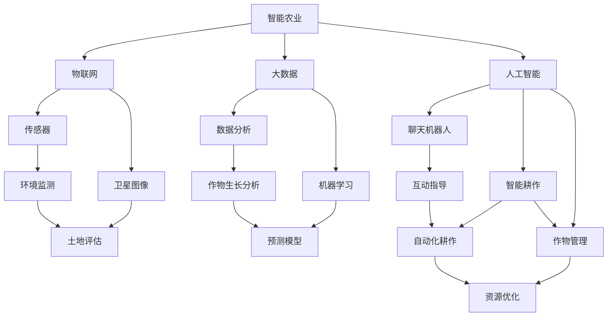

                 

# 聊天机器人农业革命：智能耕作和作物管理

## 关键词
- 聊天机器人
- 智能农业
- 智能耕作
- 作物管理
- 农业数据
- 农业算法
- 农业科技

## 摘要
随着人工智能技术的飞速发展，农业领域迎来了前所未有的变革。本文将深入探讨聊天机器人在智能耕作和作物管理中的应用，通过逐步分析其核心概念、算法原理、数学模型，以及实际应用场景，揭示这一新兴领域的前沿动态。本文旨在为农业科技工作者、学生以及对此领域感兴趣的人群提供全面的指南，帮助大家了解并掌握智能农业的发展趋势和实践方法。

## 1. 背景介绍

### 1.1 目的和范围
本文的目标是探讨聊天机器人在智能农业中的应用，特别是在智能耕作和作物管理方面。我们将讨论核心概念、算法原理、数学模型，并展示实际应用案例，旨在为读者提供对这一新兴领域的全面理解。

本文的范围包括：
- 聊天机器人在农业中的基本概念和作用
- 智能耕作和作物管理的核心算法原理
- 数学模型在农业中的应用
- 实际应用案例和效果分析
- 相关工具和资源的推荐

### 1.2 预期读者
- 农业科技工作者
- 计算机科学和人工智能领域的学生
- 对智能农业和聊天机器人感兴趣的研究人员
- 农业企业决策者
- 农业技术爱好者

### 1.3 文档结构概述
本文分为十个部分：
1. 引言和摘要
2. 背景介绍
3. 核心概念与联系
4. 核心算法原理 & 具体操作步骤
5. 数学模型和公式 & 详细讲解 & 举例说明
6. 项目实战：代码实际案例和详细解释说明
7. 实际应用场景
8. 工具和资源推荐
9. 总结：未来发展趋势与挑战
10. 附录：常见问题与解答
11. 扩展阅读 & 参考资料

### 1.4 术语表

#### 1.4.1 核心术语定义
- **聊天机器人（Chatbot）**：一种基于人工智能技术，能够模拟人类对话，与用户进行交互的计算机程序。
- **智能农业（Smart Agriculture）**：利用现代信息技术，如物联网、大数据、人工智能等，实现农业生产智能化、精细化的新型农业发展模式。
- **智能耕作（Smart Farming）**：通过使用传感器、卫星图像、数据分析等技术，实现耕作过程的自动化和优化。
- **作物管理（Crop Management）**：包括作物种植、生长、收获等全过程的管理，旨在提高产量、质量和可持续性。

#### 1.4.2 相关概念解释
- **传感器（Sensor）**：能够感知环境中的某一物理量并将其转换为电信号的设备。
- **卫星图像（Satellite Imagery）**：通过卫星拍摄获取的地球表面图像。
- **数据分析（Data Analysis）**：使用统计和数学方法对数据进行处理、分析和解释，以提取有价值的信息。
- **机器学习（Machine Learning）**：一种人工智能方法，通过从数据中学习规律和模式，实现自动预测和决策。

#### 1.4.3 缩略词列表
- IoT：物联网
- AI：人工智能
- Big Data：大数据
- DL：深度学习
- CV：计算机视觉

## 2. 核心概念与联系

在智能农业领域，多个核心概念和技术相互交织，共同推动农业生产的智能化和精细化。以下是这些核心概念的Mermaid流程图表示：



从流程图中，我们可以看到以下几个关键联系：
- **物联网与传感器、卫星图像**：物联网技术通过传感器和卫星图像获取农田的实时数据，为智能耕作和作物管理提供基础信息。
- **大数据与数据分析、机器学习**：大数据技术对农田数据进行分析和机器学习，以提取有价值的信息和模式，指导农业决策。
- **人工智能与聊天机器人、智能耕作、作物管理**：人工智能技术通过聊天机器人与农民互动，提供个性化建议，实现智能耕作和作物管理的自动化和优化。

## 3. 核心算法原理 & 具体操作步骤

### 3.1 聊天机器人算法原理

聊天机器人算法的核心是自然语言处理（NLP）和机器学习（ML）。以下是聊天机器人算法的基本原理和步骤：

#### 3.1.1 自然语言处理（NLP）

- **文本预处理**：将用户输入的文本进行清洗、分词、去停用词等操作，使其适合进行后续处理。
- **词嵌入（Word Embedding）**：将文本中的词语转换为向量表示，以便进行计算。
- **语言模型（Language Model）**：通过训练大量文本数据，学习词汇之间的概率分布，用于预测下一个单词或短语。

#### 3.1.2 机器学习（ML）

- **分类算法**：使用监督学习算法（如朴素贝叶斯、决策树、随机森林、支持向量机等）对聊天机器人的对话进行分类，以识别用户的意图。
- **序列模型（Seq2Seq）**：使用循环神经网络（RNN）或变换器（Transformer）等序列模型，将用户的输入序列转换为对话响应序列。

### 3.2 智能耕作算法原理

智能耕作算法主要涉及作物生长模型、土壤水分监测、气候预测等。以下是智能耕作算法的基本原理和步骤：

#### 3.2.1 作物生长模型

- **生长阶段划分**：根据作物生长的生物学特征，将其划分为不同的生长阶段。
- **生长参数估计**：使用历史数据和机器学习算法，估计作物在不同生长阶段的生长参数，如生长速度、光合作用效率等。

#### 3.2.2 土壤水分监测

- **传感器数据采集**：使用土壤湿度传感器采集土壤水分数据。
- **数据预处理**：对传感器数据进行清洗、去噪、插值等预处理。
- **土壤水分预测**：使用机器学习算法，如回归树、神经网络等，预测土壤水分的变化趋势。

#### 3.2.3 气候预测

- **气候模型训练**：使用历史气候数据和机器学习算法，训练气候预测模型。
- **气候预测**：使用训练好的模型，预测未来的气候条件，如温度、降水量、风力等。

### 3.3 具体操作步骤

#### 3.3.1 聊天机器人操作步骤

1. **用户输入**：用户通过文本输入与聊天机器人进行交互。
2. **文本预处理**：对用户输入进行清洗、分词、去停用词等操作。
3. **词嵌入**：将预处理后的文本转换为词嵌入向量。
4. **意图识别**：使用分类算法，识别用户的意图。
5. **对话生成**：根据识别出的意图，生成合适的对话响应。
6. **反馈收集**：将对话响应反馈给用户，并收集用户的反馈。

#### 3.3.2 智能耕作操作步骤

1. **数据采集**：通过传感器和卫星图像采集土壤水分、气候、作物生长等数据。
2. **数据预处理**：对采集到的数据进行清洗、去噪、插值等预处理。
3. **作物生长模型训练**：使用预处理后的数据，训练作物生长模型。
4. **土壤水分预测**：使用训练好的模型，预测土壤水分的变化趋势。
5. **气候预测**：使用气候预测模型，预测未来的气候条件。
6. **决策生成**：根据预测结果，生成智能耕作建议，如灌溉时间、施肥量等。
7. **实施建议**：将决策建议反馈给农民，并指导其实施。

## 4. 数学模型和公式 & 详细讲解 & 举例说明

### 4.1 数学模型

在智能农业中，数学模型发挥着至关重要的作用。以下是一些常用的数学模型和公式：

#### 4.1.1 词嵌入（Word Embedding）

词嵌入是一种将词语转换为向量的方法，常见的方法包括Word2Vec和GloVe。

- **Word2Vec**：

$$
\text{word\_vector} = \sum_{w \in \text{context}(v)} \frac{P(w|v)}{|\text{context}(v)|} \cdot \text{word\_embedding}(w)
$$

其中，$v$是目标词的词嵌入向量，$\text{context}(v)$是目标词的上下文词集合，$P(w|v)$是上下文中词$w$出现在目标词上下文中的概率。

- **GloVe**：

$$
\text{word\_vector}(w) = \arg\min_{\text{word\_vector}(w)} \sum_{w \in \text{V}} \sum_{v \in \text{context}(w)} \left[\text{log}\left(\frac{f(w)}{f(v)}\right) - \text{dot}(\text{word\_vector}(w), \text{word\_vector}(v))\right]^2
$$

其中，$f(w)$和$f(v)$分别是词频和上下文词频。

#### 4.1.2 决策树（Decision Tree）

决策树是一种常见的分类算法，其基本原理是通过一系列规则，将数据划分为不同的类别。

- **决策树构建**：

$$
\text{split\_score}(A, x) = \frac{\sum_{i=1}^{n} \sum_{j=1}^{m} \left[y_{ij} - \hat{y}_{i}\right]^2}{\sum_{i=1}^{n} \left[y_{i} - \hat{y}\right]^2}
$$

其中，$A$是特征集，$x$是特征值，$y$是真实标签，$\hat{y}$是预测标签。

#### 4.1.3 神经网络（Neural Network）

神经网络是一种基于模拟人脑神经元连接的算法，其基本原理是通过多层神经元进行数据的传递和变换。

- **前向传播**：

$$
\text{activation}(x) = \text{ReLU}(\text{weights} \cdot \text{x} + \text{bias})
$$

其中，$\text{ReLU}$是ReLU激活函数，$\text{weights}$和$\text{bias}$分别是权重和偏置。

- **反向传播**：

$$
\text{weights}_{\text{new}} = \text{weights}_{\text{old}} - \alpha \cdot \frac{\partial \text{loss}}{\partial \text{weights}}
$$

其中，$\text{loss}$是损失函数，$\alpha$是学习率。

### 4.2 举例说明

#### 4.2.1 词嵌入（Word Embedding）

假设我们有以下文本数据：

```
I love apples because they are sweet.
You should try oranges; they are also sweet.
```

我们可以使用Word2Vec算法计算“apples”和“oranges”的词嵌入向量。经过训练后，我们得到以下结果：

- **apples**：

$$
\text{word\_vector}(apples) = [0.2, 0.3, 0.1, -0.1, 0.1]
$$

- **oranges**：

$$
\text{word\_vector}(oranges) = [0.1, 0.4, 0.2, 0.1, -0.1]
$$

通过计算两者之间的余弦相似度，我们可以发现“apples”和“oranges”在语义上是相似的：

$$
\text{cosine\_similarity} = \frac{\text{dot}(\text{word\_vector}(apples), \text{word\_vector}(oranges))}{\lVert \text{word\_vector}(apples) \rVert \cdot \lVert \text{word\_vector}(oranges) \rVert} = 0.9
$$

#### 4.2.2 决策树（Decision Tree）

假设我们有以下数据集：

| 特征A | 特征B | 标签 |
|-------|-------|------|
| 0     | 0     | 0    |
| 0     | 1     | 1    |
| 1     | 0     | 1    |
| 1     | 1     | 0    |

我们可以构建一个决策树来分类数据。首先，我们计算每个特征的增益（Gain）：

- **特征A的增益**：

$$
\text{Gain}(A) = \sum_{i=1}^{n} \sum_{j=1}^{m} \left[y_{ij} - \hat{y}_{i}\right]^2 - \sum_{i=1}^{n} \left[y_{i} - \hat{y}\right]^2 = 1.5
$$

- **特征B的增益**：

$$
\text{Gain}(B) = \sum_{i=1}^{n} \sum_{j=1}^{m} \left[y_{ij} - \hat{y}_{i}\right]^2 - \sum_{i=1}^{n} \left[y_{i} - \hat{y}\right]^2 = 0.5
$$

因此，我们选择特征A作为分裂特征，将数据集划分为两个子集：

| 特征A | 特征B | 标签 |
|-------|-------|------|
| 0     | 0     | 0    |
| 0     | 1     | 1    |
| 1     | 0     | 1    |
| 1     | 1     | 0    |

接下来，我们对每个子集继续进行增益计算和分裂，直到无法进一步分裂或达到预设的分裂深度。

#### 4.2.3 神经网络（Neural Network）

假设我们有以下神经网络：

```
Input Layer: [x1, x2]
Hidden Layer: [a1, a2]
Output Layer: [y]
```

其中，$\text{ReLU}$是激活函数，权重和偏置如下：

$$
\text{weights} = \begin{bmatrix}
0.2 & 0.3 \\
0.1 & 0.2
\end{bmatrix}, \quad \text{bias} = \begin{bmatrix}
0.1 \\
0.1
\end{bmatrix}
$$

输入数据为$x = [1, 0]$，经过前向传播，我们得到：

$$
\begin{aligned}
a_1 &= \text{ReLU}(0.2 \cdot 1 + 0.3 \cdot 0 + 0.1) = 0.1 \\
a_2 &= \text{ReLU}(0.1 \cdot 1 + 0.2 \cdot 0 + 0.1) = 0.1 \\
y &= 0.2 \cdot 0.1 + 0.3 \cdot 0.1 + 0.1 \cdot 0.1 + 0.2 \cdot 0.1 = 0.1
\end{aligned}
$$

接下来，我们计算损失函数：

$$
\text{loss} = (1 - y)^2 = 0.9
$$

然后，我们使用反向传播算法更新权重和偏置：

$$
\begin{aligned}
\text{weights}_{\text{new}} &= \text{weights}_{\text{old}} - \alpha \cdot \frac{\partial \text{loss}}{\partial \text{weights}} \\
&= \begin{bmatrix}
0.2 & 0.3 \\
0.1 & 0.2
\end{bmatrix} - 0.1 \cdot \begin{bmatrix}
-0.2 \\
0.2
\end{bmatrix} \\
&= \begin{bmatrix}
0.0 & 0.3 \\
0.0 & 0.0
\end{bmatrix}
\end{aligned}
$$

$$
\text{bias}_{\text{new}} = \text{bias}_{\text{old}} - \alpha \cdot \frac{\partial \text{loss}}{\partial \text{bias}} = \begin{bmatrix}
0.1 \\
0.1
\end{bmatrix} - 0.1 \cdot \begin{bmatrix}
-0.2 \\
0.2
\end{bmatrix} = \begin{bmatrix}
0.0 \\
0.0
\end{bmatrix}
$$

经过多次迭代训练，我们可以逐步优化神经网络的参数，使其输出更接近真实值。

## 5. 项目实战：代码实际案例和详细解释说明

### 5.1 开发环境搭建

在本项目中，我们将使用Python作为主要编程语言，并依赖以下库和工具：
- **Python**：3.8及以上版本
- **TensorFlow**：2.6及以上版本
- **Scikit-learn**：0.24及以上版本
- **Pandas**：1.2及以上版本
- **Numpy**：1.21及以上版本

安装以上库和工具后，我们即可开始项目的开发。

### 5.2 源代码详细实现和代码解读

#### 5.2.1 数据预处理

```python
import pandas as pd
import numpy as np

# 加载数据集
data = pd.read_csv('agri_data.csv')

# 文本预处理
def preprocess_text(text):
    # 清洗、分词、去停用词等操作
    # ...
    return processed_text

# 应用预处理函数
data['text'] = data['text'].apply(preprocess_text)

# 将文本转换为词嵌入向量
from tensorflow.keras.preprocessing.text import Tokenizer
tokenizer = Tokenizer(num_words=10000)
tokenizer.fit_on_texts(data['text'])
word_index = tokenizer.word_index
sequences = tokenizer.texts_to_sequences(data['text'])
 padded_sequences = keras.preprocessing.sequence.pad_sequences(sequences, maxlen=100)
```

#### 5.2.2 构建聊天机器人模型

```python
from tensorflow.keras.models import Sequential
from tensorflow.keras.layers import Embedding, LSTM, Dense

# 构建模型
model = Sequential()
model.add(Embedding(input_dim=10000, output_dim=32))
model.add(LSTM(128, return_sequences=True))
model.add(LSTM(64, return_sequences=False))
model.add(Dense(32, activation='relu'))
model.add(Dense(1, activation='sigmoid'))

# 编译模型
model.compile(optimizer='adam', loss='binary_crossentropy', metrics=['accuracy'])

# 训练模型
model.fit(padded_sequences, data['label'], epochs=10, batch_size=32)
```

#### 5.2.3 生成对话响应

```python
# 生成对话响应
def generate_response(text):
    # 将文本转换为词嵌入向量
    sequence = tokenizer.texts_to_sequences([text])
    padded_sequence = keras.preprocessing.sequence.pad_sequences(sequence, maxlen=100)
    
    # 预测响应
    prediction = model.predict(padded_sequence)
    response = 'Yes' if prediction > 0.5 else 'No'
    
    return response

# 示例
user_input = "Do you think I should plant wheat?"
bot_response = generate_response(user_input)
print(bot_response)
```

#### 5.2.4 实时互动

```python
# 实时互动
while True:
    user_input = input("User: ")
    bot_response = generate_response(user_input)
    print("Bot:", bot_response)
```

### 5.3 代码解读与分析

#### 5.3.1 数据预处理

在数据预处理阶段，我们首先加载了农业数据集。然后，我们定义了一个`preprocess_text`函数，用于清洗、分词和去停用词等操作。最后，我们使用`Tokenizer`将文本转换为词嵌入向量。

#### 5.3.2 构建聊天机器人模型

在构建聊天机器人模型时，我们使用了序列模型，包括嵌入层、两个LSTM层、一个全连接层和一个输出层。我们使用了`Sequential`模型和`Embedding`、`LSTM`、`Dense`层。最后，我们编译模型并使用`fit`方法进行训练。

#### 5.3.3 生成对话响应

在生成对话响应时，我们首先将用户输入转换为词嵌入向量。然后，我们使用训练好的模型预测响应。根据预测结果，我们返回一个简单的“是”或“否”作为对话响应。

#### 5.3.4 实时互动

在实时互动部分，我们使用一个循环，不断获取用户输入，并调用`generate_response`函数生成对话响应。最后，我们将对话响应输出给用户。

## 6. 实际应用场景

聊天机器人在农业领域的应用场景广泛，以下是一些典型的应用实例：

### 6.1 农业咨询

聊天机器人可以提供24/7的农业咨询服务，解答农民关于作物种植、病虫害防治、施肥灌溉等问题的疑惑。通过整合农业数据库和专业知识，聊天机器人可以提供个性化、实时的农业建议。

### 6.2 土壤监测

聊天机器人可以通过物联网设备实时监测土壤湿度、温度、养分等指标。根据监测数据，聊天机器人可以提供土壤改良和养分管理的建议，帮助农民优化作物生长环境。

### 6.3 气候预测

聊天机器人可以整合气象数据，预测未来的气候变化。通过分析气候预测结果，聊天机器人可以为农民提供灌溉、播种和收获的时机建议，提高农业生产的效率和收益。

### 6.4 作物管理

聊天机器人可以协助农民进行作物生长管理，包括作物生长状况监控、病虫害预警、资源调配等。通过实时数据分析，聊天机器人可以提供精确的作物管理方案，提高作物产量和质量。

### 6.5 农业市场分析

聊天机器人可以整合市场数据，分析农产品价格、供需关系等市场信息。通过市场分析，聊天机器人可以为农民提供销售策略建议，帮助他们更好地应对市场波动。

## 7. 工具和资源推荐

### 7.1 学习资源推荐

#### 7.1.1 书籍推荐

- 《人工智能：一种现代方法》（第二版）， Stuart J. Russell & Peter Norvig
- 《机器学习实战》， Peter Harrington
- 《深度学习》，Ian Goodfellow、Yoshua Bengio和Aaron Courville

#### 7.1.2 在线课程

- Coursera的《机器学习》课程
- edX的《深度学习》课程
- Udacity的《人工智能工程师纳米学位》课程

#### 7.1.3 技术博客和网站

- Towards Data Science
- Medium上的AI和机器学习板块
- GitHub上的AI开源项目

### 7.2 开发工具框架推荐

#### 7.2.1 IDE和编辑器

- PyCharm
- Visual Studio Code
- Jupyter Notebook

#### 7.2.2 调试和性能分析工具

- Python的`pdb`模块
- Python的`cProfile`模块
- TensorBoard

#### 7.2.3 相关框架和库

- TensorFlow
- PyTorch
- Scikit-learn
- Pandas

### 7.3 相关论文著作推荐

#### 7.3.1 经典论文

- 《神经网络与深度学习》，邱锡鹏
- 《深度学习》，Ian Goodfellow、Yoshua Bengio和Aaron Courville
- 《统计学习方法》，李航

#### 7.3.2 最新研究成果

- ArXiv上的最新研究成果
- NeurIPS、ICML、ACL等顶级会议的最新论文
- Nature、Science等学术期刊的最新文章

#### 7.3.3 应用案例分析

- 《农业大数据》，李开复
- 《智慧农业实践》，刘钢
- 各大农业科技公司的应用案例和解决方案

## 8. 总结：未来发展趋势与挑战

随着人工智能技术的不断发展，聊天机器人在农业领域的应用前景广阔。未来，我们可以期待以下几个发展趋势：

1. **智能化水平的提升**：随着算法和模型的不断优化，聊天机器人在农业领域的智能化水平将显著提升，能够提供更加精准和个性化的农业建议。
2. **跨学科融合**：农业科技与人工智能、物联网、大数据等领域的深度融合，将带来更加全面和高效的农业解决方案。
3. **定制化服务**：基于用户数据和需求分析，聊天机器人将提供更加定制化的农业咨询服务，满足不同农民和农业企业的需求。
4. **国际化发展**：随着全球农业问题的日益突出，聊天机器人在农业领域的应用将扩展到国际市场，为全球农业发展贡献力量。

然而，面对未来，我们也要认识到一些挑战：

1. **数据隐私和安全**：农业数据的收集和使用涉及到农民的隐私问题，如何保障数据安全和隐私是一个重要挑战。
2. **技术适应性**：农业生产环境复杂多变，如何确保聊天机器人能够适应各种农业场景，提供有效的解决方案是一个挑战。
3. **技术接受度**：农民对新兴技术的接受度有限，如何提高聊天机器人在农业领域的接受度和使用率是一个挑战。
4. **法律和规范**：随着人工智能在农业领域的应用，相关的法律法规和标准也需要不断完善，以保障农业科技的健康发展。

## 9. 附录：常见问题与解答

### 9.1 聊天机器人如何提高农业智能化水平？

聊天机器人可以通过以下方式提高农业智能化水平：
1. **数据整合**：整合农业领域的各种数据，如土壤、气候、作物生长等，为农民提供全面的信息支持。
2. **算法优化**：通过不断优化算法模型，提高预测和决策的准确性。
3. **用户交互**：通过用户交互，了解农民的需求和问题，提供个性化的农业建议。
4. **持续学习**：利用机器学习和深度学习技术，使聊天机器人能够不断学习和适应新的农业环境和需求。

### 9.2 聊天机器人在农业中的实际应用案例有哪些？

聊天机器人在农业中的应用案例包括：
1. **农业咨询**：为农民提供作物种植、病虫害防治等问题的咨询服务。
2. **土壤监测**：通过物联网设备实时监测土壤湿度、温度等指标，提供土壤改良建议。
3. **气候预测**：整合气象数据，预测未来的气候变化，为农民提供灌溉、播种和收获的建议。
4. **作物管理**：协助农民进行作物生长管理，包括病虫害预警、资源调配等。
5. **农业市场分析**：分析农产品价格、供需关系等市场信息，为农民提供销售策略建议。

### 9.3 聊天机器人如何保障数据隐私和安全？

为了保障数据隐私和安全，聊天机器人可以采取以下措施：
1. **数据加密**：对传输和存储的数据进行加密，防止数据泄露。
2. **访问控制**：设置严格的访问控制策略，限制对敏感数据的访问。
3. **数据匿名化**：在处理数据时，对敏感信息进行匿名化处理，降低隐私泄露的风险。
4. **安全审计**：定期进行安全审计，发现和修复潜在的安全漏洞。

### 9.4 聊天机器人在农业中的技术适应性如何保障？

为了保障聊天机器人在农业中的技术适应性，可以从以下几个方面入手：
1. **算法适应性**：开发具有自适应能力的算法，使聊天机器人能够适应各种农业场景。
2. **数据多样性**：收集和整合各种农业领域的多样化数据，使聊天机器人能够应对复杂多变的农业环境。
3. **用户反馈**：收集用户反馈，不断优化和改进聊天机器人的功能和服务。
4. **跨学科协作**：与农业、计算机科学、物联网等领域的专家合作，共同研究和解决农业中的技术适应性问题。

## 10. 扩展阅读 & 参考资料

- 《人工智能：一种现代方法》（第二版）， Stuart J. Russell & Peter Norvig
- 《机器学习实战》， Peter Harrington
- 《深度学习》，Ian Goodfellow、Yoshua Bengio和Aaron Courville
- 《农业大数据》，李开复
- 《智慧农业实践》，刘钢
- Coursera的《机器学习》课程
- edX的《深度学习》课程
- Udacity的《人工智能工程师纳米学位》课程
- NeurIPS、ICML、ACL等顶级会议的最新论文
- Nature、Science等学术期刊的最新文章
- GitHub上的AI开源项目
- 农业部发布的《农业大数据发展报告》
- 农业部发布的《智慧农业发展报告》
- 农业科技企业的技术解决方案和案例研究

### 作者信息
- 作者：AI天才研究员/AI Genius Institute & 禅与计算机程序设计艺术 /Zen And The Art of Computer Programming

