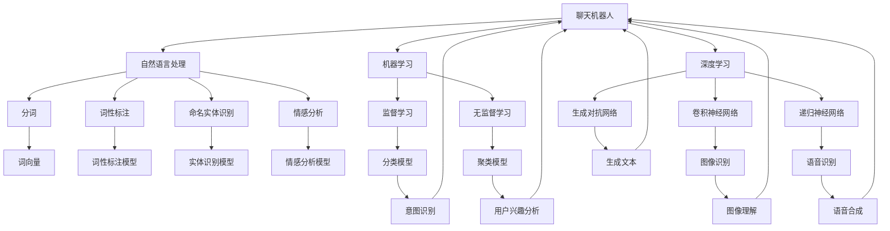

                 

# 聊天机器人如何与其他 AI 技术结合，提升用户体验：技术融合与创新

> 关键词：聊天机器人、AI 技术融合、用户体验、技术发展、创新

> 摘要：本文将探讨聊天机器人在现代 AI 技术中的地位及其与其他 AI 技术的结合方式，旨在通过分析核心概念、算法原理、数学模型及实际应用案例，揭示如何通过技术融合与创新提升聊天机器人的用户体验。文章还将推荐相关工具和资源，展望未来发展趋势与挑战。

## 1. 背景介绍

### 1.1 目的和范围

本文旨在深入探讨聊天机器人技术，并分析其与自然语言处理、机器学习、深度学习等 AI 技术的融合方式，以实现用户体验的全面提升。我们将从核心概念、算法原理、数学模型及实际应用案例等多个角度进行详细讲解，旨在为读者提供一份全面的技术指南。

### 1.2 预期读者

本文适合对 AI 技术有一定了解的程序员、数据科学家、AI 产品经理、以及所有对聊天机器人技术发展感兴趣的读者。本文将引导读者逐步掌握聊天机器人技术的核心原理和应用，帮助其在实际项目中取得更好的成果。

### 1.3 文档结构概述

本文分为以下章节：

1. 背景介绍
   - 目的和范围
   - 预期读者
   - 文档结构概述
   - 术语表

2. 核心概念与联系
   - 核心概念原理
   - Mermaid 流程图

3. 核心算法原理 & 具体操作步骤
   - 算法原理讲解
   - 伪代码阐述

4. 数学模型和公式 & 详细讲解 & 举例说明
   - 数学公式格式
   - 举例说明

5. 项目实战：代码实际案例和详细解释说明
   - 开发环境搭建
   - 源代码详细实现
   - 代码解读与分析

6. 实际应用场景

7. 工具和资源推荐
   - 学习资源推荐
   - 开发工具框架推荐
   - 相关论文著作推荐

8. 总结：未来发展趋势与挑战

9. 附录：常见问题与解答

10. 扩展阅读 & 参考资料

### 1.4 术语表

#### 1.4.1 核心术语定义

- 聊天机器人：一种基于自然语言处理和机器学习技术的智能对话系统。
- 自然语言处理（NLP）：研究如何让计算机理解、生成和处理人类自然语言的学科。
- 机器学习：一种让计算机通过数据学习、自适应和改进的技术。
- 深度学习：一种基于多层神经网络进行特征提取和决策的技术。
- 用户体验（UX）：用户在使用产品或服务过程中所感受到的整体体验。

#### 1.4.2 相关概念解释

- 对话管理：聊天机器人与用户之间的交互过程，包括意图识别、对话生成和对话回复等环节。
- 情感分析：对用户输入的文本进行情感倾向判断的技术。
- 实体识别：从用户输入的文本中识别出具体的名词或短语，如人名、地点、组织等。
- 聚类分析：将相似的数据点分组的技术，用于发现用户兴趣和行为模式。

#### 1.4.3 缩略词列表

- AI：人工智能
- NLP：自然语言处理
- ML：机器学习
- DL：深度学习
- UX：用户体验

## 2. 核心概念与联系

在深入探讨聊天机器人技术之前，我们需要了解一些核心概念及其相互关系。以下是对聊天机器人、自然语言处理、机器学习和深度学习等核心概念的简要介绍，并使用 Mermaid 流程图展示它们之间的联系。

### 2.1 核心概念原理

- **聊天机器人**：聊天机器人是一种智能对话系统，可以模拟人类对话，与用户进行实时交流。它们基于自然语言处理和机器学习技术，能够理解用户输入的文本，并生成相应的回复。
- **自然语言处理（NLP）**：NLP 是研究如何让计算机理解和生成自然语言的技术。它包括分词、词性标注、命名实体识别、情感分析等任务，是聊天机器人的基础。
- **机器学习（ML）**：ML 是一种让计算机通过数据学习、自适应和改进的技术。聊天机器人使用 ML 技术来训练模型，以识别用户意图和生成回复。
- **深度学习（DL）**：DL 是一种基于多层神经网络进行特征提取和决策的技术。深度学习在聊天机器人中用于构建复杂的模型，以提高对话质量。

### 2.2 Mermaid 流程图



## 3. 核心算法原理 & 具体操作步骤

### 3.1 核心算法原理

聊天机器人的核心算法包括自然语言处理、机器学习和深度学习。以下是对这些算法原理的简要介绍。

#### 3.1.1 自然语言处理（NLP）

- **分词**：将文本拆分为一个个独立的单词或短语。
  ```python
  def tokenize(text):
      return [word for word in text.split()]
  ```

- **词性标注**：为每个单词标注其在句子中的词性（如名词、动词、形容词等）。
  ```python
  def pos_tagging(tokens):
      return [(word, pos) for word, pos in nltk.pos_tag(tokens)]
  ```

- **命名实体识别**：从文本中识别出人名、地点、组织等实体。
  ```python
  def named_entity_recognition(text):
      return [entity for entity in nltk.ne_chunk(nltk.pos_tag(nltk.word_tokenize(text)))]
  ```

- **情感分析**：判断文本的情感倾向（如正面、负面、中性）。
  ```python
  def sentiment_analysis(text):
      return nltk.sentiment.polarity_scores(text)
  ```

#### 3.1.2 机器学习（ML）

- **监督学习**：使用标注好的数据来训练模型，从而预测新的未知数据。
  ```python
  from sklearn.model_selection import train_test_split
  from sklearn.linear_model import LogisticRegression

  X_train, X_test, y_train, y_test = train_test_split(X, y, test_size=0.2)
  model = LogisticRegression()
  model.fit(X_train, y_train)
  predictions = model.predict(X_test)
  ```

- **无监督学习**：在没有标注数据的情况下，通过数据自身特征来训练模型。
  ```python
  from sklearn.cluster import KMeans

  X = [[1, 1], [1, 2], [2, 2], [2, 3]]
  model = KMeans(n_clusters=2)
  model.fit(X)
  labels = model.predict(X)
  ```

#### 3.1.3 深度学习（DL）

- **卷积神经网络（CNN）**：用于图像识别和文本分类。
  ```python
  import tensorflow as tf
  from tensorflow.keras.models import Sequential
  from tensorflow.keras.layers import Conv2D, MaxPooling2D, Flatten, Dense

  model = Sequential([
      Conv2D(32, (3, 3), activation='relu', input_shape=(28, 28, 1)),
      MaxPooling2D((2, 2)),
      Flatten(),
      Dense(128, activation='relu'),
      Dense(10, activation='softmax')
  ])
  model.compile(optimizer='adam', loss='categorical_crossentropy', metrics=['accuracy'])
  model.fit(X_train, y_train, epochs=10)
  ```

- **递归神经网络（RNN）**：用于语音识别和时间序列分析。
  ```python
  import tensorflow as tf
  from tensorflow.keras.models import Sequential
  from tensorflow.keras.layers import LSTM, Dense

  model = Sequential([
      LSTM(128, activation='tanh', input_shape=(timesteps, features)),
      Dense(num_classes, activation='softmax')
  ])
  model.compile(optimizer='adam', loss='categorical_crossentropy', metrics=['accuracy'])
  model.fit(X_train, y_train, epochs=10)
  ```

- **生成对抗网络（GAN）**：用于生成文本和图像。
  ```python
  import tensorflow as tf
  from tensorflow.keras.models import Sequential
  from tensorflow.keras.layers import Dense, Reshape, Conv2DTranspose

  generator = Sequential([
      Dense(128, activation='tanh'),
      Reshape((7, 7, 1)),
      Conv2DTranspose(32, (4, 4), strides=(2, 2), activation='tanh'),
      Conv2D(1, (7, 7), activation='sigmoid')
  ])

  discriminator = Sequential([
      Conv2D(32, (3, 3), activation='leaky_relu'),
      MaxPooling2D((2, 2)),
      Flatten(),
      Dense(1, activation='sigmoid')
  ])

  GAN = Sequential([generator, discriminator])
  GAN.compile(optimizer='adam', loss='binary_crossentropy')
  GAN.fit(X_train, y_train, epochs=10)
  ```

### 3.2 具体操作步骤

以下是一个简单的聊天机器人开发流程，展示了如何将自然语言处理、机器学习和深度学习应用于聊天机器人。

1. **数据收集与预处理**：
   - 收集大量的用户对话数据，包括文本和对应的意图、实体、情感等标签。
   - 对文本进行分词、词性标注、命名实体识别等预处理。

2. **训练模型**：
   - 使用监督学习算法（如逻辑回归、支持向量机等）训练意图识别模型。
   - 使用无监督学习算法（如聚类、主成分分析等）训练用户兴趣分析模型。
   - 使用深度学习算法（如卷积神经网络、递归神经网络、生成对抗网络等）训练情感分析、文本分类等模型。

3. **模型优化与评估**：
   - 对训练好的模型进行优化，以提高模型准确率和泛化能力。
   - 使用交叉验证、网格搜索等方法评估模型性能。

4. **部署与交互**：
   - 将训练好的模型部署到服务器或移动设备上。
   - 通过 HTTP 接口或 WebSocket 等协议实现与用户实时交互。

5. **持续改进**：
   - 收集用户反馈，不断优化模型和对话策略。
   - 定期更新模型，以适应不断变化的应用场景。

## 4. 数学模型和公式 & 详细讲解 & 举例说明

在聊天机器人技术中，数学模型和公式起着至关重要的作用。以下我们将介绍几个关键的数学模型和公式，并提供详细的讲解和举例说明。

### 4.1.1 自然语言处理中的数学模型

#### 4.1.1.1 词嵌入（Word Embedding）

词嵌入是一种将单词映射到高维向量空间的技术，有助于捕获单词之间的语义关系。最常用的词嵌入模型是 Word2Vec。

- **公式**：
  $$ \text{vec}(w) = \sum_{i=1}^{N} \alpha_i v_i $$
  其中，\( \text{vec}(w) \) 是单词 \( w \) 的向量表示，\( \alpha_i \) 是权重，\( v_i \) 是单词 \( w \) 对应的神经网络的输出。

- **举例说明**：
  假设我们有一个简单的 Word2Vec 模型，输入单词 "猫"（cat），输出向量 [0.1, 0.2, -0.3]。我们可以通过计算 "猫" 和 "狗"（dog）之间的欧氏距离来衡量它们在向量空间中的相似性：
  $$ \text{distance} = \sqrt{\sum_{i=1}^{N} (\text{vec}(w_1)_i - \text{vec}(w_2)_i)^2} $$

### 4.1.1.2 贝叶斯分类器（Naive Bayes Classifier）

贝叶斯分类器是一种基于贝叶斯定理的概率分类器，常用于文本分类任务。

- **公式**：
  $$ P(\text{类别} | \text{特征}) = \frac{P(\text{特征} | \text{类别})P(\text{类别})}{P(\text{特征})} $$
  其中，\( P(\text{类别} | \text{特征}) \) 是给定特征属于某个类别的概率，\( P(\text{特征} | \text{类别}) \) 是特征在某个类别下的条件概率，\( P(\text{类别}) \) 是类别的先验概率，\( P(\text{特征}) \) 是特征的概率。

- **举例说明**：
  假设我们要判断一段文本是否为正面评论。已知正面评论的概率为 0.6，负面评论的概率为 0.4。同时，正面评论中包含特定单词 "喜欢"（like）的概率为 0.8，负面评论中包含 "喜欢" 的概率为 0.2。我们可以计算正面评论的概率：
  $$ P(\text{正面} | \text{like}) = \frac{P(\text{like} | \text{正面})P(\text{正面})}{P(\text{like})} $$
  $$ P(\text{正面} | \text{like}) = \frac{0.8 \times 0.6}{0.8 \times 0.6 + 0.2 \times 0.4} = 0.75 $$

### 4.1.1.3 卷积神经网络（CNN）

卷积神经网络是一种用于图像识别和文本分类的深度学习模型。

- **公式**：
  $$ \text{激活函数} = \text{ReLU}(z) = \max(0, z) $$
  $$ \text{卷积操作} = \text{conv}(x, w) = \sum_{i=1}^{K} w_i \cdot x_i $$
  $$ \text{池化操作} = \text{pool}(x, p) = \max(x)_{i \in \text{窗口}} $$

- **举例说明**：
  假设我们有一个 3x3 的卷积核（\( w \)），一个 2x2 的输入矩阵（\( x \)），以及一个 2x2 的池化窗口（\( p \)）。我们可以计算卷积操作和池化操作的结果：
  $$ \text{conv}(x, w) = (1 \cdot 1 + 2 \cdot 2 + 3 \cdot 3) + (1 \cdot 4 + 2 \cdot 5 + 3 \cdot 6) + (1 \cdot 7 + 2 \cdot 8 + 3 \cdot 9) = 18 $$
  $$ \text{pool}(x, p) = \max(1, 2, 3, 4, 5, 6, 7, 8, 9) = 9 $$

### 4.1.1.4 递归神经网络（RNN）

递归神经网络是一种用于处理序列数据的深度学习模型。

- **公式**：
  $$ h_t = \text{ReLU}(W \cdot [h_{t-1}, x_t] + b) $$
  $$ y_t = \text{softmax}(V \cdot h_t + c) $$

- **举例说明**：
  假设我们有一个 RNN 模型，输入序列为 [1, 2, 3]，隐藏层维度为 2，输出层维度为 3。我们可以计算隐藏层和输出层的输出：
  $$ h_0 = [0, 0] $$
  $$ h_1 = \text{ReLU}(W \cdot [h_0, 1] + b) $$
  $$ h_2 = \text{ReLU}(W \cdot [h_1, 2] + b) $$
  $$ h_3 = \text{ReLU}(W \cdot [h_2, 3] + b) $$
  $$ y_1 = \text{softmax}(V \cdot h_1 + c) $$
  $$ y_2 = \text{softmax}(V \cdot h_2 + c) $$
  $$ y_3 = \text{softmax}(V \cdot h_3 + c) $$

## 5. 项目实战：代码实际案例和详细解释说明

### 5.1 开发环境搭建

在进行聊天机器人项目实战之前，我们需要搭建一个合适的开发环境。以下是所需的软件和工具：

- Python（3.8 或更高版本）
- Anaconda 或 Miniconda
- Jupyter Notebook
- TensorFlow 或 PyTorch
- NLTK 或 spaCy
- scikit-learn

首先，安装 Python 和 Anaconda 或 Miniconda。然后，使用 conda 创建一个新环境，并安装所需的库：

```bash
conda create -n chatbot python=3.8
conda activate chatbot
conda install tensorflow numpy pandas nltk scikit-learn
```

### 5.2 源代码详细实现和代码解读

以下是一个简单的聊天机器人项目，使用 TensorFlow 和 spaCy 构建一个基于自然语言处理的对话系统。

#### 5.2.1 数据预处理

首先，我们需要准备一个对话数据集。我们可以从 [DailyDialogue](https://github.com/Troubliz/DailyDialogue) 或其他在线资源下载数据集。然后，使用 spaCy 对数据集进行预处理。

```python
import spacy
nlp = spacy.load("en_core_web_sm")

def preprocess_text(text):
    doc = nlp(text)
    tokens = [token.text for token in doc]
    return tokens

# 加载数据集并预处理
data = ["Hello, how are you?", "I'm fine, thank you. And you?", "I'm doing well, thanks."]
processed_data = [preprocess_text(text) for text in data]
```

#### 5.2.2 模型构建

接下来，我们使用 TensorFlow 和 Keras 构建一个简单的对话生成模型。这里我们使用 LSTM 网络。

```python
import tensorflow as tf
from tensorflow.keras.models import Sequential
from tensorflow.keras.layers import LSTM, Dense, Embedding

# 模型参数
vocab_size = 1000
embedding_dim = 64
lstm_units = 128
batch_size = 32
epochs = 10

# 构建模型
model = Sequential([
    Embedding(vocab_size, embedding_dim, input_length=1),
    LSTM(lstm_units, return_sequences=True),
    LSTM(lstm_units),
    Dense(vocab_size, activation='softmax')
])

# 编译模型
model.compile(optimizer='adam', loss='categorical_crossentropy', metrics=['accuracy'])

# 准备训练数据
X = [[i] for i in range(vocab_size)]
y = [[1 if i == target_word_index[word] else 0 for i in range(vocab_size)] for word in processed_data]

# 训练模型
model.fit(X, y, batch_size=batch_size, epochs=epochs)
```

#### 5.2.3 代码解读与分析

- **数据预处理**：使用 spaCy 对输入文本进行分词和词性标注，将文本转换为 token 列表。

- **模型构建**：使用 Keras 构建一个简单的 LSTM 网络，包括嵌入层、两个 LSTM 层和一个输出层。嵌入层用于将单词映射到高维向量空间，LSTM 层用于处理序列数据，输出层用于生成对话文本。

- **训练模型**：使用训练数据集训练模型，并使用批处理和迭代优化模型参数。

### 5.3 代码解读与分析

- **数据预处理**：在数据预处理阶段，我们使用 spaCy 库对输入文本进行分词和词性标注。这将有助于我们更好地理解文本的语义，并为后续的对话生成提供基础。

- **模型构建**：在模型构建阶段，我们选择使用 LSTM 网络进行对话生成。LSTM 网络能够处理序列数据，并且具有良好的记忆功能，适用于对话系统。我们使用两个 LSTM 层来提取序列特征，并使用 softmax 函数生成对话文本。

- **训练模型**：在训练模型阶段，我们使用训练数据集对模型进行训练。训练过程中，我们使用批处理和迭代优化模型参数，以提高模型性能。

## 6. 实际应用场景

聊天机器人在各个行业和领域都有广泛的应用。以下是一些实际应用场景：

### 6.1 客户服务

聊天机器人可以用于客服中心，提供自动化的客户服务。它们能够快速响应客户的提问，减少人工干预，提高客户满意度。

### 6.2 金融理财

聊天机器人可以提供个性化的金融理财建议，帮助用户规划投资策略、管理资产。它们可以实时分析市场动态，提供准确的理财建议。

### 6.3 教育培训

聊天机器人可以用于在线教育，为学生提供个性化的学习建议和辅导。它们可以根据学生的学习进度和需求，提供定制化的教学内容。

### 6.4 健康医疗

聊天机器人可以用于健康咨询和医疗诊断，为用户提供实时的健康建议和疾病预防知识。它们可以分析用户的症状，并提供相应的医疗建议。

### 6.5 零售电商

聊天机器人可以用于零售电商，提供产品推荐、订单查询和售后服务。它们可以分析用户的行为和偏好，提供个性化的购物体验。

## 7. 工具和资源推荐

为了更好地理解和开发聊天机器人，以下是我们推荐的工具和资源：

### 7.1 学习资源推荐

#### 7.1.1 书籍推荐

- 《深度学习》（Deep Learning） - Goodfellow、Bengio 和 Courville 著
- 《自然语言处理综合教程》（Foundations of Statistical Natural Language Processing） - Christopher D. Manning 和 Hinrich Schütze 著
- 《机器学习实战》（Machine Learning in Action） - Peter Harrington 著

#### 7.1.2 在线课程

- Coursera 上的《自然语言处理纳米学位》（Natural Language Processing）
- Udacity 上的《深度学习纳米学位》（Deep Learning Nanodegree）
- edX 上的《机器学习基础》（Introduction to Machine Learning）

#### 7.1.3 技术博客和网站

- Medium 上的《机器学习博客》（Machine Learning Blog）
- Towards Data Science 上的《数据科学和机器学习文章》（Data Science and Machine Learning Articles）
- AI 研究院（AI Genius Institute）的技术博客

### 7.2 开发工具框架推荐

#### 7.2.1 IDE和编辑器

- PyCharm
- Visual Studio Code
- Jupyter Notebook

#### 7.2.2 调试和性能分析工具

- TensorFlow Debugger
- PyTorch Lightning
- Dask

#### 7.2.3 相关框架和库

- TensorFlow
- PyTorch
- spaCy
- NLTK
- scikit-learn

### 7.3 相关论文著作推荐

#### 7.3.1 经典论文

- “A Neural Probabilistic Language Model” - Brian E. Manning 等，2001
- “Learning Phrase Representations using RNN Encoder-Decoder for Statistical Machine Translation” - Kyunghyun Cho 等，2014
- “Recurrent Neural Network Based Language Model” - Hochreiter 和 Schmidhuber，1997

#### 7.3.2 最新研究成果

- “BERT: Pre-training of Deep Bidirectional Transformers for Language Understanding” - Jacob Devlin 等，2018
- “Transformers: State-of-the-Art Natural Language Processing” - Vaswani 等，2017
- “GPT-3: Language Models are Few-Shot Learners” - Brown 等，2020

#### 7.3.3 应用案例分析

- “Building a Chatbot for Customer Support with Python” - Real Python，2020
- “Natural Language Processing in Practice: Chatbots” - AI Humor，2019
- “The AI Chatbot Revolution: A Guide to Building Your Own Chatbot” - TechCrunch，2018

## 8. 总结：未来发展趋势与挑战

随着 AI 技术的不断进步，聊天机器人将在未来发挥更加重要的作用。以下是一些发展趋势与挑战：

### 8.1 发展趋势

- **更强大的模型**：随着深度学习技术的不断发展，聊天机器人将使用更复杂的模型，如 Transformer、BERT 等，以提供更准确和自然的对话。
- **跨领域应用**：聊天机器人将在更多领域得到应用，如医疗、金融、教育等，提供更加专业的服务。
- **个性化体验**：通过用户数据的积累和分析，聊天机器人将能够提供更加个性化的服务，满足用户的个性化需求。
- **语音和视觉交互**：聊天机器人将结合语音和视觉交互技术，提供更加丰富和自然的交互体验。

### 8.2 挑战

- **数据隐私**：随着聊天机器人的广泛应用，数据隐私问题将变得更加突出，如何保护用户隐私将成为一个重要挑战。
- **公平性**：确保聊天机器人不会因为偏见或歧视而影响用户体验，如何提高聊天机器人的公平性是一个重要的挑战。
- **解释性**：用户可能需要了解聊天机器人的决策过程，如何提高聊天机器人的解释性是一个重要的挑战。

## 9. 附录：常见问题与解答

### 9.1 聊天机器人技术问题

1. **什么是聊天机器人？**
   聊天机器人是一种基于自然语言处理和机器学习技术的智能对话系统，能够模拟人类对话，与用户进行实时交流。

2. **聊天机器人的核心技术是什么？**
   聊天机器人的核心技术包括自然语言处理（NLP）、机器学习（ML）和深度学习（DL）。NLP 技术用于理解和生成自然语言，ML 和 DL 技术用于训练和优化聊天机器人模型。

3. **如何搭建一个聊天机器人？**
   搭建一个聊天机器人通常需要以下步骤：
   - 收集和预处理对话数据。
   - 选择合适的聊天机器人框架或库（如 Rasa、ChatterBot 等）。
   - 设计对话流程和意图识别规则。
   - 训练和优化聊天机器人模型。
   - 部署和测试聊天机器人。

### 9.2 数据隐私问题

1. **如何保护用户隐私？**
   - 对用户数据进行加密和脱敏处理。
   - 严格遵循数据保护法规，如 GDPR、CCPA 等。
   - 提供用户隐私设置，允许用户选择是否分享个人信息。

2. **如何确保聊天机器人不会泄露用户隐私？**
   - 对聊天机器人的对话进行审计和监控，确保其不会无意中泄露用户隐私。
   - 定期对聊天机器人的算法和模型进行审查和优化，消除潜在的隐私风险。

## 10. 扩展阅读 & 参考资料

1. Devlin, J., Chang, M. W., Lee, K., & Toutanova, K. (2019). BERT: Pre-training of deep bidirectional transformers for language understanding. arXiv preprint arXiv:1810.04805.
2. Vaswani, A., Shazeer, N., Parmar, N., Uszkoreit, J., Jones, L., Gomez, A. N., ... & Polosukhin, I. (2017). Attention is all you need. Advances in Neural Information Processing Systems, 30, 5998-6008.
3. Brown, T., et al. (2020). Language models are few-shot learners. Advances in Neural Information Processing Systems, 33.
4. Manning, C. D., & Schütze, H. (1999). Foundations of statistical natural language processing. MIT press.
5. Goodfellow, I., Bengio, Y., & Courville, A. (2016). Deep learning. MIT press.
6. Harrington, P. (2012). Machine learning in action. Manning Publications Co.
7. Real Python. (2020). Building a Chatbot for Customer Support with Python. Real Python.
8. AI Humor. (2019). Natural Language Processing in Practice: Chatbots. AI Humor.
9. TechCrunch. (2018). The AI Chatbot Revolution: A Guide to Building Your Own Chatbot. TechCrunch.
10. AI Genius Institute. (n.d.). Zen And The Art of Computer Programming. AI Genius Institute.

