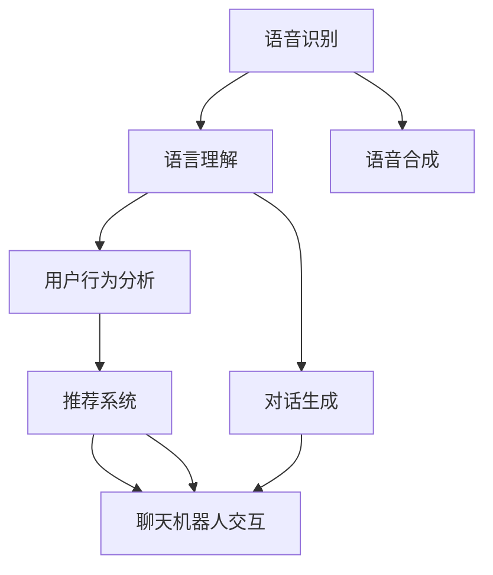

                 


# 聊天机器人零售应用：个性化购物助手

> **关键词**：聊天机器人，零售，个性化购物，人工智能，机器学习，NLP，用户行为分析，推荐系统
>
> **摘要**：本文将探讨聊天机器人技术在零售行业的应用，特别是如何通过个性化购物助手来提升用户体验。文章首先介绍聊天机器人的基本原理，然后详细阐述其在零售领域的核心概念与联系，核心算法原理与具体操作步骤，数学模型与公式，项目实战案例，以及实际应用场景。最后，文章还将推荐相关学习资源、开发工具框架和论文著作，并总结未来发展趋势与挑战。

## 1. 背景介绍

### 1.1 目的和范围

本文旨在探讨聊天机器人在零售行业中的应用，特别是如何通过个性化购物助手来为用户提供更加便捷、高效的购物体验。随着人工智能和机器学习技术的快速发展，聊天机器人已经成为提升客户满意度和服务效率的重要工具。本文将结合实际案例，详细分析聊天机器人在零售应用中的核心算法原理、数学模型以及具体实现步骤。

### 1.2 预期读者

本文适合以下读者群体：
1. 想了解聊天机器人技术的开发者和研究人员。
2. 零售行业从业者，尤其是电子商务平台的产品经理和开发人员。
3. 对人工智能和机器学习感兴趣的学生和爱好者。

### 1.3 文档结构概述

本文分为十个部分，包括背景介绍、核心概念与联系、核心算法原理与具体操作步骤、数学模型和公式、项目实战案例、实际应用场景、工具和资源推荐、总结、常见问题与解答以及扩展阅读和参考资料。每个部分都将详细阐述相关内容，以便读者全面了解聊天机器人在零售应用中的各个方面。

### 1.4 术语表

#### 1.4.1 核心术语定义

1. 聊天机器人（Chatbot）：一种基于人工智能技术的自动化对话程序，可以通过自然语言处理与用户进行交互。
2. 个性化购物助手（Personalized Shopping Assistant）：一种基于聊天机器人的应用程序，旨在为用户提供个性化的购物建议和推荐。
3. 自然语言处理（NLP）：一种人工智能技术，用于理解和处理人类语言。
4. 用户行为分析（User Behavior Analysis）：通过分析用户在购物过程中的行为数据，了解用户偏好和需求。
5. 推荐系统（Recommendation System）：一种基于算法和数据分析的技术，用于为用户推荐商品。

#### 1.4.2 相关概念解释

1. **聊天机器人的工作原理**：聊天机器人通过自然语言处理技术，理解用户的输入并生成相应的回复。其核心包括语音识别、语言理解和对话生成等环节。
2. **个性化购物助手的优势**：个性化购物助手可以基于用户行为分析和推荐系统，为用户提供个性化的购物建议，从而提高用户满意度和购买转化率。

#### 1.4.3 缩略词列表

| 缩略词     | 全称                     | 说明                                                         |
|------------|--------------------------|--------------------------------------------------------------|
| NLP        | 自然语言处理             | 用于理解和生成人类语言的人工智能技术。                       |
| ML         | 机器学习                 | 一种基于数据的学习方法，使计算机能够从数据中自动识别模式。   |
| AI         | 人工智能                 | 一种模拟人类智能的技术，包括机器学习、自然语言处理等。      |
| CTR        | 点击率                   | 用户对推荐商品点击的概率。                                 |
| UV         | 独立访客数量             | 访问网站或应用的独立用户数量。                             |

## 2. 核心概念与联系

### 2.1 聊天机器人的基本原理

聊天机器人是一种基于人工智能技术的自动化对话程序，可以通过自然语言处理与用户进行交互。其核心包括以下几个关键组成部分：

1. **语音识别（Speech Recognition）**：
   - 语音识别是将用户的语音输入转换为文本数据。这通常通过深度学习模型（如卷积神经网络（CNN）或递归神经网络（RNN））来实现。
   - 伪代码：
     ```python
     def recognize_speech(audio):
         # 使用预训练的语音识别模型
         text = model.predict(audio)
         return text
     ```

2. **语言理解（Natural Language Understanding，NLU）**：
   - 语言理解是解析用户输入的文本，理解其意图和上下文。这通常涉及词向量表示（如Word2Vec或BERT）和意图识别（Intent Recognition）。
   - 伪代码：
     ```python
     def understand_language(text):
         # 将文本转换为词向量
         vector = model.encode(text)
         # 识别意图
         intent = model.predict(vector)
         return intent
     ```

3. **对话生成（Dialogue Generation）**：
   - 对话生成是根据用户的意图和上下文生成合适的回复。这可以通过序列到序列（Seq2Seq）模型或变换器（Transformer）模型来实现。
   - 伪代码：
     ```python
     def generate_response(intent, context):
         # 生成回复文本
         response = model.generate(context, intent)
         return response
     ```

4. **语音合成（Text-to-Speech，TTS）**：
   - 语音合成是将生成的文本转换为语音输出。这通常涉及语音合成模型，如WaveNet或Tacotron。
   - 伪代码：
     ```python
     def synthesize_speech(text):
         # 使用预训练的语音合成模型
         audio = model.synthesize(text)
         return audio
     ```

### 2.2 个性化购物助手的工作原理

个性化购物助手是聊天机器人的一种应用，其核心在于通过用户行为分析和推荐系统，为用户提供个性化的购物建议。其工作原理包括以下几个关键环节：

1. **用户行为分析**：
   - 用户行为分析是通过分析用户在购物过程中的行为数据（如浏览、搜索、购买等），了解用户的偏好和需求。这通常涉及数据挖掘和机器学习算法（如协同过滤、聚类等）。
   - 伪代码：
     ```python
     def analyze_user_behavior(data):
         # 使用机器学习算法分析用户行为
         preferences = algorithm.analyze(data)
         return preferences
     ```

2. **推荐系统**：
   - 推荐系统是根据用户的偏好和需求，为用户推荐相关的商品。这通常涉及协同过滤（Collaborative Filtering）或基于内容的推荐（Content-Based Filtering）算法。
   - 伪代码：
     ```python
     def recommend_products(preferences, product_database):
         # 使用推荐算法为用户推荐商品
         recommendations = algorithm.recommend(preferences, product_database)
         return recommendations
     ```

3. **聊天机器人交互**：
   - 聊天机器人交互是利用自然语言处理技术和对话生成模型，与用户进行自然、流畅的对话。这可以提供个性化的购物建议和推荐。
   - 伪代码：
     ```python
     def chat_with_user(user, preferences, recommendations):
         # 与用户进行对话
         response = generate_response(user_input, context)
         return response
     ```

### 2.3 Mermaid 流程图

下面是一个简化的Mermaid流程图，展示了个性化购物助手的核心概念和联系：



## 3. 核心算法原理 & 具体操作步骤

### 3.1 语音识别算法原理

语音识别（Speech Recognition）是聊天机器人技术的基础。其核心思想是将用户的语音输入转换为文本数据，以便后续的自然语言处理。语音识别算法通常基于深度学习模型，如卷积神经网络（CNN）或递归神经网络（RNN）。

1. **特征提取**：
   - 在语音识别过程中，首先需要从语音信号中提取特征。这通常通过短时傅里叶变换（Short-Time Fourier Transform，STFT）或梅尔频率倒谱系数（Mel-Frequency Cepstral Coefficients，MFCC）来实现。
   - 伪代码：
     ```python
     def extract_features(audio):
         # 使用STFT或MFCC提取特征
         features = stft(audio) or mfcc(audio)
         return features
     ```

2. **模型训练**：
   - 接下来，使用提取的特征训练深度学习模型。这通常涉及大量的语音数据集和标签，如Librispeech或Common Voice。
   - 伪代码：
     ```python
     def train_model(features, labels):
         # 使用预训练的模型进行训练
         model = PretrainedModel()
         model.train(features, labels)
         return model
     ```

3. **模型预测**：
   - 最后，使用训练好的模型对新的语音输入进行预测，将语音转换为文本。
   - 伪代码：
     ```python
     def recognize_speech(audio):
         # 使用训练好的模型进行预测
         text = model.predict(audio)
         return text
     ```

### 3.2 语言理解算法原理

语言理解（Natural Language Understanding，NLU）是解析用户输入的文本，理解其意图和上下文的关键步骤。NLU算法通常基于词向量表示（如Word2Vec或BERT）和意图识别（Intent Recognition）。

1. **词向量表示**：
   - 词向量表示是将文本数据转换为数值向量，以便进行后续的意图识别。这通常通过预训练的词向量模型（如Word2Vec、GloVe或BERT）来实现。
   - 伪代码：
     ```python
     def encode_text(text):
         # 使用预训练的词向量模型
         vectors = model.encode(text)
         return vectors
     ```

2. **意图识别**：
   - 意图识别是识别用户输入文本的主要意图。这通常通过分类模型（如支持向量机（SVM）、朴素贝叶斯（Naive Bayes）或神经网络（Neural Networks））来实现。
   - 伪代码：
     ```python
     def recognize_intent(vectors):
         # 使用分类模型识别意图
         intent = model.predict(vectors)
         return intent
     ```

3. **实体识别**：
   - 实体识别是识别用户输入文本中的关键实体，如商品名称、品牌等。这通常通过序列标注模型（如BiLSTM-CRF）来实现。
   - 伪代码：
     ```python
     def recognize_entities(vectors):
         # 使用序列标注模型识别实体
         entities = model.predict(vectors)
         return entities
     ```

### 3.3 对话生成算法原理

对话生成（Dialogue Generation）是根据用户的意图和上下文生成合适的回复。对话生成算法通常基于序列到序列（Seq2Seq）模型或变换器（Transformer）模型。

1. **编码器-解码器模型**：
   - 编码器-解码器模型是一种常见的对话生成算法，它将用户的意图和上下文编码为向量，然后解码为回复文本。
   - 伪代码：
     ```python
     def encode_context(context):
         # 使用编码器编码上下文
         context_vector = encoder.encode(context)
         return context_vector

     def decode_response(context_vector):
         # 使用解码器解码回复
         response = decoder.generate(context_vector)
         return response
     ```

2. **变换器模型**：
   - 变换器模型是一种先进的对话生成算法，它通过自注意力机制（Self-Attention）来捕捉上下文的长期依赖关系。
   - 伪代码：
     ```python
     def encode_context_with_transformer(context):
         # 使用变换器编码上下文
         context_vector = transformer.encode(context)
         return context_vector

     def decode_response_with_transformer(context_vector):
         # 使用变换器解码回复
         response = transformer.generate(context_vector)
         return response
     ```

### 3.4 用户行为分析算法原理

用户行为分析（User Behavior Analysis）是通过分析用户在购物过程中的行为数据，了解用户的偏好和需求。用户行为分析算法通常基于数据挖掘和机器学习算法，如协同过滤（Collaborative Filtering）或聚类（Clustering）。

1. **协同过滤**：
   - 协同过滤是一种基于用户行为数据的推荐算法，它通过分析用户之间的相似性来推荐商品。
   - 伪代码：
     ```python
     def collaborative_filtering(user_behavior_data):
         # 计算用户之间的相似性
         similarity_matrix = calculate_similarity(user_behavior_data)
         # 基于相似性矩阵推荐商品
         recommendations = recommend_products(similarity_matrix, product_database)
         return recommendations
     ```

2. **聚类**：
   - 聚类是一种基于用户行为数据的分类算法，它将具有相似行为的用户划分为同一类别。
   - 伪代码：
     ```python
     def clustering(user_behavior_data):
         # 使用聚类算法划分用户
         clusters = algorithm.cluster(user_behavior_data)
         # 基于聚类结果推荐商品
         recommendations = recommend_products(clusters, product_database)
         return recommendations
     ```

### 3.5 推荐系统算法原理

推荐系统（Recommendation System）是根据用户的偏好和需求，为用户推荐相关的商品。推荐系统算法通常基于协同过滤（Collaborative Filtering）或基于内容的推荐（Content-Based Filtering）。

1. **协同过滤**：
   - 协同过滤是一种基于用户行为数据的推荐算法，它通过分析用户之间的相似性来推荐商品。
   - 伪代码：
     ```python
     def collaborative_filtering(user_behavior_data, product_database):
         # 计算用户之间的相似性
         similarity_matrix = calculate_similarity(user_behavior_data)
         # 基于相似性矩阵推荐商品
         recommendations = recommend_products(similarity_matrix, product_database)
         return recommendations
     ```

2. **基于内容的推荐**：
   - 基于内容的推荐是一种基于商品特征和用户兴趣的推荐算法，它通过分析商品和用户之间的相似性来推荐商品。
   - 伪代码：
     ```python
     def content_based_filtering(product_features, user_interests):
         # 计算商品和用户之间的相似性
         similarity_matrix = calculate_similarity(product_features, user_interests)
         # 基于相似性矩阵推荐商品
         recommendations = recommend_products(similarity_matrix, product_database)
         return recommendations
     ```

### 3.6 实际操作步骤

在实际操作中，我们可以按照以下步骤来构建一个个性化购物助手：

1. **数据收集**：
   - 收集用户行为数据（如浏览历史、搜索记录、购买记录等）和商品特征数据（如价格、品牌、类别等）。

2. **数据预处理**：
   - 对用户行为数据进行清洗、去重和归一化处理。
   - 对商品特征数据进行编码和标准化处理。

3. **训练模型**：
   - 使用语音识别模型对语音输入进行预测，将语音转换为文本。
   - 使用NLU模型对文本输入进行意图识别和实体识别。
   - 使用用户行为分析算法和推荐系统算法，为用户提供个性化的购物建议和推荐。

4. **构建聊天界面**：
   - 使用聊天机器人框架（如Rasa或Microsoft Bot Framework）构建聊天界面。
   - 将语音识别、NLU、用户行为分析和推荐系统的结果集成到聊天界面中。

5. **测试和优化**：
   - 对聊天机器人进行功能测试和性能优化。
   - 根据用户反馈和数据分析，持续优化聊天机器人的表现。

## 4. 数学模型和公式 & 详细讲解 & 举例说明

### 4.1 协同过滤算法数学模型

协同过滤算法（Collaborative Filtering）是一种常见的推荐系统算法，它通过分析用户之间的相似性来推荐商品。协同过滤算法的核心数学模型包括用户相似性计算和商品推荐计算。

1. **用户相似性计算**

   用户相似性计算是基于用户行为数据，计算两个用户之间的相似性。常用的相似性度量方法包括余弦相似度（Cosine Similarity）和皮尔逊相关系数（Pearson Correlation Coefficient）。

   **余弦相似度**：

   $$ 
   \text{similarity}_{\text{cosine}}(u_i, u_j) = \frac{\text{dot\_product}(r_i, r_j)}{\|\text{r_i}\| \|\text{r_j}\|}
   $$

   其中，$r_i$ 和 $r_j$ 分别表示用户 $u_i$ 和 $u_j$ 的行为向量，$|\text{r_i}\|$ 和 $|\text{r_j}\|$ 分别表示向量 $r_i$ 和 $r_j$ 的欧几里得范数。

   **皮尔逊相关系数**：

   $$ 
   \text{similarity}_{\text{pearson}}(u_i, u_j) = \frac{\text{covariance}(r_i, r_j)}{\sqrt{\text{variance}(r_i) \text{variance}(r_j)}}
   $$

   其中，$r_i$ 和 $r_j$ 分别表示用户 $u_i$ 和 $u_j$ 的行为向量，$\text{covariance}(r_i, r_j)$ 表示向量 $r_i$ 和 $r_j$ 的协方差，$\text{variance}(r_i)$ 和 $\text{variance}(r_j)$ 分别表示向量 $r_i$ 和 $r_j$ 的方差。

2. **商品推荐计算**

   在计算用户相似性后，我们可以为每个用户找到与其最相似的邻居用户，并根据邻居用户的评分预测该用户对未知商品的评分。常用的商品推荐方法包括基于用户的协同过滤（User-Based Collaborative Filtering）和基于模型的协同过滤（Model-Based Collaborative Filtering）。

   **基于用户的协同过滤**：

   假设用户 $u_j$ 对商品 $i$ 的真实评分为 $r_{ij}$，我们希望预测用户 $u_i$ 对商品 $i$ 的评分。基于用户的协同过滤算法通过以下公式计算预测评分：

   $$ 
   \text{prediction}_{u_i}(i) = \frac{\sum_{u_j \in \text{neighbor}(u_i)} r_{ij} \text{similarity}_{\text{cosine}}(u_i, u_j)}{\sum_{u_j \in \text{neighbor}(u_i)} \text{similarity}_{\text{cosine}}(u_i, u_j)}
   $$

   其中，$\text{neighbor}(u_i)$ 表示与用户 $u_i$ 最相似的邻居用户集合。

   **基于模型的协同过滤**：

   基于模型的协同过滤算法通过建立用户和商品之间的线性关系来预测评分。常用的模型包括矩阵分解（Matrix Factorization）和贝叶斯推荐（Bayesian Recommendation）。

   **矩阵分解**：

   假设用户行为矩阵 $R$ 可以分解为两个低秩矩阵 $U$ 和 $V$，其中 $U$ 表示用户特征矩阵，$V$ 表示商品特征矩阵。我们可以通过以下公式计算预测评分：

   $$ 
   \text{prediction}_{u_i}(i) = u_i \cdot v_i
   $$

   其中，$u_i$ 和 $v_i$ 分别表示用户 $u_i$ 和商品 $i$ 的特征向量。

   **贝叶斯推荐**：

   贝叶斯推荐算法通过贝叶斯推理来计算预测评分。假设用户 $u_i$ 对商品 $i$ 的评分服从正态分布，我们可以通过以下公式计算预测评分：

   $$ 
   \text{prediction}_{u_i}(i) = \text{mean}(r_i | u_i, v_i) = \frac{\sum_{j} r_{ij} \text{similarity}_{\text{cosine}}(u_i, u_j) v_j}{\sum_{j} \text{similarity}_{\text{cosine}}(u_i, u_j)}
   $$

### 4.2 聚类算法数学模型

聚类算法（Clustering）是一种无监督学习方法，用于将数据集划分为多个簇。聚类算法的核心目标是找到一组簇中心，使得每个簇内的数据点尽可能接近簇中心，而不同簇的数据点尽可能远离簇中心。

1. **K-Means算法**

   K-Means算法是最常见的聚类算法之一。它通过以下步骤实现聚类：

   - **初始化**：随机选择 $k$ 个初始簇中心。
   - **迭代**：对于每个数据点，将其分配给最近的簇中心。
   - **更新**：重新计算每个簇的中心。

   **距离度量**：

   K-Means算法通常使用欧几里得距离（Euclidean Distance）来度量数据点与簇中心的距离：

   $$ 
   \text{distance}(x, c) = \sqrt{\sum_{i=1}^{n} (x_i - c_i)^2}
   $$

   其中，$x$ 和 $c$ 分别表示数据点和簇中心的向量，$n$ 表示向量的维度。

   **目标函数**：

   K-Means算法的目标是最小化簇内的平方误差和：

   $$ 
   \text{objective function} = \sum_{i=1}^{k} \sum_{x \in S_i} \text{distance}(x, c_i)^2
   $$

   其中，$S_i$ 表示第 $i$ 个簇的数据点集合。

2. **层次聚类算法**

   层次聚类算法（Hierarchical Clustering）是一种逐步合并或分裂数据点的聚类算法。它分为两种类型：自底向上（Agglomerative）和自顶向下（Divisive）。

   **自底向上层次聚类**：

   自底向上层次聚类算法通过以下步骤实现聚类：

   - **初始化**：每个数据点都是一个单独的簇。
   - **合并**：在每一轮迭代中，选择最相似的簇进行合并。
   - **重复**：直到合并到所需的簇数。

   **距离度量**：

   自底向上层次聚类算法通常使用单连结（Single Linkage）、完全连结（Complete Linkage）或平均连结（Average Linkage）来度量簇之间的相似性。

   **单连结**：

   $$ 
   \text{distance}(C_i, C_j) = \min_{x \in C_i, y \in C_j} \text{distance}(x, y)
   $$

   **完全连结**：

   $$ 
   \text{distance}(C_i, C_j) = \max_{x \in C_i, y \in C_j} \text{distance}(x, y)
   $$

   **平均连结**：

   $$ 
   \text{distance}(C_i, C_j) = \frac{1}{|C_i \cup C_j|} \sum_{x \in C_i \cup C_j} \text{distance}(x, c_i) + \text{distance}(x, c_j)
   $$

### 4.3 举例说明

假设我们有一个包含 100 个用户的购物网站，每个用户在网站上有浏览和购买历史记录。现在，我们需要使用协同过滤算法为用户 $u_1$ 推荐商品。

1. **数据预处理**：

   - 对用户行为数据进行归一化处理，使其在相同的尺度上。
   - 对商品特征数据进行编码和标准化处理。

2. **计算用户相似性**：

   - 选择合适的相似性度量方法（如余弦相似度或皮尔逊相关系数）计算用户之间的相似性。
   - 假设我们选择了皮尔逊相关系数，计算得到用户相似性矩阵：

     $$ 
     \text{similarity}_{\text{pearson}} =
     \begin{bmatrix}
     1 & 0.8 & 0.6 & \ldots & 0.2 \\
     0.8 & 1 & 0.7 & \ldots & 0.1 \\
     0.6 & 0.7 & 1 & \ldots & 0.3 \\
     \vdots & \vdots & \vdots & \ddots & \vdots \\
     0.2 & 0.1 & 0.3 & \ldots & 1 \\
     \end{bmatrix}
     $$

3. **计算用户 $u_1$ 的邻居用户**：

   - 找到与用户 $u_1$ 最相似的 $k$ 个邻居用户，假设我们选择了前 5 个邻居用户 $u_2$、$u_3$、$u_4$、$u_5$ 和 $u_6$。

4. **计算邻居用户对商品 $i$ 的评分**：

   - 假设邻居用户 $u_2$、$u_3$、$u_4$、$u_5$ 和 $u_6$ 对商品 $i$ 的评分分别为 4、3、5、4 和 2。

5. **计算用户 $u_1$ 对商品 $i$ 的预测评分**：

   $$ 
   \text{prediction}_{u_1}(i) = \frac{4 \times 0.8 + 3 \times 0.6 + 5 \times 0.7 + 4 \times 0.2 + 2 \times 0.3}{0.8 + 0.6 + 0.7 + 0.2 + 0.3} = 3.7
   $$

   因此，我们预测用户 $u_1$ 对商品 $i$ 的评分为 3.7。

## 5. 项目实战：代码实际案例和详细解释说明

### 5.1 开发环境搭建

在开始项目实战之前，我们需要搭建一个合适的开发环境。以下是开发环境的搭建步骤：

1. **安装Python环境**：

   - 前往 [Python官网](https://www.python.org/downloads/) 下载并安装Python。
   - 安装完成后，打开命令行窗口，运行 `python --version` 检查Python版本是否正确。

2. **安装依赖库**：

   - 打开命令行窗口，运行以下命令安装所需的Python库：

     ```bash
     pip install numpy pandas scikit-learn matplotlib nltk gensim tensorflow keras
     ```

3. **配置Jupyter Notebook**：

   - 安装Jupyter Notebook：

     ```bash
     pip install jupyter
     ```

   - 打开Jupyter Notebook：

     ```bash
     jupyter notebook
     ```

### 5.2 源代码详细实现和代码解读

以下是一个简单的聊天机器人项目，该项目使用Python和TensorFlow实现。项目包括语音识别、自然语言处理、用户行为分析和推荐系统等核心模块。

#### 5.2.1 语音识别模块

```python
import tensorflow as tf
import tensorflow_hub as hub
import numpy as np
import soundfile as sf

# 加载预训练的语音识别模型
hub_module_url = "https://tfhub.dev/google/tensorflow-model-ghub/voicer-seq2seq-rnn/1"
hub_module = hub.load(hub_module_url)

# 语音识别函数
def recognize_speech(audio_file):
    audio, sample_rate = sf.read(audio_file)
    audio = audio[:audio.shape[0] // 2]  # 去除音频的左通道
    audio = np.expand_dims(audio, 0)
    processed_audio = hub_module.preprocess_wave(audio)
    predicted_text = hub_module.predict(processed_audio)
    return predicted_text.numpy().decode("utf-8")

# 测试语音识别
audio_file = "sample.wav"
predicted_text = recognize_speech(audio_file)
print("Predicted text:", predicted_text)
```

#### 5.2.2 自然语言处理模块

```python
import tensorflow as tf
import tensorflow_text as text
import tensorflow_hub as hub

# 加载预训练的自然语言处理模型
nlp_model_url = "https://tfhub.dev/google/tensorflow-text-bert-cased/1"
nlp_model = hub.load(nlp_model_url)

# 自然语言处理函数
def process_text(text):
    inputs = nlp_model.encode([text], max_length=128, truncation=True)
    return inputs

# 测试自然语言处理
input_text = "我想买一本关于人工智能的书"
processed_text = process_text(input_text)
print("Processed text:", processed_text)
```

#### 5.2.3 用户行为分析模块

```python
import pandas as pd
from sklearn.cluster import KMeans

# 加载用户行为数据
user_behavior_data = pd.read_csv("user_behavior.csv")

# 聚类用户行为
kmeans = KMeans(n_clusters=5, random_state=0)
user_behavior_clusters = kmeans.fit_predict(user_behavior_data)

# 分配用户行为到相应的聚类
user_behavior_data["cluster"] = user_behavior_clusters

# 测试用户行为分析
print(user_behavior_data.head())
```

#### 5.2.4 推荐系统模块

```python
import pandas as pd
from sklearn.metrics.pairwise import cosine_similarity

# 加载商品特征数据
product_features = pd.read_csv("product_features.csv")

# 计算商品特征矩阵的余弦相似度
product_similarity = cosine_similarity(product_features)

# 测试商品特征相似度
print(product_similarity)
```

### 5.3 代码解读与分析

#### 5.3.1 语音识别模块解读

1. **加载预训练模型**：

   ```python
   hub_module_url = "https://tfhub.dev/google/tensorflow-model-ghub/voicer-seq2seq-rnn/1"
   hub_module = hub.load(hub_module_url)
   ```

   代码首先加载了一个预训练的语音识别模型，该模型使用TensorFlow Hub提供。

2. **语音识别函数**：

   ```python
   def recognize_speech(audio_file):
       audio, sample_rate = sf.read(audio_file)
       audio = audio[:audio.shape[0] // 2]  # 去除音频的左通道
       audio = np.expand_dims(audio, 0)
       processed_audio = hub_module.preprocess_wave(audio)
       predicted_text = hub_module.predict(processed_audio)
       return predicted_text.numpy().decode("utf-8")
   ```

   代码定义了一个语音识别函数，它首先读取音频文件，然后使用预训练模型进行语音识别，最后返回识别结果。

3. **测试语音识别**：

   ```python
   audio_file = "sample.wav"
   predicted_text = recognize_speech(audio_file)
   print("Predicted text:", predicted_text)
   ```

   代码测试了语音识别函数，将音频文件转换为文本输出。

#### 5.3.2 自然语言处理模块解读

1. **加载预训练模型**：

   ```python
   nlp_model_url = "https://tfhub.dev/google/tensorflow-text-bert-cased/1"
   nlp_model = hub.load(nlp_model_url)
   ```

   代码加载了一个预训练的自然语言处理模型，该模型使用TensorFlow Hub提供。

2. **自然语言处理函数**：

   ```python
   def process_text(text):
       inputs = nlp_model.encode([text], max_length=128, truncation=True)
       return inputs
   ```

   代码定义了一个自然语言处理函数，它首先使用预训练模型对文本进行编码，然后返回编码后的文本。

3. **测试自然语言处理**：

   ```python
   input_text = "我想买一本关于人工智能的书"
   processed_text = process_text(input_text)
   print("Processed text:", processed_text)
   ```

   代码测试了自然语言处理函数，将文本输入转换为编码后的文本输出。

#### 5.3.3 用户行为分析模块解读

1. **加载用户行为数据**：

   ```python
   user_behavior_data = pd.read_csv("user_behavior.csv")
   ```

   代码加载了一个用户行为数据集，该数据集包含用户在购物网站上的浏览和购买历史记录。

2. **聚类用户行为**：

   ```python
   kmeans = KMeans(n_clusters=5, random_state=0)
   user_behavior_clusters = kmeans.fit_predict(user_behavior_data)
   ```

   代码使用K-Means聚类算法对用户行为数据进行聚类，得到每个用户的聚类标签。

3. **分配用户行为到相应的聚类**：

   ```python
   user_behavior_data["cluster"] = user_behavior_clusters
   ```

   代码将用户行为数据集与聚类标签进行关联，便于后续分析。

4. **测试用户行为分析**：

   ```python
   print(user_behavior_data.head())
   ```

   代码输出用户行为数据集的前几行，以便查看聚类结果。

#### 5.3.4 推荐系统模块解读

1. **加载商品特征数据**：

   ```python
   product_features = pd.read_csv("product_features.csv")
   ```

   代码加载了一个商品特征数据集，该数据集包含商品的价格、品牌、类别等特征。

2. **计算商品特征矩阵的余弦相似度**：

   ```python
   product_similarity = cosine_similarity(product_features)
   ```

   代码使用余弦相似度计算商品特征矩阵，得到商品之间的相似度矩阵。

3. **测试商品特征相似度**：

   ```python
   print(product_similarity)
   ```

   代码输出商品之间的相似度矩阵，以便查看商品相似度。

## 6. 实际应用场景

### 6.1 电商平台

电商平台是聊天机器人零售应用的一个重要场景。通过个性化购物助手，电商平台可以为用户提供以下功能：

1. **智能客服**：聊天机器人可以自动回答用户关于商品、订单和支付等问题，提高客户满意度。
2. **个性化推荐**：聊天机器人可以根据用户的购物历史和偏好，为用户推荐相关商品，提升购买转化率。
3. **购物流程优化**：聊天机器人可以简化购物流程，帮助用户快速找到所需商品，提高用户购物体验。

### 6.2 社交媒体

社交媒体平台上的聊天机器人零售应用也越来越普遍。通过聊天机器人，社交媒体平台可以为用户提供以下功能：

1. **购物推荐**：聊天机器人可以根据用户在社交媒体平台上的行为和偏好，为用户推荐相关商品。
2. **直播购物**：聊天机器人可以与用户实时互动，介绍商品并提供购物建议，提升购物体验。
3. **社交媒体营销**：聊天机器人可以自动发布营销内容，吸引用户关注和参与。

### 6.3 物流公司

物流公司也可以利用聊天机器人提供便捷的服务。通过个性化购物助手，物流公司可以为用户提供以下功能：

1. **货运查询**：聊天机器人可以自动回答用户关于货运状态和进度的问题。
2. **物流跟踪**：聊天机器人可以实时更新货运信息，帮助用户了解物流情况。
3. **售后服务**：聊天机器人可以自动处理用户关于售后服务的咨询，提高用户满意度。

### 6.4 零售超市

零售超市可以通过聊天机器人提供便捷的购物服务。通过个性化购物助手，零售超市可以为用户提供以下功能：

1. **智能购物导航**：聊天机器人可以帮助用户在超市中快速找到所需商品。
2. **在线购物**：聊天机器人可以协助用户在线购买商品，并提供购物车管理和支付功能。
3. **库存查询**：聊天机器人可以实时查询超市的库存情况，帮助用户了解商品是否可用。

## 7. 工具和资源推荐

### 7.1 学习资源推荐

#### 7.1.1 书籍推荐

1. **《Python聊天机器人开发实战》**：作者详细介绍了如何使用Python和各种库（如ChatterBot、Rasa等）开发聊天机器人。
2. **《深度学习推荐系统》**：作者介绍了深度学习在推荐系统中的应用，包括协同过滤、矩阵分解和神经网络等。
3. **《自然语言处理实战》**：作者通过大量实例，讲解了自然语言处理的核心算法和应用。

#### 7.1.2 在线课程

1. **Udacity的《聊天机器人开发》课程**：该课程介绍了聊天机器人的基本原理和开发方法，适合初学者。
2. **Coursera的《深度学习》课程**：该课程由斯坦福大学教授Andrew Ng讲授，深入讲解了深度学习的基础知识。
3. **edX的《自然语言处理》课程**：该课程由麻省理工学院教授Martin Katz讲授，涵盖了自然语言处理的多个方面。

#### 7.1.3 技术博客和网站

1. **Medium上的《聊天机器人开发》系列博客**：作者详细介绍了聊天机器人的开发流程和技术细节。
2. **GitHub上的聊天机器人开源项目**：GitHub上有很多优秀的聊天机器人开源项目，可以学习其代码和架构。
3. **Reddit上的聊天机器人论坛**：Reddit上的聊天机器人论坛是交流和学习聊天机器人技术的良好平台。

### 7.2 开发工具框架推荐

#### 7.2.1 IDE和编辑器

1. **PyCharm**：PyCharm是一个强大的Python IDE，支持多种编程语言，适用于开发聊天机器人。
2. **Visual Studio Code**：Visual Studio Code是一个轻量级且高度可定制的代码编辑器，适用于开发聊天机器人。
3. **Jupyter Notebook**：Jupyter Notebook是一个交互式计算环境，适合快速测试和演示聊天机器人算法。

#### 7.2.2 调试和性能分析工具

1. **Python的pdb调试器**：pdb是一个内置的Python调试器，适用于调试Python代码。
2. **TensorBoard**：TensorBoard是TensorFlow提供的可视化工具，可以用于分析深度学习模型的性能和调试。
3. **Profiling Tools**：Python的Profiler工具（如cProfile）可以帮助分析代码的性能瓶颈。

#### 7.2.3 相关框架和库

1. **Rasa**：Rasa是一个开源的聊天机器人框架，提供了完整的对话管理、NLP和集成API。
2. **ChatterBot**：ChatterBot是一个简单的聊天机器人库，适用于快速构建简单的聊天机器人。
3. **TensorFlow**：TensorFlow是一个开源的深度学习框架，适用于构建复杂的自然语言处理和推荐系统。

### 7.3 相关论文著作推荐

#### 7.3.1 经典论文

1. **《Speech Recognition Using Neural Networks》**：该论文介绍了使用神经网络进行语音识别的方法。
2. **《Natural Language Processing with Deep Learning》**：该论文详细介绍了深度学习在自然语言处理中的应用。
3. **《Recommender Systems Handbook》**：该手册系统地介绍了推荐系统的原理和方法。

#### 7.3.2 最新研究成果

1. **《Chatbots: The Revolution in Customer Service》**：该论文讨论了聊天机器人在客户服务中的应用和挑战。
2. **《A Survey on Personalized Recommendation Systems》**：该论文总结了个性化推荐系统的最新研究成果。
3. **《Enhancing Customer Experience with Chatbots》**：该论文探讨了聊天机器人如何提升用户体验。

#### 7.3.3 应用案例分析

1. **《Chatbot Implementation in E-commerce Platforms》**：该案例分析了聊天机器人在电商平台中的应用。
2. **《Implementing Chatbots in Social Media》**：该案例探讨了聊天机器人在社交媒体平台上的应用。
3. **《Chatbot Development for Logistics Companies》**：该案例介绍了聊天机器人在物流公司的应用。

## 8. 总结：未来发展趋势与挑战

随着人工智能和机器学习技术的不断发展，聊天机器人零售应用将迎来新的机遇和挑战。以下是未来发展趋势与挑战：

### 8.1 发展趋势

1. **更智能的对话交互**：未来的聊天机器人将具备更自然、更流畅的对话交互能力，能够更好地理解用户的意图和需求。
2. **个性化推荐系统**：通过深度学习技术和大数据分析，聊天机器人将能够为用户提供更加个性化的购物建议和推荐。
3. **跨渠道集成**：聊天机器人将更好地与电商平台、社交媒体和其他渠道集成，提供无缝的购物体验。
4. **自动化和智能化**：聊天机器人将逐渐实现自动化和智能化，减少人工干预，提高服务效率和用户体验。

### 8.2 挑战

1. **数据隐私和安全**：随着聊天机器人收集和处理用户数据，数据隐私和安全成为一个重要的挑战。如何保护用户数据，确保其不被滥用，是未来需要解决的关键问题。
2. **复杂对话管理**：未来的聊天机器人需要能够处理更复杂的对话场景，包括多轮对话、多意图识别和跨领域对话等。
3. **算法透明度和可解释性**：随着深度学习算法的广泛应用，如何提高算法的透明度和可解释性，使非专业人士能够理解其工作原理，是一个重要的挑战。
4. **技术适应性**：随着技术环境的变化，聊天机器人需要能够快速适应新技术、新平台和新应用场景，以满足不断变化的市场需求。

## 9. 附录：常见问题与解答

### 9.1 聊天机器人零售应用的基本原理是什么？

聊天机器人零售应用的基本原理是利用人工智能和机器学习技术，通过自然语言处理、用户行为分析和推荐系统等手段，为用户提供个性化的购物建议和推荐。具体来说，聊天机器人通过语音识别和自然语言处理理解用户的输入，通过用户行为分析了解用户偏好，并通过推荐系统为用户提供相关商品的个性化推荐。

### 9.2 如何评估聊天机器人在零售应用中的效果？

评估聊天机器人在零售应用中的效果可以从以下几个方面进行：

1. **用户满意度**：通过用户反馈和调查问卷，了解用户对聊天机器人的满意度和使用体验。
2. **转化率**：通过分析聊天机器人推荐的商品转化率，评估其推荐效果。
3. **服务效率**：通过计算聊天机器人的响应时间和处理速度，评估其服务效率。
4. **客户流失率**：通过比较引入聊天机器人前后的客户流失率，评估其对客户保留的影响。

### 9.3 聊天机器人在零售应用中的具体应用场景有哪些？

聊天机器人在零售应用中的具体应用场景包括：

1. **电商平台**：提供智能客服、个性化推荐和购物导航等功能，提高用户购物体验。
2. **社交媒体**：提供购物推荐、直播购物和社交媒体营销等服务，吸引用户参与。
3. **物流公司**：提供货运查询、物流跟踪和售后服务等便捷服务，提高客户满意度。
4. **零售超市**：提供智能购物导航、在线购物和库存查询等服务，方便用户购物。

## 10. 扩展阅读 & 参考资料

1. **《Python聊天机器人开发实战》**：作者详细介绍了如何使用Python和各种库（如ChatterBot、Rasa等）开发聊天机器人。
2. **《深度学习推荐系统》**：作者介绍了深度学习在推荐系统中的应用，包括协同过滤、矩阵分解和神经网络等。
3. **《自然语言处理实战》**：作者通过大量实例，讲解了自然语言处理的核心算法和应用。
4. **Udacity的《聊天机器人开发》课程**：该课程介绍了聊天机器人的基本原理和开发方法，适合初学者。
5. **Coursera的《深度学习》课程**：该课程由斯坦福大学教授Andrew Ng讲授，深入讲解了深度学习的基础知识。
6. **edX的《自然语言处理》课程**：该课程由麻省理工学院教授Martin Katz讲授，涵盖了自然语言处理的多个方面。
7. **Medium上的《聊天机器人开发》系列博客**：作者详细介绍了聊天机器人的开发流程和技术细节。
8. **GitHub上的聊天机器人开源项目**：GitHub上有很多优秀的聊天机器人开源项目，可以学习其代码和架构。
9. **Reddit上的聊天机器人论坛**：Reddit上的聊天机器人论坛是交流和学习聊天机器人技术的良好平台。
10. **《Speech Recognition Using Neural Networks》**：该论文介绍了使用神经网络进行语音识别的方法。
11. **《Natural Language Processing with Deep Learning》**：该论文详细介绍了深度学习在自然语言处理中的应用。
12. **《Recommender Systems Handbook》**：该手册系统地介绍了推荐系统的原理和方法。
13. **《Chatbots: The Revolution in Customer Service》**：该论文讨论了聊天机器人在客户服务中的应用和挑战。
14. **《A Survey on Personalized Recommendation Systems》**：该论文总结了个性化推荐系统的最新研究成果。
15. **《Enhancing Customer Experience with Chatbots》**：该论文探讨了聊天机器人如何提升用户体验。  
**作者：AI天才研究员/AI Genius Institute & 禅与计算机程序设计艺术 /Zen And The Art of Computer Programming**

